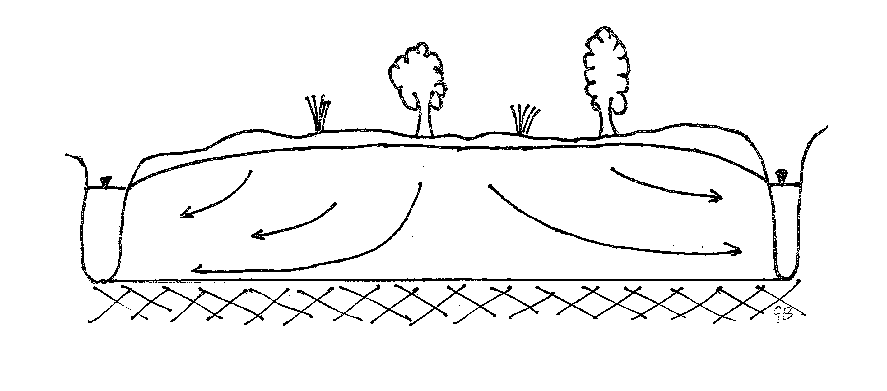
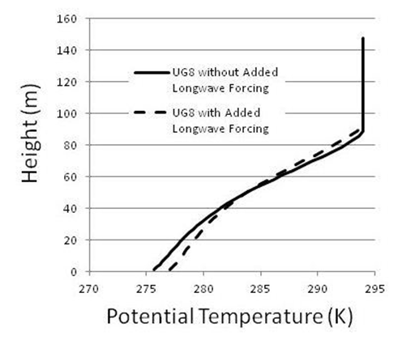

<!-- include the hint.js -->
<script src="hints.js"></script>

# Learning goals
*  Learning the steps to set up a numerical model (stationary, spatial 1D)
*	 Understanding the concepts of internal and external fluxes
*  Understanding the difference between linear and nonlinear system flow functions
*  Evaluating the model results by checking convergence, analytical solutions and water balances
*  Working with spatially varying parameters

#Part 1: stationary groundwater flow

## Introduction
The first part of this practical will deal with a hydrological problem: saturated groundwater flow. In the second part the same ideas will be applied to a meteorology case.

In this first example a model will be developed to simulate saturated groundwater flow towards two rivers, left and  right, in a one dimensional domain as shown in the graph below. Here the flow is stationary.

Figure 1 : 1D stationary saturated groundwater flow towards two rivers   
   
***   

The total length of the model is 200 m and both rivers form prescribed head (*Dirichlet*) boundary conditions with a level of 5 m A.M.S.L. (Above Mean Sea Level). The model is discretized with a nodal distance of 10 m.  
The recharge on top of the model is the only external flux and is $0.001 \, m/d$. The transmissivity $kD$ of the aquifer is $45 \, m^2/d$.  
The model will calculate the _hydraulic_ or _piezometric_ head which is:  

$$
H = \psi + z\\
$$

With:  

$H$: Hydraulic head (m)  

$\psi$: Pressure head (m)  

$z$: Elevation head (m)  

The reference level of the elevatio head coincides with the bottom of the aquifer and is in this case $z=0$.  

The graph below illustrates the relation between these variables. Imagine a bucket with a height of 1 meter and filled with water. The reference head (green line) equals 0.0 m at the bottom of the bucket, but the pressure head (red line) equals 1.0 m. The hydraulic head is a constant being 1.0 m (blue line). Suppose you would measure the pressure head at a height 0.20 m from the bottom. This would be 0.80 m (intersection point dashed line and red line). The elevation head is 0.20 m (intersection point dashed line and green line). Summing pressure head and elevation head results in the hydraulic head: $H=\psi+z=0.8+0.2=1.0 \, m$

```{r}
H = c(0,1)
z = c(0,1)
psi = c(1,0)
plot(c(0,1),z,type="l",col='green',lwd=3,xlab='heads (m)',ylab='z (m)')
lines(c(0,1),psi,col='red',lwd=3)
lines(c(1,1),H,col='blue',lwd=3)
abline(h=0.2,lty='dashed')
grid()
```

## Question 1: Internal flux

For this model we may distinguish two types of internal fluxes:  

* the _linear_ Darcy flux based on the Dupuit assumption with a constant saturated thickness in which the flow occurs (type 1 flux).  
* the _non-linear_ Darcy flux also based on the Dupuit assumption but with a saturated thickness which is determined by the calculated head (the state) in the model (type 2 flux).

<span class="question">
1.1 Give the formula for both equations.
</span>

<span class="student_answer">
Fill in your answer...
</span>

<div class="answer">
* type 1 internal flux is given by: 

$$\vec{Q} = - k\;D\; \frac{\partial H}{\partial x}$$

* type 2 internal flux is given by: 

$$\vec{Q} = - k\;H\; \frac{\partial H}{\partial x}$$
</div>

<span class="question">
1.2 What are the units of this model?
</span>

<div class="student_answer">
scales and units:

* space : 
* time  : 
* state :  
* internal flux:  
* external flux:  
</div>

<div class="answer">
scales and units:

* space: m (meters)
* time: d (day)
* state: m (meters)
* internal flux: m^2/d
* external flux: m/d
</div>

## Question 2: Mathematical model setup

<span class="question"> 2.1 Cleaning workspace and loading package </span> 

```{r}
rm(list=ls()) 
library(FVFE1D)
```

<span class="question"> 2.2 Setting the domain  </span>

<div class="student_answer">
```{r}
##insert your code here
```
</div>

<span class="answer">
```{r}
domain = c(0,200) 
```
</span>

<span class="question"> 2.3 The internal flux function  </span>  
Create the internal flux function here. It should be the linear Darcy flux function.  

<div class="student_answer">
```{r}
##insert your code here
```
</div>

<span class="answer">
```{r}
type1.flux = function(x,state,gradstate)  
{
  return(-45*gradstate) #45 being the kD and - for the flow direction
}
```
</span>

<span class="question"> 2.4 The first model  </span>  
Make your first groundwater model here.  

<div class="student_answer">
```{r}
##insert your code here
```
</div>

<span class="answer">
```{r}
grw_model_1 = newFLOW1D(domain=domain,systemfluxfunction = type1.flux) 
```
</span>

<span class="question"> 2.5 The boundary conditions </span>  
Define the required boundary conditions here. These are the prescribed heads (water levels) of both rivers.  

<div class="student_answer">
```{r}
## insert your code here
```
</div>

<span class="answer">
```{r}
set.BC.fixedstate(grw_model_1,'left',5) 
set.BC.fixedstate(grw_model_1,'right',5)
```
</span>

<span class="question"> 2.6 Adding recharge </span>    
Create a __spatial flux__ here. 

<div class="student_answer">
```{r}
##insert your code here
```
</div>

<span class="answer">
```{r}
add.spatialflux(grw_model_1,0.001,"recharge")  #all length units are in meters
```
</span>

<span class="question"> 2.7 Giving the model a name  </span>     
You can give the model a specific name. It is not required though.

<div class="student_answer">
```{r}
##insert your code here
```
</div>

<span class="answer">
```{r}
set.name(grw_model_1,'type 1 1D groundwater model ')
```
</span>

## Question 3: Numerical model setup

The above created the mathematical or conceptual model setup.  
Now the numerical setup needs to be formulated.

<span class="question"> 3.1 Make the model discrete  </span>        
Use the spatial $\Delta x$ here to define the (number of) nodes.  
Make the model discrete using these nodes and set the type of numerical approximation.  

<span class="student_answer">
```{r}
##insert your code here
```
</span>

<span class="answer">
```{r}
nodes = seq(from=domain[1],to=domain[2],by=10)
set.discretisation(grw_model_1,nodes,method='FV') 
```
</span>

## Question 4: Solving and checking convergence

Solve the model in the following chunk.
<span class="student_answer">
```{r}
##insert your code here
```
</span>

<span class="answer">
```{r}
control = solve.steps(grw_model_1)
print(control)
```
</span>

The low values of RMSM and MAM show that the solution has converged.

<span class="question">
4.1 What do the RMSM and MAM signify? Look at the FVFE1D package documentation.
</span>

<span class="student_answer">
Fill in your answer...
</span>

<span class="answer">
The RMSM and MAM are measures of the misfits of the model. The misfit of each node shows how much its mass balance currently differs from zero. RMSM=root mean squared misfit; MAM=maximum absolute misfit. When these are low, the model has converged.
</span>

Plot the solution here.
<span class="student_answer">
```{r}
##insert your code here
#plot()
```
</span>

<span class="answer">
```{r}
plot(grw_model_1,stateplot=TRUE,fluxplot=TRUE)
```
</span>

## Question 5: Comparing with the analytical solution 

It is interesting to see how well the numerical solution compares with an analytical solution.  
To come up with an analytical solution is normally only feasible when very homogeneous and uniform conditions are at hand, which is the case in this situation. If the aquifer transmissivity would not be a constant, an analytical solution would be much harder to find.  
The solution given below:

$$
 H_{analytic}=H_{river}+\frac {R}{2kD}x(L-x)
$$
is based on one of the solutions for the calculation of drain spacings of Hooghoudt (a Dutch hydrologist aug.1901 - aug.1953). Here $H_{river}$ is the river or ditch level, $R$ is the recharge, $x$ is the location in space and $L$ is the distance between two rivers. 

<span class="question"> 5.1 Calculate the difference between the hydraulic heads in the numerical and the analytical solution. How well does the numerical solution perform? </span>
<!-- Here a hint is implemented. Argument to showHint is the QUESTION_NUMBER as documented in the hints.js file.
The position the hint is displayed where a paragraph text with id = Q + QUESTION_NUMBER is entered. -->
<button type="button" onclick="showHint(1)">Show Hint</button>
<p id="Q1"> </p>

<span class="student_answer">
```{r}
##insert your code here
```
</span>

<span class="answer">
```{r}
H_anal =  5+(0.001)/(2*45)*nodes*(200-nodes)
H_num = dataframe.states(grw_model_1)$state
print(c('difference :',H_anal-H_num))
```
</span>

## Question 6: Examining the water balance

A very important tool for a hydrologist is the water balance. With this the flows into and out of the system can be assessed.  
Use the appropriate function in the FVFE1D package to calculate the model water balance.  

<span class="student_answer">
```{r}
##insert your code here
```
</span>

<span class="answer">
```{r}
print(dataframe.balance(grw_model_1))
```
</span>

<span class="question"> 6.1 Do the values of the balance 'add up'?</span>  

<span class="student_answer">
Fill in your answer here...  
</span>

<div class="answer">
Yes, the total recharge is $200m * 0.001m/d=0.2 m^2/d$. This is equal to the total discharge
</div>

<span class="question"> 6.2 Another function is added to the FVFE1D package to determine the fluxes over specific boundaries. Use this to find the fluxes to each of the two rivers. </span>

<span class="student_answer">
```{r}
##insert your code here
```
</span>

<div class="answer">
```{r}
print(dataframe.boundaries(grw_model_1))
```
</div>

<div class="answer">
So $0.1 m^2/d$ leaves the system through the left boundary and $0.1 m^2/d$ through the right boundary.
</div>

## Question 7: A non-uniform kD field

Up till now the transmissivity of the aquifer has been a constant.  Now we are going to investigate the effect of a gradually increasing transmissivity from left to right in the model.  
For this, a kD-function is created with `approxfun` in R, as shown in the chunk below. Type `help(approxfun)` at the console prompt to have some insight in the workings of approxfun.  

```{r}
kD.func = approxfun(c(0,200),c(15,60),rule=2)
plot(kD.func(0:200),type="o")
```

Create a new model which is based on the newly created kD function. A new internal flux function needs to be defined for this model.  
All other items of the model (domain, nodes, boundary conditions etc.) are all identical to the previous model. For clarity you can give this model a new name.

<div class= "student_answer">
```{r}
##insert your code here
```
</div>

<span class="answer">
```{r}
kDfunc.flux = function(x,state,gradstate)  
{
  return(-kD.func(x)*gradstate)
}
kDvar_model = newFLOW1D(domain=domain,systemfluxfunction = kDfunc.flux) 
R = 0.001 # reset to original value
add.spatialflux(kDvar_model, R,"recharge")
set.BC.fixedstate(kDvar_model,'left',5) 
set.BC.fixedstate(kDvar_model,'right',5)
nodes = seq(from=domain[1],to=domain[2],by=10)
set.discretisation(kDvar_model,nodes,method='FV') 
set.name(kDvar_model,"varying kD model")
control=solve.steps(kDvar_model)
plot(kDvar_model,fluxplot=TRUE)
```
</span>

<div class="question"> 7.1 Make a plot of the fluxes and states of this model and consider the following questions.  

*    What can you conclude about the water divide?  
*    What is the fraction of water draining to the left and the right river?  
*    Can you give arguments (without calculations) for the changes observed?  
</div>

<span class="student_answer">
Fill in your answer here...  
</span>

<div class="answer">

*    The water divide has moved from the middle about 20m to the left.    
*    The outflow to the right river is larger than to the left river, as shown below.  
*    The water divide is shifted to the left since it is easier for water to flow to the right where transmissivities are larger.</div>  

<span class="answer">
```{r}
db = dataframe.boundaries(kDvar_model)
print(paste('out left :',db[1,4],'out right :',db[2,4]))
print(paste('fraction of total to right river :',db[2,4]/sum(db[,4])))
```
</span>

## Question 8: Type 2 internal flow
Until now the model was of a type 1 flow: it assumed a constant saturated thickness $D$ over which groundwater flow occurred. In reality groundwater flow is limited to the saturated thickness $H(x)$ or $H(x)-Bottom_{aquifer}(x)$ when the bottom does not have a reference height of $0$ (zero). Such a change makes the model non-linear in the state (head).  

<span class="question">
8.1 Make a model with a type 2 flow (see [Question 1: Internal flux] ) where the k value varies linearly between 3 and 12 from left to right.  
As the model is non-linear, the solution of the model will take more than one step. Add a verbose argument to the solve.steps call (see help) to count the number of iterations needed.  </span>

< span class="student_answer">
```{r}
##insert your code here
```
</span>

<span class="answer">
```{r}
k.func = approxfun(c(0,200),c(3,12),rule=2)
kHfunc.flux = function(x,state,gradstate)  
{
  return(-k.func(x)*state*gradstate)
}
type2_model = newFLOW1D(domain=domain,systemfluxfunction = kHfunc.flux) 
R = 0.001 # reset to original value
add.spatialflux(type2_model,R,"recharge")
set.BC.fixedstate(type2_model,'left',5) 
set.BC.fixedstate(type2_model,'right',5)
nodes = seq(from=domain[1],to=domain[2],by=10)
set.discretisation(type2_model,nodes,method='FV') 
set.name(type2_model,"nonlinear internal flow")
control=solve.steps(type2_model,verbose=TRUE)
plot(type2_model,fluxplot=TRUE)
```
</span>

As the solution technique is now an iterative one, a good initialization may help finding the solution. Initialize the states to a (constant) value of 5 and count the number of iterations needed in the solve.steps procedure after this initialization.  

<span class="answer">
```{r}
do.initialize(type2_model,5)
control=solve.steps(type2_model,verbose=TRUE)
plot(type2_model,fluxplot = TRUE)
```
</span>

## Notes for WANT team
I left out quite a bit about sensitivities and two more varying kD fields.   
I think the hydrological theory in this practical is understandable for everyone (unless people may not know Darcy or what transmissivity is?)   
For the in-depth track, question 8 could be nice to look further into: how does the model solve linear and nonlinear internal flow? And why are iterations needed in the second case? 

#Part 2: Turbulent heat transfer in the stable atmospheric boundary layer

## Introduction

Because the emissivity of the Earth's surface is usually higher than the emissivity of the air layers aloft, the Earth's surface emits more longwave radiation than it receives from the overlying atmosphere. As a result, after sunset, the Earth's surface starts to cool, and this cooling is faster than the cooling of the overlying atmospheric air layers. The enhanced cooling of the surface as compared to the adjacent air layers leads to downward transport heat from the atmosphere to the surface. This downward heat flux extracts energy from the atmosphere implying that subsequently air layers close to ground start to cool as well. The successive cooling of the atmospheric layers lead to profiles of (potential) temperature in the so-called stable boundary layer (SBL) as illustrated below. 
   
Figure 2: profiles of potential temperature in the Atmospheric Boundary Layer.

The transport of heat through the atmosphere toward the surface can be modelled in a similar way as the groundwater system. You will build a 1D, stationary model to simulate *vertical* flow. Here, the potential temperature $\theta$ is the state variable. 

## Question 2: model setup

The **flow domain** has a length of 99.5 m, starting at a height of 0.5 m above the surface and ending at the top of the SBL, which is set at a (fixed) height of 100 m.

The **internal flux** is a flux of energy in the x-direction (height). This is calculated using Fick's law with a so-called eddy diffusivity:
$$ Q=-K_{eddy} \frac{\partial\theta}{\partial x} $$
where $Q$ is the internal flux (defined positive upwards), $K_{eddy}$ is the eddy diffusivity and $\frac{\partial\theta}{\partial x}$ is the gradient of the potential temperature.
The eddy diffusivity can be calculated as: 
$$ K_{eddy}=ku_* x$$
where $k$ is the Von Karman constant, $u_*$ is the friction velocity at the surface and $x$ is the location (height above the surface). We will use $k$ is 0.4 and $u_*$ is 0.25 m/s. 

<span class="question"> 9.1 On which quantities does the internal flux depend? </span>

<span class="student_answer">
Fill in your answer here...
</span>

<span class="answer">
As seen from the formulas, the internal heat flow at a specific location depends on the vertical gradient in potential temperature, the height above the surface and the friction velocity.
</span>

In these exercises we will apply three kinds of **external fluxes**:
1. No radiative cooling [0 K/s] within the entire domain    
2. A constant radiative cooling of -1.0E-4 K/s within the entire domain    
3. A variable radiative cooling, which has a constant value of-1.74E-4 K/s from the surface to a height of 0.5 m, above which linearly decreases to a value of -5.55E-5 K/s at the top of the SBL.    

The **boundary conditions** are Dirichlet boundaries. At the bottom a potential temperature of 291.73 K is prescribed; at the upper boundary we use 295 K.

<span class="question"> What are the units of the model? </span>

<span class="student_answer">
System variable     | Unit           
--------------------|---------     
State ($\theta$)    | ...           
Internal flux       | ...           
External flux       | ...           
Boundary conditions | ...           
Space (scale)       | ...           
</span>

<span class="answer">
System variable     | Unit               
--------------------|---------------    
State ($\theta$)    | K                
Internal flux       | K*m/s           
External flux       | K/s             
Boundary conditions | m               
Space  (scale)      | m                    
(Is this reasoning correct? - Esther) The unit of the internal flux can be derived from the formulas: as $u_*$ is a 'velocity' in m/s, the eddy diffusivity K has units $m^2/s$. The internal flux $Q$ is then in $m^2/s*K/m=K*m/s$.
</span>

## Exercise 10: building the model

In the chunk below, set up the mathematical part of the stationary heat flow model. Specify the domain, the system flux function and the boundary conditions as given above. Note that 'left' now refers to the lower BC and 'right' refers to the upper BC, as upwards flow is defined positive. Use the first external flux option (no external flux).

<span class="student_answer">
```{r}
## insert your code here
```
</span>

<span class="answer">
```{r}
#create domain
domain = c(0.5,100.) 
#create internal flux function
k = 0.4
ust = 0.25
tempflux = function(x,state,gradstate)  
{
  return(-k*ust*x*gradstate)
}
#create the model
oneDTempModel = newFLOW1D(domain=domain,systemfluxfunction = tempflux)
#set boundary conditions
set.BC.fixedstate(oneDTempModel,'left',291.7) 
set.BC.fixedstate(oneDTempModel,'right',295.)
#add external flux
add.spatialflux(oneDTempModel,0.,'RDzero')  #we add this 'empty' flux just to differentiate with the models we make later
```
</span>

Now set up the numerical part of the model. 
* Use a nodal distance of 2 m.      
* Solve the model by running the current and the previous chunk.    
* Use the `dataframe.states` to plot the potential temperature as a function of location (height), with height on the *vertical* axis.    

<span class="student_answer">
```{r}
## insert your code here
```
</span>

<span class="answer">
```{r}
#create nodes
nodes = seq(domain[1],domain[2],by=2)
#set the discretisation
set.discretisation(oneDTempModel,nodes,'FV')
#solve and plot
solve.steps(oneDTempModel)
oneDstates = dataframe.states(oneDTempModel)
plot(oneDstates$state,oneDstates$x,xlab='pot.temp. [K]',ylab='height [m]')
```
</span>

## Question 11: testing different resolutions
This system also has an analytical solution:
$$  \theta(x)=290+\frac{(295-290)}{ln(100/0.03)} ln(\frac{x}{0.03}) $$
<span class="question"> 11.1 Make a plot to compare the numerical results to the analytical solution. Then set the nodal spacing to 20 m and compare again. What is your conclusion? </span>

<span class="student_answer">
```{r}
## insert your code here
```
</span>

<span class="answer">
```{r}
#plot analytical solution
xanalyt = seq(domain[1],domain[2],by=1)
thanalyt = 290+5.*log(xanalyt/0.03)/log(100./0.03) 
plot(oneDstates$state,oneDstates$x,xlab='pot.temp. [K]',ylab='height [m]')
lines(thanalyt,xanalyt,col='red')
#make a new, coarser model
oneDmodelcoarse = copy.model(oneDTempModel)
nodes = seq(domain[1],domain[2],by=20.)
set.discretisation(oneDmodelcoarse,nodes,'FV')
solve.steps(oneDmodelcoarse)
#and compare with a plot
oneDstates = dataframe.states(oneDmodelcoarse)
plot(oneDstates$state,oneDstates$x,xlab='pot.temp. [K]',ylab='height [m]')
lines(thanalyt,xanalyt,col='red')
```
A nodal distance of 20 m is too coarse for this case. If you try out different resolutions, you will find that a resolution of at most 5 m is necessary to get reasonable results. 
</span>

Reset the nodal distance to 2 m.

## Question 12: Stratification-dependent diffusivity
In reality, the eddy diffusivity that depends on the stratification of the atmosphere:
$$ K_{eddy}=\frac{ku_*x}{1+5 x/MOL} $$
where MOL is the Monin-Obukhov length in m. The Monin-Obukhov length reflects the temperature stratification of the atmospheric boundary layer, which depends on the surface heat flux (sensible heat from the earth surface).     
The MOL for the surface layer is often calculated as: 
$$ MOL=-\frac{u_*^3}{k(g/\theta_{ref})(w'\theta')_0} $$
where $g$ is the gravitational constant (=9.81 $kg m^2 s^{-1}$), $\theta_{ref}$ is the reference temperature (~ 288 K) and $(w'\theta')_0$ is the energy flux at the surface. 

<button type="button" onclick="showHint(2)">Show Hint</button>
<p id="Q2"> </p>

## Notes
In the meteorology exercise 1, there is a nice 'template' script with lots of explanation. Maybe this can be added to the general background document: we could make a chapter with a model recipe and modelling tips& tricks replacing all loose documents about this. 
I'm not sure if question 11 is necessary?
Question 12 needs some background info, in a link or in the hint I made. 