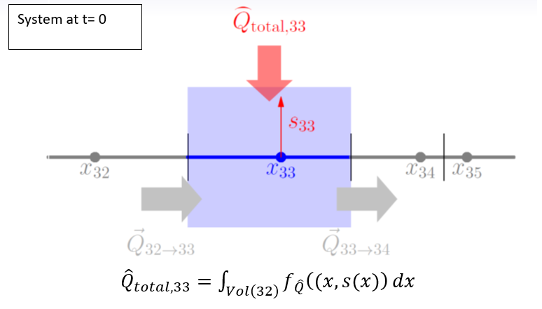
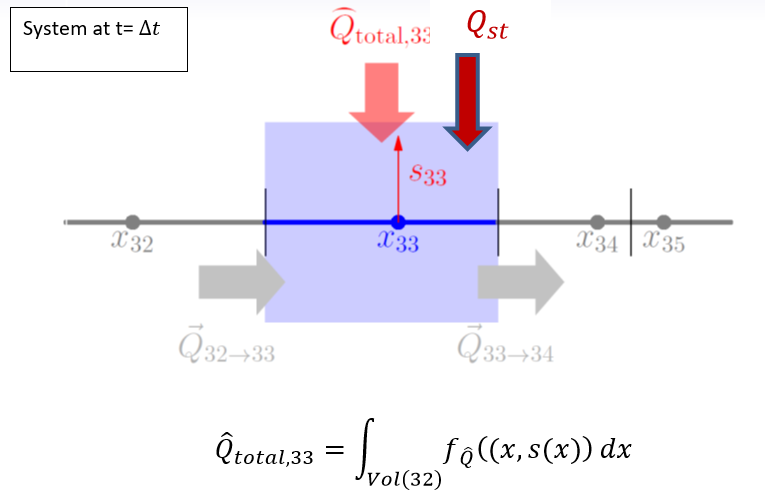

<!-- include the hint.js -->
<script src="hints.js"></script>

<button type="button" onclick="showHint(1)">Show Hint</button>
<p id="Q1"> </p>

# Learning Goals
* goal1
* goal2
* etc

# Introduction to transient turbulent transfer in the stably stratified boundary layer
The figure below shows a potential temperature profile with height for specific conditions. We will produce a comparable graph in this assignment, but now transient factors are taken into account.

<div align="center">

</div>

# The model setup
The state variable and the flow domain of the model will be the same as in assignment 1. The potential temperature is denoted by $\theta$ and its units are in Kelvin (K). The flow domain starts at a height of 0.5 meter above the surface and ends at the depth of the SBL, 100 meter above the surface, which is fixed in this model.

## Internal fluxes
Flux of energy in the x-direction (height) is calculated using Fick’s law with a so-called eddy-diffusivity:

$$q=-K_{eddy}*\frac{\delta \theta}{\delta x}$$
Where in the case of non-linear diffusion with the atmospheric boundary layer (ABL) and with a neutrally stratified boundary layer, $K_{eddy}$ is described by:

$$K_{eddy}=ku_{*}z$$

where the Von Kármán constant $k$ equals 0.4, $u_{*} = 0.25$ m/s and denotes the friction velocity at the surface and $z$ is the height above the surface ($x$ in our model).

## External fluxes
__External flux type 3__: A linearly decreasing radiative divergence which has a constant value of -1.74E-4 K/s from the surface to a height of 0.5 m,   above which it linearly decreases to a value of -5.55E-5 K/s at the top of the SBL.
  
## Boundary conditions
The potential temperature at the upper boundary will be implemented as a Dirichlet boundary condition. The lower boundary condition will be implemented with a Neumann boundary condition. For the potential temperature at the lower boundary an initial value of 291.73 K is adopted, which is decreasing with 0.5 K/h as time evolves. The potential temperature of the upper boundary is set to 295.0 k.

## Discretization
* space:  $\Delta x = 2m$,    i.e. the nodal distance.
* time:   $\Delta t = 1s$,    i.e. the time resolution the model will be solved for.

## State variables
<span class="question">
Enter the correct units in the table below
</span>

| System variable | Unit          | 
| ----------------|---------------| 
| State ($\theta$)| ...           |
| Internal flux   | ...           |
| External flux   | ...           |
| Space (scale)   | ...           |
| Time  (scale)   | ...           |


<span class="answer">

| System variable | Unit (answer) | 
| ----------------|---------------| 
| State ($\theta$)| m             |
| Internal flux   | m^2/s         |
| External flux   | K/s           |
| Space (scale)   | m             |
| Time  (scale)   | sec           |

</span>


The model setup as described above resembles largely the setup of assignment 1. However, in contrast to assignment 1, the lower boundary condition is not constant in time, but progressively decreases according to a prescribed cooling rate.
 
# Analyzing the situation before the surface starts to cool
Before we can start studying the transient behaviour of the model, we have to create a stationary model first. The solution of this stationary model describes the situation right before the surface starts to cool. The states of this stationary model will be used as input for our transient model.

<span class="question">
1.  Set up the mathematical part of the model of the initial situation, i.e. the situation before the surface starts to cool. Call this model oneDinitmodel. Do not forget to clear your environment and to import the FVFE1D package.

</span>
<button type="button" onclick="showHint(211)">Show Hint</button>
<p id="Q211"> </p>

<span class="answer">
```{r}
# Clear environment
rm(list=ls()) 
# load package
library(FVFE1D)

# Defining the flow domain of the model.
# Fill out min and max to determine the length of the model domain. For example, domain = c(0,100).
# The result is a simple array with two values: domain[1]=0 and domain[2]=100. Here, c() stands for the function
# concatenate. For more info type "?c()" in your console. 

domain = c(0.5,100.)

# The system flux function: 
# With the internal flux function one determines the flow type.
# This is where one implements the darcy, Fr=0, richards equation or an other flow equation.
# All these system flux functions require the location (x) at hand, a state at (x) and a gradient of that state at (x).
# 
# The system flux function has three arguments: 
# a) x          : place x withtin the domain
# b) state      : the state s at this point
# c) gradstate  : the gradient of the state at x
#
# The return() argument (between brackets) holds the actual flux equation, so what's on 
# the right hand side of the system flux equation. Here Fick's law is implemented as the sytem flux function.

k = 0.4
ust = 0.25
tempflux = function(x,state,gradstate)  
{
  return(-k*ust*x*gradstate)
}

# Now you are going to construct the flow model.
# Two arguments are required:
# 1) domain
# 2) systemfluxfunction
# 3) name (this is optional, but it can be usefull when you want to compare several different models)

oneDinitmodel = newFLOW1D(domain=domain, systemfluxfunction = tempflux, name = "oneDmodel") 

# Besides setting up the model also boundary conditions need to be set.
# Three different types of Boundary Conditions (BC) can be applied:
# 
# Dirichlet -> a function to set a prescribed state:
# usage:  set.BC.fixedstate(model, where, value)
# 
# Neumann -> a function to set a prescribed prescribed flux:
# usage:  set.BC.fixedflux(model, where, value)
# 
# Cauchy/Robin/Fourier -> a function to formulate a state dependent flux:
# usage:  set.BC.stateflux(model, where, value)
#
# These functions have three arguments:
# model = the current model
# where = a string that determines the position of the BC: 'l' or 'left, 'r' or 'right' 
# value = the value (or function) assigned to this BC
#
# When a boundary condition is not specified explicitly, a no-flow boundary is assumed.

set.BC.fixedstate(oneDinitmodel, 'left', 291.7) 
set.BC.fixedstate(oneDinitmodel, 'right', 295.)

# Not only internal fluxes, but certainly also external fluxes can be implemented into the model.
# Two generic flavours are available:
# 
# 1) add.pointflux(model, at, value, name)
# model : the one dimensional model at hand
# at    : the location in the domain where to add the point flux
# value : magnitude of the flux, this can eihter be a number or a state dependent function
# name  : name (optional; name for the flux)
# 
# 2) add.spatialflux(model, rate, name)
# model : the one dimensional model at hand
# rate  : a function of space (x) and state (s) returning the intensity of the spatial flux at that point, 
#         or a constant giving the flux at all spatial points independent of the states at these points, for example 
#         precipitation
# name  : name (optional; name for the point flux)

RD.func = approxfun(c(0,0.5,100),c(-1.74E-4,-1.74E-4,-5.55E-5))
extfunc = function(x,state)
{return(RD.func(x))}

# Add the external flux the model
add.spatialflux(oneDinitmodel,extfunc,'RDcons')
```
</span>

<span class="question">
2.	Implement the numerical part and solve the model for the initial situation to obtain values of the state variables for all volumes (nodes). Make plots of the state variable and the internal fluxes as a function of height.
</span>

<button type="button" onclick="showHint(212)">Show Hint</button>
<p id="Q212"> </p>

<span class="answer">
```{r}
# Implementing the numerical part:
# Define the nodes at which the states should be solved.
nodes = seq(domain[1], domain[2], by=2)

# Discretise the model and choose the numerical method which will be used for the solution.
set.discretisation(oneDinitmodel, nodes, 'FV')

# Solving the initial model:
# Since the initial model is not linear, several iterations (steps) will be needed to reduce the misfit of the model.
# This function returns a list of two entries: RMSM which contains the root mean square of the misfit and MAM which 
# contains the max absolute misfit.
solve.steps(oneDinitmodel)

# Plotting the states and the internal fluxes as a function of height.
plot(oneDinitmodel, fluxplot=TRUE)
```
</span>

<span class="question">
3.  Choose the volume associated with nodes 30 and 31 and check whether the net internal flux over the boundaries of this control volume indeed equals the integrated external flux over this region. What is your conclusion and what do you think is the relation with the returned misfit by the solve.steps() function?
</span>

<button type="button" onclick="showHint(213)">Show Hint</button>
<p id="Q213"> </p>

<span class="answer">
```{r}
# This returns a table from which one can read that the water balance for this control volume is indeed closed, althought the net change is not exactly zero. The larger the misfit one permits in the solve.steps() function, the larger this net change in the water balance can become. Note that this is not what you want!
dataframe.balance(oneDinitmodel, region = c(30, 31))
```
</span>

# Incorporating transient behaviour with the model
For stationary systems the state variables are fully constrained by the BCs, the formulation of the internal fluxes and the formulation of the external fluxes. By checking the balance of a particular volume in exercise 3, we noticed that indeed at a certain location there is a balance between the net internal flux between adjacent volumes and the external fluxes provided to the volumes. The external fluxes summed over the entire flow domain equal the net flux over the boundaries of the system.

However, for many systems the time that the system needs to adapt to the BCs or the external fluxes is larger than the rate of change in the BCs and/or the external fluxes. In these cases, the system “resists” the “pulling” of the system towards a new equilibrium where the external fluxes are in balance with the net internal fluxes. In these transient systems, there appears to be an additional flux that hampers the external fluxes for a particular volume to be in balance with the net internal flux for that particular volume. This additional flux is called the storage flux.

<div align="center">


</div>

A picture of the situation for transient systems is given above.
In the upper figure we see the situation at time t=0, the initial time before the surface starts to cool. In this situation there is a balance between the external fluxes within the particular volume and the internal fluxes between the particular volume and its adjacent volumes. 

In the lower picture the situation is shown when the system is progressed one time step in time after the surface started cooling. In this case, there is again a balance between the external fluxes that act on the system at t=∆t and the internal fluxes within the system at. t=∆t. However, in contrast to the initial stationary situation, there is an additional flux that results from the change of storage with the system, i.e. the fact that going one time step ahead leads to increase or decrease of the amount of the state variable stored within the system. 

The storage flux is directly related to the increase or decrease of the amount of the state variable stored within the system. It is thus given as:

$$Q_{st} = -\int_{Vol}S\frac{\delta \theta}{\delta t}dx$$

where $Q_{st}$ is the storage flux, and $S$ is the storage coefficient that related the change rate of the state variable to a change rate in storage (usually 1 in the atmosphere). The storage flux is thus directly linked to rate of the change of the state variable at a certain location.

<span class="question">
4.	 What is the dimension of this flux and why is the storage flux negatively related to the rate of change in the state variable?
</span>

<span class="answer">

</span>

In the previous we have identified the storage flux as in a way that is similarto the external fluxes. As the external fluxes, it is given as the integral of function that defines the storage in a point in space.The storage flux can therefore in a transient system be implemented in a way that is similar to the way that external fluxes caused by external processes are implemented within model. 

<span class="question">
5.	Make a new model which is an exact copy of oneDinitmodel. Call this model oneDtransientmodel?
</span>

<span class="answer">

</span>

<span class="question">
6.	Add the storageflux as an additional spatialflux to the oneDtransientmodel via the following piece of code:
```{r, eval=FALSE}
add.spatialflux(oneDtransientmodel, storageflux, name=”storage”)
```
</span>

The storage flux has now been added as an additional spatialflux to the transient model . However, we still need to provide a function that calculates the storage flux for a specific location. As this function is added to the model in analogy to an external function from external processes, the function for the storage flux should be a function that takes as arguments the location, and the value of the state variable and return the storage flux.

To develop such a function, we first need to discretize the formulation of the storage flux as given above. The simplest method being an Euler forward method:

$$Q_{st}=-\int_{Vol}S\frac{\theta_{t}-\theta_{t-\Delta t}}{\Delta t}dx$$

where $θ_{st}$ it the value of the state at the current time step (which we want to calculate), $θ_{t-∆t} is the potential temperature at the previous time step (which is generally known), and $\Delta t$ is the time step.

Now we have discretized the storage flux, translation to a R-function looks as follows:
```{r, eval=FALSE}
storageflux = function(x, state)
{
  storageflux = -S * (state - oldstate(x)) / dt
  return(storageflux)
}
```

<span class="question">
7.	Verify that indeed the piece of R-code as given above in combination with add.spatialflux(1Dtransientmodel,storageflux,name=”storage”) defines a spatialflux that is equal to the (discretized) storage flux
</span>

<span class="question">
8.	Add the function storageflux to the code that you use to define the transient model.
</span>

<span class="answer">

</span>

In order for the storage flux function to work we still do need to define:

•	a value for S: use a constant value of 1.0

•	a value for dt (the code equivalent of Δt): use a value of 1.0 s for a start

•	a function that is called oldstate and that returns for a given argument  x (location)  the value of the state at the previous time step at that location

#Integrating the transient model
In the previous exercises we developed a transient model that incorporates that in transient systems there is an additional flux caused by the storage change within the system. This model can now be used to analyse the effect of the progressive cooling of the surface in time. In our model, the surface starts to cool at $t=0$. 

<span class="question">
9.	Include a piece of code that tells the script that the initial time is zero (use the variable name “time” for time in your code).
</span>

<span class="answer">

</span>

At the initial time, there is, for each volume, a balance between the external fluxes and net internal flux. The profile of the state variable is thus given by the model called oneDinitmodel. The situation at t=0 is therefore given by the profiles of the state variable as calculated in exercise 2. This profile is called the initial profile for the transient system.

Now, we increase the time by a time step $\Delta t$.

<span class="question">
10. Include a piece of code that tells the script that the time should increase with $\Delta t$.
</span>

<span class="answer">

</span>

As time progresses, the temperature at the lower boundary changes as a result of cooling of the surface. The cooling rate is 0.5 K/h and in the form of a formula as function of time the surface temperature change can be described by:

$$T_{1}(t=\Delta t)=T_{1,init}-\frac{\Delta t}{3600}0.5$$
where $T_{1}(t=\Delta t)$ is the temperature of the lower boundary at $t=\Delta t$, and $T_{1,init}$ is the temperature of the lower boundary at $t=0$.


<span class="question">
11. Include the lower boundary condition to your transient model as described by the cooling of the surface equation, as shown above.
</span>

<span class="answer">

</span>

In the previous exercise we have defined an object of the class FLOW1D called 1Dtransientmodel. We have defined the following properties in this object:

1.  A definition of the domain
2.  A function that describes internal transport within the system as a function of location, state and the gradient of        the state.
3.  The external fluxes for each volume as a function of location and state of the system.  
4.  A formulation of the flux due to the change in storage as a function of location and state of the system.

To complete the mathematical formulation of the transient model, we still need to specify in the function storageflux, a function called oldstate(x). This function returns the state of the system at the previous time step at a specific location. At $t=\Delta t$, the profile of the potential temperature is given by the profile of the state variable as generated by the 1Dstartmodel. The function oldstate(x) can thus be calculated as:

```{r eval=FALSE}
startprof = dataframe.states(oneDinitmodel)
oldstate = approxfun(startprof$x, startprof@state, rule=2)
```

<span class="question">
12. Add this piece of code and verify that it indeed gives the value of the state at the previous time step, $t=0$ in this case, for the locations $x=25$ and $x=50$.
</span>

<span class="answer">

</span>

Now that the mathematical formulation of the model is completed, the numercal part can be implemented and the model can eventually be solved. For the model to be numerically solveable, the following actions need to be performed:

* Creation of the nodes at which the system is solved for its states
* Set the discretisation of the sytem by defining the method that is used to solve the system
* Calling the solve function on the transient model. Solving of the model requires the finding of the values of the state variables in all volumes so that the balances of all volumes are zero (the sum of the external fluxes and the storage flux  equals the net internal flux of a specific volume). As in the stationary model, this requires the solving of (N-2) state variable balances (for all volumes) to get (N-2) values of the state variables, where N is the number of volumes that we have specified.  As before, we simply use a function called solve.steps which takes the instance of the class FLOW1D as an argument and solves the values of the state variables at the specified volumes that lead to a minimal misfit between net internal flux and the external fluxes.

The snippet below shows the missing elements of the numerical model.
```{r, eval=FALSE}
nodes = seq(...)
set.discretisation(...)
control = solve.steps(...)
```

<span class="question">
13. Add a piece of code that defines the numerical formulation to your model and solve it to obtain the profile of the state variables at $t=\Delta t$.
</span>

<span class="answer">

</span>

<span class="question">
14. Plot the profiles of the state variables and the internal fluxes for time $t=\Delta t$ and compare these to the profiles at $t=0$.
</span>

<span class="answer">

</span>

<span class="question">
15.	Use dataframe.balance(oneDtransientmodel) and show that the sum of the external fluxes and the storage flux are in balance with the net internal fluxes.
</span>

<span class="answer">

</span>

Now we want to progress the model to calculate the profile of the state variables at $t=2\Delta t$. Therefore, we need to update the lower boundary condition according to:

$$T_{1}(t=2\Delta t)=T_{1,init}-\frac{2\Delta t}{3600}0.5$$

Also, we need to update the function oldstate(x) in the function that provides the storage flux as function of location (variable x) and the state. For time $t=2\Delta t$ the oldstate is given by the values of the state variable at $t=\Delta t$ and is thus calculated by:

```{r eval=FALSE}
prevprof = dataframe.states(oneDtransientmodel)
oldstate = approxfun(prevprof$x, prevprof@state, rule=2)
```

<span class="question">
16. Add a piece of code that increments the time by one time step, $\Delta t$.
</span>

<span class="answer">

</span>

<span class="question">
17. Update the lower boundary condition for the new situation at $t=\Delta t$.
</span>

<span class="answer">

</span>

<span class="question">
18. Update the function oldstate so that is takes the states from the correct time step.
</span>

<span class="answer">

</span>

As we progress in time, the number and the positioning of the volumes does not change, because the applied numerical method does not change. So there is no need to reinvoke the set.discretisation() function and we can directly solve the transient model for the new time step $t=2\Delta t$.

<span class="question">
19. Solve the transient model to obtain the profile of the state variable at the new time step, $t=2\Delta t$.
</span>

<span class="answer">

</span>

Continuation of the time integration for $t=3\Delta t$ can be performed in the same manner. However, this would be very inefficient in terms of line count and time. Since we are performing a repetitive task we should implement the time integration using a loop construct. The implementation of this construct is shown in pseudocode below:

```{r, eval=FALSE}
@ include the code that solves the model for time t=2∆t
while (time < endtime)
{
@update time
@update the lower boundary condition
@solve the model
@do some .processing here (plot(model) etc.)
@update oldstate(x)
}
```

<span class="question">
20.	Finish the code given above by replacing the lines starting with a @ with proper R-code. In the line where some precessing can be done, enter at least an instruction that plots the transient model and add a waiting code line, sys.sleep(0.1), to control the updating of the window. The end time of the model should be 4 hours after the start of the surface cooling.
</span>

<span class="answer">

</span>

<span class="question">
21. Run the code. If all went well, and the endtime was chosed properly, you should see a movie of the state transitions between the initial situation and the situation after 4 hours.
</span>

<span class="answer">

</span>

When you want to use the intermediate results of the time integration for further analysis, the following instructions should be taken into account:

* Create a data structure in which the intermediate time steps can be stored
* Store the intermediate time steps in the data structure
* Plot the saved intermediate states

The code snippet below shows how this can be done.
```{r, eval=FALSE}
result.store = data.frame()
rbind(result.store, data.frame("t"=time, "lvalue"=dataframe.states(oneDtransientmodel)$state[1], "outflow"=dataframe.boundaries(oneDtransientmodel)[1]))
plot(result.store$t, result.store$outflow, type="o", col="red")
```

<span class="question">
22.	 Use these ideas to make one plot showing both the flux at the lower boundary and the state at a location of 50 m above the surface.
</span>

<span class="answer">

</span>

<span class="question">
23.	Perform a sensitivity analysis to the applied time step by modifying it from 2 seconds to 1 hour using values of 30 seconds, 10 minutes, 30 minutes, 45 minutes and 1 hour. Check the potential temperature at 50 m and the time series of the flux over the lower boundary. What is your conclusion?
</span>

<span class="answer">

</span>

Until now we solved the equations describing energy transfer within the Stable Boundary Layer (SBL). To mimic cooling at the surface we have applied a transient term that prescribes a cooling rate for the temperature at the lowest node, i.e. the nodes that define the lower boundary condition. In the model designed above this node is assumed to be represative for the air layer close to the ground. 

However, in modelling reality the lower boundary condition of the stable boundary layer is usually coupled to the surface energy balance which reads (excluding dew fall of evaporation):

$$\frac{\delta T_{s}}{\delta t}=\frac{1}{C_{v}}(Q_{net}-\rho c_{p}(\overline{w'\theta'})_{0}-\Lambda_{m}(T_{s}-T_{m}))$$
where:

  $T_{s}$ : Surface temperature ($K$)
  
  $C_{v}$ : Heat capacity of the vegetation ($\frac{J}{KL^2}$)
  
  $Q_{net}$  : Net radiation ($\frac{J}{TL^2}$)
  
  $\rho$  : Air density ($\frac{M}{L^3}$)
  
  $c_{p}$  : Heat capacity of the air ($\frac{J}{KM}$)
  
  $\Lambda_{m}$  : Bulk conductance of the mulch layer ($\frac{J}{TL^2K}$)

For $C_{v}$ we adopt a value of $2000$ $J m^{-2} K^{-1}$, $\rho=1$ $kgm^{-3}$, $c_{p}=1005$ $J K^{-1} kg^{-1}$, $\Lambda_{m}=3$ $W m^{-2}K^{-1}$ and $T_{m}=290$ $K$.


<span class="question">
24. Add the model described above for the surface temperature to the transient model you developed. Use $Q_{net}=-25$ $W m{-2}$.
</span>

<span class="answer">

</span>

<span class="question">
25	Plot the  vertical profile of the state, the (internal) fluxes and the surface temperature for each hour. What is your conclusion?
</span>

<span class="answer">

</span>

<span class="question">
26	Plot the time series of flux over the lower boundary. What is your conclusion?
</span>

<span class="answer">

</span>

<span class="question">
27	Perform a sensitivity analysis to the applied time step by modifying it from 30 seconds to 1 hour using values of 30 seconds, 10 minutes, 30 minutes, 45 minutes and 1 hour. Check the vertical profile of the potential temperature after 4 hours and the time series of the internal flux between node 1 and node 2. What is your conclusion.
</span>

<span class="answer">

</span>

#Extra assignment: Add a model for the net radiation

<span class="question">
Add the above equation for the net radiation to your model and redo question 24 to 27 for the new situation.
</span>

<span class="answer">

</span>


