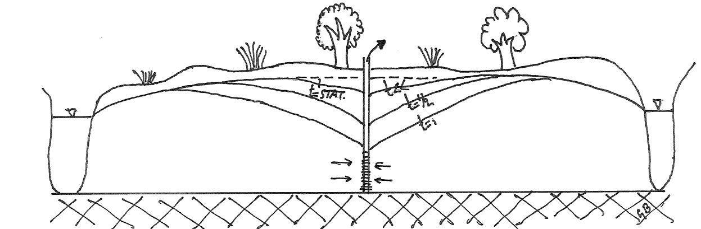
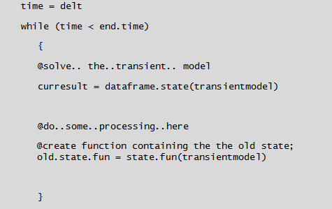

#Introduction transient groundwater flow model  
In this assignment, a transient groundwater system will be studied. As a first example, the development of an extraction cone is examined. A schematic of this process is shown below.
The description of this system is largely equal to that of assignment 1. So we take (again):   <!-- still true? -->

*    L = 200 $m$ 
*    Dirichlet boundary conditions left and right river = 5.0 $m$
*    kD = 45 $m^2/d$ for type 1 flow
*    k = 10 $m/d$ for type 2 flow
*    nodes with $\Delta$ x = 10 m
*    recharge R = 0.001 $m/d$
*    Extraction rate well = 0.25 $m^2/d$ at 90 $m$ from the left



##1.1. New concepts in modeling  
Since this model will simulate states (heads) for transient conditions (i.e. in time), the dynamical aspects now need to be implemented: 

1.    The variable; Storage Coefficient $S$ 
2.    A point flux; the extraction well 
3.    A new spatial flux; 'from the past ' or simply the storage flux : $Q(t)=-S\frac {H(x)_{new}- H(x)_{old}}{\Delta t}$

<div class="question">What are the units of the above mentioned aspects?</div>  

<div class="answer">
The domain of the model has only one spatial dimention, (e.g. the x-direction). Therefore, the spatial flux should have the same dimentions. Here the flux density is defined as length per time, $m/d$. From this follows that the storage coefficient should be dimentionless. The dimentions in which the well is entered in the model is $m^2/d$, but internally the value is divided by the nodal distance at the specific location. Per time step a certain water height, $m/d, is substracted in this situation.

1.    Phreatic storage coefficient: $m^3/m^3 \rightarrow (-)$ 
2.    (Extraction) Well $m^2/d$ 
3.    Spatial flux $m/d$
</div>

##1.2. Setting up the stationary part of the model  
In the following exercises a transient model, based on the stationary model created in the first assignment, will be developed. Before we start this exercise, the workspace should be cleaned and the FVFE1D package has to be loaded.  

```{r}
# cleaning
rm(list = ls())
# loading
library(FVFE1D)
```

<div class="question">Setup and run the stationary model containing the above data without the extraction well.  
You may use a code chunk from the previous assignment (assignment1.Rmd). Call this model 'startmodel' and solve it using the finite volumes method. Plot both the states and the fluxes of the model in an individual graph. Check the plot documentation in the FVFE1D package for more information.
</div>

<div class="answer">
```{r}
# system properties
domain = c(0, 200)
nodes = seq(0, 200, 10)
kD = 45
k = 10
left.bound = 5
right.bound = 5

# functions
flux.fun = function(x, s, grads) {return (-kD*grads)}
startmodel = newFLOW1D(domain = domain, systemfluxfunction = flux.fun, name = "startmodel")
set.BC.fixedstate(startmodel, "left", left.bound)
set.BC.fixedstate(startmodel, "right", right.bound)
add.spatialflux(startmodel, 0.001, "recharge")

set.discretisation(startmodel, nodes, "FV")
result = solve.steps(startmodel)
plot(startmodel, stateplot = TRUE, fluxplot = TRUE)


```
</div>

<div class="question">Create an identical stationary model now with the extraction well at 90 m from the West.  
You may use copy.model() from the FVFE1D package.  
See the help on this package for further details.  Call this model 'endmodel'.</div>  


<div class="question">Calculate the origin of the water extracted by the well. In other words where does this extracted come from? </div> 


<div class="question">
Plot both head distributions in one graph by simply using 'dataframe.states()' </div>  


##1.3 Setting up the transient model  
One of the key aspects of creating a transient model is to define the storage flux or the ”external flux from the past”. The formula (given at the beginning of this assignment) is translated into R-code as follows:

```{r}
storage.flux = function(x,state)
  {
  return(S * (oldstate.fun(x) - state)/delt)
  }
```

Furthermore values for the Storage Coefficient $S$ and $\Delta t$ are required.  We start with 0.15 $(-)$ and 0.5 $d$ respectively.  
The function **oldstate.fun(x)** contains the previous head of the model and is required to calculate the **storage.flux**.  The easiest approach would be the use of the **state.fun(model)** contained in the FVFE1D package, see help for further details.  
The very first state distribution for which the transient model starts running is based on the states of the 'startmodel'.  

<div class="question">
Do you agree with the "sign" in the **storage.flux** function above?  
Define the $S$, $\Delta t$ and the **oldstate.fun** based on the states of the startmodel.
</div>  

```{r}
##insert your code here
```


To have an idea how this oldstate.fun function 'works' simply type at the console (lower left window of R-studio) 'oldstate.fun(20)' which will result in the head (state) at position $x=20 m$.  

<div class="question">
To create a transient model the following aspects need to be implemented:  

1.    make a copy of the startmodel and call it transientmodel (use copy.model()) 
2.    add the extraction well to this model 
3.    add the storage flux to the model 
4.    you may give this model a new name with set.name() 
</div>
```{r}
##insert your code here
```


To cycle through the time steps of 0.5 d starting at **begin.time** and finalizing at **end.time**, a time loop need to be implemented.  
A small chunk of 'pseudo code' to do this is illustrated in the following picture;  


figure 2: time loop construct  

***
    
<div class="question">  
*   Replace the the lines starting with the @ with proper R-code. 
*   For the @do..some..processing..here just plot the transientmodel and add a waiting code-line **Sys.sleep(0.1)** to control the updating of the window. 
*   Choose the begin.time and the end.time.  

If all went well (and the end.time was chosen properly), you should see a "movie" of the state transition between the start-model and the transient(end)-model.  
A real movie can be included when one Knits the document. ffmpeg.exe is a program which then creates this movie into the html document.
</div>


##1.4 Transient intermediate results  
During the transient simulation it is very interesting to have a look at some intermediate results like the states and fluxes for the different time steps.  The following code lines will help to save these results.  
<div class="question">

1.   use **result.store = data.frame()** to have a container for the required data above the time loop
2.   use **curresult = dataframe.states(transientmodel)** to store the heads 
3.   use **curboundaries = dataframe.boundaries(transientmodel)** to store the outflow of both rivers 
4.   use **watbal = dataframe.balance(transientmodel)**
5.   use **result.store = rbind(result.store,data.frame('t'=time,'Hatwell'=curresult$state[9],'Qoutleft'=curboundaries[1,4],Qoutright'=curboundaries[2,4],'Qstorage'=wbal[2,2]))** to add the intermediate data 
6.    put numbers 2 - 5 in the time loop, just after **solve.steps()**
7.    to inspect the results create some plots from the result.store data.fram  

</div>


<div class="question"> Does this simulation have reached stationary conditions? </div>  

##1.5. Using the non-linear (type 2) internal flux  
The internal flux is now not based on an average transmissivity but on the saturated thickness and a constant hydraulic conductivity of $10 m/d$.  

Does this give different results?  

<div class="question">
*   copy the previous chunk into the chunk below 
*   create a new function containing the non-linear internal flux just on the of this chunk 
*   create a new model and call it e.g. trans2model (newFLOW1D,set.BCXX etc) 
*   replace 'transientmodel' with e.g. trans2model in the chunk 
*   replace result.store with e.g. result2.store 
*   run this chunk  
</div>


```{r}
##insert your code here
```


<div class="question"> Now compare both result data frames by graphs and or numbers</div>  


##1.6. Adding a recharge pattern to the model  
In this last assignment a non constant recharge pattern need to be applied to the model.  
The data comes from the meteorological station Hupsel located near Eijbergen and in the catchment area of the brook Hupsel.

Data is shown in the next chunk and graph.  

```{r}
hupsel = read.table(file='hupsel.dat')
plot(hupsel$V1,hupsel$V2,type='l',col='red',xlab='time (d)',ylab='recharge/evap (cm/d)',ylim=c(-0.25,1.0),
     main = 'Precipitation (red), Evopatranspiration (black), Recharge (blue)')
lines(hupsel$V1,hupsel$V3)
net.rch = hupsel$V2 - hupsel$V3
net.rch = cbind(hupsel$V1,0.01*net.rch)
lines(net.rch[,1],100*net.rch[,2],col='blue')
grid()
```

First the old recharge flux (just a fixed value of 1mm/d) need to be removed by the model using the FVFE1D command; **rem.spatiaflux(model;, nameofspatialflux)**.  
Now you can add a new recharge flux by simply using a variable name.  
See the next two lines of code for this and have also a look in the help on this.  
**rch = 0.001**  
**add.spatialflux(themodel,'rch','recharge')**  
It is assumed that the time stepping remains to be one day ($\Delta t=1$). If not, a function should be made from the recharge vector  

<div class="question">Copy the previous chunk into the new chunk below and add the recharge from hupsel.</div>  


This finalizes the second "hydro" assignment
