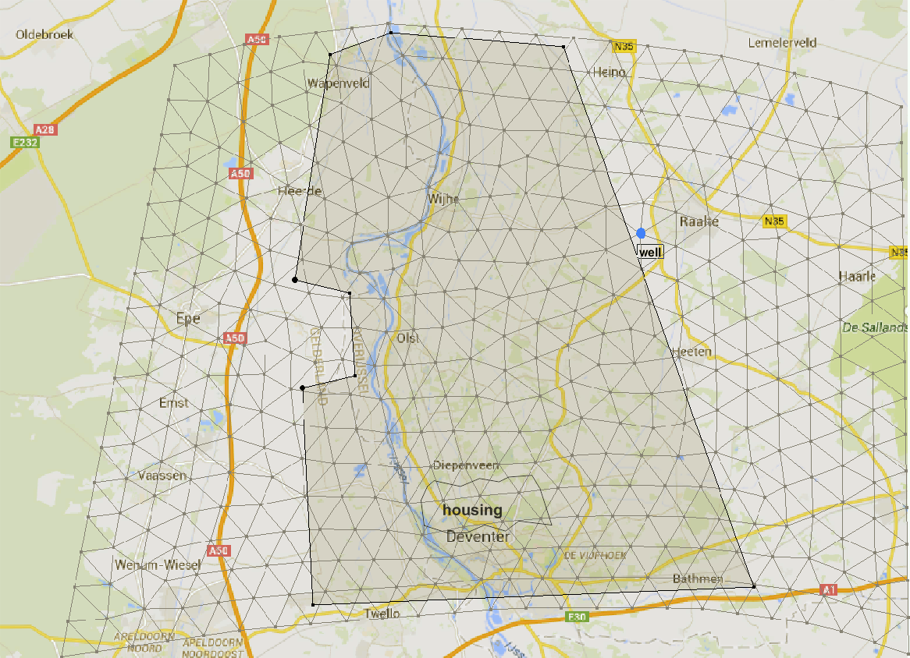

## Learning goals
*  Applying local and global sensitivity analysis in a more complex, 2D system *(Section 2,3)*
*  Understanding why uncertainty/sensitivity may vary within a domain *(Section 2,3)*
*  Understanding the effect of a changed base value on the sensitivity analysis *(Section 4)*
*  Understanding why the results from local sensitivity analysis may differ from those of global sensitivity analysis *(Section 5)*
*  Understanding the role of the sample size for global sensitivity analysis *(Section 5)*

```{r message=FALSE}
rm(list=ls())
library(FVFE2D)
```

<div class="exercise">
If you don't have them yet, install the following packages from CRAN:   
* lhs   
* truncnorm   
* matrixStats   
* fields   
</div>

```{r message=FALSE}
library(lhs)
library(truncnorm)
library(matrixStats)
library(fields)
```

# Introduction
In this practical we will investigate the sensitivity of a 2D groundwater flow model for an area around the IJssel river (see figure 1). In the east and west of the area, there are sandy, more elevated parts (Veluwe and Sallandse Heuvelrug). The middle part, around the river, is more low-lying and is drained by ditches (shaded rectangle). A well is present near Raalte. Finally, there is a housing area in the south, the city of Deventer, that needs special attention.


Figure 1: The study area.

The model is already built. The following workspace contains the model (called `IJsselmodel`) and all the data it needs.

```{r}
load("IJsselmodelNew.Rdata")
solve.steps(IJsselmodel)
```

Just to check what is downloaded:
```{r}
print(summary(IJsselmodel))
set.name (IJsselmodel,"2D groundwater model for the IJssel area")
plot(IJsselmodel,fill="state",fill.contours=seq(0,8,by=1),
     addpolygons = list(list(housing,col=rgb(0,0,1,0.25)),
                        list(drainage,col=rgb(0,1,0,0.25))),
     addlines = list(list(river.xy,col="blue",lwd=2)))
```

The groundwater heads in the north and south of the domain are fixed; on the east and west there are zero-flow boundaries (water divides).
The model contains the spatial fluxes *recharge* (over the whole domain) and *drainage* (only in the green draining zone); a well; and flow into or from the river. The river course and level are given. The housing area is shown in the map.

# 1. First investigation of the 2D model

## 1.1 Investigating the balance

<div class="exercise">
1.Calculate the balance of the whole model region. Discuss the relative contribution of the different fluxes in the system.
</div>

<div class="student_answer">
```{r eval=FALSE}
# calculate balance
```
Discussion:
</div>

<div class="answer">
The balance for the whole model region can be investigated by:
```{r eval=FALSE}
A=dataframe.balance(IJsselmodel)
Net=abs(A$net)
pie(Net,labels=A$name)
```

The water input from rainfall is removed largely by the river, followed by drainage and groundwater flow over the boundaries. The well also removes a small part.
</div>

<div class="comment">
Something goes wrong here with dataframe.balance? I don't see what is going on! dataframe.boundaries doesn't work either.
</div>

## 1.2 Investigating the drainage fluxes
<div class="exercise">
2.In the chunk below, replace the XXXX by the proper function (consult the FVFE2D help if needed), so that the plot that follows shows the spatial distribution of the
drainage flux. What patterns do you see?
</div>

<div class="student_answer">
```{r eval=FALSE}
EF = XXXX
plot(IJsselmodel,fill=EF$drainage,fill.contour=seq(-1e-9,-0.001,length=3),
     addpolygons = list(list(drainage,col=rgb(0,1,0,0.25))))
```
Discussion:
</div>

<div class="answer">
```{r}
EF = dataframe.externalfluxes(IJsselmodel)
plot(IJsselmodel,fill=EF$drainage,fill.contour=seq(-1e-9,-0.004,length=3),
     addpolygons = list(list(drainage,col=rgb(0,1,0,0.25))),main="Drainage fluxes")
```

There is more drainage close to the river, probably because the surface is lower there.
</div>

## 1.3 Investigating the river seepage fluxes

The chunk below gives a histogram of the river flux values of all points in the domain. Most of the domain loses water to the river. There are some places where this flux is rather high.

```{r}
hist(EF$river,main="Histogram of river fluxes in the domain",xlab="Flux [m/d]")
```

<div class="comment">
Are these river fluxes indeed in m/d?
</div>

<div class="exercise">
3.Replace the XXXX in the following chunk by three values such that the plot gives a good view of the most frequent river fluxes. Add a short discussion.
</div>

<div class="student_answer">
```{r eval=FALSE}
plot(IJsselmodel,fill=EF$river,fill.contour=c(XXXX,XXXX,XXXX),
     addlines = list(list(river.xy,col="blue",lwd=2)))
```
Discussion:
</div>

<div class="answer">
```{r}
plot(IJsselmodel,fill=EF$river,fill.contour=c(-0.5,-1,-2), main="River fluxes",
     addlines = list(list(river.xy,col="blue",lwd=2)))
```

Most of the domain loses water to the river, though the fluxes are generally very small. One spot in the upstream part of the river has very high flows to the river; possibly the boundary condition is not accurate at that place.
</div>

## 1.4 Investigating the mean groundwater depth in the housing area

In what follows we want to investigate the groundwater level in the housing area. For that we need a node that falls within this area. Use the following plot to select a typical node in the housing area (zoom if needed).
```{r}
plot(IJsselmodel,nodenumbersize=1,
     addpolygons = list(list(housing,col=rgb(0,0,1,0.25))))
```

<div class="exercise">
4.Fill out the node in the following chunk, and investigate its groundwater level.
</div>

<div class="student_answer">
```{r eval=FALSE}
Iselect = XXXX # The node number you just selected
MRESULT = function()
{
  NS = dataframe.states(IJsselmodel)
  return(NS$state[Iselect])
}
#Convert to groundwater depth below the surface
print(surface[180,]) #this shows the surface level at the housing area
print(XXXX) #depth of grw below surface
```
</div>

<div class="answer">
```{r}
Iselect = 353
MRESULT = function()
{
  NS = dataframe.states(IJsselmodel)
  return(NS$state[Iselect])
}
#Convert to groundwater depth below the surface
print(surface[180,]) #this shows the surface level at the housing area
print(surface[180,3]-MRESULT()) #depth of grw below surface
```
</div>

## 1.5 Store base for sensitivity analysis

We save the base results, both for `MRESULT` and for all states.
```{r}
M_base = MRESULT()
print(M_base)
state_base = dataframe.states(IJsselmodel)$state
```

## 1.6 Parameters and scales

There are seven parameters in this model:   
*  Recharge flux (net rainfall) [m/d]   
*  Well extraction rate [m3/d]   
*  Transmissivity of the aquifer [m2/d]   
*  Resistance of the river bed to exchange with the groundwater [d]:       
   $q_{exchange}=(H_{river}-H_{groundwater})/resistance$    
*  Boundary condition at the south boundary [m]   
*  Boundary condition at the north boundary [m]   
*  Resistance to drainage through ditches [d]:   
   $q_{drainage}=mean(H_{groundwater}-H{drains})/resistance$   

<div class="comment">
I put in these units, are they correct? 
</div>

```{r}
base= list(Qrch=Qrch,Qwell=Qwell,kD=kD,river.resist=river.resist,
           south.bnd=south.bnd,north.bnd=north.bnd,drainage.resist=drainage.resist)
str(base)
```

Their scale of variation is given by:
```{r}
scale= list(Qrch=0.00025,Qwell=500,kD=50,river.resist=2.5,
           south.bnd=0.2,north.bnd=0.2,drainage.resist=80)
str(scale)
```

# 2. LSA basic calculations

## 2.1 Sensitivity with respect to recharge flux Qrch
<div class="exercise">
5.In the chunk below, we start with the sensitivity to the recharge flux `Qrch`. A different `eps` is used than before. Why would it be done this way?
</div>

<div class="student_answer">
Type your answer here...
</div>

<div class="exercise">
6.Run the chunk and add a discussion of the outcome.
</div>

```{r,fig.height=4}
eps = scale$Qrch * 1e-2
Qrch = base$Qrch+eps
control = solve.steps(IJsselmodel,verbose=TRUE)
Qrch=base$Qrch
# For the MRESULT
dMdQrch  = (MRESULT()-M_base)/eps
varM.Qrch = (scale$Qrch*dMdQrch)^2 #the variance in M due to Qrch
print(paste("Variance in M due to Qrch=",varM.Qrch))
# For all states
dstatedQrch = (dataframe.states(IJsselmodel)$state-state_base)/eps
varState.Qrch = (scale$Qrch*dstatedQrch)^2
set.name(IJsselmodel,"Variance due to Qrch")
plot(IJsselmodel,fill=varState.Qrch)
```

<div class="answer">
The `eps` value is now _relative_ to the scale of variation of a parameter. This may be a better way of defining eps, because the units and scales of variation are very different between the parameters. For example, Qrch varies in the order of mm/d, while kD may vary by tens of m2/d. For a parameter with a small standard deviation, you would need a small eps, so that you are not looking at slopes outside of the range of your parameter. For parameters with a large standard deviation, a larger eps is needed to get a realistic idea of the local sensitivity slope. 

The sensitivity to the recharge is largest near the no-flux boundaries. In the middle of the domain, the drainage and the river limit the dependence on the recharge. At the south and north borders the groundwater levels are determined by the boundary conditions, making the variation due to the recharge zero.
</div>

<div class="exercise">
7.In section 2.2 to 2.7, calculate the local sensitivities of MRESULT and the states to the other six parameters. For each of them, add a short discussion of the results.
</div>

## 2.2 Sensitivity with respect to the well extraction Qwell

<div class="student_answer">
```{r}
# Type your code here...
```
</div>

<div class="answer">
```{r,fig.height=4}
eps = scale$Qwell * 1e-2
Qwell = base$Qwell+eps
control = solve.steps(IJsselmodel,verbose=FALSE)
Qwell=base$Qwell
# For the MRESULT
dMdQwell  = (MRESULT()-M_base)/eps
varM.Qwell = (scale$Qwell*dMdQwell)^2 #the variance in M due to Qwell
print(paste("Variance in M due to Qwell=",varM.Qwell))
# For all states
dstatedQwell = (dataframe.states(IJsselmodel)$state-state_base)/eps
varState.Qwell = (scale$Qwell*dstatedQwell)^2
set.name(IJsselmodel,"Variance due to Qwell")
plot(IJsselmodel,fill=varState.Qwell)
```

Only the immediate neighbourhood of the well is sensitive to the uncertainty in extraction rates.
</div>

## 2.3 Sensitivity  with respect to the transmissivity kD

<div class="student_answer">
```{r}
# Type your code here...
```
</div>

<div class="answer">
```{r,fig.height=4}
eps = scale$kD * 1e-2
kD = base$kD+eps
control = solve.steps(IJsselmodel,verbose=FALSE)
kD=base$kD
# For the MRESULT
dMdkD  = (MRESULT()-M_base)/eps
varM.kD = (scale$kD*dMdkD)^2 #the variance in M due to kD
print(paste("Variance in M due to kD=",varM.kD))
# For all states
dstatedkD = (dataframe.states(IJsselmodel)$state-state_base)/eps
varState.kD = (scale$kD*dstatedkD)^2
set.name(IJsselmodel,"Variance due to kD")
plot(IJsselmodel,fill=varState.kD)
```

The sensitivity with respect to the kD is highest near the no-flux boundaries. Closer to the river, drainage and seepage limit the sensitivity to kD. The influence of kD is also visible around the well.
</div>

## 2.4 Sensitivity with respect to river.resist

<div class="student_answer">
```{r}
# Type your code here...
```
</div>

<div class="answer">
```{r,fig.height=4}
eps = scale$river.resist * 1e-2
river.resist = base$river.resist+eps
control = solve.steps(IJsselmodel,verbose=FALSE)
river.resist=base$river.resist
# For the MRESULT
dMdriver.resist  = (MRESULT()-M_base)/eps
varM.river.resist = (scale$river.resist*dMdriver.resist)^2 #the variance in M due to the river resistance
print(paste("Variance in M due to river.resist=",varM.river.resist))
# For all states
dstatedriver.resist = (dataframe.states(IJsselmodel)$state-state_base)/eps
varState.river.resist = (scale$river.resist*dstatedriver.resist)^2
set.name(IJsselmodel,"Variance due to river.resist")
plot(IJsselmodel,fill=varState.river.resist)
```

The sensitivity to the river resistance is only visible in a small corner at the upstream part of the river. This is also where we saw the possible error in the boundary conditions.
</div>

## 2.5 Sensitivity with respect to drainage.resist

<div class="student_answer">
```{r}
# Type your code here...
```
</div>

<div class="answer">
```{r,fig.height=4}
eps = scale$drainage.resist * 1e-2
drainage.resist = base$drainage.resist+eps
control = solve.steps(IJsselmodel,verbose=FALSE)
drainage.resist=base$drainage.resist
# For the MRESULT
dMddrainage.resist  = (MRESULT()-M_base)/eps
varM.drainage.resist = (scale$drainage.resist*dMddrainage.resist)^2 #the variance in M due to the drainage resistance
print(paste("Variance in M due to drainage.resist=",varM.drainage.resist))
# For all states
dstateddrainage.resist = (dataframe.states(IJsselmodel)$state-state_base)/eps
varState.drainage.resist = (scale$drainage.resist*dstateddrainage.resist)^2
set.name(IJsselmodel,"Variance due to drainage.resist")
plot(IJsselmodel,fill=varState.drainage.resist)
```

The sensitivity with respect to the drainage resistance is restricted to the drained area, with the exception of the river path. There the river controls the groundwater levels.
</div>

## 2.6 Sensitivity with respect to south.bnd
<div class="exercise">
Note: when you adapt the `south.bnd` and `north.bnd` values, the model **will not automatically adapt the boundary conditions**. Make sure you do this yourself after you have adapted the south.bnd or north.bnd value. For the south boundary, this can be done by:  
`for (i in c(1,2,13,14,15,16)) {set.BC.fixedstate(IJsselmodel,i,south.bnd)}`
Also change the boundary condition manually again after you have reset the south.bnd value.
</div>

<div class="student_answer">
```{r}
# Type your code here...
```
</div>

<div class="answer">
```{r,fig.height=4}
eps = scale$south.bnd * 1e-2
south.bnd = base$south.bnd+eps
for (i in c(1,2,13,14,15,16)) {set.BC.fixedstate(IJsselmodel,i,south.bnd)}
control = solve.steps(IJsselmodel,verbose=FALSE)
south.bnd=base$south.bnd
for (i in c(1,2,13,14,15,16)) {set.BC.fixedstate(IJsselmodel,i,south.bnd)}
# For the MRESULT
dMdsouth.bnd  = (MRESULT()-M_base)/eps
varM.south.bnd = (scale$south.bnd*dMdsouth.bnd)^2 #the variance in M due to the southern boundary condition
print(paste("Variance in M due to south.bnd=",varM.south.bnd))
# For all states
dstatedsouth.bnd = (dataframe.states(IJsselmodel)$state-state_base)/eps
varState.south.bnd = (scale$south.bnd*dstatedsouth.bnd)^2
set.name(IJsselmodel,"Variance due to south.bnd")
plot(IJsselmodel,fill=varState.south.bnd)
```

The influence of the boundary condition is limited to about 1 km from the boundary. In the middle, where the river is located, the river fluxes limit the sensitivity to the boundary condition.
</div>

## 2.7 Sensitivity with respect to north.bnd
<div class="exercise">
Again take care to manually reset the boundary conditions. For the northern boundary, use:
`for (i in 4:11) {set.BC.fixedstate(IJsselmodel,i,north.bnd)}`
</div>

<div class="student_answer">
```{r}
# Type your code here...
```
</div>

<div class="answer">
```{r,fig.height=4}
eps = scale$north.bnd * 1e-2
north.bnd = base$north.bnd+eps
for (i in 4:11) {set.BC.fixedstate(IJsselmodel,i,north.bnd)}
control = solve.steps(IJsselmodel,verbose=FALSE)
north.bnd=base$north.bnd
for (i in 4:11) {set.BC.fixedstate(IJsselmodel,i,north.bnd)}
# For the MRESULT
dMdnorth.bnd  = (MRESULT()-M_base)/eps
varM.north.bnd = (scale$north.bnd*dMdnorth.bnd)^2 #the variance in M due to the northern boundary condition
print(paste("Variance in M due to north.bnd=",varM.north.bnd))
# For all states
dstatednorth.bnd = (dataframe.states(IJsselmodel)$state-state_base)/eps
varState.north.bnd = (scale$north.bnd*dstatednorth.bnd)^2
set.name(IJsselmodel,"Variance due to north.bnd")
plot(IJsselmodel,fill=varState.north.bnd)
```

The sensitivity to the northern boundary condition shows the same pattern as for the southern boundary. The groundwater levels are sensitive up to about 1 km distance, except where the river is flowing.
</div>

# 3. LSA: relative constributions of parameters

## 3.1 Relative contributions to variance in M

The following chunk plots the relative contributions of the parameters with a pie chart:
```{r}
varMtot = varM.Qrch+varM.Qwell+varM.kD+varM.river.resist+
    varM.drainage.resist+varM.south.bnd+varM.north.bnd
relvarM = list(Qrch = varM.Qrch/varMtot,
             Qwell = varM.Qwell/varMtot,
             kD  = varM.kD/varMtot,
             river.resist  = varM.river.resist/varMtot,
             drainage.resist = varM.drainage.resist/varMtot,
             south.bnd = varM.south.bnd/varMtot,
             north.bnd = varM.north.bnd/varMtot)
str(relvarM)
pie(as.numeric(relvarM),labels=names(relvarM),
    main=paste("Standard deviation of M =",round(sqrt(varMtot),4),"m"),
    col = rainbow(length(relvarM)))
```
<div class="exercise">
8.Add a discussion of the relative contribution of the parameters to the uncertainty in MRESULT. Is it as you expected?
</div>

<div class="student_answer">
Type your answer here...
</div>

<div class="answer">
The uncertainty in the groundwater level  in the housing area is about 10 cm. Clearly the recharge is the dominant source of variation, followed by the transmissivity and river resistance.
</div>

## 3.2 Total variation of states

```{r}
varStateTot = varState.Qrch + varState.Qwell + varState.kD + varState.drainage.resist +   varState.river.resist + varState.south.bnd + varState.north.bnd
set.name(IJsselmodel,"Total scale of variation of groundwater level")
plot(IJsselmodel,fill=sqrt(varStateTot))
```

<div class="exercise">
9.In the following sections 3.3 to 3.9, the relative contributions of the parameters to the uncertainty in the the groundwater levels is calculated. The first example for Qrch is already given; finish the analysis for the other parameters. In section 3.10, add a discussion of how the contributions of all the parameters are distributed over the domain.
</div>

## 3.3 Contribution of Qrch to variation in groundwater level

```{r}
set.name(IJsselmodel,"Fraction contribution Qrch to variation in states")
plot(IJsselmodel,fill= varState.Qrch/varStateTot)
```

## 3.4 Contribution of Qwell to variation in groundwater level

<div class="student_answer">
```{r}
# Type your code here...
```
</div>

<div class="answer">
```{r}
set.name(IJsselmodel,"Fraction contribution Qwell to variation in states")
plot(IJsselmodel,fill= varState.Qwell/varStateTot)
```
</div>

## 3.5 Contribution of kD to variation in groundwater level

<div class="student_answer">
```{r}
# Type your code here...
```
</div>

<div class="answer">
```{r}
set.name(IJsselmodel,"Fraction contribution kD to variation in states")
plot(IJsselmodel,fill= varState.kD/varStateTot)
```
</div>

## 3.6 Contribution of river.resist to variation in groundwater level

<div class="student_answer">
```{r}
# Type your code here...
```
</div>

<div class="answer">
```{r}
set.name(IJsselmodel,"Fraction contribution river.resist to variation in states")
plot(IJsselmodel,fill= varState.river.resist/varStateTot)
```
</div>

## 3.7 Contribution of drainage.resist to variation in groundwater level

<div class="student_answer">
```{r}
# Type your code here...
```
</div>

<div class="answer">
```{r}
set.name(IJsselmodel,"Fraction contribution drainage.resist to variation in states")
plot(IJsselmodel,fill= varState.drainage.resist/varStateTot)
```
</div>

## 3.8 Contribution of south.bnd to variation in groundwater level

<div class="student_answer">
```{r}
# Type your code here...
```
</div>

<div class="answer">
```{r}
set.name(IJsselmodel,"Fraction contribution south.bnd to variation in states")
plot(IJsselmodel,fill= varState.south.bnd/varStateTot)
```
</div>

## 3.9 Contribution of north.bnd to variation in groundwater level

<div class="student_answer">
```{r}
# Type your code here...
```
</div>

<div class="answer">
```{r}
set.name(IJsselmodel,"Fraction contribution north.bnd to variation in states")
plot(IJsselmodel,fill= varState.north.bnd/varStateTot)
```
</div>

## 3.10 Discussion
<div class="student_answer">
Type your answer here...
</div>

<div class="answer">
Which parameter causes most of the uncertainty varies widely depending on location. The recharge is dominant in most places, but not everywhere: all parameters have some location where they dominate the uncertainty. Especially the well extraction and the drainage resistance show important local contributions.
</div>

# 4. LSA calculation with different base value
Assume that by dredging the river the resistance of the river bed is decreased (see chunk below). This may affect the sensitivity patterns of the model.

```{r}
base$river.resist = base$river.resist/2
```

<div class="exercise">
10.In section 4.1 and 4.2, recalculate the local sensitivities of the groundwater levels and M to the parameters (the way you did in section 2.1-2.7). There is no need to make all the local sensitivity plots again.   
Then analyse the results in section 4.3-4.5 (see exercises there).
</div>

<div class="comment">
I changed this section a bit, is it clear what your have to do?
</div>

## 4.1 Recalculate the base run
<div class="student_answer">
```{r}
# type your code here...
```
</div>

<div class="answer">
```{r}
river.resist=base$river.resist
set.name(IJsselmodel, "IJssel model, lowered river resistance")
solve.steps(IJsselmodel)

M_base = MRESULT()
print(M_base)
state_base = dataframe.states(IJsselmodel)$state
```
</div>

## 4.2 Recalculate local sensitivities to all parameters
<div class="student_answer">
```{r}
# Type your code here...
```
</div>

<div class="answer">
```{r}
## Qrch
eps = scale$Qrch * 1e-2
Qrch = base$Qrch+eps
control = solve.steps(IJsselmodel,verbose=TRUE)
Qrch=base$Qrch
# For the MRESULT
dMdQrch  = (MRESULT()-M_base)/eps
varM.Qrch = (scale$Qrch*dMdQrch)^2 #the variance in M due to Qrch
# For all states
dstatedQrch = (dataframe.states(IJsselmodel)$state-state_base)/eps
varState.Qrch = (scale$Qrch*dstatedQrch)^2

## Qwell
eps = scale$Qwell * 1e-2
Qwell = base$Qwell+eps
control = solve.steps(IJsselmodel,verbose=FALSE)
Qwell=base$Qwell
# For the MRESULT
dMdQwell  = (MRESULT()-M_base)/eps
varM.Qwell = (scale$Qwell*dMdQwell)^2 #the variance in M due to Qwell
# For all states
dstatedQwell = (dataframe.states(IJsselmodel)$state-state_base)/eps
varState.Qwell = (scale$Qwell*dstatedQwell)^2

## kD
eps = scale$kD * 1e-2
kD = base$kD+eps
control = solve.steps(IJsselmodel,verbose=FALSE)
kD=base$kD
# For the MRESULT
dMdkD  = (MRESULT()-M_base)/eps
varM.kD = (scale$kD*dMdkD)^2 #the variance in M due to kD
# For all states
dstatedkD = (dataframe.states(IJsselmodel)$state-state_base)/eps
varState.kD = (scale$kD*dstatedkD)^2

## river.resist
eps = scale$river.resist * 1e-2
river.resist = base$river.resist+eps
control = solve.steps(IJsselmodel,verbose=FALSE)
river.resist=base$river.resist
# For the MRESULT
dMdriver.resist  = (MRESULT()-M_base)/eps
varM.river.resist = (scale$river.resist*dMdriver.resist)^2 #the variance in M due to the river resistance
# For all states
dstatedriver.resist = (dataframe.states(IJsselmodel)$state-state_base)/eps
varState.river.resist = (scale$river.resist*dstatedriver.resist)^2

## drainage.resist
eps = scale$drainage.resist * 1e-2
drainage.resist = base$drainage.resist+eps
control = solve.steps(IJsselmodel,verbose=FALSE)
drainage.resist=base$drainage.resist
# For the MRESULT
dMddrainage.resist  = (MRESULT()-M_base)/eps
varM.drainage.resist = (scale$drainage.resist*dMddrainage.resist)^2 #the variance in M due to the drainage resistance
# For all states
dstateddrainage.resist = (dataframe.states(IJsselmodel)$state-state_base)/eps
varState.drainage.resist = (scale$drainage.resist*dstateddrainage.resist)^2

## south.bnd
eps = scale$south.bnd * 1e-2
south.bnd = base$south.bnd+eps
for (i in c(1,2,13,14,15,16)) {set.BC.fixedstate(IJsselmodel,i,south.bnd)}
control = solve.steps(IJsselmodel,verbose=FALSE)
south.bnd=base$south.bnd
for (i in c(1,2,13,14,15,16)) {set.BC.fixedstate(IJsselmodel,i,south.bnd)}
# For the MRESULT
dMdsouth.bnd  = (MRESULT()-M_base)/eps
varM.south.bnd = (scale$south.bnd*dMdsouth.bnd)^2 #the variance in M due to the southern boundary condition
# For all states
dstatedsouth.bnd = (dataframe.states(IJsselmodel)$state-state_base)/eps
varState.south.bnd = (scale$south.bnd*dstatedsouth.bnd)^2

## north.bnd
eps = scale$north.bnd * 1e-2
north.bnd = base$north.bnd+eps
for (i in 4:11) {set.BC.fixedstate(IJsselmodel,i,north.bnd)}
control = solve.steps(IJsselmodel,verbose=FALSE)
north.bnd=base$north.bnd
for (i in 4:11) {set.BC.fixedstate(IJsselmodel,i,north.bnd)}
# For the MRESULT
dMdnorth.bnd  = (MRESULT()-M_base)/eps
varM.north.bnd = (scale$north.bnd*dMdnorth.bnd)^2 #the variance in M due to the northern boundary condition
# For all states
dstatednorth.bnd = (dataframe.states(IJsselmodel)$state-state_base)/eps
varState.north.bnd = (scale$north.bnd*dstatednorth.bnd)^2
```

## 4.3 Sensitivity of groundwater levels with respect to river.resist

<div class="exercise">
11.Plot the sensitivity of the groundwater levels to the river resistance. Add a short discussion: what is the effect of the changed river resistance?
</div>


<div class="student_answer">
```{r}
# Type your code here...
```
Discussion:
</div>

<div class="answer">
```{r,fig.height=4}
set.name(IJsselmodel,"Variance due to river.resist, lowered river.resist")
plot(IJsselmodel,fill=varState.river.resist)
```

The pattern of the local sensitivities is the same as before. However, the values are quite some higher.
</div>

## 4.4 Relative contribution of river.resist to variation in groundwater level
<div class="exercise">
12.Plot the relative contribution of river.resist to the uncertainty in the groundwater levels over the domain. Compare them with the previous results (section 3.6), and shortly discuss your observations.
</div>

<div class="student_answer">
```{r}
# Type your code here...
```
Discussion:
</div>

<div class="answer">
```{r}
varStateTot = varState.Qrch + varState.Qwell + varState.kD + varState.drainage.resist + 
    varState.river.resist + varState.south.bnd + varState.north.bnd
set.name(IJsselmodel,"Fraction contribution river.resist to variation in states")
plot(IJsselmodel,fill= varState.river.resist/varStateTot)
```

The relative contribution of the river resistance has increased, especially in the upstream area of the river. Here, it causes almost all of the uncertainty in groundwater levels.
</div>

## 4.5 contribution of river.resist to variation in M
<div class="exercise">
13.Calculate the relative contribution of river.resist to the uncertainty in MRESULT and describe the changes.
</div>

<div class="student_answer">
```{r}
# Type your code here...
```
Discussion:
</div>

<div class="answer">
The following chunk plots the relative contributions of the parameters to the uncertainty in the groundwater level in the housing area with a pie chart:
```{r}
varMtot = varM.Qrch+varM.Qwell+varM.kD+varM.river.resist+
    varM.drainage.resist+varM.south.bnd+varM.north.bnd
relvarM = list(Qrch = varM.Qrch/varMtot,
             Qwell = varM.Qwell/varMtot,
             kD  = varM.kD/varMtot,
             river.resist  = varM.river.resist/varMtot,
             drainage.resist = varM.drainage.resist/varMtot,
             south.bnd = varM.south.bnd/varMtot,
             north.bnd = varM.north.bnd/varMtot)

str(relvarM)
pie(as.numeric(relvarM),labels=names(relvarM),
    main=paste("Standard deviation of M =",round(sqrt(varMtot),4),"m"),
    col = rainbow(length(relvarM)))
```

Looking at the MRESULT before and after the "dredging" (lowering of river.resist), the groundwater level in the housing area has decreased by about 3 cm. However, the standard deviation of M has increased by about the same amount.   
The relative contribution of the river resistance has become much larger, and even dominates over the recharge. This makes sense because the housing area is just in the upstream area close to the river, where the contribution of the river resistance is largest.
</div>

Reset the river resistance:

```{r}
base$river.resist = base$river.resist*2
river.resist=base$river.resist
```

# 5. AVS calculations
<div class="exercise">
14.The analysis of variation by sampling is already partly given. Finish the AVS section by selecting a proper sample size (mind the running time!) and by adding the needed code (see also the first sensitivity assignment).     
In 5.6, describe your conlusions. Is the result different from the local sensitivity analysis?
</div>

The functions defined in this script will be used:
```{r}
source("samplehelpers.R")
```

## 5.1 Constructing the parameter sample

```{r eval=FALSE}
parnames = names(base)
parmeans = unlist(base)
parsd    = unlist(scale)
parlower = c(0,   -4000,  0,  30, 5,  2, 5)
parupper = c(0.1, -2000, 500, 70, 7,  4, 500)
samplesize = XXXX
set.seed(237)
parsample = GaussianLHS(samplesize,parmeans,parsd,parnames,parlower,parupper) 
```

<div class="answer">
```{r}
parnames = names(base)
parmeans = unlist(base)
parsd    = unlist(scale)
parlower = c(0,   -4000,  0, 0.5, 5,  2, 5)
parupper = c(0.1, -1500, 500, 10, 7,  4, 500)
samplesize = 50 # a small sample size, because the model takes a while to run 
set.seed(237)
parsample = GaussianLHS(samplesize,parmeans,parsd,parnames,parlower,parupper) 
```
</div>

```{r}
old.par = par(no.readonly=TRUE)
par(mfrow=c(3,3))
par(mar=c(5,5,1,1))
hist(parsample[,"Qrch"],main="",col="lightblue",prob=TRUE)
rug(parsample[,"Qrch"],col="red")
lines(density(parsample[,"Qrch"]),col="red",lwd=2)
hist(parsample[,"Qwell"],main="",col="lightblue",prob=TRUE)
rug(parsample[,"Qwell"],col="red")
lines(density(parsample[,"Qwell"]),col="red",lwd=2)
hist(parsample[,"kD"],main="",col="lightblue",prob=TRUE)
rug(parsample[,"kD"],col="red")
lines(density(parsample[,"kD"]),col="red",lwd=2)
hist(parsample[,"river.resist"],main="",col="lightblue",prob=TRUE)
rug(parsample[,"river.resist"],col="red")
lines(density(parsample[,"river.resist"]),col="red",lwd=2)
hist(parsample[,"drainage.resist"],main="",col="lightblue",prob=TRUE)
rug(parsample[,"drainage.resist"],col="red")
lines(density(parsample[,"drainage.resist"]),col="red",lwd=2)
hist(parsample[,"north.bnd"],main="",col="lightblue",prob=TRUE)
rug(parsample[,"north.bnd"],col="red")
lines(density(parsample[,"north.bnd"]),col="red",lwd=2)
hist(parsample[,"south.bnd"],main="",col="lightblue",prob=TRUE)
rug(parsample[,"south.bnd"],col="red")
lines(density(parsample[,"south.bnd"]),col="red",lwd=2)
par(old.par)
```

## 5.2 Making all the model runs

This is the time consuming part: for each row of the parameter sample a model run is performed. We store here only the Mvalues, and plot the states of two typical results.     
Note: it can be handy to see how much time the first few runs take, and adapt your sample size if needed. 

```{r eval=FALSE}
toplot = sample(1:nrow(parsample),size=2)
Msample = c()
for(i in 1:nrow(parsample))
    {
    print(paste("doing sample",i))
    Qrch = parsample[i,"Qrch"]
    Qwell = parsample[i,"Qwell"]
    kD  = parsample[i,"kD"]
    river.resist  = parsample[i,"river.resist"]
    drainage.resist = parsample[i,"drainage.resist"]
    south.bnd = parsample[i,"south.bnd"]
    north.bnd = parsample[i,"north.bnd"]
    control = solve.steps(IJsselmodel)
    Msample [i] = MRESULT()
    if(is.element(i,toplot))
        {
        set.name(IJsselmodel,"Just one of the sample")
        plot(IJsselmodel,fill="state")
        }
    }
```

<div class="answer">
```{r}
rm(Msample,parsample)
load("AVS_mpsample.Rdata")
```
</div>

<div class="comment">
The chunk where you run the model 50 times takes very long (on my computer, almost an hour). Here I just provided the Msample so I could knit the document, but that's not ideal of course. We should maybe test this on another computer! Any ideas how this can be made faster?
</div>

## 5.3 Analysis of the M-sample

First we determine the basic statistics of the M-sample:
```{r}
VARM = var(Msample)
SDM = sd(Msample)
print(paste("Variance of sample M",round(VARM,4)))
print(paste("Standard deviation of M",round(SDM,4)))
```

But we can gain more insight by plotting the histogram:
```{r}
smoothdens = density(Msample)
histdata = hist(Msample,plot=FALSE)$density
yrange = range(smoothdens$y,histdata)
hist(Msample,col="lightblue",prob=TRUE,ylim=yrange)
rug(Msample,col="red")
lines(smoothdens,col="red",lwd=3)
```

## 5.4 Conditional expectation of M with relation to parameters
<div class="exercise">
```{r}
# Add your code here...
```
</div>

<div class="answer">
First, combine the M-sample and the parameter-sample into one big matrix:
```{r}
Mpsample = cbind(M=Msample,parsample)
head(Mpsample)
```

Next we approximate the conditional expectation of M given the parameters.
```{r}
plot(Mpsample[,"Qrch"],Mpsample[,"M"],xlab="Qrch",ylab="M",main="Conditional expectation w.r.t. Qrch")
McondQrch = linloess(M~Qrch,data=Mpsample)
points(Mpsample[,"Qrch"],McondQrch,pch=20,col="red")
```

```{r}
plot(Mpsample[,"Qwell"],Mpsample[,"M"],xlab="Qwell",ylab="M",main="Conditional expectation w.r.t. Qwell")
McondQwell = linloess(M~Qwell,data=Mpsample)
points(Mpsample[,"Qwell"],McondQwell,pch=20,col="red")
```

```{r}
plot(Mpsample[,"kD"],Mpsample[,"M"],xlab="kD",ylab="M",main="Conditional expectation w.r.t. kD")
McondkD = linloess(M~kD,data=Mpsample)
points(Mpsample[,"kD"],McondkD,pch=20,col="red")
```

```{r}
plot(Mpsample[,"river.resist"],Mpsample[,"M"],xlab="river.resist",ylab="M",main="Conditional expectation w.r.t. river.resist")
Mcondriver.resist = linloess(M~river.resist,data=Mpsample)
points(Mpsample[,"river.resist"],Mcondriver.resist,pch=20,col="red")
```

```{r}
plot(Mpsample[,"drainage.resist"],Mpsample[,"M"],xlab="drainage.resist",ylab="M",main="Conditional expectation w.r.t. drainage.resist")
Mconddrainage.resist = linloess(M~drainage.resist,data=Mpsample)
points(Mpsample[,"drainage.resist"],Mconddrainage.resist,pch=20,col="red")
```

```{r}
plot(Mpsample[,"south.bnd"],Mpsample[,"M"],xlab="south.bnd",ylab="M",main="Conditional expectation w.r.t. south.bnd")
Mcondsouth.bnd = linloess(M~south.bnd,data=Mpsample)
points(Mpsample[,"south.bnd"],Mcondsouth.bnd,pch=20,col="red")
```

```{r}
plot(Mpsample[,"north.bnd"],Mpsample[,"M"],xlab="north.bnd",ylab="M",main="Conditional expectation w.r.t. north.bnd")
Mcondnorth.bnd = linloess(M~north.bnd,data=Mpsample)
points(Mpsample[,"north.bnd"],Mcondnorth.bnd,pch=20,col="red")
```
</div>

## 5.5 Contributions of the parameters to the M-variance
<div class="exercise">
```{r}
# add your code here...
```
</div>

<div class="answer">
```{r}
ANOVA1 = sample.vardecomp(Mpsample)
pie(ANOVA1,
    main=paste("Standard deviation of M =",round(SDM,4),"m"),
    col = rainbow(7),
    radius=1)
print(ANOVA1)
print(sqrt(ANOVA1))
```
</div>

## 5.6 Discussion
<div class="student_answer">
Type your answer here...
</div>

<div class="answer">
The standard deviation of M is slightly lower than found with the local sensitivity analysis. The conditional expectation curves show that especially the recharge contains a lot of information on M, and also the river resistance and drainage resistance contain some information.    
Looking at the relative contributions of the parameters, the dominance of Qrch shows, just like before in the local sensitivity analysis. However, the kD now dominates over the river resistance and drainage resistance, while in the local sensitivity they had about equal contributions. This might be caused by the small parameter sample size.
</div>

<div class="comment">
COMMENTS:   
*  dataframe.balance & dataframe.boundaries werken niet bij mij, iemand een idee hoe dat kan?   
*  AVS calculations duren lang. Ik heb zelf nog iets aan het IJsselmodel model veranderd (boundary conditions toegevoegd - die zaten er niet in- en naam veranderd. Weet niet of dat hem langzamer zou kunnen maken?)      
*  ook het knitten van het gehele document duurt vrij lang, ook als je de AVS calculations al geeft. Hoeft niet per se erg te zijn misschien?.  
</div>