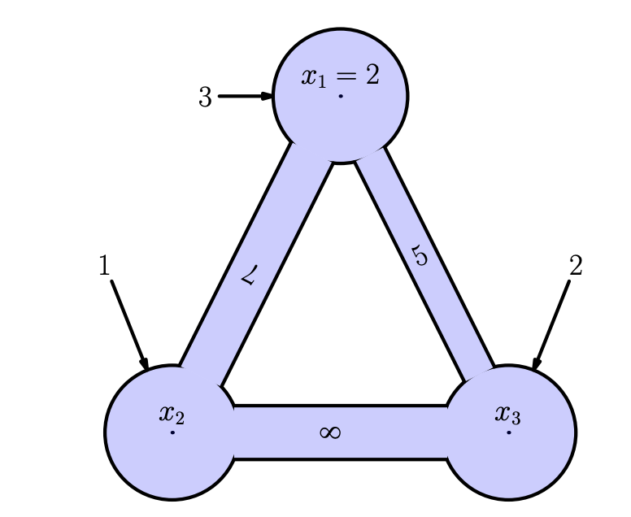
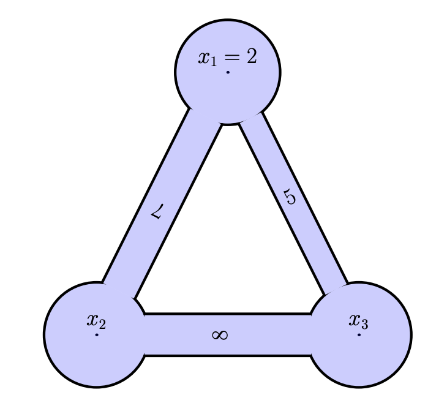

<!-- include the hint.js -->
<script src="../../hints.js"></script>

# Learning goals
* Understand the forward, backward and central spatial differencing scheme 
* Understand how to construct a matrix to solve a system of equations 
* Understand how to solve a steady-state system with spatial derivatives using matrix algebra 
* Understand the advection-diffusion equation and how to solve a stationary form

# 1. Introduction
## 1.1. Advection Diffusion Equation 
The aim of the finite difference approach is to learn a basic method to discretize differential equations in space and time. A prominent example of a differential equation in our field is the advection-diffusion equation. This equation looks as follows:

$$\frac{\partial s}{\partial t} = -u \frac{\partial s}{\partial x} + D\frac{\partial^{2}s}{\partial x^{2}}$$
where $s$ can be any species that can be transported, $u$ is the fluid (water or air) velocity, $D$ is the diffusivity, $x$ is the position, and $t$ is time. This equation contains space and time derivatives and is therefore a *partial differential equation*. In this assignment, you will first study this equation under stationary conditions ($\frac{\partial s}{\partial t} = 0$):

$$0 = -u \frac{\partial s}{\partial x} + D\frac{\partial^{2}s}{\partial x^{2}}$$
Before that, we will first explore some more theory that is needed to do so.

## 1.2. Backward and Central Differencing method
In the previous assignment, we have been working with the following equation:
$$\dfrac{ds}{dt} \approx \dfrac{s(t+\Delta t) - s(t)}{\Delta t}$$
This is called the *forward differencing method*. It calculates derivatives based on the actual time value ($t$) and that of one step ahead ($t + \Delta t$). The methodology of solving equations in space is exactly the same, only the mathematical formulation changes slightly:

$$\dfrac{ds}{dx} \approx \dfrac{s(x+\Delta x) - s(x)}{\Delta x}$$
The only change in this equation is that time $(t)$ has been substituted by space $(x)$. By using this formulation you change the dimension, meaning that you will find out the how fast variable $s$ changes in space in stead of in time.

There is generally a difference in perspective in how space and time are used. In the case of time, you use the derivative to advance a system in time: you want to know the state of the system $s$ at a next time step. In space, however, in most cases, you are presented with the spatial field of $s$, where the gradients are unknown. You often need these spatial gradients for your model calculations. In space, next to the forward differencing methods, we also often make use of the *backward differencing method* and the *centered differencing* method.

First, we will go through the mathematical derivation. The forward differencing method in space uses the location at which the derivatives are calculated and the point right (forward in space) of it:

$$s(x + \Delta x) = s(x) + \Delta x \frac{ds}{dx} \bigg\rvert_{x} + \frac{\Delta x^{2}}{2!} \frac{d^{2}s}{dx^{2}} \bigg\rvert_{x} + \frac{\Delta x^{3}}{3!} \frac{d^{3}s}{dx^{3}} \bigg\rvert_{x} + \frac{\Delta x^{4}}{4!} \frac{d^{4}s}{dx^{4}} \bigg\rvert_{x} + \ \cdots     $$

The backward scheme looks back along the space axis (in negative direction) and is defined as follows:

$$s(x - \Delta x) = s(x) - \Delta x \frac{ds}{dx} \bigg\rvert_{x} + \frac{\Delta x^{2}}{2!} \frac{d^{2}s}{dx^{2}} \bigg\rvert_{x} - \frac{\Delta x^{3}}{3!} \frac{d^{3}s}{dx^{3}} \bigg\rvert_{x} + \frac{\Delta x^{4}}{4!} \frac{d^{4}s}{dx^{4}} \bigg\rvert_{x} - \ \cdots     $$

Reworking this equation leads to the backward differencing scheme:

$$\frac{s(x) - s(x  - \Delta x)}{dx} = \frac{ds}{dx} + \cdots$$

The *central differencing scheme* is created by substracting the Taylor series used for the forward and backward schemes. It is called centered because it is symmetric. It uses one point forward (right) of where the derivative is calculated, and one point (left) backward.

\begin{alignat*}{3}
s(x + \Delta x) &= s(x) + && \dfrac{\Delta x}{1!} \dfrac{ds}{dx} \bigg\rvert_{x} + \dfrac{\Delta x^{2}}{2!} \dfrac{d^{2}s}{dx^{2}} \bigg\rvert_{x} + &&& \dfrac{\Delta x^{3}}{3!} \dfrac{d^{3}s}{dx^{3}} \bigg\rvert_{x} + \dfrac{\Delta x^{4}}{4!} \dfrac{d^{4}s}{dx^{4}} \bigg\rvert_{x} + \ ... \\    


s(x - \Delta x) &= s(x) - && \dfrac{\Delta x}{1!} \dfrac{ds}{dx} \bigg\rvert_{x} + \dfrac{\Delta x^{2}}{2!} \dfrac{d^{2}s}{dx^{2}} \bigg\rvert_{x} - &&&\dfrac{\Delta x^{3}}{3!} \dfrac{d^{3}s}{dx^{3}} \bigg\rvert_{x} + \dfrac{\Delta x^{4}}{4!} \dfrac{d^{4}s}{dx^{4}} \bigg\rvert_{x} - \ ...  \\

\hline \\

s(x + \Delta x) - s(x - \Delta x) &=  &&\dfrac{2\Delta x}{1!}\dfrac{ds}{dx} +  &&&\dfrac{2\Delta x^{3}}{3!} \dfrac{d^{3}s}{dx^{3}}
\end{alignat*}

It can be seen quite easily that this is an efficient scheme. The second and fourth derivative are canceled out by substraction, leaving an error term in the final equation that has the third derivative as largest contributor instead of the second. This reduces the error significantly. The final equation to express the first derivative is as follows:

$$\frac{s(x + \Delta x) - s(x - \Delta x)}{2\Delta x} = \frac{ds}{dx} + \cdots$$
<div class="exercise">
1.1 Give for each of the approximations the first error term (the next term that should come at the $\ldots$).
<br><br>
1.2 Can you explain from the error why the forward and backward differencing method have first-order error convergence, and the centered scheme has second-order error convergence?
</div>

<div class="answer">
For both the forward and backward scheme, the first error term equals:
$$ \frac{\Delta x^{2}}{2!} \frac{d^{2}s}{dx^{2}} \frac{1}{\Delta x} = \frac{\Delta x}{2!} \frac{d^{2}s}{dx^{2}}$$

For the centered scheme, the second derivative is eliminated and the first (largest) error term is only formed by the third derivative:
$$ \dfrac{2\Delta x^{3}}{3!} \dfrac{d^{3}s}{dx^{3}} \frac{1}{2\Delta x} = \dfrac{\Delta x^{2}}{3!} \dfrac{d^{3}s}{dx^{3}}$$
</div>

In order to visualize the effects of the three different approximations, you will now implement each of them for an example containing a *standing wave*. You will compute the derivatives of $s(x) = \sin(x)$. This you will do for each of the three methods: forward, backward, and centered.

<div class="exercise">
1.3 Implement the calculations for the three different methods below. You can construct a loop over all elements, or write out the expression directly using ranges (for instance `dsdx.forward[1:(length(s)-1)]) = ...`)
<br><br>
1.4 Which of the three methods performs the best?
<br><br>
1.5 Decrease `dx` in steps. Do all three methods converge to the correct result? Which one converges fastest, and why?
</div>

<div class="student_answer">
Work out the code below.
```{r eval=FALSE}
# Initial parameter values
left  = 0     # left x-coordinate
right = 2*pi  # right x-coordinate
dx    = pi/6  # delta x; space discretisation

# Simulation initialisation
space.sequence = seq(left, right, by=dx)
dsdx.forward  = rep(0, length(space.sequence)) #derivative with forward method
dsdx.backward = rep(0, length(space.sequence)) #derivative with backward method
dsdx.centered = rep(0, length(space.sequence)) #derivative with centered method
s = sin(space.sequence)

# Add the calculations of forward, backward, centered derivative below (filling the three dsdx vectors)

# Plotting
plot(space.sequence, dsdx.forward, type='o', xlab="x (m)", ylab="dsdx", ylim = c(-1.5, 1.5), col="blue")
lines(space.sequence, dsdx.backward, type='o', col="red")
lines(space.sequence, dsdx.centered, type='o', col="green")
space.sequence = seq(left, right, by=0.01)
analyt.state = cos(space.sequence)
lines(space.sequence, analyt.state, col='black', lty=3)
legend("top", legend=c("forward", "backward", "centered", "analytical"), col=c("blue", "red", "green", "black"), lty=c(1,1,1,3), bty="n")
title(main='Numerical and analytical solution compared')
grid()
```
</div>

<div class="answer">
```{r}
# Initial parameter values
left  = 0     # left x-coordinate
right = 2*pi  # right x-coordinate
dx    = pi/6  # delta x; space discretisation 

# Simulation initialisation
space.sequence = seq(left, right, by=dx)
dsdx.forward = rep(0, length(space.sequence))
dsdx.backward = rep(0, length(space.sequence))
dsdx.centered = rep(0, length(space.sequence))
s = sin(space.sequence)

# Add the calculations of forward, backward, centered derivative below.

# The work out in the three lines below is based on ranges; rows are moved compared to each other. 
# This is the most efficient way of coding this issue. 
dsdx.forward [1:(length(s)-1)] = (s[2:length(s)] - s[1:(length(s)-1)]) / dx
dsdx.backward[2:length(s)]     = (s[2:length(s)] - s[1:(length(s)-1)]) / dx
dsdx.centered[2:(length(s)-1)] = (s[3:length(s)] - s[1:(length(s)-2)]) / (2*dx)

# An alternative way would be by means of a loop (which gives the same answer): 
for (i in 1:length(s)-1)
{
 dsdx.forward[i]= (s[i+1] - s[i]) / dx
}

# Add the boundaries on the left
dsdx.backward[1] = (s[2]-s[1]) / dx
dsdx.centered[1] = (s[2]-s[1]) / dx

# Add the boundaries on the right
dsdx.forward [length(s)] = (s[length(s)]-s[length(s)-1]) / dx
dsdx.centered[length(s)] = (s[length(s)]-s[length(s)-1]) / dx

# Plotting
plot(space.sequence, dsdx.forward, type='o', xlab="x (m)", ylab="dsdx", ylim = c(-1.5, 1.5), col="blue")
lines(space.sequence, dsdx.backward, type='o', col="red")
lines(space.sequence, dsdx.centered, type='o', col="green")
space.sequence = seq(left, right, by=0.01)
analyt.state = cos(space.sequence)
lines(space.sequence, analyt.state, col='black', lty=3)
legend("top", legend=c("forward", "backward", "centered", "analytical"), col=c("blue", "red", "green", "black"), lty=c(1,1,1,3), bty="n")
title(main='Numerical and analytical solution compared')
grid()
```

The centered method performs better than the other two. When dx is decreased, all three methods finally converge to the correct solution, but the centered method converges much faster.
</div>

# 2. Matrix calculation intermezzo
## 2.1. Defining a matrix
Further in this and the next tutorial, we will use matrix algebra intensively. This part is a short tutorial for working with matrices in the R environment.

A formal definition of a matrix is a collection of numbers organized in rows and columns. The following lines of codes construct a matrix:

```{R}
M = matrix (c(1, 2, 3, 4, 5, 6) , nrow=2)
print(M)
```

The code lines above made a matrix by giving all the values in the construction itself. Once constructed, values of a matrix can be changed in different ways.

<div class="exercise">
2.1 How many rows and how many columns has this matrix?
</div>

<div class="answer">
2 rows, 3 columns
</answer>

<div class="exercise">
2.2 Describe for each of the following lines the changes made to the matrix M.
```{R}
M[1,2]= 100
M[1, ]= c(10, 11, 12)
M[ ,2]= c(-1 ,-2)
```
</div>

<div class="exercise">
2.3 What is the difference between the matrix constructed above and the matrix constructed by:
```{R}
M = matrix(c(1, 2, 3, 4, 5, 6), nrow=2 , ncol=3)
```
</div>

<div class="exercise">
2.4 What is the difference between the first matrix and the matrix constructed by:
```{R}
M = matrix(c(1, 2, 3, 4, 5, 6) , nrow=2 , ncol=2)
```
</div>

<div class="exercise">
2.5 What is the difference between the first matrix and the matrix constructed by:
```{R}
M = matrix(c(1, 2, 3, 4, 5, 6) , nrow=2 , ncol=4)
```
</div>

<div class="exercise">
2.6 What is the difference between the first matrix and the matrix constructed by:
```{R}
M = matrix(c(1, 2, 3, 4, 5, 6) , nrow=2 , ncol=3 , byrow=TRUE)
```
</div>

## 2.2. Constructing matrices
The matrix constructions in the previous exercise were very explicit. Many
matrices (certainly large ones) can more efficiently be constructed by loops. The following lines of code give an example (and prints the result):

```{R}
M = matrix(0, nrow=5, ncol=7)
for(i in 1:nrow(M)) {
  for(j in 1:ncol(M)) {
    M[i,j]=i+j
  }
}
print(M)
```

<div class="exercise">
2.7 Make code with a double loop as above that constructs the following matrix:

```{}
> print(M)
     [,1] [,2] [,3] [,4] [,5]
[1,]   11   12   13   14   15
[2,]   21   22   23   24   25
[3,]   31   32   33   34   35
```
</div>

<div class="answer">
```{R}
M = matrix(0,nrow=3,ncol=5)
for(i in 1:nrow(M)) {
  for(j in 1:ncol(M)){
    M[i,j]=10*i+j
  }
}
print(M)
```
</div>

<div class="exercise">
2.8 Make code with a double loop as above that constructs the following matrix:

```{}
> print(M)
     [,1][,2][,3][,4][,5]
[1,]    0   1   2   3   4
[2,]    1   0   1   2   3
[3,]    2   1   0   1   2
[4,]    3   2   1   0   1
[5,]    4   3   2   1   0
```
</div>

<div class="answer">
```{R}
M = matrix(0,nrow=5,ncol=5)
for(i in 1:nrow(M)) {
  for(j in 1:ncol(M)){
    M[i,j]=abs(i-j)
  }
}
print(M)
```
</div>

## 2.3. Solving matrices
These exercise are an introduction to the solution of linear equations. The following linear equations:

$$
\begin{align}
 2x_1 + x_2 -  x_3 = 8\\
-3x_1 - x_2 + 2x_3 = -11\\
-2x_1 + x_2 + 2x_3 = -3
\end{align}
$$
are rewritten in matrix form:

$$
\begin{matrix}
A\ x &=& b\\
\begin{bmatrix}
2&1&-1\\-3&-1&2\\-2&1&2
\end{bmatrix}
\begin{bmatrix}
x_1\\x_2\\x_2
\end{bmatrix}
&=&
\begin{bmatrix}
8\\-11\\-3
\end{bmatrix}
\end{matrix}
$$
This system of equations can be solved in the following way, where $I$ is the [identity matrix](https://en.wikipedia.org/wiki/Identity_matrix).
$$
Ax = b\\
A^{-1}Ax = A^{-1}b\\
Ix = A^{-1}b\\
x = A^{-1}b
$$
By hand this can be done with [Gaussian elimination](https://en.wikipedia.org/wiki/Gaussian_elimination). If unfamiliar with this method or if in need of a quick refresher, the following video might be instructive: https://www.youtube.com/watch?v=xCIXkm3-ocQ 

R can also directly solve for $x$, given the matrices A and b:

```{}
x = solve(A,b)
```

<div class="exercise">
2.9 Find the solution of the above system of equations first by hand and check your solution by solving it in R.
</div>

<div class="answer">
Work out by hand following Gaussian elimination:
$$
\begin{matrix}
\begin{bmatrix}
2&1&-1\\-3&-1&2\\-2&1&2
\end{bmatrix}
\begin{bmatrix}
8\\-11\\-3
\end{bmatrix}
\end{matrix}
$$
Add 1.5 times the first row to the second row, such that the -3 in the first column becomes zero, and add one time the first row to the third row, such that the -2 in the first column becomes zero:
$$
\begin{matrix}
\begin{bmatrix}
2&1&-1\\0&0.5&0.5\\0&2&1
\end{bmatrix}
\begin{bmatrix}
8\\1\\5
\end{bmatrix}
\end{matrix}
$$
Now, add minus four times the second row to the third row, such that the 2 at the second column becomes zero:
$$
\begin{matrix}
\begin{bmatrix}
2&1&-1\\0&0.5&0.5\\0&0&-1
\end{bmatrix}
\begin{bmatrix}
8\\1\\1
\end{bmatrix}
\end{matrix}
$$
From this, it directly follows that 
$$
-1x_3=1 \\
x_3=-1 
$$

Knowing that, $x_2$ can be derived from the second line:

$$
0.5 \cdot x_2 + 0.5 \cdot -1 = 1 \\
x_2 = 3
$$
and $x_1$ can be derived once knowing $x_2$ and $x_3$. 

$$
2 \cdot x_1 + 1 \cdot 3 + -1 \cdot -1 = 8 \\
x_1 = 2
$$

</div>

<div class="exercise">
2.10 Find the solution with R (as done above) of the following equations:
$$
\begin{align}
x_1 = 4\\
-x_1 + 2x_2 - x_3 = 1\\
-x_2 + 2x_3 - x_4 = 1\\
-x_3 + 2x_4 - x_5 = 1\\
x_5 = 2
\end{align}
$$
</div>

<div class="answer">
```{R}
A = matrix(c(1,0,0,0,0,-1,2,-1,0,0,0,-1,2,-1,0,0,0,-1,2,-1,0,0,0,0,1),nrow=5,ncol=5,byrow=TRUE)
b = matrix(c(4,1,1,1,2),nrow=5)
print(solve(A,b))
```
</div>

The equations above can be generalized for any integer N into:
$$ 
\begin{matrix}
& &&x_1 &=& 4\\
&\ i\ \in\ \left[2, N-1 \right] && -x_{i-1} + 2x_i-x_{i+1} &=& 1\\
& &&x_N &=& 2
\end{matrix}
$$

Write code that generates the matrices for the equations above and
solves them. Use the following lines as a starter:

```{R}
N = 5
A = matrix(0,nrow=N,ncol=N)
b = rep(1,length=N)
```

<div class="exercise">
2.11 Finish this code.
<br><br>
2.12 Check that for N=5 the result of the previous exercise is recalculated.
<br><br>
2.13 Make a plot of the result for N=25.
</div>

<div class="answer">
```{R}
N      = 25
A      = matrix(0,nrow=N,ncol=N)
b      = rep(1,length=N)
A[1,1] = 1
b[1]   = 4
b[N]   = 2
A[N,N] = 1
for(i in 2:(N-1)){
  A[i,i  ] = 2
  A[i,i-1] = -1
  A[i,i+1] = -1
}
print(solve(A,b))
plot(solve(A,b))
```
</div>

## 2.4. Flow problems
In this section the translation of (stationary, discrete) flow problems into a set of linear equations is reviewed.

In what follows, flow problems will be defined by graphs such as:
</br>
{width=30%}

* The circles stand for cylinders with unknown fluid level for which a name is suggested inside the circle ($x_i$).
* Some of the levels inside the cylinders are prescribed (as is the case in the top cylinder of the example above); these prescribed values are boundary conditions.
* The cylinders are connected with pipes, whose cross sectional areas are indicated inside the pipes by numbers. The flux between these cylinders is given by this area times the level differences between the cylinders connected.
* There can be external amounts of fluids added to the cylinders, as, for instance, the flux with number 3 to the top.

The fluxes between the cylinders are calculated by multiplying the difference between the two cylinders and the cross sectional area. For example between $x_1$ and $x_2$ there is the following flow:

$$q_{1\to2} = 7(x_1-x_2)$$
which is equal to the flux going in the other direction:
$$q_{2\to1} = 7(x_2-x_1)$$
<div class="exercise">
2.14 Write down the other fluxes in the system (both forward and backward through the pipe)
</div>

<div class="answer">
$$
\begin{align}
q_{2\to3} &= 8(x_2-x_3)\\
q_{3\to2} &= 8(x_3-x_2)\\
\\
q_{3\to1} &= 5(x_3-x_1)\\
q_{1\to3} &= 5(x_1-x_3)
\end{align}
$$
</div>

From these equations, mass balances can be set up, assuming that the system is stationary. For example for cylinder $x_1$:

$$
\begin{align}
q_{2\to1} + q_{3\to1} + 3 = 0 \\
7(x_2-x_1) + 5(x_3-x_1) + 3 = 0
\end{align}
$$
<div class="exercise">
2.15 Set up the mass balances for $x_2$ and $x_3$.
</div>

<div class="answer">
$$
\begin{align}
q_{3\to2} + q_{1\to2} + 1 = 0 \\
8(x_3-x_2) + 7(x_1-x_2) + 1 = 0\\
\\
q_{1\to3} + q_{2\to3} + 2 = 0 \\
5(x_1-x_3) + 8(x_2-x_3) + 2 = 0\\
\end{align}
$$
</div>

<div class="exercise">
2.16 Write the previous three mass balance equations in the form:
$$ax_1 + bx_2 + cx_3 = d$$
</div>

<div class="answer">
$$
\begin{align}
-12x_1 + 7x_2 + 5x_3 = -3\\
7x_1 - 15x_2 + 8x_3 = -1\\
5x_1 + 8x_2 -13x_3 = -2
\end{align}
$$
</div>

<div class="exercise">
2.17 Plug the previous equations in an A and b matrix in the following way:

$$
\begin{align}
Ax &= b\\
\begin{bmatrix}
a_{1} & b_{1} & c_{1}\\a_{2} & b_{2} & c_{2}\\a_{3} & b_{3} & c_{3}
\end{bmatrix} \cdot
\begin{bmatrix}
x_1\\x_2\\x_3
\end{bmatrix} &=
\begin{bmatrix}
d_1\\d_2\\d_3
\end{bmatrix}
\end{align}
$$
</div>

<div class="answer">
$$
\begin{align}
\begin{bmatrix}
-12&7&5\\7&-15&8\\5&8&-13
\end{bmatrix} *
\begin{bmatrix}
x_1\\x_2\\x_3
\end{bmatrix} &=
\begin{bmatrix}
-3\\-1\\-2
\end{bmatrix}
\end{align}
$$
</div>

<div class="exercise">
2.18 Put the boundary condition $x_1 = 2$ into the matrix.
</div>

<div class="answer">
$$
\begin{align}
\begin{bmatrix}
1&0&0\\7&-15&8\\5&8&-13
\end{bmatrix} *
\begin{bmatrix}
x_1\\x_2\\x_3
\end{bmatrix} &=
\begin{bmatrix}
2\\-1\\-2
\end{bmatrix}
\end{align}
$$
</div>

<div class="exercise">
2.19 Implement these matrices in R and let R find the x vector.
</div>

<div class="answer">
```{R}
M=matrix(0,nrow=3,ncol=3)
# bring flux between 1and 2 in matrix
M[1,1] = M[1,1]-7
M[1,2] = M[1,2]+7
M[2,2] = M[2,2]-7
M[2,1] = M[2,1]+7
# bring flux between 1 and 3 in matrix
M[1,1] = M[1,1]-5
M[1,3] = M[1,3]+5
M[3,3] = M[3,3]-5
M[3,1] = M[3,1]+5
# bring flux between 2 and 3 in matrix
M[2,2] = M[2,2]-8
M[2,3] = M[2,3]+8
M[3,3] = M[3,3]-8
M[3,2] = M[3,2]+8
# bring in the boundary condition
M[1,]  = 0
M[1,1] = 1
# right hand side
b = c(2,-1,-2)
print(solve(M,b))
```
</div>

<div class="exercise">
2.20 Solve the system depicted in the following scheme and explain the result: 
</br>

{width=30%}

</div>

<div class="answer">
```{R}
M=matrix(0,nrow=3,ncol=3)
# bring flux between 1and 2 in matrix
M[1,1] = M[1,1]-7
M[1,2] = M[1,2]+7
M[2,2] = M[2,2]-7
M[2,1] = M[2,1]+7
# bring flux between 1 and 3 in matrix
M[1,1] = M[1,1]-5
M[1,3] = M[1,3]+5
M[3,3] = M[3,3]-5
M[3,1] = M[3,1]+5
# bring flux between 2 and 3 in matrix
M[2,2] = M[2,2]-8
M[2,3] = M[2,3]+8
M[3,3] = M[3,3]-8
M[3,2] = M[3,2]+8
# bring in the boundary condition
M[1,]  = 0
M[1,1] = 1
# right hand side
b = c(2,0,0)
print(solve(M,b))
```
There is nothing to disturb the system, so it will become steady state with a uniform final state.
</div>

This is the easiest way of implementing and solving systems with matrices. There are, however, smarter and faster ways of doing this. 

*For a challenging exercise, go to **Exercise 1** in the `Finite_difference_2_extra.Rmd` file.*

<div class="comment">
Exercise 6 in the pdf could be useful
</div>

# 3. Bringing matrix algebra and finite differences together

## 3.1. The first-order derivative
In part 1, you have computed the derivatives in an intuitive way, using multiplication and additions of vectors. You can also compute derivatives in a more general way, using matrices. This is a very powerful technique, because it permits the solution of steady state systems, as well as for an easy extension towards system that vary in space and time, such as the advection-diffusion equation.

Let's first look at the case of Part 1.2: the sinus wave. Let us assume that we do not know the derivative and use finite differences to compute the spatial derivative (The "observations" are in fact calculated with the function $f = \sin(x)$ and therefore the exact solution is known: a cosine wave).

We aim to write the computation of the derivative in the form

$$
Ms = v
$$
where the matrix $M$ contains the operation that performs the derivative on vector $s$ (the states), such that vector $v$ contains the derivative $ds/dx$ at each point. We therefore call the matrix of coefficients contained in $M$ the *operator*. Remember that each line in the matrix contains an equation.    
In this case, we have a row of N nodes in space (i=1 to N) with states $s_{1}$ to $s_{N}$. In case of the forward differencing method, the first line of the matrix contains the coefficients of the equation
$$
\dfrac{s_2 - s_1}{\Delta x} = \left.\dfrac{ds}{dx} \right|_1
$$
In other words, we compute the derivative $(ds/dx)_1$ based on the values of $s_1$ and $s_2$. This generalizes to $(s_{i+1} - s_i)/\Delta x = (ds/dx)_i$. For a vector of $N$ elements, you will get a $N \times N$ matrix.

<div class="exercise">
3.1 Fill in the matrix below for a system of five nodes (a $5 \times 5$ forward differencing operator). TIP: think carefully about what to do with the last row, as the forward operator cannot be applied here.
</div>

<div class="student_answer">
$$
\begin{bmatrix}
&.&.&.&.\\
&.&.&.&.\\
&.&.&.&.\\
&.&.&.&.\\
&.&.&.&.
\end{bmatrix}
\cdot 
\begin{bmatrix}
s_1\\ 
s_2\\ 
s_3\\ 
s_4\\ 
s_5
\end{bmatrix}
= 
\begin{bmatrix}
(ds/dx)_1\\ 
(ds/dx)_2\\ 
(ds/dx)_3\\ 
(ds/dx)_4\\ 
(ds/dx)_5
\end{bmatrix}
$$
</div>

<div class="answer">
$$
\begin{bmatrix}
&\frac{-1}{\Delta x}&\frac{1}{\Delta x}&.&.&.\\
&.&\frac{-1}{\Delta x}&\frac{1}{\Delta x}&.&.\\
&.&.&\frac{-1}{\Delta x}&\frac{1}{\Delta x}&.\\
&.&.&.&\frac{-1}{\Delta x}&\frac{1}{\Delta x}\\
&.&.&.&\frac{-1}{\Delta x}&\frac{1}{\Delta x}
\end{bmatrix}
\cdot 
\begin{bmatrix}
s_1\\ 
s_2\\ 
s_3\\ 
s_4\\ 
s_5
\end{bmatrix}
= 
\begin{bmatrix}
(ds/dx)_1\\ 
(ds/dx)_2\\ 
(ds/dx)_3\\ 
(ds/dx)_4\\ 
(ds/dx)_5
\end{bmatrix}
$$
</div>

Now, you will implement this problem into a piece of code. Note that we are not trying to find the vector $s$, but the derivatives vector $v$. Therefore, we do not need the `solve` function of R yet, but we can use matrix multiplication $M*s$ to find $v$. Note that in R matrix multiplication is performed as follows: `M %*% s`.

<div class="exercise">
3.2 Complete the code block below, and compare your results against the analytical solution.
</div>

<div class="student_answer">
```{r forward_derivative, eval=FALSE}
rm(list=ls()) 

# setting up initial parameters
dx    = pi/2
left  = 0
right = 2*pi
xcoor = seq(left, right, by=dx) # builds a list of all coordinates

M = matrix(0, nrow=length(xcoor), ncol=length(xcoor)) # an empty matrix for the differencing scheme
v = rep(0, length(xcoor))

s = sin(xcoor) # the original sinus series that needs to be differentiated

# populating vector and matrix
# WRITE A LOOP TO FILL THE MATRIX

# Apply the derivative operator using matrix multiplication.
# FIND THE VECTOR v

# plotting
N = length(xcoor)
plot(xcoor, v, ylab="derivative", xlab="x (m)", type='o', col='blue', ylim = c(-1.5,1.5), xlim = c(0,2*pi)) # numerical approximation
x_sol = seq(left, right, by=0.05)
lines(x_sol, cos(x_sol), type='l', col="grey", lwd=2)
title(main='Forward differencing scheme with matrices')
grid()
```
</div>

<div class="answer">

```{r forward_derivative_answer}
rm(list=ls()) 

# setting up initial parameters
dx    = pi/2
left  = 0
right = 2*pi
xcoor = seq(left, right, by=dx) # builds a list of all coordinates

M = matrix(0, nrow=length(xcoor), ncol=length(xcoor)) # an empty matrix for the differencing scheme
v = rep(0, length(xcoor))

s = sin(xcoor) # the original sinus series that needs to be differentiated

# populating vector and matrix
nx = length(xcoor)
for (j in 1:(nx-1))
{
  M[j,j+1] = +1/dx
  M[j,j]   = -1/dx
}
M[nx,nx]   = +1/dx
M[nx,nx-1] = -1/dx

# Apply the derivative operator using matrix multiplication.
v = M %*% s

# plotting
N = length(xcoor)
plot(xcoor, v, ylab="derivative", xlab="x (m)", type='o', col='blue', ylim = c(-1.5,1.5), xlim = c(0,2*pi)) # numerical approximation
x_sol = seq(left, right, by=0.05)
lines(x_sol, cos(x_sol), type='l', col="grey", lwd=2)
title(main='Forward differencing scheme with matrices')
grid()
```
</div>

<div class="exercise">
3.3 Implement the backward and central scheme in the same way as in the previous exercise and plot them together in the same plot using different colors.
</div>

<div class="student answer">
```{r all_derivatives, eval=FALSE}
rm(list=ls()) 

# setting up initial parameters
dx    = pi/2
left  = 0
right = 2*pi
xcoor = seq(left, right, by=dx) # builds a list of all coordinates

M_forward = matrix(0, nrow=length(xcoor), ncol=length(xcoor)) # an empty matrix 
v_forward = rep(0, length(xcoor))

M_backward = matrix(0, nrow=length(xcoor), ncol=length(xcoor)) # an empty matrix 
v_backward = rep(0, length(xcoor))

M_centered = matrix(0, nrow=length(xcoor), ncol=length(xcoor)) # an empty matrix 
v_centered = rep(0, length(xcoor))

s = sin(xcoor) # the original sinus series that needs to be differentiated

# populating vector and matrix
# WRITE A LOOP (OR MULTIPLE LOOPS) TO FILL THE MATRICES

# Apply the derivative operator using matrix multiplication.
# CALCULATE THE DERIVATIVES HERE

# plotting
N = length(xcoor)
plot(xcoor, v_forward, ylab="derivative", xlab="x (m)", type='o', col='blue', ylim = c(-1.5,1.5), xlim = c(0, 2*pi)) # numerical approximation
# ADD THE OTHER TWO LINES
x_sol = seq(left, right, by=0.05)
lines(x_sol, cos(x_sol), type='l', col="grey", lwd=2)
title(main='Differencing scheme with matrices')
grid()
# legend(XXXX)
```
</div>

<div class="answer">
```{r all_derivatives_answers}
rm(list=ls()) 

# setting up initial parameters
dx    = pi/2
left  = 0
right = 2*pi
xcoor = seq(left, right, by=dx) # builds a list of all coordinates

M_forward = matrix(0, nrow=length(xcoor), ncol=length(xcoor)) # an empty matrix 
v_forward = rep(0, length(xcoor))

M_backward = matrix(0, nrow=length(xcoor), ncol=length(xcoor)) # an empty matrix 
v_backward = rep(0, length(xcoor))

M_centered = matrix(0, nrow=length(xcoor), ncol=length(xcoor)) # an empty matrix 
v_centered = rep(0, length(xcoor))

s = sin(xcoor) # the original sinus series that needs to be differentiated

# populating vector and matrix
nx = length(xcoor)

# forward
for (j in 1:(nx-1))
{
  M_forward[j,j+1] = +1/dx
  M_forward[j,j]   = -1/dx
}
M_forward[nx,nx]   = +1/dx
M_forward[nx,nx-1] = -1/dx

# backward
M_backward[1,2] = +1/dx
M_backward[1,1] = -1/dx
for (j in 2:nx)
{
  M_backward[j,j]   = +1/dx
  M_backward[j,j-1] = -1/dx
}

# centered
M_centered[1,2] = +1/dx
M_centered[1,1] = -1/dx
for (j in 2:(nx-1))
{
  M_centered[j,j+1] = +1/(2*dx)
  M_centered[j,j-1] = -1/(2*dx)
}
M_centered[nx,nx]   = +1/dx
M_centered[nx,nx-1] = -1/dx

# Apply the derivative operator using matrix multiplication.
v_forward  = M_forward  %*% s
v_backward = M_backward %*% s
v_centered = M_centered %*% s

# plotting
N = length(xcoor)
plot(xcoor, v_forward, ylab="derivative", xlab="x (m)", type='o', col='blue', ylim = c(-1.5,1.5), xlim = c(0, 2*pi)) # numerical approximation
lines(xcoor, v_backward, type='o', col='red') # numerical approximation
lines(xcoor, v_centered, type='o', col='green') # numerical approximation
x_sol = seq(left, right, by=0.05)
lines(x_sol, cos(x_sol), type='l', col="grey", lwd=2)
title(main='Differencing scheme with matrices')
grid()
legend(0,-1.2,c("forward","backward","centered","analytical"),col=c("blue","red","green","grey"),lwd=c(1,1,1,2),horiz=TRUE,cex=0.8)
```
</div>

To evaluate the quality of these different approaches you can compare the summed absolute error between the approximated and real values.    
*If you are up for a challenging exercise, where you will numerically derive the errors, you can open **Exercise 2** from the `Finite_differences_2_extended.Rmd` file. If not, you can continue here.* 

<div class="exercise">
3.4 Fill the following table of errors by running the chunk below.
</div>

<div class="student_answer">

| dx | Forward differencing scheme | Central differencing scheme |
| ------------- | ------------- | ------------- |
| $\pi$ |  |  |
| $\frac{1}{2}\pi$ |  |  |
| $\frac{1}{3}\pi$ |  |  |
| $\frac{1}{4}\pi$ |  |  |
| $\frac{1}{5}\pi$ |  |  |
| $\frac{1}{10}\pi$ |  |  |
| $\frac{1}{20}\pi$ |  |  |
</div>

<button type="button" onclick="toggle('Q2')">Show chunk</button>

<div id="Q2" style="display: none">
```{r calculate_error_differencing_schemes, eval=F}
rm(list=ls()) 
library(shiny)

f = function(scheme = "C", dx=(pi/2)){
  
  # scheme C = central
  # scheme F = forward
  
  #### setting up initial parameters
  dx    = dx
  left  = 0
  right = 2*pi
  xcoor = seq(left,right, by=dx) # builds a list of all coordinates
  N     = length(xcoor)
  s     = sin(xcoor)
  c     = cos(xcoor)
  
  ##### CENTRAL SCHEME WITH FORWARD AND BACKWARD VALUES ON THE OUTER NODES
  
  M     = matrix(0,nrow=length(xcoor),ncol=length(xcoor)) # an empty matrix for the differencing scheme
  
  # populating vector and matrix
  for(j in 2:(length(xcoor)-1))
  {
    M[j,j+1] = 1/(2*dx)
    M[j,j-1] = -1/(2*dx)
  }
  M[1,1  ] = -1/dx
  M[1,2  ] = 1/dx
  M[N,N  ] = 1/dx
  M[N,N-1] = -1/dx
  
  # solve matrix equation
  V_c = M %*% s
  
  ##### FORWARD SCHEME WITH BACKWARD RIGHT NODE
  
  M     = matrix(0,nrow=length(xcoor),ncol=length(xcoor)) # an empty matrix for the differencing scheme
  
  # populating vector and matrix
  for(j in 1:(length(xcoor)-1))
  {
    M[j,j]   = -1/dx
    M[j,j+1] = 1/dx
  }
  M[N,N  ] = 1/dx
  M[N,N-1] = -1/dx
  
  # solve matrix equation
  V_f = M %*% s
  
  ##### PLOTTING
  if(scheme == "C"){
    ## plotting C
    plot(xcoor[1:(N)],V_c[1:(N)], ylab="state (m)", xlab="x (m) ", type='o', col='blue', ylim=c(-1.5,1.5), xlim = c(0,2*pi)) # numerical approximation
    x_sol = seq(left,right,by=0.05)
    lines(x_sol,cos(x_sol),type='l', col="grey", lwd=2)
    
    # including error and 
    error = mean(abs(c-V_c))
    for(i in 1:N){
      points(xcoor[i],V_c[i],col="green",pch=19)
      points(xcoor[i],c[i],pch=19)
      segments(xcoor[i],V_c[i],xcoor[i],c[i],col="red",lwd=2)
    }
    
    title(main=paste('Central scheme, error = ', as.character(round(error,6))))
    grid()
  }
  
  ## plotting F
  if(scheme == "F"){
    plot(xcoor[1:(N)],V_f[1:(N)],ylab="state (m)",xlab="x (m) ",type='o',col='blue', ylim=c(-1.5,1.5), xlim = c(0,2*pi)) # numerical approximation
    x_sol = seq(left,right,by=0.05)
    lines(x_sol,cos(x_sol),type='l', col="grey",lwd=2)
    grid()
    
    # including error and 
    error = mean(abs(c-V_f))
    for(i in 1:N){
      points(xcoor[i],V_f[i],col="green",pch=19)
      points(xcoor[i],c[i],pch=19)
      segments(xcoor[i],V_f[i],xcoor[i],c[i],col="red",lwd=2)
    }
    
    title(main=paste('Forward scheme, error = ',as.character(round(error,3))))
    grid()
  }
}

#########################################
ui <- fluidPage(
  
  # App title ----
  titlePanel("Calculate the error"),
  
  # Sidebar layout with input and output definitions ----
  sidebarLayout(
    
    # Sidebar panel for inputs ----
    sidebarPanel(
      
      selectInput("scheme", label="scheme", choices = list("Central differencing scheme"="C","Forward differencing scheme"="F")),
      sliderInput("dx", label  = HTML("dx (<sup>&Pi;</sup>&frasl;<sub>x</sub>):") , value=2, min = 1, max = 20, step = 1)
    ),
    
    # Main panel for displaying outputs ----
    mainPanel(
      
      # Output: Plot of the requested variable against mpg ----
      plotOutput("p")
    )
  )
)
server <- function(input, output) {
  output$p = renderPlot({f(scheme = input$scheme, dx = pi/(input$dx))})
}

shinyApp(ui, server)
```
</div>

<div class="answer">
| dx | Forward differencing scheme | Central differencing scheme |
| ------------- | ------------- | ------------- |
| $\pi$ | 1 | 1 |
| $\frac{1}{2}\pi$ | 0.47 | 0.22 |
| $\frac{1}{3}\pi$ | 0.31 | 0.12 |
| $\frac{1}{4}\pi$ | 0.23 | 0.065 |
| $\frac{1}{5}\pi$ | 0.19 | 0.044 |
| $\frac{1}{10}\pi$ | 0.096 | 0.011 |
| $\frac{1}{20}\pi$ | 0.049 | 0.0026 |
</div>

<div class="exercise">
3.5 Which scheme converges fastest? Can you calculate the convergence rate (the error reduction per doubling of the number of grid points from the numbers)? Does this fit with the theory?
</div>

<div class="answer">
The centered difference scheme converges faster. Using the forward scheme, a reduction of the grid spacing a factor of 2 results in a reduction of a factor 2 in the error. The centered scheme has a error that is proportional to the grid spacing squared (2nd-order convergence). Therefore, a factor of 2 reduction in the grid spacing results in an error that is approximately 4 times smaller. This is in line with the theory in Section 1.2.
```{r}
#forward
forward_rate=mean(c(0.47/1,0.23/0.47,0.096/0.19,0.049/0.096))
centered_rate=mean(c(0.22/1,0.065/0.22,0.011/0.044,0.0026/0.011))
```
</div>

## 3.2. The second order derivative
In order to be able to solve the *stationary* advection diffusion equation later, there is still one other thing to be explained: how to compute the second order derivative in the equation

$$0 = -u \frac{\partial s}{\partial x} + D\frac{\partial^{2}s}{\partial x^{2}}$$
Also the *second* derivative finite differences operator can be derived from the Taylor series. To do so, we need to combine the forward and backward differencing methods that are written below:

\begin{align*}
s(x + \Delta x) & = s(x) + \dfrac{\Delta x}{1!} \dfrac{ds}{dx} \bigg\rvert_{x} + \dfrac{(\Delta x)^{2}}{2!} \dfrac{d^{2}s}{dx^{2}} \bigg\rvert_{x} + \dfrac{(\Delta x)^{3}}{3!} \dfrac{d^{3}s}{dx^{3}} \bigg\rvert_{x} + \dfrac{(\Delta x)^{4}}{4!} \dfrac{d^{4}s}{dx^{4}} \bigg\rvert_{x} + \ \cdots \\    

s(x - \Delta x) & = s(x) - \dfrac{\Delta x}{1!} \dfrac{ds}{dx} \bigg\rvert_{x} + \dfrac{(\Delta x)^{2}}{2!} \dfrac{d^{2}s}{dx^{2}} \bigg\rvert_{x} - \dfrac{(\Delta x)^{3}}{3!} \dfrac{d^{3}s}{dx^{3}} \bigg\rvert_{x} + \dfrac{(\Delta x)^{4}}{4!} \dfrac{d^{4}s}{dx^{4}} \bigg\rvert_{x} - \ \cdots
\end{align*}

<div class="exercise">
3.6 Combine the two equations such that the term containing the first derivative falls out of the equation. 
</div>

<div class="answer">
$$
s(x + \Delta x) + s(x - \Delta x)
= 2 s(x) + (\Delta x)^2 \dfrac{d^{2}s}{dx^{2}} + \dfrac{(\Delta x)^4}{12} \dfrac{d^4 s}{dx^4}
$$
</div>

<div class="exercise">
3.7 Rewrite the equation such, that the operator (thus all instances of $s(x-\Delta x)$, $s(x)$, and $s(x+\Delta x)$) is on the left hand side, and on the right hand side are only the second derivative and the error.
</div>

<div class="answer">
$$
\dfrac{ s(x + \Delta x) - 2s(x) + s(x - \Delta x)}{(\Delta x)^2} 
= \dfrac{d^{2}s}{dx^{2}} + \dfrac{(\Delta x)^2}{12} \dfrac{d^4 s}{dx^4}
$$
</div>

<div class="exercise">
3.8 Use the derived equation to construct a matrix that can be used to compute the second derivative for all x-nodes. Copy your previous `forward_derivative` chunk below (Tip: you can navigate through the markdown with the button in the bottom of the editor window). Adapt the code to produce the second derivative. Keep in mind that you also have to prescribe the correct analytical solution!
</div>

<div class="student_answer">
Implement your code here.
```{r}
# WHOOP WHOOP NEW CODE
```
</div>

<div class="answer">
```{r central_second_derivative}
rm(list=ls()) 

# setting up initial parameters
dx    = pi/2
left  = 0
right = 2*pi
xcoor = seq(left,right, by=dx) # builds a list of all coordinates
s = sin(xcoor)

nx = length(xcoor)

M = matrix(0, nrow=nx, ncol=nx) # an empty matrix for the differencing scheme

# populating vector and matrix
for (j in 2:(nx-1))
{
  M[j,j+1] = 1/(dx^2)
  M[j,j  ] = -2/(dx^2)
  M[j,j-1] = 1/(dx^2)
}

# Compute the second derivative
v = M %*% s

# plotting
plot(xcoor[2:(nx-1)], v[2:(nx-1)], ylab="2nd derivative", xlab="x (m) ", type='o', col='blue', ylim=c(-1.5,1.5), xlim = c(0,2*pi)) # numerical approximation
x_sol = seq(left,right,by=0.05)
lines(x_sol,-sin(x_sol),type='l', col="grey",lwd=2)
title(main='Second derivative computed with matrices')
grid()
```
</div>

# 4. Solving the advection-diffusion equation
## 4.1. Boundary conditions
In the final part of this exercise, you will apply everything that you have learned in order to solve the advection-diffusion equation. 

The steady-state advection-diffusion equation
$$
0 = -u \dfrac{ds}{dx} + D \dfrac{d^2s}{dx^2}
$$
contains both first- and second-order derivatives. In order to solve such an equation, you need to apply boundary conditions to make the matrix invertible. So far, we have only implemented one type of boundary condition: the **Dirichlet boundary condition**. Such a condition assumes a fixed state at one or all boundaries. If the state directly next to this border has (more or less) the same state, it means that there is no flux over the boundary, whereas a large difference leads to a large flux. 

Another option is to implement a so-called **Neumann boundary condition** in which the gradient is fixed. Such a boundary condition is often used if we desire to control the flux through the boundary (for instance, to set a no-flow boundary). Another type of boundary condition is the **Cauchy/Robin boundary condition**, in which both the state and the gradient are specified. To summarize, three possible boundary conditions are:

* Dirichlet (fixed state: $s = c$)
* Neumann (fixed gradient $ds/dx = c$)
* Cauchy/Robin (fixed state and fixed gradient $as + b\,ds/dx = c$)


## 4.2 Implementation with Dirichlet boundary conditions
<div class="exercise">
4.1 Work out (pen and paper or $\LaTeX$) the stationary advection-diffusion equation (given at the beginning of this section) with 5 nodes (n=5) and two Dirichlet boundaries (left=0 and right=1) in the notation below. Use a centered derivative for the first derivative in the advection term.

$$
\begin{bmatrix}
M_{1,1}&&\dots&&M_{1,n}\\
&&&&\\
\vdots&&\ddots&&\vdots\\
&&&&\\
M_{n,1}&&\dots&&M_{n,n}\\
\end{bmatrix} \cdot 
\begin{bmatrix}
s_1\\
s_2\\
s_3\\
s_4\\
s_5\\
\end{bmatrix} = 
\begin{bmatrix}
v_1\\
v_2\\
v_3\\
v_4\\
v_5\\
\end{bmatrix}
$$
TIP: remember that a boundary condition is just an equation that replaces one in the matrix.
</div>

<div class="answer">
$$
\begin{bmatrix}
1&.&.&.&.\\
\frac{u}{2dx} + \frac{D}{dx^2}&-\frac{2D}{dx^2}&-\frac{u}{2dx} + \frac{D}{dx^2}&.&.\\
.&\frac{u}{2dx} + \frac{D}{dx^2}&-\frac{2D}{dx^2}&-\frac{u}{2dx} + \frac{D}{dx^2}&.\\
.&.&\frac{u}{2dx} + \frac{D}{dx^2}&-\frac{2D}{dx^2}&-\frac{u}{2dx} + \frac{D}{dx^2}\\
.&.&.&.&1
\end{bmatrix} \cdot 
\begin{bmatrix}
s_1\\
s_2\\
s_3\\
s_4\\
s_5\\
\end{bmatrix} = 
\begin{bmatrix}
b_l\\
v_2\\
v_3\\
v_4\\
b_r\\
\end{bmatrix}
$$
</div>

*If you want to go deeper into the subject and implement the whole solver yourself, go to **Exercise 3** of the `Finite_differences_2_extra.Rmd` and skip the two following exercises here (continue with 4.4).*

<div class="exercise">
4.2 Calculate the values in the matrix with $\Delta x = 5$, $D=5$ and $u=5$ and check if the following chunk yields the same matrix.
```{R}
dx    = 5    # step size
D     = 5    # diffusion coefficient
u     = 5    # advection coefficient
bl    = 0    # left boundary
br    = 1    # right boundary
n     = 5    # amount of nodes

left  = 0    # left coordinate
xcoor = seq(left,dx*(n-1), by=dx)

v     = c()  # build an empty vector for the derivatives
M     = matrix(0, nrow=length(xcoor), ncol=length(xcoor)) 

for(j in 2:(length(xcoor)-1))
{
  M[j,j-1] = u/(2*dx) + D/(dx^2)
  M[j,j  ] = -2*D/(dx^2)
  M[j,j+1] = -u/(2*dx) + D/(dx^2)
  v[j]     = 0
}

# Left boundary
M[1,1] = 1
v[1]   = bl

# Right boundary
M[n,n] = 1
v[n]   = br

# Solve the system
s = solve(M,v)

print(M)
```
</div>

<div class="exercise">
4.3 Run the following chunk to see the quality of the solution:
```{R}
dx    = 5    # step size
D     = 5    # diffusion coefficient
u     = 5    # advection coefficient
bl    = 0    # left boundary
br    = 1    # right boundary
n     = 5    # amount of nodes

left  = 0    # left coordinate
xcoor = seq(left,dx*(n-1), by=dx)

v     = c()  # build an empty vector for the derivatives
M     = matrix(0, nrow=length(xcoor), ncol=length(xcoor)) 

for(j in 2:(length(xcoor)-1))
{
  M[j,j-1] = u/(2*dx) + D/(dx^2)
  M[j,j  ] = -2*D/(dx^2)
  M[j,j+1] = -u/(2*dx) + D/(dx^2)
  v[j]     = 0
}

# Left boundary
M[1,1] = 1
v[1]   = bl

# Right boundary
M[n,n] = 1
v[n]   = br

# Solve the system
s = solve(M,v)

# Plotting
plot(xcoor,s,ylab="state (m)",xlab="x (m) ",type='o',col='blue')
title(main='Advection Diffusion Equation')
grid()

# Calculate and plot the analytical solution
L = dx*(n-1)
xcooranalyt = seq(0,L, by=0.01)
sanalyt = c()
Danalyt = D
uanalyt = u
Peanalyt = uanalyt*L/Danalyt

for(j in 1:(length(xcooranalyt)))
{
  sanalyt[j] = bl+(exp(xcooranalyt[j]*Peanalyt/L)-1.)/(exp(Peanalyt)-1.)*(br-bl)
}

lines(xcooranalyt,sanalyt,col="grey",lwd=2) # analytical solution
legend(10, 0.8, c("numerical", "analytical"), col = c("blue","grey"), lty = c(1,1), pch = c(-1,-1))
```
</div>

<div class="exercise"> 
4.4 The following chunk is the same system as analysed in the previous exercise. The only difference is that the domain is increased to x=50. Change `dx` from 10 to 1 in steps of 1 and compare the results. What is the highest value of `dx` for which the solution is stable?
```{R}
dx    = 10   # step size
D     = 5    # diffusion coefficient
u     = 5    # advectio coefficient
bl    = 0    # left boundary
br    = 1    # right boundary

left  = 0    # left coordinate
right = 50
xcoor = seq(left,right, by=dx)

v     = c()  # build an empty vector for the derivatives
M     = matrix(0,nrow=length(xcoor),ncol=length(xcoor)) 

for(j in 2:(length(xcoor)-1))
{
  M[j,j-1] = u/(2*dx) + D/(dx^2)
  M[j,j  ] = -2*D/(dx^2)
  M[j,j+1] = -u/(2*dx) + D/(dx^2)
  v[j]     = 0
}
# Left boundary
M[1,1] = 1
v[1]   = bl

# Right boundary
n = length(xcoor)
M[n,n] = 1
v[n]   = br

# Solve the system
s = solve(M,v)

# Plotting
plot(xcoor,s,ylab="state (m)",xlab="x (m) ",type='o',col='blue')
title(main='Advection Diffusion Equation')
grid()

# Calculate and plot the analytical solution
L = dx*(n-1)
xcooranalyt = seq(0,L, by=0.01)
sanalyt = c()
Danalyt = D
uanalyt = u
Peanalyt = uanalyt*L/Danalyt

for(j in 1:(length(xcooranalyt)))
{
  sanalyt[j] = bl+(exp(xcooranalyt[j]*Peanalyt/L)-1.)/(exp(Peanalyt)-1.)*(br-bl)
}

lines(xcooranalyt,sanalyt,col="grey",lwd=2) # analytical solution
legend(10, 0.8, c("numerical", "analytical"), col = c("blue","grey"), lty = c(1,1), pch = c(-1,-1))
```

<div class="answer">
The solution becomes stable starting from dx=2 and below.
</div>

## 4.3. Implementation with a Neumann boundary condition
Here, you will work out the Neumann boundary condition case.    
*If you are motivated for a challenging exercise, you can open **Exercise 4** of the `Finite_differences_2_extra.Rmd` and skip the remainder of this section.*

As an example we will look at a Neumann boundary with a gradient of $0.5$. In mathematical terms this means:

$$
\dfrac{ds}{dx} = 0.5
$$
We would like to introduce this boundary condition at the right side of our domain.

<div class="exercise">
4.5 Work the boundary condition into the matrix $M$ of the previous exercise, such that the Dirichlet boundary condition is replaced by the Neumann boundary conditions. Do this using pen-and-paper or using $\LaTeX$.
</div>

<div class="answer">
$$
\dfrac{ds}{dx} = \dfrac{s[5]-s[4]}{\Delta x}\\
s[5] - s[4] = 0.5 * \Delta x = \frac{\Delta x}{2}
$$

and inserted in the matrix:

$$
\begin{bmatrix}
1&.&.&.&.\\
\frac{u}{2dx} + \frac{D}{dx^2}&-\frac{2D}{dx^2}&-\frac{u}{2dx} + \frac{D}{dx^2}&.&.\\
.&\frac{u}{2dx} + \frac{D}{dx^2}&-\frac{2D}{dx^2}&-\frac{u}{2dx} + \frac{D}{dx^2}&.\\
.&.&\frac{u}{2dx} + \frac{D}{dx^2}&-\frac{2D}{dx^2}&-\frac{u}{2dx} + \frac{D}{dx^2}\\
.&.&.&-1&1
\end{bmatrix} * 
\begin{bmatrix}
s_1\\
s_2\\
s_3\\
s_4\\
s_5\\
\end{bmatrix} = 
\begin{bmatrix}
b_l\\
v_2\\
v_3\\
v_4\\
b_r = \frac{\Delta x}{2}\\
\end{bmatrix}
$$
</div>

<div class="exercise">
4.6 What do you think the states will now look like? Test your hypothesis by completing the following chunk to incorporate the Neumann boundary condition (change the XXX's in the code).

4.7 For which grid spacing `dx` does the solution become smooth? Can you explain this?

4.8 What happens if you decrease D (for instance to 1)? Do you need a finer `dx` or can you use a coarser one? Why?
</div>

<div class="student_answer">
```{R, eval=F}
dx    = 5    # step size
D     = 5    # diffusion coefficient
u     = 5    # advection coefficient
bl    = 0    # left boundary
br    = XXX  # right boundary

left  = 0    # left coordinate
right = 50
xcoor = seq(left,right, by=dx)
N     = length(xcoor)

v     = c()  # build an empty vector for the derivatives
M     = matrix(0,nrow=length(xcoor),ncol=length(xcoor)) 

for(j in 2:(length(xcoor)-1))
{
  M[j,j-1] = u/(2*dx) + D/(dx^2)
  M[j,j  ] = -2*D/(dx^2)
  M[j,j+1] = -u/(2*dx) + D/(dx^2)
  v[j]     = 0
}

# Boundary conditions
XXX

# Solve the system
s = solve(M,v)

# Plotting
plot(xcoor,s,ylab="state (m)",xlab="x (m) ",type='o',col='blue')
title(main='Advection Diffusion Equation, Neumann boundary')
grid()
```
</div>

<div class="answer">
```{R}
dx    = 5    # step size
D     = 5    # diffusion coefficient
u     = 5    # advection coefficient
bl    = 0    # left boundary
br    = dx/2 # right boundary

left  = 0    # left coordinate
right = 50
xcoor = seq(left,right, by=dx)
N     = length(xcoor)

v     = c()  # build an empty vector for the derivatives
M     = matrix(0,nrow=length(xcoor),ncol=length(xcoor)) 

for(j in 2:(length(xcoor)-1))
{
  M[j,j-1] = u/(2*dx) + D/(dx^2)
  M[j,j  ] = -2*D/(dx^2)
  M[j,j+1] = -u/(2*dx) + D/(dx^2)
  v[j]     = 0
}

# Left boundary
M[1,1] = 1
v[1]   = bl

# Right boundary

M[N,N]   = 1
M[N,N-1] = -1
v[N]     = br

# Solve the system
s = solve(M,v)

# Plotting
plot(xcoor,s,ylab="state (m)",xlab="x (m) ",type='o',col='blue')
title(main='Advection Diffusion Equation, Neumann boundary')
grid()
```

From about dx=1 and below, the solution follows a smooth line. When D is decreased to 1, a much *smaller* dx is needed. This can be explained by looking at the advection-diffusion equation. This equation consists of an advection part, governed by the first derivative in space, and a diffusion part, governed by the second derivative. If D is decreased, the advection part becomes more dominant. As we have seen, the solutions of the first derivatives converge less fast than those of the second derivative. A smaller dx is therefore needed.
</div>


