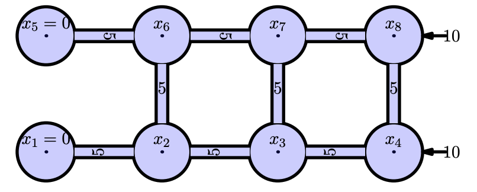
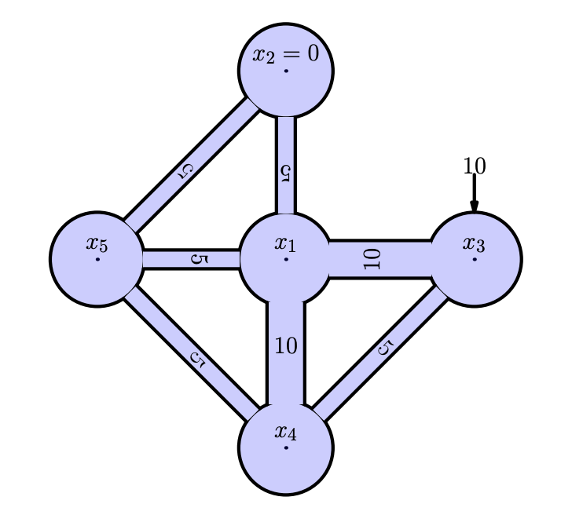

<!-- include the hint.js -->
<script src="../../hints.js"></script>

## Exercise 1
<span class="question">
a. The following code reaches the same result as the answer on 2.4.6. Explain briefly how this code works.

```{R}
M=matrix(0,nrow=3,ncol=3)
# bring flux between 1 and 2 in matrix
M[1,1] = M[1,1]-7
M[1,2] = M[1,2]+7
M[2,2] = M[2,2]-7
M[2,1] = M[2,1]+7
# bring flux between 1 and 3 in matrix
M[1,1] = M[1,1]-5
M[1,3] = M[1,3]+5
M[3,3] = M[3,3]-5
M[3,1] = M[3,1]+5
# bring flux between 2 and 3 in matrix
M[2,2] = M[2,2]-8
M[2,3] = M[2,3]+8
M[3,3] = M[3,3]-8
M[3,2] = M[3,2]+8
# bring in the boundary condition
M[1,]  = 0
M[1,1] = 1
# right hand side
b = c(2,-1,-2)
print(solve(M,b))
```
</span>

<span class="answer">
The code chunk solves the system by adding the fluxes one after the other instead of implementing the matrix by hand.
</span>

<span class="question">
b. The following code is a more elegant way of constructing the matrix in the previous exercise. Give proper names to the vectors *f, t* and *a* and explain what happens.

```{R}
M = matrix(0,nrow=3,ncol=3)
# the following gives an elegant programming solution
f = c(1,2,3)
t = c(2,3,1)
a = c(7,8,5)
for(i in 1:length(f)){
  M[f[i],f[i]] = M[f[i],f[i]] - a[i]
  M[f[i],t[i]] = M[f[i],t[i]] + a[i]
  M[t[i],t[i]] = M[t[i],t[i]] - a[i]
  M[t[i],f[i]] = M[t[i],f[i]] + a[i]
}
```
</span>

<span class="answer">
</span>

<div class="question">
c. Solve the following system:</br>
{width=40%}
</div>

<span class="question">
d. Solve the following system: </br>
{width=40%}
</span>

## Exercise 2

<span class="question">
a. Check for the speed of conversion for the central and forward scheme by creating a graph that displays `dx` on the x-axis and the error on the y-axis (average of the absolute differences)
</span>

<span class="answer">
```{R error_calculation}
f = function(dx=(pi/2)){
  
  # scheme C = central
  # scheme F = forward
  
  #### setting up initial parameters
  dx    = dx
  left  = 0
  right = 2*pi
  xcoor = seq(left,right, by=dx) # builds a list of all coordinates
  N     = length(xcoor)
  s     = sin(xcoor)
  c     = cos(xcoor)
  
  ##### CENTRAL SCHEME WITH FORWARD AND BACKWARD VALUES ON THE OUTER NODES
  
  M     = matrix(0,nrow=length(xcoor),ncol=length(xcoor)) # an empty matrix for the differencing scheme
  
  # populating vector and matrix
  for(j in 2:(length(xcoor)-1))
  {
    M[j,j+1] = 1/(2*dx)
    M[j,j-1] = -1/(2*dx)
  }
  M[1,1  ] = -1/dx
  M[1,2  ] = 1/dx
  M[N,N  ] = 1/dx
  M[N,N-1] = -1/dx
  
  # solve matrix equation
  V_c = M %*% s
  
  ##### FORWARD SCHEME WITH BACKWARD RIGHT NODE
  
  M     = matrix(0,nrow=length(xcoor),ncol=length(xcoor)) # an empty matrix for the differencing scheme
  
  # populating vector and matrix
  for(j in 1:(length(xcoor)-1))
  {
    M[j,j]   = -1/dx
    M[j,j+1] = 1/dx
  }
  M[N,N  ] = 1/dx
  M[N,N-1] = -1/dx
  
  # solve matrix equation
  V_f = M %*% s
  
  ## error C
  error_c    = mean(abs(V_c - c))
  
  ## error F
  error_f    = mean(abs(V_f - c))
  
  return(list(error_c,error_f))
}
x = seq(0.1,pi/2,by=0.1)
error_list = data.frame("C" = rep(0,length=length(x)), "F" = rep(0,length=length(x)))
for(i in 1:length(x)){
  error = f(x[i])
  error_list[i,] = error
}

plot(x, error_list$F, type="l", col="grey",ylim=c(0,0.5))
lines(x, error_list$C, type="l", col="darkblue")
legend("topleft", c("Central", "Forward"), col = c("darkblue","grey"), lty = c(1,1), pch = c(-1,-1))
```
</span>

<span class="comment">
This is not really a pretty graph but it should be clear that the central scheme converges faster right?
</span>

## Exercise 3
<span class="question">
a. Solve the following equation with a Dirichlet boundary on both sides using matrix algebra:

$$0 = -u \frac{s(x+\Delta x) - s(x - \Delta x)}{2\Delta x} + D\frac{s(x + \Delta x) - 2s(x) + s(x-\Delta x)}{\Delta x^{2}} \tag{4.1}$$

Do this with the following parameters:
```{R}
dx    = 5    # step size
D     = 5    # diffusion coefficient
u     = 5    # advection coefficient
bl    = 0    # left boundary
br    = 1    # right boundary
n     = 5    # amount of nodes
```
</span>

<span class="answer">
```{R}
dx    = 5    # step size
D     = 5    # diffusion coefficient
u     = 5    # advection coefficient
bl    = 0    # left boundary
br    = 1    # right boundary
n     = 5    # amount of nodes

left  = 0    # left coordinate
xcoor = seq(left,dx*(n-1), by=dx)

V     = c()  # build an empty vector for the solutions
M     = matrix(0,nrow=length(xcoor),ncol=length(xcoor)) 

for(j in 2:(length(xcoor)-1))
{
  M[j,j-1] = -u/(2*dx) - D/(dx^2)
  M[j,j  ] = 2*D/(dx^2)
  M[j,j+1] = u/(2*dx) - D/(dx^2)
  V[j]     = 0
}

# Left boundary
M[1,1] = 1
V[1]   = bl

# Right boundary
M[n,n] = 1
V[n]   = br

# Solve the system
s = solve(M,V)

# Plotting
plot(xcoor,s,ylab="state (m)",xlab="x (m) ",type='o',col='blue')
title(main='Advection Diffusion Equation')
grid()

# Calculate and plot the analytical solution
L = dx*(n-1)
xcooranalyt = seq(0,L, by=0.01)
sanalyt = c()
Danalyt = D
uanalyt = u
Peanalyt = uanalyt*L/Danalyt

for(j in 1:(length(xcooranalyt)))
{
  sanalyt[j] = bl+(exp(xcooranalyt[j]*Peanalyt/L)-1.)/(exp(Peanalyt)-1.)*(br-bl)
}

lines(xcooranalyt,sanalyt,col="grey",lwd=2) # analytical solution
legend(10, 0.8, c("numerical", "analytical"), col = c("blue","grey"), lty = c(1,1), pch = c(-1,-1))
```
</span>

## Exercise 4

<span class="question">
a. What would be the mathematical notation of a 0-gradient condition (no flux) by using $s[4]$ and $s[5]$ and what would this look like in matrix notation (starting from the matrix defined for the Dirichlet boundary condition)?
</span>

<span class="answer">
$$
s[5] = s[4]\\
s[5] - s[4] = 0
$$
$$
\begin{bmatrix}
1&.&.&.&.\\
-\frac{u}{2dx} - \frac{D}{dx^2}&\frac{2D}{dx^2}&\frac{u}{2dx} - \frac{D}{dx^2}&.&.\\
.&-\frac{u}{2dx} - \frac{D}{dx^2}&\frac{2D}{dx^2}&\frac{u}{2dx} - \frac{D}{dx^2}&.\\
.&.&-\frac{u}{2dx} - \frac{D}{dx^2}&\frac{2D}{dx^2}&\frac{u}{2dx} - \frac{D}{dx^2}\\
.&.&.&-1&1
\end{bmatrix} * 
\begin{bmatrix}
s[1]\\
s[2]\\
s[3]\\
s[4]\\
s[5]\\
\end{bmatrix} = 
\begin{bmatrix}
b_l\\
V_2\\
V_3\\
V_4\\
b_r = 0\\
\end{bmatrix}
$$
</span>

<span class="question">
b. Implement this matrix equation in the last chunk of section 5.2. 
</span>

<span class="answer">
```{R}
dx    = 0.1    # step size
D     = 5    # diffusion coefficient
u     = 5    # advectio coefficient
bl    = 0    # left boundary
br    = 0.4    # right boundary

left  = 0    # left coordinate
right = 50
xcoor = seq(left,right, by=dx)
N     = length(xcoor)

v     = c()  # build an empty vector for the derivatives
M     = matrix(0,nrow=length(xcoor),ncol=length(xcoor)) 

for(j in 2:(length(xcoor)-1))
{
  M[j,j-1] = -u/(2*dx) - D/(dx^2)
  M[j,j  ] = 2*D/(dx^2)
  M[j,j+1] = u/(2*dx) - D/(dx^2)
  v[j]     = 0
}

# Left boundary
M[1,1] = 1
v[1]   = bl

# Right boundary

M[N,N]   = 1
M[N,N-1] = -1
v[N]     = br

# Solve the system
s = solve(M,v)

# Plotting
plot(xcoor,s,ylab="state (m)",xlab="x (m) ",type='o',col='blue')
title(main='Advection Diffusion Equation, Neumann boundary')
grid()
```
</span>


