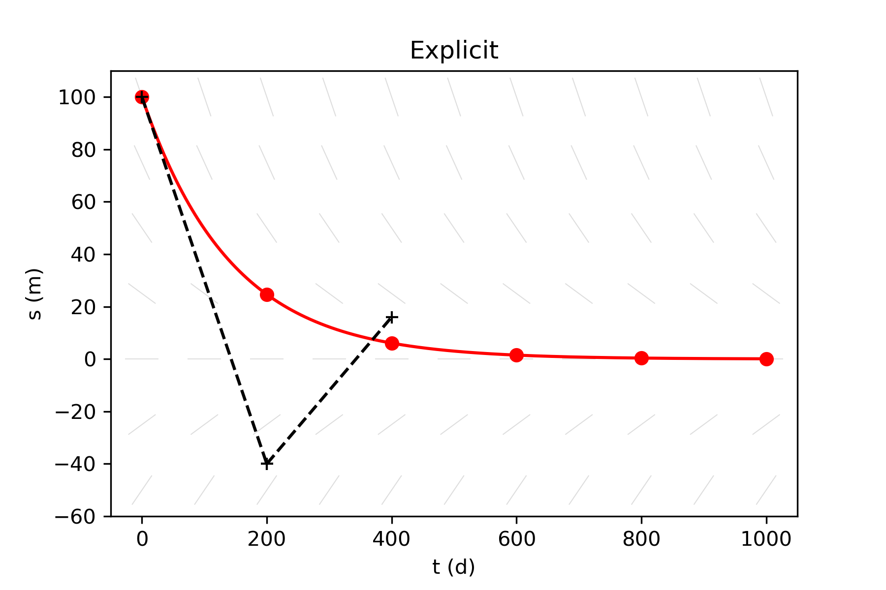
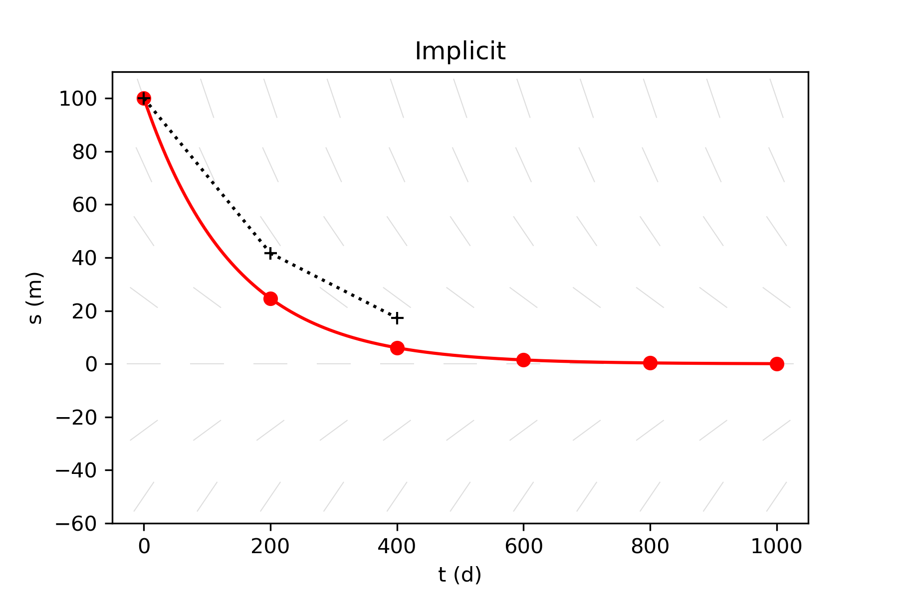
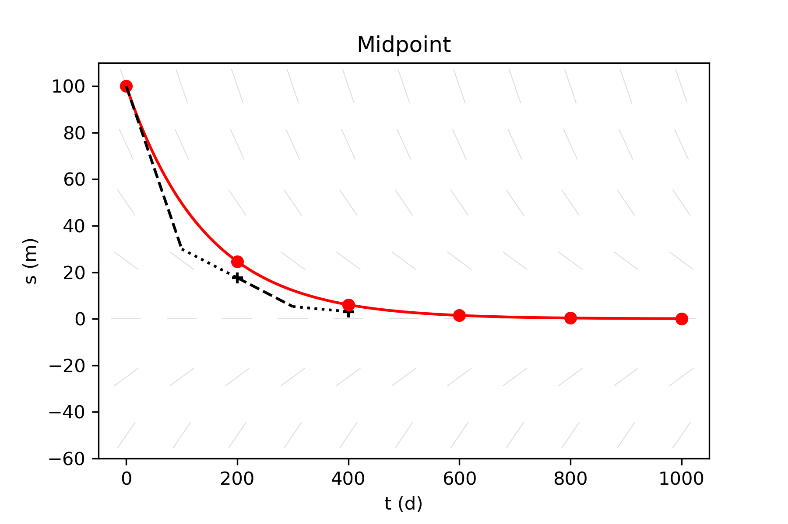
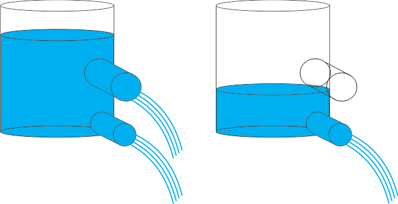

<!-- include the hint.js -->
<script src="../../hints.js"></script>

# Learning goals
* Understand the use of Taylor series.
* Understand the mathematics of Taylor series.
* Be able to calculate Taylor series for arbitrary functions.
* Derive approximations for first derivatives from Taylor series.
* Integrate ordinary differential equations (ODEs) in time using explicit methods.
* Integrate ordinary differential equations (ODEs) in time using implicit methods.
* Integrate ordinary differential equations (ODEs) in time using midpoint methods.
* Appreciate the concepts of numerical convergence, oscillation, and stability.

# Introduction
In this tutorial, you will analyse and develop models of ordinary differential equations (ODEs) that only depend on time. You will test the influence of parameter values and numerical schemes on the behavior of the solutions for simple 1D models, such as the emptying reservoir model (leaving out the spatial dimensions). Then you will learn how to use Taylor series to develop such models using different techniques. You will also use Taylor series to estimate the errors of numerical models in order to judge their quality.

# 1. Simple models in time
The first model that you will study, is that of an emptying bucket (see Figure). This is a very illustrative example, because this model has an analytical solution against which the outcome of the numerical models, that you will implement, can be compared, besides that it's intuitively understandable.

 

*Sketch of the emptying bucket*

This system can be represented by the following ODE:
$$ \dfrac{ds(t)}{dt} = -c_0 s(t) \tag{1}$$
This equation shows that change in the state variable $s$, in this case the water level, is proportional to the water level itself, multiplied with a positive constant $c_0$ that is a lumped variable that represents the outlet properties (area and friction coefficient) and the conversion factor from volume to height changes. For now, it is important to know that the larger $c$, the easier water can flow out of the reservoir. Later in this tutorial, you will derive this model from first principles taking into account all relevant parameters, but first you will learn about its basic properties, and the discretization of the equation.

The mathematical definition of a **time derivative of** the function $s(t)$ is as follows

$$\dfrac{ds(t)}{dt} = \lim_{\Delta t\to\ 0}\frac{s(t+\Delta t)-s(t)}{\Delta t} \tag{2}$$
which teaches us that we can approximate the gradient of a function by taking the difference between two adjacent values and dividing it by the step size. If we take a step size that approximates zero, the derivative is exact. In this case, $\Delta t$ is an **infinitesimal difference**.

For most practical applications, it is impossible to take an infinitesimal step size if we want to approximate the derivative. Instead, we mostly use a finite step size such that the approximation is equal to:

$$ \dfrac{ds(t)}{dt} \approx \frac{s(t+\Delta t)-s(t)}{\Delta t} \tag{3}$$
Note that this solution is no longer exact. The difference between $t$ and $t + \Delta t$ is a **finite difference** and has an associated approximation error (we will come back to this later). Generally, we can state that the larger the step size, the larger the error.

With equation 3, we can build models in which we can approximate the value of the state $s$ at a future time step $t + \Delta t$.

<span class="question">
1.1 Combine equations 1 and 3 to find an equation that can give you the value of $s$ at the next time step ($s(t+\Delta t)$)
</span>

<span class="answer">
$$ s(t+\Delta t) = s(t) - \Delta t\,c_0\,s(t) \tag{4}$$
$$ s(t+\Delta t) = s(t)(1-c_0 \Delta t) \tag{5}$$
</span>

<span class="question">
1.2 In order to refresh your mathematics, calculate the analytical solution to equation 1, so we can use it later to validate your models against. Use the following initial condition $s(t = 0) = s_{0}$
</span>

<span class = "answer">
$$
\begin{align}\tag{6}
ds &= -c_0 s \ dt\\
\dfrac{1}{-c_0 s} ds &= dt\\
\int \dfrac{1}{-c_0 s} ds &= \int dt\\
\dfrac{1}{-c_0} \int \dfrac{1}{s} ds &= \int dt\\
\dfrac{\ln(s)}{-c_0} &= t + C\\
\ln(s) &= -c_0 t - c_0 C\\
s &= \mathrm{e}^{-c_0 C}\mathrm{e}^{-c_0 t}\\
s &= s_{0}\mathrm{e}^{-c_0 t}
\end{align}
$$
</span>

<span class="question">
1.3 Implement the formula derived in question 1.1 in the following script to set up a numerical model for the emptying reservoir.
</span>

<span class="student_answer">
```{r chunk1_question, eval=FALSE}
sys.fun = function(state)
{
    newstate = ...
    return(newstate)
}
```
</span>

<span class="answer">
```{r chunk1_answer}
sys.fun = function(state)
{
    newstate = state*(1-c0*dt)
    return(newstate)
}
```
</span>

<span class="question">
1.4 Run the following chunk to perform the actual simulation and visualize it.
```{r chunk3}
# Initial parameter values
begin.time = 0     # usually this variable is set to 0
end.time   = 50    # end time of the simulation (50)
dt         = 0.1   # delta t; time discretisation (0.1)
init.state = 3     # state of the system at the beginning of the simulation (3)
c0         = 0.25  # decay constant (0.25)

# Simulation initialisation
time = begin.time
result.state = c(init.state)
result.time = c(time)
current.state = init.state

# Simulation
while(time < end.time)
{
    current.state = sys.fun(current.state)
    result.state = c(result.state,current.state)
    time = time + dt
    result.time = c(result.time,time)
}

# Plotting
plot(result.time, result.state,type='o', xlab="time", ylab="state")
title(main='Emptying reservoir')
grid()
```
</span>

<span class="question">
1.5 Vary the `dt` parameter between 0.001 and 25. Are there any numerical problems arising beyond a certain value for `dt`? What are the problems when choosing a value for `dt` close to or on the high/low end of this range? Can you interpret your results in terms of convergence, oscillations, and stability?

Reminder of definitions:
<ul>
<li>**convergence** is the property of a solution that each time the time step (or spatial grid spacing) is reduced, the error reduces as well and a fixed value is approached. 
<li>**oscillations** are fluctuations around the true solution that do not grow in time.
<li>**stability** is a property that tells you something about the growth of errors over time. A stable solution have errors that do not grow in time, whereas an unstable solution has an error that grows (often exponentially) in time.
</ul>
</span>

<span class="answer">
For small values of `dt` run-time will be significantly higher and can become impractically slow (although the result is very accurate). High values for `dt`; first you will notice that already in the first step the state of the reservoir will be lower than 0, which is physically incorrect. Secondly, when choosing a `dt` that is even higher, the numerical approximation does not converge, oscillates and can even go to positive/negative infinity.
</span>

<span class="question">
1.6 Reset `dt` to 0.1 and vary `c0` between 0.25 and 25. Describe for `c0` 0.25, 5, 10, 15, 20, 25 whether the simulation is physically correct, converging (approximation and exact solution advance to the same, or at least roughly the same, solution) and stable, and explain why, with the help of the equation that calculates the next state. 

$c_0$ | physically correct | convergent | stability | explanation 
---------| ------------------ | ---------- | --------- | ----------- 
0.25     | | | |  
5        | | | | 
10       | | | |  
15       | | | |  
20       | | | |  
25       | | | |  
</span>

<span class="answer">

$c_0$ | physically correct | convergent | stability | explanation 
---------| ------------------ | ---------- | --------- | ----------- 
0.25 | correct | converging | stable |  
5 | correct |  converging | stable | 
10 | correct |  converging | stable |  
15 | incorrect |  converging | stable | solution becomes negative because `c0*dt` goes under 1 
20 | incorrect | not converging | (un)stable | solution does not go to zero as it should be continues jumping between -3 and 3
25 | incorrect | not converging | unstable | solution goes to infinity 

</span>

You will now compare the results against the exact analytical solution that you derived. If you are in for a **challenging exercise** open Excercise 1 of `Finite_differences_1_extended.Rmd` where you will add the analytical solution yourself, otherwise do the exercise below.

<span class="question">
1.7 Unfold `chunk4` and run the code in order to study the quality of the approximation in comparison with the exact solution.
</span>

<button type="button" onclick="toggle('Q1')">Show chunk</button>
<div id="Q1" style="display: none">
```{r chunk4}
# Initial parameter values
begin.time = 0     # usually this variable is set to 0
end.time   = 50    # end time of the simulation (50)
dt         = 5     # delta t; time discretisation (0.25)
init.state = 3     # state of the system at the beginning of the simulation (3)
c_0        = 0.25  # decay constant (0.25)

# Simulation initialisation
time = begin.time
result.state = c(init.state)
result.time = c(time)
current.state = init.state

# Simulation
while(time < end.time)
{
    current.state = sys.fun(current.state)
    result.state = c(result.state,current.state)
    time = time + dt
    result.time = c(result.time,time)
}

# Plotting
plot(result.time, result.state, type='o', col="blue", xlab="time", ylab="state")
time.sequence = seq(begin.time,end.time, by=0.1)
analyt.state=init.state * exp(-time.sequence*c0)
lines(time.sequence, analyt.state, col='grey', lwd=2)
title(main='Numerical and analytical solution compared')
grid()
```
</div>

<br/>

<span class="question">
1.8 At which `dt` do the numerical approximation and analytical solution start to agree fairly reasonably?
</span>

<span class="answer">
Around `dt = 1` the analytical solution and the numerical approximation come quite close to each other.
</span>

# 2. Taylor series

The previous exercise can also be done in a more formal way, such that the error of the numerical approximation can be calculated. For that you will make use of **Taylor series**. Taylor series (https://en.wikipedia.org/wiki/Taylor_series) can be used to make approximations of complex mathematical functions using expansion. 

If you use an infinite series, the approximation is exact. The finite difference approximation that you have derived earlier, can also be derived using a Taylor series. **TIP**: if you are unfamiliar with this topic or you simply want a refresher, you can watch the following video by *3Blue1Brown*: https://www.youtube.com/watch?v=3d6DsjIBzJ4

The mathematical definition of a Taylor series is as follows:
$$f(x + \Delta x) = \sum_{n=0}^{\infty} f^{n}(x) \dfrac{\Delta x^{n}}{n!} \tag{7}$$

Expansion of this function gives:

$$f(x + \Delta x) = f(x) + f'(x)\frac{\Delta x}{1!} + f''(x)\frac{\left(\Delta x\right)^2}{2!} + f'''(x)\frac{\left(\Delta x\right)^3}{3!} + f''''(x)\frac{\left(\Delta x\right)^4}{4!} + \ ... \tag{8}$$

If we use the definitions and notation of exercise 1, we find:

$$s(t + \Delta t) = s(t) + \Delta t \frac{ds}{dt} \bigg\rvert_{t} + \frac{(\Delta t)^{2}}{2!} \frac{d^{2}s}{dt^{2}} \bigg\rvert_{t} + \frac{(\Delta t)^{3}}{3!} \frac{d^{3}s}{dt^{3}} \bigg\rvert_{t} + \frac{(\Delta t)^{4}}{4!} \frac{d^{4}s}{dt^{4}} \bigg\rvert_{t} + \ ...     \tag{9}$$

In simple words, this formula estimates the exponential decay, starting from a specified time $t$ to a specific time-step into the future $\Delta t$, using only information that is known at $t$. The more terms are taken into account, the more accurate this approximation gets. 

<span class="comment"> **[CvH]** Do we need to include some sort of example here? <br/> **[LM]** the youtube video gives some very cool examples. Will you give some in the lectures? then it might not be needed here.</span>

With the derived expression above, we can also derive a mathematical expression for the error of a numerical approximation for a derivative. We can do this by rearranging equation 8 such that the the left-hand side is equal to the right-hand side of equation 3. 

If you are in for a **challenging exercise** open Excercise 2 of `Finite_differences_1_challenges.Rmd` to manually derive the general mathematical expression for the numerical error. Otherwise, unfold the derivation with the button below.

<button type="button" onclick="toggle('Q2')">Show derivation</button>
<div id="Q2" style="display: none">

Starting from equation 8:
$$s(t + \Delta t) = s(t) + \frac{\Delta t}{1!} \frac{ds}{dt} \bigg\rvert_{t} + \frac{\Delta t^{2}}{2!} \frac{d^{2}s}{dt^{2}} \bigg\rvert_{t} + \frac{\Delta t^{3}}{3!} \frac{d^{3}s}{dt^{3}} \bigg\rvert_{t} + \frac{\Delta t^{4}}{4!} \frac{d^{4}s}{dt^{4}} \bigg\rvert_{t} + \ ...     \tag{10}$$
Rearranging this equation:

$$\frac{s(t + \Delta t) - s(t)}{\Delta t} =  \frac{ds}{dt} \bigg\rvert_{t} + \frac{\Delta t}{2!} \frac{d^{2}s}{dt^{2}} \bigg\rvert_{t} + \frac{\Delta t^{2}}{3!} \frac{d^{3}s}{dt^{3}} \bigg\rvert_{t} + \frac{\Delta t^{3}}{4!} \frac{d^{4}s}{dt^{4}} \bigg\rvert_{t} + \ ... \tag{11}$$
Comparing this with the implementation in exercise 1 leads to the quantification of the error:

$$\frac{s(t + \Delta t) - s(t)}{\Delta t} =  \frac{ds}{dt} \bigg\rvert_{t} + error    \tag{12}$$
$$ error = \frac{\Delta t}{2!} \frac{d^{2}s}{dt^{2}} \bigg\rvert_{t} + \frac{\Delta t^{2}}{3!} \frac{d^{3}s}{dt^{3}} \bigg\rvert_{t} + \frac{\Delta t^{3}}{4!} \frac{d^{4}s}{dt^{4}} \bigg\rvert_{t} + \ ... \tag{13}$$
</div>

If you prefer a **challenging exercise**, you can open Exercise 3 in the `Finite_differences_1_extended.Rmd` file. If not, you can proceed with this exercise.

<span class="question">
2.1. Run the chunk below, which will open a new window. The chunk calculates the state s of the reservoir at $t_0 + \Delta t$ (the first timestep), using a defined number of terms of the Taylor series. It also shows the error at $t_0 + \Delta t$ (compared with the analytical solution). The approximation we used so far (which gives the black line) is based on the first two terms of the Taylor series. Use the arrows to change the number of terms of the Taylor series that are implemented and write down the errors between the Taylor series implementation and the true emptying bucket.

terms | error 
----- | ----- 
1 |  
2 |
3 |
4 | 
5 | 
6 |

```{r chunk5, eval=FALSE, echo=FALSE}
rm(list=ls())
library(shiny)
options(scipen = 999)
error = function(taylor){
  
  # System function
  sys.fun = function(state)
  {
    newstate = state*(1-alpha*dt)
    return(newstate)
  }
  
  # Initial parameter values
  begin.time = 0     # usually this variable is set to 0
  end.time   = 50    # end time of the simulation (50)
  dt         = 5     # delta t; time discretisation (0.25)
  init.state = 3     # state of the system at the beginning of the simulation (3)
  alpha      = 0.25  # decay constant (0.25)
  
  # Simulation initialisation
  time = begin.time
  result.state= c(init.state)
  result.time = c(time)
  current.state = init.state
  
  # Simulation
  while(time < end.time)
  {
    current.state = sys.fun(current.state)
    result.state = c(result.state,current.state)
    time = time + dt
    result.time = c(result.time,time)
  }
  
  # Taylor series approximation
  derivative.list = c(paste(toString(init.state),"*DT^0"))
  f = expression(init.state*exp(-alpha*t))
  t = 0
  if(taylor>1){
    for(i in 1:(taylor-1)){
      f = D(f,'t')
      derivative.list = c(derivative.list,paste(toString(eval(f)),"*DT^",toString(i),"/",toString(factorial(i))))
      #print(f)
    }
  }
  g = parse(text = substitute(expression(f),list(f=paste(derivative.list,collapse = "+"))))
  
  
  DT = seq(begin.time,end.time,by=0.1)
  p  = eval(g)
  
  # Plotting
  plot(result.time,result.state,type='o', xlab="time",ylab="state")
  time.sequence = seq(begin.time,end.time,by=0.1)
  analyt.state=init.state * exp(-time.sequence*alpha)
  lines(time.sequence,analyt.state,col='blue',lwd=2)
  lines(DT,p, lwd=2, col="green")
  
  DT = dt
  correct.state = init.state*exp(-dt*alpha)
  error = format(round(abs(correct.state-eval(g)),6),nsmall=6)
  points(dt, eval(g),col="green", pch=19)
  points(dt, correct.state, pch=19)
  segments(dt,correct.state,dt,eval(g),col="red",lwd=2)
  title(main=paste('Numerical and analytical solution compared. Error: ',error))
  
  grid()
  legend(30,2.5,c("analytical solution","taylor expansion from t=0","error at t=1*dt","Taylor series with 2 terms"), c("blue","green","red","black")) 
}

#########################################
ui <- fluidPage(
  
  # App title ----
  titlePanel("Calculate the error"),
  
  # Sidebar layout with input and output definitions ----
  sidebarLayout(
    
    # Sidebar panel for inputs ----
    sidebarPanel(
      
      numericInput("taylor", label  = "Terms of the taylor series:" , value=1, min = 1, max = 40, step = 1)
      
    ),
    
    # Main panel for displaying outputs ----
    mainPanel(
      
      # Output: Plot of the requested variable against mpg ----
      plotOutput("p")
      
    )
  )
)

server <- function(input, output) {
  output$p = renderPlot({error(input$taylor)})
}

shinyApp(ui, server)
options(scipen = 0)
```

</span>

<span class="answer">

terms | error 
----- | ----- 
1 | 2.140
2 | 1.609 
3 | 0.242 
4 | 0.063 
5 | 0.013 
6 | 0.002 

</span>

# 3. An emptying reservoir with input.
In this exercise, the emptying bucket model will be adapted to make it more realistic, by adding an input source that depends on time. This introduces an extra source of fluctuation and makes the output graph more complex. Therefore, it is an excellent model to investigate the accuracy of different type of integration methods. We introduce a simple input function that could, for instance, be described as time-varying precipitation $\sin(time)+1$:

```{R chunk6}
time = seq(0, 50, by=0.5)
plot(time, sin(time)+1, type='o', xlab="time", ylab="state")
```

This time, you will derive the emptying reservoir model a bit more rigorously. The amount water stored in the reservoir is the volume $V$. The change in volume over time is equal to the influx $Q_{in}$ minus the outflux $Q_{out}$:

$$\frac{dV}{dt} = Q_{in} - Q_{out} \tag{14}$$
The volume of the bucket, $V$, can be replaced by the area times the height: $A\ s(t)$. The outflux is calculated as the reservoir constant $\alpha$ multiplied with the (current) water level $s(t)$. Reservoir constant $\alpha$ is proportional to the area of the outlet and inversely proportional to the friction.
The earlier model that you used in Part 1 and 2 was a simplification of this model, with $Q_{in}$ equals 0 and A equals unity.

<span class="question">
3.1 What are the units of $V$, $Q_{in}$, $A$ and $\alpha$? Do the units of the equation match?
</span>

<span class="answer">
$$
\begin{align}
V &=& [m^3] &&=&& [L^3]\\
Q_{in} &=& [m^3s^{-1}] &&=&& [L^3T^{-1}]\\
A &=& [m^2] &&=&& [L^2]\\
\alpha &=& [m^2 s^{-1}] &&=&& [L^2 T^{-1}]
\end{align}
$$
which is consistent with both the numerical approximation and the analytical solution.
</span>

<span class="question">
3.2 Replace $Q_{in}$ and $Q_{out}$ with their formulas and derive the finite differences approximation for $s(t+\Delta t)$ starting from equation 14.
</span>

<span class="answer">
$$
\begin{matrix}
\dfrac {dV}{dt} &=& Q_{in} - Q_{out}\\
Q_{in} &=& \sin(t) + 1 \\
Q_{out} &=& \alpha \ s(t) \\
V &=& A\,s(t) \\
A\dfrac{ds}{dt} &=& {(\sin(t)+1)} - \alpha\ s(t) \\
\dfrac {s(t+\Delta t)-s(t)} {\Delta t} &=& \dfrac{1}{A}((\sin(t)+1) - \alpha\,s(t)) \\
s(t+\Delta t) &=& s(t) + \dfrac{\Delta t}{A} ((\sin(t)+1) - \alpha\ s(t))
\end{matrix}
$$
</span>

<span class="question"> 
3.3 Copy `chunk3` here and add a new, updated `sys.fun` that represents the equation derived in question 3.1 Replace the parameter section with the following:

```{}
rm(list=ls())
# Initial parameter values
begin.time = 0     # usually this variable is set to 0
end.time   = 50    # end time of the simulation
dt         = 0.1   # delta t; time discretisation
init.state = 3     # state of the system at the beginning of the simulation
alpha      = 1     # decay constant
A          = 4     # surface of the bucket
```
</span>

<span class="answer">
```{r chunk8}
rm(list=ls())
# Initial parameter values
begin.time = 0     # usually this variable is set to 0
end.time   = 50    # end time of the simulation
dt         = 0.1   # delta t; time discretisation
init.state = 3     # state of the system at the beginning of the simulation
alpha      = 1     # decay constant
A          = 4     # surface of the bucket

# Simulation initialisation
time             = begin.time
result.state     = c(init.state)
result.time      = c(time)
current.state    = init.state

# System function
sys.fun = function(state)
{
  newstate = state + dt/A*((sin(time)+1)-alpha*state)
  return(newstate)
}

# Simulation
while(time < end.time)
{
  current.state = sys.fun(current.state)
  result.state = c(result.state,current.state)
  time = time + dt
  result.time = c(result.time,time)
}

# Plotting
plot(result.time,result.state,type='o',xlab="time",ylab="state")
title(main='Emptying reservoir with input')
grid()
```
</span>

In order to assess the quality of the approximation we need a reference. In the previous exercise we added the analytical solution to the chunk as the reference. However, for this equation the solution of the differential is not so trivial to obtain, even though the equation doesn't seem to be too complex (https://www.wolframalpha.com/input/?i=ds%2Fdt+%3D++((sin(t)%2B1)+-+a*s(t))%2FA). In many real world scenarios an analytical solution is impossible to be derived. Therefore, we run the model twice. One with a very small time step to represent the exact solution, and one with a larger time step `dt` chosen by you to asses the quality of the approximation.

<span class="question">
3.4 Copy the last chunk here. Then copy the following lines of code into the end of the chunk.

```{}
dt = 2.0 # a new dt value to evaluate current scheme
time = begin.time
result.state = c(init.state)
result.time = c(time)
current.state = init.state
while(time < end.time)
{
  current.state = sys.fun(current.state)
  result.state = c(result.state,current.state)
  time = time + dt
  result.time = c(result.time,time)
}
lines(result.time, result.state, type='o',col='blue')
```

Replace the already existing plot command with the lines:
```{}
plot(result.time, result.state, type='l', col="grey", lwd=2, xlab="time", ylab="state")
```
</span>

<span class="answer">
```{r Explicit}
rm(list=ls())
# Initial parameter values
begin.time = 0     # usually this variable is set to 0
end.time   = 50    # end time of the simulation
dt         = 0.1   # delta t; time discretisation
init.state = 3     # state of the system at the beginning of the simulation
alpha      = 1     # decay constant
A          = 4     # surface of the bucket

# Simulation initialisation
time             = begin.time
result.state     = c(init.state)
result.time      = c(time)
current.state    = init.state

# System function
sys.fun = function(state)
{
  newstate = state + dt/A*((sin(time)+1)-alpha*state)
  return(newstate)
}

# Simulation
while(time < end.time)
{
  current.state = sys.fun(current.state)
  result.state = c(result.state,current.state)
  time = time + dt
  result.time = c(result.time,time)
}

# Plotting
plot(result.time,result.state,type='l', col="grey",lwd=2,xlab="time",ylab="state")
title(main='Emptying reservoir with input, Explicit')
grid()

dt = 2.0 # a new dt value to evaluate current scheme
time = begin.time
result.state= c(init.state)
result.time =c(time)
current.state = init.state
while(time < end.time)
{
  current.state = sys.fun(current.state)
  result.state = c(result.state,current.state)
  time = time + dt
  result.time = c(result.time,time)
}
lines(result.time,result.state,type='o',col='blue')
```
</span>

If everything went well, there are two lines in the graph. The grey line is the 'true' solution and the blue line is the approximation. The 'true' solution here is the same finite differences approximation, but with such a small `dt`, for which we assume that it approximates the analytical solution very well. 

<span class="question">
3.5 Play a bit around with the second `dt` variable to see how well the approximation is doing for a slightly more complex system. Does your answer to question 1.5 still hold here?
</span>

# 4. Different integration methods
So far, you have used the *explicit* integration scheme. This means that information of the current time step is used to calculate the future. In mathematical notation, this sentence can be formulated in a generic way as:

$$\dfrac{ds}{dt} = f(t, s(t)) \tag{15}$$
However, other methods do exist. In the following sections, you will encounter the implicit, midpoint, and Runge-Kutta time-integration methods that each have their own specific properties.

## 4.1. Implicit method
The implicit integration scheme is based on taking the derivative not with the current information, but with the information from the next time-step. In its generic form, it is:

$$\dfrac{ds}{dt} = f(t+\Delta t, s(t + \Delta t)) \tag{16}$$
The difference between explicit and implicit is explained best with a couple of graphs. The first graph shows the explicit method. The grey lines show the derivative field, the rate of change. In the explicit solution you following the line found at the current point for one time-step. This will overshoot the answer in this case but with the second time-step the approximation comes close to the real solution given in red.


The implicit method works differently. It evaluates the gradient found at the next time-step and works back to the current point. 


The methods behave very differently. The explicit scheme has oscillatory behaviour and has outliers far from the correct solution. The implicit method is a bit more conservative. It is more stable and is more likely to keep within physical limitations. However, it is computationally more expensive to run and is generally harder to implement, especially for non-linear functions, as you will see in the next exercises.

<span class="question">
4.1. Derive a new equation for $s(t+\Delta t)$ for the emptying reservoir with variable input of Part 3 using the implicit time-integration method.
</span>

<span class="answer">
$$\begin{matrix}
\dfrac{dV(t)}{dt} &=& f(t+\Delta t,s(t+\Delta t))\\
f(t,s(t)) &=& (sin(t)+1) - \alpha s(t)\\
\dfrac{ds(t)}{dt} &=& \dfrac{1}{A}((sin(t+\Delta t)+1) - \alpha s(t + \Delta t))\\
\dfrac{ds(t)}{dt} &=& \dfrac {s(t+\Delta t)-s(t)} {\Delta t}\\
s(t+\Delta t) &=& s(t) + \dfrac{\Delta t}{A}(sin(t+\Delta t)+1) - \dfrac{\Delta t}{A}\alpha s(t + \Delta t))\\
s(t+\Delta t) + \dfrac{\Delta t}{A}\alpha s(t + \Delta t)) &=& s(t) + \dfrac{\Delta t}{A}(sin(t+\Delta t)+1)\\
s(t+\Delta t)(1 + \alpha\dfrac{\Delta t}{A}) &=& s(t) + \dfrac{\Delta t}{A}(sin(t+\Delta t)+1)\\
s(t+\Delta t) &=& \dfrac{1}{1 + \alpha\frac{\Delta t}{A}}(s(t) + \dfrac{\Delta t}{A}(sin(t+\Delta t)+1))\\
\end{matrix}$$
</span>

<span class="question"> 
4.2 Copy the previous chunk with the explicit scheme here and replace the `sys.fun` with the implicit version.
</span>

<span class="answer">
```{r Implicit}
rm(list=ls())
#Initial parameter values
begin.time = 0     # usually this variable is set to 0
end.time   = 50    # end time of the simulation
dt         = 0.1   # delta t; time discretisation
init.state = 3     # state of the system at the beginning of the simulation
alpha      = 1     # decay constant
A          = 4     # surface of the bucket

# Simulation initialisation
time             = begin.time
result.state     = c(init.state)
result.time      = c(time)
current.state    = init.state

# System function
sys.fun = function(state)
{
  newstate = 1/(1+alpha*dt/A)*(state + dt/A*(sin(time+dt)+1))
  return(newstate)
}

# Simulation
while(time < end.time)
{
  current.state = sys.fun(current.state)
  result.state = c(result.state,current.state)
  time = time + dt
  result.time = c(result.time,time)
}

# Plotting
plot(result.time,result.state,type='l', col="grey",lwd=2,xlab="time",ylab="state")
title(main='Emptying reservoir with input, Implicit')
grid()

dt = 2.0 # a new dt value to evaluate current scheme
time = begin.time
result.state= c(init.state)
result.time =c(time)
current.state = init.state
while(time < end.time)
{
  current.state = sys.fun(current.state)
  result.state = c(result.state,current.state)
  time = time + dt
  result.time = c(result.time,time)
}
lines(result.time,result.state,type='o',col='blue')
```
</span>

## 4.2. Midpoint method
As you can see in the implementation of the both the explicit and the implicit integration scheme, the results look quite good with a low `dt` but for a larger time-step the results worsen. By closely examining the differences in the the implementation of the explicit and the implicit scheme you can see a phase-shift. 

<span class="question">
4.3 The implicit scheme has a tendency to lie slightly above/right of the true solution, while the explicit scheme lies slightly under/to the left. Explain why this is the case.
</span>

<span class="answer">
The system that we are studying is represented by an exponential function with a negative exponenent. Therefore, its gradient decreases over time until it approaches zero. The explicit scheme evaluates the gradient at the beginning of a time step (thus at $t$), whereas the implicit method evaluates the gradient at the end of the time step $t + \Delta t$. The true value of the slope is in between the explicit and implicit evaluation of the gradient. Therefore the former is always below the true solution, whereas the latter is below.
</span>

Midpoint methods calculate the solution in two steps and exist in many variants. The midpoint method that you will use, tries to combine the explicit and implicit methods and aims to keep the good properties of both. First, the method takes half a time-step using the explicit method, and subsequently the implicit method will be used for the second half step. In its generic mathematical formulation it works as follows:

$$\widetilde{s} = s(t) + \frac{\Delta t}{2} \ f(t,s(t)) \tag{17}$$
$\tilde{s}$ is the midpoint. Then we calculate s at $t+\Delta t$:

$$s(t+\Delta t) = \widetilde{s} + \frac{\Delta t}{2} \ f(t+\Delta t,s(t+\Delta t)) \tag{18}$$



In comparison with the implicit and explicit schemes, the midpoint method converges faster. It is also twice as expensive to run since it creates a temporary midpoint for calculation. It is, however, often worth the investment in time and effort.

<span class="question">
4.4 Update the `sys.fun` function to implement the midpoint method. You can choose yourself whether you want to do it in two steps, or to do a direct calculation.
</span>

<span class="answer">

```{r Midpoint}
rm(list=ls())
#Initial parameter values
begin.time = 0     # usually this variable is set to 0
end.time   = 50    # end time of the simulation
dt         = 0.1   # delta t; time discretisation
init.state = 3     # state of the system at the beginning of the simulation
alpha      = 1     # decay constant
A          = 4     # surface of the bucket

# Simulation initialisation
time             = begin.time
result.state     = c(init.state)
result.time      = c(time)
current.state    = init.state

# System functions
g_explicit = function(time, state)
{
  return(state + dt/(2*A)*((sin(time)+1)-alpha*state))
}

g_implicit = function(time, state)
{
  return(1/(1+(dt*alpha)/(2*A))*(state + dt/(2*A)*(sin(time+dt/2)+1)))
}

sys.fun = function(state)
{
  s.aux    = g_explicit(time     , state)
  newstate = g_implicit(time+dt/2, s.aux)
  return(newstate)
}

# Simulation
while(time < end.time)
{
  current.state = sys.fun(current.state)
  result.state = c(result.state,current.state)
  time = time + dt
  result.time = c(result.time,time)
}

# Plotting
plot(result.time,result.state,type='l', col="grey",lwd=2,xlab="time",ylab="state")
title(main='Emptying reservoir with input, Midpoint')
grid()

dt = 2 # a new dt value to evaluate current scheme
time = begin.time
result.state= c(init.state)
result.time =c(time)
current.state = init.state
while(time < end.time)
{
  current.state = sys.fun(current.state)
  result.state = c(result.state,current.state)
  time = time + dt
  result.time = c(result.time,time)
}
lines(result.time,result.state,type='o',col='blue')
```
</span>

<span class="question">
4.5 Does this midpoint method converge faster or slower than the previous explicit and implicit method?
</span>

<span class="answer">
faster
</span>

## 4.3. Runge-Kutta method
For many applications, the best compromise between calculation time and numerical accuracy is the Runge-Kutta 4 (RK4) numerical approximation. RK4 is an explicit method. As seen before explicit methods are much easier to define because the formula(s) don't need reworking before implementation. RK4 uses four intermediate function evaluations, compared to the two evaluations that we used in the midpoint method.

$$
\begin{matrix}\tag{20}
\kappa_1 &=& \Delta t\:f(t,s(t))\\
\kappa_2 &=& \Delta t\:f(t + \frac{1}{2} \Delta t,\: s(t) + \frac{1}{2} \kappa_1)\\
\kappa_3 &=& \Delta t\:f(t + \frac{1}{2} \Delta t,\: s(t) + \frac{1}{2} \kappa_2)\\
\kappa_4 &=& \Delta t\:f(t + \Delta t,\:s(t) + \kappa_3)\\
s(t+\Delta t) &=& s(t)+\dfrac{\kappa_1+2\kappa_2+2\kappa_3+\kappa_4}{6}
\end{matrix}
$$
<span class="comment">
**[LM]** maybe an interesting addition, that the error for RK4 is usually estimated with RK5?
</span>

<span class="question">
4.6 Create a new chunk and copy the Midpoint approximation chunk into it.
</span>

<span class="question">
4.7 Rewrite the `sys.fun` with the intermediate values and states shown above.
</span>

<span class="answer">
```{r Runge-Kutta}
rm(list=ls())
#Initial parameter values
begin.time = 0     # usually this variable is set to 0
end.time   = 50    # end time of the simulation
dt         = 0.1   # delta t; time discretisation
init.state = 3     # state of the system at the beginning of the simulation
alpha      = 1     # decay constant
A          = 4     # surface of the bucket

# Simulation initialisation
time             = begin.time
result.state     = c(init.state)
result.time      = c(time)
current.state    = init.state

# System function

f = function(time, state){
  return(((sin(time)+1)-alpha*state)/A)
}

sys.fun = function(state)
{
  k1       = dt*f(time       , state         )
  k2       = dt*f(time+0.5*dt, state + 0.5*k1)
  k3       = dt*f(time+0.5*dt, state + 0.5*k2)
  k4       = dt*f(time+    dt, state +     k3)
  newstate = state + (k1 + 2*k2 + 2*k3 + k4)/6
  return(newstate)
}

# Simulation
while(time < end.time)
{
  current.state = sys.fun(current.state)
  result.state = c(result.state,current.state)
  time = time + dt
  result.time = c(result.time,time)
}

# Plotting
plot(result.time,result.state,type='l', col="grey",lwd=2,xlab="time",ylab="state")
title(main='Emptying reservoir with input, Runge-Kutta')
grid()

dt = 2.0 # a new dt value to evaluate current scheme
time = begin.time
result.state = c(init.state)
result.time = c(time)
current.state = init.state
while(time < end.time)
{
  current.state = sys.fun(current.state)
  result.state = c(result.state,current.state)
  time = time + dt
  result.time = c(result.time,time)
}
lines(result.time,result.state,type='o',col='blue')
```
</span>

# 5. Comparing the different integration schemes

<span class="question">
5.1 Fill out the following table with the following options:
+ good (g)
+ phase shift (ps)
+ wrong amplitude (wa)
+ oscillates (osc)
+ unstable (uns)

This can be done either by running the applet below or by recycling the code of the different integration methods.
</span>

```{r Compare_integration_methods,eval=FALSE, echo=FALSE}
library(shiny)
compare = function(dt,runge_kutta,midpoint,explicit,implicit){
  if(!any(runge_kutta,midpoint,explicit,implicit)){
    plot.new()
    return()
  }
  
  # Other model parameters
  begin.time = 0     # usually this variable is set to 0
  end.time   = 50    # end time of the simulation
  init.state = 3     # state of the system at the beginning of the simulation
  alpha      = 1     # decay constant
  A          = 4     # surface of the bucket
  l          = c()   # empty list for legend entries
  lines_l    = c()   # empty list for legend lines
  
  f = function(time,state){
    return(((sin(time)+1)-alpha*state)/A)
  }
  
  ## Background plot (based on Runge-Kutta)
  
  sys.fun = function(state)
  {
    k1       = dt*f(time       , state         )
    k2       = dt*f(time+0.5*dt, state + 0.5*k1)
    k3       = dt*f(time+0.5*dt, state + 0.5*k2)
    k4       = dt*f(time+    dt, state +     k3)
    newstate = state + (k1 + 2*k2 + 2*k3 + k4)/6
    return(newstate)
  }
  
  time = begin.time
  result.state= c(init.state)
  result.time =c(time)
  current.state = init.state
  dt_temp = dt
  dt = 0.1
  while(time < end.time)
  {
    current.state = sys.fun(current.state)
    result.state = c(result.state,current.state)
    time = time + dt
    result.time = c(result.time,time)
  }
  
  plot(result.time,result.state,type='l',col='darkgrey',lwd=3, xlab="time",ylab="state")
  
  # resetting dt
  dt = dt_temp   
  
  ##########SETTINGS#############
  ########Runge Kutta############
  time = begin.time  
  result.state= c(init.state)  
  result.time =c(time)  
  current.state = init.state  
  while(time < end.time)  
  {  
    current.state = sys.fun(current.state)  
    result.state = c(result.state,current.state)  
    time = time + dt  
    result.time = c(result.time,time)  
  }  
  if(runge_kutta){
    lines(result.time,result.state,type='o',col='black')
    l       = c(l,'Runge Kutta')
    lines_l = c(lines_l,"black")
  }
  
  ###########Midpoint##################
  g_explicit = function(time, state){
    return(state + dt/(2*A)*((sin(time)+1)-alpha*state))
  }

  g_implicit = function(time, state){
    return(1/(1+(dt*alpha)/(2*A))*(state + dt/(2*A)*(sin(time+dt/2)+1)))
  }

  sys.fun = function(state)
  {
    s.aux    = g_explicit(time     , state)
    newstate = g_implicit(time+dt/2, s.aux)
    return(newstate)
  }
  
  time = begin.time
  result.state= c(init.state)
  result.time = c(time)
  current.state = init.state
  while(time < end.time)
  {
    current.state = sys.fun(current.state)
    result.state = c(result.state,current.state)
    time = time + dt
    result.time = c(result.time,time)
  }
  if(midpoint)
  {
    lines(result.time,result.state,type='o',col='red')
    l       = c(l,'Midpoint')
    lines_l = c(lines_l,"red")
  }
  
  ###########Implicit##################
  sys.fun = function(state)
  {
    newstate = 1/(1+alpha*dt/A)*(state + dt/A*(sin(time+dt)+1))
    return(newstate)
  }
  
  time = begin.time
  result.state= c(init.state)
  result.time =c(time)
  current.state = init.state
  while(time < end.time)
  {
    current.state = sys.fun(current.state)
    result.state = c(result.state,current.state)
    time = time + dt
    result.time = c(result.time,time)
  }
  if(implicit){
    lines(result.time,result.state,type='o',col='blue')
    l       = c(l,'Implicit')
    lines_l = c(lines_l,"blue")
  }
  
  ###########Explicit##################
  sys.fun = function(state)
  {
    newstate = state + dt/A*((sin(time)+1)-alpha*state)
    return(newstate)
  }
  
  time = begin.time
  result.state= c(init.state)
  result.time = c(time)
  current.state = init.state
  while(time < end.time)
  {
    current.state = sys.fun(current.state)
    result.state = c(result.state,current.state)
    time = time + dt
    result.time = c(result.time,time)
  }
  if(explicit){
    lines(result.time,result.state,type='o',col='green')
    l       = c(l,'Explicit')
    lines_l = c(lines_l,"green")
  }
  
  lty_l = rep(1  ,length(lines_l))
  lwd_l = rep(2.5,length(lines_l))
  
  legend('topright', l, lty=lty_l, lwd=lwd_l, col=lines_l)
  title(main=paste("Comparing quality integration schemes,",' dt :' ,dt))
  
  grid()
}


#################SHINY###################
ui <- fluidPage(
  
  # App title ----
  titlePanel("Compare integration schemes"),
  
  # Sidebar layout with input and output definitions ----
  sidebarLayout(
    
    # Sidebar panel for inputs ----
    sidebarPanel(
      
      sliderInput("dt", label = "dt:",min = 0.2, max = 20, value = 1, step = 0.2),
      checkboxInput("runge_kutta", "Runge-Kutta", FALSE),
      checkboxInput("midpoint"   , "Midpoint"  , FALSE),
      checkboxInput("explicit"   , "Explicit"   , FALSE),
      checkboxInput("implicit"   , "Implicit"   , FALSE)
      
    ),
    
    # Main panel for displaying outputs ----
    mainPanel(
      
      # Output: Plot of the requested variable against mpg ----
      plotOutput("p")
      
    )
  )
)

server <- function(input, output) {
  output$p = renderPlot({compare(input$dt,input$runge_kutta,input$midpoint,input$explicit,input$implicit)})
}

shinyApp(ui, server)
```

<span class="student_answer">

dt|Explicit|Implicit|Midpoint|Runge-Kutta
---|---|---|---|---|
0.1|-|-|-|-|
1|-|-|-|-|
2.5|-|-|-|-|
5|-|-|-|-|
10|-|-|-|-|
15|-|-|-|-|
20|-|-|-|-|

</span>

# 6. Real world example
The reservoir models up till now considerd one outlet only. This entails a constant and linear relation between volume change and state change (for the linear reservoirs). For some environmental flow problems a reservoir model with a slow and fast acting component would be a more appropriate model.

Its practical use may for example be found in meteorology, where you could have a reservoir containing thermal energy which can be released at different rates. In hydrology, you could have a catchment model that includes both base flow and quick discharge (e.g. due to surface runoff). In the graph below, the principle and workings of such a reservoir model are illustrated:



*Double piped reservoir with both outlets active (left) and with lower outlet active (right).*  

Depending on the state of the reservoir, the discharge out of the upper outlet is active or inactive and depends on the exact height of the upper outlet $\textit{level}_{res,up}$. In simple terms, this means that if the water-level is high enough it can come out at the upper outlet (left image). If the water level is lower than the upper outlet the outlet becomes inactive (right image).

For this situation, we will still use the same equation for the outflows: $Q_{out}=\alpha*H$, where H is the height of water above the outlet. Note that before we used only a lower outlet, located at the bottom of the reservoir, so that $H = s$ and $Q_{out}=\alpha*s$. For the upper outlet, H depends on the height of the outlet pipe. Besides a different height, the two outlets might also have a different $\alpha$.

<span class="question">
6.1 Set up a model including the input flux ($Q_{in}$), volume change over time and the output fluxes (discharges). Next, derive a numerical approximation for the state using the explicit integration scheme</span>  

<button type="button" onclick="toggle('Q3')">Show hint</button>
<div id="Q3" style="display: none">
You will need two functions for $s(t+\Delta t)$: one for the case that the water level is below the upper outlet (only the lower outlet active) and one for the case that the water level is above the upper outlet (both outlets active).
</div>

<span class="answer">
$$
\begin{matrix}
\text{Explicit scheme :}\\
\dfrac{\partial V}{\partial t} &=& Q_{in}-Q_{out}^{upper}-Q_{out}^{lower}\\[10pt]
A\dfrac{s(t + \Delta t)-s(t)}{\Delta t} &=& Q_{in}-Q_{out}^{upper}-Q_{out}^{lower}\\[10pt]
Q_{out}^{upper}&=&\alpha_{res.up}\:(s(t)-level_{res.up})\\[10pt]
Q_{out}^{lower}&=&\alpha_{res.lw}\:s(t)\\[10pt]
\dfrac{s(t + \Delta t) -s(t)}{\Delta t} &=& \dfrac{1}{A}\left( Q_{in}-\alpha_{res.up}(s(t)-level_{res.up})-\alpha_{res.lw}\:s(t)\right)\\[20pt]
s\le level_{res.up}\\
s(t + \Delta t)&=&s(t)+\dfrac{\Delta t}{A} \left(Q_{in}-\alpha_{res.lw}\:s(t) \right)\\
s> level_{res.up}\\
s(t + \Delta t)&=&s(t)+\dfrac{\Delta t}{A} \left(Q_{in}-\alpha_{res.up}(s(t)-level_{res.up})-\alpha_{res.lw}\:s(t) \right)\\
\end{matrix}
$$
</span>

The script below implements this type of double-output reservoir model for a real-world case. The script simulates the discharge of the Hupselse Beek (Gelderland). The input Q_in is based on the recharge in the catchment of the Hupselse Beek. The discharge calculated by the model can be compared to the discharge observed at the weir downstream of the brook. The time series in `hupsel.dat` contains 500 days of recharge and discharge data (daily time steps)
This script creates two different plots containing:
*   the modeled balance
*   the observed and calculated discharge of the brook including a statistic on the performance  

<span class="question">
6.2 Implement the numerical approximation in the `sys.fun` function and run the model.   
</span>

<span class="student_answer">
```{R, eval=FALSE}
##loading input and observed data
hupsel = read.table(file='hupsel.dat')
hupsel.time = hupsel$V1
hupsel.Qin = hupsel$V2
hupsel.Qobs = hupsel$V3
#to make data continuous for al dt
Qin.fun = approxfun(x=hupsel.time,y=hupsel.Qin,rule=2:2) 
Qobs.fun = approxfun(x=hupsel.time,y=hupsel.Qobs,rule = 2:2)

##time aspects
begin.time = 0              #begin time of the simulation
end.time = hupsel.time[length(hupsel.time)] #end time of the simulation
dt = 0.5                    #1.0#.5 #delta t; time discretisation

#reservoir parameters
res.alpha.lw = 0.10543215 
res.alpha.up = 0.75
res.lvl.up= 0.4             #1.7
res.A = 1.45 

init.state = 1.4            #the initial state of the linear reservoir

sys.fun = function(state)
{
  #
}

time          = begin.time
result.state  = c(init.state)
result.time   = c(time)
current.state = init.state
result.Qout1  = c()
result.Qout2  = c()
result.Qin    = c()
while(time < end.time)
{
  current.state = sys.fun(current.state)
  result.state  = c(result.state,current.state)
  time          = time + dt
  result.time   = c(result.time,time)
}

#####Calculation of the Qout fluxes
##first a function (state.above.up) to determine which states are above the upper outlet
state.above.up = function()
{
  state.up = c()
  for (i in 1:length(result.time))
  {
    this.state = result.state[i]
   if(this.state>res.lvl.up)
   {
     state.up=c(state.up,this.state)
   }else{
     state.up=c(state.up,0)
   }
  }
  return(state.up)
}


  state.above =state.above.up()  
  Qout.up = state.above
  IQout = which(state.above>0)
  Qout.up[IQout] = res.alpha.up*(Qout.up[IQout]-res.lvl.up) 
 
  
#   Qout.up = res.alpha.up*(state.above[state.above>0]-res.lvl.up)

Qout.lw = c()
Qout.lw = res.alpha.lw*result.state
# Qout.lw = res.A*res.k.lw*result.state

##balance
##dV/dt = Qin - Qout.lw - Qout.up
##dV/dt = state*res.A/dt
nrsteps = length(result.state)-1
dVdt = diff(result.state)*res.A/dt
Qin = Qin.fun(result.time)
error = Qin[1:nrsteps] - Qout.lw[1:nrsteps] - Qout.up[1:nrsteps] - dVdt
 
plot(result.time,Qin,type = 'l',
     ylim=c(min(Qin,Qout.lw,Qout.up,dVdt),max(Qin,Qout.lw,Qout.up,dVdt)),
     ylab = 'L^3/T',xlab = 'time')
legend('topleft',c('Qin : black',
                 'Qout.lw : blue',
                 'Qout.up : green',
                 'dVdt: red',
                 'error : dashed'))

     
lines(result.time[1:nrsteps],dVdt,col='red')
lines(result.time[1:nrsteps],Qout.lw[1:nrsteps],col='blue')
lines(result.time[1:nrsteps],Qout.up[1:nrsteps],col='green')
lines(result.time[1:nrsteps],error,lty='dashed')

##results observed vs computed
plot(result.time[1:nrsteps],Qobs.fun(result.time[1:nrsteps]),type='l',
     lwd=2,col='grey',ylim=c(min(hupsel.Qobs,Qout.lw,Qout.up),max(hupsel.Qobs,Qout.lw,Qout.up)),
     ylab = 'Qout.obs/Qout.calc',xlab = 'time')
lines(result.time[1:nrsteps],Qout.up[1:nrsteps]+Qout.lw[1:nrsteps],col='blue')

Sumsquares = sum((Qobs.fun(result.time)-(Qout.up+Qout.lw))^2)
title(main=paste('Observed (grey) vs. calculated discharges ','SS = ',Sumsquares))


```
</span>

<span class="answer"> 
code chunk with if construct evaluating if level is above `res.lvl.up`;
```{R}
##loading input and observed data
hupsel = read.table(file='hupsel.dat')
hupsel.time = hupsel$V1
hupsel.Qin = hupsel$V2
hupsel.Qobs = hupsel$V3
#to make data continuous for al dt
Qin.fun =approxfun(x=hupsel.time,y=hupsel.Qin,rule=2:2) 
Qobs.fun = approxfun(x=hupsel.time,y=hupsel.Qobs,rule = 2:2)

##time aspects
begin.time   = 0              #begin time of the simulation
end.time = hupsel.time[length(hupsel.time)] #end time of the simulation
dt           = 0.5            #1.0#.5 #delta t; time discretisation

#reservoir parameters
res.alpha.lw = 0.10543215 
res.alpha.up = 0.75
res.lvl.up   = 0.4            #1.7
res.A        = 1.45 

init.state   = 1.4            #the initial state of the linear reservoir

sys.fun = function(state)
{
  if(state<= res.lvl.up)
  {
    state = state +dt/res.A*(Qin.fun(time)- res.alpha.lw*state)
  }else{
    state = state + dt/res.A*(Qin.fun(time)-res.alpha.up*(state-res.lvl.up)-res.alpha.lw*state)
  }
  return(state)
}

time            = begin.time
result.state    = c(init.state)
result.time     = c(time)
current.state   = init.state
result.Qout1    = c()
result.Qout2    = c()
result.Qin      = c()
while(time < end.time)
{
  current.state = sys.fun(current.state)
  result.state  = c(result.state,current.state)
  time          = time + dt
  result.time   = c(result.time,time)
}

#####Calculation of the Qout fluxes
##first a function (state.above.up) to determine which states are above the upper outlet
state.above.up = function()
{
  state.up = c()
  for (i in 1:length(result.time))
  {
    this.state = result.state[i]
   if(this.state>res.lvl.up)
   {
     state.up=c(state.up,this.state)
   }else{
     state.up=c(state.up,0)
   }
  }
  return(state.up)
}


  state.above =state.above.up()  
  Qout.up = state.above
  IQout = which(state.above>0)
  Qout.up[IQout] = res.alpha.up*(Qout.up[IQout]-res.lvl.up) 
 
  
#   Qout.up = res.alpha.up*(state.above[state.above>0]-res.lvl.up)

Qout.lw = c()
Qout.lw = res.alpha.lw*result.state
# Qout.lw = res.A*res.k.lw*result.state

##balance
##dV/dt = Qin - Qout.lw - Qout.up
##dV/dt = state*res.A/dt
nrsteps = length(result.state)-1
dVdt = diff(result.state)*res.A/dt
Qin = Qin.fun(result.time)
error = Qin[1:nrsteps] - Qout.lw[1:nrsteps] - Qout.up[1:nrsteps] - dVdt
 
plot(result.time,Qin,type = 'l',
     ylim=c(min(Qin,Qout.lw,Qout.up,dVdt),max(Qin,Qout.lw,Qout.up,dVdt)),
     ylab = 'L^3/T',xlab = 'time')
legend('topleft',c('Qin : black',
                 'Qout.lw : blue',
                 'Qout.up : green',
                 'dVdt: red',
                 'error : dashed'))

     
lines(result.time[1:nrsteps],dVdt,col='red')
lines(result.time[1:nrsteps],Qout.lw[1:nrsteps],col='blue')
lines(result.time[1:nrsteps],Qout.up[1:nrsteps],col='green')
lines(result.time[1:nrsteps],error,lty='dashed')

##results observed vs computed
plot(result.time[1:nrsteps],Qobs.fun(result.time[1:nrsteps]),type='l',
     lwd=2,col='grey',ylim=c(min(hupsel.Qobs,Qout.lw,Qout.up),max(hupsel.Qobs,Qout.lw,Qout.up)),
     ylab = 'Qout.obs/Qout.calc',xlab = 'time')
lines(result.time[1:nrsteps],Qout.up[1:nrsteps]+Qout.lw[1:nrsteps],col='blue')

Sumsquares = sum((Qobs.fun(result.time)-(Qout.up+Qout.lw))^2)
title(main=paste('Observed (grey) vs. calculated discharges ','SS = ',Sumsquares))
```
</span>

<span class="question">
6.3  Analyse the effect of the different reservoir parameters (`res.A`, `res.alpha.lw`, `res.alpha.up` and `res.level.up`) on the behavior of the model. Explain your findings.
</span>

<span class="answer">
The four reservoir parameters: 
* `res.A`:  With the area the total volume in the reservoir is controlled. Small A results in less volume of water resulting in a peaky-er discharge.
* `res.alpha.lw`:   the lower outlet of the reservoir regulates the dynamics of the discharge; the larger $\alpha$ the directer the discharge occur. Base flow (the tails after the peaks) is reduced.
* `res.alpha.up/res.lvl.up`:  the activity is regulated with the height of the upper outlet. If the state is below this level, the upper outlet is inactive. If the state is higher than the upper outlet it acts similar as with `res.alpha.lw` 
</span>
