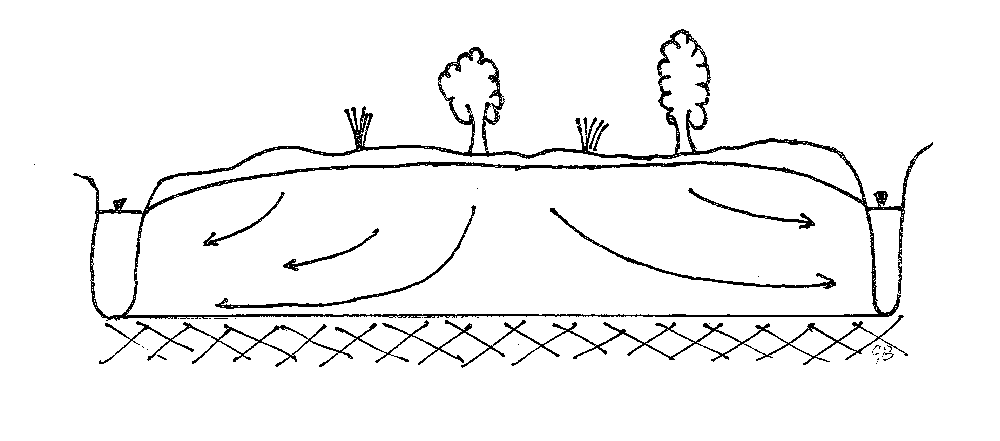
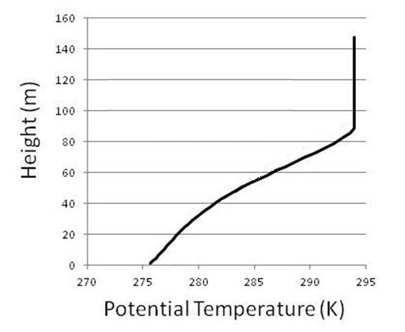

<!-- include the hint.js -->
<script src="hints.js"></script>

## Learning goals
*  Learning the steps to set up a numerical model (stationary, spatial 1D) *(Exercise 1-3,9,10)* 
*	 Understanding the concepts of internal and external fluxes; applying different forms of these fluxes *(Exercise 1,2,8,9,13)*
*  Understanding the difference between linear and nonlinear internal flow functions *(Exercise 8)*
*  Evaluating the model results by checking convergence, analytical solutions and water/heat balances *(Exercise 4-6,11,13,14)*
*  Working with spatially varying parameters *(Exercise 7,9)*
* Test the effect of spatial resolution on model results *(Exercise 11)*
* Applying different kinds of boundary conditions *(Exercise 2,12,14)*

# Part 1: Stationary groundwater flow
First of all, make sure you have the package FVFE1D installed. You can find help pages in de bottom right part of your screen, under Packages -> FVFE1D.

## Introduction 
The first part of this practical will deal with a hydrological problem: saturated groundwater flow. In the second part the same ideas will be applied to a meteorology case.

In this first example a model will be developed to simulate saturated groundwater flow towards two rivers, left and  right, in a one dimensional domain as shown in the graph below. Here the flow is stationary.


Figure 1 : 1D stationary saturated groundwater flow towards two rivers.   
   
***   

The total length of the model is 200 m and both rivers form prescribed head (*Dirichlet*) boundary conditions with a level of 5 m A.M.S.L. (Above Mean Sea Level). The model is discretized with a nodal distance of 10 m.  
The net rainfall (recharge) on top of the model is the only external flux and is $0.001 \, m/d$. The transmissivity $kD$ of the aquifer (hydraulic conductivity * thickness) is $45 \, m^2/d$.  
The model will calculate the _hydraulic_ or _piezometric_ head which is:  

$$
H = \psi + z\\
$$

With:  

$H$: Hydraulic head (m)  

$\psi$: Pressure head (m)  

$z$: Elevation head (m)  

The reference level of the elevation head coincides with the bottom of the aquifer and is in this case $z=0$.  

The graph below illustrates the relation between these variables. Imagine a bucket with a height of 1 meter and filled with water. The reference head (green line) equals 0.0 m at the bottom of the bucket, but the pressure head (red line) equals 1.0 m. The hydraulic head is a constant being 1.0 m (blue line). Suppose you would measure the pressure head at a height 0.20 m from the bottom. This would be 0.80 m (intersection point dashed line and red line). The elevation head is 0.20 m (intersection point dashed line and green line). Summing pressure head and elevation head results in the hydraulic head: $H=\psi+z=0.8+0.2=1.0 \, m$ over the whole depth.


Figure 2: Elevation and pressure heads in a bucket.

## 1.1 Internal flux 

In this model we apply a Darcy water flux, using the Dupuit assumption - this means we assume the flow in the aquifer to be mainly horizontal and uniform with depth, allowing us to make volume flow simply proportional to the thickness over which it occurs.   
We may distinguish two types of internal Darcy fluxes:  

* the _linear_ Darcy flux. Here we assume the thickness of the aquifer is much larger than the differences in groundwater level in the domain. Therefore we take the thickness over which flow occurs as a constant, the aquifer thickness $D$ in m (type 1 internal flux).  
* the _non-linear_ Darcy flux, in which we recognise that the thickness over which flow occurs is smaller when the groundwater level is lower. Here we make the thickness of flow dependent on the calculated groundwater head (the state) at the nodes (type 2 internal flux).

<div class="exercise">
1.Give the formula for both equations.
</div>

<div class="student_answer">
Fill in your answer...
</div>

<div class="answer">
* type 1 internal flux is given by: 

$$\vec{Q} = - k\;D\; \frac{\partial H}{\partial x}$$

* type 2 internal flux is given by: 

$$\vec{Q} = - k\;H\; \frac{\partial H}{\partial x}$$
</div>

<div class="exercise">
2.What are the units of this model?
</div>

<div class="student_answer">
scales and units:

* space : 
* time  : 
* state :  
* internal flux:  
* external flux:  
</div>

<div class="answer">
scales and units:

* space: m (meters)
* time: d (day)
* state: m (meters)
* internal flux: m^2/d
* external flux: m/d

Note that the external flux, the net rainfall, is given to the model as a flux density in m/d. In the calculations, the model will multiply this flux density with the width of the control volume, to get the amount of incoming water in m2/d, the same unit as the internal flux. Then the water balance for that volume can be solved in correct units. 

The unit of the internal flux is initially already given to the model in m2/d, because we use the transmissivity kD, which already includes the width (D) over which the internal flow occurs.
</div>

## 1.2 Mathematical model setup
When setting up your model, you can make use of the model template `ModelTemplate1D.Rmd`, which is included in your folder. This document explains all the steps needed in setting up a 1D flow model. The help pages of the FVFE1D package may also be helpful.

<div class="exercise"> 
3.Cleaning workspace and loading package 
</div> 

```{r}
rm(list=ls()) 
library(FVFE1D)
```

<div class="exercise"> 
4.Define the model domain  
</div>

<div class="student_answer">
```{r}
##insert your code here
```
</div>

<div class="answer">
```{r}
domain = c(0,200) 
```
</div>

<div class="exercise"> 
5.The internal flux function 
</div>  
Create the internal flux function here. It should be the linear (type 1) Darcy flux function.

<div class="student_answer">
```{r}
##insert your code here
```
</div>

<div class="answer">
```{r}
kD=45 # transmissivity, m2/d
type1.flux = function(x,state,gradstate)  
{
  return(-kD*gradstate) #minus to account for the flow direction
}
```
</div>

<div class="exercise"> 
6.The first model  
</div>
Make your first groundwater model here.

<div class="student_answer">
```{r}
##insert your code here
```
</div>

<div class="answer">
```{r}
Hydro_1Dmodel_type1 = newFLOW1D(domain=domain,systemfluxfunction = type1.flux) 
```
</div>

<div class="exercise"> 
7.The boundary conditions 
</div>  
Define the required boundary conditions here. These are the prescribed heads (water levels) of both rivers.

<div class="hint">
<button type="button" onclick="showHint(1)">Show Hint</button>
<p id="Q1"> </p>
</div>

<div class="student_answer">
```{r}
## insert your code here
```
</div>

<div class="answer">
```{r}
BCleft=5 #m
BCright=5 #m
set.BC.fixedstate(Hydro_1Dmodel_type1,'left',BCleft) 
set.BC.fixedstate(Hydro_1Dmodel_type1,'right',BCright)
```
</div>

<div class="exercise"> 
8.Adding recharge (net rainfall, or rainfall minus evapotranspiration)
</div>    
Create a __spatial flux__ here. 

<div class="student_answer">
```{r}
##insert your code here
```
</div>

<div class="answer">
```{r}
recharge=0.001 #1mm/day --> all length units are in meters
add.spatialflux(Hydro_1Dmodel_type1,recharge,"recharge")  
```
</div>

<div class="exercise"> 
9.Giving the model a name  
</div>     
You can give the model a specific name. This name will appear when you plot the model. It is not required though.

<div class="student_answer">
```{r}
##insert your code here
```
</div>

<div class="answer">
```{r}
set.name(Hydro_1Dmodel_type1,'Hydro type-1 1D groundwater model ')
```
</div>

## 1.3 Numerical model setup

Above, the mathematical or conceptual model setup is defined.   
Now the numerical setup needs to be formulated.

<div class="exercise"> 
10.Making the model discrete  
</div>
Use the spatial $\Delta x$ here to define the (number of) nodes.  
Make the model discrete using these nodes and set the type of numerical approximation.  
<div class="student_answer">
```{r}
##insert your code here
```
</div>

<div class="answer">
```{r}
nodes = seq(from=domain[1],to=domain[2],by=10)
set.discretisation(Hydro_1Dmodel_type1,nodes,method='FV') 
```
</div>

## 1.4 Solving and checking convergence

<div class="exercise">
11.Solve the model in the following chunk.
</div>

<div class="student_answer">
```{r}
##insert your code here
```
</div>

<div class="answer">
```{r}
solve.steps(Hydro_1Dmodel_type1,verboselevel=1)
```
</div>

The low values of RMSM and MAM show that the solution has converged.

<div class="exercise">
12.What do the RMSM and MAM signify? Look at the FVFE1D package documentation.
</div>

<div class="student_answer">
Fill in your answer...
</div>

<div class="answer">
The RMSM and MAM are measures of the misfits of the model. The misfit of each node shows how much its mass balance currently differs from zero. RMSM=root mean squared misfit; MAM=maximum absolute misfit. When these are low, the model has converged.
</div>

<div class="exercise">
13.Plot the solution here. Tip: if you add the argument `FVstyle=T`, the 'real' FV results will be plotted: one state per calculation volume. Otherwise, the plot interpolates between nodes.
</div>

<div class="student_answer">
```{r}
##insert your code here
#plot()
```
</div>

<div class="answer">
```{r}
plot(Hydro_1Dmodel_type1,stateplot=TRUE,fluxplot=TRUE, FVstyle=T)
```
</div>

## 1.5 Comparing with the analytical solution 

It is interesting to see how well the numerical solution compares with an analytical solution.  
To come up with an analytical solution is normally only feasible when homogeneous and uniform conditions are at hand, which is the case in this situation. If the aquifer transmissivity would not be a constant, an analytical solution would be much harder to find.  
The solution is given below:

$$
 H_{analytic}=H_{river}+\frac {R}{2kD}x(L-x)
$$
This formula is based on one of the solutions for the calculation of drain spacings of Hooghoudt (a Dutch hydrologist aug.1901 - aug.1953). Here $H_{river}$ is the river or ditch level, $R$ is the recharge (net rainfall), $x$ is the location in space and $L$ is the distance between two rivers. 

<div class="exercise"> 
14. Plot both the analytical and the numerical solution. Also, calculate the difference (in m) between the hydraulic heads in the numerical and the analytical solution. How well does the numerical solution perform? 
</div>

<div class="hint">
<button type="button" onclick="showHint(2)">Show Hint</button>
<p id="Q2"> </p>
</div>

<div class="student_answer">
```{r}
##insert your code here
```
</div>

<div class="answer">
```{r}
H_anal =  BCleft+(recharge)/(2*kD)*nodes*(200-nodes)
H_num = dataframe.states(Hydro_1Dmodel_type1)$state
plot(nodes,H_anal,type="l",col="red",xlab="x", ylab="groundwater head",main="Analytical (red) vs. numerical (black) solution")
points(nodes,H_num)
print(c('difference :',H_anal-H_num))
```
</div>

## 1.6 Examining the water balance

A very important tool for a hydrologist is the water balance. With this the flows into and out of the system can be assessed.  

<div class="exercise">
15.Use the appropriate function in the FVFE1D package to print the model water balance.
</div>

<div class="student_answer">
```{r}
##insert your code here
```
</div>

<div class="answer">
```{r}
print(dataframe.balance(Hydro_1Dmodel_type1))
```
</div>

<div class="exercise"> 
16.Do the values of the balance 'add up'?
</div>  

<div class="student_answer">
Fill in your answer here...  
</div>

<div class="answer">
Yes, the total recharge is $200m * 0.001m/d=0.2 m^2/d$. This is equal to the total discharge.
</div>

<div class="exercise"> 
17.Another function is added to the FVFE1D package to determine the fluxes over specific boundaries. Use this to find the fluxes to each of the two rivers. 
</div>

<div class="student_answer">
```{r}
##insert your code here
```
</div>

<div class="answer">
```{r}
print(dataframe.boundaries(Hydro_1Dmodel_type1))
```

So $0.1 m^2/d$ leaves the system through the left boundary and $0.1 m^2/d$ through the right boundary.
</div>

## 1.7 A non-uniform kD field

Up till now the transmissivity of the aquifer has been constant. Now we are going to investigate the effect of a gradually increasing transmissivity from left to right in the model.  
For this, a kD-function is created with `approxfun` in R, as shown in the chunk below. Type `help(approxfun)` at the console prompt to have some insight in the workings of approxfun.  

```{r}
kD.func = approxfun(c(0,200),c(15,60),rule=2)
plot(kD.func(0:200),type="o",main="Transmissivity values over the domain",xlab="x",ylab="kD")
```

<div class="exercise">
18.Create a new model which is based on the newly created kD function. A new internal flux function needs to be defined for this model.  
All other items of the model (domain, nodes, boundary conditions etc.) are all identical to the previous model. For clarity you can give this model a new name.
</div>

<div class= "student_answer">
```{r}
##insert your code here
```
</div>

<div class="answer">
```{r}
kDfunc.flux = function(x,state,gradstate)  
{
  return(-kD.func(x)*gradstate)
}
Hydro_1Dmodel_kDvar = newFLOW1D(domain=domain,systemfluxfunction = kDfunc.flux) 
recharge = 0.001 #m/d
add.spatialflux(Hydro_1Dmodel_kDvar, recharge,"recharge")
BCleft=5 #m
BCright=5 #m
set.BC.fixedstate(Hydro_1Dmodel_kDvar,'left',BCleft) 
set.BC.fixedstate(Hydro_1Dmodel_kDvar,'right',BCright)
nodes = seq(from=domain[1],to=domain[2],by=10)
set.discretisation(Hydro_1Dmodel_kDvar,nodes,method='FV') 
set.name(Hydro_1Dmodel_kDvar,"1D type-1 groundwater model, varying kD")
solve.steps(Hydro_1Dmodel_kDvar,verboselevel=1)
plot(Hydro_1Dmodel_kDvar,fluxplot=TRUE,FVstyle=TRUE)
```
</div>

<div class="exercise"> 
19.Solve the varying kD model, make a plot of the fluxes and states and consider the following questions.  

*    What can you conclude about the water divide?  
*    What is the fraction of water draining to the left and the right river?  
*    Can you give arguments (without calculations) for the changes observed?  
</div>

<div class="student_answer">
Fill in your answer here...  
</div>

<div class="answer">
*    The water divide has moved from the middle about 20m to the left.    
*    The outflow to the right river is larger than to the left river, as shown below.  
*    The water divide is shifted to the left since it is easier for water to flow to the right where transmissivities are larger.
</div>  

<div class="answer">
```{r}
db = dataframe.boundaries(Hydro_1Dmodel_kDvar)
print(paste('out left :',db[1,4],'out right :',db[2,4]))
print(paste('fraction of total to right river :',db[2,4]/sum(db[,4])))
```
</div>

## 1.8 Type 2 internal flow
Until now the model was of a type 1 flow: it assumed a constant saturated thickness $D$ over which groundwater flow occurred. In reality groundwater flow is limited to the saturated thickness $H(x)$ or $H(x)-Bottom_{aquifer}(x)$ when the bottom does not have a reference height of $0$ (zero). Such a change makes the model non-linear in the state (head).  

<div class="exercise">
20.Make a model with a type 2 flow (see [Question 1: Internal flux] ) where the k value varies linearly between 3 and 12 from left to right.  
As the model is non-linear, the solution of the model will take more than one step. Add a verbose argument to the `solve.steps` call (see help) to count the number of iterations needed and plot the solution.
</div>

<div class="student_answer">
```{r}
##insert your code here
```
</div>

<div class="answer">
```{r}
k.func = approxfun(c(0,200),c(3,12),rule=2) #conductivity m/d
kHfunc.flux = function(x,state,gradstate)  
{
  return(-k.func(x)*state*gradstate)
}
Hydro_1Dmodel_type2 = newFLOW1D(domain=domain,systemfluxfunction = kHfunc.flux) 
recharge = 0.001 #m/d
add.spatialflux(Hydro_1Dmodel_type2,recharge,"recharge")
BCleft=5 #m
BCright=5 #m
set.BC.fixedstate(Hydro_1Dmodel_type2,'left',BCleft) 
set.BC.fixedstate(Hydro_1Dmodel_type2,'right',BCright)
nodes = seq(from=domain[1],to=domain[2],by=10)
set.discretisation(Hydro_1Dmodel_type2,nodes,method='FV') 
set.name(Hydro_1Dmodel_type2,"1D type-2 groundwater model")
solve.steps(Hydro_1Dmodel_type2,verbose=TRUE)
plot(Hydro_1Dmodel_type2,fluxplot=TRUE,FVstyle=TRUE)
```
</div>

As the solution technique is now an iterative one, a good initialization may help finding the solution. Initialize the states to a (constant) value of 5 and count the number of iterations needed in the solve.steps procedure after this initialization.  

<div class="answer">
```{r}
do.initialize(Hydro_1Dmodel_type2,5)
solve.steps(Hydro_1Dmodel_type2,verbose=TRUE)
```
</div>

<div class="exercise">
21.The chunk below compares the results of the linear and nonlinear model. At `XLINEARMODELX` and `XNONLINEARMODELX`, fill in your varying-kD linear model and your nonlinear model. Do you see differences?
</div>

<div class="student_answer">
```{r eval=FALSE}
plot(dataframe.states(XLINEARMODELX),col="black",main=paste("Linear (dots) vs nonlinear model (red); D =",dataframe.boundaries(XLINEARMODELX)[1,3],"m"))
lines(dataframe.states(XNONLINEARMODELX),col="red")
```
</div>

Now look at the effect of the aquifer depth $D$. Our reference level for the elevation head is 0 m, and so $D$ is simply equal to the river level at the boundaries (see figure 1). In the current situation, D=5 m. The linear varying-kD model, with kD between 15 and 60, therefore has the same conductivities over the domain (from 15/5=3 m/d to 60/5=12 m/d) as the nonlinear model.   
Using this logic, $D$ can be varied by adapting the boundary conditions and kD values of the linear varying-kD model; and adapting the boundary conditions in the nonlinear model.

<div class="exercise">
22.Vary the D value for the two models. What effect does $D$ have on the differences between the linear and nonlinear model?
</div>

<div class="answer">
```{r }
plot(dataframe.states(Hydro_1Dmodel_kDvar),col="black",main=paste("Linear (dots) vs nonlinear model (red); D =",dataframe.boundaries(Hydro_1Dmodel_kDvar)[1,3],"m"),xlab="x",ylab="groundwater level")
lines(dataframe.states(Hydro_1Dmodel_type2),col="red")
```

For D=5 m, the linear and nonlinear method give about the same result. When you change D for example to 1 m (see figure below), the linear and nonlinear models start to diverge. When D is small relative to the variation in hydraulic head in the domain, the assumption that groundwater level differences are negligible in determining the flow thickness is no longer valid. A nonlinear internal flux function will then be more appropriate.


</div>

# Part 2: Turbulent heat transfer in the stable atmospheric boundary layer

## Introduction

Because the emissivity of the Earth's surface is usually higher than the emissivity of the air layers aloft, the Earth's surface emits more longwave radiation than it receives from the overlying atmosphere. As a result, after sunset, the Earth's surface starts to cool, and this cooling is faster than the cooling of the overlying atmospheric air layers. The enhanced cooling of the surface as compared to the adjacent air layers leads to downward transport of heat from the atmosphere to the surface. This downward heat flux extracts energy from the atmosphere, implying that subsequently air layers close to ground start to cool as well. The successive cooling of the atmospheric layers lead to profiles of (potential) temperature in the so-called stable boundary layer (SBL) as illustrated below.    

<div align="center">
   
Figure 3: profiles of potential temperature in the Atmospheric Boundary Layer.
</div>

The transport of heat through the atmosphere towards the surface can be modelled in a similar way as the groundwater system. You will build a 1D, stationary model to simulate vertical heat flow. Here, the potential temperature $\theta$ [K] is the state variable. The *potential temperature* of a parcel of air is the temperature it would have at a standard (surface) pressure (see also http://glossary.ametsoc.org/wiki/Potential_temperature). 

## 2.1 Model setup

The **flow domain** has a length of 99.5 m, starting at a height of 0.5 m above the surface and ending at the top of the SBL, which is set at a (fixed) height of 100 m.

The **internal flux** is a flux of energy in the x-direction (height). This is calculated using Fick's law with a so-called eddy diffusivity:
$$ Q=-K_{eddy} \frac{\partial\theta}{\partial x} $$
where $Q$ is the internal flux (defined positive upwards), $K_{eddy}$ is the eddy diffusivity and $\frac{\partial\theta}{\partial x}$ is the gradient of the potential temperature.
The eddy diffusivity can be calculated as: 
$$ K_{eddy}=ku_* x$$
where $k$ is the Von Karman constant [-], $u_*$ is the friction velocity [m/s] at the surface and $x$ is the location (height above the surface). The Von Karman constant $k$ is 0.4 [-] and $u_*$ will be 0.25 [m/s]. 

<div class="exercise"> 
1.On which quantities does the internal flux depend? 
</div>

<div class="student_answer">
Fill in your answer here...
</div>

<div class="answer">
As seen from the formulas, the internal heat flow at a specific location depends on the vertical gradient in potential temperature, the height above the surface, the friction velocity and the Von Karman constant.
</div>

In these exercises we will apply two kinds of **external fluxes**:   
1. No radiative cooling [0 K/s] within the entire domain       
2. A constant radiative cooling of -1.0E-4 K/s within the entire domain.        
It is also possible to apply a variable radiative cooling, which is defined as a function of height.

The **boundary conditions** are Dirichlet boundaries. At the bottom a potential temperature of 291.73 K is prescribed; at the upper boundary we use 295 K.

<div class="exercise"> 
2.What are the units of the model? 
</div>

<div class="student_answer">
System variable     | Unit           
--------------------|---------     
State ($\theta$)    | ...           
Internal flux       | ...           
External flux       | ...           
Boundary conditions | ...           
Space (scale)       | ...           
</div>

<div class="answer">
System variable     | Unit               
--------------------|---------------    
State ($\theta$)    | K                
Internal flux       | K*m/s           
External flux       | K/s             
Boundary conditions | m               
Space  (scale)      | m                    
The unit of the internal flux can be derived from the formulas: as $u_*$ is a 'velocity' in m/s, the eddy diffusivity K has units $m^2/s$. The internal flux $Q$ is then in $m^2/s*K/m=K*m/s$.
</div>

## 2.2 Building the model

<div class="exercise">
3.In the chunk below, set up the mathematical part of the stationary heat flow model. Specify the domain, the system flux function and the boundary conditions as given above. 
</div>

Note that upwards flow is defined positive, so **'left' now refers to the lower BC and 'right' refers to the upper BC**. Use the first external flux option (external flux=0).

<div class="student_answer">
```{r}
## insert your code here
```
</div>

<div class="answer">
```{r}
#create domain
domain = c(0.5,100.) 
#create internal flux function
k = 0.4 # von Karman constant
ust = 0.25 # friction velocity, m/s
tempflux = function(x,state,gradstate)  
{
  return(-k*ust*x*gradstate)
}
#create the model
Meteo_1Dmodel = newFLOW1D(domain=domain,systemfluxfunction=tempflux,name="Heat flow, no radiative cooling")
#set boundary conditions
set.BC.fixedstate(Meteo_1Dmodel,'left',291.7) #left=lower boundary condition [K]
set.BC.fixedstate(Meteo_1Dmodel,'right',295.) # right=upper boundary condition [K]
```
</div>

<div class="exercise">
4.Now set up the numerical part of the model.    
* Use a nodal distance of 2 m.      
* Solve the model by running the current and the previous chunk.    
* Plot the resulting states and fluxes. The argument `vertical=TRUE` in the `plot` function allows you to plot the profiles vertically.  
</div>

<div class="student_answer">
```{r}
## insert your code here
```
</div>

<div class="answer">
```{r}
#create nodes
nodes = seq(domain[1],domain[2],by=2)
#set the discretisation
set.discretisation(Meteo_1Dmodel,nodes,'FV')
#solve and plot
solve.steps(Meteo_1Dmodel)
plot(Meteo_1Dmodel,fluxplot=TRUE,vertical=TRUE,FVstyle=T)
```
</div>

## 2.3 Testing different resolutions
In this section you will test how the nodal spacing affects the solution of the model.   
Like the groundwater case, this system also has an analytical solution:
$$  \theta(x)=290+\frac{(295-290)}{ln(100/0.03)} ln(\frac{x}{0.03}) $$
<div class="exercise"> 
5.Make a plot to compare the numerical results to the analytical solution. You can use `dataframe.states` to get a dataframe of the resulting states, that you can plot just how you like.    
Then set the nodal spacing to 20 m and compare again. What is your conclusion? 
</div>

<div class="student_answer">
```{r}
## insert your code here
```
</div>

<div class="answer">
```{r}
#find analytical solution
xanalyt = seq(domain[1],domain[2],by=1)
thanalyt = 290+5.*log(xanalyt/0.03)/log(100./0.03) 
#states from numerical solution
oneDstates = dataframe.states(Meteo_1Dmodel)
#make a new, coarser model
Meteo_1Dmodel_coarse = copy.model(Meteo_1Dmodel)
set.name(Meteo_1Dmodel_coarse,"Heat flow model, coarse resolution")
nodescoarse = seq(domain[1],domain[2],by=20.)
set.discretisation(Meteo_1Dmodel_coarse,nodescoarse,'FV')
solve.steps(Meteo_1Dmodel_coarse)
oneDstatescoarse = dataframe.states(Meteo_1Dmodel_coarse)
#and compare with a plot
plot(oneDstates$state,oneDstates$x,xlab='pot.temp. [K]',ylab='height [m]', main="Analytical vs numerical solution, coarse (blue) and fine (black)")
lines(thanalyt,xanalyt,col='red')
points(oneDstatescoarse$state,oneDstatescoarse$x, pch=16, col="blue")
```

Clearly, a nodal distance of 20 m is too coarse for this case. If you try out different resolutions, you will find that a resolution of at most 5 m is necessary to get reasonable results. 
</div>

## 2.4 Stratification-dependent diffusivity
In reality, the eddy diffusivity $K_{eddy}$ depends on the stratification of the atmosphere:
$$ K_{eddy}=\frac{ku_*x}{1+5 x/MOL} $$
where MOL is the Monin-Obukhov length in m. The Monin-Obukhov length reflects the temperature stratification of the atmospheric boundary layer, which depends on the surface heat flux (sensible heat from the earth surface).     

The MOL for the surface layer is often calculated as: 
$$ MOL=-\frac{u_*^3}{k(g/\theta_{ref})(w'\theta')_0} $$
where $g$ is the gravitational constant (=9.81 $kg m^2 s^{-1}$), $\theta_{ref}$ is the reference temperature (~ 288 K) and $(w'\theta')_0$ is the energy flux at the surface [Km/s]. 

For some more information, you can have a look at:
http://glossary.ametsoc.org/wiki/Obukhov_length   

<div class="exercise"> 
6.Create a new model object, implement the new eddy diffusivity $K_{eddy}$ that depends on the surface heat flux. Use a surface heat flux of -0.025 $K m s^{-1}$ (downwards heat flux). Define the surface heat flux, MOL and $K_{eddy}$ separately as variables so you can adapt them easily. Thereafter, solve and plot the model.
</div>

<div class="student_answer">
```{r}
##Insert your code here
```
</div>

<div clas="answer">
```{r}
k = 0.4  # Von Karman constant, same as before
ust = 0.25 # friction velocity [m/s], same as before
SurfFlux = -0.025 #surface heat flux in K m/s
MOL=-ust^3/(k*(9.81/288.)*SurfFlux) #Monin-Obukhov length
Keddy=function (x){return (k*ust*x/(1.+5*x/MOL))} #the eddy diffusivity depends on height and MOL
#create a new internal flux function
tempflux = function(x,state,gradstate)  
{
  return(-Keddy(x)*gradstate)
}
Meteo_1Dmodel_strat = newFLOW1D(domain=domain,systemfluxfunction = tempflux,name="Heat flow, with stratification") 
#Boundary conditions and discretisation
set.BC.fixedstate(Meteo_1Dmodel_strat,'left',291.7) #K
set.BC.fixedstate(Meteo_1Dmodel_strat,'right',295.) #K
nodes = seq(domain[1],domain[2],by=2)
set.discretisation(Meteo_1Dmodel_strat,nodes,'FV')

solve.steps(Meteo_1Dmodel_strat)
##plotting
plot(Meteo_1Dmodel_strat,fluxplot=TRUE,vertical=TRUE,FVstyle=T)
```
</div>

<div class="exercise">	
7.Check whether the flux over the lower boundary equals the prescribed heat flux. You can use the function `dataframe.boundaries(model)`. 
</div>

<div class="student_answer">
```{r}
##Insert your code here
```
</div>

<div class="answer">
```{r}
dataframe.boundaries(Meteo_1Dmodel_strat)
```
The heat flux at the lower boundary is close to -0.025 Km/s, but not exactly. Note that the internal fluxes both at the surface and at the top of the SBL are negative, whereas according to `dataframe.boundaries(Meteo_1Dmodel_strat)` the flux at the top of the SBL is positive. Negative internal fluxes arise as fluxes are directed downwards, whereas the fluxes in `dataframe.boundaries(Meteo_1Dmodel_strat)` are positive when there is a flux over the boundary into the domain and negative when the flux is going out of the domain. 
</div>

<div class="exercise">	
8.If the flux at the surface does not equal the prescribed surface heat flux, adapt the boundary conditions at the surface in such a way that the two fluxes are the same. Solve the model and check the boundary fluxes again.
</div>

<div class="student_answer">
```{r}
##Insert your code here
```
</div>

<div class="answer">
```{r}
set.BC.fixedflux(Meteo_1Dmodel_strat,'left',-0.025) #Not a fixed-state but a fixed-flux boundary (Neumann)
solve.steps(Meteo_1Dmodel_strat)
dataframe.boundaries(Meteo_1Dmodel_strat)
```
</div>

<div class="exercise">
9.Now reset the lower boundary to a fixed value of 291.7 K. Also set the MOL to a fixed value of 50 m. With that, the eddy diffusivity $K_{eddy}$ becomes constant again.
</div>

<div class="answer">
```{r}
set.BC.fixedstate(Meteo_1Dmodel_strat,'left',291.7) 
MOL =50.
# check if everything is ok
summary(Meteo_1Dmodel_strat)
```
</div>

## 2.5 Including a radiative cooling sink
Until now we have considered a situation where the external fluxes are zero (first external flux option, see section 2.1). In many conditions however, there are processes that act as sources and sinks to the state variables. (Detailed modelling of these processes is beyond the scope of the model.) Therefore they should be handled as external fluxes to the system, that may depend on the location and the state. 
Here we will apply radiative cooling as a sink over the entire domain (second external flux option).

<div class="exercise"> 
10.Make a new model which is similar to the model defined above. You can use the function `copy.model(model)`. Then, create an external flux of the second type: a constant radiative cooling of -1.0E-4 K/s within the entire domain (see introduction). 
</div>

<div class="student_answer">
```{r}
##insert your code here
```
</div>

<div class="answer">
```{r}
Meteo_1Dmodel_sink = copy.model(Meteo_1Dmodel_strat)
set.name(Meteo_1Dmodel_sink,"Heat flow model, with radiative cooling")
add.spatialflux(Meteo_1Dmodel_sink,-1.0E-4,'RDconst')
summary(Meteo_1Dmodel_sink)
```
</div>

<div class="exercise">
11.Solve the new model and plot the profiles of the potential temperature and internal fluxes. Compare these profiles with the profiles obtained in the situation where no external flux is applied. Can you explain the differences? 
</div>

<div class="student_answer">
```{r}
##insert your code here
```
</div>

<div class="answer">
```{r}
solve.steps(Meteo_1Dmodel_sink)
statesSink = dataframe.states(Meteo_1Dmodel_sink)
fluxesSink = dataframe.internalfluxes(Meteo_1Dmodel_sink)
#to compare
solve.steps(Meteo_1Dmodel_strat)
statesNoSink = dataframe.states(Meteo_1Dmodel_strat)
fluxesNoSink = dataframe.internalfluxes(Meteo_1Dmodel_strat)
plot(statesSink$state,statesSink$x,xlab='pot.temp. [K]',ylab='height [m]',main='Tpot profile with (black) and without (red) external sink')
lines (statesNoSink$state,statesNoSink$x, col='red')
plot(fluxesSink$intflux,fluxesSink$x,xlab='internal flux [K m/s]',ylab='height [m]',main = 'Heat flux with (black) and without (red) external sink')
lines (fluxesNoSink$intflux,fluxesNoSink$x, col='red')
```

The model with a sink predicts lower temperatures, as it has an additional loss of heat over the domain. These differences remain small due to the top boundary condition which forces the potential temperature to be the same for both models. 
The internal fluxes are constant for the zero external flux model. For the radiative sink model, the downward flux becomes larger going upward. (...) 
</div>

<div class="comment">
Comment: I feel like some extra explanation needed in the answer here! Does anyone know how to explain why you see these differences?
</div>

The `dataframe.balance` function can calculate the balance (of water, heat, or anything else) over the model domain as a whole. It can also calculate the balance over specific parts of the domain. 

<div class="exercise">
12.Use `dataframe.balance` to calculate the energy balance for the region defined by the volumes (nodes) 14,15 and 16. Check whether the net inflow to this region equals its total external flux.
</div>

<div class="student_answer">
```{r}
##insert your code here
```
</div>

<div class="answer">
```{r}
dataframe.balance(Meteo_1Dmodel_sink,c(14,15,16))
```
</div>

## 2.6 Surface flux as a Cauchy/Robin boundary
Until now, we have prescribed the BCs as either fixed states or fixed fluxes (exercise 12.3). In many meteorological models however, the surface BC is defined using so-called drag laws. The flux at the surface, a heat flux in our case, is calculated as a drag coefficient times the difference in temperature between the surface and lowest model level:

$$ F_S=C_H (T_S-\theta_1 ) $$

where $F_S$ is the heat flux between the surface and the lowest model level [K m/s]; $C_H$ is the drag coefficient for heat [m/s], $T_S$ is the surface temperature, and $\theta_1$ is the temperature at the lowest model level.   
This boundary condition is a Cauchy or Robin BC, where the flux is directly coupled to the state of the variable at the boundary. These BCs can be applied using the function `set.BC.fluxstate()`. 

<div class="exercise"> 
13.Make an R-function that takes the state as an argument and returns the surface heat flux. Use a value for $C_H$ of 1.2E-3 m/s and a value of 289 K for the surface temperature. Adapt your previous model such that this Robin BC is applied as the lower boundary. Then solve and plot the new model, the states as well as the fluxes.
</div>

<div class="student_answer">
```{r}
##insert your code here
```
</div>

<div class="answer">
```{r}
boundflux  = function(state)  #surface flux in K m/s
{  
  boundflux = 1.2E-3*(289.-state)
  return(boundflux)
}

Meteo_1Dmodel_robin = copy.model(Meteo_1Dmodel_sink)
set.name(Meteo_1Dmodel_robin,"Heat flow, with Robin BC")
summary(Meteo_1Dmodel_robin)
set.BC.fluxstate(Meteo_1Dmodel_robin,'left',boundflux)
solve.steps(Meteo_1Dmodel_robin)
oneDstates = dataframe.states(Meteo_1Dmodel_robin)
oneDfluxes = dataframe.internalfluxes(Meteo_1Dmodel_robin)

plot(Meteo_1Dmodel_robin,fluxplot=TRUE,vertical=TRUE,FVstyle=T)
```
</div>

<div class="exercise"> 
14.Check the balance of the system as a whole. Is the net inflow over the boundaries equal to the total external flux? 
</div>

<div class="student_answer">
```{r}
##insert your code here
```
</div>

<div class="answer">
```{r}
dataframe.balance(Meteo_1Dmodel_robin)
```
The external fluxes still equal the boundary fluxes, while the net internal fluxes are zero, as they should be in this steady-state model.
</div>

<div class="comment">
Comments:     
* The meteo part can use a bit more elaborate introduction for the non-meteo students --> Chiel      
* In the answer to part 2, question 11 there should be some explanation about why you see these differences in internal fluxes. I didn't really know how to explain this, anyone?    
* The whole thing should maybe still be shorter. --> Is the length ok?       
I already skipped some hydro stuff (quite a bit about sensitivities and two more varying kD fields). I also left out two variants of the meteo model. And I'm not sure if section 2.3 is necessary?    
</div>