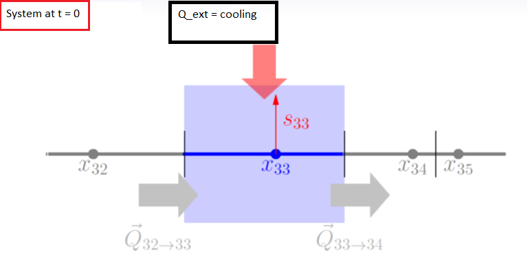
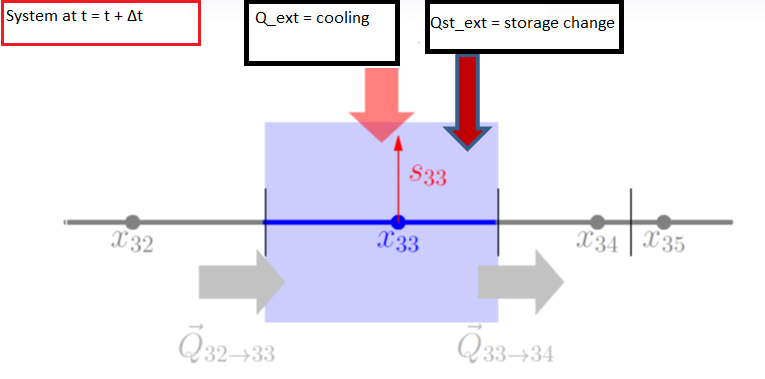
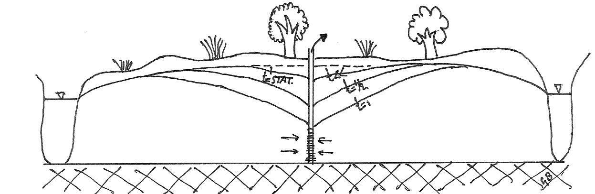
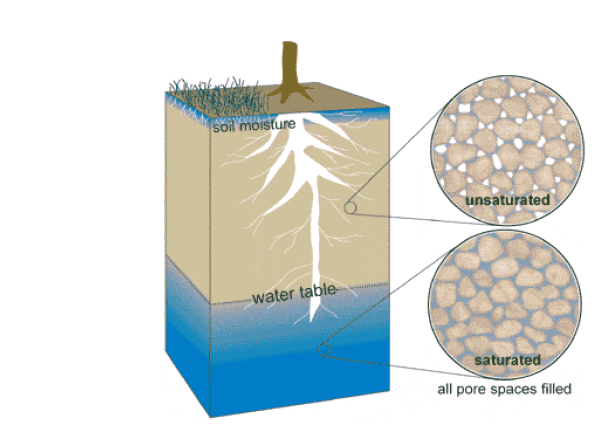

```{r, echo=FALSE}
rm(list=ls())
#Check to see if package(s) are installed, install if not and then load

#pkgs is a vector of strings with length >= 1
CheckInstallPackages <- function(pkgs){

#For each pkg in pkgs (attempt to load each package one at a time):
x <- lapply(pkgs, function(pkg)
{
  #Load the package if available,

  if(!do.call("require", list(pkg))) {

   #Silently attempt to install into the default library

   try(install.packages(pkg, lib=.Library,repos="http://cran.rstudio.com"))

   #Now attempt to load the package, catch error if it wasn't installed

   tryCatch(do.call("library", list(pkg)),

    #Catch if we're unable to install into the default library

    error = function(err) {

     #If non-interactive, install into this user's personal library

     if(!interactive()) {

      #Get the path to this user's personal library

      personalLibPath <- Sys.getenv("R_LIBS_USER")

      #If the personal library is not in the list of libraries

      if(is.na(match(personalLibPath, .libPaths()))) {

       #Then create the personal library

       dir.create(personalLibPath, recursive = TRUE)

       #And add the personal library to the list of libraries

       .libPaths(personalLibPath)

      }

      #Attempt to install the package into the personal library

      #If this fails, raise the error back to the report

      install.packages(pkg, lib=personalLibPath, repos="http://cran.rstudio.com")

      #Finally, attempt to load the package

      do.call("library", list(pkg))

 }})}})

} 
CheckInstallPackages(c("knitr","FVFE1D"))
```

## Learning Goals
* Understand why the storage change is introduced for transient systems.
* Understand how the storage change is implemented.
* Understand the relation between time steps in transient systems.
* Learn how to use a loop for a repetitive task and how to store results in a dataframe.

# Part 1: Transient potential temperature in the stable boundary layer (SBL)
In this assignment, we will start working with transient systems: systems that change over time. The assignment consists of two different parts: The first part (this part) is based on a meteorological application, and the second part is an hydrological application. TIP: Having difficulties grasping the concepts introduced in Part 1? Part 2 deals with the same theory but from a hydrological perspective. 

## Introduction 
We will continue with the situation of the stable boundary layer above a cooling Earth surface after sunset, when downward transport of heat occurs - see Part 2 of Assignment 1. The figure below shows a potential temperature profile that is typical for the stable boundary layer. We will produce a comparable graph in this assignment, but now accounting for evolution in time that is the effect of progressive cooling of the surface throughout the night.

The state variable and the **flow domain** of the model will be the same as in Assignment 1: potential temperature $\theta$ [K] is our state variable, and the flow domain has a length of 99.5 m, starting at a height of 0.5 m above the surface and ending at the top of the SBL, which is fixed at 100 m. 

<div align="center">


Figure 1: Potential temperature distribution over height
</div>

## 1.1 The model set-up
### 1.1.1 Internal flux
Flux of energy in the x-direction (height) is calculated using Fick's law with a so-called eddy-diffusivity, which accounts for the mixing caused by overturning turbulent whirls (eddies).

$$Q=-K_{eddy}\frac{\partial \theta}{\partial x}$$
with $K_{eddy}$ being the eddy diffusivity and $\frac{\partial \theta}{\partial x}$ being the gradient of the potential temperature. In the atmospheric boundary layer (ABL), the eddy diffusivity is nonlinear. Close to the surface, mixing in the vertical is hard, because overturning eddies quickly hit the surface, whereas further away from the surface, it goes easier. Therefore, the diffusivity $K_{eddy}$ is proportional with height and formulated as:

$$K_{eddy}=ku_{*}x$$
where the Von Karman constant $k$ equals 0.4, friction velocity $u_{*} = 0.25$ m/s  at the surface, which is a measure of the intensity of turbulence, and $x$ is the height above the surface (also often referred to as $z$, since we are working in the vertical direction).

### 1.1.2 External fluxes
In Assignment 1 Part 2, the following examples of an external flux were given in the context of radiative cooling of the surface boundary layer:

1. No radiative cooling [0 K/s] within the entire domain.

2. A constant radiative cooling within the entire domain. 

In this assignment, a variable radiative cooling as function of height will be used:

3. A linearly decreasing radiative divergence (cooling) which has a constant value of -1.74E-4 K/s at a height of 0.5 m, above which it linearly decreases to a value of -5.55E-5 K/s at the top of the surface boundary layer (100 m).
  
### 1.1.3 Boundary conditions
The boundary conditions describing the potential temperature at both the lower and upper boundary of the SBL will be of the Dirichlet-type. For the potential temperature at the lower boundary, an initial value of 291.73 K is adopted, which will decrease with 0.5 K/h as time evolves. The potential temperature of the upper boundary is fixed at 295.0 K. The model setup as described above largely resembles the setup of Assignment 1 Part 2. However, a big difference is that this time, the lower boundary condition is not constant in time, but progressively decreases according to a prescribed cooling rate.

### 1.1.4 Discretization
* space:  $\Delta x = 2 m$,    i.e. the nodal distance (spatial resolution).
* time:   $\Delta t = 300 s$,    i.e. the temporal resolution for which the model will be solved.

### 1.1.5 State variables
<div class="question">
1. What are the units of this model? 
</div>

<div class="student_answer">

| System variable | Unit          | 
| ----------------|---------------| 
| State ($\theta$)| ...           |
| Internal flux   | ...           |
| External flux   | ...           |
| Space (scale)   | ...           |
| Time  (scale)   | ...           |
</div>


<div class="answer">

| System variable | Unit (answer) | 
| ----------------|---------------| 
| State ($\theta$)| K             |
| Internal flux   | K m/s         |
| External flux   | K/s           |
| Space (scale)   | m             |
| Time  (scale)   | sec           |
</div>

## 1.2 Analyzing the situation before the surface starts to cool
Before we start studying the transient behaviour of the model, we will first create the stationary model. The solution of this stationary model describes the situation right before the surface starts to cool: we use it as initial condition for our transient model. The states resulting from the stationary model will be used as the initial conditions for our transient model. Note that, because the model is stationary, there is balance between the internal and external fluxes (radiative cooling). 

<div class="question">
2. Set up the mathematical part of the model for the initial situation, i.e. for the situation before the surface starts to cool. For the lower boundary condition the fixed state value (as in Assignment 1) should be used, and we use the third option of the external fluxes as discussed in Section 1.1.2 above. Call this model `oneDinitmodel`. Do not forget to clear your environment and to import the `FVFE1D` package at the beginning. TIP: Check the model template which was provided with Assignment 1 (``ModelTemplate1D.Rmd``).
</div>

<button type="button" onclick="showHint(212)">Show Hint</button>
<p id="Q212"> </p>

<div class="student_answer">
```{r}
# Clear environment, load packages
# Define flow domain
# Define internal flux
# Define flow model
# Define boundary conditions
# Define external flux
# Add external flux to model
```
</div>

<div class="answer">
2. The mathematical setup of the first model  

```{r}
# Clear environment
rm(list=ls()) 
# load package
library(FVFE1D)

# Defining the flow domain of the model.
domain = c(0.5, 100.)

# The internal flux: 
k = 0.4
ust = 0.25
tempflux = function(x, state, gradstate)  
{
  return(-k*ust*x*gradstate)
}

# Define the flow model, which requires a domain, systemflux function, and (optional) a name
oneDinitmodel = newFLOW1D(domain=domain, systemfluxfunction=tempflux, name="oneDinitmodel") 

# Define the boundary conditions
set.BC.fixedstate(oneDinitmodel, 'left', 291.7) 
set.BC.fixedstate(oneDinitmodel, 'right', 295.)

# Define the external flux (which is different from Assignment 1, Part 2, because now a function of height)
RD.func = approxfun(c(0,0.5,100), c(-1.74E-4,-1.74E-4,-5.55E-5))
extfunc = function(x, state)
{return(RD.func(x))}

# Add the external flux the model
add.spatialflux(oneDinitmodel, extfunc, 'RD_height_dependent')
```
</div>

<div class="question">
3. Implement the numerical part of the model, and solve the model for the initial (here stationary) situation to obtain values of the state variables for all volumes (nodes).  Since the flux terms for these models are all relatively small (in numbers), it is wise to increase the convergence criteria.  This can simply be set as an extra argument of the ``solve.steps()`` function. Have a look at the help of this function and set e.g. ``MAMcrit = 1e-8``
Make plots of the state variable and the internal fluxes as a function of height. Switch the axes such that height is on the vertical axis.  
Thereafter, print a summary of the model. Take a look at the documentation of the plot function from the FVFE1D-package and consider the arguments of this function. For instance, you may use the "FVstyle" parameter to plot the actual values of the control volumes in which the states are constant (this is a consequence of the Finite Volumes method).
</div>

<button type="button" onclick="showHint(213)">Show Hint</button>
<p id="Q213"> </p>

<div class="student_answer">
```{r}
# Define the nodes at which the states will be solved
# Discretise the model and choose the numerical method
# Solve the model
```
</div>

<div class="answer">
3. The numerical setup of the first model  

```{r}
# Define the nodes at which the states should be solved.
nodes = seq(domain[1], domain[2], by=2)

# Discretise the model and choose the numerical method which will be used for the solution
set.discretisation(oneDinitmodel, nodes, 'FV')

# Solve the model:
solve.steps(oneDinitmodel, MAMcrit=1e-8)

# Plotting the states and the internal fluxes as a function of height.
plot(oneDinitmodel, fluxplot=TRUE, vertical=TRUE, FVstyle=TRUE)

summary(oneDinitmodel)
```
</div>

<div class="question">
4. Choose the volume associated with node 30, at x=58.5m. Manually (but you can use R to do this 'manually') calculate whether the net internal flux over the boundaries of this control volume indeed equal the integrated external flux over this region. Compare your result with the built-in function that calculates the balance.  
Is the balance for this particular volume closed, do you get the same values for the balance components as calculated by the built-in function?  
Finally, what do you think is the relation between the returned misfit by the solve.steps() function and the value of the net balance component?
</div>

<button type="button" onclick="showHint(214)">Show Hint</button>
<p id="Q214"> </p>

<div class="student_answer">
Fill in your answers here...
</div>

<div class="answer">
4. The `dataframe.balance`-function returns a table from which one can read that the balance for control volume 30 is indeed closed, although the net change is not exactly zero. The larger the misfit one permits in the `solve.steps()` function, the larger this net change in the balance can become (note, however, that this is generally not what you want!).

```{r}
# Model output: 
dataframe.balance(oneDinitmodel, region=c(30))

# Manual balance calculation of control volume at node 30:

# Calculate the length over which the flux enters the control volume (in this case fixed at 2 as nodal distance, but in other cases, this may vary and needs to be calculated)
volume_length = (nodes[31] + nodes[30]) / 2 - (nodes[30] + nodes[29]) / 2   

# radiative divergence
RD_node30 = RD.func(nodes[30])    

# create a states vector for easy reference
states = dataframe.states(oneDinitmodel)$state     

# gradient at left side of control volume
grad_left = (states[30] - states[29]) / (nodes[30] - nodes[29])   

# gradient at right side of control volume
grad_right = (states[31] - states[30]) / (nodes[31] - nodes[30])            

# Go from the gradient to the actual flux using the system flux function as defined in oneDinitmodel
# Note that the particular system flux function is independent of state, one can enter any value here.
flux_left = tempflux((nodes[29] + nodes[30])/2, (states[29] + states[30]) / 2, grad_left)
flux_right = tempflux((nodes[30] + nodes[31])/2, (states[30] + states[31]) / 2, grad_right)

# Calculate the net balance value for the control volume at node 30
net_balance = flux_left - flux_right + RD_node30 * volume_length
print(paste("Manually calculated net balance:", net_balance))
print(paste("Net balance calculated by built-in function:", dataframe.balance(oneDinitmodel, region=c(30))[4, "net"]))
```
</div>

## 1.3 Incorporating transient behavior into the model simulation
For stationary systems the state variables are fully constrained by the BCs and the formulation of the internal and the external fluxes. By checking the balance of a particular volume, as we did in question 4, we noticed that at this location there is a balance between the net internal flux between adjacent volumes and the external fluxes provided to the volumes. The external fluxes summed over the entire flow domain equal the net flux over the boundaries of the system; in and outflow are in equilibrium and the system is in steady-state.

However, many hydrological and meteorological systems are not in steady state. As a result, the sum of internal and external fluxes for a control volume do not add up to zero, and hence the balance is not closed. As a result, the control volume experiences what we call _storage change_. In other words, the value of the state variable in a control volume is increasing or decreasing in time. As long as storage change occurs, the system is not in equilibrium. For instance, the atmospheric temperature measured above the land surface, is almost never in equilibrium, due to the ceaseless influences of day and night, weather systems and seasons.

<div align="center">



Figure 2: storage change for a stationary (top) and a transient (bottom) situation.
</div>

A picture of the situation for transient systems is given in Figure 2.
In the upper figure we see the situation at time `t`, the initial time before the surface starts to cool. In this situation, there is a balance between the external fluxes and the internal fluxes for a particular volume and its adjacent volumes.

The lower picture shows the situation when the system has progressed one time step after the surface started cooling. In this case, there is again a balance in the volume. However, in contrast to the initial stationary situation, besides the external fluxes that act on the system at $t+\Delta t$ and the internal fluxes within the system at $t+\Delta t$, there is an additional flux here that results from the change of storage within the system, if the internal and external fluxes do not add up to zero.

<button class="collapsible">Physical interpretation of storage change</button>
<div class="content">  
The potential temperature is defined as: $\theta=T\frac{p_0}{p}^{R_d/c_p}$ .  

Where $p_0, p, R_d$ are the reference and local pressures and the gas constant for dry air.  
$c_p$ is the specific heat capacity which is a property of an air parcel for storing or releasing heat (energy). Storage of energy leads to an increase in temperature.

Source: https://en.wikipedia.org/wiki/Potential_temperature
</div>

The storage change $S$ is directly related to the increase or decrease in the value of the state variable stored within the system. For heat storage in the atmosphere, $S$ is given as:

$$S = \int_{V}\frac{\partial \theta}{\partial t}dV$$

In this 1-dimensional example, the volume step `dV` equals `dx`. In the model, the storage change is added as an external flux $Q_{st}$, which we call the storage flux, defined as:

$$Q_{st} = - \int_{V}\frac{\partial \theta}{\partial t}dV$$

<div class="question">
5. What is the dimension of this external flux and why is the storage flux negatively related to the rate of change in the state variable?
</div>

<div class="student_answer">
Fill in your answer here...
</div>

<div class="answer">
5. The storage flux has the same units as other external fluxes and is prescribed as a change in the state variable per time unit, multiplied with the length (as this is a 1D problem) over which it is integrated.
The storage flux is negatively related to the rate of change in the state variable, as we are solving a balance that is required to add up to zero. While in the advection-diffusion equation the $\partial s/\partial t$ is on the left-hand side, in the solution of the water balance, we move it to the right hand side. The storage change then acts as a negative flux. It can be interpreted as the flux that needs to be added in order to compensate for the non-closure of the balance.
</div>

In the previous question we have identified the storage change in a way that is similar to how we defined external fluxes: it is given as the integral of a function that defines the storage at one point in space. Therefore, the storage change in a transient system can be implemented in the same way as the external fluxes are implemented. 

<div class="question">
6. Make a new model which is an exact copy of your `oneDinit`-model. Call this copy `oneDtransientmodel`.
</div>

<button type="button" onclick="showHint(216)">Show Hint</button>
<p id="Q216"> </p>

<div class="student_answer">
```{r}
# Copy your oneDinit-model
```
</div>

<div class="answer">
```{r}
# This model will be used for a transient analysis in the next questions.
oneDtransientmodel = copy.model(oneDinitmodel)
set.name(oneDtransientmodel, newname = "oneDtransientmodel")
```
</div>

<div class="question">
7. Check the documentation and try to find the function which should be used to add the storage change function to your transient model.
</div>

<div class="student_answer">
Fill in your answer here...
</div>

<div class="answer">
7. Add the storage change to your transient model with the function below. As long as you do not evaluate this code block in the knitting procedure, it is allowed to refer to arguments that are not defined yet, such as the storage change argument.

```{r, eval=FALSE}
#add.spatialflux(oneDtransientmodel, storage_flux, name="storage")
add.spatialflux(oneDtransientmodel, rate=storage_flux, name="storage")
```
</div>

Now that you know that the storage change can be added to the model as an external flux, the flux function should be defined. We need to provide a function that calculates the storage flux for a specific location (the nodes). This should be a function that takes as arguments the location and the value of the state variable at this location. The return value is the storage flux.

To develop such a function, we first need to write down the discretized version of the storage flux $Q_{st}$ (thus with the minus in front).

$$Q_{st}=-\int_{V}\frac{\theta_{new}-\theta_{old}}{\Delta t}dx$$,

where $\theta_{old}$ is the potential temperature at the time step for which we have solved before (or the initial condition at the very first time step), and $\theta_{new}$ is the potential temperature at the time step for which we are solving. Parameter $\Delta t$ is the time step itself.

<div class="question">
8. Define the storage flux function below, call it `storage_flux` and introduce it to your transient model. Use a function called `oldstate(x)` that retrieves the state values of the current time step which takes position as an argument.
</div>

<button type="button" onclick="showHint(218)">Show Hint</button>
<p id="Q218"> </p>

<div class="student_answer">
```{r}
# Define your storage change here
```
</div>

<div class="answer">
8. The storage change depends on position and state. Even though `oldstate(x)` is not defined yet, we can already define the storage flux function (but we are not able to run it yet, without defining the oldstate function). The `oldstate`-function returns the state of the system at a specific location, `x`, at the current time step. This information is needed in order to calculate the gradient of the state in time. `dt` still needs to be defined too.

```{r}
storage_flux = function(x, state)
{
  storage_change = (state - oldstate(x)) / dt
  storage_flux = - storage_change
  return(storage_flux)
}

# Add the storage change to your transient model.
add.spatialflux(oneDtransientmodel, storage_flux, name="storage")
```
</div>
In order for the storage change function to work we still do need to define:

1)	a value for `dt` (the code equivalent of $\Delta t$): use 300 seconds as a starting value 

2)	a function that is called `oldstate` and that returns the value of the state at the current time step at location `x`

## 1.4. Setup of the transient simulation
In the previous exercises we developed a model that incorporated an additional flux, the storage change, which is needed in transient systems because the storage changes over time within transient system. This model can now be used to analyse the effect of the progressive cooling of the surface in time. In our model, the surface starts to cool at $t=0$. 

<div class="question">
9. Include a line of code that tells the script that the starting time is zero (use the variable name ``time`` for time in your code).
</div>

<div class="student_answer">
```{r}
# Starting time
```
</div>

<div class="answer">
```{r}
# Starting time is set to zero.
time = 0
```
</div>

At the starting time, there is, for each volume, a balance between the external fluxes and the net internal flux. The states of the transient model at t=0 are given by our steady-state `oneDinitmodel`. The state variable profile of this model is used as the initial profile for our transient system.

Now, we increase the time by a time step $\Delta t$.

<div class="question">
10. Include a piece of code that tells the script that the time should increase with $\Delta t$.
</div>

<div class="student_answer">
```{r}
# Define the size of the time step (given above)

# Increment in time

```
</div>

<div class="answer">
10.  

```{r}
# Define the size of the time step. 
dt = 300
# increment the time.
time = time + dt
```
</div>

As time progresses, the temperature at the lower boundary changes as a result of cooling of the surface. The cooling rate is 0.5 K/h. The surface temperature change as a function of time is described by:

$$T_{1}(t=\Delta t)=T_{1,init}-\frac{time}{3600}0.5$$
where $T_{1}(t=\Delta t)$ is the temperature of the lower boundary at $t=\Delta t$ which is the total elapsed time, and $T_{1,init}$ is the temperature of the lower boundary at $t=0$.

<div class="question">
11. Define the lower boundary condition as described by the cooling of the surface equation and add this transient boundary condition to your transient model.
</div>

<div class="student_answer">
```{r}
```
</div>

<div class="answer">
11. Due to the simplicity of the transient boundary condition, the function can be entered as an argument directly. Although the function is called fixed state, the left (in our case, lower) boundary condition will be resetted at every time step. In other words, the state of the lower boundary condition is fixed, but only during one time step.
```{r}
set.BC.fixedstate(oneDtransientmodel, 'left', 291.7-time*0.5/3600.)
```
</div>

In the previous questions we have defined an object of the class `FLOW1D` called `oneDtransientmodel`. We have defined the following properties in this object:

1.  A definition of the domain.
2.  A function that describes internal transport within the system as a function of location, state and the gradient of the state.
3.  The external fluxes for each volume as a function of location and state of the system.  
4.  A formulation of the flux due to the change in storage as a function of location and state of the system.

To complete the mathematical formulation of the transient model, we still need to specify the `oldstate(x)` function that is called within the storage change function. This `oldstate(x)` function returns the state of the system at the previous time step at a specific location. At $t=\Delta t$, so after the first step in time, the profile of the potential temperature is given by the profile of the states as generated by the `oneDinitmodel`. The function `oldstate(x)` can thus be calculated as:

```{r eval=FALSE}
# Store the states of the stationary model in a variable. This variable now refers to a dataframe with two columns  containing the positions and its corresponding states.
startprof = dataframe.states(oneDinitmodel)

# oldstate is now defined as a function that returns states of the stationary model as function of position. 
# Type "?approxfun" in your console to learn more about the interpolation function.
oldstate = approxfun(startprof$x, startprof$state, rule=2)

# an alternative would be to use the built in function of the FVFE-package: state.fun()
oldstate = state.fun(oneDinitmodel)
```

<div class="question">
12. Add this piece of code and verify that it indeed gives the value of the state at the previous time step, $t=0$ in this case, for the locations $x=24.5$ and $x=50.5$.
</div>

<div class="student_answer">
```{r}
# Add code
```
</div>

<div class="answer">
```{r}
startprof = dataframe.states(oneDinitmodel)
oldstate = approxfun(startprof$x, startprof$state, rule=2)

# Check the states at two locations 'manually'
state245 = startprof[startprof$x==24.5, ]$state
state505 = startprof[startprof$x==50.5, ]$state

# Check the states using our self-defined function, based on approxfun
state_fun245 = oldstate(24.5)
state_fun505 = oldstate(50.5)

# Check if both values are equal
if (state245 == state_fun245 & state505 == state_fun505)
{
  print("Both values are equal!")
}
```
</div>

Now that the mathematical formulation of the model is completed, the numerical part can be implemented and the model can eventually be solved. For the model to be numerically solvable, the following actions need to be performed:

* Creation of the nodes at which the system is solved for its states.
* Set the discretization of the system by defining the method that is used to solve the system.
* Calling the solve function on the transient model. Solving of the model requires finding the values of the state variables in all volumes such that the balances of all volumes are zero (the sum of the external fluxes and the storage change equals the net internal flux of a specific volume). As in the stationary model, this requires the solving of (N-2) state variable balances (for all volumes) to get (N-2) values of the state variables, where N is the number of volumes that we have specified. As before, we simply use a function called ``solve.steps`` which takes the instance of the class FLOW1D as an argument and solves the values of the state variables at the specified volumes that lead to a minimal misfit between net internal flux and the external fluxes.

**Extra assignment** Interested in knowing how the ``solve.steps``-function works? Check the extra assignment on Brightspace called ``Newton-Raphson``. 

The snippet below shows the missing elements of the numerical model.
```{r, eval=FALSE}
nodes = seq(...)
set.discretisation(...)
#control = solve.steps(...)
```

<div class="question">
13. Add a piece of code that defines the numerical formulation (nodes, and discretization type) of your model. The nodal distance should be two meters. Thereafter, print a summary of your model to check whether the storage change was implemented correctly.
</div>

<div class="student_answer">
```{r}
# Add the numerical implementation
```
</div>

<div class="answer">
```{r}
# Define the nodes at which the states will be solved.
nodes = seq(domain[1], domain[2], by=2)

# Discretize the numerical model and choose numerical method.
set.discretisation(oneDtransientmodel, nodes, "FV")

summary(oneDtransientmodel)
```
</div>

#### 1.4.1. One step transient model simulation
At this stage of our transient model, we can simulate a transient situation of just one time step. With this, it becomes clear that during time the state ($\theta$) distribution changes from the stationary one towards a temperature distribution after one time step $time=\Delta t$. The effect of storage change and time increment can now be analysed on states and balance terms.  

<div class="question">
14. Complete the last code chunk with ``solve.steps(oneDtransientmodel)`` to calculate the situation at $time=\Delta t$.
</div>

<div class="answer">
14. Here the output of solving the model (number of iterations, improvements etc) is writen to the variable `solve_1_dt`  

```{r}
solve_1_dt = solve.steps(oneDtransientmodel, MAMcrit=1e-08)
```
</div>

<div class="question">
15. Plot the profiles of the state variables and the internal fluxes for time $t=\Delta t$ and compare these to the profiles at $t=0$.
</div>

<div class="student_answer">
```{r}
# plot()
# points()
```
</div>

<div class="answer">
```{r}
# Plot states at the different times
plot(dataframe.states(oneDinitmodel)$state, dataframe.states(oneDinitmodel)$x, col = "red",
     main="initial states (red) & transient states (blue)")
points(dataframe.states(oneDtransientmodel)$state, dataframe.states(oneDtransientmodel)$x, col="blue")

# plot internal fluxes at different times
plot(dataframe.internalfluxes(oneDinitmodel)$intflux, dataframe.internalfluxes(oneDinitmodel)$x, col="red",
     xlim = c(min(dataframe.internalfluxes(oneDinitmodel)$intflux, dataframe.internalfluxes(oneDtransientmodel)$intflux),
     max(dataframe.internalfluxes(oneDinitmodel)$intflux, dataframe.internalfluxes(oneDtransientmodel)$intflux)), 
     main="initial intflux (red) & transient intflux (blue)")
points(dataframe.internalfluxes(oneDtransientmodel)$intflux, dataframe.internalfluxes(oneDtransientmodel)$x, col="blue")
```

You can see the change of the internal flux at the lower boundary as a consequence of the transient boundary condition. The states have changed according to the transient lower boundary, the surface is a little bit cooler now.
</div>

<div class="question">
16. Calculate the (energy) balance with  ``dataframe.balance(oneDtransientmodel)`` and inspect the balance terms of the whole model.
</div>


<div class="answer">
```{r}
wbal_1_dt = dataframe.balance(oneDtransientmodel)
print(wbal_1_dt)
```
The storage change is about 10% of the external flux 
</div>

<div class="comment">
**[GB]**zou hier niet een plot gemaakt moeten worden met de verdeling van de storage en externe flux?
</div>

#### 1.4.2. Implementing the time loop
To cycle through the time steps $\Delta t$ of 300 $\mathsf{sec}$ starting at **begin.time** and finalizing at **end.time**, a time loop needs to be implemented.

<div class="question">
17. Complete the code below in order to make the transient version. Take the following actions and simulate the model for 4 hours.

* Add code to replace the comments with capital letters. Note that the starting states of the transient model is set explicitly, otherwise the starting states are set to zero.
* Add ``fig.show='animate'`` between the curly brackets of your R-code block (first line, ``{r fig.show='animate'}``) to create an animation. If the animation does not display in the markdown, open the html in Google Chrome.
</div>

<div class="student_answer">
```{r, eval=FALSE}
# Set the time to zero
time = 0

# The calculation of the first step in time.
startprof = dataframe.states(oneDinitmodel)
oldstate = approxfun(startprof$x, startprof$state, rule=2)

# End time is 4 hours.
end.time = 4*3600.

# Enter the loop construct until the equation between brackets returns FALSE.
while (time < end.time)
{
  # INCREMENT THE TIME WITH dt
  
  # SOLVE THE MODEL WITH AN UPDATED SURFACE BOUNDARY CONDITION
  
  # PLOT THE STATE AND THE INITIAL STATE IN THE SAME FIGURE
  
  # Wait a little for the window to update.
  Sys.sleep(0.1)
  
  # UPDATE oldstate FUNCTION
}
```
</div>

<div class="answer">
```{r, fig.show='animate', interval=0.1}
# Set the time to zero
time = 0

# The calculation of the first step in time.
startprof = dataframe.states(oneDinitmodel)
oldstate = approxfun(startprof$x, startprof$state, rule=2)

# End time should be 4 hours.
end.time = 4*3600.

# Enter the loop construct until the equation between brackets returns FALSE.
while (time < end.time)
{
  # increment the time.
  time = time + dt
  
  # calculate the new BC at the surface (cooling of surface).
  set.BC.fixedstate(oneDtransientmodel, 'left', 291.7-time*0.5/3600.)
  
  # calculate the states for the new time step.
  solve.steps(oneDtransientmodel, MAMcrit=1e-8)
  
  # Wait a little for the window to update.
  Sys.sleep(0.1)
  
  # plot the potential temperature in the x-axis and the height on the y-axis.
  plot(dataframe.states(oneDtransientmodel)$state, dataframe.states(oneDtransientmodel)$x, xlab='pot. temp [K]', ylab='height [m]', xlim=c(289, 295.5), main=as.character(time))
  
  # Save the new states and define the oldstate function for the next time step.
  modelresults = dataframe.states(oneDtransientmodel)
  oldstate = approxfun(modelresults$x, modelresults$state, rule=2)
}
```
</div>

<div class="question">
18. Run the code. If all went well, and the end time was chosen properly, you should see a movie of the state transitions between the initial situation and the situation after 4 hours.
</div>

When you want to use the intermediate results of the time integration for further analysis, the following instructions should be taken into account:

* Create a data structure in which the intermediate time steps can be stored
* Store the intermediate time steps in the data structure
* Plot the saved intermediate states

The code snippet below shows how this can be done.
```{r, eval=FALSE}
#should be set first and outside the loop
result.store = data.frame() 
#should be set in the loop
  Results.store = rbind(Results.store, data.frame('t'=time, 'lvalue'=dataframe.states(oneDtransientmodel)$state[1], 'outflow'=dataframe.boundaries(oneDtransientmodel)[1,4], 'midstate'=dataframe.states(oneDtransientmodel)$state[26]))
plot(result.store$t, result.store$outflow, type="o", col="red")
```

<div class="question">
19. Use these ideas to make one plot showing the external flux at the lower boundary. Also, make one plot that both presents the state value at a location of 50 m above the surface and the state value at the lower boundary as a function of time.
</div>

<div class="student_answer">
```{r}
```
</div>

<div class="answer">
```{r}
# Set the time to zero
time = 0
dt = 300
# The calculation of the first step in time.
startprof = dataframe.states(oneDinitmodel)
oldstate = approxfun(startprof$x, startprof$state, rule=2)
time = time + dt
set.BC.fixedstate(oneDtransientmodel, 'left', 291.7-time*0.5/3600.)

# End time should be at least 4 hours.
end.time = 4*3600.

# Initialize the dataframe that will be populated with intermediate results.
Results.store = data.frame()

# continue until condition returns FALSE
while (time < end.time)
{
  time = time + dt
  
  # calculate the new BC at the surface (cooling of surface)
  set.BC.fixedstate(oneDtransientmodel,'left', 291.7-time*0.5/3600.)
  
  # # calculate the states for the new time step.
  solve.steps(oneDtransientmodel, MAMcrit=1e-8)
  
  # Save the new states and define the oldstate function for the next time step.
  modelresults = dataframe.states(oneDtransientmodel)
  oldstate = approxfun(modelresults$x, modelresults$state, rule=2)
  
  # Here, the dataframe is populated with intermediate results
  Results.store = rbind(Results.store, data.frame('t'=time, 'lvalue'=dataframe.states(oneDtransientmodel)$state[1], 'outflow'=dataframe.boundaries(oneDtransientmodel)[1,4], 'midstate'=dataframe.states(oneDtransientmodel)$state[26]))
}
```

```{r}
# Plot the state value at the lower boundary. This follows the formula that describes the cooling rate.
plot(Results.store$t,Results.store$lvalue, xlab='Time [s]', ylab=' pot temp. [K]', ylim=c(288, 295), col="black",
     main="State lower boundary (black) & 50 meters above surface (red)")

# Add points that plot the state value at 50 meters above the surface as a function of time.
points(Results.store$t, Results.store$midstate, col='red')

# Plot the flux of the energy flowing out of the system.
plot(Results.store$t, Results.store$outflow, xlab='Time [s]', ylab=' flux [m/s K]', main="Energy flowing out of system")
```
</div>


# Part 2: A transient groundwater model

## Introduction to the transient groundwater flow model  
In this assignment, a transient groundwater system will be studied. As a first example, the development of an extraction cone is examined. An overview of this process is shown below.
The description of this system is largely equal to that of Assignment 1 Part 1. So we take (again):  

* L = 200 $m$
* Dirichlet boundary conditions left and right river = 5.0 $m$
* kD = 45 $m^2/d$ for type 1 flow
* k = 10 $m/d$ for type 2 flow
* The nodal distance $\Delta$ x = 10 m
* Recharge R = 0.001 $m/d$
* Extraction rate of the well is 0.25 $m^2/d$ at 90 $m$ from the left



Figure 1: Transient flow including an extraction well.

## 2.1. Transient systems: The storage change  
Over time an amount of water can be stored into the soil or released from it. This storage change of water takes place in the pore space of the soil. Figure 2 illustrates water stored in the pore space of a soil column.  

<div align = "center">


Figure 2: Water stored in the soil. Above the groundwater table (the unsaturated zone) pore space is (mainly) filled with air, below it (saturated zone) it is filled with water.  
</div>  


In this assignment an extraction well is switched on and over time a _draw down cone_ of the head develops (see Figure 1). At the beginning of the extraction, most water is extracted from this pore space. As a consequence, the head in the near vicinity of the well will drop, since the soil releases stored water from pore space which is then transported into the well tube.  Due to the head drop near the well, a head gradient develops creating groundwater flow towards the well.  

<button class="collapsible">Physical interpretation of storage change</button>
<div class="content">
The state, head in this case, is not only a water level (potential energy for flow) but intrinsically contains an amount of water as well.  
To clarify this; imagine a column of soil containing soil particles, water and air. The water level stands for the potential energy which is based on an amount of water and a given reference level or datum as shown in the following formula:


$$
H = \frac{P}{\rho g}+z
$$
With:  

*    $H$ :Hydraulic Head $\left[\mathsf{L}\right]$
*    $P$ :Pressure $\left[\mathsf{F/L^2}\right]$
*    $\rho$ :Density fluid $\left[\mathsf{M/L^3}\right]$
*    $g$ :Gravity force $\left[\mathsf{L/T^2}\right]$
*    $z$ :Reference height, datum $\left[\mathsf{L}\right]$
  

The pressure term in the above formula, comes from the water column in the soil pressing on a certain surface. The column here is actually a volume of water with a certain density; $A\,l\,\,\rho$.  
Knowing that $P=\frac{F}{A}$ for which the Force comes from the column water itself; $F=M\,g \rightarrow A\,\,l\,\rho\,g$, so $P=l\,\rho\,g$, which reduces this pressure term to simply $l$.  
Finally, the effect of releasing water from storage towards the well, is in essence a decrease of a volume of water expressed as $l$ and therefore head.


</div>
The non-stationary situation that occurs when the pump is switched on, leads to changes in storage. Therefore, we need to account for storage change in our model. The way we do that here, is with an additional flux term. This flux can 'take' water from storage, or 'add' water to storage, and as such accounts for storage changes. This flux can be added to the model's balance:
$$
q_{sto}(x,t)=-S\frac {H(x,t)_{new}- H(x,t)_{old}}{\Delta t}
$$
With 

1.    $q_{sto}$ Storage flux being either recharge or discharge [$\mathsf{m/d}$]
2.    $S$ Storage Coefficient, which is closely related to the porosity [$\mathsf{m^3/m^3}$]
3.    $H(x)_{new}$ Head at the new time step [$\mathsf{m}$]
4.    $H(x)_{old}$ Head at the previous (old) time step [$\mathsf{m}$]


<div class="question">
1. What are the units of the variables above?
</div>

<div class="student_answer">
Fill in your answer here...
</div>

<div class="answer">
The domain of the model has only one spatial dimension, (e.g. the x-direction). Therefore, the spatial flux should have the same dimensions. Here the flux density is defined as length per time, $m/d$. From this follows that the storage coefficient should be dimensionless. The dimensions in which the well is entered in the model is $m^2/d$, but internally the value is divided by the nodal distance at the specific location. Per time step a certain water height, [$\mathsf{m/d}$]
, is subtracted in this situation.

1.    Phreatic storage coefficient: [$\mathsf{m^3/m^3 \rightarrow (-)}$]
 
2.    Spatial flux [$\mathsf{m/d}$]

3.    Extraction Well [$\mathsf{m^2/d}$]

</div>

## 2.2. Setting up the stationary part of the model  
In the following exercises a transient model, based on the stationary model created in Assignment 1, will be developed. Before we start this exercise, the workspace should be cleaned and the FVFE1D package has to be loaded.  

```{r}
# cleaning
rm(list=ls())
# loading
library(FVFE1D)
```

<div class="question">
2. Setup and run the stationary model containing the data above without the extraction well. Make use of type 1 flow. You may use a code chunk from assignment 1. Call this model 'stat_no_well' and solve it using the Finite Volumes method. Plot both the states and the fluxes of the model in an individual graph. Check the plot documentation in the FVFE1D package for more information.
</div>

<button type="button" onclick="showHint(222)">Show Hint</button>
<p id="Q222"> </p>

<div class="student_answer">
Fill in your answer here...
</div>

<div class="answer">
```{r}
# system properties
domain = c(0, 200)
kD = 45
k = 10
left.bound = 5
right.bound = 5

# Mathematical part; functions
flux.fun = function(x, s, grads) {return (-kD*grads)}
stat_no_well = newFLOW1D(domain=domain, systemfluxfunction=flux.fun, name="stat_no_well")
set.BC.fixedstate(stat_no_well, "left", left.bound)
set.BC.fixedstate(stat_no_well, "right", right.bound)
add.spatialflux(stat_no_well, 0.001, "recharge")

# Numerical part
nodes = seq(0, 200, 10)
set.discretisation(stat_no_well, nodes, "FV")
result = solve.steps(stat_no_well)
plot(stat_no_well, stateplot=TRUE, fluxplot=TRUE)
```
</div>

<div class="question">
3. Now, create, solve and plot an identical stationary model with the extraction well at 90 m from the west. You may use copy.model() from the FVFE1D package to prevent repetitive code blocks. Call this copied model 'stat_well' and assign a new name to it using set.name().
</div>

<div class="student_answer">
Fill in your answer here...
</div>

<div class="answer">
```{r}
# Copy and rename
stat_well = copy.model(stat_no_well)
set.name(model=stat_well, newname="Stationary model with well")

# Add the extration well at 90 meters from the western boundary
add.pointflux(stat_well, at=90, value=-0.25, "extraction well")

# Solve and plot
control = solve.steps(stat_well)
plot(stat_well, stateplot=TRUE, fluxplot=TRUE)
```
</div>

<div class="question">
4. Examine the origin of the water extracted by the well. In other words, where does this extracted water come from? Give your answers as a fraction of the total amount of extracted water.
</div> 

<button type="button" onclick="showHint(224)">Show Hint</button>
<p id="Q224"> </p>

<div class="student_answer">
Fill in your answer here...
</div>

<div class="answer">
```{r}
# This is the total water balance from which the origin of the water can be read. 0.2 meter of water originates from recharge and 0.05 meter of water flows over the boundaries into the model.
wbal = dataframe.balance(stat_well)
print(wbal)

# More water flows over the left boundary than over the right boundary.
bounds = dataframe.boundaries(stat_well)
print(bounds)

# The recharge distribution is homogeneous. Each cell, except both volumes at the boundary of the domain because these are half the size of the other volumes, captures a equal amount of water.
recharge = dataframe.externalfluxes(stat_well)
print(recharge)

# Since water is entering at the boundaries, the total amount of recharge is going into the well plus what is entering from the boundaries. Calculation of the origin of water in the well can be performed as follows:
print(paste('Fraction recharge of total extraction :', wbal[2,2]/wbal[3,3]))
print(paste('Fraction of left river :', bounds[1,4]/wbal[3,3]))
print(paste('Fraction of right river :', bounds[2,4]/wbal[3,3]))
```
</div>

<div class="question">
5. Plot the head distributions of stat_no_well and stat_well in one graph by simply using 'dataframe.states()'.
</div>

<button type="button" onclick="showHint(225)">Show Hint</button>
<p id="Q225"> </p>

<div class="student_answer">
Fill in your answer here...
</div>

<div class="answer">
```{r}
# One plot comparing stationary stat_no_well and the stationary stat_well model.  
plot(dataframe.states(stat_no_well), type="o", col="red", ylim=c(4.8,5.2), main="Influence of the extraction well")
lines(dataframe.states(stat_well), type="o", col="blue")
legend("topleft", legend=c("stat_no_well (red)", "stat_well (blue)"))
grid()
```
</div>

## 2.3. Setting up the transient model  
One of the key aspects of creating a transient model is to define the storage change flux rate. The function **oldstate.fun(x)** representing the head $H(x,t)_{old}$ of the  storage change equation in section 2.1. In the first part of this assignment the **oldstate.fun(x)** was calculated with a linear approximation between the nodes using the **approxfun()**. A property of the Finite Volume method is that the values are not interpolated between the nodes. Therefore, it would be more correct to use **state.fun(modelobject)** to retrieve the states of a different model run. Check the documentation for its description!

<div class="question">
6. Define the storage change and its dependencies. Use 0.15 $\left[\mathsf{-}\right]$
 and 0.5 $\left[\mathsf{d}\right]$ for the storage coefficient ${S}$ and time step $\Delta t$   , respectively. Also, use the states from stat_no_well.
</div>

<div class="student_answer">
Fill in your answer here...
</div>

<div class="answer">
```{r}
# Global constants
S = 0.15
dt = 0.5

# storage change function
storage.flux = function(x, state)
{
  storage_change = -S * (state - oldstate.fun(x)) / dt
  return(storage_change)
}

# New oldstate function
oldstate.fun = state.fun(stat_no_well)
```
</div>

To have an idea how this oldstate.fun works, simply type at the console 'oldstate.fun(20)'. This will result in the head (state) at position $x=20 m$. Play around a bit with this function and check whether it is really different from the linearly interpolated oldstate function used before.

<div class="question">
7. To create a transient model the following has to be implemented. 

1.    Make a copy of stat_no_well and call it transientmodel
2.    Give this model a new name (this is not required, but it is recommended)
3.    Add the extraction well to this model 
4.    Add the storage change flux to the model 
</div>

<div class="student_answer">
Fill in your answer here...
</div>

<div class="answer">
```{r}
# Copy and set new name.
transientmodel = copy.model(stat_no_well)
set.name(transientmodel, "Transient Model")

# Add external fluxes. The storage change can be seen as a external flux coming from the previous time step.
add.pointflux(transientmodel, at=90, value=-0.25, "extraction well")
add.spatialflux(transientmodel, storage.flux, "storage change")
```
</div>


#### 2.3.1. One step transient model simulation

Here we first will simulate a transient situation on just one time step.  With this it becomes clear that over time the state distribution changes from the stationary one without an extraction well to the new situation at time = $\Delta t$.  When looking at the balance of this model it becomes clear the a certain amount of flux comes from storage.

<div class="question">
8. The time step $\Delta t$, storage coefficient $S$ and $H(x,t)_{old}$, expressed as `` oldstate``, are already defined in the previous chunks
Now extend the previous code chunk with:

*    the solve command
*    a plot command showing the temporal adjustment of the states
*    a balance command to inspect the balance for this time step
</div>

<div class="answer">
```{r}

solve.steps(transientmodel)
plot(transientmodel,fluxplot=TRUE)
balance = dataframe.balance(transientmodel)
print(balance)
```

</div>

<div class="question">
9. When looking at the storage change w.r.t. the other balance terms, what can you conclude from it? 
</div>

<div class="answer">
9. A very large amount of the extracted water comes from storage.  
The outflow at the boundaries is very close to the stationary situation.
</div>

<div class="question">
10. Adjust the time step from 0.5 day to 100 day(s) and rerun the previous chunk
**Do not forget** to reset dt to 0.5 day.
</div>

<div class="answer">

```{r}
dt = 100
solve.steps(transientmodel)
plot(transientmodel,fluxplot=TRUE)
balance = dataframe.balance(transientmodel)
print(balance)
dt = 0.5

```
</div>

<div class="question">
11. Compare the results.
What can you conclude?
</div>


<div class="answer">
11. With a small time step most of the flux comes from the storage change and with a large time step most of the water comes from recharge and the closest boundary.  
</div>

#### 2.3.2. Implementing the time loop
To cycle through the time steps $\Delta t$ of 0.5 $d$ starting at **begin.time** and finalizing at **end.time**, a time loop needs to be implemented. Use the code of the meteorological exercise in Section 1.4.2 as a reference.

<div class="question">
12. Adapt the code for the specific case here. Take the following actions and simulate the model for 30 days and set `dt` ($\Delta t$) to 0.5 $\left[\mathsf{d}\right]$

* Add code to replace the comments with capital letters. Note that the starting states of the transient model is set explicitly, otherwise the starting states are set to zero.
* Note that the starting states of the transient model should be initiated explicitly, otherwise the starting states are set to zero. Initialize the transient model with the resulting states from `stat_no_well`. By this initialization the spin-up time of the model is minimized.
* add `animation1,  fig.show='animate', aniopts=c('controls','loop'), interval=0.1` between the curly brackets at the first line of your R-code block to create an animation.

You should see a "movie" of the state transitions during the execution of the transient model. A real movie can be included when one Knits the document. ffmpeg.exe is a program, that should be in the same directory as your markdown file already, which creates this movie within the html document. If the animation does not work, try opening the html in Google Chrome.
</div>

<button type="button" onclick="showHint(228)">Show Hint</button>
<p id="Q228"> </p>

<div class="student_answer">
Fill in your answer here...
</div>

<div class="answer">
```{r animation1,  fig.show='animate', aniopts=c('controls','loop'), interval=0.1}
# Graphical parameter for plots
par(bg = "white") 

# Time contraints
begin.time = 0
end.time = 30

# Initialize the model with states of stat_no_well. Default initialization is zero.
do.initialize(transientmodel, state.fun(stat_no_well))

# Enter the time loop
time = begin.time

while(time < end.time)
{ 
  # Increment the time
  time = time + dt
  
  # Solve
  control = solve.steps(transientmodel)
  curresult = dataframe.states(transientmodel)
  
  # Plotting
  title = paste("time =", formatC(time,digits=3,width=6,format="f"))
  plot(dataframe.states(stat_no_well), type="o", col="red",
       main = title, ylim=c(4.8,5.2))
  lines(dataframe.states(stat_well), type="o", col="blue")
  lines(curresult$x, curresult$state,
       main=paste("time=",time), type="o")
  Sys.sleep(0.1)
  
  # Make the states of the current time step accessible for the next time step.
  oldstate.fun = state.fun(transientmodel)
}
```
</div>

## 2.4. Transient intermediate results  
During the transient simulation it is very interesting to have a look at some intermediate results, for example the states and fluxes at the different time steps. The following lines of R-code will help you to save these results.  

<div class="question">
13. Adapt your transient model calculations using the tips below and create some plots of the intermediate results. At least make a plot of the flow over both boundaries, state at the extraction well and storage change. Examine the plots critically, can you explain the intermediate plotting results?

1. Use **result.store = data.frame()** to have a container for the required data.
2. Use **curresult = dataframe.states(transientmodel)** to store the heads.
3. Use **curboundaries = dataframe.boundaries(transientmodel)** to store the outflow of both rivers.
4. Use **wbal = dataframe.balance(transientmodel)** to obtain the intermediate storage change.
5. Use **result.store = rbind(result.store, data.frame('t'=time, 'Hatwell'=curresult$state[9], 'Qoutleft'=curboundaries[1,4], Qoutright'=curboundaries[2,4], 'Qstorage'=wbal[2,2]))** to add the intermediate data to your container.
</div>

<div class="student_answer">
Fill in your answer here...
</div>

<div class="answer">
```{r}
# The data container
result.store = data.frame()

# Time constraints
begin.time = 0
end.time = 30

# Initialize the model with states of stat_no_well. Default initialization is zero.
oldstate.fun = state.fun(stat_no_well)
do.initialize(transientmodel, oldstate.fun)

# Enter the time loop.
time = begin.time

while(time < end.time)
{
  # Increment the time
  time = time + dt
  
  # Solve
  control = solve.steps(transientmodel)
  
  # Store the intermediate states, boundaries and water balance.
  curresult = dataframe.states(transientmodel)
  curboundaries = dataframe.boundaries(transientmodel)
  wbal = dataframe.balance(transientmodel)
  
  # Store the intermediate result in the data container
  result.store=rbind(result.store,
                     data.frame("t"=time,
                                "Hatwell"=curresult$state[9],
                                "Qoutleft"=curboundaries[1,4],
                                "Qoutright="=curboundaries[2,4],
                                "Qstorage="=wbal[2,2]))
  
  # Make the states of the current time step accessible for the next time step.
  oldstate.fun = state.fun(transientmodel)
}
```
  

```{r}
# Plot the flow over both boundaries as a function of time.
plot(result.store$t,result.store$Qoutleft,
     type="o", col="red", ylab ='Outflow (m2/d)', xlab ='Time (d)',
     main='Outflow to rivers; left (red) and right (blue)')
lines(result.store$t, result.store$Qoutright,
      type="o", col="blue")
grid()
# The flow over the boundaries will eventually change from sink to source. More water is flowing over the left boundary into the system due to the position of the extraction well.

# Plot the heads at the location of the well as a function of time.
plot(result.store$t, result.store$Hatwell, type='o',
     col='red', ylab ='Head (m)', xlab ="Time (d)",
     main='Head at well')
grid()
# The head at the well will adapt to the equilibrium state which corresponds to the current extraction rate of the well. The equilibrium situation is approached asymptotically as long as the misfits of the model are not exactly equal to zero.

# Plot the storage change as a function of time.
plot(result.store$t, result.store$Qstorage, type="o",
     col='green', ylab='Storage change (m2/d)', xlab='Time (d)',
     main='Storage change')
grid()
# The starting value of this plot is equal to the extraction rate of the well. This is the initial storage change, a certain time period is needed for the model to cope with the rate of the extraction well and reach a new equilibrium situation in which the storage change will be zero. Again, the approach of the storage change towards zero is asymptotically as long as the model misfit is not exactly equal to zero.
```
</div>

<div class="question">
14. Is the simulation time long enough for the model to reach stationary conditions?
</div>

<div class="student_answer">
Fill in your answer here...
</div>

<div class="answer">
14. In order to answer this question all three the plots that you created above can be used to argue that the model did not reach a steady state. The flow over both boundaries is not constant in time. There is still change in the head at the extraction well and the storage change is not zero yet. In the model the storage change is used as the criterium for being stationary. This will approach zero, but it will not become exactly zero. This mismatch is called the misfit of the stationary solution.
</div>

## 2.5. Using the non-linear (type 2) internal flux
In the previous questions we have used an average transmissivity in the internal flux function which is defined as flow of type 1. Now, this type 1 flow will be replaced with type 2 flow. This means that the transmissivity is based on the saturated thickness at a specific location. The hydraulic conductivity, $10 m/d$, is constant.

<div class="question">
15. Solve the new transient model and use the same approach as in the first transient model. Plot the intermediate result for comparison.

*   Define the system flux function with the new flow type.
*   Create a new model and call it trans2model.
*   Setup the model. i.e. mathematical and numerical part equal to 'transientmodel'.
*   Solve your trans2model with a loop construct, use the initial conditions of 'stat_no_well'.
*   Make sure that you use unique parameter names to prevent overwriting data of other models.
</div>

<button type="button" onclick="showHint(2211)">Show Hint</button>
<p id="Q2211"> </p>

<div class="student_answer">
Fill in your answer here...
</div>

<div class="answer">
```{r}
# System flux function of type 2
k = 10.0 
kH.flux = function(x, state, gradstate)
{
  return(-k*state*gradstate)
}

# Setup of the new transient model.
trans2model = newFLOW1D(domain=domain, systemfluxfunction=kH.flux) 
set.BC.fixedstate(trans2model, 'left', 5) 
set.BC.fixedstate(trans2model, 'right', 5)
add.spatialflux(trans2model, 0.001, "recharge")
add.spatialflux(trans2model, storage.flux, "storagechange")
add.pointflux(trans2model, at=90, value=-0.25, "extraction well")
set.name(trans2model, "transient type2")
set.discretisation(trans2model, nodes, method='FV') 

# Data container for intermediate result, make sure that you use a different name here!
result2.store = data.frame()

# Time contraints
begin.time = 0
end.time = 30

# Initialize the model with states of stat_no_well.
oldstate.fun = state.fun(stat_no_well)
do.initialize(trans2model,oldstate.fun)

time = begin.time

while(time < end.time)
{
  # Increment the time
  time = time + dt
  
  # Solve
  control=solve.steps(trans2model)
  
  # Store the intermediate results.
  curresult = dataframe.states(trans2model)
  curboundaries = dataframe.boundaries(trans2model)
  wbal = dataframe.balance(trans2model)
  result2.store=rbind(result2.store,
                     data.frame("t"=time,
                                "Hatwell"=curresult$state[9],
                                "Qoutleft"=curboundaries[1,4],
                                "Qoutright="=curboundaries[2,4],
                                "Qstorage="=wbal[2,2]))
  # Prepare for the next time step.
  oldstate.fun = state.fun(trans2model)
}
```
```{r}
# Plot the flow over both boundaries as a function of time.
plot(result2.store$t, result2.store$Qoutleft,
     type="o", col="red", ylab='Outflow (m2/d)', xlab = 'Time (d)',
     main='Outflow to rivers; left (red) and right (blue)')
lines(result2.store$t, result2.store$Qoutright,
      type="o", col="blue")
grid()

# Plot the heads at the location of the well as a function of time.
plot(result2.store$t, result2.store$Hatwell, type='o',
     col='red', ylab = 'Head (m)', xlab = "Time (d)",
     main='Head at well')
grid()

# Plot the storage change as a function of time.
plot(result2.store$t, result2.store$Qstorage, type="o",
     col='green', ylab='Storage change (m2/d)', xlab = 'Time (d)',
     main='Storage change')
grid()
```
</div>

<div class="question">
16. Compare the intermediate results of both transient models by graphs and numbers. How does the change from type 1 to type 2 flow change your model results?
</div>

<div class="student_answer">
Fill in your answer here...
</div>

<div class="answer">
16. In this case, the model moves a bit faster towards its equilibrium if the non linear internal flux, type 2 flow, is applied. 
```{r}
# Boundary flow
plot(result.store$t, result.store$Qoutleft, type='o', col='red', ylab = 'Outflow (m2/d)', xlab = 'Time (d)',
     main='Outflow to rivers, dashed non-linear')
lines(result2.store$t, result2.store$Qoutleft, lty="dashed",col='red')
lines(result.store$t, result.store$Qoutright., type='o',col='blue')
lines(result2.store$t, result2.store$Qoutright., lty='dashed',col='blue')
grid()

# State at well
plot(result.store$t, result.store$Hatwell,type='o',col='red', ylab='Head (m)', xlab="Time (d)",
     main='Head at well, dashed non-linear')
lines(result2.store$t, result2.store$Hatwell, lty='dashed', col='red')
grid()

# Storage change
plot(result.store$t, result.store$Qstorage, type="o",col='green', ylab ='Storage change (m2/d)', xlab='Time (d)',
     main='Storage change, dashed non-linear')
lines(result2.store$t, result2.store$Qstorage, lty="dashed", col='green')
grid()

#Differences by numbers
print(summary(result.store - result2.store))
```
</div>

## 2.6. Adding a recharge pattern to the model  
In this last question a non-constant recharge pattern will be applied to the non-linear transient model, 'trans2model'. The recharge data that we will use comes from a meteorological station located near Eibergen in the catchment area of the Hupsel brook. The recharge data is shown in the code chunk below: 

```{r}
# Load data from file.
hupsel = read.table(file='hupsel.dat')

# Plot the precipitation.
plot(hupsel$V1, hupsel$V2, type='l', col='red', xlab='time (d)', ylab='recharge/evap (cm/d)', ylim=c(-0.25,1.0), main='Precipitation (red), Evapotranspiration (black), Recharge (blue)')

# Add the evapotranspiration.
lines(hupsel$V1, hupsel$V3, col='black')

# calculate the net recharge.
net.rch = hupsel$V2 - hupsel$V3
# transform the unit from cm/d to m/d
net.rch = cbind(hupsel$V1, 0.01*net.rch)

# Add the net recharge
# to transfer the recharge back to cm/d values need to be multiplied with 100 (to have cm/d again)
lines(net.rch[,1], 100*net.rch[,2], col='blue')
grid()
```

<div class="question">
17. Add the recharge from Hupsel and call your new model `trans3model`. Solve the model in the same way as you did for `trans2model`. Make an animation of the model simulating half a year, open the html in Google Chrome if the animation will not display.
</div>  

<button type="button" onclick="showHint(2213)">Show Hint</button>
<p id="Q2213"> </p>

<div class="student_answer">
Fill in your answer here...
</div>

<div class="answer">
```{r animation3, fig.show='animate', interval=0.1}
# New model initialization.
trans3model = copy.model(trans2model)
set.name(trans3model, newname="trans3model")

# Remove the old recharge flux and assign a new one by variable name.
rem.spatialflux(trans3model,'recharge')
rch = 0.001
add.spatialflux(trans3model, rch, 'recharge')

# The time resolution of the recharge data is 1 day, without linearly interpolating between the known times, this is the smallest time step we can solve for.
dt = 1.0

# Time contraints
begin.time = 0
end.time = 100 #180

# Initial conditions
oldstate.fun = state.fun(stat_no_well)
do.initialize(trans3model, oldstate.fun)

# Advance one time step before entering the time loop.
time = begin.time
daycount = 1

while(time < end.time)
{
  # Increment the time
  time = time + dt
  daycount = daycount + 1
  
  # New net recharge
  rch = net.rch[daycount, 2] # daycount for row and '2' for value
  
  # Solve
  control = solve.steps(trans3model)
  
  # Store current results
  curresult = dataframe.states(trans3model)
  
  # Create the animation
  title = paste("time=", formatC(time, digits=3, width=6, format="f"))
  # stat_no_well
  plot(dataframe.states(stat_no_well), type="o", col="red",
       main=title, ylim=c(4.7,5.2))
  # stat_well
  lines(dataframe.states(stat_well), type="o", col="blue")
  # current states
  lines(curresult$x, curresult$state,
       main=paste("time=",time), type="o")
  grid()
  Sys.sleep(0.1)
  
  # Prepare for next time step.
  oldstate.fun = state.fun(trans3model)
}
```
</div>

**This finalizes the hydro part of assignment 2**

<!-- include the hint.js -->
<script src="hints_B.js"></script>
