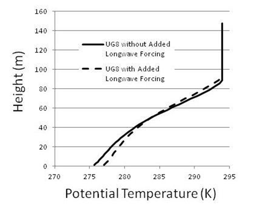
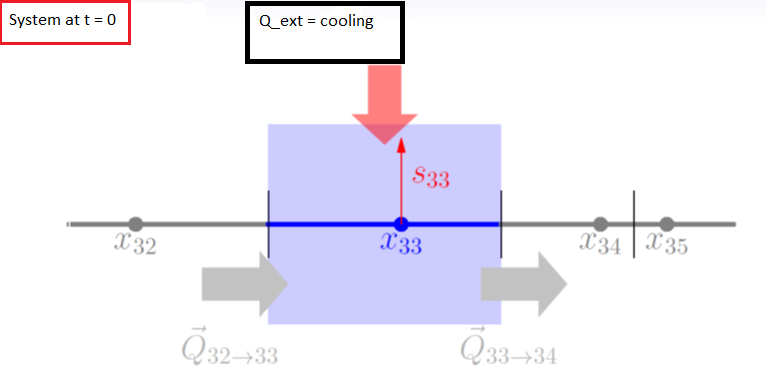
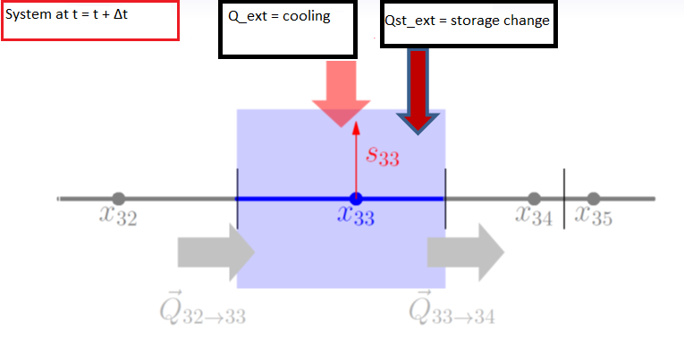

<!-- include the hint.js -->
<script src="hints.js"></script>

# Learning Goals
* Understand why the storage flux is introduced for transient systems.
* Understand how the storage flux is implemented.
* Understand the relation between time steps in transient systems.
* Learn how to use a loop construct for a repetitive task and how to store results in a dataframe.
* Understand the effects of different time step sizes on the solution of the transient model.

# Introduction to transient turbulent transfer in the stably stratified boundary layer
We will continue with the situation of the atmospheric boundary layer (ABL) above a cooling earth surface after sunset, when downward transport of heat occurs. We will elaborate on the atmospheric model created in assignment 1.
The figure below shows a potential temperature profile with height for specific conditions. We will produce a comparable graph in this assignment, but now transient factors are taken into account.

<div align="center">


Figure 1: Potential temperature with height.
</div>

# 1. The model setup
The state variable and the flow domain of the model will be the same as in assignment 1. The potential temperature is denoted by $\theta$ and its units are in Kelvin (K). The flow domain starts at a height of 0.5 meter above the surface and ends at the depth of the SBL, 100 meter above the surface, which is fixed in this model.

## 1.1. Internal fluxes
Flux of energy in the x-direction (height) is calculated using Fick’s law with a so-called eddy-diffusivity:

$$q=-K_{eddy}*\frac{\delta \theta}{\delta x}$$
Where in the case of non-linear diffusion with the atmospheric boundary layer (ABL) and with a neutrally stratified boundary layer, $K_{eddy}$ is described by:

$$K_{eddy}=ku_{*}z$$

where the Von Kármán constant $k$ equals 0.4, $u_{*} = 0.25$ m/s and denotes the friction velocity at the surface and $z$ is the height above the surface ($x$ in our model).

## 1.2. External fluxes
In assignment 1 we implemented an external flux of type 1. Along the domain of the model a constant sink/source term was added to the system. If we made the external flux at each location dependent on the states at these locations we would have qualified the external flux to be of type 2. In the model that we will be building in this assignment, we make use of external flux type 3 as shown below.

__External flux type 3__: A linearly decreasing radiative divergence which has a constant value of -1.74E-4 K/s from the surface to a height of 0.5 m, above which it linearly decreases to a value of -5.55E-5 K/s at the top of the SBL.
  
## 1.3. Boundary conditions
The potential temperature at the upper boundary will be implemented as a Dirichlet boundary condition. The lower boundary condition will be a Neumann boundary condition. For the potential temperature at the lower boundary an initial value of 291.73 K is adopted, which is decreasing with 0.5 K/h as time evolves. The potential temperature of the upper boundary is set to 295.0 k.

## 1.4. Discretization
* space:  $\Delta x = 2m$,    i.e. the nodal distance.
* time:   $\Delta t = 1s$,    i.e. the time resolution the model will be solved for.

## 1.5. State variables
<div class="question">
1.Enter the correct units in the table below
</div>

<div class="student_answer">

| System variable | Unit          | 
| ----------------|---------------| 
| State ($\theta$)| ...           |
| Internal flux   | ...           |
| External flux   | ...           |
| Space (scale)   | ...           |
| Time  (scale)   | ...           |
</div>


<div class="answer">

| System variable | Unit (answer) | 
| ----------------|---------------| 
| State ($\theta$)| K             |
| Internal flux   | K*m/s         |
| External flux   | K/s           |
| Space (scale)   | m             |
| Time  (scale)   | sec           |
</div>

The model setup as described above resembles largely the setup of assignment 1. However, in contrast to assignment 1, the lower boundary condition is not constant in time, but progressively decreases according to a prescribed cooling rate.
 
# 2. Analyzing the situation before the surface starts to cool
Before we can start studying the transient behaviour of the model, we have to create a stationary model first. The solution of this stationary model describes the situation right before the surface starts to cool. The states of this stationary model will be used as input for our transient model.

<div class="question">
2.Set up the mathematical part of the model of the initial situation, i.e. the situation before the surface starts to cool. For the lower boundary condition the initial fixed state value (as in assignment 1) should be used. Call this model oneDinitmodel. Do not forget to clear your environment and to import the FVFE1D package.
</div>

<button type="button" onclick="showHint(212)">Show Hint</button>
<p id="Q212"> </p>

<div class="student_answer">
Fill in your answer here...
</div>

<div class="answer">
```{r}
# Clear environment
rm(list=ls()) 
# load package
library(FVFE1D)

# Defining the flow domain of the model.
# Fill out min and max to determine the length of the model domain. For example, domain = c(0,100).
# The result is a simple array with two values: domain[1]=0 and domain[2]=100. Here, c() stands for the function.
# concatenate. For more info type "?c()" in your console. 

domain = c(0.5,100.)

# The system flux function: 
# With the internal flux function one determines the flow type.
# This is where one implements the darcy, Fr=0, richards equation or an other flow equation.
# All these system flux functions require the location (x) at hand, a state at (x) and a gradient of that state at (x).
# 
# The system flux function has three arguments: 
# a) x          : place x within the domain
# b) state      : the state s at this point
# c) gradstate  : the gradient of the state at x
#
# The return() argument (between brackets) holds the actual flux equation, so what's on 
# the right hand side of the system flux equation. Here Fick's law is implemented as the sytem flux function.

k = 0.4
ust = 0.25
tempflux = function(x,state,gradstate)  
{
  return(-k*ust*x*gradstate)
}

# Now you are going to construct the flow model.
# Two arguments are required:
# 1) domain
# 2) systemfluxfunction
# 3) name (this is optional, but it can be usefull when you want to compare several different models)

oneDinitmodel = newFLOW1D(domain=domain, systemfluxfunction = tempflux, name = "oneDinitmodel") 

# Besides setting up the model also boundary conditions need to be set.
# Three different types of Boundary Conditions (BC) can be applied:
# 
# Dirichlet -> a function to set a prescribed state:
# usage:  set.BC.fixedstate(model, where, value)
# 
# Neumann -> a function to set a prescribed prescribed flux:
# usage:  set.BC.fixedflux(model, where, value)
# 
# Cauchy/Robin/Fourier -> a function that defines a state dependent flux:
# usage:  set.BC.stateflux(model, where, value)
#
# These functions have three arguments:
# model = the current model
# where = a string that determines the position of the BC: 'l' or 'left, 'r' or 'right' 
# value = the value (or function) assigned to this BC
#
# When a boundary condition is not specified explicitly, a no-flow boundary is assumed.

set.BC.fixedstate(oneDinitmodel, 'left', 291.7) 
set.BC.fixedstate(oneDinitmodel, 'right', 295.)

# Not only internal fluxes, but certainly also external fluxes can be implemented into the model.
# Two generic flavours are available:
# 
# 1) add.pointflux(model, at, value, name)
# model : the one dimensional model at hand
# at    : the location in the domain where to add the point flux
# value : magnitude of the flux, this can eihter be a number or a state dependent function
# name  : name (optional; name for the flux)
# 
# 2) add.spatialflux(model, rate, name)
# model : the one dimensional model at hand
# rate  : a function of space (x) and state (s) returning the intensity of the spatial flux at that point, 
#         or a constant giving the flux at all spatial points independent of the states at these points, for example 
#         precipitation
# name  : name (optional; name for the point flux)

RD.func = approxfun(c(0,0.5,100),c(-1.74E-4,-1.74E-4,-5.55E-5))
extfunc = function(x,state)
{return(RD.func(x))}

# Add the external flux the model
add.spatialflux(oneDinitmodel,extfunc,'RDcons')
```
</div>

<div class="question">
3.Implement the numerical part and solve the model for the initial situation to obtain values of the state variables for all volumes (nodes). Make plots of the state variable and the internal fluxes as a function of height. Switch the axes such that the heights are presented on the vertical axis.
</div>

<button type="button" onclick="showHint(213)">Show Hint</button>
<p id="Q213"> </p>

<div class="student_answer">
Fill in your answer here...
</div>

<div class="answer">
```{r}
# Implementing the numerical part:
# Define the nodes at which the states should be solved.
nodes = seq(domain[1], domain[2], by=2)

# Discretise the model and choose the numerical method which will be used for the solution.
set.discretisation(oneDinitmodel, nodes, 'FV')

# Solving the initial model:
# Since the initial model is not linear, several iterations (steps) will be needed to reduce the misfit of the model.
# This function returns a list of two entries: RMSM which contains the root mean square of the misfit and MAM which 
# contains the max absolute misfit.
solve.steps(oneDinitmodel)

# Plotting the states and the internal fluxes as a function of height.
plot(dataframe.states(oneDinitmodel)$state, dataframe.states(oneDinitmodel)$x, main="States")
plot(dataframe.internalfluxes(oneDinitmodel)$intflux, dataframe.internalfluxes(oneDinitmodel)$x, main="Internal fluxes")
```
</div>

<div class="question">
4.Choose the volume associated with nodes 30 and 31 and check whether the net internal flux over the boundaries of this control volume indeed equals the integrated external flux over this region. What is your conclusion and what do you think is the relation with the returned misfit by the solve.steps() function?
</div>

<button type="button" onclick="showHint(214)">Show Hint</button>
<p id="Q214"> </p>

<div class="student_answer">
Fill in your answers here...
</div>

<div class="answer">
```{r}
# This returns a table from which one can read that the water balance for this control volume is indeed closed, althought the net change is not exactly zero. The larger the misfit one permits in the solve.steps() function, the larger this net change in the water balance can become. Note that this is not what you want!
dataframe.balance(oneDinitmodel, region = c(30, 31))
```
</div>

# 3. Incorporating transient behaviour with the model
For stationary systems the state variables are fully constrained by the BCs, the formulation of the internal and the external fluxes. By checking the balance of a particular volume in question 3, we noticed that at a certain location there is a balance between the net internal flux between adjacent volumes and the external fluxes provided to the volumes. The external fluxes summed over the entire flow domain equal the net flux over the boundaries of the system.

However, for many systems the time that the system needs to adapt to the BCs or the external fluxes is larger than the rate of change in the BCs and/or the external fluxes. In these cases, the system “resists the pulling” of the system towards a new equilibrium where the external fluxes are in balance with the net internal fluxes. In these transient systems, there appears to be an additional flux that hampers the external fluxes for a particular volume to be in balance with the net internal flux for that particular volume. This additional flux is called the storage flux. One can also view the storage flux as a flux from the past, i.e. the previous time step of the transient model solution. As long as the storage change of the model does not equal zero, equilibruim is not yet reached and the model still 'resist the pulling' of the external fluxes in some degree.

<div align="center">



Figure 2: Storage flux for a stationary (top) and a transient (bottom) situation.
</div>

A picture of the situation for transient systems is given above.
In the upper figure we see the situation at time t=0, the initial time before the surface starts to cool. In this situation there is a balance between the external fluxes and the internal fluxes for a particular and its adjacent volumes.

In the lower picture the situation is shown when the system has progressed one time step after the surface started cooling. In this case, there is again a balance between the external fluxes that act on the system at t=∆t and the internal fluxes within the system at t=∆t. However, in contrast to the initial stationary situation, there is an additional flux that results from the change of storage within the system. If the system can not cope with the rate of change of the boundary conditions, the storage flux will be there so that the water balance of a particular cell will hold.

The storage flux is directly related to the increase or decrease of the amount of the state variable stored within the system. It is thus given as:

$$Q_{st} = -\int_{Vol}S\frac{\delta \theta}{\delta t}dx$$

where $Q_{st}$ is the storage flux, and $S$ is the storage coefficient that is related to the change rate of the state variable to a change rate in storage (usually 1 in the atmosphere). The storage flux is thus directly linked to the rate of change of the state variable at a certain location.

<div class="question">
5.What is the dimension of this flux and why is the storage flux negatively related to the rate of change in the state variable?
</div>

<div class="student_answer">
Fill in your answer here...
</div>

<div class="answer">
The storage flux should have the same dimentions as the internal flux. Thus the dimentions of the storage flux are $Km/s$. The storage flux is negatively related to the rate of change in the state variable because the flow direction should always be opposite to the gradient. When more heat or water is added to a volume than is removed, the remaining flux is used to increase the storage (increased temperature/ water content). The storage then acts as a negative flux, removing heat or water at the coming timesteps.
</div>

In the previous question we have identified the storage flux in a way that is similar to the external fluxes. Such as the external fluxes, it is given as the integral of a function that defines the storage at one point in space. Therefore, the storage flux in a transient system can be implemented in the same way as the external fluxes are implemented. 

<div class="question">
6.Make a new model which is an exact copy of your oneDinitmodel. Call this model oneDstationmodel. Use this model to create another copy, call this copy oneDtransientmodel.
</div>

<button type="button" onclick="showHint(216)">Show Hint</button>
<p id="Q216"> </p>

<div class="student_answer">
Fill in your answer here...
</div>

<div class="answer">
```{r}
# Create a copy of your initial one dimentional stationary model. Creating this copy prevents that you make any changes to your original model.
oneDstationmodel = copy.model(oneDinitmodel)
set.name(oneDstationmodel, newname = "oneDstationmodel")
# This model will used for a transient analysis in the next questions.
oneDtransientmodel = copy.model(oneDstationmodel)
set.name(oneDtransientmodel, newname = "oneDtransientmodel")
```
</div>

<div class="question">
7.Check the documentation and try to find the function which should be used to add the storageflux function to your transient model.
</div>

<div class="student_answer">
Fill in your answer here...
</div>

<div class="answer">
```{r, eval=FALSE}
# Add the storage flux to your transient model with the function below. As long as you do not evaluate this code block in the knitting procedure, it is allowed to refer to arguments that are not defined yet, i.e. the storageflux argument.
add.spatialflux(oneDtransientmodel, storageflux, name="storage")
```
</div>

Now you know how the storage flux can be added, the function itself should be defined. We need to provide a function that calculates the storage flux for a specific location. The function for the storage flux should be a function that takes as arguments the location and the value of the state variable at this location. The return value is the storage flux.

To develop such a function, we first need to discretize the formulation of the storage flux. Discretization of this function is done using the Euler forward method and looks as follows: 

$$Q_{st}=-\int_{Vol}S\frac{\theta_{t}-\theta_{t-\Delta t}}{\Delta t}dx$$

where $θ_{st}$ it the value of the state at the current time step (which we want to calculate), $θ_{t-∆t}$ is the potential temperature at the previous time step (which is generally known), and $\Delta t$ is the time step.

Now we have discretized the storage flux, translation to a R-function looks as follows:
```{r, eval=FALSE}
S = 1
storageflux = function(x, state)
{
  storageflux = -S * (state - oldstate(x)) / dt
  return(storageflux)
}
```

<div class="question">
8.Add the storageflux function to your transient model. 
</div>

<button type="button" onclick="showHint(218)">Show Hint</button>
<p id="Q218"> </p>

<div class="student_answer">
Fill in your answer here...
</div>

<div class="answer">
```{r}
# The storage flux is dependent on position and state. oldstate(x) is not defined yet, we can already define the storage flux function but we are not able to call it without defining the oldstate function. The oldstate function returns the state of the system at specific location, x, at the previous timestep. This information is needed in order to calculate the gradient of the state in time. dt has to be determined too.
S = 1
storageflux = function(x, state)
{
   storageflux = -S * (state - oldstate(x)) / dt
   return(storageflux)
}

# Add the storage flux to your transient model.
add.spatialflux(oneDtransientmodel, storageflux, name="storage")
```
</div>

In order for the storage flux function to work we still do need to define:

•	a value for dt (the code equivalent of $\Delta t$): use 300 seconds as a starting value 

•	a function that is called oldstate and that returns the value of the state at the previous time step at location x

# 4. Integrating the transient model
In the previous exercises we developed a transient model that incorporates that in transient systems there is an additional flux caused by the storage change within the system. This model can now be used to analyse the effect of the progressive cooling of the surface in time. In our model, the surface starts to cool at $t=0$. 

<div class="question">
9.Include a piece of code that tells the script that the initial time is zero (use the variable name “time” for time in your code).
</div>

<div class="student_answer">
Fill in your answer here...
</div>

<div class="answer">
```{r}
# Starting time is set to zero.
time = 0
```
</div>

At the initial time, there is, for each volume, a balance between the external fluxes and the net internal flux. The states of the transient model at t=0 are given by the profile of the states as calculated in the stationary model, copied as oneDstationmodel. The state variable profile of this model is used as the initial profile for our transient system.

Now, we increase the time by a time step $\Delta t$.

<div class="question">
10.Include a piece of code that tells the script that the time should increase with $\Delta t$.
</div>

<div class="student_answer">
Fill in your answer here...
</div>

<div class="answer">
```{r}
# Define the size of the time step. 
dt = 300
# increment the time.
time = time + dt
```
</div>

As time progresses, the temperature at the lower boundary changes as a result of cooling of the surface. The cooling rate is 0.5 K/h. The surface temperature change as a function of time is described by:

$$T_{1}(t=\Delta t)=T_{1,init}-\frac{\Delta t}{3600}0.5$$
where $T_{1}(t=\Delta t)$ is the temperature of the lower boundary at $t=\Delta t$ which is the total elapsed time, and $T_{1,init}$ is the temperature of the lower boundary at $t=0$.

<div class="question">
11.Define the lower boundary condition as described by the cooling of the surface equation and add this transient boundary condition to your transient model.
</div>

<div class="student_answer">
Fill in your answer here...
</div>

<div class="answer">
```{r}
# Due to the simplicity of the transient boundary condition, the function can be entered as an argument directly. Although the function is called fixed state, the left boundary condition will be resetted at every time step. This way the state of the left boundary condition is fixed, but only during one time step.
set.BC.fixedstate(oneDtransientmodel, 'left', 291.7-time*0.5/3600.)
```
</div>

In the previous questions we have defined an object of the class FLOW1D called oneDtransientmodel. We have defined the following properties in this object:

1.  A definition of the domain.
2.  A function that describes internal transport within the system as a function of location, state and the gradient of        the state.
3.  The external fluxes for each volume as a function of location and state of the system.  
4.  A formulation of the flux due to the change in storage as a function of location and state of the system.

To complete the mathematical formulation of the transient model, we still need to specify the oldstate(x) function that is defined within the storage flux function. This oldstate(x) function returns the state of the system at the previous time step at a specific location. At $t=\Delta t$, so after the first step in time, the profile of the potential temperature is given by the profile of the states as generated by the oneDstationmodel. The function oldstate(x) can thus be calculated as:

```{r eval=FALSE}
# Store the states of the stationary model in a variable. This variable now refers to a dataframe with two columns  containing the positions and its corresponding states.
startprof = dataframe.states(oneDstationmodel)

# oldstate is now defined as a function that returns states of the stationary model as function of position. 
# Type "?approxfun" in your console to learn more about the interpolation function.
oldstate = approxfun(startprof$x, startprof$state, rule=2)
```

<div class="question">
12.Add this piece of code and verify that it indeed gives the value of the state at the previous time step, $t=0$ in this case, for the locations $x=24.5$ and $x=50.5$.
</div>

<div class="student_answer">
Fill in your answer here...
</div>

<div class="answer">
```{r}
startprof = dataframe.states(oneDstationmodel)
oldstate = approxfun(startprof$x, startprof$state, rule=2)

# Select the row of the dataframe where the position equals x. Thereafter find its corresponding state value by calling the column name. This returns one value since each position has a unique state.
state245 = startprof[startprof$x==24.5, ]$state
state505 = startprof[startprof$x==50.5, ]$state

# Obtain the states using our self-defined function.
state_fun245 = oldstate(24.5)
state_fun505 = oldstate(50.5)

# Checking if both values are equal
if (state245 == state_fun245 & state505 == state_fun505)
{
  print("Both values are equal!")
}
```
</div>

Now that the mathematical formulation of the model is completed, the numercal part can be implemented and the model can eventually be solved. For the model to be numerically solveable, the following actions need to be performed:

* Creation of the nodes at which the system is solved for its states.
* Set the discretization of the sytem by defining the method that is used to solve the system.
* Calling the solve function on the transient model. Solving of the model requires the finding of the values of the state variables in all volumes so that the balances of all volumes are zero (the sum of the external fluxes and the storage flux equals the net internal flux of a specific volume). As in the stationary model, this requires the solving of (N-2) state variable balances (for all volumes) to get (N-2) values of the state variables, where N is the number of volumes that we have specified. As before, we simply use a function called solve.steps which takes the instance of the class FLOW1D as an argument and solves the values of the state variables at the specified volumes that lead to a minimal misfit between net internal flux and the external fluxes.

The snippet below shows the missing elements of the numerical model.
```{r, eval=FALSE}
nodes = seq(...)
set.discretisation(...)
control = solve.steps(...)
```

<div class="question">
13.Add a piece of code that defines the numerical formulation of your model and solve it to obtain the profile of the state variables at $t=\Delta t$. The nodal distance should be two meters.
</div>

<div class="student_answer">
Fill in your answer here...
</div>

<div class="answer">
```{r}
# Define the nodes at which the states will be solved.
nodes = seq(domain[1], domain[2], by=2)

# Discretize the numerical model by adding the nodal grid and defining the method that will be used to solve for the states.
set.discretisation(oneDtransientmodel, nodes, "FV")

# The transient model is solved by this function. The new states are stored in the oneDtransientmodel object. The misfit between net internal flux and the external fluxes is returned by this function.
solve_dt1 = solve.steps(oneDtransientmodel)
```
</div>

<div class="question">
14.Plot the profiles of the state variables and the internal fluxes for time $t=\Delta t$ and compare these to the profiles at $t=0$.
</div>

<div class="student_answer">
Fill in your answer here...
</div>

<div class="answer">
```{r}
# Plot states at the different times
plot(dataframe.states(oneDinitmodel)$state, dataframe.states(oneDinitmodel)$x, col = "red",
     main="initial states (red) & transient states (blue)")
points(dataframe.states(oneDtransientmodel)$state, dataframe.states(oneDtransientmodel)$x, col="blue")

# plot internal fluxes at different times
plot(dataframe.internalfluxes(oneDinitmodel)$intflux, dataframe.internalfluxes(oneDinitmodel)$x, col="red",
     xlim = c(min(dataframe.internalfluxes(oneDinitmodel)$intflux, dataframe.internalfluxes(oneDtransientmodel)$intflux),
     max(dataframe.internalfluxes(oneDinitmodel)$intflux, dataframe.internalfluxes(oneDtransientmodel)$intflux)), 
     main="initial intflux (red) & transient intflux (blue)")
points(dataframe.internalfluxes(oneDtransientmodel)$intflux, dataframe.internalfluxes(oneDtransientmodel)$x, col="blue")

# You can see the change of the internal flux at the lower boundary as a consequence of the transient boundary condition. The states have changed according to the transient lower boundary, the surface is a little bit cooler now.
```
</div>

<div class="question">
15.Use dataframe.balance(oneDtransientmodel) and show that the sum of the external fluxes and the storage flux are in balance with the net internal fluxes.
</div>

<div class="student_answer">
Fill in your answer here...
</div>

<div class="answer">
```{r}
wbal_dt1 = dataframe.balance(oneDtransientmodel)

# Sum of the internal fluxes.
net_internal = wbal_dt1["net"][1,]
print(net_internal)
# sum of the net external fluxes and net storage flux.
ext_storage = sum(wbal_dt1["net"][c(2,3,4),])
print(ext_storage)

# The net_internal flux does not exactly equal the ext_storage flux. This can be expected beforehand since the misfit returned by the solve.steps function does not equal zero. Although there is a misfit in the water balance, the order of magnitude of the misfit is acceptable for the spatial scale of our model.
```
</div>

Now we want to progress the model to calculate the profile of the state variables at $t=2\Delta t$. Therefore, we need to update the lower boundary condition according to:

$$T_{1}(t=2\Delta t)=T_{1,init}-\frac{2\Delta t}{3600}0.5$$

Also, we need to update the function oldstate(x) in the function that provides the storage flux as function of location (variable x) and the state. For time $t=2\Delta t$ the oldstate is given by the values of the states as calculated by the transient model one time step earlier, in this case $\Delta t$. How the oldstate(x) function is redefined is shown below:

```{r eval=FALSE}
# States from the transient model, one time step earlier (1*dt).
prevprof = dataframe.states(oneDtransientmodel)

# Overwrite the oldstate function with the new states.
oldstate = approxfun(prevprof$x, prevprof$state, rule=2)
```

<div class="question">
16.Add a piece of code that increments the time by one time step, $\Delta t$.
</div>

<div class="student_answer">
Fill in your answer here...
</div>

<div class="answer">
```{r}
# Increment the time with one time step.
time = time + dt
```
</div>

<div class="question">
17.Update the lower boundary condition for the new situation at $t=\Delta t$.
</div>

<div class="student_answer">
Fill in your answer here...
</div>

<div class="answer">
```{r}
# The new boundary condition is assigned and the old value is overwritten. The dot (.) after 3600 is interpreted by the computer as a decimal point.
set.BC.fixedstate(oneDtransientmodel, "left", 291.7-time*0.5/3600.)
```
</div>

<div class="question">
18.Update the function oldstate so that is takes the states from the correct time step.
</div>

<div class="student_answer">
Fill in your answer here...
</div>

<div class="answer">
```{r}
# States from the transient model, one time step earlier (1*dt).
prevprof = dataframe.states(oneDtransientmodel)

# Overwrite the oldstate function with the new states.
oldstate = approxfun(prevprof$x, prevprof$state, rule=2)
```
</div>

As we progress in time, the number and the positioning of the volumes does not change, because the applied numerical method does not change. So there is no need to reinvoke the set.discretisation() function and we can directly solve the transient model for the new time step $t=2\Delta t$.

<div class="question">
19.Solve the transient model to obtain the profile of the state variable at the new time step, $t=2\Delta t$, and plot the states and the fluxes of the new situation.
</div>

<div class="student_answer">
Fill in your answer here...
</div>

<div class="answer">
```{r}
# Solve for the new time, 2*dt
solve_dt2 = solve.steps(oneDtransientmodel)

# Plot the new situation, both the states and the internal fluxes
plot(dataframe.states(oneDtransientmodel)$state, dataframe.states(oneDtransientmodel)$x, main="states")
plot(dataframe.internalfluxes(oneDtransientmodel)$intflux, dataframe.internalfluxes(oneDtransientmodel)$x, main="Internal fluxes")
```
</div>

Continuation of the time integration for $t=3\Delta t$ can be performed in the same manner. However, this would be very inefficient in terms of line count and time. Since we are performing a repetitive task we should implement the time integration using a loop construct. The implementation of this construct is shown in pseudocode below:

```{r, eval=FALSE}
@ include the code that solves the model for time t=2∆t
while (time < endtime)
{
@update time
@update the lower boundary condition
@solve the model
@do some .processing here (plot(model) etc.)
@update oldstate(x)
}
```

<div class="question">
20.Finish the code given above by replacing the lines starting with a @ with proper R-code. In the line where some processing can be done, enter at least an instruction that plots the transient model and add a waiting code line, sys.sleep(0.1), to control the updating of the window. The end time of the model should be 4 hours after the start of the surface cooling. Add echo=False and fig.show='animate' between the curly brackets of your R-code block to prevent the plots from taking inconveniently much space. If the animation does not display in the markdown, open the html in Google Chrome.
</div>

<button type="button" onclick="showHint(2120)">Show Hint</button>
<p id="Q2120"> </p>

<div class="student_answer">
Fill in your answer here...
</div>

<div class="answer">
```{r fig.show='animate'}
# Set the time to zero
time = 0

# The calculation of the first step in time.
startprof = dataframe.states(oneDstationmodel)
oldstate = approxfun(startprof$x, startprof$state, rule=2)
time = time + dt
set.BC.fixedstate(oneDtransientmodel,'left',291.7-time*0.5/3600.)
solve.steps(oneDtransientmodel)

# The calculation of the second step in time.
startprof = dataframe.states(oneDtransientmodel)
oldstate = approxfun(startprof$x, startprof$state, rule=2)
time = time + dt
set.BC.fixedstate(oneDtransientmodel,'left',291.7-time*0.5/3600.)
solve.steps(oneDtransientmodel)

# Prepare the oldstate function for the third time step which is calculated in the loop construct.
startprof = dataframe.states(oneDtransientmodel)
oldstate = approxfun(startprof$x, startprof$state, rule=2)

# End time should be at least 4 hours.
end.time = 4*3600.

# Enter the loop construct until the equation between brackets returns FALSE.
while (time < end.time)
{
  time  = time + dt
  
  # calculate the new BC at the surface (cooling of surface).
  set.BC.fixedstate(oneDtransientmodel,'left',291.7-time*0.5/3600.)
  
  # calculate the states for the new time step.
  solve.steps(oneDtransientmodel)
  
  # Wait a little for the window to update.
  Sys.sleep(0.1)
  
  # plot the potential temperature in the x-axis and the height on the y-axis.
  plot(dataframe.states(oneDtransientmodel)$state,dataframe.states(oneDtransientmodel)$x,xlab='pot. temp [K]',ylab='height [m]',xlim=c(289,295.5), main=as.character(time))
  
  # Save the new states and define the oldstate function for the next time step.
  modelresults = dataframe.states(oneDtransientmodel)
  oldstate = approxfun(modelresults$x,modelresults$state,rule=2)
}
```
</div>

<div class="question">
21.Run the code. If all went well, and the endtime was chosed properly, you should see a movie of the state transitions between the initial situation and the situation after 4 hours.
</div>

When you want to use the intermediate results of the time integration for further analysis, the following instructions should be taken into account:

* Create a data structure in which the intermediate time steps can be stored
* Store the intermediate time steps in the data structure
* Plot the saved intermediate states

The code snippet below shows how this can be done.
```{r, eval=FALSE}
result.store = data.frame()
rbind(result.store, data.frame("t"=time, "lvalue"=dataframe.states(oneDtransientmodel)$state[1], "outflow"=dataframe.boundaries(oneDtransientmodel)[1]), dataframe.states(oneDtransientmodel)$state[26])
plot(result.store$t, result.store$outflow, type="o", col="red")
```

<div class="question">
22.Use these ideas to make one plot showing the external flux at the lower boundary. Also, make one plot that both presents the state value at a location of 50 m above the surface and the state value at the lower boundary as a function of time.
</div>

<div class="student_answer">
Fill in your answer here...
</div>

<div class="answer">
```{r}
# Set the time to zero
time = 0
dt = 300
# The calculation of the first step in time.
startprof = dataframe.states(oneDstationmodel)
oldstate = approxfun(startprof$x, startprof$state, rule=2)
time = time + dt
set.BC.fixedstate(oneDtransientmodel,'left',291.7-time*0.5/3600.)
solve.steps(oneDtransientmodel)

# The calculation of the second step in time.
startprof = dataframe.states(oneDtransientmodel)
oldstate = approxfun(startprof$x, startprof$state, rule=2)
time = time + dt
set.BC.fixedstate(oneDtransientmodel,'left',291.7-time*0.5/3600.)
solve.steps(oneDtransientmodel)

# End time should be at least 4 hours.
end.time = 4*3600.

# Initialize the dataframe that will be populated with intermediate results.
Results.store = data.frame()

# continue until condition returns FALSE
while (time < end.time)
{
  time  = time + dt
  
  # calculate the new BC at the surface (cooling of surface)
  set.BC.fixedstate(oneDtransientmodel,'left',291.7-time*0.5/3600.)
  
  # # calculate the states for the new time step.
  solve.steps(oneDtransientmodel)
  
  # Save the new states and define the oldstate function for the next time step.
  modelresults = dataframe.states(oneDtransientmodel)
  oldstate = approxfun(modelresults$x,modelresults$state,rule=2)
  
  # Here, the dataframe is populated with intermediate results
  Results.store = rbind(Results.store,data.frame('t'=time,'lvalue'=dataframe.states(oneDtransientmodel)$state[1],'outflow'=dataframe.boundaries(oneDtransientmodel)[1,4],'midstate'=dataframe.states(oneDtransientmodel)$state[26]))
}
```
```{r}
# Plot the state value at the lower boundary. This follows the formula that describes the cooling rate.
plot(Results.store$t,Results.store$lvalue,xlab='Time [s]',ylab=' pot temp. [K]', ylim=c(288, 295), col="black",
     main="State lower boundary (black) & 50 meters above surface (red)")

# Add points that plot the state value at 50 meters above the surface as a function of time.
points(Results.store$t,Results.store$midstate, col='red')

# Plot the flux of the energy flowing out of the system.
plot(Results.store$t,Results.store$outflow,xlab='Time [s]',ylab=' flux [m/s K]', 
     main="Energy flowing out of system")
```
</div>

<div class="question">
23.Perform a sensitivity analysis to the applied time step by modifying it from 30 seconds to 1 hour using values of 30 seconds, 10 minutes, 30 minutes, 45 minutes and 1 hour. Check the potential temperature at 50 m and the time series of the flux over the boundaries boundary. What is your conclusion?
</div>

<button type="button" onclick="showHint(2123)">Show Hint</button>
<p id="Q2123"> </p>

<div class="student_answer">
Fill in your answer here...
</div>

<div class="answer">
```{r}
# Function returns a dataframe with the intermediate states.
time_sensitivity = function(timestep) 
{
  # Assign timestep to the time increment variable dt.
  dt = timestep
  
  # Set the time to zero
  time = 0
  
  # Provide the states of the stationary model for the first time step.
  startprof = dataframe.states(oneDstationmodel)
  oldstate = approxfun(startprof$x, startprof$state, rule=2)
  
  # End time should be at least 4 hours.
  end.time = 4*3600.
  
  # Initialize the dataframe that will be populated with intermediate results.
  Results.store = data.frame()
  
  # continue until condition returns FALSE
  while (time < end.time)
  {
    time  = time + dt
    
    # calculate the new BC at the surface (cooling of surface)
    
    set.BC.fixedstate(oneDtransientmodel,'left',291.7-time*0.5/3600.)
    
    # # calculate the states for the new time step.
    solve.steps(oneDtransientmodel)
    
    # Save the new states and define the oldstate function for the next time step.
    modelresults = dataframe.states(oneDtransientmodel)
    oldstate = approxfun(modelresults$x,modelresults$state,rule=2)
    
    # Here, the dataframe is populated with intermediate results
    Results.store = rbind(Results.store,data.frame('t'=time,'lvalue'=dataframe.states(oneDtransientmodel)$state[1],'outflow'=dataframe.boundaries(oneDtransientmodel)[1,4],'midstate'=dataframe.states(oneDtransientmodel)$state[26]))
  }
  return (Results.store)
}

  par(mfrow=c(2, 1))
  for (t in c(30, 600, 1800, 2700, 3600))
{
  data = time_sensitivity(t)
  plot(data$t, data$midstate,col='red', xlab='Time [s]',ylab=' pot temp. [K]', main = as.character(t),xlim=c(0, 3600*4), ylim=c(294.25, 294.33))
  plot(data$t, data$outflow, col="blue", xlab='Time [s]',ylab=' flux [m/s K]', main = as.character(t),xlim=c(0,4*3600), ylim=c(-0.10,-0.04))
}

# The time step does not have an effect on the resulting states nor on the resulting boundary flux. The increase of the time step lowers the time resolution at which the transient model is solved. If one takes a time step that is too small, computational times can become very large, but small time steps can be very important for the simulation of highly dynamical systems!
```
</div>