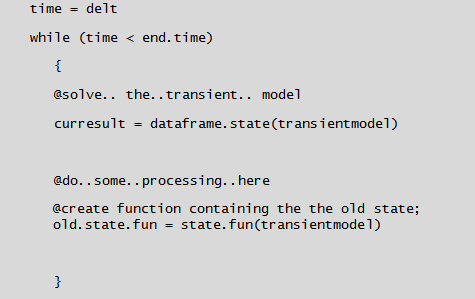

<!-- include the hint.js -->
<script src="hints.js"></script>

# Learning Goals
* Understand how the model solution changes if external sources/sinks are included.
* Learn how you can store intermediate states during a model run.
* Understand when a transient model has reached a stationary state.
* How and why the model changes if the internal flux function changes from flow type 1 to flow type 2.

# Introduction transient groundwater flow model  
In this assignment, a transient groundwater system will be studied. As a first example, the development of an extraction cone is examined. A schematic of this process is shown below.
The description of this system is largely equal to that of assignment 1. So we take (again):   <!-- still true? -->

*    L = 200 $m$ 
*    Dirichlet boundary conditions left and right river = 5.0 $m$
*    kD = 45 $m^2/d$ for type 1 flow
*    k = 10 $m/d$ for type 2 flow
*    The nodal distance $\Delta$ x = 10 m
*    Recharge R = 0.001 $m/d$
*    Extraction rate of the well is 0.25 $m^2/d$ at 90 $m$ from the left


Figure 1: Transient flow including an extraction well.

# 1. New concepts in modeling  
Since this model will simulate states (heads) for transient conditions (i.e. in time), the following dynamical aspects need to be implemented: 

1.    The variable; Storage Coefficient $S$ 
2.    A new spatial flux; 'from the past ' or simply the storage flux as explained in the previous part of this assignment: $$Q(t)=-S\frac {H(x)_{new}- H(x)_{old}}{\Delta t}$$
3.    A point flux; the extraction well

<div class="question">
1.What are the units of the above mentioned aspects?
</div>

<div class="student_answer">
Fill in your answer here...
</div>

<div class="answer">
The domain of the model has only one spatial dimension, (e.g. the x-direction). Therefore, the spatial flux should have the same dimensions. Here the flux density is defined as length per time, $m/d$. From this follows that the storage coefficient should be dimensionless. The dimensions in which the well is entered in the model is $m^2/d$, but internally the value is divided by the nodal distance at the specific location. Per time step a certain water height, $m/d$, is substracted in this situation.

1.    Phreatic storage coefficient: $m^3/m^3 \rightarrow (-)$ 
2.    Spatial flux $m/d$
3.    Extraction Well $m^2/d$
</div>

# 2. Setting up the stationary part of the model  
In the following exercises a transient model, based on the stationary model created in assignment 1, will be developed. Before we start this exercise, the workspace should be cleaned and the FVFE1D package has to be loaded.  

```{r}
# cleaning
rm(list=ls())
# loading
library(FVFE1D)
```

<div class="question">
2.Setup and run the stationary model containing the data above without the extraction well. Make use of type 1 flow.  
You may use a code chunk from assignment 1. Call this model 'stat_no_well' and solve it using the finite volumes method. Plot both the states and the fluxes of the model in an individual graph. Check the plot documentation in the FVFE1D package for more information.
</div>

<button type="button" onclick="showHint(222)">Show Hint</button>
<p id="Q222"> </p>

<div class="student_answer">
Fill in your answer here...
</div>

<div class="answer">
```{r}
# system properties
domain = c(0, 200)
kD = 45
k = 10
left.bound = 5
right.bound = 5

# Mathematical part; functions
flux.fun = function(x, s, grads) {return (-kD*grads)}
stat_no_well = newFLOW1D(domain=domain, systemfluxfunction=flux.fun, name="stat_no_well")
set.BC.fixedstate(stat_no_well, "left", left.bound)
set.BC.fixedstate(stat_no_well, "right", right.bound)
add.spatialflux(stat_no_well, 0.001, "recharge")

# Numerical part
nodes = seq(0, 200, 10)
set.discretisation(stat_no_well, nodes, "FV")
result = solve.steps(stat_no_well)
plot(stat_no_well, stateplot=TRUE, fluxplot=TRUE)
```
</div>

<div class="question">
3.Now, create, solve and plot an identical stationary model with the extraction well at 90 m from the west. You may use copy.model() from the FVFE1D package to prevent repetitive code blocks. Call this copied model 'stat_well' and assign a new name to it using set.name().
</div>

<div class="student_answer">
Fill in your answer here...
</div>

<div class="answer">
```{r}
# Copy and rename
stat_well = copy.model(stat_no_well)
set.name(model=stat_well, newname="Stationary model with well")

# Add the extration well at 90 meters from the western boundary
add.pointflux(stat_well, at=90, value=-0.25, "extraction well")

# Solve and plot
control = solve.steps(stat_well)
plot(stat_well, stateplot=TRUE, fluxplot=TRUE)
```
</div>

<div class="question">
4.Examine the origin of the water extracted by the well. In other words, where does this extracted water come from? Give your answers as a fraction of the total amount of extracted water.
</div> 

<button type="button" onclick="showHint(224)">Show Hint</button>
<p id="Q224"> </p>

<div class="student_answer">
Fill in your answer here...
</div>

<div class="answer">
```{r}
# This is the total water balance from which the origin of the water can be read. 0.2 meter of water originates from recharge and 0.05 meter of water flows over the boundaries into the model.
wbal = dataframe.balance(stat_well)
print(wbal)

# More water flows over the left boundary than over the right boundary.
bounds = dataframe.boundaries(stat_well)
print(bounds)

# The recharge distribution is homogeneous. Each cell, except both volumes at the boundary of the domain because these are half the size of the other volumes, captures a equal amount of water.
recharge = dataframe.externalfluxes(stat_well)
print(recharge)

# Since water is entering at the boundaries, the total amount of recharge is going into the well plus what is entering from the boundaries. Calculation of the origin of water in the well can be performed as follows:
print(paste('Fraction recharge of total extraction :',wbal[2,2]/wbal[3,3]))
print(paste('Fraction of left river :',bounds[1,4]/wbal[3,3]))
print(paste('Fraction of right river :',bounds[2,4]/wbal[3,3]))
```
</div>

<div class="question">
5.Plot the head distributions of stat_no_well and stat_well in one graph by simply using 'dataframe.states()'.
</div>

<button type="button" onclick="showHint(225)">Show Hint</button>
<p id="Q225"> </p>

<div class="student_answer">
Fill in your answer here...
</div>

<div class="answer">
```{r}
# One plot comparing stationary stat_no_well and the stationary stat_well model.  
plot(dataframe.states(stat_no_well), type="o", col="red", ylim=c(4.8,5.2), main="Influence of the extraction well")
lines(dataframe.states(stat_well), type="o", col="blue")
legend("topleft", legend=c("stat_no_well (red)", "stat_well (blue)"))
grid()
```
</div>

# 3. Setting up the transient model  
One of the key aspects of creating a transient model is to define the storage flux or the ”external flux from the past”. 
The function **oldstate.fun(x)** contains the heads of the previous model and is required to calculate the **storage.flux**. In the first part of this assignment the **oldstate.fun(x)** was calculated with a linear approximation between the nodes using the **approxfun()**. A property of the finite volume method is that the values are not interpolated between the nodes. Therefore, it would be more correct to use **state.fun(modelobject)** to retreive the states of a different model run. Check the docs for its description!

<div class="question">
6.Define the storage flux and its dependencies. Use 0.15 $(-)$ and 0.5 $d$ for the storage coefficient $S$ and time step $\Delta t$, respectively. Also, use the states from stat_no_well.
</div>

<div class="student_answer">
Fill in your answer here...
</div>

<div class="answer">
```{r}
# Global constants
S = 0.15
dt = 0.5

# Storage flux function
storage.flux = function(x, state)
{
  storageflux = -S * (state - oldstate.fun(x)) / dt
  return(storageflux)
}

# New oldstate function
oldstate.fun = state.fun(stat_no_well)
```
</div>

To have an idea how this oldstate.fun works, simply type at the console 'oldstate.fun(20)'. This will result in the head (state) at position $x=20 m$. Play a bit around with this function and check whether it is really different from the linearly interpolated oldstate function used before.

<div class="question">
7.To create a transient model the following has to be implemented. 

1.    Make a copy of stat_no_well and call it transientmodel
2.    Give this model a new name (this is not required, but it is recommended)
3.    Add the extraction well to this model 
4.    Add the storage flux to the model 
</div>

<div class="student_answer">
Fill in your answer here...
</div>

<div class="answer">
```{r}
# Copy and set new name.
transientmodel = copy.model(stat_no_well)
set.name(transientmodel, "Transient Model")

# Add external fluxes. The storage change can be seen as a external flux coming from the previous time step.
add.pointflux(transientmodel, at=90, value=-0.25, "extraction well")
add.spatialflux(transientmodel, storage.flux, "storage change")
```
</div>

To cycle through the time steps $\Delta t$ of 0.5 $d$ starting at **begin.time** and finalizing at **end.time**, a time loop needs to be implemented. A small chunk of psuedo code that describes how to do this, is given in the following picture: 



Figure 2: time loop construct.
    
<div class="question">
8.Use the pseudocode and convert it to actual R-code. Take the following actions and simulate the model for 30 days.

* Replace the lines starting with a at sign (@) with proper R-code. 
* For the @do..some..processing..here just plot the transient model and add a waiting code-line 'Sys.sleep(0.1)' to control the updating of the window. Also, plot the states of the stationary stat_no_well and stat_well model.
* Set the proper time constraints.
* Note that the starting states of the transient model should be initiated explicitly, otherwise the starting states are set to zero. Initialize the transient model with the resulting states from stat_no_well. By this initialization the spin-up time of the model is minimized.
* add 'animation1,  fig.show='animate', aniopts=c('controls','loop'), interval=0.1' between the curly brackets at the first line of your R-code block to create an animation.

You should see a "movie" of the state transitions during the execution of the transient model. A real movie can be included when one Knits the document. ffmpeg.exe is a program, that should be in the same directory as your markdown file already, which creates this movie within the html document. If the animation does not work, try opening the html in Google Chrome.
</div>

<button type="button" onclick="showHint(228)">Show Hint</button>
<p id="Q228"> </p>

<div class="student_answer">
Fill in your answer here...
</div>

<div class="answer">
```{r animation1,  fig.show='animate', aniopts=c('controls','loop'), interval=0.1}
# Graphical parameter for plots
par(bg = "white") 

# Time contraints
begin.time = 0
end.time = 30

# Initialize the model with states of stat_no_well. Default initialization is zero.
do.initialize(transientmodel, state.fun(stat_no_well))

# Increment time manually and enter the time loop
time = begin.time + dt
while(time < end.time)
{ 
  # Solve
  control=solve.steps(transientmodel)
  curresult = dataframe.states(transientmodel)
  
  # Plotting
  title = paste("time =", formatC(time,digits=3,width=6,format="f"))
  plot(dataframe.states(stat_no_well), type="o", col="red",
       main = title, ylim=c(4.8,5.2))
  lines(dataframe.states(stat_well), type="o", col="blue")
  lines(curresult$x, curresult$state,
       main=paste("time=",time), type="o")
  Sys.sleep(0.1)
  
  # Increment time and make the states of the current time step accessible for the next time step.
  time = time + dt
  oldstate.fun = state.fun(transientmodel)
}
```
</div>

# 4. Transient intermediate results  
During the transient simulation it is very interesting to have a look at some intermediate results, for example the states and fluxes at the different time steps. The following lines of R-code will help you to save these results.  

<div class="question">
9.Adapt your transient model calculations using the tips below and create some plots of the intermediate results. At least make a plot of the flow over both boundaries, state at the extraction well and storage flux change. Examine the plots critically, can you explain the intermediate plotting results?

1. Use **result.store = data.frame()** to have a container for the required data.
2. Use **curresult = dataframe.states(transientmodel)** to store the heads.
3. Use **curboundaries = dataframe.boundaries(transientmodel)** to store the outflow of both rivers.
4. Use **wbal = dataframe.balance(transientmodel)** to obtain the intermediate storage flux.
5. Use **result.store = rbind(result.store, data.frame('t'=time, 'Hatwell'=curresult$state[9], 'Qoutleft'=curboundaries[1,4], Qoutright'=curboundaries[2,4], 'Qstorage'=wbal[2,2]))** to add the intermediate data to your container.
</div>

<div class="student_answer">
Fill in your answer here...
</div>

<div class="answer">
```{r}
# The data container
result.store = data.frame()

# Time constraints
begin.time = 0
end.time = 30

# Initialize the model with states of stat_no_well. Default initialization is zero.
oldstate.fun = state.fun(stat_no_well)
do.initialize(transientmodel, oldstate.fun)

# Increment the time manually before entering the time loop.
time = begin.time + dt
while(time < end.time)
{
  # Solve
  control=solve.steps(transientmodel)
  
  # Store the intermediate states, boundaries and water balance.
  curresult = dataframe.states(transientmodel)
  curboundaries = dataframe.boundaries(transientmodel)
  wbal = dataframe.balance(transientmodel)
  
  # Store the intermediate result in the data container
  result.store=rbind(result.store,
                     data.frame("t"=time,
                                "Hatwell"=curresult$state[9],
                                "Qoutleft"=curboundaries[1,4],
                                "Qoutright="=curboundaries[2,4],
                                "Qstorage="=wbal[2,2]))
  
  # Increment time and make the states of the current time step accessible for the next time step.
  time = time + dt
  oldstate.fun = state.fun(transientmodel)
}
```
```{r}
# Plot the flow over both boundaries as a function of time.
plot(result.store$t,result.store$Qoutleft,
     type="o", col="red", ylab ='Outflow (m2/d)', xlab ='Time (d)',
     main='Outflow to rivers; left (red) and right (blue)')
lines(result.store$t, result.store$Qoutright,
      type="o", col="blue")
grid()
# The flow over the boundaries will eventually change from sink to source. More water is flowing over the left boundary into the system due to the position of the extraction well.

# Plot the heads at the location of the well as a function of time.
plot(result.store$t, result.store$Hatwell, type='o',
     col='red', ylab ='Head (m)', xlab ="Time (d)",
     main='Head at well')
grid()
# The head at the well will adapt to the equilibrium state which corresponds to the current extraction rate of the well. The equilibrium situation is approached asymptotically as long as the misfits of the model are not exactly equal to zero.

# Plot the storage flux as a function of time.
plot(result.store$t, result.store$Qstorage, type="o",
     col='green', ylab='Storage change (m2/d)', xlab='Time (d)',
     main='Storage change')
grid()
# The starting value of this plot is equal to the extraction rate of the well. This is the initial storage change, a certain time period is needed for the model to cope with the rate of the extraction well and reach a new equilibrium situation in which the storage change will be zero. Again, the approach of the storage change towards zero is asymptotically as long as the model misfit is not exactly equal to zero.
```
</div>

<div class="question">
10.Is the simulation time long enough for the model to reach stationary conditions?
</div>

<div class="student_answer">
Fill in your answer here...
</div>

<div class="answer">
In order to answer this question all three the plots that you created above can be used to argue that the model did not reach a steady state. The flow over both boundaries is not constant in time. There is still change in the head at the extraction well and the storage flux is not zero yet. In the model the storage flux is used as the criterium for being stationary. This will approach zero, but it will not become exactly zero. This mismatch is called the misfit of the stationary solution.
</div>

# 5. Using the non-linear (type 2) internal flux
In the previous questions we have used an average transmissivity in the internal flux function which is defined as flow of type 1. Now, this type 1 flow will be replaced with type 2 flow. This means that the transmissivity is based on the saturated thickness at a specific location. The hydraulic conductivity, $10 m/d$, is contant.

<div class="question">
11.Solve the new transient model and use the same approach as in the first transient model. Plot the intermediate result for comparison.

*   Define the system flux function with the new flow type.
*   Create a new model and call it trans2model.
*   Setup the model. i.e. mathematical and numerical part equal to 'transientmodel'.
*   Solve your trans2model with a loop construct, use the initial conditions of 'stat_no_well'.
*   Make sure that you use unique parameter names to prevent overwriting data of other models.
</div>

<button type="button" onclick="showHint(2211)">Show Hint</button>
<p id="Q2211"> </p>

<div class="student_answer">
Fill in your answer here...
</div>

<div class="answer">
```{r}
# System flux function of type 2
k = 10.0 
kH.flux = function(x,state,gradstate)
{
  return(-k*state*gradstate)
}

# Setup of the new transient model.
trans2model = newFLOW1D(domain=domain, systemfluxfunction=kH.flux) 
set.BC.fixedstate(trans2model, 'left', 5) 
set.BC.fixedstate(trans2model, 'right', 5)
add.spatialflux(trans2model, 0.001, "recharge")
add.spatialflux(trans2model, storage.flux, "storagechange")
add.pointflux(trans2model, at=90, value=-0.25, "extraction well")
set.name(trans2model, "transient type2")
set.discretisation(trans2model, nodes, method='FV') 

# Data container for intermediate result, make sure that you use a different name here!
result2.store = data.frame()

# Time contraints
begin.time=0
end.time = 30

# Initialize the model with states of stat_no_well.
oldstate.fun = state.fun(stat_no_well)
do.initialize(trans2model,oldstate.fun)

time = begin.time + dt
while(time < end.time)
{
  # Solve
  control=solve.steps(trans2model)
  
  # Store the intermediate results.
  curresult = dataframe.states(trans2model)
  curboundaries = dataframe.boundaries(trans2model)
  wbal = dataframe.balance(trans2model)
  result2.store=rbind(result2.store,
                     data.frame("t"=time,
                                "Hatwell"=curresult$state[9],
                                "Qoutleft"=curboundaries[1,4],
                                "Qoutright="=curboundaries[2,4],
                                "Qstorage="=wbal[2,2]))
  # Prepare for the next time step.
  time = time + dt
  oldstate.fun = state.fun(trans2model)
}
```
```{r}
# Plot the flow over both boundaries as a function of time.
plot(result2.store$t, result2.store$Qoutleft,
     type="o", col="red", ylab='Outflow (m2/d)', xlab = 'Time (d)',
     main='Outflow to rivers; left (red) and right (blue)')
lines(result2.store$t, result2.store$Qoutright,
      type="o", col="blue")
grid()

# Plot the heads at the location of the well as a function of time.
plot(result2.store$t, result2.store$Hatwell, type='o',
     col='red', ylab = 'Head (m)', xlab = "Time (d)",
     main='Head at well')
grid()

# Plot the storage flux as a function of time.
plot(result2.store$t, result2.store$Qstorage, type="o",
     col='green', ylab='Storage change (m2/d)', xlab = 'Time (d)',
     main='Storage change')
grid()
```
</div>

<div class="question">
12.Compare the intermediate results of both transient models by graphs and numbers. How does the change from type 1 to type 2 flow change your model results?
</div>

<div class="student_answer">
Fill in your answer here...
</div>

<div class="answer">
In this case, the model moves a bit faster towards its equilibrium if the non linear internal flux, type 2 flow, is applied. 
```{r}
# Boundary flow
plot(result.store$t, result.store$Qoutleft, type='o', col='red', ylab = 'Outflow (m2/d)', xlab = 'Time (d)',
     main='Outflow to rivers, dashed non-linear')
lines(result2.store$t, result2.store$Qoutleft, lty="dashed",col='red')
lines(result.store$t, result.store$Qoutright., type='o',col='blue')
lines(result2.store$t, result2.store$Qoutright., lty='dashed',col='blue')
grid()

# State at well
plot(result.store$t, result.store$Hatwell,type='o',col='red', ylab='Head (m)', xlab="Time (d)",
     main='Head at well, dashed non-linear')
lines(result2.store$t, result2.store$Hatwell, lty='dashed', col='red')
grid()

# Storage change
plot(result.store$t, result.store$Qstorage, type="o",col='green', ylab ='Storage change (m2/d)', xlab='Time (d)',
     main='Storage change, dashed non-linear')
lines(result2.store$t, result2.store$Qstorage, lty="dashed", col='green')
grid()

#Differences by numbers
print(summary(result.store - result2.store))
```
</div>

# 6. Adding a recharge pattern to the model  
In this last question a non constant recharge pattern will be applied to the non linear transient model, 'trans2model'. The recharge data that we will use comes from a meteorological station located near Eijbergen in the catchment area of the brook Hupsel. The recharge data is shown in the code chunk below: 

```{r}
# Load data from file.
hupsel = read.table(file='hupsel.dat')

# Plot the precipitation.
plot(hupsel$V1, hupsel$V2, type='l', col='red', xlab='time (d)', ylab='recharge/evap (cm/d)', ylim=c(-0.25,1.0),                main='Precipitation (red), Evapotranspiration (black), Recharge (blue)')

# Add the evapotranspiration.
lines(hupsel$V1, hupsel$V3, col='black')

# calculate the net recharge.
net.rch = hupsel$V2 - hupsel$V3
net.rch = cbind(hupsel$V1, 0.01*net.rch)

# Add the net recharge
lines(net.rch[,1], 100*net.rch[,2], col='blue')
grid()
```

<div class="question">
13.Add the recharge from Hupsel and call your new model 'trans3model'. Solve the model in the same way as you did for 'trans2model'. Make an animation of the model simulating half a year, open the html in Google Chrome if the animation will not display.
</div>  

<button type="button" onclick="showHint(2213)">Show Hint</button>
<p id="Q2213"> </p>

<div class="student_answer">
Fill in your answer here...
</div>

<div class="answer">
```{r animation3, echo=FALSE, fig.show='animate', aniopts='controls', interval=0.1}
# New model initialization.
trans3model = copy.model(trans2model)
set.name(trans3model, newname="trans3model")

# Remove the old recharge flux and assign a new one by variable name.
rem.spatialflux(trans3model,'recharge')
rch = 0.001
add.spatialflux(trans3model, rch, 'recharge')

# The time resolution of the recharge data is 1 day, without linearly interpolating between the known times, this is the smallest time step we can solve for.
dt = 1.0

# Time contraints
begin.time=0
end.time = 180

# Initial conditions
oldstate.fun = state.fun(stat_no_well)
do.initialize(trans3model, oldstate.fun)

# Advance one time step before entering the time loop.
time = begin.time + dt
daycount = 1
while(time < end.time)
  {
  # New net recharge
  rch = net.rch[daycount, 2]
  daycount = daycount+1
  
  # Solve
  control = solve.steps(trans3model)
  
  # Store current results
  curresult = dataframe.states(trans3model)
  
  # Create the animation
  title = paste("time=", formatC(time, digits=3, width=6, format="f"))
  # stat_no_well
  plot(dataframe.states(stat_no_well), type="o", col="red",
       main = title, ylim=c(4.7,5.2))
  # stat_well
  lines(dataframe.states(stat_well), type="o", col="blue")
  # current states
  lines(curresult$x, curresult$state,
       main=paste("time=",time), type="o")
  grid()
  Sys.sleep(0.1)
  
  # Prepare for next time step.
  time = time + dt
  oldstate.fun = state.fun(trans3model)
  }
```
</div>

**This finalizes the hydro part of assignment 2**