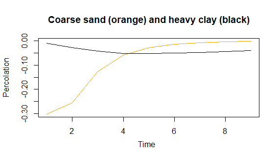
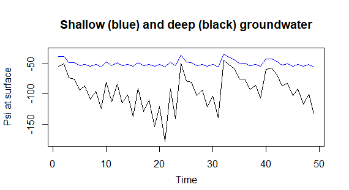

<!-- include the hint.js -->
<script src="hints.js"></script>

## Learning goals
* Understand the setup of an unsaturated zone model (dimensions, flow type, boundary conditions) *(Introduction, exercise 3,5)*
* Understand the importance of non-linear hydraulic relationships *(Exercise 1)*
* Understand the concept of equilibrium moisture profiles *(Exercise 2)*
* Understand the effect of soil type, groundwater level and numerical method (FV vs FE) on the results of the transient unsaturated zone model *(Exercise 4,5,6)* 
* Understand the value of the simple unsaturated flow models in terms of water management (ponding, capillary rise, recharge to groundwater, plant water use)	*(Exercise 4)*
* Apply different top forcing functions *(Exercise 5,6)*
* Apply actual evapotranspiration using a Feddes function and understand the feedbacks involved in this *(Exercise 7)*

## Introduction

The unsaturated zone is a very important interface between the groundwater system and the processes at the land surface. It stores precipitation, transports the excess to the groundwater, and can extract water (capillary rise) from the groundwater when the groundwater table is relatively shallow. The moisture content in the unsaturated zone is very important for the vegetation on top, where it can transpire through plants or evaporate from the soil surface. In this way, the unsaturated zone provides moisture to the atmosphere.

Unsaturated water flow occurs in the zone between the soil surface and the (saturated) groundwater table. The flux in this part of the hydrological cycle is predominantly vertical. For that reason a 1D-model will be constructed along the vertical axis, denoted by z.

As in the saturated groundwater, water flow in the unsaturated zone can be calculated with a Darcy formula, where the water flow is driven by differences in the _hydraulic_ or _piezometric_ head. In the saturated models, we simply used the hydraulic head $H$ as the state variable. 

The hydraulic head $H$ is calculated as:  

$$
H = \psi + z\\
$$

With:  

$H$: Hydraulic head (m)  

$\psi$: Pressure head (m)  

$z$: Elevation head (m)  

The graph below illustrates the relation between these variables. Imagine a bucket with a height of 1 meter and filled with water. The reference head (green line) equals 0.0 m at the bottom of the bucket, but the pressure head (red line) equals 1.0 m. The hydraulic head is a constant being 1.0 m (blue line). Suppose you would measure the pressure head at a height 0.20 m from the bottom. This would be 0.80 m (intersection point dashed line and red line). The elevation head is 0.20 m (intersection point dashed line and green line). Summing pressure head and elevation head results in the hydraulic head: $H=\psi+z=0.8+0.2=1.0 \, m$ over the whole depth.


Figure 1: Elevation and pressure heads in a bucket.

In the unsaturated zone above the water table, the situation is different compared to the saturated zone model we constructed before:   
*   The hydraulic conductivity $k$ is no longer constant but dependent on moisture content;   
*   The flow is assumed to be vertical;   
*   The pressure head $\psi$ is now a negative number, which depends on the moisture content in a certain soil layer.   

For the unsaturated zone, several state variables are possible: 

*   $\theta(z)$ : moisture content (cm$^3$/cm$^3$)  
*   $\psi(z)$ : pressure head (cm); in the unsaturated zone the pressure head w.r.t. the atmospheric pressure is always negative  
*   $H(z)$ : hydraulic head (cm) $H=\frac {P}{\rho g}+z=\psi+z$  
*   $pF(z)$ : the pF expresses the negative pressure head (suction) in log space: $pF=_{\text{log10}}|-\psi(z)|$

Note that in unsaturated zone modelling we generally work with units of cm and days. The reference level of the elevation head is up to the modeller to choose. In this assignment, we will set $z=0 cm$ at the bottom of our domain, which coincides with the groundwater level. We will follow the (historical) convention to choose the z-direction upwards.

In these assignments we will choose $\psi(z)$ as state variable. This is more practical than $H(z)$, because $\psi(z)$ directly reflects the wetness of the soil; also $\psi(z)$ is independent of the choice of the reference level for $z$.

Using the Darcy formula, the internal flux in the unsaturated zone can now be expressed in terms of the pressure head and the hydraulic conductivity.

<div class="exercise"> 
1.Write down the formula for unsaturated Darcy flux.
</div>

<div class="student_answer">
Fill in your answer here...
</div>

<div class="answer">
$q(z)=-k(\psi) \left ( \frac{d\psi}{dz}+1 \right )$
</div>

<div class="exercise">
2.Cleaning the workspace and loading the FVFE1D package:
```{r}
rm(list = ls())
library(FVFE1D)
load(file='Staring.Rdata')
# No further action needed if the code block runs without complaints.
```
</div>

Before constructing models for flow in the unsaturated zone, it is useful to make an overview of the units.

<div class="exercise">
3.Fill out the table.
</div>

<div class="student_answer">

quantity | unit 
----|----
$\psi$ | 
$\theta$ | 
$k$ | 
$z$ | 
time | 
internal flux | 
external flux | 
</div> 

<div class="answer">
quantity | unit 
----|----
$\psi$ | $cm$
$\theta$ | -
$k$ | $cm/d$
$z$ | $cm$
time | $d$
internal flux | $cm/d$
external flux | $\int (/d)dx$ 
</div> 

## 1. Exploring the hydraulic relations  

Not all the quantities cited above are independent.
For each soil there are unique relations between $\theta$ , $\psi$ and $k$.  
You can explore these relations by running the R-script called **__soilprofiles.R__** separately. The data for the different soil types that are plotted are loaded from the file *Staring.Rdata*, which should be located in the same folder as the R-script.
Each soil has a code consisting of a letter (B = topsoil, O = deeper soil), a number and a description.  

You will look in more detail at the following soil types:

*   Coarse Sand B5/O5 
*   Loam B13/O14 
*   Heavy clay B11/O12 
*   Sandy Peat B16/O16

We will try to follow the convention that if we want to make a plot of e.g. the distribution of the soil moisture $\theta(z)$ in the soil column, $\theta$ is plotted on the horizontal axis and z on the vertical axis. Such a plot is called a *moisture profile*. A similar plot can be made for the water pressure head $\psi(z)$. The vertical distribution of $\psi(z)$ is called a *pressure profile*.

<div class="exercise">
4.Using the plots created by `soilprofiles.R`, answer the following questions (by clicking the wheel in the upper left you can change the soil type).

*   Which of the four soil types can store most water?     
*   Which soil can transport water/nutrients most easily?   
*   Which soil has most water available for the vegetation?   
</div> 

<button type="button" onclick="toggle('Q1')">Show hint</button>
<div id="Q1" style="display: none">
The concepts field capacity (pF 2) and wilting point (pF 4.2) are important here. When the water content of the soil is above the field capacity (pF<2) water will drain by gravity. The water in the soil below field capacity is the water that the soil can retain and supply to vegetation. However, when the soil water content is below wilting point (pF<4.2) the water is attached so strongly to the soil particles that plants cannot extract it any more. Therefore, the amount of water between field capacity and wilting point is considered to be the plant available water.
</div>
<br>

<div class="student_answer">
Fill in your answer here...
</div>

<div class="answer">
*   Soils can store water until they are saturated. The soil with the highest saturated moisture content can therefore be said to have the highest storage capacity. This is highest for soil type Sandy Peat.

* The saturated hydraulic conductivity is a good indication of how well a soil transports water and nutrients:
```{r}
list.soilcode=c("B5","B13","B11","B16")
for (n in list.soilcode)  
{
  print(paste((soil.set[[n]]$name),'; Ksat=', soil.set[[n]]$ksat))
}
```
The coarse sand has the highest transport capacity.

*   Available water for vegetation is given by the range between wilting point and field capacity:

```{r}
list.soilcode = c('B5','B13','B11','B16')
for (n in list.soilcode)  
{
  print(paste((soil.set[[n]]$name),'; range pF(4-2) theta:',
              soil.set[[n]]$theta.fun(-100)-soil.set[[n]]$theta.fun(-10000)))
}
```
The peat soil has the highest available water content for vegetation. It is also quite high for the loam soil.
</div>

## 2. Exploring the equilibrium profiles 
Even when there is no flow through the soil, the situation is interesting. The corresponding profiles of $\psi$ and $\theta$ are called equilibrium profiles. 

The code chunk below is mostly preprogrammed. It illustrates the pressure and moisture content profile at equilibrium with the groundwater for a certain soil. The surface level is set to 0.0 cm. Assume that the groundwater table is at 1 m (100 cm) depth. The internal flow is defined to be positive upwards.

<div class="exercise">
5.What are the boundary conditions at the lower (left) and upper (right) end of the domain? Fill out AA and BB in the chunk.  
6.Derive for the internal flux the differential equation for $\psi$ for the equilibrium situation. Use this to fill out XX and YY in the chunk.  
</div>

The variable **all.soil.codes** contains all available soil codes. You can also open the `soil.set` list in the environment to see the available information for the different soil types.

<div class="exercise">
7.Select one of the soils to plot the pressure and moisture content profile for the equilibrium situation.  
You need to remove **eval=FALSE** before the chunk can be run!
</div>

<div class="student_answer">
```{r eval=FALSE}
all.soil.codes = names(soil.set) #soil.set is the list with soil information created by soilprofiles.R. This includes the hydraulic relations theta(psi) and k(psi). These are stored in the functions k.fun and theta.fun per soil type.

domain = c(AA,BB)
z.seq = seq(from=domain[1],to=domain[2],length=50) #create nodes at 2 cm distance

#give the equilibrium pressure head profile (same for all soil types)
Psi.equi = approxfun(c(-100,0),c(XX,YY))
Psi.seq = Psi.equi(z.seq)

##Choose a particular soil:
soil.code = "B6" #B6= boulder clay
Soil = soil.set[[soil.code]]

##Calculate the moisture profile for this:
theta.seq = Soil$theta.fun(Psi.seq)

##Make a nice plot
old.par= par(no.readonly=TRUE)
par(mfrow=c(1,2))
plot(Psi.seq,z.seq,type="l",xlab="Psi",ylab="z",col="blue",lwd=2)
grid()
plot(theta.seq,z.seq,type="l",xlab="theta",ylab="z",col="red",lwd=2,
     xlim=c(0,Soil$theta.sat),
     main=)
# title(main=paste('tst', outer = TRUE)
title(main=paste('soil code', soil.code,'and name :',
      soil.set[[soil.code]]$name), line = -1,outer = TRUE) #, cex = 1.5)
grid()
par(old.par)
```
</div>

<div class="answer">
5.The domain runs from -100 cm (the groundwater table) to 0 cm (the ground surface).   
6.Because we have a no-flow situation with q=0 cm/d (soil moisture in equilibrium with the groundwater table), we can write $q(z)=-k(\psi) \left ( \frac{d\psi}{dz}+1 \right )=0$     
That means $\frac{d\psi}{dz}+1=0$       
and $\frac{d\psi}{dz}=-1$   
To describe the equilibrium profile for the pressure head $\psi$, we still need one boundary condition. This is given by the groundwater table: at x=-100 cm, $\psi$ is 0 cm.
That gives an equilibrium profile going from $\psi=0$ at x=-100 cm to $\psi=-100$ at x=0 cm.
```{r}
all.soil.codes = names(soil.set)

domain = c(-100,0)
z.seq = seq(from=domain[1],to=domain[2],length=50)

#give the equilibrium pressure head profile (same for all soil types)
Psi.equi = approxfun(c(-100,0),c(0,-100))
Psi.seq = Psi.equi(z.seq)

##Choose a particular soil:
soil.code = "B6"
Soil = soil.set[[soil.code]]

##Calculate the moisture profile for this:
theta.seq = Soil$theta.fun(Psi.seq)

##Make a nice plot
old.par= par(no.readonly=TRUE)
par(mfrow=c(1,2))
plot(Psi.seq,z.seq,type="l",xlab="Psi",ylab="z",col="blue",lwd=2)
grid()
plot(theta.seq,z.seq,type="l",xlab="theta",ylab="z",col="red",lwd=2,
     xlim=c(0,Soil$theta.sat))
title(main=paste('soil code', soil.code,'and name :',
      soil.set[[soil.code]]$name), line = -1,outer = TRUE) #, cex = 1.5)
grid()
par(old.par)
```
</div>  

<div class="exercise"> 
8.The pressure profile is the same for all soils. Can you explain why? 
</div> 

<div class="student_answer"> 
Fill in your answer here...
</div>

<div class="answer">
As determined earlier, when the water flux $q(z)=0$ cm/d, $\frac{d\psi}{dz}=-1$ which is just a constant. It simply means that when $z$ is increased by 1 cm, $\psi$ is increased by -1 cm. This is independent of the soil type.   
</div>

<div class="exercise">
9.What is the difference between an equilibrium situation and a stationary flow situation, for the unsaturated zone case?
</div>

<div class="answer">
For the unsaturated zone, equilibrium is the situation where there is no flow: there are no in- or outputs at the surface, and the pressure profile is such that the upward suction forces exactly balance the downward gravity forces.

A stationary flow situation occurs when the state variable (pressure or storage profile) does not change over time. That is, the inflows have reached a balance with the outflows. For the unsaturated zone, this means that the incoming precipitation surplus equals the downward percolation to the groundwater; or that the capillary rise from the groundwater equals the evaporation at the surface. 

The stationary models we built make use of this concept of inflow=outflow and storage change=0. However, also in transient models there may be temporary stationary conditions, for example when the inflow is constant for a while. For shallow groundwater tables the incoming flux and outgoing flux will then be the same (except for the sign) relatively fast. For large unsaturated zones stationary conditions may take much longer to develop, due to attenuation and delay. If the net inflow at the surface is zero, the transient model may also reach an equilibrium situation.
</div>

## 3. Stationary unsaturated zone model  
We start by building a stationary model for flow in the unsaturated zone. We want to find the soil moisture profile for a situation with a given groundwater level (located at the lower boundary of the domain) and a rain input of 1 mm/day. The soil type is coarse sand (B5) and we use a nodal spacing of 2 cm. 

The following code chunk is partly preprogrammed but still needs to be finished.

<div class="exercise">
10.     
*   fill out the missing parts (XXXX) in the chunk     
*   remove **eval=FALSE** from the header of the chunk      
*   run the chunk and analyse the results.  
</div>

<div class="student_answer">
```{r eval=FALSE}
################### soil type ###################
Soil = soil.set[["B5"]]
print(Soil$name) 

################ internal flux function #############
# define the internal flux function. 
# we use in this the k.fun function, which is already preprogrammed 
# in the Soil selected:
unsatdarcy.flux = function(z,psi,dpsidz)
{
  return(-Soil$k.fun(psi)*XXXX)
}

################### make the model #################
UnsatStat = newFLOW1D(domain,unsatdarcy.flux,"give me a nice name")

############## Boundary conditions ##################
# left = at the bottom (groundwater table)
set.BC.fixedstate(UnsatStat,"left",XXXX) #head at the bottom [cm]
# right = flux at the surface. Choose XXXX such 
# that it corresponds to 1 mm/day of recharge 
set.BC.fixedflux(UnsatStat,"right",XXXX) 

####### discretisation #####################
# position the nodes 2 cm apart
nodes = seq(from=domain[1],to=domain[2],by=XXXX)
set.discretisation(UnsatStat,nodes,"FV")
# An initialisation is certainly important (as the default initialisation by zero does not make sense here). 
# So we initialize with a no-flux profile:
Psi.equi = approxfun(c(domain[1],domain[2]),c(domain[2],domain[1]))
do.initialize(UnsatStat,Psi.equi)

# We want to avoid pressures to be too negative (<-1E-5)
Psi.in.range = function(z,Psi) # it has 2 arguments; the position and the state
{
  if(Psi<=-1E5) return(FALSE)
  else return(TRUE)
}
set.isacceptable(UnsatStat,Psi.in.range) #the set.isacceptable function limits the possible values that the state can become

######## checking and solving the model ####################
summary(UnsatStat)
solve.steps(UnsatStat,verboselevel=1)

######## plotting #############################
#we will create two plots, of the psi profile and the theta profile
Psi.seq = dataframe.states(UnsatStat)$state
z.seq = dataframe.states(UnsatStat)$x
Psi.equi.seq = Psi.equi(z.seq) # the equilibrium profile to compare with
Psi.range=range(Psi.seq,Psi.equi.seq)
theta.seq = Soil$theta.fun(Psi.seq)
old.par= par(no.readonly=TRUE)
par(mfrow=c(1,2)) #this creates two plots next to each other

plot(Psi.seq,z.seq,type="l",xlab="Psi",ylab="z",xlim=Psi.range,col="blue",lwd=2)
lines(Psi.equi.seq,z.seq,type="l",lty="dashed")
grid()
plot(theta.seq,z.seq,type="l",xlab="theta",ylab="z",col="red",lwd=2,
     xlim=c(0,Soil$theta.sat))
grid()
par(old.par)
mtext(paste(Soil$soiltype,"=",Soil$name),side=3,line=1)
#a plot of the internal fluxes gives additional insight:
plot(UnsatStat,fluxplot=T,vertical=T,FVstyle=T)
```
</div>

<div class="answer">
The missing parts should be filled in as follows:
```
unsatdarcy.flux = function(z,psi,dpsidz)
{
  return(-Soil$k.fun(psi)*(dpsidz+1))
}

set.BC.fixedstate(UnsatModel,"left",0.0)
# At the bottom of the model, where the groundwater level is located, both pressure head and elevation head are zero. 

set.BC.fixedflux(UnsatModel,"right",0.1)  
# 0.1cm/d=1mm/d. Although this flow is directed downwards, we define it positive because it goes into the domain.

nodes = seq(from=domain[1],to=domain[2],by=2)
``` 
The following chunk builds the stationary unsaturated zone model:
```{r echo=FALSE}
################### soil type ###################
Soil = soil.set[["B5"]]
print(Soil$name) 

################ internal flux function #############
# define the internal flux function. 
# we use in this the k.fun function, which is already preprogrammed 
# in the Soil selected:
unsatdarcy.flux = function(z,psi,dpsidz)
{
  return(-Soil$k.fun(psi)*(dpsidz+1))
}

################### make the model #################
UnsatStat = newFLOW1D(domain,unsatdarcy.flux,"Unsaturated zone, 1D stationary")

############## Boundary conditions ##################
# left = at the bottom (groundwater table)
set.BC.fixedstate(UnsatStat,"left",0.0) #Head at the bottom [cm]
# right = flux at the surface. Choose such 
# that it corresponds to 1 mm/day of recharge 
set.BC.fixedflux(UnsatStat,"right",0.1)  ##0.1cm/d=1mm/d. Although this flow is directed downwards, we define it positive because it goes into the domain.

####### discretisation #####################
# position the nodes 2 cm apart
nodes = seq(from=domain[1],to=domain[2],by=2)
set.discretisation(UnsatStat,nodes,"FV")
# An initialisation is certainly important (as the default initialisation by zero does not make sense here). 
# So we initialize with a no-flux profile:
Psi.equi = approxfun(c(domain[1],domain[2]),c(domain[2],domain[1]))
do.initialize(UnsatStat,Psi.equi)

# We want to avoid pressures to be too negative (<-1E-5)
Psi.in.range = function(z,Psi) # it has 2 arguments; the position and the state
{
  if(Psi<=-1E5) return(FALSE)
  else return(TRUE)
}
set.isacceptable(UnsatStat,Psi.in.range) #the set.isacceptable function limits the possible values that the state can become

######## checking and solving the model ####################
summary(UnsatStat)
solve.steps(UnsatStat,verboselevel=1)

######## plotting #############################
#we will create two plots, of the psi profile and the theta profile
Psi.seq = dataframe.states(UnsatStat)$state
z.seq = dataframe.states(UnsatStat)$x
Psi.equi.seq = Psi.equi(z.seq) # the equilibrium profile to compare with
Psi.range=range(Psi.seq,Psi.equi.seq)
theta.seq = Soil$theta.fun(Psi.seq)
old.par= par(no.readonly=TRUE)
par(mfrow=c(1,2)) #this creates two plots next to each other

plot(Psi.seq,z.seq,type="l",xlab="Psi",ylab="z",xlim=Psi.range,col="blue",lwd=2)
lines(Psi.equi.seq,z.seq,type="l",lty="dashed")
grid()
plot(theta.seq,z.seq,type="l",xlab="theta",ylab="z",col="red",lwd=2,
     xlim=c(0,Soil$theta.sat))
grid()
par(old.par)
mtext(paste(Soil$soiltype,"=",Soil$name),side=3,line=1)
#a plot of the internal fluxes gives additional insight:
plot(UnsatStat,fluxplot=T,vertical=T,FVstyle=T)
```

Here we are clearly not in a no-flow situation any more: the $\psi$ profile diverts from the equilibrium profile. The topsoil is wetter than equilibrium, so there is downward flow (also visible in the flux plot). Note that the flux is constant with depth, which makes sense because the model is stationary.
The output shows also that iterations are needed: because of the moisture-dependent conductivity, the flow functions are not linear and cannot be solved in one step.
</div>

## 4. Application of the model
*In this section you will compare the hydrological functioning of the different soil types, using the model you built. There is also a **challenging exercise** available that studies the numerical aspects of dealing with a very nonlinear system (**Challenging exercise 1** in Ass3_Extra.R). You can choose this exercise to replace section 4.* 

As mentioned earlier, the unsaturated zone can be seen as an interface between the regional saturated groundwater system and the meteorological and ecological forcings at the surface. The water flow in the unsaturated zone determines how rainfall will separate between infiltration and runoff; how much water is available for evapotranspiration; and how much water will recharge to the saturated groundwater.

The amount of water available in the unsaturated zone depends on:   

* Evapotranspiration rates, which are determined by radiation, temperature and available moisture content.    
* Precipitation rates    
* Soil properties    
* Depth of the groundwater table.

Three typical classifications in an eco-hydrological and water management context are the sensitivity to **ponding** (NL: plasvorming); the capacity for **capillary rise**; and the total **water storage capacity**.

<div class="exercise">
11.Ponding happens when water stagnates on the surface. This can occur when the infiltration capacity of the topsoil is exceeded by an external input (called Hortonian). Another reason can be that the maximum water storage capacity of the soil is exceeded (called Dunian), so that the soil is saturated to the surface. Fill out in the following table the maximum downward flux the soil can transport downwards without ponding. You can use the above code chunk, but it is not necessary. 
</div>

<button type="button" onclick="toggle('Q2')">Show hint</button>
<div id="Q2" style="display: none">
You can solve this question in two ways.   
1: The first type of ponding occurs when the infiltration capacity is exceeded, that is, the downwards flow (q) is higher than Ksat. From this you can derive the maximum q per soil type (without running the model). Would groundwater depth be important here?    
2: The second type of ponding means that the soil gets saturated to the surface. You can run the UnsatStat model to try out how much recharge it can handle without getting fully saturated. Would the groundwater level be important in this case?
</div>
<br>

<div class="student_answer">

Ponding (B soils) | Coarse sand | Loam | Heavy clay | Sandy peat | 
----|----|----|----|----|  
max. q, water table at 1 m | | | | | 
max. q, water table at 2 m | | | | | 
</div>

<div class="answer">
Ponding (B soils) | Coarse sand | Loam | Heavy clay | Sandy peat | 
----|----|----|----|----|  
max. q water table at 1 m | 52.92 | 12.98 | 4.53 | 6.79 | 
max. q water table at 2 m |  52.92 | 12.98 | 4.53 | 6.79 |
</div>

<div class="exercise">
12.What is the maximum capillary rise flux the soils can maintain? Complete the table below.
</div>

<button type="button" onclick="toggle('Q3')">Show hint</button>
<div id="Q3" style="display: none">
When you extract water from the top, the model will try to balance this with an upward water flux from the lower boundary. However, when the outgoing flow at the top is very high, drawing enough flow from the bottom will need extremely low pressures at the surface, that may be below the 'realistic minimum' (<-1E-5) that we have set. The highest evaporation flux at the top that still gives a solution can be seen as the maximum capillary rise.
</div>
<br>

<div class="student_answer">

Capillary rise (O soils)| Coarse sand | Loam | Heavy clay | Sandy peat | 
----|----|----|----|----|  
max. q, water table at 1 m | | | | | 
max. q, water table at 2 m | | | | |  
</div>

<div class="answer">
Capillary rise (O soils)| Coarse sand | Loam | Heavy clay | Sandy peat | 
----|----|----|----|----|  
max. q, water table at 1 m | 0.01 | 1.1 | 0.03 | 0.0875 | 
max. q, water table at 2 m | 0.001 | 0.4125 | 0.0075 | 0.03|  
</div>

<div class="exercise"> 
13.Calculate the total amount of water stored in the unsaturated zone, with a groundwater table at 1m below surface, for a situation with precipitation, 1 $mm/d$, and for a situation with evapotranspiration, 1 $mm/d$.
</div>

<button type="button" onclick="toggle('Q4')">Show hint</button>
<div id="Q4" style="display: none">
You can use the theta-profile and the size of the control volumes.
</div>
<br>

<div class="student_answer">

Total stored volume [cm]| Coarse sand | Loam | Heavy clay | Sandy peat | 
----|----|----|----|----|  
precipitation 1 mm/d | | | | | 
evapotranspiration 1 mm/d | | | | |  
</div>

<div class="answer">
The total volume of water in the profile can be calculated with $\int_{z(\psi=0)}^{z(surface)}\theta(z)dz$. This can simply be approximated by multiplying the moisture content for each node with its nodal distance (2 cm).   
```{r}
wat.at.nodes = Soil$theta.fun(UnsatStat$states)
#the states are the pressure heads; theta.fun converts these to water contents.
vol.wat.nodes = wat.at.nodes[2:(length(wat.at.nodes) - 1)]*2
tot.vol.wat = sum(vol.wat.nodes)+wat.at.nodes[1]+wat.at.nodes[length(wat.at.nodes)]
#The first and last nodes are only 1 cm high
```

Total volume water (cm)| Coarse sand | Loam | Heavy clay | Sandy peat | 
----|----|----|----|----|  
precipitation 1 mm/d | 19.47 | 39.03 | 57.85 | 72.12 | 
evapotranspiration 1 mm/d | 17.59 | 38.76 | 48.68 | 67.70 |      
</div>

## 5. Transient unsaturated zone model
One of the key aspects of a transient model is the introduction of a **storage term** in the simulations. Similar to the previous transient models you built, storage change takes place between the previous and current time step. Now the change in storage can directly be calculated by the difference in moisture content between timesteps.  
The chunk below contains a script for running a transient unsaturated zone model. A few aspects still need to be implemented by yourself.

<div class="exercise"> 
14.     
* Add headings or comments at the lines starting with ##  
* Finish the *changeinstorage* function  
* The top forcing (precipitation surplus) is initially set at 0. Later on, a time dependent top forcing is created. This function results in precipitation for the time until T1, followed by evaporation between T1 and T2, and zero top forcing from T2 to the end.  

Remove "eval=FALSE", then you can run the chunk. The animations that will be created will probably not display in the default markdown window. Go to the directory where the knitted html-file is saved and open it in Google Chrome. If it is still not working, check if you have the 'ffmpeg' programme in the same folder as the markdown (this executable is available on Blackboard). This programme is needed for the animations.
</div>

<div class="student_answer">
```{r animation0, eval=FALSE, fig.show='animate', aniopts='controls'}
## Script to setup a transient flow model of the unsaturated zone
domain = c(-50,0)
dz=1

## 
Soil = soil.set[["B5"]]
print(Soil$name)

##
unsatdarcy.flux = function(z,psi,dpsidz)
{
  return(-Soil$k.fun(psi)*(dpsidz+1))
}

##
# COMPLETE THIS FUNCTION
# in this, let oldpsifun(x) stand for the old pressure at x
changeinstorage = function(x,psi)
{
  
}

## This will be the initial profile, corresponding to ....
## 
Psi.equi = approxfun(c(domain[1],domain[2]),c(domain[2],domain[1]))

##
UnsatTrans = newFLOW1D(domain,unsatdarcy.flux,name="Unsaturated zone, transient")

##
add.spatialflux(UnsatTrans,changeinstorage,"change in storage") #storage flux in cm/d

##
set.BC.fixedstate(UnsatTrans,"left",0) #hydraulic head at the bottom [cm]

## Here we use a string as the value of a boundary condition, the package will use the value of the 
## variable with that name (see also help)
##
topforcing = 0 #flux at the top in cm/d
set.BC.fixedflux(UnsatTrans,"right","topforcing")

##
nodes = seq(from=domain[1],to=domain[2],by=dz)
set.discretisation(UnsatTrans,nodes,"FV")

##
Psi.in.range = function(z,Psi) 
{
  if(Psi<=-1E5) return(FALSE)
  else return(TRUE)
}
set.isacceptable(UnsatTrans,Psi.in.range)

## The first forcing function
T1 = 1 #times in days
T2 = 2

forcing.fun = function(time)
{
  if(time<T1)
    {
      return(1)
    } else if(time <T2)
    {
      return(-0.1)
    } else
    {
    return(0)
    }
}

## The second forcing function (use later)
# source("topforcing.R")
# forcing.fun = function(time)
# {
#   return(rainfun(time)-evapfun(time))
# }

##
summary(UnsatTrans)

##
begin.time = 0 
end.time = 100
delt = 1/24 #time step in days
time = begin.time+delt

##
do.initialize(UnsatTrans,Psi.equi)
oldpsifun = Psi.equi

##
psi.atsurface = c() 
savestorage = c()
savepercolation = c()

while(time < end.time)
{
  topforcing = forcing.fun(time)
  
  control=solve.steps(UnsatTrans)
  
  curresult = dataframe.states(UnsatTrans)
  ##
  psi.atsurface = c(psi.atsurface,curresult$state[length(nodes)])
  savestorage = c(savestorage,dataframe.balance(UnsatTrans)[2,4])
  savepercolation = c(savepercolation,dataframe.boundaries(UnsatTrans)[1,4])
  
  Psi.seq = dataframe.states(UnsatTrans)$state
  z.seq = dataframe.states(UnsatTrans)$x
  Psi.equi.seq = Psi.equi(z.seq)
  Psi.range=range(Psi.seq,Psi.equi.seq)
  theta.seq = Soil$theta.fun(Psi.seq)
  old.par= par(no.readonly=TRUE)
  par(mfrow=c(1,2))
  
  plot(Psi.seq,z.seq,type="l",xlab="Psi",ylab="z",xlim=Psi.range,
       main=paste("time=",round(time,2)), col="blue",lwd=2)
  lines(Psi.equi.seq,z.seq,type="l",lty="dashed")
  grid()
  plot(theta.seq,z.seq,type="l",xlab="theta",ylab="z",
       main=paste(Soil$soiltype,"=",Soil$name), col="red",lwd=2,
       xlim=c(Soil$theta.res,Soil$theta.sat))
  grid()
  par(old.par)
  
  Sys.sleep(0.1)
  time = time+delt

  oldpsifun = approxfun(curresult$x,curresult$state,rule=2)
}

##saving storage and percolation to the groundwater for different soil types

if (Soil$soiltype == "B5") 
{
  savestorage.B5 = savestorage
  savepercolation.B5 = savepercolation
}

if (Soil$soiltype == "B11")
{
  savestorage.B11 = savestorage
  savepercolation.B11 = savepercolation
}
```
</div>

<div class="answer">
The storage change is the change in moisture content; $\frac{\partial \theta}{\partial t}$. The storage function can now be written as: $-\frac{\theta(\psi^{new})-\theta(\psi^{old})}{\Delta t}$. The moisture content can be derived using the __Soil$theta.fun()__ function which is a function of the calculated state $\psi$.    
The storage change can then be implemented as follows:    
```
changeinstorage = function(x,psi)
  {
  Qsto = -(Soil$theta.fun(psi) - Soil$theta.fun(oldpsifun(x)))/delt
  return(Qsto)
  }
```
The following chunk implements the transient unsaturated model.
```{r animation1, echo=FALSE, fig.show='animate', aniopts='controls'}
## Script to setup a transient flow model of the unsaturated zone
##SETS THE DOMAIN OF THE MODEL, IN THIS CASE WATER TABLE AT 50 CM BELOW SURFACE
## ------------------------------------------------------------------------
domain = c(-50,0)
dz=1
##THE SOIL(TYPE)
## ------------------------------------------------------------------------
Soil = soil.set[["B5"]]
print(Soil$name)
##THE INTERNAL FLUX
## ------------------------------------------------------------------------
unsatdarcy.flux = function(z,psi,dpsidz)
{
  return(-Soil$k.fun(psi)*(dpsidz+1))
}

##
## ------------------------------------------------------------------------

# COMPLETE THIS FUNCTION
# in this, let oldpsifun(x) stand for the old pressure at x
# 
changeinstorage = function(x,psi)
{
  Qsto = -(Soil$theta.fun(psi) - Soil$theta.fun(oldpsifun(x)))/delt
  return(Qsto)
}

## This will be the initial profile, corresponding to ....EQUILIBRIUM -> q=0 m/d
## ------------------------------------------------------------------------
Psi.equi = approxfun(c(domain[1],domain[2]),c(domain[2],domain[1]))

##THE NEW TRANSIENT MODEL
## ------------------------------------------------------------------------
UnsatTrans = newFLOW1D(domain,unsatdarcy.flux, name="Unsaturated zone, transient")

## ------------------------------------------------------------------------
##ADDING THE STORAGE FLUX
add.spatialflux(UnsatTrans,changeinstorage,"change in storage") #storage flux in cm/d

##SETTING THE BOUNDARY CONDITION AT THE WATER TABLE; FIXED STATE = 0 cm
## ------------------------------------------------------------------------
set.BC.fixedstate(UnsatTrans,"left",0) #head at the bottom [cm]

## Here we use a string as value, referring the actual value of the 
## variable with that name (see also help)
##ADDING A FIXED FLUX BOUNDARY CONDITION AT THE TOP OF THE MODEL
## ------------------------------------------------------------------------
topforcing = 0
set.BC.fixedflux(UnsatTrans,"right","topforcing") #flux at the top of the model in cm/d

##DISCRETISE THE MODEL WITH NODES, NODAL SPACING OF 1 CM, USING FINITE VOLUMES (FOR NOW)
## ------------------------------------------------------------------------
nodes = seq(from=domain[1],to=domain[2],by=dz)
set.discretisation(UnsatTrans,nodes,"FV")

##KEEPING THE MODEL STABLE: ALLOW ONLY SENSIBLE VALUES 
## ------------------------------------------------------------------------
Psi.in.range = function(z,Psi) 
{
  if(Psi<=-1E5) return(FALSE)
  else return(TRUE)
}
set.isacceptable(UnsatTrans,Psi.in.range)

##------------------------------------------------------------------------
## The first forcing function
T1 = 1 #times in days
T2 = 2

forcing.fun = function(time)
{
  if(time<T1)
  {
    return(1)
  } else if(time <T2)
  {
    return(-0.1)
  } else
  {
    return(0)
  }
}

## The second forcing function
##------------------------------------------------------------------------
# source("topforcing.R")
# forcing.fun = function(time)
# {
#   return(rainfun(time)-evapfun(time))
# }

#CHECKING
summary(UnsatTrans)

##TIME DISCRETISATION 
## ------------------------------------------------------------------------
begin.time = 0
end.time = 5 #100 smaller run period for html
delt = 0.5 ##1/24 larger delt for html 
time = begin.time+delt

##STARTING THE SIMULATIONS
## ------------------------------------------------------------------------
do.initialize(UnsatTrans,Psi.equi)

oldpsifun = Psi.equi

## STORING VALUES 
## ----------------------------------------------------------------------
psi.atsurface = c() #to keep track of psi at surface
savestorage = c()
savepercolation = c()

## RUN THE MODEL WITH A LOOP AND PLOT
## -----------------------------------------------------------------------
while(time < end.time)
{
  topforcing = forcing.fun(time)
  
  control=solve.steps(UnsatTrans)
  
  curresult = dataframe.states(UnsatTrans)
  ##saving intermediate results
  psi.atsurface = c(psi.atsurface,curresult$state[length(nodes)])
  savestorage = c(savestorage,dataframe.balance(UnsatTrans)[2,4])
  savepercolation = c(savepercolation,dataframe.boundaries(UnsatTrans)[1,4])
  #percolation: the flux leaving the domain at the bottom
  Psi.seq = dataframe.states(UnsatTrans)$state
  z.seq = dataframe.states(UnsatTrans)$x
  Psi.equi.seq = Psi.equi(z.seq)
  Psi.range=range(Psi.seq,Psi.equi.seq)
  theta.seq = Soil$theta.fun(Psi.seq)
  old.par= par(no.readonly=TRUE)
  par(mfrow=c(1,2))
  
  plot(Psi.seq,z.seq,type="l",xlab="Psi",ylab="z",xlim=Psi.range,
       main=paste("time=",round(time,2)), col="blue",lwd=2)
  lines(Psi.equi.seq,z.seq,type="l",lty="dashed")
  grid()
  plot(theta.seq,z.seq,type="l",xlab="theta",ylab="z",
       main=paste(Soil$soiltype,"=",Soil$name), col="red",lwd=2,
       xlim=c(Soil$theta.res,Soil$theta.sat))
  grid()
  par(old.par)
  
  Sys.sleep(0.1)
  time = time+delt

  oldpsifun = approxfun(curresult$x,curresult$state,rule=2)
}

##saving storage and percolation to the groundwater for different soil types

if (Soil$soiltype == "B5") 
{
  savestorage.B5 = savestorage
  savepercolation.B5 = savepercolation
}

if (Soil$soiltype == "B11")
{
  savestorage.B11 = savestorage
  savepercolation.B11 = savepercolation
}
```
</div>

<div class= "exercise">    
15.Change the soil type. How does the soil moisture behaviour change?    
Make sure that when you make a new chunk that should do an animation, also copy `fig.show='animate', aniopts='controls'` into the upper line of the chunk.    
16.Change the method into Finite Elements. What changes do you observe? 
</div>

<div class="answer">
15.This chunk runs the model with soil B11, heavy clay.
```{r animation2, echo=FALSE, fig.show='animate', aniopts='controls'}
###Running with another soil type: B11 heavy clay
UnsatTrans_Clay=copy.model(UnsatTrans)
set.name(UnsatTrans_Clay, "Unsaturated zone, transient with clay soil")
##Check if everything is the way you want
summary(UnsatTrans_Clay)

##THE SOIL(TYPE)
Soil = soil.set[["B11"]]

##TIME DiSCRETISATION 
## ------------------------------------------------------------------------
begin.time = 0
end.time = 5 #100 smaller run period for html
delt = 0.5 ##1/24 larger delt for html
time = begin.time+delt

##SIMULATING AND PLOTTING
## ------------------------------------------------------------------------
do.initialize(UnsatTrans_Clay,Psi.equi)
oldpsifun = Psi.equi

psi.atsurface = c() #to keep track of psi at surface
savestorage = c()
savepercolation = c()

while(time < end.time)
{
  topforcing = forcing.fun(time)
  
  control=solve.steps(UnsatTrans_Clay)
  
  curresult = dataframe.states(UnsatTrans_Clay)
  ##saving intermediate results
  psi.atsurface = c(psi.atsurface,curresult$state[length(nodes)])
  savestorage = c(savestorage,dataframe.balance(UnsatTrans_Clay)[2,4])
  savepercolation = c(savepercolation,dataframe.boundaries(UnsatTrans_Clay)[1,4])
  ##saving intermediate results
  Psi.seq = dataframe.states(UnsatTrans_Clay)$state
  z.seq = dataframe.states(UnsatTrans_Clay)$x
  Psi.equi.seq = Psi.equi(z.seq)
  Psi.range=range(Psi.seq,Psi.equi.seq)
  theta.seq = Soil$theta.fun(Psi.seq)
  old.par= par(no.readonly=TRUE)
  par(mfrow=c(1,2))
  
  plot(Psi.seq,z.seq,type="l",xlab="Psi",ylab="z",xlim=Psi.range,
       main=paste("time=",round(time,2)), col="blue",lwd=2)
  lines(Psi.equi.seq,z.seq,type="l",lty="dashed")
  grid()
  plot(theta.seq,z.seq,type="l",xlab="theta",ylab="z",
       main=paste(Soil$soiltype,"=",Soil$name), col="red",lwd=2,
       xlim=c(Soil$theta.res,Soil$theta.sat))
  grid()
  par(old.par)
 
  Sys.sleep(0.1)
  time = time+delt

  oldpsifun = approxfun(curresult$x,curresult$state,rule=2)
}

##saving storage and percolation for different soil types
if (Soil$soiltype == "B5") 
{
  savestorage.B5 = savestorage
  savepercolation.B5 = savepercolation
}

if (Soil$soiltype == "B11")
{
  savestorage.B11 = savestorage
  savepercolation.B11 = savepercolation
}
```

With the same top forcing, the clay soil (B11) takes more time to reach equilibrium than the coarse sand soil (B5). This happens because downward drainage of the excess water is slower in clay. You can see this if you plot the `savepercolation.B5` and `savepercolation.B11` vectors: clay has a much lower percolation.     



16.If you run the model using Finite Elements (not shown in the chunks), the dynamics of the soil moisture profile change very little. However, if you look at the fluxes or storage changes that happen in each timestep (using one of the dataframes that are saved during the while loop), small differences are visible.
</div>

*There is also a challenging exercise available, that looks some further into the differences between Finite Volumes and Finite Elements. If you are interested, go to **Exercise 2** of the `Ass3_Extra.Rmd`.*

## 6. Changed top forcing function

Now you will implement a more 'realistic' top forcing. The R-file `topforcing.R` creates an artificial rainfall-evaporation pattern with the functions 'rainfun' and 'evapfun'.   

<div class="exercise">
17.Create a separate chunk that makes a plot of the precipitation, evapotranspiration and net input (rainfall surplus) provided by `topforcing.R`.
</div>

<button type="button" onclick="toggle('Q5')">Show hint</button>
<div id="Q5" style="display: none">
To make the rainfun and evapfun available for your code chunk you can add 'source('topforcing.R')' as first line. You can also just run the script separately.
</div>
<br>

<div class="answer">
The code chunk below creates a plot of the fluxes provided by `topforcing.R`.
```{r}
## chunk to plot precipitation, evapotranspiration and net input
source("topforcing.R")
forcing.fun = function(time)
{
  return(rainfun(time)-evapfun(time))
}

timesteps = seq(begin.time,25,by=delt)
rainseq = c()
evapseq = c()
forcing = c()
for(i in 1:length(timesteps)) rainseq[i] =rainfun(timesteps[i])
for(i in 1:length(timesteps)) evapseq[i] =evapfun(timesteps[i])
for(i in 1:length(timesteps)) forcing[i] =forcing.fun(timesteps[i])

plot(timesteps,rainseq,type="h",col='blue',ylim=c(-1,3),ylab='flux (cm/d)',xlab='time (days)')
lines(timesteps,evapseq,col='red')
lines(timesteps,forcing,col='green')
title('blue=precipitation, red=evaporation, green=net input')
grid()
```
</div>

<div class="exercise">
18.Run the transient model with this top forcing. You can comment the lines of the first forcing function and uncomment those of the second one; either make a new chunk or reuse the previous one. Make sure that the soil type B5 is selected.    
What is the highest and lowest pressure at the surface? Set the groundwater table at 1.00 m below surface. Are the highest and lowest pressures at the surface different now? 
</div>

<div class="answer">
Below a code chunk running with the new precipitation/evaporation pattern. 
```{r animation3, echo=FALSE, fig.show='animate', aniopts='controls'}
##SCRIPT WITH ANOTHER RECHARGE PATTERN

##SETS THE DOMAIN OF THE MODEL, IN THIS CASE WATER TABLE AT 100 CM BELOW SURFACE
## ------------------------------------------------------------------------
domain = c(-100,0)
dz=1

##THE SOIL(TYPE)
## ------------------------------------------------------------------------
Soil = soil.set[["B5"]]
print(Soil$name)

##THE INTERNAL FLUX
## ------------------------------------------------------------------------
unsatdarcy.flux = function(z,psi,dpsidz)
{
  return(-Soil$k.fun(psi)*(dpsidz+1))
}

## ------------------------------------------------------------------------
changeinstorage = function(x,psi)
{
  Qsto = -(Soil$theta.fun(psi) - Soil$theta.fun(oldpsifun(x)))/delt
  return(Qsto)
}

## This will be the initial profile, corresponding to ....EQUILIBRIUM -> q=0 m/d
## ------------------------------------------------------------------------
Psi.equi = approxfun(c(domain[1],domain[2]),c(domain[2],domain[1]))

##THE NEW TRANSIENT MODEL
## ------------------------------------------------------------------------
UnsatTrans_Top = newFLOW1D(domain,unsatdarcy.flux, name="Unsaturated zone with variable top forcing")

##ADDING THE STORAGE FLUX
## ------------------------------------------------------------------------
add.spatialflux(UnsatTrans_Top,changeinstorage,"change in storage")

##SETTING THE BOUNDARY CONDITION AT THE WATER TABLE; FIXED STATE = 0 cm
## ------------------------------------------------------------------------
set.BC.fixedstate(UnsatTrans_Top,"left",0)

## Here we use a string as value, referring the actual value of the 
## variable with that name (see also help)
##ADDING A FIXED FLUX BOUNDARY CONDITION AT THE TOP OF THE MODEL
## ------------------------------------------------------------------------
topforcing = 0
set.BC.fixedflux(UnsatTrans_Top,"right","topforcing")

##DISCRETISE THE MODEL WITH NODES, NODAL SPACING OF 1 CM, USING FINITE VOLUMES(FOR NOW)
## ------------------------------------------------------------------------
nodes = seq(from=domain[1],to=domain[2],by=dz)
set.discretisation(UnsatTrans_Top,nodes,"FV")

##KEEPING THE MODEL STABLE: ALLOW SENSIBLE VALUES ONLY 
## ------------------------------------------------------------------------
Psi.in.range = function(z,Psi) 
{
  if(Psi<=-1E5) return(FALSE)
  else return(TRUE)
}
set.isacceptable(UnsatTrans_Top,Psi.in.range)

## The first forcing function

## The second forcing function
##------------------------------------------------------------------------
source("topforcing.R")
forcing.fun = function(time)
{
  return(rainfun(time)-evapfun(time))
}

##TIME DISCRETISATION ASPECTS
## ------------------------------------------------------------------------
begin.time = 0
end.time = 25 #100 smaller run period for html
delt = 0.5 ##1/24 larger delt for html
time = begin.time+delt

##STARTING THE SIMULATIONS
## ------------------------------------------------------------------------
do.initialize(UnsatTrans_Top,Psi.equi)
oldpsifun = Psi.equi

psi.atsurface = c() #to keep track of psi at surface
savestorage = c()
savepercolation = c()

while(time < end.time)
{
  topforcing = forcing.fun(time)
  
  control=solve.steps(UnsatTrans_Top)
  
  curresult = dataframe.states(UnsatTrans_Top)
  ##saving intermediate results
  psi.atsurface = c(psi.atsurface,curresult$state[length(nodes)])
  savestorage = c(savestorage,dataframe.balance(UnsatTrans_Top)[2,4])
  savesavepercolation = c(savepercolation,dataframe.boundaries(UnsatTrans_Top)[1,4])
  ##saving intermediate results
  Psi.seq = dataframe.states(UnsatTrans_Top)$state
  z.seq = dataframe.states(UnsatTrans_Top)$x
  Psi.equi.seq = Psi.equi(z.seq)
  Psi.range=range(Psi.seq,Psi.equi.seq)
  theta.seq = Soil$theta.fun(Psi.seq)
  old.par= par(no.readonly=TRUE)
  par(mfrow=c(1,2))
  
  plot(Psi.seq,z.seq,type="l",xlab="Psi",ylab="z",xlim=Psi.range,
       main=paste("time=",round(time,2)), col="blue",lwd=2)
  lines(Psi.equi.seq,z.seq,type="l",lty="dashed")
  grid()
  plot(theta.seq,z.seq,type="l",xlab="theta",ylab="z",
       main=paste(Soil$soiltype,"=",Soil$name), col="red",lwd=2,
       xlim=c(Soil$theta.res,Soil$theta.sat))
  grid()
  par(old.par)
 
  
  Sys.sleep(0.1)
  time = time+delt

  oldpsifun = approxfun(curresult$x,curresult$state,rule=2)
}

##saving pressure data at surface for different depths water table
if (domain[1]==-50)
{
psi.atsurface.50cm = psi.atsurface
}else{
  psi.atsurface.100cm = psi.atsurface
}
```
If you plot `psi.atsurface.50cm` and `psi.atsurface.100cm`, you see that when the groundwater is deeper, psi at the surface is lower and much more variable.     


</div>

## 7. Actual evapotranspiration
Evapotranspiration is an important environmental condition for processes near the soil surface, such as the development of vegetation. In the previous exercise, we used evaporation/evapotranspiration as a given flux. In reality, the evapotranspiration depends on:      

*   The potential evapotranspiration rate, which is determined by weather conditions;    
*   The rooting distribution of the vegetation;   
*   The actual soil moisture content in the rooting zone.   

The total *potential* evapotranspiration rate of the vegetation is determined by weather conditions and will be given; it is equal to the total potential root extraction $TotExtract_{pot}$ [unit cm/d]. The rooting distribution may be described by a function $rootdistr.fun(z)$ which gives the fraction of roots present at each depth (giving 1 when integrated with depth). Now we may distribute the total potential extraction over the rooting profile. The potential extraction rate at a certain depth is then calculated by $root.extract_{pot}(z)=rootdistr.fun(z)*TotExtract_{pot}$ [unit 1/d].

The vegetation can only transpire optimally when there is sufficient moisture in the soil which is 'easily' available for the vegetation. The effect of soil moisture can be simulated with the so called Feddes (retired Prof. from WUR) function.  

The code chunk below illustrates such a Feddes function. The Feddes function relates the root water uptake at a certain depth with the pressure (suction) at that depth. When the soil is too wet or too dry, plant transpiration and thus root uptake are reduced below their potential rates, and the Feddes reduction factor is smaller than 1. The shape of the Feddes function varies between different vegetation types.

```{r}
Feddes.psiabs = c(0.1,100,1000,16000) #absolute psi values that define Feddes function
Feddes.red = c(0,1,1,0)
Feddes.fun= approxfun(Feddes.psiabs,Feddes.red,rule=2)
plot(Feddes.psiabs,Feddes.fun(Feddes.psiabs),type="l",lwd=3,xlim=rev(range(Feddes.psiabs)),log="x",ylab="Root uptake reduction",xlab="Suction (-psi)")
abline(v=Feddes.psiabs,col="red")
text(1,0.9,"Too wet", col="red")
text(300,0.7,"Optimal", col="red")
text(5000,0.9,"Too dry",col="red")
grid()
```

We can now include the effect of soil moisture on the root extraction. If we have the profile of $\psi$ available, the actual root extraction rate at a certain depth is given by:

$$\text{root.extract}_{act}(z,\psi_{z})= - \text{rootdistr.fun}(z)*\text{TotExtract}_{pot}*\text{Feddes.fun}(z,\psi_{z})$$  
Note the minus to indicate a loss of water. The $root.extract_{act}$ is in units [1/d]. To get the actual extraction rate in [cm/d] for a control volume $i$, we multiply by dz: $\text{root.extract}_{act}(z_{i},\psi_{i})*dz$.

We will apply the actual root extraction by a `spatial flux` in the unsaturated zone model. We assume a vegetation with a uniform rooting distribution over a depth of 25 cm. The total potential evapotranspiration rate is 0.3 cm/d.

<div class="exercise">
19.Complete the following chunk of code implementing the actual evapotranspiration.   

*   Finish the roots extraction function (**roots**) to simulate the actual evapotranspiration as described above.   
*   Use `summary(model)` to check if your model is the way you want it to be and you have no double fluxes or missing BCs.    
*   Run the chunk, which simulates a situation with no precipitation starting with an equilibrium pressure profile.

20.Evaluate the effect of the actual evapotranspiration. What happens if you implement a different (imaginary) vegetation type? For example, change the `Feddes.psi` vector to `c(0,-10,-40,-16000)` (which would be a very wet-loving plant) or adapt the rooting depth.
</div>

<div class="student_answer">
```{r eval=FALSE}
Soil = soil.set[["B5"]]  ##B5 coarse sand
domain = c(-50,0)
dz=1

UnsatTrans_Feddes=copy.model(UnsatTrans)
set.name(UnsatTrans_Feddes,"Unsaturated zone, with actual ET")

TotExtractPot=0.3 #potential evapotranspiration 0.3 cm/d
rootdistr.fun = approxfun(c(0,-25,-25.01),c(1/25,1/25,0),rule=2)

Feddes.psi = c(0,-100,-1000,-16000)
Feddes.red = c(0,1,1,0)
Feddes.fun= approxfun(Feddes.psi,Feddes.red,rule=2)

roots = function(x,state)
{
  return(XXXX)
}

add.spatialflux(UnsatTrans_Feddes,rate = roots,name = 'roots') 

Psi.equi = approxfun(c(domain[1],domain[2]),c(domain[2],domain[1]))
do.initialize(UnsatTrans_Feddes,Psi.equi)
Psi.in.range = function(z,Psi) 
{
  if(Psi<=-1E5) return(FALSE)
  else return(TRUE)
}
set.isacceptable(UnsatTrans_Feddes,Psi.in.range)

#Check if everything is ok
summary(UnsatTrans_Feddes)

oldpsifun = Psi.equi
begin.time = 0
end.time = 15 #you may adjust this
delt = 1/2
time = begin.time+delt

##
evap.act = c()
storage.act = c()
caprise.act = c()
while(time < end.time)
{
  topforcing = 0.0
  control=solve.steps(UnsatTrans_Feddes)
  ##
  curresult = dataframe.states(UnsatTrans_Feddes)
  Psi.seq = dataframe.states(UnsatTrans_Feddes)$state
  z.seq = dataframe.states(UnsatTrans_Feddes)$x
  Psi.equi.seq = Psi.equi(z.seq)
  Psi.range=range(Psi.seq,Psi.equi.seq)
  theta.seq = Soil$theta.fun(Psi.seq)
  ##
  wbal = dataframe.balance(UnsatTrans_Feddes)
  evap.act = c(evap.act,wbal[3,4]) #net root extraction
  storage.act = c(storage.act,wbal[2,4])
  caprise.act = c(caprise.act,dataframe.boundaries(UnsatTrans_Feddes)[1,4])
  
  #old.par= par(no.readonly=TRUE)
  #par(mfrow=c(1,2))
  #plot(Psi.seq,z.seq,type="l",xlab="Psi",ylab="z",xlim=Psi.range,
  #     main=paste("time=",round(time,2)), col="blue",lwd=2)
  #lines(Psi.equi.seq,z.seq,type="l",lty="dashed")
  #grid()
  #plot(theta.seq,z.seq,type="l",xlab="theta",ylab="z",
  #     main=paste(Soil$soiltype,"=",Soil$name), col="red",lwd=2,
  #     xlim=c(Soil$theta.res,Soil$theta.sat))
  #grid()
  #par(old.par)
  #Sys.sleep(0.1)
  
  time = time+delt
  oldpsifun = approxfun(curresult$x,curresult$state,rule=2)
}

###plotting the fluxes
par(mfrow=c(1,2))
yrange = range(caprise.act,storage.act)
tsteps = seq(begin.time+delt,end.time-delt,by=delt)
plot(tsteps,evap.act, type="l",lwd=3,col='red',main="Evapotranspiration",
     ylab='evapotranspiration (cm/d)',xlab="time (d)")
plot (tsteps,caprise.act,ylim=yrange,lwd=3,col='blue', type="l",xlab="time (d)", ylab="flux rate (cm/d)", main="stor. flux (green), cap.rise (blue)")
lines(tsteps,storage.act,lwd=3,col='green')
lines(tsteps,(evap.act+storage.act+caprise.act),lty='dashed')
grid()
```
</div>

<div class="answer">
19.The `roots` function should be filled in as follows:  
```
roots = function(x,state)
{
  return(-rootdistr.fun(x)*TotExtractPot*Feddes.fun(state)*dz)
}
```
The code chunk below implements the actual evapotranspiration function:
```{r echo=FALSE}
##soil type
Soil = soil.set[["B5"]]  ##B5 coarse sand
domain = c(-50,0)
dz=1

UnsatTrans_Feddes=copy.model(UnsatTrans)
set.name(UnsatTrans_Feddes,"Unsaturated zone, with actual ET")

TotExtractPot=0.3 #potential evapotranspiration 0.3 cm/d
rootdistr.fun = approxfun(c(0,-25,-25.01),c(1/25,1/25,0),rule=2)

Feddes.psi = c(0,-100,-1000,-16000)
Feddes.red = c(0,1,1,0)
Feddes.fun= approxfun(Feddes.psi,Feddes.red,rule=2)

roots = function(x,state)
{
  return(-rootdistr.fun(x)*TotExtractPot*Feddes.fun(state)*dz)
}
add.spatialflux(UnsatTrans_Feddes,rate = roots,name = 'roots')

Psi.equi = approxfun(c(domain[1],domain[2]),c(domain[2],domain[1]))
Psi.high=approxfun(c(domain[1],domain[2]),c(0,-10))
do.initialize(UnsatTrans_Feddes,Psi.high)
Psi.in.range = function(z,Psi) # it has 2 arguments; the position and the state
{
  if(Psi<=-1E5) return(FALSE)
  else return(TRUE)
}
set.isacceptable(UnsatTrans_Feddes,Psi.in.range)

#Check if everything is ok
summary(UnsatTrans_Feddes)

oldpsifun = Psi.equi

##time specifications for loop
begin.time = 0
end.time = 15 #you may adjust this
delt = 1/2
time = begin.time+delt

evap.act = c()
storage.act = c()
caprise.act = c()
while(time < end.time)
{
 ##topforcing = forcing.fun(time)
  topforcing = 0.0
  control=solve.steps(UnsatTrans_Feddes)
  ## Current results
  curresult = dataframe.states(UnsatTrans_Feddes)
  Psi.seq = dataframe.states(UnsatTrans_Feddes)$state
  z.seq = dataframe.states(UnsatTrans_Feddes)$x
  Psi.equi.seq = Psi.equi(z.seq)
  Psi.range=range(Psi.seq,Psi.equi.seq)
  theta.seq = Soil$theta.fun(Psi.seq)
  ## Store fluxes
  wbal = dataframe.balance(UnsatTrans_Feddes)
  evap.act = c(evap.act,wbal[3,4]) #net root extraction
  storage.act = c(storage.act,wbal[2,4])
  caprise.act = c(caprise.act,dataframe.boundaries(UnsatTrans_Feddes)[1,4])
  
  time = time+delt
  oldpsifun = approxfun(curresult$x,curresult$state,rule=2)
}

###plotting the fluxes
par(mfrow=c(1,2))
yrange = range(caprise.act,storage.act)
tsteps = seq(begin.time+delt,end.time-delt,by=delt)
plot(tsteps,evap.act, type="l",lwd=3,col='red',main="Evapotranspiration",
     ylab='evapotranspiration (cm/d)',xlab="time (d)")
plot (tsteps,caprise.act,ylim=yrange,lwd=3,col='blue', type="l",xlab="time (d)", ylab="flux rate (cm/d)", main="stor.flux (green), cap.rise (blue)")
lines(tsteps,storage.act,lwd=3,col='green')
lines(tsteps,(evap.act+storage.act+caprise.act),lty='dashed')
grid()
```
</div>

<div class="answer">
20.As can be seen in the fluxes graph, the evapotranspiration for the original Feddes function is about 0.1 cm/d, so it is limited compared to the potential flux of 0.3 cm/d. This happens because the soil is wetter than optimal (h>-100). The evapotranspiration is first drawn from the storage (positive storage flux, so the storage *provides* water). As the soil becomes drier, the evapotranspiration increases (more negative flux) as the soil moisture comes closer to the vegetation's optimal range. Finally, evapotranspiration is balanced by capillary rise. 

When another Feddes function is implemented for a more wet-loving vegetation, the evapotranspiration flux is higher (around the potential 0.3 value). However, the flux decreases over time, as the soil becomes too dry.

</div>