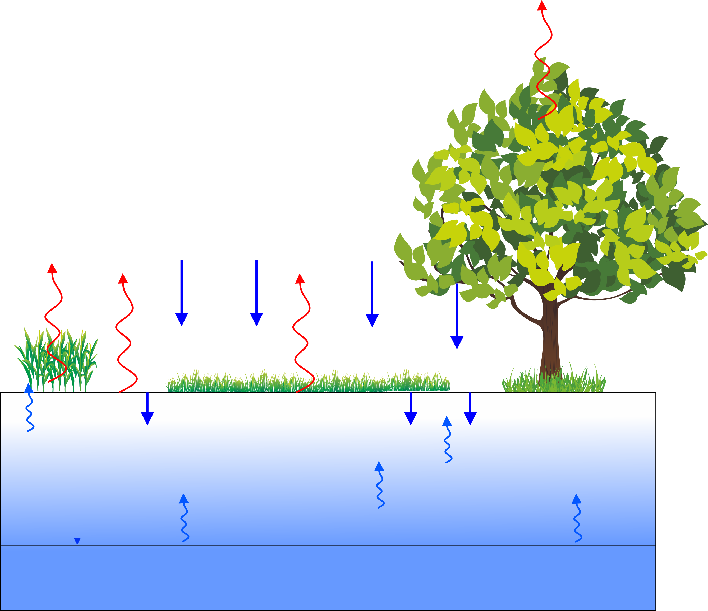
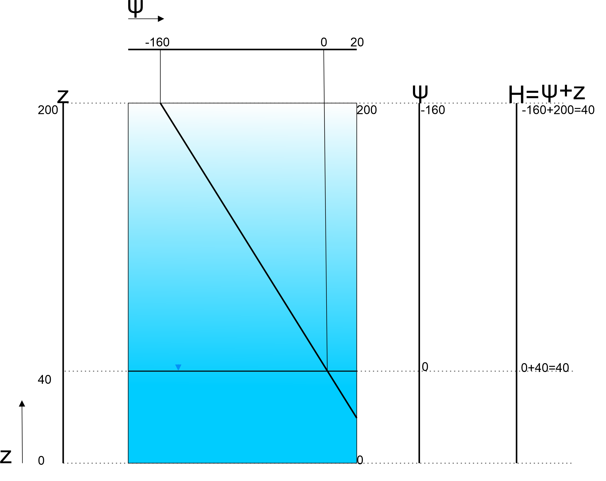

```{r echo=FALSE}
rm(list = ls())

#Check to see if package(s) are installed, install if not and then load

#pkgs is a vector of strings with length >= 1

CheckInstallPackages <- function(pkgs){

#For each pkg in pkgs (attempt to load each package one at a time):

 x <- lapply(pkgs, function(pkg){

  #Load the package if available,

  if(!do.call("require", list(pkg))) {

   #Silently attempt to install into the default library

   try(install.packages(pkg, lib=.Library,repos="http://cran.rstudio.com"))

   #Now attempt to load the package, catch error if it wasn't installed

   tryCatch(do.call("library", list(pkg)),

    #Catch if we're unable to install into the default library

    error = function(err) {

     #If non-interactive, install into this user's personal library

     if(!interactive()) {

      #Get the path to this user's personal library

      personalLibPath <- Sys.getenv("R_LIBS_USER")

      #If the personal library is not in the list of libraries

      if(is.na(match(personalLibPath, .libPaths()))) {

       #Then create the personal library

       dir.create(personalLibPath, recursive = TRUE)

       #And add the personal library to the list of libraries

       .libPaths(personalLibPath)

      }

      #Attempt to install the package into the personal library

      #If this fails, raise the error back to the report

      install.packages(pkg, lib=personalLibPath, repos="http://cran.rstudio.com")

      #Finally, attempt to load the package

      do.call("library", list(pkg))

 }})}})

} 
CheckInstallPackages(c("knitr","FVFE1D"))

load(file='Staring.Rdata')
# No further action needed if the code block runs without complaints.
```


## Learning goals
* Understand the setup of an unsaturated zone model (dimensions, flow type, boundary conditions) *(Introduction, exercise 3,5)*
* Understand the importance of non-linear hydraulic relationships *sections Introduction)*
* Understand the concept of equilibrium moisture profiles *section 2*
* Understand the effect of soil type, groundwater level and numerical method (FV vs FE) on the results of the transient unsaturated zone model *sections 3.1.2. extra assignments, 4.* 
* Understand the value of the simple unsaturated flow models in terms of water management (ponding, capillary rise, recharge to groundwater, plant water use)	*(sections 3,4,5 and 6)*
* Apply different top forcing functions *sections 5*
* Apply actual evapotranspiration using a Feddes function and understand the feedbacks involved in this *section 6*

## Introduction

The unsaturated zone is a very important interface between the groundwater system and the processes at the land surface. It stores precipitation, transports the excess to the groundwater, and can extract water (capillary rise) from the groundwater when the groundwater table is relatively shallow.  Figure 1 below illustrates these aspects.
<div align="center">


Figure 1: Unsaturated zone between soil surface and groundwater table. Red curly arrows are evaporation(soil) and transpirations(vegetation)fluxes. Blue arrows downwards are precipitation(large arrows) and infiltration(smal arrows) fluxes. Curly blue arrows indicate capillary rise/upward seepage. Black horizontal line with small arrow point marks the depth of the groundwater table where the saturated zone starts.
</div>

The moisture content in the unsaturated zone is very important for the vegetation on top, where it can transpire through plants or evaporate from the soil surface. In this way, the unsaturated zone provides moisture to the atmosphere.

Unsaturated water flow occurs in the zone between the soil surface and the (saturated) groundwater table. The flux in this part of the hydrological cycle is predominantly vertical. For that reason a 1D-model will be constructed along the vertical axis, denoted by z.

As in the saturated groundwater, water flow in the unsaturated zone can be calculated with a Darcy formula, where the water flow is driven by differences in the _hydraulic_ or _piezometric_ head. In the saturated models, we simply used the hydraulic head $H$ as the state variable. 

The hydraulic head $H$ is calculated as:  

$$
H = \psi + z\\
$$

With:  

$H$: Hydraulic head (m)  

$\psi$: Pressure head (m) and where $\psi=\frac{P}{\rho g}$

$z$: Elevation head (m)  

### Hydraulic head and Pressure head in the Saturated Zone

Figure 2 illustrates the relation between these variables. Imagine a bucket with a height of 1 meter and completely filled with water. The reference head (green line) equals 0.0 m at the bottom of the bucket, but the pressure head (red line) equals 1.0 m. The hydraulic head is a constant being 1.0 m (blue line). Suppose you would measure the pressure head at a height 0.20 m from the bottom. This would be 0.80 m (intersection point dashed line and red line). The elevation head is 0.20 m (intersection point dashed line and green line). Summing pressure head and elevation head results in the hydraulic head: $H=\psi+z=0.8+0.2=1.0 \, m$ over the whole depth.

<div align="center">


Figure 2: Elevation (green), pressure (red) and hydraulic (blue) head in a bucket.

</div>  

In the saturated zone pressure underneath the groundwater increases linearly since the water column above is increasing linearly as well.  
For the unsaturated zone things are a bit different.  

### Hydraulic head and Pressure head in the Unsaturated Zone

When one considers the hydraulic and pressure and datum in the unsaturated zone, pressure will most probably have a **negative** value. This can be interpreted as "suction".  The vegetation(through its roots) is capable to apply these negative pressure/suction to the soil to capture water and nutrients from it.  

Figure 3 illustrates the relation between hydraulic, pressure head and the datum for unsaturated condition where the pressure becomes negative (suction). The principle: $H=\psi + z$ however still holds.  


<div align="center">


Figure 3: Relation between hydraulic, pressure head and the datum for an unsaturated zone of 160 cm. Units are all in cm. Beware that this graph ilustrates an equilibrium situation where $q=0$

</div>

Summarising:  

* pressure heads $\psi$ in the unaturated zone are negative 
* flow is vertical ($q\uparrow$ in our simulations)
* hydraulic conductivity now depends on pressure


### Relation between Pressure head and Moisture content 

As mentioned in the introduction the unsaturated zone is very important voor the development of the vegetation and interacts with the atmosphere and groundwater in a very complicated way.  
The driving forces for water (actually vapour or moisture) movement in this zone is based on pressure head gradients. However, since the unsaturated zone is not fully saturated with water, the relation between the pressure head gradient and water(moisture) content is not linear. When suction at a certain position in a soil is high (large negative pressure), the amount of water at that position is low. Most of the water is 'sucked' out due to a large negative pressure.  The relation between negative pressure and moisture content depends strongly on the soil type and is not the same for a soil drying out and a rewetting soil (hysteresis). Hystersesis is neglected in these assignments.  

The plot below illustrates this relation for a loamy soil, which is based on the "van Genuchten (studied in Wageningen in the 60-70ties) equation" see for further details: https://en.wikipedia.org/wiki/Water_retention_curve

```{r}
soiltype = list(type=names(soil.set)) #all soils in a list
psi.pnt = seq(4,0,length.out=100) # required data points in pressure

psi.axis = seq(4,0,length.out=10)
k.axis = seq(0,50,length.out=10)
doplot = function(soiltype,nr)
{
#  old.par = par(no.readonly=TRUE)
#  par(mar=c(5,5,5,5))
  plot(soil.set[[soiltype$type[nr]]]$theta.fun(-10^psi.pnt),psi.pnt,
       type='l',lwd=3,col='blue',main = c('Soil moisture vs. pressure',
                                          soil.set[[soiltype$type[nr]]]$name),
       axes=F,xlab='',ylab='')
  
  theta.pnt = seq(soil.set[[soiltype$type[nr]]]$theta.res,
                  soil.set[[soiltype$type[nr]]]$theta.sat,length.out=10)
  axis(1)
  mtext(side=1,'moisture content (-)',line=2.5,cex=1.5)
  axis(2)
  mtext(side=2,'pF (-log(psi))',col='blue',line=2.5,cex=1.5)
  grid(col="black")
  # par(new=TRUE)
  # plot(soil.set[[soiltype$type[nr]]]$theta.fun(-10^psi.pnt),
  #      soil.set[[soiltype$type[nr]]]$k.fun(-10^psi.pnt),
  #      xlab="",ylab="",
  #      col='red',axes=FALSE,
  #      type="l",lwd=3)
  # 
  # axis(4)
  # mtext(side=4,'hydraulic conductivity (cm/d)',col='red',line=2.5,cex=1.5)
  box()
#  par(old.par)
}

doplot(soiltype,13) #coarse sand
```

### Internal flux in the unsaturated zone  

The equation describing the internal flux in the unsaturated zone strongly resembles the basic Darcy equation used in the previous assignments to simulate flow in the saturated zone. Most important differences are the hydraulic conductivity and the state;

$$
q=-k(\psi)\left [\frac{\partial \psi}{\partial z}+1 \right]
$$

For historical and practical reasons we generally work with units of cm and days.  
In this assignment, we will set $z=0 cm$ at the bottom of our domain, which coincides with the groundwater level. We will follow the (historical) convention to choose the z-direction upwards.  


<button class="collapsible">From Darcy's to Richards equation</button>
<div class="content">
Dary's equation only describes the movement of a fluid due to a state gradient and a variable describing the conductivity of the media(the soil) which is constant for saturated conditions.
The Richards (American soil physisist, 1904-1993) equation however is a balance equation containing a storage change term, the flow term and sources/sinks.  
Storage in the unsaturated zone depends on the amount of water (moisture) already pressent. The difference of the moisture content between two moments is the actually storage; hence: $\frac{\partial\theta}{\partial t}$  
The interne flux is described with 
$$
q = -k(\psi)\left[\frac{\partial H}{\partial z}\right]
$$ 
using $H=\psi+z$ gives:

$$
q=-k(\psi)\left[\frac{\partial \psi}{\partial z}+\frac{\partial z}{\partial z}\right]
$$
which reduces to:  

$$
q=-k(\psi)\left[\frac{\partial \psi}{\partial z}+1\right]
$$
Sources and Sinks are e.g. the precipitation from the atmospere, evapotranspiration from the soil and vegetation.

The transient balance equation, which is actually the Richards equation, is now:
$$
\frac{\partial \theta}{\partial t}=-k(\psi)\left[\frac{\partial \psi}{\partial z}+1\right]+S
$$
  
  
  

</div>
  

As illustrated in the derivation of the Richards equation the hydraulic head $H$ is replaced by the pressure head $\psi$. So the state of these models will be $\psi$ which is very practical since it's now relative to the domain and boundaries (and boundary conditions) of the model. In other words, a flow simulation within a loamy sand in the Flevopolder in the Netherlands will have the same results for the same situation in the Alps in Switzerland.
In these assignments we therefor will choose $\psi(z)$ as state variable, which is more practical than $H(z)$ which is linked to a certain reference level or datum.


<div class="exercise"> 
The Darcy formula for the internal flux in the unsaturated zone can now be expressed in terms of the pressure head ($\psi$) and the hydraulic conductivity.  
1. What is the most important difference between the 'saturated' and 'unsaturated' Darcy flux?
</div>

<div class="student_answer">
Fill in your answer here...
</div>

<div class="answer">
1. The hydraulic conductivity.  
For the saturated zone a constant $k_{sat}$ is used. For the unsaturated zone the hydraulic conducitivty is a function of pressure(suction) $k(\psi)$ or moisture content $k(\theta)$ as will be shown later on.  
The "$[..+1]$, between the brackets simply comes from the transformation from $H$ to $\psi$, as illustrated in the section "From Darcy's to Richards equation" 
</div>


Before constructing models for flow in the unsaturated zone, it is useful to make an overview of the units.

<div class="exercise">
2. Fill out the table.
</div>

<div class="student_answer">

quantity | unit 
----|----
$\psi$ | 
$\theta$ | 
$k$ | 
$z$ | 
time | 
internal flux | 
external flux | 
</div> 

<div class="answer">
2.
quantity | unit 
----|----
$\psi$ | $cm$
$\theta$ | -
$k$ | $cm/d$
$z$ | $cm$
time | $d$
internal flux | $cm/d$
external flux | $\int (/d)dx$ 
</div> 

## 1. Exploring the hydraulic relations  

Not all the quantities cited above are independent.
For each soil there are unique relations between $\theta$ , $\psi$ and $k$.  
You can explore these relations by running the R-script called **__soilprofiles.R__** separately. The data for the different soil types that are plotted are loaded from the file *Staring.Rdata*, which should be located in the same folder as the R-script.
Each soil has a code consisting of a letter (B = topsoil, O = deeper soil), a number and a description.  

Below the moisture/pressure/conductivity curves are shown for four different, and typical, soils: 

*   Coarse Sand B5/O5 
*   Loam B13/O14 
*   Heavy clay B11/O12 
*   Sandy Peat B16/O16  

The plots below illustrate the relations between moisture content ($\theta$) on the x-axis, the pressure/suction ($\psi$) on the first y-axis and the hydraulic condcutivity $k(\psi)$ or $k(\theta)$ on the secondary y-axis of these soils.
You can "read"  the graphs in the folllowing way: When you know the pressure, say $\psi=10 cm$ (pF=1), the soil (e.g. Coarse sand in the first graph) will have a moisture content of about 0.33. The hydraulic conductivity with this pressure (10 cm) and moisture content (about 0.33) will therefor be about 17-18 cm/d (draw a vertical line from the blue line at pF=1 up to the red line indicating the k at $\theta=0.33$ or $\psi=10$).  

What can also be seen from these graphs is the different degrees of non-linearity for pressure-moisture content relations and the different ranges of hydraulic conductivities.  


```{r, echo=FALSE}
soiltype = list(type=names(soil.set)) #all soils in a list
psi.pnt = seq(4,0,length.out=100) # required data points in pressure

psi.axis = seq(4,0,length.out=10)
k.axis = seq(0,50,length.out=10)
doplot = function(soiltype,nr)
{
  old.par = par(no.readonly=TRUE)
  par(mar=c(5,5,5,5))
  plot(soil.set[[soiltype$type[nr]]]$theta.fun(-10^psi.pnt),psi.pnt,
       type='l',lwd=3,col='blue',main = c('soil curves pF(theta) and k(theta)',
                                          soil.set[[soiltype$type[nr]]]$name,
                                          soil.set[[soiltype$type[nr]]]$soiltype),
       axes=F,xlab='',ylab='')
  
  theta.pnt = seq(soil.set[[soiltype$type[nr]]]$theta.res,
                  soil.set[[soiltype$type[nr]]]$theta.sat,length.out=10)
  axis(1)
  mtext(side=1,'moisture content (-)',line=2.5,cex=1.5)
  axis(2)
  mtext(side=2,'pF (-log(psi))',col='blue',line=2.5,cex=1.5)
  grid(col="black")
  par(new=TRUE)
  plot(soil.set[[soiltype$type[nr]]]$theta.fun(-10^psi.pnt),
       soil.set[[soiltype$type[nr]]]$k.fun(-10^psi.pnt),
       xlab="",ylab="",
       col='red',axes=FALSE,
       type="l",lwd=3)
  
  axis(4)
  mtext(side=4,'hydraulic conductivity (cm/d)',col='red',line=2.5,cex=1.5)
  box()
  par(old.par)
}

doplot(soiltype,5) #coarse sand
doplot(soiltype,13) #coarse sand
doplot(soiltype,11) #coarse sand
doplot(soiltype,16) #coarse sand
```

<div class="question">
3. Examine the abovementioned profiles for:  


* $k_{sat}$
* $k(\psi)$ and $\theta(\psi)$ at pF(2) which is called field capacity
* as 2 but now for pF(4.2) which is called welting point

At _field capacity_ the soil has optimal moisture conditions for vegetation  
At _welting point_ the soil is too dry for the vegetation to extract water  

Soil type | $k_{sat}$ | pF(2) $k(\psi)$ $\theta(\psi)$ | pF(4.2) $k(\psi)$ $\theta(\psi)$ |
----|----|----|----  
Coarse sand | | | | 
Loam | | | | 
Heavy clay | | | | 
Sandy peat | | | | 

</div>

<div class="hint">
<button type="button" onclick="showHint(3001)">Show Hint</button>
<p id="Q3001"> </p>
</div>

<br>

<div class="answer">
3. Saturated conductivties of these soils can be inspected through the graphs above or with some code like below:  

```{r}
list.soilcode=c("B5","B13","B11","B16")
for (n in list.soilcode)  
{
  print(paste((soil.set[[n]]$name),'; Ksat=', soil.set[[n]]$ksat, '; k(-100):',format(round(soil.set[[n]]$k.fun(-100),2),nsmall=2),
              ';theta(-100)',format(round(soil.set[[n]]$theta.fun(-100),2),nsmall=2),
              '; k(-16000)',format(round(soil.set[[n]]$k.fun(-16000),2),nsmall=2),
              ';theta(-16000)',format(round(soil.set[[n]]$theta.fun(-16000),2),nsmall=2)))
}
```

</div>


We will try to follow the convention that if we want to make a plot of e.g. the distribution of the soil moisture $\theta(z)$ in the soil column, $\theta$ is plotted on the horizontal axis and z on the vertical axis. Such a plot is called a *moisture profile*. A similar plot can be made for the water pressure head $\psi(z)$. The vertical distribution of $\psi(z)$ is called a *pressure profile*.


## 2. Exploring the equilibrium profiles 
Even when there is no flow through the soil, the situation is interesting. The corresponding profiles of $\psi$ and $\theta$ are called equilibrium profiles. 

For inspecting the data it is practical and convention that distributions of pressure head and moisture content are plotted with depth on the vertical axis and $\psi$ and $\theta$ on the horizontal axis. 

The code chunk below is mostly preprogrammed. It illustrates the pressure and moisture content profile at equilibrium with the groundwater for a certain soil. The surface level is set to 0.0 cm. Assume that the groundwater table is at 1 m (100 cm) depth. The internal flow is defined to be positive upwards.

<div class="exercise">
4. What are the boundary conditions at the lower (left) and upper (right) end of the domain? Fill out AA and BB in the chunk.  
5. Derive for the internal flux the differential equation for $\psi$ for the equilibrium situation. Use this to fill out XX and YY in the chunk.  
</div>

The variable **all.soil.codes** contains all available soil codes. You can also open the `soil.set` list in the environment to see the available information for the different soil types.

<div class="exercise">
6. Select one of the soils to plot the pressure and moisture content profile for the equilibrium situation.  
You need to remove **eval=FALSE** before the chunk can be run!
</div>

<div class="student_answer">
```{r eval=FALSE}
all.soil.codes = names(soil.set) #soil.set is the list with soil information created by soilprofiles.R. This includes the hydraulic relations theta(psi) and k(psi). These are stored in the functions k.fun and theta.fun per soil type.

domain = c(AA,BB)
z.seq = seq(from=domain[1],to=domain[2],length=50) #create nodes at 2 cm distance

#give the equilibrium pressure head profile (same for all soil types)
Psi.equi = approxfun(c(-100,0),c(XX,YY))
Psi.seq = Psi.equi(z.seq)

##Choose a particular soil:
soil.code = "B6" #B6= boulder clay
Soil = soil.set[[soil.code]]

##Calculate the moisture profile for this:
theta.seq = Soil$theta.fun(Psi.seq)

##Make a nice plot
old.par= par(no.readonly=TRUE)
par(mfrow=c(1,2))
plot(Psi.seq,z.seq,type="l",xlab="Psi",ylab="z",col="blue",lwd=2)
grid()
plot(theta.seq,z.seq,type="l",xlab="theta",ylab="z",col="red",lwd=2,
     xlim=c(0,Soil$theta.sat),
     main=)
# title(main=paste('tst', outer = TRUE)
title(main=paste('soil code', soil.code,'and name :',
      soil.set[[soil.code]]$name), line = -1,outer = TRUE) #, cex = 1.5)
grid()
par(old.par)
```
</div>

<div class="answer">
4. The domain runs from -100 cm (the groundwater table) to 0 cm (the ground surface).   
5. Because we have a no-flow situation with q=0 cm/d (soil moisture in equilibrium with the groundwater table), we can write $q(z)=-k(\psi) \left ( \frac{d\psi}{dz}+1 \right )=0$     
That means $\frac{d\psi}{dz}+1=0$       
and $\frac{d\psi}{dz}=-1$   
To describe the equilibrium profile for the pressure head $\psi$, we still need one boundary condition. This is given by the groundwater table: at x=-100 cm, $\psi$ is 0 cm.
That gives an equilibrium profile going from $\psi=0$ at x=-100 cm to $\psi=-100$ at x=0 cm.  
6. See code chunk  

```{r}
all.soil.codes = names(soil.set)

domain = c(-100,0)
z.seq = seq(from=domain[1],to=domain[2],length=50)

#give the equilibrium pressure head profile (same for all soil types)
Psi.equi = approxfun(c(-100,0),c(0,-100))
Psi.seq = Psi.equi(z.seq)

##Choose a particular soil:
soil.code = "B6"
Soil = soil.set[[soil.code]]

##Calculate the moisture profile for this:
theta.seq = Soil$theta.fun(Psi.seq)

##Make a nice plot
old.par= par(no.readonly=TRUE)
par(mfrow=c(1,2))
plot(Psi.seq,z.seq,type="l",xlab="Psi",ylab="z",col="blue",lwd=2)
grid()
plot(theta.seq,z.seq,type="l",xlab="theta",ylab="z",col="red",lwd=2,
     xlim=c(0,Soil$theta.sat))
title(main=paste('soil code', soil.code,'and name :',
      soil.set[[soil.code]]$name), line = -1,outer = TRUE) #, cex = 1.5)
grid()
par(old.par)
```
</div>  

<div class="exercise"> 
7. The pressure profile is the same for all soils. Can you explain why? 
</div> 

<div class="student_answer"> 
Fill in your answer here...
</div>

<div class="answer">
7. As determined earlier, when the water flux $q(z)=0$ cm/d, $\frac{d\psi}{dz}=-1$ which is just a constant. It simply means that when $z$ is increased by 1 cm, $\psi$ is increased by -1 cm. This is independent of the soil type.   
</div>

<div class="exercise">
8. What is the difference between an equilibrium situation and a stationary flow situation, for the unsaturated zone case?
</div>

<div class="answer">
8. For the unsaturated zone, equilibrium is the situation where there is no flow: there are no in- or outputs at the surface, and the pressure profile is such that the upward suction forces exactly balance the downward gravity forces.

A stationary flow situation occurs when the state variable (pressure or storage profile) does not change over time. That is, the inflows have reached a balance with the outflows. For the unsaturated zone, this means that the incoming precipitation surplus equals the downward percolation to the groundwater; or that the capillary rise from the groundwater equals the evaporation at the surface. 

The stationary models we built make use of this concept of inflow=outflow and storage change=0. However, also in transient models there may be temporary stationary conditions, for example when the inflow is constant for a while. For shallow groundwater tables the incoming flux and outgoing flux will then be the same (except for the sign) relatively fast. For large unsaturated zones stationary conditions may take much longer to develop, due to attenuation and delay. If the net inflow at the surface is zero, the transient model may also reach an equilibrium situation.
</div>

## 3. Stationary unsaturated zone model  
We start by building a stationary model for flow in the unsaturated zone. We want to find the soil moisture profile for a situation with a given groundwater level (located at the lower boundary of the domain) and a rain input of 1 mm/day. The soil type is coarse sand (B5) and we use a nodal spacing of 2 cm. 

The following code chunk is partly preprogrammed but still needs to be finished.

<div class="exercise">
9.     
*   fill out the missing parts (XXXX) in the chunk     
*   remove **eval=FALSE** from the header of the chunk      
*   run the chunk and analyse the results.  
</div>

<div class="student_answer">


```{r eval=FALSE}
################### soil type ###################
Soil = soil.set[["B5"]]
print(Soil$name) 

################ internal flux function #############
# define the internal flux function. 
# we use in this the k.fun function, which is already preprogrammed 
# in the Soil selected:
unsatdarcy.flux = function(z,psi,dpsidz)
{
  return(-Soil$k.fun(psi)*XXXX)
}

################### make the model #################
UnsatStat = newFLOW1D(domain,unsatdarcy.flux,"give me a nice name")

############## Boundary conditions ##################
# left = at the bottom (groundwater table)
set.BC.fixedstate(UnsatStat,"left",XXXX) #head at the bottom [cm]
# right = flux at the surface. Choose XXXX such 
# that it corresponds to 1 mm/day of recharge 
set.BC.fixedflux(UnsatStat,"right",XXXX) 

####### discretisation #####################
# position the nodes 2 cm apart
nodes = seq(from=domain[1],to=domain[2],by=XXXX)
set.discretisation(UnsatStat,nodes,"FV")
# An initialisation is certainly important (as the default initialisation by zero does not make sense here). 
# So we initialize with a no-flux profile:
Psi.equi = approxfun(c(domain[1],domain[2]),c(domain[2],domain[1]))
do.initialize(UnsatStat,Psi.equi)

# We want to avoid pressures to be too negative (<-1E-5)
Psi.in.range = function(z,Psi) # it has 2 arguments; the position and the state
{
  if(Psi<=-1E5) return(FALSE)
  else return(TRUE)
}
set.isacceptable(UnsatStat,Psi.in.range) #the set.isacceptable function limits the possible values that the state can become

######## checking and solving the model ####################
summary(UnsatStat)
solve.steps(UnsatStat,verboselevel=1)

######## plotting #############################
#we will create two plots, of the psi profile and the theta profile
Psi.seq = dataframe.states(UnsatStat)$state
z.seq = dataframe.states(UnsatStat)$x
Psi.equi.seq = Psi.equi(z.seq) # the equilibrium profile to compare with
Psi.range=range(Psi.seq,Psi.equi.seq)
theta.seq = Soil$theta.fun(Psi.seq)
old.par= par(no.readonly=TRUE)
par(mfrow=c(1,2)) #this creates two plots next to each other

plot(Psi.seq,z.seq,type="l",xlab="Psi",ylab="z",xlim=Psi.range,col="blue",lwd=2)
lines(Psi.equi.seq,z.seq,type="l",lty="dashed")
grid()
plot(theta.seq,z.seq,type="l",xlab="theta",ylab="z",col="red",lwd=2,
     xlim=c(0,Soil$theta.sat))
grid()
par(old.par)
mtext(paste(Soil$soiltype,"=",Soil$name),side=3,line=1)
#a plot of the internal fluxes gives additional insight:
plot(UnsatStat,fluxplot=T,vertical=T,FVstyle=T)
```
</div>

<div class="answer">
9. The missing parts should be filled in as follows:
```
unsatdarcy.flux = function(z,psi,dpsidz)
{
  return(-Soil$k.fun(psi)*(dpsidz+1))
}

set.BC.fixedstate(UnsatModel,"left",0.0)
# At the bottom of the model, where the groundwater level is located, both pressure head and elevation head are zero. 

set.BC.fixedflux(UnsatModel,"right",0.1)  
# 0.1cm/d=1mm/d. Although this flow is directed downwards, we define it positive because it goes into the domain.

nodes = seq(from=domain[1],to=domain[2],by=2)
``` 
The following chunk builds the stationary unsaturated zone model:
```{r echo=TRUE}
################### soil type ###################
Soil = soil.set[["B5"]]
print(Soil$name) 

################ internal flux function #############
# define the internal flux function. 
# we use in this the k.fun function, which is already preprogrammed 
# in the Soil selected:
unsatdarcy.flux = function(z,psi,dpsidz)
{
  return(-Soil$k.fun(psi)*(dpsidz+1))
}

################### make the model #################
UnsatStat = newFLOW1D(domain,unsatdarcy.flux,"Unsaturated zone, 1D stationary")

############## Boundary conditions ##################
# left = at the bottom (groundwater table)
set.BC.fixedstate(UnsatStat,"left",0.0) #Head at the bottom [cm]
# right = flux at the surface. Choose such 
# that it corresponds to 1 mm/day of recharge 
set.BC.fixedflux(UnsatStat,"right",0.1)  ##0.1cm/d=1mm/d. Although this flow is directed downwards, we define it positive because it goes into the domain.

####### discretisation #####################
# position the nodes 2 cm apart
nodes = seq(from=domain[1],to=domain[2],by=2)
set.discretisation(UnsatStat,nodes,"FV")
# An initialisation is certainly important (as the default initialisation by zero does not make sense here). 
# So we initialize with a no-flux profile:
Psi.equi = approxfun(c(domain[1],domain[2]),c(domain[2],domain[1]))
do.initialize(UnsatStat,Psi.equi)

# We want to avoid pressures to be too negative (<-1E-5)
Psi.in.range = function(z,Psi) # it has 2 arguments; the position and the state
{
  if(Psi<=-1E5) return(FALSE)
  else return(TRUE)
}
set.isacceptable(UnsatStat,Psi.in.range) #the set.isacceptable function limits the possible values that the state can become

######## checking and solving the model ####################
summary(UnsatStat)
solve.steps(UnsatStat,verboselevel=1)

######## plotting #############################
#we will create two plots, of the psi profile and the theta profile
Psi.seq = dataframe.states(UnsatStat)$state
z.seq = dataframe.states(UnsatStat)$x
Psi.equi.seq = Psi.equi(z.seq) # the equilibrium profile to compare with
Psi.range=range(Psi.seq,Psi.equi.seq)
theta.seq = Soil$theta.fun(Psi.seq)
old.par= par(no.readonly=TRUE)
par(mfrow=c(1,2)) #this creates two plots next to each other

plot(Psi.seq,z.seq,type="l",xlab="Psi",ylab="z",xlim=Psi.range,col="blue",lwd=2)
lines(Psi.equi.seq,z.seq,type="l",lty="dashed")
grid()
plot(theta.seq,z.seq,type="l",xlab="theta",ylab="z",col="red",lwd=2,
     xlim=c(0,Soil$theta.sat))
grid()
par(old.par)
mtext(paste(Soil$soiltype,"=",Soil$name),side=3,line=1)
#a plot of the internal fluxes gives additional insight:
plot(UnsatStat,fluxplot=T,vertical=T,FVstyle=T)
```

Here we are clearly not in a no-flow situation anymore: the $\psi$ profile diverts from the equilibrium profile. The topsoil is wetter than equilibrium, so there is downward flow (also visible in the flux plot). Note that the flux is constant with depth, which makes sense because the model is stationary.
The output shows also that iterations are needed: because of the moisture-dependent conductivity, the flow functions are not linear and cannot be solved in one step.
</div>

### 3.1. Simulation experiments

In this section you will examine two typical and important flow situations with modeling of flow in the unsaturated zone. Emphasis is put on numerical and hydrological aspect.
The first flow situation is the case of ponding where the amount of water entering the unsaturated zone cannot be fully transported downwards to the groundwater table.  
The second flow situation simulates the opposite, an upward flux from the groundwater up towards the surface due to evapotranspiration.  
To gain some extra insight in more numerical complexities during these flow situations please have a look at the **challenging exercise** in document **Assignment3_challenge.Rmd**.  

#### 3.1.1. The ponding case

In the previous model run the soil (Coarse sand) receives a recharge of 1 mm/d on top and has a prescribed state at 1 m below surface being the groundwater table.  
During storm events precipitation rates can be very high for certain moments.  What will happen with the flow simulation if such extreme events occur?

<div class="question">
10. Adjust the recharge rate of the previous model to such a value that ponding starts to occur at the surface.  
Do this for two soils; a coarse sand (B5) and a heavy clay (B11).  
What is this recharge rate for coarse sand and heavy clay?
</div>

<div class="answer">
10. The following chunk contains the model with a prescribed flux on top which just makes the model pond for the coarse sand case.  

```{r echo=TRUE}
################### soil type ###################
Soil = soil.set[["B5"]]
print(Soil$name) 

################ internal flux function #############
# define the internal flux function. 
# we use in this the k.fun function, which is already preprogrammed 
# in the Soil selected:
unsatdarcy.flux = function(z,psi,dpsidz)
{
  return(-Soil$k.fun(psi)*(dpsidz+1))
}

################### make the model #################
UnsatStat = newFLOW1D(domain,unsatdarcy.flux,"Unsaturated zone, 1D stationary")

############## Boundary conditions ##################
# left = at the bottom (groundwater table)
set.BC.fixedstate(UnsatStat,"left",0.0) #Head at the bottom [cm]
# right = flux at the surface. Choose such that a ponding situation occurs
#0.1cm/d=1mm/d. Although this flow is directed downwards, we define it positive because it goes into the domain.
set.BC.fixedflux(UnsatStat,"right",52.92) 

####### discretisation #####################
# position the nodes 2 cm apart
nodes = seq(from=domain[1],to=domain[2],by=2)
set.discretisation(UnsatStat,nodes,"FV")
# An initialisation is certainly important (as the default initialisation by zero does not make sense here). 
# So we initialize with a no-flux profile:
Psi.equi = approxfun(c(domain[1],domain[2]),c(domain[2],domain[1]))
do.initialize(UnsatStat,Psi.equi)

# We want to avoid pressures to be too negative (<-1E-5)
Psi.in.range = function(z,Psi) # it has 2 arguments; the position and the state
{
  if(Psi<=-1E5) return(FALSE)
  else return(TRUE)
}
set.isacceptable(UnsatStat,Psi.in.range) #the set.isacceptable function limits the possible values that the state can become

######## checking and solving the model ####################
summary(UnsatStat)
solve.steps(UnsatStat,verboselevel=1)

######## plotting #############################
#we will create two plots, of the psi profile and the theta profile
Psi.seq = dataframe.states(UnsatStat)$state
z.seq = dataframe.states(UnsatStat)$x
Psi.equi.seq = Psi.equi(z.seq) # the equilibrium profile to compare with
Psi.range=range(Psi.seq,Psi.equi.seq)
theta.seq = Soil$theta.fun(Psi.seq)
old.par= par(no.readonly=TRUE)
par(mfrow=c(1,2)) #this creates two plots next to each other

plot(Psi.seq,z.seq,type="l",xlab="Psi",ylab="z",xlim=Psi.range,col="blue",lwd=2)
lines(Psi.equi.seq,z.seq,type="l",lty="dashed")
grid()
plot(theta.seq,z.seq,type="l",xlab="theta",ylab="z",col="red",lwd=2,
     xlim=c(0,Soil$theta.sat))
grid()
par(old.par)
mtext(paste(Soil$soiltype,"=",Soil$name),side=3,line=1)
#a plot of the internal fluxes gives additional insight:
plot(UnsatStat,fluxplot=T,vertical=T,FVstyle=T)
```

  
 results for coarse sand, heavy clay and some other soil types:
 
Ponding B soils | Coarse sand | Loam | Heavy clay | Sandy peat | 
----|----|----|----|----|  
recharge rate in cm/d and water table at 1 m | 52.92 | 12.98 | 4.53 | 6.79 | 

</div>


<div class="question">
11. The amount of recharge (through the upper boundary condition) applied to make the model pond, is a tiny fraction larger than the saturated hydraulic conductivity. Could you explain why?
</div>
<div class="answer">
11. When the flux rate is higher than the hydraulic conductivity the model will have a ponding situation. It cannot distribute more water under unsaturated conditions.  When this 'just' happens, it means that $\psi=0$ at the surface or that $\psi \gt 0$, in which the groundwater table has risen above the surface.  
Inspecting the moisture content graph also indicates that the profile is completely saturated.
</div>

<div class="question">
12. Calculate, with your pocket calclutor, the state ($\psi$) at the surface for a situation where you have recharge at the top 1.1 times the saturated hydraulic conductivity of that soil.  
After you have finished your own calculations you can check the results with the model adjusting the recharge to 1.1*Soil\$B5\$ksat in the previous chunk.  
</div>

<div class="student_answer">
type your answer for 12. here
..................
</div>

<div class="answer">
12. Simply apply the internal flux to derive the answer;  
$$
q = -k(\psi)\left[  \frac{\partial \psi}{\partial z}+1 \right] \\
q=1.1 k_{sat}\\
k(\psi)=k_{sat}\\
1.1k_{sat}=k_{sat} \left[\frac{\psi_{w.table}-\psi_{surf.}}{-100 -0}+1 \right]\\
1.1=\frac{\psi_{w.table}-\psi_{surf.}}{-100 -0}+1 \\
0.1=\frac{0-\psi_{surf.}}{-100 -0} \\
\psi_{surf.}=10
$$
</div>


<div class="question">
13. Now extend the domain of the model from 1.0 m to 2.0 m and rerun these two (B5 and B11) models with the same 'forcing' (amount of recharge on top).  
Can you already deduce what the results would be, before actually simulating it?
</div>

<div class="answer">
13. Since the simulations are in steady state, no storage change is considered. The amount of recharge entered at the top will be discharged at bottem (at the groundwater table). It will thus result in the same pressure and moisture distribution.

The chunk below (just a copy of the previous one but now for heavy clay) shows the actual results.

```{r echo=TRUE}
################### soil type ###################
Soil = soil.set[["B12"]]
print(Soil$name) 

################### extended domain ###############
domain = c(-200,0)

################ internal flux function #############
# define the internal flux function. 
# we use in this the k.fun function, which is already preprogrammed 
# in the Soil selected:
unsatdarcy.flux = function(z,psi,dpsidz)
{
  return(-Soil$k.fun(psi)*(dpsidz+1))
}

################### make the model #################
UnsatStat = newFLOW1D(domain,unsatdarcy.flux,"Unsaturated zone, 1D stationary")


############## Boundary conditions ##################
# left = at the bottom (groundwater table)
set.BC.fixedstate(UnsatStat,"left",0.0) #Head at the bottom [cm]
# right = flux at the surface. Choose such that a ponding situation occurs
#0.1cm/d=1mm/d. Although this flow is directed downwards, we define it positive because it goes into the domain.
set.BC.fixedflux(UnsatStat,"right",1.01*Soil$ksat)

####### discretisation #####################
# position the nodes 2 cm apart
nodes = seq(from=domain[1],to=domain[2],by=2)
set.discretisation(UnsatStat,nodes,"FV")
# An initialisation is certainly important (as the default initialisation by zero does not make sense here). 
# So we initialize with a no-flux profile:
Psi.equi = approxfun(c(domain[1],domain[2]),c(domain[2],domain[1]))
do.initialize(UnsatStat,Psi.equi)

# We want to avoid pressures to be too negative (<-1E-5)
Psi.in.range = function(z,Psi) # it has 2 arguments; the position and the state
{
  if(Psi<=-1E5) return(FALSE)
  else return(TRUE)
}
set.isacceptable(UnsatStat,Psi.in.range) #the set.isacceptable function limits the possible values that the state can become

######## checking and solving the model ####################
summary(UnsatStat)
solve.steps(UnsatStat,verboselevel=1)

######## plotting #############################
#we will create two plots, of the psi profile and the theta profile
Psi.seq = dataframe.states(UnsatStat)$state
z.seq = dataframe.states(UnsatStat)$x
Psi.equi.seq = Psi.equi(z.seq) # the equilibrium profile to compare with
Psi.range=range(Psi.seq,Psi.equi.seq)
theta.seq = Soil$theta.fun(Psi.seq)
old.par= par(no.readonly=TRUE)
par(mfrow=c(1,2)) #this creates two plots next to each other

plot(Psi.seq,z.seq,type="l",xlab="Psi",ylab="z",xlim=Psi.range,col="blue",lwd=2)
lines(Psi.equi.seq,z.seq,type="l",lty="dashed")
grid()
plot(theta.seq,z.seq,type="l",xlab="theta",ylab="z",col="red",lwd=2,
     xlim=c(0,Soil$theta.sat))
grid()
par(old.par)
mtext(paste(Soil$soiltype,"=",Soil$name),side=3,line=1)
#a plot of the internal fluxes gives additional insight:
plot(UnsatStat,fluxplot=T,vertical=T,FVstyle=T)
```

 Results for the same soil types with a soil depth of 1.0 and 2.0 m:
 
 Ponding (B soils) | Coarse sand | Loam | Heavy clay | Sandy peat | 
----|----|----|----|----|  
max. recharge and water table at 1 m | 52.92 | 12.98 | 4.53 | 6.79 | 
max. recharge and water table at 2 m | 52.92 | 12.98 | 4.53 | 6.79 |
</div>

<div class="question">
14. Can you explain why the state distributions in the ponding cases are all linear?
</div>

<div class="student_answer">
14. type your answer here.  
................
</div>

<div class="answer">
14. $\frac{\partial \psi}{\partial z}$ is now constant, thus the state distribution is linear because the internal flux is now switched to a linear type of equation since the  $k=k_{sat}$ has become a constant. 
</div>


#### 3.1.2. The capillary rise case

During periods where net evapotranspiration exceeds the net precipitation, the amount of water in the unsaturated zone will be used by the vegetation to transpire and by the upper part of the soil to evaporate. As a consequence the amount of moisture ($\theta$) reduces in the upper part of the soil creating a larger suction at this location. The lower pressure/higher suction (more negative) generates an upwards flux repleneshing the upper part of the soil. The upward flux is called capillary rise.  

<div class="question">
15. Copy the previous chunk to this location, set the domain back to -100, 0 cm.  Now start with an outgoing flux at the top of 0.5 mm/d (capillary rise) continue increasing the evapotranspiration until the model does not converge (find a solution) anymore.
Do this for both a coarse sand B5 and a loam B13 soil.  
Try to explain the pressure gradient resulting from these flow simulations.  
What is the max. applicable amount of upward seepage for both soil types.  
Fill out the table below with your resusts  
When enough time do the same simulation with a groundwater table at 2.0 m below surface.

Capillary rise | Coarse sand | Loam |
----|----|----  
cap. rise in cm/d and water table at 1 m | | |  
cap. rise in cm/d and water table at 2 m | | |   

</div>

<div class="answer">
15. Below the copied and adjusted code chunk for the capillary rise cases.  

```{r echo=TRUE}
################### soil type ###################
Soil = soil.set[["B16"]]
print(Soil$name) 

################### extended domain ###############
domain = c(-100,0)

################ internal flux function #############
# define the internal flux function. 
# we use in this the k.fun function, which is already preprogrammed 
# in the Soil selected:
unsatdarcy.flux = function(z,psi,dpsidz)
{
  return(-Soil$k.fun(psi)*(dpsidz+1))
}

################### make the model #################
UnsatStat = newFLOW1D(domain,unsatdarcy.flux,"Unsaturated zone, 1D stationary")


############## Boundary conditions ##################
# left = at the bottom (groundwater table)
set.BC.fixedstate(UnsatStat,"left",0.0) #Head at the bottom [cm]
# right = flux at the surface. Choose such that a ponding situation occurs
#0.1cm/d=1mm/d. Although this flow is directed downwards, we define it positive because it goes into the domain.
set.BC.fixedflux(UnsatStat,"right",-0.225)

####### discretisation #####################
# position the nodes 2 cm apart
nodes = seq(from=domain[1],to=domain[2],by=2)
set.discretisation(UnsatStat,nodes,"FV")
# An initialisation is certainly important (as the default initialisation by zero does not make sense here). 
# So we initialize with a no-flux profile:
Psi.equi = approxfun(c(domain[1],domain[2]),c(domain[2],domain[1]))
do.initialize(UnsatStat,Psi.equi)

# We want to avoid pressures to be too negative (<-1E-5)
Psi.in.range = function(z,Psi) # it has 2 arguments; the position and the state
{
  if(Psi<=-1E5) return(FALSE)
  else return(TRUE)
}
set.isacceptable(UnsatStat,Psi.in.range) #the set.isacceptable function limits the possible values that the state can become

######## checking and solving the model ####################
summary(UnsatStat)
solve.steps(UnsatStat,verboselevel=1)

######## plotting #############################
#we will create two plots, of the psi profile and the theta profile
Psi.seq = dataframe.states(UnsatStat)$state
z.seq = dataframe.states(UnsatStat)$x
Psi.equi.seq = Psi.equi(z.seq) # the equilibrium profile to compare with
Psi.range=range(Psi.seq,Psi.equi.seq)
theta.seq = Soil$theta.fun(Psi.seq)
old.par= par(no.readonly=TRUE)
par(mfrow=c(1,2)) #this creates two plots next to each other

plot(Psi.seq,z.seq,type="l",xlab="Psi",ylab="z",xlim=Psi.range,col="blue",lwd=2)
lines(Psi.equi.seq,z.seq,type="l",lty="dashed")
grid()
plot(theta.seq,z.seq,type="l",xlab="theta",ylab="z",col="red",lwd=2,
     xlim=c(0,Soil$theta.sat))
grid()
par(old.par)
mtext(paste(Soil$soiltype,"=",Soil$name),side=3,line=1)
#a plot of the internal fluxes gives additional insight:
plot(UnsatStat,fluxplot=T,vertical=T,FVstyle=T)
```
  
When you extract water from the top, the model will try to balance this with an upward flux from the lower boundary. Due to the lower amount of water in the top hydraulic conductivities there reduce rapidly. To balance this situation extremely low pressures at the surface are required which may be below the 'realistic minimum' (<-1E-5) that we have set.  
The highest evaporation flux at the top that still gives a solution can be seen as the maximum capillary rise.  

Below a table with max. cap. rise for four diferent soils.  

Capillary rise | Coarse sand | Loam | Heavy clay | Sandy peat | 
----|----|----|----|----|  
cap. rise in cm/d and water table at 1 m | 0.095 | 1.8 | 0.052 | 0.225 |  

As can be seen from these experiments, a loamy soil can deliver a substantial amount water through capilary rise to replenish the upper part of the soil. A favoured soil for agricultural purposes...


</div>


<div class="question">
16. Determining the cap. rise flux in the previous exericse was based on the models 'crash'. Here you can experiment with different numerical aspects to see whether this alters the cap. rise fluxes.  
Replace the numerical technique from Finite Volumes (FV) to Finte Elements (FE) and rerun the same problem.
Put down the new values for cap.rise in the table below and compare it with the "FV" approach.

Capillary rise | Coarse sand | Loam | 
----|----|----|----|----|  
cap. rise in cm/d with FV approach | | |
cap. rise in cm/d with FE approach | | |

</div>

<div class="answer">
16. Since this is an integral technique, using a redistribution technique between the nodes, results could be smoother. This could be important in situations with strong linearity, like $k(\psi)$ for most soils.  

```{r echo=TRUE}
################### Soil type ###################
Soil = soil.set[["B16"]]
print(Soil$name) 

################### extended domain ###############
domain = c(-100,0)

################ internal flux function #############
# define the internal flux function. 
# we use in this the k.fun function, which is already preprogrammed 
# in the Soil selected:
unsatdarcy.flux = function(z,psi,dpsidz)
{
  return(-Soil$k.fun(psi)*(dpsidz+1))
}

################### make the model #################
UnsatStat = newFLOW1D(domain,unsatdarcy.flux,"Unsaturated zone, 1D stationary")


############## Boundary conditions ##################
# left = at the bottom (groundwater table)
set.BC.fixedstate(UnsatStat,"left",0.0) #Head at the bottom [cm]
# right = flux at the surface. Choose such that a ponding situation occurs
#0.1cm/d=1mm/d. Although this flow is directed downwards, we define it positive because it goes into the domain.
set.BC.fixedflux(UnsatStat,"right",-0.228)

####### discretisation #####################
# position the nodes 2 cm apart
nodes = seq(from=domain[1],to=domain[2],by=2)
set.discretisation(UnsatStat,nodes,"FE")
# An initialisation is certainly important (as the default initialisation by zero does not make sense here). 
# So we initialize with a no-flux profile:
Psi.equi = approxfun(c(domain[1],domain[2]),c(domain[2],domain[1]))
do.initialize(UnsatStat,Psi.equi)

# We want to avoid pressures to be too negative (<-1E-5)
Psi.in.range = function(z,Psi) # it has 2 arguments; the position and the state
{
  if(Psi<=-1E5) return(FALSE)
  else return(TRUE)
}
set.isacceptable(UnsatStat,Psi.in.range) #the set.isacceptable function limits the possible values that the state can become

######## checking and solving the model ####################
summary(UnsatStat)
solve.steps(UnsatStat,verboselevel=1)

######## plotting #############################
#we will create two plots, of the psi profile and the theta profile
Psi.seq = dataframe.states(UnsatStat)$state
z.seq = dataframe.states(UnsatStat)$x
Psi.equi.seq = Psi.equi(z.seq) # the equilibrium profile to compare with
Psi.range=range(Psi.seq,Psi.equi.seq)
theta.seq = Soil$theta.fun(Psi.seq)
old.par= par(no.readonly=TRUE)
par(mfrow=c(1,2)) #this creates two plots next to each other

plot(Psi.seq,z.seq,type="l",xlab="Psi",ylab="z",xlim=Psi.range,col="blue",lwd=2)
lines(Psi.equi.seq,z.seq,type="l",lty="dashed")
grid()
plot(theta.seq,z.seq,type="l",xlab="theta",ylab="z",col="red",lwd=2,
     xlim=c(0,Soil$theta.sat))
grid()
par(old.par)
mtext(paste(Soil$soiltype,"=",Soil$name),side=3,line=1)
#a plot of the internal fluxes gives additional insight:
plot(UnsatStat,fluxplot=T,vertical=T)
```

  
Capillary rise | Coarse sand | Loam | Heavy clay | Sandy peat | 
----|----|----|----|----|  
cap. rise in cm/d with FV approach | 0.095 | 1.8 | 0.052 | 0.225 |  
cap. rise in cm/d with FE approach | 0.099 | 1.84 |0.0522 | 0.228 |  

Results do not differ that much but with the FE technique the amount of cap.rise could be increased a bit.  
One of the reasons is the extreme low pressure for which the hydraulic conductivity is calculated.  The most changes of k as a function of $\psi$ is most of the time in the range of pF 2-2.5 (coarse estimate) so in the $\psi$ scale between `r -10^2` and `r -10^2.5`, which is much less negative than the range at the top of the models which is in the order of `r -10^4.7` and `r -10^4.9`.

</div>


## 4. Transient unsaturated zone model
One of the key aspects of a transient model is the introduction of a **storage term** in the simulations. Similar to the previous transient models you built, storage change takes place between the previous and current time step. Now the change in storage can directly be calculated by the difference in moisture content between timesteps.  
The chunk below contains a script for running a transient unsaturated zone model. A few aspects still need to be implemented by yourself.

<div class="exercise"> 
17.     
* Add headings or comments at the lines starting with ##  
* Finish the **changeinstorage** function  
* The top forcing (precipitation surplus) is initially set at 0. Later on, a time dependent top forcing is created. This function results in precipitation for the time until T1, followed by evaporation between T1 and T2, and zero top forcing from T2 to the end.  

For the **changeinstorage** function, have a look at the soil properties and functions through `names(Soil)` or `soil.set[["B5"]]$` where you can replace the B5 for another soil type.

Remove "eval=FALSE", so you can run the chunk. The animations that will be created will probably not display in the previewer window in Rstudio. Go to the directory where the knitted html-file is saved and open it in Google Chrome. If it is still not working, check if you have the 'ffmpeg' programme in the same folder as the markdown (this executable is available on Brightspace). This programme is needed for the animations.
</div>

<div class="student_answer">
```{r animation0, eval=FALSE, fig.show='animate', aniopts='controls'}
## Script to setup a transient flow model of the unsaturated zone
domain = c(-50,0)
dz=1

## 
Soil = soil.set[["B5"]]
print(Soil$name)

##
unsatdarcy.flux = function(z,psi,dpsidz)
{
  return(-Soil$k.fun(psi)*(dpsidz+1))
}

##
# COMPLETE THIS FUNCTION
# in this, let oldpsifun(x) stand for the old pressure at x
changeinstorage = function(x,psi)
{
  
}

## This will be the initial profile, corresponding to ....
## 
Psi.equi = approxfun(c(domain[1],domain[2]),c(domain[2],domain[1]))

##
UnsatTrans = newFLOW1D(domain,unsatdarcy.flux,name="Unsaturated zone, transient")

##
add.spatialflux(UnsatTrans,changeinstorage,"change in storage") #storage flux in cm/d

##
set.BC.fixedstate(UnsatTrans,"left",0) #hydraulic head at the bottom [cm]

## Here we use a string as the value of a boundary condition, the package will use the value of the 
## variable with that name (see also help)
##
topforcing = 0 #flux at the top in cm/d
set.BC.fixedflux(UnsatTrans,"right","topforcing")

##
nodes = seq(from=domain[1],to=domain[2],by=dz)
set.discretisation(UnsatTrans,nodes,"FV")

##
Psi.in.range = function(z,Psi) 
{
  if(Psi<=-1E5) return(FALSE)
  else return(TRUE)
}
set.isacceptable(UnsatTrans,Psi.in.range)

## The first forcing function
T1 = 1 #times in days
T2 = 2

forcing.fun = function(time)
{
  if(time<T1)
    {
      return(1)
    } else if(time <T2)
    {
      return(-0.1)
    } else
    {
    return(0)
    }
}

## The second forcing function (use later)
# source("topforcing.R")
# forcing.fun = function(time)
# {
#   return(rainfun(time)-evapfun(time))
# }

##
summary(UnsatTrans)

##
begin.time = 0 
end.time = 100
delt = 1/24 #time step in days
time = begin.time+delt

##
do.initialize(UnsatTrans,Psi.equi)
oldpsifun = Psi.equi

##
psi.atsurface = c() 
savestorage = c()
savepercolation = c()

while(time < end.time)
{
  topforcing = forcing.fun(time)
  
  control=solve.steps(UnsatTrans)
  
  curresult = dataframe.states(UnsatTrans)
  ##
  psi.atsurface = c(psi.atsurface,curresult$state[length(nodes)])
  savestorage = c(savestorage,dataframe.balance(UnsatTrans)[2,4])
  savepercolation = c(savepercolation,dataframe.boundaries(UnsatTrans)[1,4])
  
  Psi.seq = dataframe.states(UnsatTrans)$state
  z.seq = dataframe.states(UnsatTrans)$x
  Psi.equi.seq = Psi.equi(z.seq)
  Psi.range=range(Psi.seq,Psi.equi.seq)
  theta.seq = Soil$theta.fun(Psi.seq)
  old.par= par(no.readonly=TRUE)
  par(mfrow=c(1,2))
  
  plot(Psi.seq,z.seq,type="l",xlab="Psi",ylab="z",xlim=Psi.range,
       main=paste("time=",round(time,2)), col="blue",lwd=2)
  lines(Psi.equi.seq,z.seq,type="l",lty="dashed")
  grid()
  plot(theta.seq,z.seq,type="l",xlab="theta",ylab="z",
       main=paste(Soil$soiltype,"=",Soil$name), col="red",lwd=2,
       xlim=c(Soil$theta.res,Soil$theta.sat))
  grid()
  par(old.par)
  
  Sys.sleep(0.1)
  time = time+delt

  oldpsifun = approxfun(curresult$x,curresult$state,rule=2)
}

##saving storage and percolation to the groundwater for different soil types

if (Soil$soiltype == "B5") 
{
  savestorage.B5 = savestorage
  savepercolation.B5 = savepercolation
}

if (Soil$soiltype == "B11")
{
  savestorage.B11 = savestorage
  savepercolation.B11 = savepercolation
}
```
</div>

<div class="answer">
17. The storage change is the change in moisture content; $\frac{\partial \theta}{\partial t}$. The storage function can now be written as: $-\frac{\theta(\psi^{new})-\theta(\psi^{old})}{\Delta t}$. The moisture content can be derived using the __Soil$theta.fun()__ function which is a function of the calculated state $\psi$.    
The storage change can then be implemented as follows:    
```
changeinstorage = function(x,psi)
  {
  Qsto = -(Soil$theta.fun(psi) - Soil$theta.fun(oldpsifun(x)))/delt
  return(Qsto)
  }
```
The following chunk implements the transient unsaturated model.
```{r animation1, echo=FALSE, fig.show='animate', aniopts='controls'}
## Script to setup a transient flow model of the unsaturated zone
##SETS THE DOMAIN OF THE MODEL, IN THIS CASE WATER TABLE AT 50 CM BELOW SURFACE
## ------------------------------------------------------------------------
domain = c(-50,0)
dz=1
##THE SOIL(TYPE)
## ------------------------------------------------------------------------
Soil = soil.set[["B5"]]
print(Soil$name)
##THE INTERNAL FLUX
## ------------------------------------------------------------------------
unsatdarcy.flux = function(z,psi,dpsidz)
{
  return(-Soil$k.fun(psi)*(dpsidz+1))
}

##
## ------------------------------------------------------------------------

# COMPLETE THIS FUNCTION
# in this, let oldpsifun(x) stand for the old pressure at x
# 
changeinstorage = function(x,psi)
{
  Qsto = -(Soil$theta.fun(psi) - Soil$theta.fun(oldpsifun(x)))/delt
  return(Qsto)
}

## This will be the initial profile, corresponding to ....EQUILIBRIUM -> q=0 m/d
## ------------------------------------------------------------------------
Psi.equi = approxfun(c(domain[1],domain[2]),c(domain[2],domain[1]))

##THE NEW TRANSIENT MODEL
## ------------------------------------------------------------------------
UnsatTrans = newFLOW1D(domain,unsatdarcy.flux, name="Unsaturated zone, transient")

## ------------------------------------------------------------------------
##ADDING THE STORAGE FLUX
add.spatialflux(UnsatTrans,changeinstorage,"change in storage") #storage flux in cm/d

##SETTING THE BOUNDARY CONDITION AT THE WATER TABLE; FIXED STATE = 0 cm
## ------------------------------------------------------------------------
set.BC.fixedstate(UnsatTrans,"left",0) #head at the bottom [cm]

## Here we use a string as value, referring the actual value of the 
## variable with that name (see also help)
##ADDING A FIXED FLUX BOUNDARY CONDITION AT THE TOP OF THE MODEL
## ------------------------------------------------------------------------
topforcing = 0
set.BC.fixedflux(UnsatTrans,"right","topforcing") #flux at the top of the model in cm/d

##DISCRETISE THE MODEL WITH NODES, NODAL SPACING OF 1 CM, USING FINITE VOLUMES (FOR NOW)
## ------------------------------------------------------------------------
nodes = seq(from=domain[1],to=domain[2],by=dz)
set.discretisation(UnsatTrans,nodes,"FV")

##KEEPING THE MODEL STABLE: ALLOW ONLY SENSIBLE VALUES 
## ------------------------------------------------------------------------
Psi.in.range = function(z,Psi) 
{
  if(Psi<=-1E5) return(FALSE)
  else return(TRUE)
}
set.isacceptable(UnsatTrans,Psi.in.range)

##------------------------------------------------------------------------
## The first forcing function
T1 = 1 #times in days
T2 = 2

forcing.fun = function(time)
{
  if(time<T1)
  {
    return(1)
  } else if(time <T2)
  {
    return(-0.1)
  } else
  {
    return(0)
  }
}

## The second forcing function
##------------------------------------------------------------------------
# source("topforcing.R")
# forcing.fun = function(time)
# {
#   return(rainfun(time)-evapfun(time))
# }

#CHECKING
summary(UnsatTrans)

##TIME DISCRETISATION 
## ------------------------------------------------------------------------
begin.time = 0
end.time = 5 #100 smaller run period for html
delt = 0.5 ##1/24 larger delt for html 
time = begin.time+delt

##STARTING THE SIMULATIONS
## ------------------------------------------------------------------------
do.initialize(UnsatTrans,Psi.equi)

oldpsifun = Psi.equi

## STORING VALUES 
## ----------------------------------------------------------------------
psi.atsurface = c() #to keep track of psi at surface
savestorage = c()
savepercolation = c()

## RUN THE MODEL WITH A LOOP AND PLOT
## -----------------------------------------------------------------------
while(time < end.time)
{
  topforcing = forcing.fun(time)
  
  control=solve.steps(UnsatTrans)
  
  curresult = dataframe.states(UnsatTrans)
  ##saving intermediate results
  psi.atsurface = c(psi.atsurface,curresult$state[length(nodes)])
  savestorage = c(savestorage,dataframe.balance(UnsatTrans)[2,4])
  savepercolation = c(savepercolation,dataframe.boundaries(UnsatTrans)[1,4])
  #percolation: the flux leaving the domain at the bottom
  Psi.seq = dataframe.states(UnsatTrans)$state
  z.seq = dataframe.states(UnsatTrans)$x
  Psi.equi.seq = Psi.equi(z.seq)
  Psi.range=range(Psi.seq,Psi.equi.seq)
  theta.seq = Soil$theta.fun(Psi.seq)
  old.par= par(no.readonly=TRUE)
  par(mfrow=c(1,2))
  
  plot(Psi.seq,z.seq,type="l",xlab="Psi",ylab="z",xlim=Psi.range,
       main=paste("time=",round(time,2)), col="blue",lwd=2)
  lines(Psi.equi.seq,z.seq,type="l",lty="dashed")
  grid()
  plot(theta.seq,z.seq,type="l",xlab="theta",ylab="z",
       main=paste(Soil$soiltype,"=",Soil$name), col="red",lwd=2,
       xlim=c(Soil$theta.res,Soil$theta.sat))
  grid()
  par(old.par)
  
  Sys.sleep(0.1)
  time = time+delt

  oldpsifun = approxfun(curresult$x,curresult$state,rule=2)
}

##saving storage and percolation to the groundwater for different soil types

if (Soil$soiltype == "B5") 
{
  savestorage.B5 = savestorage
  savepercolation.B5 = savepercolation
}

if (Soil$soiltype == "B11")
{
  savestorage.B11 = savestorage
  savepercolation.B11 = savepercolation
}
```
</div>

<div class= "exercise">    
18. Change the soil type. How does the soil moisture behaviour change?    
Make sure that when you make a new chunk that should do an animation, also copy `fig.show='animate', aniopts='controls'` into the upper line of the chunk.    
19. Change the method into Finite Elements. What changes do you observe? 
</div>

<div class="answer">
18. This chunk runs the model with soil B11, heavy clay.
```{r animation2, echo=FALSE, fig.show='animate', aniopts='controls'}
###Running with another soil type: B11 heavy clay
UnsatTrans_Clay=copy.model(UnsatTrans)
set.name(UnsatTrans_Clay, "Unsaturated zone, transient with clay soil")
##Check if everything is the way you want
summary(UnsatTrans_Clay)

##THE SOIL(TYPE)
Soil = soil.set[["B11"]]

##TIME DiSCRETISATION 
## ------------------------------------------------------------------------
begin.time = 0
end.time = 5 #100 smaller run period for html
delt = 0.5 ##1/24 larger delt for html
time = begin.time+delt

##SIMULATING AND PLOTTING
## ------------------------------------------------------------------------
do.initialize(UnsatTrans_Clay,Psi.equi)
oldpsifun = Psi.equi

psi.atsurface = c() #to keep track of psi at surface
savestorage = c()
savepercolation = c()

while(time < end.time)
{
  topforcing = forcing.fun(time)
  
  control=solve.steps(UnsatTrans_Clay)
  
  curresult = dataframe.states(UnsatTrans_Clay)
  ##saving intermediate results
  psi.atsurface = c(psi.atsurface,curresult$state[length(nodes)])
  savestorage = c(savestorage,dataframe.balance(UnsatTrans_Clay)[2,4])
  savepercolation = c(savepercolation,dataframe.boundaries(UnsatTrans_Clay)[1,4])
  ##saving intermediate results
  Psi.seq = dataframe.states(UnsatTrans_Clay)$state
  z.seq = dataframe.states(UnsatTrans_Clay)$x
  Psi.equi.seq = Psi.equi(z.seq)
  Psi.range=range(Psi.seq,Psi.equi.seq)
  theta.seq = Soil$theta.fun(Psi.seq)
  old.par= par(no.readonly=TRUE)
  par(mfrow=c(1,2))
  
  plot(Psi.seq,z.seq,type="l",xlab="Psi",ylab="z",xlim=Psi.range,
       main=paste("time=",round(time,2)), col="blue",lwd=2)
  lines(Psi.equi.seq,z.seq,type="l",lty="dashed")
  grid()
  plot(theta.seq,z.seq,type="l",xlab="theta",ylab="z",
       main=paste(Soil$soiltype,"=",Soil$name), col="red",lwd=2,
       xlim=c(Soil$theta.res,Soil$theta.sat))
  grid()
  par(old.par)
 
  Sys.sleep(0.1)
  time = time+delt

  oldpsifun = approxfun(curresult$x,curresult$state,rule=2)
}

##saving storage and percolation for different soil types
if (Soil$soiltype == "B5") 
{
  savestorage.B5 = savestorage
  savepercolation.B5 = savepercolation
}

if (Soil$soiltype == "B11")
{
  savestorage.B11 = savestorage
  savepercolation.B11 = savepercolation
}
```

With the same top forcing, the clay soil (B11) takes more time to reach equilibrium than the coarse sand soil (B5). This happens because downward drainage of the excess water is slower in clay. You can see this if you plot the `savepercolation.B5` and `savepercolation.B11` vectors: clay has a much lower percolation.     


19. If you run the model using Finite Elements (not shown in the chunks), the dynamics of the soil moisture profile change very little. However, if you look at the fluxes or storage changes that happen in each timestep (using one of the dataframes that are saved during the while loop), small differences are visible.
</div>

*There is also a challenging exercise available, that looks some further into the differences between Finite Volumes and Finite Elements. If you are interested, go to **Exercise 2** of the `Assingment3_challenge.Rmd`.*

## 5. Changed top forcing function

Now you will implement a more 'realistic' top forcing. The R-file `topforcing.R` creates an artificial rainfall-evaporation pattern with the functions 'rainfun' and 'evapfun'.   

<div class="exercise">
20. Create a separate chunk that makes a plot of the precipitation, evapotranspiration and net input (rainfall surplus) provided by `topforcing.R`.
</div>

<div class = 'hint'>
<button type="button" onclick="showHint(3002)">Show Hint</button>
<p id="Q3002"> </p>
</div>


<div class="answer">
20. The code chunk below creates a plot of the fluxes provided by `topforcing.R`.
```{r}
## chunk to plot precipitation, evapotranspiration and net input
source("topforcing.R")
forcing.fun = function(time)
{
  return(rainfun(time)-evapfun(time))
}

timesteps = seq(begin.time,25,by=delt)
rainseq = c()
evapseq = c()
forcing = c()
for(i in 1:length(timesteps)) rainseq[i] =rainfun(timesteps[i])
for(i in 1:length(timesteps)) evapseq[i] =evapfun(timesteps[i])
for(i in 1:length(timesteps)) forcing[i] =forcing.fun(timesteps[i])

plot(timesteps,rainseq,type="h",col='blue',ylim=c(-1,3),ylab='flux (cm/d)',xlab='time (days)')
lines(timesteps,evapseq,col='red')
lines(timesteps,forcing,col='green')
title('blue=precipitation, red=evaporation, green=net input')
grid()
```
</div>

<div class="exercise">
21. Run the transient model with this top forcing. You can comment the lines of the first forcing function and uncomment those of the second one; either make a new chunk or reuse the previous one. Make sure that the soil type B5 is selected.    
What is the highest and lowest pressure at the surface? Set the groundwater table at 1.00 m below surface. Are the highest and lowest pressures at the surface different now? 
</div>

<div class="answer">
21. Below a code chunk running with the new precipitation/evaporation pattern. 
```{r animation3, echo=FALSE, fig.show='animate', aniopts='controls'}
##SCRIPT WITH ANOTHER RECHARGE PATTERN

##SETS THE DOMAIN OF THE MODEL, IN THIS CASE WATER TABLE AT 100 CM BELOW SURFACE
## ------------------------------------------------------------------------
domain = c(-100,0)
dz=1

##THE SOIL(TYPE)
## ------------------------------------------------------------------------
Soil = soil.set[["B5"]]
print(Soil$name)

##THE INTERNAL FLUX
## ------------------------------------------------------------------------
unsatdarcy.flux = function(z,psi,dpsidz)
{
  return(-Soil$k.fun(psi)*(dpsidz+1))
}

## ------------------------------------------------------------------------
changeinstorage = function(x,psi)
{
  Qsto = -(Soil$theta.fun(psi) - Soil$theta.fun(oldpsifun(x)))/delt
  return(Qsto)
}

## This will be the initial profile, corresponding to ....EQUILIBRIUM -> q=0 m/d
## ------------------------------------------------------------------------
Psi.equi = approxfun(c(domain[1],domain[2]),c(domain[2],domain[1]))

##THE NEW TRANSIENT MODEL
## ------------------------------------------------------------------------
UnsatTrans_Top = newFLOW1D(domain,unsatdarcy.flux, name="Unsaturated zone with variable top forcing")

##ADDING THE STORAGE FLUX
## ------------------------------------------------------------------------
add.spatialflux(UnsatTrans_Top,changeinstorage,"change in storage")

##SETTING THE BOUNDARY CONDITION AT THE WATER TABLE; FIXED STATE = 0 cm
## ------------------------------------------------------------------------
set.BC.fixedstate(UnsatTrans_Top,"left",0)

## Here we use a string as value, referring the actual value of the 
## variable with that name (see also help)
##ADDING A FIXED FLUX BOUNDARY CONDITION AT THE TOP OF THE MODEL
## ------------------------------------------------------------------------
topforcing = 0
set.BC.fixedflux(UnsatTrans_Top,"right","topforcing")

##DISCRETISE THE MODEL WITH NODES, NODAL SPACING OF 1 CM, USING FINITE VOLUMES(FOR NOW)
## ------------------------------------------------------------------------
nodes = seq(from=domain[1],to=domain[2],by=dz)
set.discretisation(UnsatTrans_Top,nodes,"FV")

##KEEPING THE MODEL STABLE: ALLOW SENSIBLE VALUES ONLY 
## ------------------------------------------------------------------------
Psi.in.range = function(z,Psi) 
{
  if(Psi<=-1E5) return(FALSE)
  else return(TRUE)
}
set.isacceptable(UnsatTrans_Top,Psi.in.range)

## The first forcing function

## The second forcing function
##------------------------------------------------------------------------
source("topforcing.R")
forcing.fun = function(time)
{
  return(rainfun(time)-evapfun(time))
}

##TIME DISCRETISATION ASPECTS
## ------------------------------------------------------------------------
begin.time = 0
end.time = 25 #100 smaller run period for html
delt = 0.5 ##1/24 larger delt for html
time = begin.time+delt

##STARTING THE SIMULATIONS
## ------------------------------------------------------------------------
do.initialize(UnsatTrans_Top,Psi.equi)
oldpsifun = Psi.equi

psi.atsurface = c() #to keep track of psi at surface
savestorage = c()
savepercolation = c()

while(time < end.time)
{
  topforcing = forcing.fun(time)
  
  control=solve.steps(UnsatTrans_Top)
  
  curresult = dataframe.states(UnsatTrans_Top)
  ##saving intermediate results
  psi.atsurface = c(psi.atsurface,curresult$state[length(nodes)])
  savestorage = c(savestorage,dataframe.balance(UnsatTrans_Top)[2,4])
  savesavepercolation = c(savepercolation,dataframe.boundaries(UnsatTrans_Top)[1,4])
  ##saving intermediate results
  Psi.seq = dataframe.states(UnsatTrans_Top)$state
  z.seq = dataframe.states(UnsatTrans_Top)$x
  Psi.equi.seq = Psi.equi(z.seq)
  Psi.range=range(Psi.seq,Psi.equi.seq)
  theta.seq = Soil$theta.fun(Psi.seq)
  old.par= par(no.readonly=TRUE)
  par(mfrow=c(1,2))
  
  plot(Psi.seq,z.seq,type="l",xlab="Psi",ylab="z",xlim=Psi.range,
       main=paste("time=",round(time,2)), col="blue",lwd=2)
  lines(Psi.equi.seq,z.seq,type="l",lty="dashed")
  grid()
  plot(theta.seq,z.seq,type="l",xlab="theta",ylab="z",
       main=paste(Soil$soiltype,"=",Soil$name), col="red",lwd=2,
       xlim=c(Soil$theta.res,Soil$theta.sat))
  grid()
  par(old.par)
 
  
  Sys.sleep(0.1)
  time = time+delt

  oldpsifun = approxfun(curresult$x,curresult$state,rule=2)
}

##saving pressure data at surface for different depths water table
if (domain[1]==-50)
{
psi.atsurface.50cm = psi.atsurface
}else{
  psi.atsurface.100cm = psi.atsurface
}
```
If you plot `psi.atsurface.50cm` and `psi.atsurface.100cm`, you see that when the groundwater is deeper, psi at the surface is lower and much more variable.     


</div>

## 6. Actual evapotranspiration
Evapotranspiration is an important environmental condition for processes near the soil surface, such as the development of vegetation. In the previous exercise, we used evaporation/evapotranspiration as a given flux. In reality, the evapotranspiration depends on:      

*   The potential evapotranspiration rate, which is determined by weather conditions;    
*   The rooting distribution of the vegetation;   
*   The actual soil moisture content in the rooting zone.   

The total *potential* evapotranspiration rate of the vegetation is determined by weather conditions and will be given; it is equal to the total potential root extraction $TotExtract_{pot}$ [unit cm/d]. The rooting distribution may be described by a function $rootdistr.fun(z)$ which gives the fraction of roots present at each depth (giving 1 when integrated with depth). Now we may distribute the total potential extraction over the rooting profile. The potential extraction rate at a certain depth is then calculated by $root.extract_{pot}(z)=rootdistr.fun(z)*TotExtract_{pot}$ [unit 1/d].

The vegetation can only transpire optimally when there is sufficient moisture in the soil which is 'easily' available for the vegetation. The effect of soil moisture can be simulated with the so called Feddes (retired Prof. from WUR) function.  

The code chunk below illustrates such a Feddes function. The Feddes function relates the root water uptake at a certain depth with the pressure (suction) at that depth. When the soil is too wet or too dry, plant transpiration and thus root uptake are reduced below their potential rates, and the Feddes reduction factor is smaller than 1. The shape of the Feddes function varies between different vegetation types.

```{r}
Feddes.psiabs = c(0.1,100,1000,16000) #absolute psi values that define Feddes function
Feddes.red = c(0,1,1,0)
Feddes.fun= approxfun(Feddes.psiabs,Feddes.red,rule=2)
plot(Feddes.psiabs,Feddes.fun(Feddes.psiabs),type="l",lwd=3,xlim=rev(range(Feddes.psiabs)),log="x",ylab="Root uptake reduction",xlab="Suction (-psi)")
abline(v=Feddes.psiabs,col="red")
text(1,0.9,"Too wet", col="red")
text(300,0.7,"Optimal", col="red")
text(5000,0.9,"Too dry",col="red")
grid()
```

We can now include the effect of soil moisture on the root extraction. If we have the profile of $\psi$ available, the actual root extraction rate at a certain depth is given by:

$$\text{root.extract}_{act}(z,\psi_{z})= - \text{rootdistr.fun}(z)*\text{TotExtract}_{pot}*\text{Feddes.fun}(z,\psi_{z})$$  
Note the minus to indicate a loss of water. The `root.extract_act` is in units [1/d]. To get the actual extraction rate in [cm/d] for a control volume $i$, the solver of the package will multiply this by local dz.

We will apply the actual root extraction by a `spatial flux` in the unsaturated zone model. We assume a vegetation with a uniform rooting distribution over a depth of 25 cm. The total potential evapotranspiration rate is 0.3 cm/d.

<div class="exercise">
22. Complete the following chunk of code implementing the actual evapotranspiration.   

*   Finish the roots extraction function (**roots**) to simulate the actual evapotranspiration as described above.   
*   Use `summary(model)` to check if your model is the way you want it to be and you have no double fluxes or missing BCs.    
*   Run the chunk, which simulates a situation with no precipitation starting with an equilibrium pressure profile.

23. Evaluate the effect of the actual evapotranspiration. What happens if you implement a different (imaginary) vegetation type? For example, change the `Feddes.psi` vector to `c(0,-10,-40,-16000)` (which would be a very wet-loving plant) or adapt the rooting depth.
</div>

<div class="student_answer">
```{r eval=FALSE}
Soil = soil.set[["B5"]]  ##B5 coarse sand
domain = c(-50,0)
dz=1

UnsatTrans_Feddes=copy.model(UnsatTrans)
set.name(UnsatTrans_Feddes,"Unsaturated zone, with actual ET")

TotExtractPot=0.3 #potential evapotranspiration 0.3 cm/d
rootdistr.fun = approxfun(c(0,-25,-25.01),c(1/25,1/25,0),rule=2)

Feddes.psi = c(0,-100,-1000,-16000)
Feddes.red = c(0,1,1,0)
Feddes.fun= approxfun(Feddes.psi,Feddes.red,rule=2)

roots = function(x,state)
{
  return(XXXX)
}

add.spatialflux(UnsatTrans_Feddes,rate = roots,name = 'roots') 

Psi.equi = approxfun(c(domain[1],domain[2]),c(domain[2],domain[1]))
do.initialize(UnsatTrans_Feddes,Psi.equi)
Psi.in.range = function(z,Psi) 
{
  if(Psi<=-1E5) return(FALSE)
  else return(TRUE)
}
set.isacceptable(UnsatTrans_Feddes,Psi.in.range)

#Check if everything is ok
summary(UnsatTrans_Feddes)

oldpsifun = Psi.equi
begin.time = 0
end.time = 15 #you may adjust this
delt = 1/2
time = begin.time+delt

##
evap.act = c()
storage.act = c()
caprise.act = c()
while(time < end.time)
{
  topforcing = 0.0
  control=solve.steps(UnsatTrans_Feddes)
  ##
  curresult = dataframe.states(UnsatTrans_Feddes)
  Psi.seq = dataframe.states(UnsatTrans_Feddes)$state
  z.seq = dataframe.states(UnsatTrans_Feddes)$x
  Psi.equi.seq = Psi.equi(z.seq)
  Psi.range=range(Psi.seq,Psi.equi.seq)
  theta.seq = Soil$theta.fun(Psi.seq)
  ##
  wbal = dataframe.balance(UnsatTrans_Feddes)
  evap.act = c(evap.act,wbal[3,4]) #net root extraction
  storage.act = c(storage.act,wbal[2,4])
  caprise.act = c(caprise.act,dataframe.boundaries(UnsatTrans_Feddes)[1,4])
  
  #old.par= par(no.readonly=TRUE)
  #par(mfrow=c(1,2))
  #plot(Psi.seq,z.seq,type="l",xlab="Psi",ylab="z",xlim=Psi.range,
  #     main=paste("time=",round(time,2)), col="blue",lwd=2)
  #lines(Psi.equi.seq,z.seq,type="l",lty="dashed")
  #grid()
  #plot(theta.seq,z.seq,type="l",xlab="theta",ylab="z",
  #     main=paste(Soil$soiltype,"=",Soil$name), col="red",lwd=2,
  #     xlim=c(Soil$theta.res,Soil$theta.sat))
  #grid()
  #par(old.par)
  #Sys.sleep(0.1)
  
  time = time+delt
  oldpsifun = approxfun(curresult$x,curresult$state,rule=2)
}

###plotting the fluxes
par(mfrow=c(1,2))
yrange = range(caprise.act,storage.act)
tsteps = seq(begin.time+delt,end.time-delt,by=delt)
plot(tsteps,evap.act, type="l",lwd=3,col='red',main="Evapotranspiration",
     ylab='evapotranspiration (cm/d)',xlab="time (d)")
plot (tsteps,caprise.act,ylim=yrange,lwd=3,col='blue', type="l",xlab="time (d)", ylab="flux rate (cm/d)", main="stor. flux (green), cap.rise (blue)")
lines(tsteps,storage.act,lwd=3,col='green')
lines(tsteps,(evap.act+storage.act+caprise.act),lty='dashed')
grid()
```
</div>

<div class="answer">
22.The `roots` function should be filled in as follows:  
```
roots = function(x,state)
{
  return(-rootdistr.fun(x)*TotExtractPot*Feddes.fun(state))
}
```
The code chunk below implements the actual evapotranspiration function:
```{r echo=TRUE}
##soil type
Soil = soil.set[["B5"]]  ##B5 coarse sand
domain = c(-50,0)

UnsatTrans_Feddes=copy.model(UnsatTrans)
set.name(UnsatTrans_Feddes,"Unsaturated zone, with actual ET")

TotExtractPot=0.3 #potential evapotranspiration 0.3 cm/d
rootdistr.fun = approxfun(c(0,-25,-25.01),c(1/25,1/25,0),rule=2)

Feddes.psi = c(0,-100,-1000,-16000)
Feddes.red = c(0,1,1,0)
Feddes.fun= approxfun(Feddes.psi,Feddes.red,rule=2)

roots = function(x,state)
{
  return(-rootdistr.fun(x)*TotExtractPot*Feddes.fun(state))
}
add.spatialflux(UnsatTrans_Feddes,rate = roots,name = 'roots')

Psi.equi = approxfun(c(domain[1],domain[2]),c(domain[2],domain[1]))
Psi.high=approxfun(c(domain[1],domain[2]),c(0,-10))
do.initialize(UnsatTrans_Feddes,Psi.high)
Psi.in.range = function(z,Psi) # it has 2 arguments; the position and the state
{
  if(Psi<=-1E5) return(FALSE)
  else return(TRUE)
}
set.isacceptable(UnsatTrans_Feddes,Psi.in.range)

#Check if everything is ok
summary(UnsatTrans_Feddes)

oldpsifun = Psi.equi

##time specifications for loop
begin.time = 0
end.time = 15 #you may adjust this
delt = 1/2
time = begin.time+delt

evap.act = c()
storage.act = c()
caprise.act = c()
while(time < end.time)
{
 ##topforcing = forcing.fun(time)
  topforcing = 0.0
  control=solve.steps(UnsatTrans_Feddes)
  ## Current results
  curresult = dataframe.states(UnsatTrans_Feddes)
  Psi.seq = dataframe.states(UnsatTrans_Feddes)$state
  z.seq = dataframe.states(UnsatTrans_Feddes)$x
  Psi.equi.seq = Psi.equi(z.seq)
  Psi.range=range(Psi.seq,Psi.equi.seq)
  theta.seq = Soil$theta.fun(Psi.seq)
  ## Store fluxes
  wbal = dataframe.balance(UnsatTrans_Feddes)
  evap.act = c(evap.act,wbal[3,4]) #net root extraction
  storage.act = c(storage.act,wbal[2,4])
  caprise.act = c(caprise.act,dataframe.boundaries(UnsatTrans_Feddes)[1,4])
  
  time = time+delt
  oldpsifun = approxfun(curresult$x,curresult$state,rule=2)
}

###plotting the fluxes
par(mfrow=c(1,2))
yrange = range(caprise.act,storage.act)
tsteps = seq(begin.time+delt,end.time-delt,by=delt)
plot(tsteps,evap.act, type="l",lwd=3,col='red',main="Evapotranspiration",
     ylab='evapotranspiration (cm/d)',xlab="time (d)")
grid()
plot (tsteps,caprise.act,ylim=yrange,lwd=3,col='blue', type="l",xlab="time (d)", ylab="flux rate (cm/d)", main="stor.flux (green), cap.rise (blue)")
lines(tsteps,storage.act,lwd=3,col='green')
lines(tsteps,(evap.act+storage.act+caprise.act),lty='dashed')
grid()
```
</div>

<div class="answer">
23. As can be seen in the fluxes graph, the evapotranspiration for the original Feddes function is about 0.1 cm/d, so it is limited compared to the potential flux of 0.3 cm/d. This happens because the soil is wetter than optimal (h>-100). The evapotranspiration is first drawn from the storage (positive storage flux, so the storage *provides* water). As the soil becomes drier, the evapotranspiration increases (more negative flux) as the soil moisture comes closer to the vegetation's optimal range. Finally, evapotranspiration is balanced by capillary rise. 

When another Feddes function is implemented for a more wet-loving vegetation, the evapotranspiration flux is higher (around the potential 0.3 value). However, the flux decreases over time, as the soil becomes too dry.  


</div>

<!-- include the hint.js -->
<script src="hints_n.js"></script>
