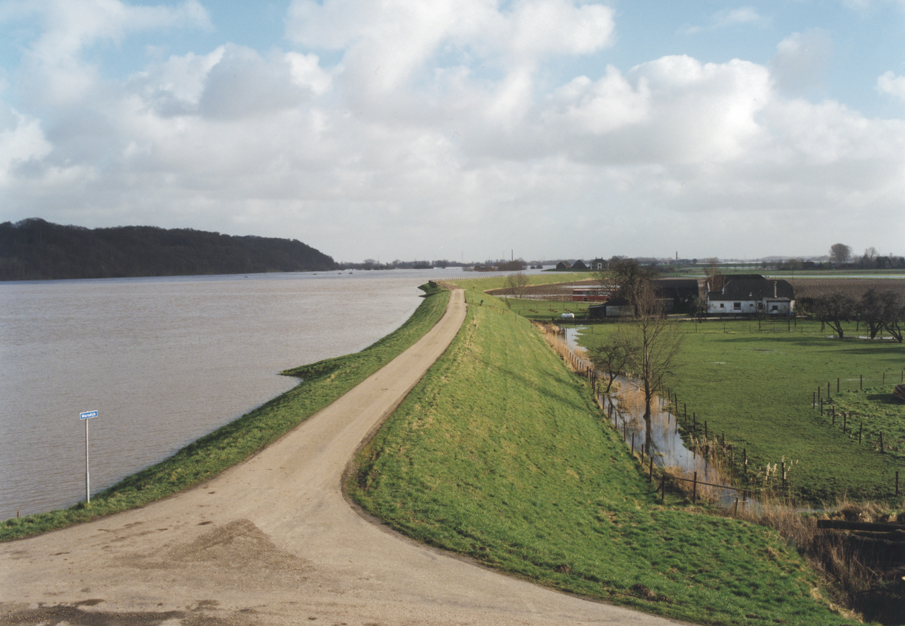

Note: If you want all the generated 3D-plots to remain open, run the complete Rmd before knitting the document to html.


# Learning Goals
* Understanding how 1D groundwater models differ from 2D groundwater models.
* Understanding how the model solution differs between the Finite Volume and Finite Elements method.
* Understanding why interpolation functions are needed and how they differ.
* Understanding the effect of changing the nodal distances near points of interest on the model solution.

# Groundwater flow 

## Introduction 
In these exercises the basic steps of two dimensional groundwater flow models will be reviewed with the Finite Volume method and the Finite Element method as implemented in the FVFE2D package. These exercises do not provide a complete overview of the functionality of the package, neither of all the opportunities that these numerical methods offer, but several important functionalities will be discussed. You can use the built-in help for more information on this package. In many exercises an R-code chunk is given and needs to be edited by adding your answers. Editing is only necessary at locations indicated with 'XXXX', unless explicitly stated otherwise. After completing the R-code chunk, remove the `eval=FALSE` statement in the header of it so it will be included in the final document.

```{r, include=FALSE}
# Clear the environment.
rm(list=ls())
#check packages to use and activate/install them
#Check to see if package(s) are installed, install if not and then load

#pkgs is a vector of strings with length >= 1

CheckInstallPackages <- function(pkgs){

#For each pkg in pkgs (attempt to load each package one at a time):

 x <- lapply(pkgs, function(pkg){

  #Load the package if available,

  if(!do.call("require", list(pkg))) {

   #Silently attempt to install into the default library

   try(install.packages(pkg, lib=.Library,repos="http://cran.rstudio.com"))

   #Now attempt to load the package, catch error if it wasn't installed

   tryCatch(do.call("library", list(pkg)),

    #Catch if we're unable to install into the default library

    error = function(err) {

     #If non-interactive, install into this user's personal library

     if(!interactive()) {

      #Get the path to this user's personal library

      personalLibPath <- Sys.getenv("R_LIBS_USER")

      #If the personal library is not in the list of libraries

      if(is.na(match(personalLibPath, .libPaths()))) {

       #Then create the personal library

       dir.create(personalLibPath, recursive = TRUE)

       #And add the personal library to the list of libraries

       .libPaths(personalLibPath)

      }

      #Attempt to install the package into the personal library

      #If this fails, raise the error back to the report

      install.packages(pkg, lib=personalLibPath, repos="http://cran.rstudio.com")

      #Finally, attempt to load the package

      do.call("library", list(pkg))

 }})}})

} 
CheckInstallPackages(c("fields","FVFE2D"))


```

## Construct the mathematical part of the 2D model
The first step in making a two dimensional model is defining the domain. In figure 1 below an example of such a domain is given on a Cartesian grid.


<div class="exercise">
Edit the R-code chunk below such that the model domain is defined as illustrated in figure 1.
```{r, eval=FALSE}
domain = XXXX
print(domain)
plot(domain, xlab="x", ylab="y", xlim=c(0,2000), ylim=c(0,2000))
grid()
polygon(domain, col=rgb(0.5,0.9,0.9,0.2))
```
</div>

<button type="button" onclick="showHint(4001)">Show Hint</button>
<p id="Q4001"> </p>

<div class="answer">
```{r}
# The domain is defined by a matrix with 2 columns.
domain = matrix(c(300,200,
                  900,100,
                  1800,450,
                  1900,1900,
                  900,1850,
                  100,1400),ncol=2,byrow=TRUE)
print(domain)
# Plot your domain on a cartesian grid.
plot(domain,xlab="x",ylab="y",xlim=c(0,2000),ylim=c(0,2000))
grid()
polygon(domain,col=rgb(0.5,0.9,0.9,0.2))
```
</div>

To complete the mathematical part of the model, the internal flux, the boundary conditions and an external flux have to be defined. The following information has to be added to the two dimensional model:

* A (linear) internal flux based on Darcy's law with $kD=60\frac{m^2}{d}$.
* The western and eastern boundary have a Dirichlet boundary condition set to 0.0 and 1.0 $m$, respectively.
* An external flux simulating a precipitation rate of 1 $mm/day$, uniform in space.

<div class="exercise">
Complete the mathematical part of the two dimensional model by editing the R-code chunk below.
```{r, eval=FALSE}
# Define the internal flux.
grad.flux = function(x, y, state, grad)
{
  return(XXXX)
}

# Construct the model.
GWModel2D = newFLOW2D(domain, grad.flux) 
set.name(GWModel2D, "2D groundwater model")

# Add external flux.
add.spatialflux(GWModel2D, XXXX, "rain")

# Setting the boundary conditions. This command shows you the name of each boundary.
plot.BC.id(GWModel2D)

XXXX # western boundary
XXXX # eastern boundary

summary(GWModel2D)
```
</div>

<button type="button" onclick="showHint(4002)">Show Hint</button>
<p id="Q4002"> </p>

<div class="answer">
```{r}
# Define the internal flux. Note the extra argument in the internal flux function.
kD = 60
grad.flux = function(x, y, state, grad)
{
  return(-kD*grad)
}

# Construct the model.
GWModel2D = newFLOW2D(domain, grad.flux) 
set.name(GWModel2D, "2D groundwater model")

# Add external flux.
add.spatialflux(GWModel2D, 0.001, "rain")

# Makes a plot of the domain containing the boundary segment identifiers which can be used as arguments for the set.BC functions.
plot.BC.id(GWModel2D)

# Setting the boundary conditions
set.BC.fixedstate(GWModel2D, "W", 0)
set.BC.fixedstate(GWModel2D, "E", 1)

summary(GWModel2D)
```
</div>

## Construct the numerical part of the 2D model
The next step in the two dimensional model construction is to make the model discrete by choosing nodes and a numerical technique, either FV or FE. In a separate file called 'geogendemo.R' the function geogendemo() is defined. This function illustrates some techniques built in the FVFE2D package to generate nodes. If you run the script you will see a first example being plotted. The plot shows the resulting Voronoi cells randomly colored. Changing the argument of the geogendem() function in the last line and running the script again shows a second example. There are 10 different examples defined.

<div class="exercise">
The descriptions for example 3-10 in the geodendemo() function are missing. Give for each case the proper description, suggestions are given above the first if-statement of the geodendemo() function. Choose the correct description from the commented list above the geogendemo function and add these to the "descr[]" vector.
</div>

<div class="student_answer">
Fill in your answer here...
</div>

<div class="answer">  
1. descr[1] = "distance order of 1, graph-verbose"
2. descr[2] = "distance order of 1, non-graph-verbose"
3. descr[3] = "distance order of 1, some prefixed node at lower center"
4. descr[4] = "distance order of 0.3"
5. descr[5] = "distance x not equal to distance y"
6. descr[6] = "distance increasing in x-direction
7. descr[7] = "distance increasing in y-direction"
8. descr[8] = "distance smaller near (5,5)"
9. descr[9] = "distance larger near (5,5)"
10. descr[10] = "distance smaller near line"
</div>

<div class="exercise">
Change the geodendemo() function such that it generates nodes for the Finite Elements method. Observe the differences with the Finite Volumes method. What are the main differences observed between these methods?
</div>

<div class="student_answer">
Fill in your answer here...
</div>

<div class="answer">
The shapes of the control volumes are clearly different. The control volumes from the finite volume method have a variable amount of vertices, in contrary to the control volumes produced by the finite elements method which are all triangles.
Besides, the control volumes at the boundaries of the domain look differently. The control volumes from the finite volume method are cut in half, while the control volumes from the finite elements method are not and look equal to those generated anywhere else in the domain. Finally, there exists only one descretization solution to a given nodal configuration if one applies the finite volume method. Using the finite elements method there exist at least two different configuration solutions to a certain nodal configuration (the triangles can be drawn mirrored in this case). 
</div>

Now, we will construct our two dimensional model. The following information is given in order to complete the numerical part:

* Discretise with an opdist of 100 and use the Finite Volumes method; see `set.discretisaton()` for details
* Use the `solve.steps()` function to solve the model
* To view the result, a plotting line: `plot(GWModel2D, fill="state", fill.3D=True)` has to be added, which produces both a 2D and 3D plot.

<div class="exercise">
Create a new R-code chunk. Finalize the numerical part, solve the model and create a plot in both 2D and 3D. To make sure that each three dimensional plot is created in a new window, add: 'new_dev = open3d()' before the 3D plotting command.
</div>

<button type="button" onclick="showHint(4003)">Show Hint</button>
<p id="Q4003"> </p>

<div class="student_answer">
Fill in your answer here...
</div>

<div class="answer">
```{r}
# Discretisation
set.discretisation(GWModel2D, nodes=list(type="geomgen", optdist=100, verbose=FALSE), method="FV")

# plot Voronoi cells with random colors.
plot(GWModel2D, fill="random")

# Solve 
solve.steps(GWModel2D)

# Plot states
new_dev = open3d()
plot(GWModel2D,fill="state", fill.3D=TRUE, main.title = "2D groundwater model - FV")

# This adds a title to the 3D plot
bgplot3d({
  plot.new()
  title(main = "Q5", line = 3)
})
```
</div>

There are many other post processing and plotting possibilities built in the FVFE2D package. Some suggestions are given:

* Printing the first 10 rows of the x, y and state values of the model
* Creating a 2D plot with contour lines for the values 1 to 8
* Creating a 1D plot of a cross section through the domain

<div class="exercise">
Use the help function to carry out the post processing and plotting suggestions, as given above. Describe the results of the plots.
</div>

<div class="student_answer">
Fill in your answer here...
</div>

<div class="answer">
```{r}
# list of x, y and state of the first ten rows.
print(head(dataframe.states(model=GWModel2D), 10))

# 2D plot with contour lines for the values 1 to 8. Note that the contour lines cannot cross through a control volume since they have a constant value over the complete section.
plot(GWModel2D, fill="state", fill.contours = seq(0,8,by=1))

# 1D plot of a cross section that you can define yourself. Note the step behavior due to the constant values of the control volumes produced by the finite volumes method.
plot(GWModel2D, fill="state", linesection=c(500,500,1500,1500))
```
</div>

Now that it is clear how the two dimensional model looks if it is solved using the Finite Volumes method, we will investigate the model solution when the Finite Elements method is used.

<div class="exercise">
Change the numerical part of the two dimensional model, such that it solves using the Finite Elements method. Also, make a contour plot of the new situation.
</div>

<div class="student_answer">
Fill in your answer here...
</div>

<div class="answer">
In the Finite Elements method, contours can intersect through the segments because of linear interpolation between the nodes of the two dimensional system. This results in a smooth contour line. In the Finite Volume method each Voronoi cell is assigned a value and this value is constant for the complete segment. Therefore, a contour line can be located at the boundary of the segment only. This results in the blocky behavior of the contour line.
</div>

# Interpolation functions
In the one dimensional models, `approxfun()` was used to interpolate the kD parameter. In the transient models, we used the built-in `state.fun()` to interpolate the states at a certain time step for use in the next time step. A two dimensional equivalent of the interpolation functions is useful for two dimensional modelling. Different functions will be discussed in this part.

<div class="exercise">
The 2D interpolation functions are not built into the standard library of R. Therefore, three of these functions are built into the FVFE2D package. Use the help to find them.
</div>

<div class="student_answer">
Fill in your answer here...
</div>

<div class="answer">
* invdist.fun():          Inverse distance interpolator
* lininterpol.fun():      Linear interpolator
* nearestneighbour.fun(): Nearest neighbour interpolator
</div>


The following chunk generates several plots. Inspect this chunk and it results.

```{r}
# The data: This will construct a dataframe containing a small example of a spatially measured quantity called T. This is the value to be interpolated and the location of this value is described by an x and y position.
tointerp = data.frame(
  x=c(45,34,19,52,93,87),
  y=c(64,73,15,40,31,62),
  T=c(33,26,17,31,21,41))

# A simple plot of the data frame with the data to be interpolated.
plot(tointerp$x, tointerp$y, cex=tointerp$T/10,
     xlim=c(0, 100), ylim=c(0, 100),
     main="size=T-value", xlab="x", ylab="y")

# Construct the interpolation function using the nearestneighbour.fun(). This is a 2D generalisation of the 1D approxfun() with method=constant.
nnf = nearestneighbour.fun(tointerp, zname="T")

# Test the interpolation function by giving it a random x and y coordinate that does not occur in the 'tointerp' data frame.
nnf(30, 40)
nnf(22.45, 67.88)

# Define boundaries for the demonstration of the interpolation function.
Npl = 50
xtopl = seq(0, 100, length=Npl)
ytopl = seq(0, 100, length=Npl)

# Makes a plot illustrating the interpolation function. It calculates all the combinations of x-values in 'xtopl' and all the y-values in 'ytopl' by means of the interpolation function just constructed. It is the magical function 'outer()' that does this. You do not need to understand this function, just observe the third argument to be the contructed interpolation function.
z = outer(xtopl, ytopl, nnf)
image.plot(xtopl, ytopl, z, main="Nearest neighbour interpolation (nnf)")
points(tointerp$x, tointerp$y, cex=2, pch=20, col="white")
points(tointerp$x, tointerp$y, cex=1, pch=10, col="black")

# 3D plot
new_dev = open3d()
surface3d(xtopl,ytopl, z, opacity=0.3, col="light blue")
spheres3d(tointerp$x, tointerp$y, tointerp$T, radius=2, col="red")
box3d()

# This adds a title to the 3D plot
bgplot3d({
  plot.new()
  title(main = "Q8: Nearest neighbour inter.", line = 3)
})
```

<div class="exercise">
Observe the 2D and 3D plots produced by the constructed interpolation function. Choose between the following two lines:
* This reminds me of the plots made with the FE principle
* This reminds me of the plots made with the FV principle
</div>

<div class="student_answer">
Fill in your answer here...
</div>

<div class="answer">
This should remind you of the FV principle. The same state is assigned to all positions within the volume, which results in blocky behavior. 
</div>

<div class="exercise">
Change the nearestneigbour.fun() to the lininterpol.fun() and create the 2D an 3D plots again. choose:

* This reminds me of the plots made with the FE principle
* This reminds me of the plots made with the FV principle

What do you think of the interpolation outside of the interior of the convex hull (smallest area that contains all the nodes) defined by the nodes?
</div>

<div class="student_answer">
Fill in your answer here...
</div>

<div class="answer">
This should remind you of the FE principle because of the gradual change of states between the nodes. If the Finite Elements method is used, triangles between the nodes are constructed. Outside of these triangles triangular-linear-interpolation is not possible.
```{r}
# Construct the interpolation function using the lininterpol.fun(). This is a 2D generalisation of the 1D approxfun() with method=linear.
lif = lininterpol.fun(tointerp, zname="T")

# Makes a plot illustrating the interpolation function. It calculates all the combinations of x-values in 'xtopl' and all the y-values in 'ytopl' by means of the interpolation function just constructed. It is the magical function 'outer()' that does this. You do not need to understand this function, just observe the third argument to be the contructed interpolation function.
z = outer(xtopl, ytopl, lif)
image.plot(xtopl, ytopl, z, main="Linear interpolation function (lif)")
points(tointerp$x, tointerp$y, cex=2, pch=20, col="white")
points(tointerp$x, tointerp$y, cex=1, pch=10, col="black")

# 3D plot
new_dev = open3d()
surface3d(xtopl,ytopl, z, opacity=0.3, col="light blue")
spheres3d(tointerp$x, tointerp$y, tointerp$T, radius=2, col="red")
box3d()

# This adds a title to the 3D plot
bgplot3d({
  plot.new()
  title(main = "Q10: Linear inter.", line = 3)
})
```
</div>

<div class="exercise">
Change the `lininterpol.fun()` to the `invdist.fun()` and create the 2D an 3D plots again. Find an explanation of the inverse distance function on the Internet. What is your conclusion if you compare the result with the results from the previous two interpolation functions?
</div>

<div class="student_answer">
Fill in your answer here...
</div>

<div class="answer">
Inverse distance weighted (IDW) interpolation explicitly makes the assumption that things that are close to one another are more alike than those that are farther apart. To predict a value for any unmeasured location, IDW uses the measured values surrounding the prediction location. The measured values closest to the prediction location have more influence on the predicted value than those farther away. IDW assumes that each measured point has a local influence that diminishes with distance. It gives greater weights to points closest to the prediction location, and the weights diminish as a function of distance, hence the name inverse distance weighted. Taken from:
http://pro.arcgis.com/en/pro-app/help/analysis/geostatistical-analyst/how-inverse-distance-weighted-interpolation-works.htm

The result of the invdist.fun() in comparison with the other two interpolation functions is that the result is now smooth and space filling.
```{r}
# Construct the interpolation function using the invdist.fun().
idf2 = invdist.fun(tointerp, zname="T")

# Makes a plot illustrating the interpolation function. It calculates all the combinations of x-values in 'xtopl' and all the y-values in 'ytopl' by means of the interpolation function just constructed. It is the magical function 'outer()' that does this. You do not need to understand this function, just observe the third argument to be the contructed interpolation function.
z = outer(xtopl, ytopl, idf2)
image.plot(xtopl, ytopl, z, main="Inverse distance interpolation, power=2 (idf2)")
points(tointerp$x, tointerp$y, cex=2, pch=20, col="white")
points(tointerp$x, tointerp$y, cex=1, pch=10, col="black")

# 3D plot
new_dev = open3d()
surface3d(xtopl,ytopl, z, opacity=0.3, col="light blue")
spheres3d(tointerp$x, tointerp$y, tointerp$T, radius=2, col="red")
box3d()

# This adds a title to the 3D plot
bgplot3d({
  plot.new()
  title(main = "Q11: Inverse distance inter.", line = 3)
})
```
</div>

The invdist.fun() has an extra parameter called power. The default value of this parameter is 2, so that is the value that we have used in the previous construction of the invdist.fun(). 

<div class="exercise">
Construct new interpolation functions called e.g., "idf0.5" and "idf4", using 0.5 and 4 as value for the argument power. Discuss the differences and similarities with all the previously used interpolation functions.
</div>

<div class="student_answer">
Fill in your answer here...
</div>

<div class="answer">
Since the influence of the individual observations is based on the *inverse* of the distance powered, a lower value of 0.5 makes the influence of the observations large in the whole domain. In the extreme case of a power value of 0.0 the interpolated value will be the average of the observations in the whole domain.  
With a value of 4 for the power influence of each observation will be fairly local and resembles the nearest neighbour interpolation.  

```{r}
# power is 0.5
idf0.5 = invdist.fun(tointerp, zname="T", power=0.5)

z = outer(xtopl, ytopl, idf0.5)
image.plot(xtopl, ytopl, z, main="Inverse distance interpolation, power=0.5 (idf0.5)")
points(tointerp$x, tointerp$y, cex=2, pch=20, col="white")
points(tointerp$x, tointerp$y, cex=1, pch=10, col="black")

# 3D plot of power=0.5 interpolation.
new_dev = open3d()
surface3d(xtopl,ytopl, z, opacity=0.3, col="light blue")
spheres3d(tointerp$x, tointerp$y, tointerp$T, radius=2, col="red")
box3d()

# This adds a title to the 3D plot
bgplot3d({
  plot.new()
  title(main = "Q12: inv. dist. power=0.5", line = 3)
})

# power is 4
idf4 = invdist.fun(tointerp, zname="T", power=4)

z = outer(xtopl, ytopl, idf4)
image.plot(xtopl, ytopl, z, main="Inverse distance interpolation, power=4 (idf4)")
points(tointerp$x, tointerp$y, cex=2, pch=20, col="white")
points(tointerp$x, tointerp$y, cex=1, pch=10, col="black")
```
```{r}
# 3D plot of power=4 interpolation.
new_dev = open3d()
surface3d(xtopl,ytopl, z, opacity=0.3, col="light blue")
spheres3d(tointerp$x, tointerp$y, tointerp$T, radius=2, col="red")
box3d()

# This adds a title to the 3D plot
bgplot3d({
  plot.new()
  title(main = "Q12: inv. dist. power=4", line = 3)
})
```
</div>

We will now apply the interpolation techniques to our 2D groundwater case.     
The transmissivity value $kD$ used in the Darcy function can vary strongly in space, due to variation in the thickness of an aquifer layer or its composition. Of course, transmissivities cannot be measured at every location in a domain. Below, an interpolation technique is going to be used to interpolate the kD values for unknown locations within the domain. The locations at which the transmissivities are known are presented in the R-code chunk below:

```{r}
kD.Data = data.frame(
  x = c(900,680,380,1040,1640,200,440,1900),
  y = c(1280,1460,300,620,1500,1240,655,210),
  kD = c(75,65,63,66,43,64,78,48))
```

<div class="exercise">
Choose, from the interpolation functions available, the smoothest interpolator that still respects the data and plot the two dimensional model domain of TwoDModel with the interpolated transmissivity values. For this use one of the previous interpolation chunks.  
</div>

<button type="button" onclick="showHint(4004)">Show Hint</button>
<p id="Q4004"> </p>

<div class="student_answer">
Fill in your answer here...
</div>

<div class="answer">
This will be the inverse distance method: `invdist.fun`

```{r}
# The interpolation function.
kD.field  = invdist.fun(kD.Data, zname="kD")

Npl = 50
xtopl = seq(0,2000, length=Npl)
ytopl = seq(0,2000, length=Npl)

z = outer(xtopl, ytopl, kD.field)
image.plot(xtopl, ytopl, z, main="Transmissivity field, inverse distance interpolation")
polygon(domain, border = "white", lwd=3)
polygon(domain, border = "black", lwd=0.7)
points(kD.Data$x, kD.Data$y, cex=kD.Data$kD/10, lwd=3, col="white")
points(kD.Data$x, kD.Data$y, cex=kD.Data$kD/10, lwd=0.5, col="black")
```
</div>

In the `GWModel2D` the constant value of $kD=60m^2/d$ was used as value for the transmissivity. We will now construct a model that is identical to the `GWModel2D`, except for the interpolation function of the transmissivities in the internal flux of the new model.

* Call the new model 'TwoDmodelInterp'
* Use an interpolation function of your own choice (think about what is realistic)
* Use the same nodal generation function as in the TwoDmodel
* For the discretisation use the Finite Volumes method
* Create a contour plot of the result

<div class="exercise">
Use the bullets above to construct a new model that uses an interpolation function of your choice in the internal flux function of the new model. Can you observe differences between the two models? Use the Finite Volume solver. 
</div>

<div class="student_answer">
Fill in your answer here...
</div>

<div class="answer">
If the interpolation function is implemented correctly, a change of the contour line positions in the model domain should be noticed.
```{r}
# Interpolation function.
kD.field  = invdist.fun(kD.Data, zname="kD")

# Internal flux definition.
grad.flux = function(x, y, state, grad)
{
  return(-kD.field(x, y)*grad)
}

# Construct the model
TwoDmodelInterp = newFLOW2D(domain, grad.flux) 
set.name(TwoDmodelInterp, "2D model, Interpolated kD field")

# Add external flux
add.spatialflux(TwoDmodelInterp, 0.001, "rain")

# Setting the boundary conditions
plot.BC.id(TwoDmodelInterp)
set.BC.fixedstate(TwoDmodelInterp, "W", 0)
set.BC.fixedstate(TwoDmodelInterp, "E", 1)

# Discretisation
set.discretisation(TwoDmodelInterp, nodes=list(type="geomgen", optdist=100, verbose=FALSE), method="FV")

# Solve 
solve.steps(TwoDmodelInterp)

# Plot states
plot(TwoDmodelInterp, fill="state", fill.contours = c(5,6))
plot(GWModel2D, fill="state", fill.contours = c(5,6))
```
</div>

# Effect of nodal distances
One of the selling points of the Finite Volumes and Finite Elements method is that more nodes can be chosen near points of interest, and by that higher precision can be obtained. Use in this section the Finite Elements discretization technique, except when explicitly stated otherwise.

<div class="exercise">
Create a new chunk below. Copy the `GWModel2D` model, call it `TwoDModelWellFV` and implement a well at location x=1000 and y = 1000 with an extraction rate of 1000 $m^3/d$. Solve the model (use Finite Volumes) and create a 2D and 3D plot. You can use the `summary(modelname)` function to check what is implemented in the model.
</div>

<div class="student_answer">
Fill in your answer here...
</div>

<div class="answer">
```{r}
# Copy and assign new name to the model.
TwoDModelWellFV = copy.model(model=GWModel2D)
set.name(TwoDModelWellFV, newname="TwoDModelWell")

# Add the well.
add.pointflux(TwoDModelWellFV, c(1000, 1000), -1000, "Well")

# Solve
solve.steps(TwoDModelWellFV)

# Plotting
plot.BC.id(TwoDModelWellFV)
plot(TwoDModelWellFV, fill="random")

# 3D plot
new_dev = open3d()
plot(TwoDModelWellFV, fill="state", fill.3D=TRUE)

# This adds a title to the 3D plot
bgplot3d({
  plot.new()
  title(main = "Q15: Well FV", line = 3)
})
```
</div>

<div class="exercise">
Create a copy af the previous chunk and replace the Finite Volume FV with the Finite Element FE technique. Call this model `TwoDmodelWellFE`. Compare the Finite Volumes discretisation with the Finite Elements discretisation in the TwoDModelWell visually. Does the result look as you expected?
</div>

<div class="student_answer">
Fill in your answer here...
</div>

<div class="answer">
The blocky, basalt like structure, should be found for the Finite Volumes method. The Finite Elements method should produce a continuous surface.
```{r}
# Copy and assign new name to the model.


TwoDModelWellFE = copy.model(model=GWModel2D)
set.name(TwoDModelWellFE, newname="TwoDModelWellFE")
set.discretisation(TwoDModelWellFE,nodes=list(type="geomgen", optdist=100),method="FE")

# Add the well.
add.pointflux(TwoDModelWellFE, c(1000, 1000), -1000, "Well")

# Solve
solve.steps(TwoDModelWellFE)

# Plotting
plot.BC.id(TwoDModelWellFE)
plot(TwoDModelWellFE, fill="random")

# 3D plot
new_dev = open3d()
plot(TwoDModelWellFE, fill="state", fill.3D=TRUE)

# This adds a title to the 3D plot
bgplot3d({
  plot.new()
  title(main = "Q15: Well", line = 3)
})

```

</div>

<div class="exercise">
Decrease the nodal distance in a diameter of 200 $m$ around the location of the well to 25 $m$. Use a nodal distance of 100 $m$ outside of this area. Are the results indeed better/more realistic?
</div>

<button type="button" onclick="showHint(4005)">Show Hint</button>
<p id="Q4005"> </p>

<div class="student_answer">
Fill in your answer here...
</div>

<div class="answer">
The deepest point in the well is calculated more precisely.
```{r}
# Decrease nodal distances near the location of the well.
welldist = func.dist.to.point(c(1000, 1000), 200, 25, 100)
set.discretisation(TwoDModelWellFE, nodes=list(type="geomgen", optdist=welldist, verbose=FALSE), method="FE")

# Solve
solve.steps(TwoDModelWellFE)

# Plotting
plot.BC.id(TwoDModelWellFE)
plot(TwoDModelWellFE, fill="random")

# 3D plot
new_dev = open3d()
plot(TwoDModelWellFE, fill="state", fill.3D=TRUE, main.title="TwoDModelWell - decreased nodal distance")

# This adds a title to the 3D plot
bgplot3d({
  plot.new()
  title(main = "Q17: Well node config.", line = 3)
})
```
</div>

Another type of external flux is a line flux. A river in a groundwater model can be considered to be a line flux, that 'extracts' water by draining the groundwater. In the FVFE2D package a specific function is included to define a line flux in the model.

<div class="exercise">
Copy the `TwoDmodeWellFE`, remove the extraction well (see the help on this) and call it TwoDModelRiver. Implement a canal (straight line) between the points (400, 500) and (1500, 1000) and assign it an extraction rate of 1 $m^2/d$. Finally, solve the model and create a 2D and 3D plot.
</div>

<div class="student_answer">
Fill in your answer here...
</div>

<div class="answer">
Model with a canal:  

```{r}
# Copy and assign new name to the model.
TwoDModelRiver = copy.model(model=TwoDModelWellFE)
set.name(TwoDModelRiver, newname="TwoDModelRiver")

rem.pointflux(TwoDModelRiver,'Well')
summary(TwoDModelRiver)

# Add the river.
river = matrix(c(400, 500, 1500, 1000), ncol=2, byrow=TRUE)
add.lineflux(TwoDModelRiver, points=river, rates=list(-1), name="canal")

# Solve
solve.steps(TwoDModelRiver)

# Plotting
plot.BC.id(TwoDModelRiver)
plot(TwoDModelRiver, fill="random")

# 3D plot
new_dev = open3d()
plot(TwoDModelRiver, fill="state", fill.3D=TRUE)

# This adds a title to the 3D plot
bgplot3d({
  plot.new()
  title(main = "Q18: river", line = 3)
})
```
</div>

<div class="exercise">
Decrease the nodal distance in the neighbourhood of the river and solve the model again. Decrease the nodal distance in an area of 200 $m$ around the river to a distance of 25 $m$; use a nodal distance of 100 $m$ outside this area. How does this change the new solution? 
</div>

<button type="button" onclick="showHint(4006)">Show Hint</button>
<p id="Q4006"> </p>

<div class="student_answer">
Fill in your answer here...
</div>

<div class="answer">
The solution is more precise and realistic in the neighbourhood of the river, due to the change in discretisation.  

```{r}
# Copy and assign new name to the model.
TwoDModelRiverFine = copy.model(model=TwoDModelRiver)
set.name(TwoDModelRiverFine, newname="TwoDModelRiver - decreased nodal distance")

# Add the river.
river = matrix(c(400, 500, 1500, 1000), ncol=2, byrow=TRUE)
add.lineflux(TwoDModelRiverFine, points=river, rates=list(-1), name="canal")

# set discretisation.
optdist = func.dist.to.line(river, 200, 25, 100)
set.discretisation(TwoDModelRiverFine, nodes=list(type="geomgen", optdist=optdist, maxiter=20,stopcrit=0.005, verbose=FALSE, sleeptime=0.05), method="FE")

# Solve
solve.steps(TwoDModelRiverFine)

# Plotting
plot.BC.id(TwoDModelRiverFine)
plot(TwoDModelRiverFine, fill="random")

# 3D plot
new_dev = open3d()
plot(TwoDModelRiverFine, fill="state", fill.3D=TRUE)

# This adds a title to the 3D plot
bgplot3d({
  plot.new()
  title(main = "Q19: river node config.", line = 3)
})
```
</div>

# Flow through a dike

In the last part of this assignment, (simplified) flow through a dike will be modeled, in a situation similar to figure 2.

<div align="center">


</div>

In figure 3 a schematized vertical cross section of a dike is presented. Note the different scale of the y-direction compared to the x-direction. From figure 3 can be seen that the y-to-x-ratio is not equal to one. This can be graphically observed in this particular case, but this is not always so clear. Be aware that this y-to-x-ratio exists in this model. 

<div align="center">

</div>


<div class="exercise">
Define the model domain in a new R-code chunk, as illustrated in figure 3, and plot the new domain. Firstly, clear the defined objects from the work space to prevent unwanted interference with previous model simulations. What is the y-to-x-ratio in this example?
</div>

<button type="button" onclick="showHint(4007)">Show Hint</button>
<p id="Q4007"> </p>

<div class="student_answer">
Fill in your answer here...
</div>

<div class=answer>
The y-to-x-ratio in this example is 5.
```{r}
rm(list=ls())

# Domain corners
P1 = c(0,0)
P2 = c(10,0)
P3 = c(10,1)
P4 = c(8,2)
P5 = c(1.4,2)
P6 = c(0,0.5)

# Define domain
domain = matrix(c(P1,P2,P3,P4,P5,P6), ncol=2, byrow=TRUE)

# Create plot and define the domain range.
plot(c(0,10), c(0,2), xlab="x", ylab="y", col="white")
# Plot domain polygon.
polygon(domain, lwd=3, col=rgb(0.7,0.7,0.7,0.3))
grid()
```
</div>

This model will use groundwater head (i.e. pressure + elevation) as the state variable. The internal flux will be added to the model as defined in the R-code chunk below.
```{r}
# Internal flux function.
grad.flux = function(x, y, state, grad)
{
  return(-0.1*grad)
}
```

<div class="exercise">
The internal flux function is acceptable for the saturated part of the dike. For the unsaturated part of the dike this is less the case. Why? Does this overestimate or underestimate the fluxes there?
</div>

<div class="student_answer">
Fill in your answer here...
</div>

<div class="answer">
The hydraulic conductivity is a constant $k_{sat}$ for saturated conditions but a function of pressure $\psi$ and highly non-linear for unsaturated conditions, see FVFE assignment 3 for details on this.  
As pressure gets more negative with increasing distance from the saturated zone, the hydraulic conductivity strongly decreases too. Therefore, the flow in the unsaturated part is overestimated using the current internal flux function.
</div>

Next, several boundary conditions have to be defined. The boundaries should be implemented as follows:

* Line segment (0,0)-(0,0.5) is assigned a fixed state of 0.5 $m$
* Line segment (10,0)-(10,1) is assigned a fixed state of 1.0 $m$
* The horizontal top of the dike receives a recharge flux of 0.001 $mm/day$

<div class="exercise">
Create a new model and add the boundary conditions described above. Give an interpretation for each of these boundary conditions. What boundary condition is used on the remaining boundary segments?
</div>

<button type="button" onclick="showHint(4008)">Show Hint</button>
<p id="Q4008"> </p>

<div class="student_answer">
Fill in your answer here...
</div>

<div class="answer">
Boundary conditions:  
* East & west:  A hydrostatic water depth on both sides of the dike
* Top:          Rainfall infiltrating into the dike
* Unspecified:  No-flux boundaries, so impermeable surface

```{r}
# new model object.
DikeFlow = newFLOW2D(domain=domain, grad.flux, "Dike Flow")

plot.BC.id(DikeFlow)

set.BC.fixedstate(DikeFlow, 2, 1)
set.BC.fixedstate(DikeFlow, 6, 0.5)
set.BC.fixedflux(DikeFlow, 4, 0.001)
```
</div>

<div class="exercise">
Add a proper discretisation in the model. Use for this the geomden method, with an opdist of 0.5 and the proper y-to-x-ratio. Use the Finite Elements discretisation method. Add a randomly filled plot of the discretised domain.
</div>

<div class="student_answer">
Fill in your answer here...
</div>

<div class="answer">
 Using the ratio gives an evenly distribution of nodes in the domain although length and height scale are different.
```{r}
# Set the discretisation.
set.discretisation(DikeFlow, nodes=list(type="geomgen", optdist=0.5, ytoxratio=5, verbose=FALSE), method="FE")

# Randomly filled plot.
plot(DikeFlow, fill="random", fill.border="black")
```
</div>

<div class="exercise">
Solve and run the model. Make a plot with 10 contour lines between 0 and 1 and add flux vectors. Where do you observe the largest fluxes?
</div>

<div class="student_answer">
Fill in your answer here...
</div>

<div class="answer">
The largest flux is observed at the lower west boundary, where all the water is forced through a relatively small surface. The highest flux density is observed here. The length of these vectors represent the magnitude of the flux. The arrows point in the direction of the flow.
```{r}
# Solve
solve.steps(DikeFlow)

# Plotting
plot(DikeFlow, fill="state", fill.contours=seq(0, 1, length=10), fill.name="head", fluxvecsize=1)
```
</div>

Apart from flow velocities, the distribution of water pressure in the dike is also important in order to investigate the stability of the dike. The standard use of the plot function as implemented in the FVFE2D package is with `fill= "state"`. This will in this case show the head distribution and not the pressure distribution. However, one can assign a function as fill argument for the plotting function. 

<div class="exercise">
Define the pressure function and create a contour plot of the pressure distribution in the dike. Note that the zero contour line of the pressure head represents the border between the saturated and unsaturated zone (the groundwater level). 
</div>

<button type="button" onclick="showHint(4009)">Show Hint</button>
<p id="Q4009"> </p>

<div class="student_answer">
Fill in your answer here...
</div>

<div class="answer">
Since $H=\psi + z \rightarrow \psi = H-z$  

```{r}
# The pressure function.
pres.fun = function(x,y,state)
{
  return(state-y)
}

# Plot pressure in the dike.
plot(DikeFlow, fill=pres.fun, fill.name="pressure", fill.contours=seq(1, -1, length=9))
```
</div>

<div class="exercise">
Last exercise; play around with the dike model. Investigate how you, with the help of the model that you have built, can investigate the flow through a dike for the following examples:

* How do the water levels left and right of the dike influence the flow?
* How do heterogeneities (e.g. a very conductive layer) influence the flow?
* How does the rainfall intensity influence the flow?
</div>

<div class="answer">
The following chunk contains results with an equal water level on the left and right side:  
However, the right/eastern boundary is 1.0 m high for which only the lower 0.5 m should contain the prescribed head (H). Now the model simulates a prescribed head of 0.5 m AMSL over the total height and therefor also the not saturated upper part, which is not correct.
To adjust for this, segment with ID= 2 need to be cut into a lower and upper part and the model need to be recreated with this.

```{r}
#make a copy of the original model
Dike_equal_levels = copy.model(DikeFlow)

#eastern boundary (nr 2) is set equal to western BC (fixed level 0.5 m)
set.BC.fixedstate(Dike_equal_levels, 2, 0.5)

# Solve
solve.steps(Dike_equal_levels)

# Plotting
plot(Dike_equal_levels, fill="state", fill.contours=seq(0, 1, length=10), fill.name="head", fluxvecsize=1)
plot(Dike_equal_levels, fill=pres.fun, fill.name="pressure", fill.contours=seq(1, -1, length=9))

```

To include an extra layer with high conductivity hydraulic conductivity the "k" of the internal flux (here 0.1 m/d) need to be transformed into a function based on interpolation.
Suppose there would be a gravel layer of 0.25 m starting 0.20 m above the bottom.
To mimic this gravel layer nearestneighbour interpelation seems to fit best.  

```{r}
gravel = data.frame(
  x = c(0,10,10,10,10,0,0,0),
  y =c(0,0,0.2,0.21,2,2,0.21,0.2),
  k =c(25,25,25,0.1,0.1,0.1,0.1,25))
gravel.fun = nearestneighbour.fun(data=gravel,zname = "k")
#make a plot to visualize
nrpoints = 20
rows = seq(0,10,length=nrpoints)
cols = seq(0,2,length=nrpoints)
kfield = outer(rows,cols,gravel.fun)
image(rows,cols,kfield)
#create a new model with a internal flux depending on location
dike.flux = function(x,y,state,grad)
{
  return(-gravel.fun(x,y)*grad)
}
Dike_gravel = newFLOW2D(domain=domain,systemfluxfunction = dike.flux,name = "dike_gravel_layer")
set.BC.fixedstate(Dike_gravel,where = 2,value = 1.0)
set.BC.fixedstate(Dike_gravel,where = 6, value = 0.5)
set.BC.fixedflux(Dike_gravel,where =4, value = 0.001 )
set.discretisation(Dike_gravel,nodes=list(type="geomgen", optdist=0.5, ytoxratio=5, verbose=FALSE), method="FE")
solve.steps(Dike_gravel)
plot(Dike_gravel, fill="state", fill.contours=seq(0, 1, length=10), fill.name="head", fluxvecsize=0.5)

plot(Dike_gravel, fill=pres.fun, fill.name="pressure", fill.contours=seq(1, -1, length=9))

```

The results clearly shows preferential flow through the gravel layer

Studying how the rainfall intensity influences the flow can be accomplished by increasing the amount of recharge on top of the dike.  
To make it a bit more practical the 'rate' will be replaced by a variable. See the code:  

```{r}
#first make a copy of the original mode:
Dike_rain = copy.model(DikeFlow)
set.name(Dike_rain,"recharge rate")
#replace the old prescribed rain which has a constant value.
recharge.rate = 0.01 #10 mm/d
set.BC.fixedflux(Dike_rain,where = 4, value = "recharge.rate")

solve.steps(Dike_rain,verboselevel = 2)

plot(Dike_rain, fill="state", fill.contours=seq(0, 1, length=10), fill.name="head", fluxvecsize=1)
plot(Dike_rain, fill=pres.fun, fill.name="pressure", fill.contours=seq(1, -1, length=9))

dataframe.balance(Dike_rain)
recharge.bc = dataframe.boundaries(Dike_rain,segids = c(4))
sum(recharge.bc$flux)
```

When the recharge rate is increased to 10 mm/d one can clearly see the water table ($\psi=0$) rise to more than 2/3 of the dike (about 1.5 m above datum).  
</div>

<!-- include the hint.js -->
<script src="hints_n.js"></script>
