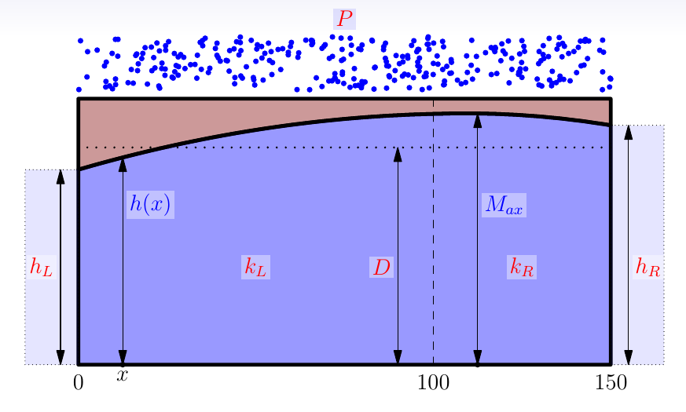

# Sensitivity example in this document

This example illustrates the most basic steps in sensitivity analysis. The example produced here is also used in the slides, and the results are discussed there.

The R-code illustrates how to do the two forms of sensitivity analysis discussed in the slides:

1. Local sensitivity analysis: 
The abbreviation __LSA__ will be used for this technique.
2. Sensitivity analysis of variation through sampling, global sensitivity analysis:
The abbreviation __GSA__ will be used for this technique.

The sensitivities will be shown:

1. For the states over the whole model domain
2. For a particular model result which will be called MRESULT here. An example is the maximum groundwater level, which will be used in this code like in the slides, but the code is general enough to change this.

For the second part, preprogrammed code that is present in the R-source file "samplehelpers.R" is used, without discussing or explaining the code that is present there. You do not need to understand that code in detail.

<span style="color:red;"> This code assumes that the packages lhs, truncnorm and matrixStats are installed. </span>

## The example  model

The following picture shows the example model used in this document:



We start by clearing memory and loading the numerical library:
```{r}
rm(list=ls())
library(FVFE1D)
```

# 1. Constructing the model

## Mathematical setup
The example will be a simple 1D groundwater model.
The first step is choosing the spatial model domain:
```{r}
domain = c(0,150) 
```

The system flux will be a simple Dupuit flux. The aquifer has a constant thickness $D$; the left and right sides of the domain have different hydraulic conductivities.
```{r}
kL = 7.5
kR = 5
D = 5
grad.flux = function(x,state,gradstate)  
  {
  if(x<100)
    {
      return(-kL*D*gradstate)
    } else {
      return(-kR*D*gradstate)
    }
  }
```
Technically: as the `grad.flux` function calls the global variables `kL`, `kR` and `D`, changing the values of these variables will immediately change the model to use these new values, without any extra code. This will prove to be productive in the sensitivity analysis. 

With this, the basic conceptual model can be constructed:
```{r}
Examplemodel = newFLOW1D(domain,grad.flux) 
```

A constant recharge of 1 mm/day is added on top of the model:
```{r}
P = 0.001
add.spatialflux(Examplemodel,"P","recharge")
```
Technically: similar to the kL, kD and D parameters, the recharge is also introduced by separately defining the variable `P`. In this way, changing the value of this variable will immediately change the model to use the new value.

Finally, fixed heads are set as left and right boundaries:
```{r}
hL = 1
hR = 1.25
set.BC.fixedstate(Examplemodel,"left","hL") 
set.BC.fixedstate(Examplemodel,"right","hR")
```
Also the left and right boundary conditions are introduced by reference to the variables `hL` and `hR`.

Give the model a name:
```{r}
set.name(Examplemodel,"base run")
```

## The numerical solution of the base model

```{r}
nodes = seq(from=domain[1],to=domain[2],length=50) 
set.discretisation(Examplemodel,nodes,"FV")
control = solve.steps(Examplemodel)
```
In the particular example here only one solution step is needed, as the model is linear.

```{r}
plot(Examplemodel,fluxplot=TRUE) 
```

## Choice of MRESULT
In this example, we will investigate the maximum groundwater level as our model result:
```{r}
MRESULT = function()
{
  return(max(dataframe.states(Examplemodel)$state))
}
```

Store the results of the base run:
```{r}
M_base = MRESULT()
print(M_base)
state_base = dataframe.states(Examplemodel)$state
plot(nodes,state_base,type="l",lwd=4,col="blue",main="Base state")
grid(col="black")
```

# 2. LSA calculations

## Parameters: base values and scales of variation

In the model created above there are six parameters. We will do a sensitivity analysis for each of them.

The parameter values defined before will form the base values:
```{r}
base= list(kL=kL,kR=kR,D=D,P=P,hL=hL,hR=hR)
str(base)
```

The scales of variation (we assume are standard deviations) for the parameters have to be provided by the modeller. We store these in a list as well:

```{r}
scale= list(kR = 0.3*kR,
            kL = 0.3*kL,
            D = 0.5,
            P = 0.25*P,
            hL = 0.1,
            hR = 0.1)
str(scale)
```

Below we define the epsilon value `eps`, which is the amount by which we will 'disturb' the parameters.

```{r}
eps = 1e-3
```

## 2.1 Sensitivity with respect to kL
Here we investigate the sensitivity to the hydraulic conductivity in the left part of the domain.

```{r,fig.height=4}
kL=base$kL+eps #slightly change the base value
control = solve.steps(Examplemodel)
kL=base$kL
dMdkL  = (MRESULT()-M_base)/eps #the local sensitivity dM/dkL
print(paste("local sensitivity dM/dkL=",dMdkL))
dstatedkL = (dataframe.states(Examplemodel)$state-state_base)/eps #local sensitivies at all nodes
plot(nodes,dstatedkL,type="l",lwd=3,col="blue",main="d{state} / d{kL}")
abline(h=0,col="red",lwd=3)
grid(col="black")
```

An increase in $kL$ causes a decrease of the groundwater table over the whole domain. This makes sense because water can now be drained more easily.   
The maximum changes are found is just left of the point x=100. The sensitivity diminishes linearly 
towards the right, and non-linearly to the left of x=100. At the endpoints of the domain, the sensitivity to $kL$ is zero as the state is determined fully by the boundary conditions.
The maximum groundwater level M also decreases. 

## 2.2 Sensitivity with respect to kR
Here we investigate the sensitivity to the hydraulic conductivity on the right side.

```{r,fig.height=4}
kR=base$kR+eps #slightly change the base value
control = solve.steps(Examplemodel)
kR=base$kR
dMdkR  = (MRESULT()-M_base)/eps #the local sensitivity dM/dkR
print(paste("local sensitivity dM/dkR=",dMdkR))
dstatedkR = (dataframe.states(Examplemodel)$state-state_base)/eps #local sensitivies at all nodes
plot(nodes,dstatedkR,type="l",lwd=3,col="blue",main="d{state}/d{kR}")
abline(h=0,col="red",lwd=3)
grid(col="black")
```

An increase in $kR$ causes an increase of the groundwater table to the left of point x=100 
(change of state = positive) which is highest at x=100. On the right of this point both positive and negative changes occur and the behaviour is non-linear. 
At the endpoints of the domain, the rate of change is again zero as the state is determined by the boundary conditions.
The maximum groundwater level M decreases strongly.

## 2.3 Sensitivity with respect to D
Here we investigate the sensitivity to the aquifer depth.

```{r,fig.height=4}
D=base$D+eps #slightly change the base value
control = solve.steps(Examplemodel)
D=base$D
dMdD  = (MRESULT()-M_base)/eps #the local sensitivity dM/dD
print(paste("local sensitivity dM/dD=",dMdD))
dstatedD = (dataframe.states(Examplemodel)$state-state_base)/eps #local sensitivities at all nodes
plot(nodes,dstatedD,type="l",lwd=3,col="blue",main="d{state}/d{D}")
abline(h=0,col="red",lwd=3)
grid(col="black")
```

An increase in $D$ causes a decrease of the groundwater table over the whole domain, with the largest changes about in the middle. Again, this makes sense, because a deeper aquifer will allow easier discharge of groundwater. At the endpoints of the domain the sensitivity is zero as the state is determined by the boundary conditions. The maximum groundwater level M also decreases.

## 2.4 Sensitivity with respect to P
Here we investigate the sensitivity to the recharge flux.

```{r,fig.height=4}
P=base$P+eps #slightly change the base value
control = solve.steps(Examplemodel)
P=base$P
dMdP  = (MRESULT()-M_base)/eps #the local sensitivity dM/dP
print(paste("local sensitivity dM/dP=",dMdP))
dstatedP = (dataframe.states(Examplemodel)$state-state_base)/eps #local sensitivities at all nodes
plot(nodes,dstatedP,type="l",lwd=3,col="blue",main="d{state}/d{P}")
abline(h=0,col="red",lwd=3)
grid(col="black")
```

An increase in $P$ causes an increase of the groundwater table over the whole domain, with the largest changes occurring in the middle of the domain.
At the endpoints of the domain, the sensitivity is zero as the state is determined by the boundary conditions. The maximum groundwater level M also increases.

## 2.5 Sensitivity with respect to hL
Here we investigate the sensitivity to the water level in the left river.

```{r,fig.height=4}
hL=base$hL+eps #slightly change the base value
control = solve.steps(Examplemodel)
hL=base$hL
dMdhL  = (MRESULT()-M_base)/eps #the local sensitivity dM/dhL
print(paste("local sensitivity dM/dhL=",dMdhL))
dstatedhL = (dataframe.states(Examplemodel)$state-state_base)/eps #local sensitivities at all nodes
plot(nodes,dstatedhL,type="l",lwd=3,col="blue",main="d{state}/d{hL}")
abline(h=0,col="red",lwd=3)
grid(col="black")
```

An increase in the left boundary condition causes an increase of the groundwater table over the whole
domain, with the largest changes close to the left river.
At the right endpoint the rate of change is zero, as the state is still determined by the right boundary condition.
The maximum groundwater level M also increases.

## 2.6 Sensitivity with respect to hR
Here we investigate the sensitivity to the water level in the right river.

```{r,fig.height=4}
hR=base$hR+eps #slightly change the base value
control = solve.steps(Examplemodel)
hR=base$hR
dMdhR = (MRESULT()-M_base)/eps #the local sensitivity dM/dhR
print(paste("local sensitivity dM/dhR=",dMdhR))
dstatedhR = (dataframe.states(Examplemodel)$state-state_base)/eps #local sensitivities at all nodes
plot(nodes,dstatedhR,type="l",lwd=3,col="blue",main="d{state}/d{hR}")
abline(h=0,col="red",lwd=3)
grid(col="black")
```

An increase in the right boundary condition causes an increase of the groundwater table over the whole domain, with the largest changes close to the right river.
At the left endpoint the rate of change is zero as the state here is determined by the left boundary condition.
The maximum groundwater level M also increases. The increase caused by the right river is much larger than for the left river.

# 3. LSA variation analysis

## 3.1 Contributions to  variance of M
<div class = "comment">
I changed "variation" is this part to "standard deviation" and "variance" to make it more clear. The lecture also calls it that way. Is the text correct like this?
</div>
<div class = "comment">
**[LM]** Yes, it's correct. It is important though to keep in mind that the parameter distribution can be not normally distributed, but with the central limit theorem you can defend using st devs  </div>

First we calculate the variance in M that is caused by each of the separate parameters. We use the variance for this, because the standard deviations cannot be summed directly.  
The variance-per-parameter is given by the scaled squared sensititivities:

```{r}
varM.kL = (scale$kL*dMdkL)^2  
# = the standard deviation of M due to kL, then squared to get the variance.
# The unit of this variance is m^2: the squared unit of M.
varM.kR = (scale$kR*dMdkR)^2
varM.D  = (scale$D*dMdD)^2
varM.P  = (scale$P*dMdP)^2
varM.hL = (scale$hL*dMdhL)^2
varM.hR = (scale$hR*dMdhR)^2
varMtot = varM.kL+varM.kR+varM.D+varM.P+varM.hL+varM.hR
```

The chunk below plots the relative contributions of the different parameters to the variance in M: 
```{r}
relvarM = list(kL = varM.kL/varMtot,
             kR = varM.kR/varMtot,
             D  = varM.D/varMtot,
             P  = varM.P/varMtot,
             hL = varM.hL/varMtot,
             hR = varM.hR/varMtot)

str(relvarM)
pie(as.numeric(relvarM),labels=names(relvarM),
    main=paste("Standard deviation of M =",round(sqrt(varMtot),4),"m"),
    col = rainbow(length(relvarM)))
```

The scale of variation for the maximum groundwater tabel is about 9 cm. 
The largest contribution to this variation is that of the right boundary condition (93%).

## 3.2 Contributions to variation over the whole domain

We can also look at the variance of the groundwater level at all nodes in the domain.
The variance at the nodes caused by each of the parameters is again given by the scaled squared sensititivities:

```{r}
varState.kL = (scale$kL*dstatedkL)^2
varState.kR = (scale$kR*dstatedkR)^2
varState.D  = (scale$D*dstatedD)^2
varState.P  = (scale$P*dstatedP)^2
varState.hL = (scale$hL*dstatedhL)^2
varState.hR = (scale$hR*dstatedhR)^2
varStateTot = varState.kL+varState.kR+varState.D+varState.P+varState.hL+varState.hR
```

The following chunk plots the scale of variation of the states over the whole domain.
The total variance at each node is converted to a standard deviation (by taking the square root) to get back to the normal unit $m$. 
```{r}
plot(nodes,sqrt(varStateTot),type="l",col="blue",lwd=3,
     ylab="standard deviation [m]",xlab="x",main="Total scale of variation of groundwater levels")
grid(col="black")
```

We see that the largest scale of variation is at the boundaries: 10 cm. This 10 cm was of course imposed by the modeller by choosing a scale of variation for the boundary conditions of 10 cm. At no place in the domain the scale of variation is less than 8 cm.

The following plot gives an overview of the relative contributions of the parameters to the variance over the domain:
```{r}
plot(nodes,rep(1,length(nodes)),ylim=c(0,1),type="l",
     ylab="relative contribution to variance",xlab="x",
     main="Contribution to scale of variation of groundwater levels")

cols = rainbow(6)
lines(nodes,varState.kL/varStateTot,col=cols[1],lwd=2)
lines(nodes,varState.kR/varStateTot,col=cols[2],lwd=2)
lines(nodes,varState.D/varStateTot,col=cols[3],lwd=2)
lines(nodes,varState.P/varStateTot,col=cols[4],lwd=2)
lines(nodes,varState.hL/varStateTot,col=cols[5],lwd=2)
lines(nodes,varState.hR/varStateTot,col=cols[6],lwd=2)
legend("topright", bty="n",
   legend=c("kL","kR","D","P","hL","hR"),lty=1,col=cols,
   horiz=TRUE)
```

The boundary conditions contribute most to the uncertainty/scale of variation in de groundwater levels.
Only in the middle part of the domain the left conductivity and the rainfall contribute.

# 4. GSA calculations

For the sensitivity-by-sampling we will make use of the functions defined in the `samplehelpers` script: 
```{r}
source("samplehelpers.R")
```

## 4.1 Constructing the parameter sample

The creation of a parameter sample by means of a Latin Hypercube is the base of the GSA technique.
For this the `GaussianLHS` function ('Latin Hypercube Sampling') provided by `samplehelpers` can be used.

This function requires as arguments:

1. the size of the sample
2. a __vector__ of parameter means; for this the base values defined above are used
3. a __vector__ of standard deviations of the parameters; for this the scales defined above are used
4. a vector of names for the parameters
5. a vector of lower values for the parameters, no values lower than this wil be sampled
6. a vector of upper values for the parameters, no values higher than this will be sampled.

The function then generates random samples from the given parameter distributions.    
As all random number generators, the results depend on a so called "seed". With the same seed the same numbers will be generated; changing the seed generates different random numbers.

The following chunk creates a parameter sample of 300 lines.
```{r}
parnames = names(base)
parmeans = unlist(base)
parsd    = unlist(scale)
parlower = c(2,2,1,0,0.5,0.5)
parupper = c(20, 20, 20, 0.1, 1.5, 1.5)
samplesize = 300
set.seed(237)
parsample = GaussianLHS(samplesize,parmeans,parsd,parnames,parlower,parupper) 
```

The following code shows the first lines of the sample, the statistical summary and a plot:
```{r}
head(parsample)
summary(parsample)
plot(parsample,cex=0.4)
```

More interesting are probably the histograms of the sampled parameter values.
We combine the six histograms in one plot:

```{r}
old.par = par(no.readonly=TRUE)
par(mfrow=c(2,3))
par(mar=c(5,5,1,1))
hist(parsample[,"kL"],main="",col="lightblue",prob=TRUE)
rug(parsample[,"kL"],col="red")
lines(density(parsample[,"kL"]),col="red",lwd=2)
hist(parsample[,"kR"],main="",col="lightblue",prob=TRUE)
rug(parsample[,"kR"],col="red")
lines(density(parsample[,"kR"]),col="red",lwd=2)
hist(parsample[,"D"],main="",col="lightblue",prob=TRUE)
rug(parsample[,"D"],col="red")
lines(density(parsample[,"D"]),col="red",lwd=2)
hist(parsample[,"P"],main="",col="lightblue",prob=TRUE)
rug(parsample[,"P"],col="red")
lines(density(parsample[,"P"]),col="red",lwd=2)
hist(parsample[,"hL"],main="",col="lightblue",prob=TRUE)
rug(parsample[,"hL"],col="red")
lines(density(parsample[,"hL"]),col="red",lwd=2)
hist(parsample[,"hR"],main="",col="lightblue",prob=TRUE)
rug(parsample[,"hR"],col="red")
lines(density(parsample[,"hR"]),col="red",lwd=2)
par(old.par)
```

The histograms show that the sampled parameters indeed center around the given base values, and have approximately the right standard deviation. 

## 4.2 Making all the model runs

This is the time consuming part: for each row of the parameter sample, a model run is performed. 
In each model run, we store:

1. __All__ the state of each run. 
This may in some applications be too large.
2. The M-values.

```{r}
#create empty matrices for storage 
statesSample = matrix(0,ncol=length(nodes),nrow=0)
Msample = c()
#run the model
for(i in 1:nrow(parsample))
  {
    kL = parsample[i,"kL"]
    kR = parsample[i,"kR"]
    D  = parsample[i,"D"]
    P  = parsample[i,"P"]
    hL = parsample[i,"hL"]
    hR = parsample[i,"hR"]
    control = solve.steps(Examplemodel)
    statesSample = rbind(statesSample,dataframe.states(Examplemodel)$state)
    Msample = c(Msample,MRESULT())
  }
```

## 4.3 A graphical anaysis of the resulting states

```{r}
library(matrixStats)
```

Plot all the model results of the different parameter sets in one plot:

```{r}
matplot(nodes,t(statesSample),type="l",main="States for all parameter sets",ylab="groundwater level")
```

Also interesting: six randomly selected model outcomes:

```{r}
toplot  = sample(1:nrow(statesSample),6) #randomly select six model outputs
matplot(nodes,t(statesSample[toplot,]),type="l",main="States for six parameter sets",ylab="level")
```

The following plot contains:

1. The mean of the calculated states from all parameter sets (as a blue line)
2. Standard deviation intervals (in blue) above and under the mean.
The standard deviation interval for the state for each x contains about 2/3 of all calculated values.  
3. The model result calculated with the mean (base) parameters (as red points)

```{r}
StatesSampleMeans = colMeans(statesSample) #mean of the calculated states at each node
allSDs = colSds(statesSample) #standard deviation of the states at each node
plot(nodes,StatesSampleMeans,col="blue",type="l",lwd=4,ylim=c(0.8,1.4),
     ylab="groundwater level",main="Mean states of GSA (blue) & LSA base run (red)")
lines(nodes,StatesSampleMeans-allSDs,col="blue")
lines(nodes,StatesSampleMeans+allSDs,col="blue")
points(nodes,state_base,pch=10, col="red")
```

It can be seen that the mean result of all the random parameter runs is very close to the model result calculated with the mean parameters. It is also clearly visible that the standard deviation is almost uniformly 10 cm over the whole range.

# 5. GSA variation analysis
The GSA variation analysis for the state at all nodes is time consuming. For that reason we will limit the GSA variation analysis to the data calculated by MRESULT - the max groundwater level.

## 5.1 Analysis of the M-sample

First we determine the basic statistics of the M-sample created in 4.2:
```{r}
VARM = var(Msample)
SDM = sd(Msample)
print(paste("variance of sample M",round(VARM,4)))
print(paste("standard deviation of M",round(SDM,4)))
```

But we can gain more insight by plotting the histogram:
```{r}
smoothdensM = density(Msample)
histdataM = hist(Msample,plot=FALSE)$density
yrange = range(smoothdensM$y,histdataM)
hist(Msample,col="lightblue",prob=TRUE,ylim=yrange)
rug(Msample,col="red")
lines(smoothdensM,col="red",lwd=3)
```

We see in this example that the distribution is nicely symmetric, almost Gaussian.

## 5.2 Conditional expectation of M with respect to parameters

For the calculations that follow, it proves to be handy to combine the M-sample and the 
parameter-sample into one big matrix:
```{r}
MPsample = cbind(M=Msample,parsample)
head(MPsample)
```

Next we will approximate the conditional expectation of M given each of the parameters.
We do this with the `linloess` function that is provided in the `samplehelpers` code.

**1. Conditional expectation w.r.t. $kL$**

```{r}
plot(MPsample[,"kL"],MPsample[,"M"])
McondkL = linloess(M~kL,data=MPsample)
points(MPsample[,"kL"],McondkL,pch=20,col="red")
```

The conditional density is almost horizontal. The left-side hydraulic conductivity $kL$ does not provide much information on M.

**2. Conditional expectation w.r.t. $kR$**

```{r}
plot(MPsample[,"kR"],MPsample[,"M"])
McondkR = linloess(M~kR,data=MPsample)
points(MPsample[,"kR"],McondkR,pch=20,col="red")
```

Also the right-side hydraulic conductivity $kR$ does not contain much information: the conditional density is almost horizontal and flat. 

**3. Conditional expectation w.r.t. $D$**

```{r}
plot(MPsample[,"D"],MPsample[,"M"])
McondD = linloess(M~D,data=MPsample)
points(MPsample[,"D"],McondD,pch=20,col="red")
```

Despite a slight wiggle in the line, the conditional density is again practically horizontal. The aquifer depth $D$ does not contain much information on M.

**4. Conditional expectation w.r.t. $P$**

```{r}
plot(MPsample[,"P"],MPsample[,"M"])
McondP = linloess(M~P,data=MPsample)
points(MPsample[,"P"],McondP,pch=20,col="red")
```

The conditional density is a bit tilted, but not very convincingly. Therefore, also the recharge rate $P$ provides little information on M. 

**5. Conditional expectation w.r.t. $hL$**
```{r}
plot(MPsample[,"hL"],MPsample[,"M"])
McondhL = linloess(M~hL,data=MPsample)
points(MPsample[,"hL"],McondhL,pch=20,col="red")
```

The conditional density has an increasing trend, and the left river level $hL$ does provide a little information on M. However, the scatter around the line is very large.

**6. Conditional expectation w.r.t. $hR$**

```{r}
plot(MPsample[,"hR"],MPsample[,"M"])
McondhR = linloess(M~hR,data=MPsample)
points(MPsample[,"hR"],McondhR,pch=20,col="red")
```

M shows a strong, almost linear relation with the right river level $hR$. This parameter contains a lot of information.

All plots in one overview:

```{r}
old.par = par(no.readonly=TRUE)
par(mfrow=c(2,3))
par(mar=c(5,5,1,1))
plot(MPsample[,"kL"],MPsample[,"M"])
points(MPsample[,"kL"],McondkL,pch=20,col="red")
plot(MPsample[,"kR"],MPsample[,"M"])
points(MPsample[,"kR"],McondkR,pch=20,col="red")
plot(MPsample[,"D"],MPsample[,"M"])
points(MPsample[,"D"],McondD,pch=20,col="red")
plot(MPsample[,"P"],MPsample[,"M"])
points(MPsample[,"P"],McondP,pch=20,col="red")
plot(MPsample[,"hL"],MPsample[,"M"])
points(MPsample[,"hL"],McondhL,pch=20,col="red")
plot(MPsample[,"hR"],MPsample[,"M"])
points(MPsample[,"hR"],McondhR,pch=20,col="red")
par(old.par)
```

## 5.3 Contribution of the parameters to the variance of M

With the help of the `sample.vardecomp` function from the `samplehelpers` code, the analysis can now be completed:

```{r}
ANOVA1 = sample.vardecomp(MPsample)
pie(ANOVA1,
    main=paste("Standard deviation of M =",round(SDM,4),"m"),
    col = rainbow(6),
    radius=1)
print(ANOVA1) # the variance in M caused by each parameter
print(sqrt(ANOVA1)) # the standard deviation of M caused by each parameter
```

The contribution of the parameters confirms in clear numbers the analysis of the conditional expectations: the right river level is by far the most important component of the uncertainty in M.
