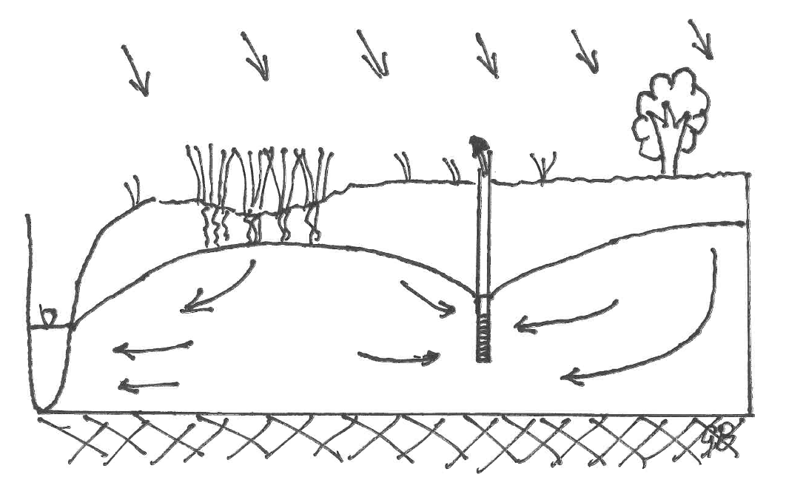

# Learning goals
*  Performing local and global sensitivity analysis on a simple model *(Exercise 1-3)*
*  Understanding the influence of the epsilon value on the results of the sensitivity analysis *(Exercise 4,5)*
*  Understanding the importance of the size of the parameter sample for the results of the sensitivity analysis *(Exercise 6,7)*

# Introduction
In this practical you will conduct your own sensitivity analysis of a groundwater model to its parameters. The model you will study simulates a groundwater extraction well that is located next to a nature reserve (depicted by the reed vegetation), as shown in the figure below. A river is situated on the left side of the nature reserve.  

   

```{r}
rm(list=ls())
library(FVFE1D)
```

# 1. An example of sensitivity analysis
<div class="exercise">
First of all, install the following packages from CRAN:   
*  `LHS`   
*  `truncnorm`   
*  `matrixStats`   
</div>

<div class="exercise">
1. Read the example of a sensitivity analysis carefully, found in the 'ExampleSensitivity' folder. Reading through the html is a good recap of the material you should understand. If there are questions about techniques or interpretations, please ask them.
</div>

# 2. Building the model

## The mathematical setup
First, the 1D groundwater model is built in the same way as the ones you built in earlier assignments.
The first step is choosing the spatial model domain:
```{r}
domain = c(0,500) 
```

The system (internal) flux will be a simple Dupuit flux, with a transmissivity $kD$ 
that changes linearly between the left and right side of the domain.

```{r}
kDl = 55
kDr = 35
kD.fun = approxfun(domain,c(kDl,kDr)) #gives a (linear) function for the transmissivity
# caution: every time you change kDl or kDr you have to reconstruct this function
internal.flux = function(x,state,gradstate) 
  {
  return(-kD.fun(x)*gradstate)
  }
```

The chunk below constructs the new model with the name 'base run':  
```{r}
GWmodel = newFLOW1D(domain,internal.flux) 
set.name(GWmodel,"base run")
```

There is constant recharge flux (rainfall) on top of the model, and an extraction well. The recharge is a spatial flux, the extraction well is a point flux.   

```{r}
P = 0.001
add.spatialflux(GWmodel,"P","recharge")
Qwell = -0.35
add.pointflux(GWmodel,at = 275, value= 'Qwell',name = 'well')
```

On the left hand side, the river with a water level of 1 m is used as a boundary condition.
The right hand side is a water divide, implying a zero flux boundary, which is automatically applied as the default in the FVFE1D package.

```{r}
hl = 1
set.BC.fixedstate(GWmodel,"left","hl") 
```

## The numerical setup and base run solution
The domain is discretized with nodes and a solution technique. Here the Finite Volume technique is used.

```{r}
nodes = seq(from=domain[1],to=domain[2],length=50) 
set.discretisation(GWmodel,nodes,"FV")
```

```{r}
control = solve.steps(GWmodel)
plot(GWmodel,fluxplot=TRUE) 
```

## Choice of MRESULT

```{r}
MRESULT = function()
{
  XS = dataframe.states(GWmodel)
  MH = mean(XS[(XS$x>125)&(XS$x<200),"state"])
  return(MH)
}
```

<div class="exercise">
2. What does the `MRESULT` mean in water management terms?
</div>

<div class="student_answer">
Write your answer here...
</div>

<div class="answer">
The `MRESULT` function calculates the mean groundwater level in the nature area. We are interested in the effect of the extraction well on the nature reserve. The groundwater level at the location of the reserve is therefore an important model output.
</div>

# 3. Sensitivity analysis
You will now conduct your own sensitivity analysis on the model we just created.

<div class="exercise">
3. Analyse the sensitivity of the model states and the MRESULT to all the parameters of the model. Perform both the local sensitivity analysis (LSA) and the global sensitivity analysis (GSA).

Finish the script by systematically and one-by-one adding the sections of the `SensitivityExample.Rmd` you studied. Adjust the comments and conclusions in the example code to the case of the assignment!

**Choice of scales:**   
*  for the transmissivities, let the scale of variation be 1 times the base value at the left side of the domain, and 7.5 times the base value on the right side.   
*  for the spatial external fluxes, let the scale of variation be 25% of the base value   
*  for the point external fluxes, let the scale of variation be 40% of the base value 

The upper and lower boundaries for the parameters should be chosen such that:   
- all sampled transmissivities are positive   
- for all other cases: the parameter histograms should display all values. 
</div>

<div class="student_answer">
**Local sensitivity analysis**
</div>
Start adding code...

<div class="student_answer">
**Analysis of variation through sampling**
</div>
Start adding code...

<div class="answer">
See `Sens1DAnswer1.Rmd`.   
The *local sensitivity analysis* shows that the variation of the groundwater extraction rate has a large influence on the uncertainty in M. When looking at the groundwater levels over the whole domain, the rainfall, river level and right-side transmissivity are also important sources of uncertainty, depending on the location in the domain.

The *analysis by sampling* shows that the uncertainty in the groundwater results increases strongly from left to right in the domain. Again Qwell turns out to be the most important contributor to the variation in M, but P and kDl also have an important contribution, which is larger than in the LSA.
</div>

# 4. Influence of the epsilon value *eps*
The local sensitivity analysis depends on the choice of the 'disturbance' `eps`.

<div class="exercise">
4. Make the `eps` a factor 10 larger. Do you see any (significant) changes in the local sensitivity analysis?
</div>

<div class="student_answer">
Fill in your answer here...
</div>

<div class="answer">
No, there are only very small changes. This is probably because the epsilon value is still quite small relative to the scale of variation of the parameters.
</div>

<div class="exercise">
5. Take `eps`=10. Do you see any significant changes? What do you think about d{state}/d{hl}?
</div>

<div class="student_answer">
Fill in your answer here...
</div>

<div class="answer">
See `Sens1DAnswer2.Rmd`.   
Some small changes are visible, for instance, there are changes in the minimum values of dstate/dkDl and dstate/dkDr. Changes in the sensitivity due to a different `eps` point to a nonlinear dependence of M on this parameter. In local sensitivity analysis, the local derivative is approached using `eps`. This approach locally linearizes the function to determine the slope. The more non-linear the function is, the smaller `eps` has to be to justify this local lineariation.  

The relative contribution of the parameters to the uncertainty in M or the overall groundwater levels stays the same. Only the uncertainty in the groundwater level at the right end of the domain decreases.
</div>

<div class="comment">
In question 4 and 5 the effect of eps is investigated, but we don't discuss what this means for how to choose eps. Maybe we should include something about that? [LM] I added something to the answer about that.</div>

# 5. Influence of the random seed
<div class="exercise">
6. The sample generation for the GSA depends on the random seed. Do you see any significant differences in the GSA results if you change this seed?
</div>

<div class="student_answer">
Fill in your answer here...
</div>

<div class="answer">
See `Sens1DAnswer3.Rmd`.    
When you change the seed e.g. to 238, there are no visible changes to the parameter distributions. However, the Msample does change: its standard deviation is increased somewhat. Also there are quite significant changes in the calculated contributions of the parameters to the uncertainty in M: the contribution of kDl becomes much smaller, while the contribution of P increases.
</div>

<div class= "exercise">
7. How large do you have to make the sample size, to make the difference in results with two different seeds become insignificant?
</div>

<div class="student_answer">
Fill in your answer here...
</div>

<div class="answer">
See `Sens1DAnswer4.Rmd` (larger sample, seed=237) and `Sens1DAnswer5.Rmd` (larger sample, seed=238).   
With a sample size of about 1000, the differences between seed 237 and 238 are minimal. This shows that a sufficient sample size is important to ensure the GSA conclusions are correct. 
</div>
