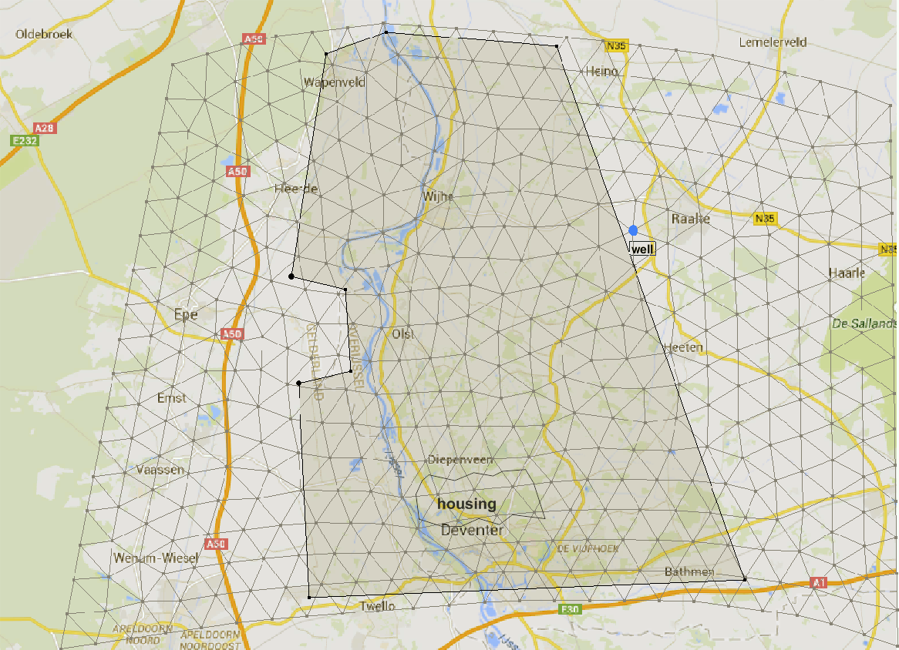

**Note that knitting this document can be time-consuming! Time to take a coffee or tea and contemplate about the beautiful world of numerics**

# Learning goals
*  Applying local and global sensitivity analysis in a more complex, 2D system 
*  Understanding why sensitivity can vary within a domain
*  Understanding the effect of a changed base value on the sensitivity analysis
*  Understanding why the results from local sensitivity analysis differ from those of global sensitivity analysis 
*  Understanding the role of the sample size for global sensitivity analysis

```{r message=FALSE}
rm(list=ls())
library(FVFE2D)
```

<div class="exercise">
If you haven't done so yet, install the following packages from CRAN:   
* lhs   
* truncnorm   
* matrixStats   
* fields   
</div>

```{r message=FALSE}
library(lhs)
library(truncnorm)
library(matrixStats)
library(fields)
```

# The 2D groundwater model

## Introduction
In this assignment, you will investigate the sensitivity of a 2D groundwater flow model for an area around the IJssel river (see Figure 1). In the east and west of the area, there are sandy, more elevated parts (Veluwe and Sallandse Heuvelrug). The middle part, around the river, is more low-lying and is drained by ditches (shaded rectangle). A well is present near Raalte. In the south, the city of Deventer is urban area (indicated in the map with 'housing').  


Figure 1: The study area.

The model is already built. The following workspace contains the model (called `IJsselmodel`) and all the data it requires.

```{r}
load("IJsselmodel.Rdata")
solve.steps(IJsselmodel)
```

Check what is in the model:
```{r}
print(summary(IJsselmodel))
set.name (IJsselmodel,"2D groundwater model for the IJssel area")
plot(IJsselmodel,fill="state",fill.contours=seq(0,8,by=1),
     addpolygons = list(list(housing,col=rgb(0,0,1,0.25)),
                        list(drainage,col=rgb(0,1,0,0.25))),
     addlines = list(list(river.xy,col="blue",lwd=2)))
```

The groundwater heads in the north and south of the domain are fixed; on the east and west there are zero-flow boundaries (water divides).
The model contains the spatial fluxes *recharge* (over the whole domain) and *drainage* (only in the draining zone, shaded rectangle); a well; and flow into or from the river. The river course and level are given. The housing area is shown in the map.

## Exploring the model

<div class="exercise">
Calculate the water balance of the whole model region. Discuss the relative contribution of the different fluxes in the system.
</div>

<div class="student_answer">
```{r eval=FALSE}
# calculate balance
```
</div>

<div class="answer">
The water balance for the whole model region can be investigated by:
```{r}
A=dataframe.balance(IJsselmodel)
Net=abs(A$net)
pie(Net,labels=A$name)
```

The water input from rainfall (recharge) is mainly discharged through the river, followed by drainage and groundwater flow over the boundaries. The well also removes a small part.
</div>

<div class="exercise">
In the chunk below, replace the XXXX by the proper function (consult the FVFE2D help if needed), so that the plot that follows shows the spatial distribution of the
drainage flux. What patterns do you see?
</div>

<div class="student_answer">
```{r eval=FALSE}
EF = XXXX
plot(IJsselmodel,fill=EF$drainage,
     addpolygons = list(list(drainage,col=rgb(0,1,0,0.15))))
```
</div>

<div class="answer">
```{r}
EF = dataframe.externalfluxes(IJsselmodel)
plot(IJsselmodel,fill=EF$drainage,addpolygons = list(list(drainage,col=rgb(0,1,0,0.15))),main="Drainage fluxes")

```
There is more drainage closer to the river, probably because of the lower elevation there.
</div>

The chunk below gives a histogram of the river flux values of all points in the domain. Most of the domain loses water to the river (displayed with a negative flux). There are some places where this flux is rather high.

```{r}
hist(EF$river,75,main="Histogram of river fluxes in the domain",xlab="Flux [m/d]",xlim=c(-10,5))
```

<div class="exercise">
Replace the XXXX in the following chunk by three values to draw contour lines, such that the plot gives a good overview of the flux towards the river. Discuss what you see.
</div>

<div class="student_answer">
```{r eval=FALSE}
plot(IJsselmodel,fill=EF$river,fill.contour=c(XXXX,XXXX,XXXX),
     addlines = list(list(river.xy,col="blue",lwd=1)))
```
</div>

<div class="answer">
```{r}
plot(IJsselmodel,fill=EF$river,fill.contour=c(-0.5,-1,-2), main="River fluxes",
     addlines = list(list(river.xy,col="blue",lwd=1)))
```
Most of the domain loses water to the river, although the fluxes are generally small. One spot in the upstream part of the river has very high drainage to the river; possibly the boundary condition is not accurate at that place.
</div>

In what follows, we want to investigate groundwater level in the housing area (which will be the objective for our sensitivity analysis, `MRESULT`). For that, we need a node that falls within this area. Node number 353 falls withing the housing area, as you can check with the following plot (zoom if needed).
```{r}
plot(IJsselmodel,nodenumbersize=1,
     addpolygons = list(list(housing,col=rgb(0,0,1,0.25))))
```

The function below ensures that `MRESULT` returns the state of the node we are interested in: 
```{r}
Iselect = 353 # Number of a node within the housing area
MRESULT = function()
{
  NS = dataframe.states(IJsselmodel)
  return(NS$state[Iselect])
}
```


<div class="exercise">
The state that `MRESULT` now returns is groundwater level. To get a feeling for the local impact of groundwater, we also want to know what the groundwater depth is - that is, the depth of the groundwater below the surface. The code below uses the `surface.fun(x,y)` function to determine the surface level at node 353. Use this information to convert groundwater level to groundwater depth. What can you say about the groundwater depth? To derive the coordinates of nodes 353 simply create a data frame with `dataframe.states(IJSSELmodel)` 
</div>

<div class="student_answer">
```{r eval=FALSE}
#derive the surface level for node 353
df = dataframe.states(IJsselmodel)
surface_at_Iselect = surface.fun(df$x[Iselect],df$y[Iselect])

#calculate groundwater depth


```
</div>

<div class="answer">
```{r}
#derive the surface level for node 353
df = dataframe.states(IJsselmodel)
surface_at_353 = surface.fun(df$x[353],df$y[353])

#calculate groundwater depth
print(surface_at_353) #this shows the surface level at the housing area (node 353)
print(surface_at_353-MRESULT()) #depth of groundwater below surface
```
The depth of the groundwater table is about 76 centimeters. Current Dutch regulations indicate a range between 0.50 and 1.50 m for built-up area, depending on the local situation (https://www.rijksoverheid.nl/onderwerpen/water/waterbeheer-in-nederland).
A too shallow groundwater table may result in wet or flooded cellars but a too low groundwater table may result in drought and consequences for the foundation of houses (e.g subsidence, dry rot). It is therefore an important aspect when developing built-up area.
</div>


## Store base run and define scale of variation for sensitivity analysis

We save the base run results, both for `MRESULT` (groundwater level at our selected location) and for all states (groundwater level in the whole domain).
```{r}
M_base = MRESULT()
print(M_base)
state_base = dataframe.states(IJsselmodel)$state
```

There are seven parameters in this model:   
*  Recharge flux (net rainfall) [m/d]   
*  Well extraction rate [m$^3$/d]   
*  Transmissivity of the aquifer [m$^2$/d]   
*  Resistance of the river bed to exchange with the groundwater [d]:       
   $q_{exchange}=(H_{river}-H_{groundwater})/resistance$    
*  Fixed state boundary condition at the south boundary [m]   
*  Fixed state boundary condition at the north boundary [m]   
*  Resistance to drainage through ditches [d]:   
   $q_{drainage}=mean(H_{groundwater}-H{drains})/resistance$   


```{r}
base= list(Qrch=Qrch,Qwell=Qwell,kD=kD,river.resist=river.resist,
           south.bnd=south.bnd,north.bnd=north.bnd,drainage.resist=drainage.resist)
str(base)
```

Their scale of variation is given by:
```{r}
scale= list(Qrch=0.00025,Qwell=500,kD=50,river.resist=2.5,
           south.bnd=0.2,north.bnd=0.2,drainage.resist=80)
str(scale)
```

# Local sensitivity analysis in 2D

## Calculate the sensitivity 
<div class="exercise">
In the chunk below, we start with the sensitivity to the recharge flux `Qrch`. A different `eps` is used than before. Why is `eps` defined this way? 
</div>

<div class="student_answer">
Type your answer here...
</div>

<div class="exercise">
Check if you recognize all the steps that are required for local sensitivity analysis in the chunk below. After that, run the chunk and discuss the results.
</div>

```{r,fig.height=4}
eps = scale$Qrch * 1e-2
Qrch = base$Qrch+eps
control = solve.steps(IJsselmodel, verbose=TRUE)   # set verbose to FALSE to decrease runtime.
Qrch=base$Qrch

# For MRESULT (groundwaterlevel in build-up area)
dMdQrch  = (MRESULT()-M_base)/eps
varM.Qrch = (scale$Qrch*dMdQrch)^2 #the variance in M due to Qrch
print(paste("Variance in M due to Qrch=",varM.Qrch))

# For all states
dstatedQrch = (dataframe.states(IJsselmodel)$state-state_base)/eps
varState.Qrch = (scale$Qrch*dstatedQrch)^2
set.name(IJsselmodel,"Variance due to Qrch")
plot(IJsselmodel,fill=varState.Qrch)
```

<div class="answer">
The `eps` value is now _relative_ to the scale of variation of a parameter. This may be a better way of defining `eps`, because the units and scales of variation are very different between the parameters. For example, Qrch varies in the order of mm/d, while kD may vary by tens of m$^2$/d. For a parameter with a small standard deviation, you would need a small eps, so that you are not looking at slopes outside of the range of your parameter. For parameters with a large standard deviation, a larger eps is needed to get a realistic idea of the local sensitivity slope. 

The plot shows how sensitivity of the states throughout the domain varies for parameter Qrch. The sensitivity to the recharge, Qrch, is largest near the no-flux boundaries. In the middle of the domain, the drainage and the river limit the dependence on the recharge. At the south and north borders the groundwater levels are determined by the boundary conditions, making the variation due to the recharge zero.
</div>

<div class="exercise">
Now calculate the local sensitivities to the other six parameters: Qwell, kD, river.resist, south.bnd, north.bnd, drainage.resist. Do this both for MRESULT and for all the states. For each of the parameters, add a short discussion of the results.
</div>

_Qwell_
<div class="student_answer">
```{r}
# Type your code here...
```
</div>

<div class="answer">
```{r,fig.height=4}
eps = scale$Qwell * 1e-2
Qwell = base$Qwell+eps
control = solve.steps(IJsselmodel,verbose=FALSE)
Qwell=base$Qwell
# For the MRESULT
dMdQwell  = (MRESULT()-M_base)/eps
varM.Qwell = (scale$Qwell*dMdQwell)^2 #the variance in M due to Qwell
print(paste("Variance in M due to Qwell=",varM.Qwell))
# For all states
dstatedQwell = (dataframe.states(IJsselmodel)$state-state_base)/eps
varState.Qwell = (scale$Qwell*dstatedQwell)^2
set.name(IJsselmodel,"Variance due to Qwell")
plot(IJsselmodel,fill=varState.Qwell)
```

Only the immediate neighbourhood of the well is sensitive to the variation in extraction rates.
</div>

_kD_
<div class="student_answer">
```{r}
# Type your code here...
```
</div>

<div class="answer">
```{r,fig.height=4}
eps = scale$kD * 1e-2
kD = base$kD+eps
control = solve.steps(IJsselmodel,verbose=FALSE)
kD=base$kD
# For the MRESULT
dMdkD  = (MRESULT()-M_base)/eps
varM.kD = (scale$kD*dMdkD)^2 #the variance in M due to kD
print(paste("Variance in M due to kD=",varM.kD))
# For all states
dstatedkD = (dataframe.states(IJsselmodel)$state-state_base)/eps
varState.kD = (scale$kD*dstatedkD)^2
set.name(IJsselmodel,"Variance due to kD")
plot(IJsselmodel,fill=varState.kD)
```

The sensitivity with respect to the kD is highest near the no-flux boundaries. Closer to the river, drainage and seepage limit the sensitivity to kD. The influence of kD is also visible around the well.
</div>

_river.resist_
<div class="student_answer">
```{r}
# Type your code here...
```
</div>

<div class="answer">
```{r,fig.height=4}
eps = scale$river.resist * 1e-2
river.resist = base$river.resist+eps
control = solve.steps(IJsselmodel,verbose=FALSE)
river.resist=base$river.resist
# For the MRESULT
dMdriver.resist  = (MRESULT()-M_base)/eps
varM.river.resist = (scale$river.resist*dMdriver.resist)^2 #the variance in M due to the river resistance
print(paste("Variance in M due to river.resist=",varM.river.resist))
# For all states
dstatedriver.resist = (dataframe.states(IJsselmodel)$state-state_base)/eps
varState.river.resist = (scale$river.resist*dstatedriver.resist)^2
set.name(IJsselmodel,"Variance due to river.resist")
plot(IJsselmodel,fill=varState.river.resist)
```

The sensitivity to the river resistance is only visible in a small corner at the upstream part of the river. This is also where we saw the possible error in the boundary conditions.
</div>


_south.bnd_
<div class="exercise">
Note: when you adapt the `south.bnd` and `north.bnd` values, the model **will not automatically adapt the boundary conditions**. Make sure you do this yourself after you have adapted the south.bnd or north.bnd value. For the south boundary, this can be done by:  
`for (i in c(1,2,13,14,15,16)) {set.BC.fixedstate(IJsselmodel,i,south.bnd)}`
Also change the boundary condition manually again after you have reset the south.bnd value.
</div>

<div class="student_answer">
```{r}
# Type your code here...
```
</div>

<div class="answer">
```{r,fig.height=4}
eps = scale$south.bnd * 1e-2
south.bnd = base$south.bnd+eps
for (i in c(1,2,13,14,15,16)) {set.BC.fixedstate(IJsselmodel,i,south.bnd)}
control = solve.steps(IJsselmodel,verbose=FALSE)
south.bnd=base$south.bnd
for (i in c(1,2,13,14,15,16)) {set.BC.fixedstate(IJsselmodel,i,south.bnd)}
# For the MRESULT
dMdsouth.bnd  = (MRESULT()-M_base)/eps
varM.south.bnd = (scale$south.bnd*dMdsouth.bnd)^2 #the variance in M due to the southern boundary condition
print(paste("Variance in M due to south.bnd=",varM.south.bnd))
# For all states
dstatedsouth.bnd = (dataframe.states(IJsselmodel)$state-state_base)/eps
varState.south.bnd = (scale$south.bnd*dstatedsouth.bnd)^2
set.name(IJsselmodel,"Variance due to south.bnd")
plot(IJsselmodel,fill=varState.south.bnd)
```

The influence of the boundary condition is limited to about 1 km from the boundary. In the middle, where the river is located, the river fluxes limit the sensitivity to the boundary condition.
</div>


_north.bnd_

<div class="exercise">
Again take care to manually reset the boundary conditions. For the northern boundary, use:
`for (i in 4:11) {set.BC.fixedstate(IJsselmodel,i,north.bnd)}`
</div>

<div class="student_answer">
```{r}
# Type your code here...
```
</div>

<div class="answer">
```{r,fig.height=4}
eps = scale$north.bnd * 1e-2
north.bnd = base$north.bnd+eps
for (i in 4:11) {set.BC.fixedstate(IJsselmodel,i,north.bnd)}
control = solve.steps(IJsselmodel,verbose=FALSE)
north.bnd=base$north.bnd
for (i in 4:11) {set.BC.fixedstate(IJsselmodel,i,north.bnd)}
# For the MRESULT
dMdnorth.bnd  = (MRESULT()-M_base)/eps
varM.north.bnd = (scale$north.bnd*dMdnorth.bnd)^2 #the variance in M due to the northern boundary condition
print(paste("Variance in M due to north.bnd=",varM.north.bnd))
# For all states
dstatednorth.bnd = (dataframe.states(IJsselmodel)$state-state_base)/eps
varState.north.bnd = (scale$north.bnd*dstatednorth.bnd)^2
set.name(IJsselmodel,"Variance due to north.bnd")
plot(IJsselmodel,fill=varState.north.bnd)
```

The sensitivity to the northern boundary condition shows the same pattern as for the southern boundary. The groundwater levels are sensitive up to about 1 km distance, except where the river is flowing.
</div>

_drainage.resist_

<div class="student_answer">
```{r}
# Type your code here...
```
</div>

<div class="answer">
```{r,fig.height=4}
eps = scale$drainage.resist * 1e-2
drainage.resist = base$drainage.resist+eps
control = solve.steps(IJsselmodel,verbose=FALSE)
drainage.resist=base$drainage.resist
# For the MRESULT
dMddrainage.resist  = (MRESULT()-M_base)/eps
varM.drainage.resist = (scale$drainage.resist*dMddrainage.resist)^2 #the variance in M due to the drainage resistance
print(paste("Variance in M due to drainage.resist=",varM.drainage.resist))
# For all states
dstateddrainage.resist = (dataframe.states(IJsselmodel)$state-state_base)/eps
varState.drainage.resist = (scale$drainage.resist*dstateddrainage.resist)^2
set.name(IJsselmodel,"Variance due to drainage.resist")
plot(IJsselmodel,fill=varState.drainage.resist)
```

The sensitivity with respect to the drainage resistance is restricted to the drained area, with the exception of the river path. There the river controls the groundwater levels.
</div>


## Relative contribution of the parameters to variance in MRESULT 

The following chunk plots the relative contributions of the parameters to MRESULT (groundwater level in housing area) with a pie chart:
```{r}
varMtot = varM.Qrch+varM.Qwell+varM.kD+varM.river.resist+
    varM.drainage.resist+varM.south.bnd+varM.north.bnd
relvarM = list(Qrch = varM.Qrch/varMtot,
             Qwell = varM.Qwell/varMtot,
             kD  = varM.kD/varMtot,
             river.resist  = varM.river.resist/varMtot,
             drainage.resist = varM.drainage.resist/varMtot,
             south.bnd = varM.south.bnd/varMtot,
             north.bnd = varM.north.bnd/varMtot)
str(relvarM)
pie(as.numeric(relvarM),labels=names(relvarM),
    main=paste("Standard deviation of M =",round(sqrt(varMtot),4),"m"),
    col = rainbow(length(relvarM)))
```

<div class="exercise">
Discuss the relative contribution of the parameters to the variation in MRESULT. Is it as you had expected?
</div>

<div class="student_answer">
Type your answer here...
</div>

<div class="answer">
The variation in the groundwater level of the housing area as induced by uncertainty in parameters and boundary conditions, is about 13 cm. Clearly the recharge is the dominant source of variation, followed by the river and drainage resistance. That recharge is important, could have been expected by the fact that recharge is by far the largest flux, although the parameter describing the largest overall flux does not always have to be the most sensitive parameter.  
</div>

## Variance in the states throughout the whole domain 

```{r}
varStateTot = varState.Qrch + varState.Qwell + varState.kD + varState.drainage.resist +   varState.river.resist + varState.south.bnd + varState.north.bnd
set.name(IJsselmodel,"Total scale of variation of groundwater level")
plot(IJsselmodel,fill=sqrt(varStateTot))
```

<div class="exercise">
Below, the relative contribution of the parameters to the variation in the groundwater levels over the complete domain is calculated. The first example for Qrch is already given. Finish the analysis for the other parameters. Add a discussion at the end about how the contributions of all the parameters are distributed over the domain.
</div>


_Qrch_

```{r}
set.name(IJsselmodel,"Fraction contribution Qrch to variation in states")
plot(IJsselmodel,fill= varState.Qrch/varStateTot)
```

_Qwell_
<div class="student_answer">
```{r}
# Type your code here...
```
</div>

<div class="answer">
```{r}
set.name(IJsselmodel,"Fraction contribution Qwell to variation in states")
plot(IJsselmodel,fill= varState.Qwell/varStateTot)
```
</div>

_kD_

<div class="student_answer">
```{r}
# Type your code here...
```
</div>

<div class="answer">
```{r}
set.name(IJsselmodel,"Fraction contribution kD to variation in states")
plot(IJsselmodel,fill= varState.kD/varStateTot)
```
</div>

_river.resist_
<div class="student_answer">
```{r}
# Type your code here...
```
</div>

<div class="answer">
```{r}
set.name(IJsselmodel,"Fraction contribution river.resist to variation in states")
plot(IJsselmodel,fill= varState.river.resist/varStateTot)
```
</div>

_south.bnd_

<div class="student_answer">
```{r}
# Type your code here...
```
</div>

<div class="answer">
```{r}
set.name(IJsselmodel,"Fraction contribution south.bnd to variation in states")
plot(IJsselmodel,fill= varState.south.bnd/varStateTot)
```
</div>

_north.bnd_
<div class="student_answer">
```{r}
# Type your code here...
```
</div>

<div class="answer">
```{r}
set.name(IJsselmodel,"Fraction contribution north.bnd to variation in states")
plot(IJsselmodel,fill= varState.north.bnd/varStateTot)
```
</div>

_drainage.resist_
<div class="student_answer">
```{r}
# Type your code here...
```
</div>

<div class="answer">
```{r}
set.name(IJsselmodel,"Fraction contribution drainage.resist to variation in states")
plot(IJsselmodel,fill= varState.drainage.resist/varStateTot)
```
</div>

<div class="student_answer">
Discuss the results here ...
</div>

<div class="answer">
Which parameter causes most of the variation in M varies widely depending on location. The recharge is dominant in most places, but not everywhere: all parameters have some location where they dominate. The extraction well and the drainage resistance show important local contributions to the variation in M. Sensitivity analysis can be perceived as a method to investigate uncertainty, but as shown here, it can also provide insight into which processes dominate where.
</div>

## Changing the base value

Assume that by dredging the river, the resistance of the river bed is decreased (see chunk below). This may affect the sensitivity patterns of the model.
```{r}
base$river.resist = base$river.resist/2
```
Below, recalculate the local sensitivities of the groundwater levels (states) the way you did before. For this, you should create a new base run that includes the new river bed resistance. Recalculate the local sensitivities of the groundwater levels of the model (there is no need to make all the local sensitivity plots again). Finally, evaluate the effect of the changed base value.


<div class="exercise">
Recalculate the base run with the updated river resistance
</div>

<div class="student_answer">
```{r}
# type your code here...
```
</div>

<div class="answer">
```{r}
river.resist=base$river.resist
set.name(IJsselmodel, "IJssel model, lowered river resistance")
solve.steps(IJsselmodel)

M_base = MRESULT()
print(M_base)
state_base = dataframe.states(IJsselmodel)$state
```
</div>

<div class="exercise">
Recalculate local sensitivities to all parameters
</div>

<div class="student_answer">
```{r}
# Type your code here...
```
</div>

<div class="answer">
```{r}
## Qrch
eps = scale$Qrch * 1e-2
Qrch = base$Qrch+eps
control = solve.steps(IJsselmodel,verbose=TRUE)
Qrch=base$Qrch
# For the MRESULT
dMdQrch  = (MRESULT()-M_base)/eps
varM.Qrch = (scale$Qrch*dMdQrch)^2 #the variance in M due to Qrch
# For all states
dstatedQrch = (dataframe.states(IJsselmodel)$state-state_base)/eps
varState.Qrch = (scale$Qrch*dstatedQrch)^2

## Qwell
eps = scale$Qwell * 1e-2
Qwell = base$Qwell+eps
control = solve.steps(IJsselmodel,verbose=FALSE)
Qwell=base$Qwell
# For the MRESULT
dMdQwell  = (MRESULT()-M_base)/eps
varM.Qwell = (scale$Qwell*dMdQwell)^2 #the variance in M due to Qwell
# For all states
dstatedQwell = (dataframe.states(IJsselmodel)$state-state_base)/eps
varState.Qwell = (scale$Qwell*dstatedQwell)^2

## kD
eps = scale$kD * 1e-2
kD = base$kD+eps
control = solve.steps(IJsselmodel,verbose=FALSE)
kD=base$kD
# For the MRESULT
dMdkD  = (MRESULT()-M_base)/eps
varM.kD = (scale$kD*dMdkD)^2 #the variance in M due to kD
# For all states
dstatedkD = (dataframe.states(IJsselmodel)$state-state_base)/eps
varState.kD = (scale$kD*dstatedkD)^2

## river.resist
eps = scale$river.resist * 1e-2
river.resist = base$river.resist+eps
control = solve.steps(IJsselmodel,verbose=FALSE)
river.resist=base$river.resist
# For the MRESULT
dMdriver.resist  = (MRESULT()-M_base)/eps
varM.river.resist = (scale$river.resist*dMdriver.resist)^2 #the variance in M due to the river resistance
# For all states
dstatedriver.resist = (dataframe.states(IJsselmodel)$state-state_base)/eps
varState.river.resist = (scale$river.resist*dstatedriver.resist)^2

## drainage.resist
eps = scale$drainage.resist * 1e-2
drainage.resist = base$drainage.resist+eps
control = solve.steps(IJsselmodel,verbose=FALSE)
drainage.resist=base$drainage.resist
# For the MRESULT
dMddrainage.resist  = (MRESULT()-M_base)/eps
varM.drainage.resist = (scale$drainage.resist*dMddrainage.resist)^2 #the variance in M due to the drainage resistance
# For all states
dstateddrainage.resist = (dataframe.states(IJsselmodel)$state-state_base)/eps
varState.drainage.resist = (scale$drainage.resist*dstateddrainage.resist)^2

## south.bnd
eps = scale$south.bnd * 1e-2
south.bnd = base$south.bnd+eps
for (i in c(1,2,13,14,15,16)) {set.BC.fixedstate(IJsselmodel,i,south.bnd)}
control = solve.steps(IJsselmodel,verbose=FALSE)
south.bnd=base$south.bnd
for (i in c(1,2,13,14,15,16)) {set.BC.fixedstate(IJsselmodel,i,south.bnd)}
# For the MRESULT
dMdsouth.bnd  = (MRESULT()-M_base)/eps
varM.south.bnd = (scale$south.bnd*dMdsouth.bnd)^2 #the variance in M due to the southern boundary condition
# For all states
dstatedsouth.bnd = (dataframe.states(IJsselmodel)$state-state_base)/eps
varState.south.bnd = (scale$south.bnd*dstatedsouth.bnd)^2

## north.bnd
eps = scale$north.bnd * 1e-2
north.bnd = base$north.bnd+eps
for (i in 4:11) {set.BC.fixedstate(IJsselmodel,i,north.bnd)}
control = solve.steps(IJsselmodel,verbose=FALSE)
north.bnd=base$north.bnd
for (i in 4:11) {set.BC.fixedstate(IJsselmodel,i,north.bnd)}
# For the MRESULT
dMdnorth.bnd  = (MRESULT()-M_base)/eps
varM.north.bnd = (scale$north.bnd*dMdnorth.bnd)^2 #the variance in M due to the northern boundary condition
# For all states
dstatednorth.bnd = (dataframe.states(IJsselmodel)$state-state_base)/eps
varState.north.bnd = (scale$north.bnd*dstatednorth.bnd)^2
```

<div class="exercise">
Plot the sensitivity of the groundwater levels to the river resistance. Add a short discussion: what is the effect of the changed river resistance?
</div>


<div class="student_answer">
```{r}
# Type your code here...
```
</div>

<div class="answer">
```{r,fig.height=4}
set.name(IJsselmodel,"Variance due to river.resist, lowered river.resist")
plot(IJsselmodel,fill=varState.river.resist)
```

The pattern of the local sensitivities is the same as before. However, the values are higher. Changes in the base-value thus can change the conclusions of a LSA! 
</div>

<div class="exercise">
Plot the relative contribution of river.resist to the variation in the groundwater levels over the domain. Compare them with the results based on the old base value, and shortly discuss your observations.
</div>

<div class="student_answer">
```{r}
# Type your code here...
```
Discussion:
</div>

<div class="answer">
```{r}
varStateTot = varState.Qrch + varState.Qwell + varState.kD + varState.drainage.resist + 
    varState.river.resist + varState.south.bnd + varState.north.bnd
set.name(IJsselmodel,"Fraction contribution river.resist to variation in states")
plot(IJsselmodel,fill= varState.river.resist/varStateTot)
```

The relative contribution of the river resistance has increased, especially in the upstream area of the river. Here, it now causes almost all of the variation in groundwater levels.
</div>

<div class="exercise">
Calculate the relative contribution of river.resist to the variation in MRESULT and describe the changes. Plot the results in a pie chart.
</div>

<div class="student_answer">
```{r}
# Type your code here...
```
Discussion:
</div>

<div class="answer">
The following chunk plots the relative contributions of the parameters to the variation in the groundwater level in the housing area with a pie chart:
```{r}
varMtot = varM.Qrch+varM.Qwell+varM.kD+varM.river.resist+
    varM.drainage.resist+varM.south.bnd+varM.north.bnd
relvarM = list(Qrch = varM.Qrch/varMtot,
             Qwell = varM.Qwell/varMtot,
             kD  = varM.kD/varMtot,
             river.resist  = varM.river.resist/varMtot,
             drainage.resist = varM.drainage.resist/varMtot,
             south.bnd = varM.south.bnd/varMtot,
             north.bnd = varM.north.bnd/varMtot)

str(relvarM)
pie(as.numeric(relvarM),labels=names(relvarM),
    main=paste("Standard deviation of M =",round(sqrt(varMtot),4),"m"),
    col = rainbow(length(relvarM)))
```

Looking at the MRESULT before and after the "dredging" (represented as lowering of river.resist), the groundwater level in the housing area has decreased by about 3 cm. However, the standard deviation of M has increased by about the same amount. The relative contribution of the river resistance has become much larger, and even dominates over the recharge. This makes sense because the housing area is just in the upstream area close to the river, where the contribution of the river resistance is largest. This exercise demonstrates that the base values have high influence on the results of LSA. If the situation in the area changes, and as a consequence one of the parameter values changes, a new sensitivity analysis is needed. 
</div>

Reset the river resistance to its original value:

```{r}
base$river.resist = base$river.resist*2
river.resist=base$river.resist
```

# Global Sensitivity Analysis (GSA)

The functions defined in this script will be used to create parameter samples:
```{r}
source("samplehelpers.R")
```

## 5.1 GSA with a small sample size
Because the model takes a while to run, you will do a 'try-out' GSA with a (very) small sample size of 5.

**Constructing the parameter sample**

<div class="exercise">
In the chunk below, choose sensible boundaries for the parameters, and sample the parameters. 
</div>

This step already displays the first difference between LSA and GSA: we no longer take a base-value for a parameter, for which we estimate the uncertainty, but we take the full range of plausible parameter values by defining upper and lower parameter boundaries. (Hint; don't forget that the extraction well is a negative number) 

<div class="student_answer">
```{r eval=FALSE}
parnames = names(base)
parmeans = unlist(base)
parsd    = unlist(scale)
parlower = XXXX
parupper = XXXX
samplesize = 5
set.seed(237)
parsampleTest = GaussianLHS(samplesize,parmeans,parsd,parnames,parlower,parupper) 
```
</div>

<div class="answer">
```{r}
parnames = names(base)
parmeans = unlist(base)
parsd    = unlist(scale)
#parlower = XXXX
#parupper = XXXX
parlower = c(0,   -4000,  0, 0.5, 5,  2, 5)
parupper = c(0.1, -1500, 500, 10, 7,  4, 500)
samplesize = 5 
set.seed(237)
parsampleTest = GaussianLHS(samplesize,parmeans,parsd,parnames,parlower,parupper) 
```
</div>

**Making all the model runs**

<div class="exercise">
Run the model for your five parameter samples and save the MRESULT (still defined as groundwater level in housing area) of each run - this is best done in a for-loop.   Make a plot or histogram of MRESULT to get a first idea of the variation.
</div>

<div class="student_answer">
```{r}
#type your code here...
```
</div>

<div class="answer">
```{r}
MsampleTest = c()
for(i in 1:nrow(parsampleTest))
    {
    print(paste("doing sample",i))
    Qrch = parsampleTest[i,"Qrch"]
    Qwell = parsampleTest[i,"Qwell"]
    kD  = parsampleTest[i,"kD"]
    river.resist  = parsampleTest[i,"river.resist"]
    drainage.resist = parsampleTest[i,"drainage.resist"]
    south.bnd = parsampleTest[i,"south.bnd"]
    north.bnd = parsampleTest[i,"north.bnd"]
    control = solve.steps(IJsselmodel)
    MsampleTest [i] = MRESULT()
    }

hist(MsampleTest,main="Histogram of M values, small parameter sample")
print(sd(MsampleTest))
```
The histogram of M values (groundwater level in the housing area) more or less centers around what we defined as base value (M_base) for local sensitivity analysis, but it is not a nice well-shaped normal distribution. This sample size probably does not give an accurate estimate of the standard deviation (uncertainty) in M.
</div>

## 5.2 GSA with a larger parameter sample
For calculation-time reasons, we already run the model with a sample size of 50:
```{r}
rm(MsampleTest,parsampleTest)
load("AVS_mpsample.Rdata")
#Combine the M-sample and the parameter-sample into one big matrix:
Mpsample = cbind(M=Msample,parsample)
head(Mpsample)
```

**Analysis of the M-sample**

First we determine the basic statistics of the M-sample:
```{r}
VARM = var(Msample)
SDM = sd(Msample)
print(paste("Variance of sample M",round(VARM,4)))
print(paste("Standard deviation of M",round(SDM,4)))
```

But we can gain more insight by plotting the histogram:
```{r}
smoothdens = density(Msample)
histdata = hist(Msample,plot=FALSE)$density
yrange = range(smoothdens$y,histdata)
hist(Msample,col="lightblue",prob=TRUE,ylim=yrange)
rug(Msample,col="red")
lines(smoothdens,col="red",lwd=3)
```

## 5.4 Conditional expectation of M with relation to parameters
<div class="exercise">
Plot and analyse the conditional expectation of M with relation to each of the parameters (you can have a look at the first global sensitivity analysis assignment for inspiration).
</div>

<div class="student_answer">
```{r}
# Add your code here...
```
</div>

<div class="answer">
We approximate the conditional expectation of M given the parameters:
```{r}
plot(Mpsample[,"Qrch"],Mpsample[,"M"],xlab="Qrch",ylab="M",main="Conditional expectation w.r.t. Qrch")
McondQrch = linloess(M~Qrch,data=Mpsample)
points(Mpsample[,"Qrch"],McondQrch,pch=20,col="red")
```

```{r}
plot(Mpsample[,"Qwell"],Mpsample[,"M"],xlab="Qwell",ylab="M",main="Conditional expectation w.r.t. Qwell")
McondQwell = linloess(M~Qwell,data=Mpsample)
points(Mpsample[,"Qwell"],McondQwell,pch=20,col="red")
```

```{r}
plot(Mpsample[,"kD"],Mpsample[,"M"],xlab="kD",ylab="M",main="Conditional expectation w.r.t. kD")
McondkD = linloess(M~kD,data=Mpsample)
points(Mpsample[,"kD"],McondkD,pch=20,col="red")
```

```{r}
plot(Mpsample[,"river.resist"],Mpsample[,"M"],xlab="river.resist",ylab="M",main="Conditional expectation w.r.t. river.resist")
Mcondriver.resist = linloess(M~river.resist,data=Mpsample)
points(Mpsample[,"river.resist"],Mcondriver.resist,pch=20,col="red")
```

```{r}
plot(Mpsample[,"drainage.resist"],Mpsample[,"M"],xlab="drainage.resist",ylab="M",main="Conditional expectation w.r.t. drainage.resist")
Mconddrainage.resist = linloess(M~drainage.resist,data=Mpsample)
points(Mpsample[,"drainage.resist"],Mconddrainage.resist,pch=20,col="red")
```

```{r}
plot(Mpsample[,"south.bnd"],Mpsample[,"M"],xlab="south.bnd",ylab="M",main="Conditional expectation w.r.t. south.bnd")
Mcondsouth.bnd = linloess(M~south.bnd,data=Mpsample)
points(Mpsample[,"south.bnd"],Mcondsouth.bnd,pch=20,col="red")
```

```{r}
plot(Mpsample[,"north.bnd"],Mpsample[,"M"],xlab="north.bnd",ylab="M",main="Conditional expectation w.r.t. north.bnd")
Mcondnorth.bnd = linloess(M~north.bnd,data=Mpsample)
points(Mpsample[,"north.bnd"],Mcondnorth.bnd,pch=20,col="red")
```
</div>

## 5.5 Contributions of the parameters to the M-variance
<div class="exercise">
Finish the global sensitivity analysis by determining the relative contribution of each of the parameters to the total variance in M.
</div>

<div class="student_answer">
```{r}
# add your code here...
```
</div>

<div class="answer">
```{r}
ANOVA1 = sample.vardecomp(Mpsample)
pie(ANOVA1,
    main=paste("Standard deviation of M =",round(SDM,4),"m"),
    col = rainbow(7),
    radius=1)
print(ANOVA1)
print(sqrt(ANOVA1))
```
</div>

## 5.6 Discussion
<div class="exercise">
Finally, describe your conclusions of the GSA analysis in section 5. Do the results differ from the local sensitivity analysis? What is the effect of the parameter sample size? Do you think the parameter set of 50 is large enough? Can you check if there is parameter interaction? 
</div>

<div class="student_answer">
Type your answer here...
</div>

<div class="answer">
The standard deviation of M is slightly lower in the global sensitivity analysis than found with the local sensitivity analysis. Of course, this can be different if you chose different upper and lower boundaries for the global sensitivity analysis, or different scales of variation in the local sensitivity analysis (or, a different base value in the local sensitivity analysis).

In global sensitivity analysis, the conditional expectation curves show that especially the recharge contains a lot of information on M, and also the river resistance and drainage resistance contain some information. Looking at the relative contributions of the parameters, Qrch turns out to be dominant, just like before in the local sensitivity analysis. However, the kD now dominates over the river resistance and drainage resistance, while in the local sensitivity they had about equal contributions. Local and global sensitivity analysis are different methods, that lead to different results. Think for yourself when which method would be appropriate. 

The sample size (50) is probably way too small. A way of testing whether your sample size is sufficient, is by means of a Kolmogorov-Smirnov test (beyond the scope of this course). With this test, it can be tested if the distribution of M significantly changes when the sample size is increased. If the distribution no longer significantly changes with increased sample size, the sample size can be considered sufficiently large. 

In the global sensitivity analysis we can indeed see that there is some parameter interaction; not all variance is explained by the parameters. 
</div>

