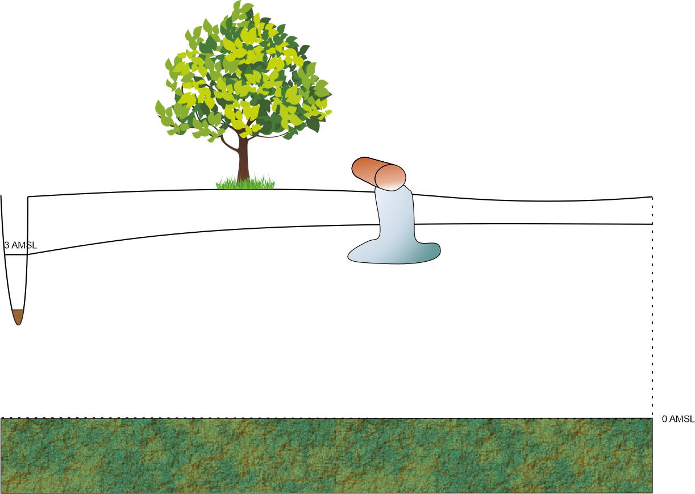
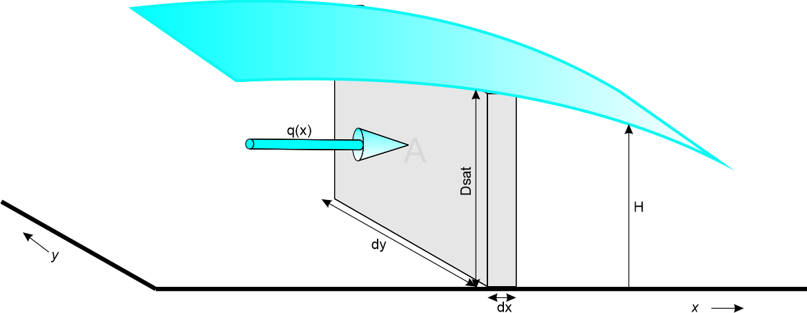
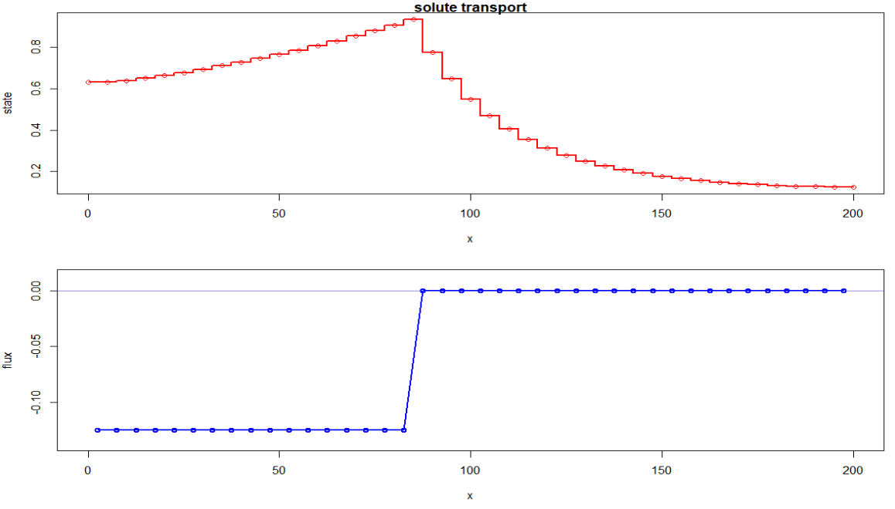
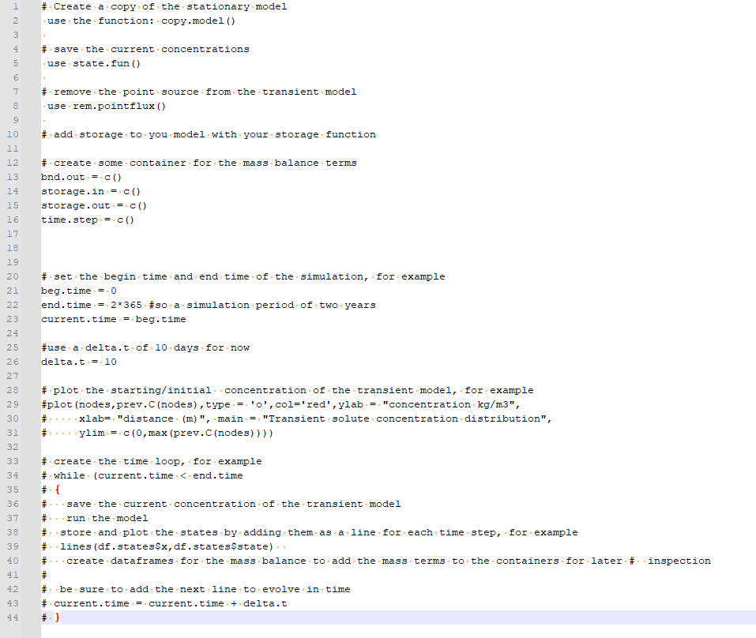

```{r}
rm(list = ls())
library(FVFE1D)
library(knitr)
library(gifski)
```

# Learning Goals

-   Understand the use of the Convection(or Advection) Diffusion/Dispersion Equation in the context of solute transport modeling.
-   Derive physical dimensions and properties related to solute transport modeling.\
-   Setup flow and transport models in a 1D or pseudo 2D environment using proper units.\
-   Critically evaluate the numerical aspects of the solutions (Courant and Peclet numbers).\
-   Setup water and mass balances for both types of models and analyse the result.
-   Carry out a local sensitivity analyses of various parameters w.r.t. the outcome of both models

# Introduction

In this exercise the basic Convection Diffusion Equation (CDE) as discussed during the lectures will be reviewed and an analysis of the appropriate dimensions/units will be discussed.
As an example we will consider the leakage of a contaminant from a vessel on the surface into the saturated groundwater towards a local river.\
First the equations (i.e. the internal fluxes) to setup a 1- (pseudo 2-) dimensional flow and 1- (pseudo 2-) dimensional transport model need to be derived and implemented.
Specific attention is paid to the translation of the flow, volume, density and mass into the proper units for the flow and transport problem.\
After the stationary flow model is run, the stationary transport model is run based on the local water velocities and saturated thickness of the flow model transporting the contaminants towards the river.\
The following assignment will be to analyse the effect of remediating the spill based on local groundwater flow only and with the aid of a "pump and treat" scenario.\
Finally a local sensitivity analysis is carried out analyzing the effects of various variables and parameters of both models on their results.

The convection diffusion equation as discussed during the lectures is: $$
\frac{\partial s}{\partial t}=-v \frac{\partial s}{\partial x}+D \frac{\partial^2 s}{\partial x^2}
$$

which is a mass balance for the particular state (s);\
With:

-   $\frac{\partial s}{\partial t}$: mass storage change during time\
-   $v \frac{\partial s}{\partial x}$: convective(advective) mass flux\
-   $D \frac{\partial^2 s}{\partial x^2}$: diffusive/dispersive mass flux

All the above terms (obviously) have dimensions: $\frac{\text{mass}}{\text{volume time}}$ and when multiplied with the appropriate control volume based on the finite volume or finite element techniques it results in a mass flux of $\frac{\text{mass}}{time}$ per time step.

Retardation (ad- and desorption properties of a solute which effectively slows down the convection and diffusion processes) and decay are omitted from this equation for simplicity and will not be considered in the simulations.

The convective part of this equation is based on the **mass flux** into (or out of) an elementary volume (e.g. a cube): $$
qC\,\,\text{or}\,\, v \text{por}C
$$\
Where:

-   $q$: Flux rate into (or out of) a face of the elementary volume (length/time)\
-   $\text{por}$ : porosity of the soil (volume water/volume soil)
-   $C$: Concentration of the solute (mass/volume)

The convective part couples groundwater to solute transport since this $q$ is determined by the groundwater model.

The diffusive part it is based on the equation of Fick (first law) which resembles Darcy's equation: $$
J=-D\frac{\partial C}{\partial x}
$$

Where:

-   $J$: Diffusion flux (rate) (mass/time)\
-   $D$: Diffusivity of Diffusion coefficient length$^2$/time

Detailed info on the implementation of the CDE into modeling aspect starts at section **Internal mass flux for the transport model**

::: question
Why is there a negative sign in the above equation?
:::

::: answer
The diffusion flux goes towards the lower concentration.
So if that is into the $x$ direction $C_{x+\Delta x}$ is lower than $C_{x}$.
Therefor, and similar like the Darcy equation the negative sign makes the flux to go in the proper direction.
:::

::: question
When using the following units:

-   length $\mathsf{m}$\
-   mass $\mathsf{kg}$\
-   concentration $\mathsf{kg/m^3}$\
-   time $d$

What is the unit for the following variables when one assumes 3 dimensional (x,y,z) flow and transport?

-   $D$\
-   $q$\
-   $C$\
-   $J$
:::

::: answer
-   $D$ : $\mathsf{m^2/d}$
-   $q$ : $\mathsf{m/d}$
-   $C$ : $\mathsf{kg/m^3}$
-   $J$ : $\mathsf{kg/d}$
:::

In this assignment we consider the concentration of a solute to be the **only** amount of mass in a **unit volume** of groundwater.
However in reality a concentration of e.g. 35 $kg/m^3$ of salt in a volume of 1000 liters groundwater will have a **density** of about 1025 $kg/m^3$ (also depending on pressure, viscosity and temperature).
So although $C$ and $\rho$ do have the same unit, they are different in the way we calculate them.
By the way, flow due to density differences are also not considered here!

# Groundwater flow model

The model for stationary groundwater flow consists of one phreatic aquifer (**k = 3**[$\mathsf{m/d}$]).
The saturated thickness is determined by the calculated head.
The total length of the model is **200 m**, use a nodal distance of **5 m**.
At the left boundary a Cauchy type condition is assigned, simulating a river with an open water level of **3.20 m** Above Mean Sea Level (AMSL) and and entrance resistance of **5 days**.
The right boundary is based on a water divide.
On top a uniform recharge om **1 mm/d** is applied.\
The (flat) bottom of the aquifer aligns with **0.0 m AMSL**.
This means that the calculated head is identical to the saturated thickness of the aquifer.
At a later stage, an extraction well will be added to the model.\
To determine specific volume fluxes the porosity of the soil is required and is here estimated on **30%**.\
Figure 1 illustrates the situation;



## Internal groundwater flux

The model which calculates the water(volume)flux is based on a flux rate integrated over the saturated thickness, here simply $H$;

$$
q_D = -kH(x)\frac{\partial H}{\partial x}
$$ Which makes this flux rate quasi 2D; since the calculated head provides the model with a (saturated) thickness.
The $_D$ in $q_D$ is to indicate that it is a flux over the total saturated thickness.

$H$: The saturated thickness over which flow takes place ($m$).

::: question
-   What is the unit of this flux rate $q_D$ for this model?
:::

::: answer
-   $q_D(x)$: the flux integrated over the saturated thickness $D_{sat}(x)$ per $\Delta y$ so $\mathsf{m^3/(d m)}$ which is simply $\mathsf{m^2/d}$
:::

The following illustration clarifies some dimensions of the flow in the 1D(or quasi 2D) model;



The volume groundwater in a slice of soil is now : $\text{por}\Delta x \Delta y \,D_{sat}$ (check the units!).
But since we consider a quasi 2-D model the $\Delta y$ is not considered in the equations.
In other words, the volume of groundwater in a slice ($\Delta x$) of soil is $m^3/m$, the $/m$ indicating the "per meter $\Delta y$".

::: question
-   How would you derive the water velocity $\left[\mathsf{m/d}\right]$ from this groundwater flow model?
:::

::: answer
-   To come from Darcy's flux "density" or rate to velocity: $v = \frac{q_D}{\text{porosity}\,D_{sat}}$. The water flow takes place in the pores.
:::

## Boundary conditions

Possible boundary conditions for the groundwater flow model are based on:

1.  Dirichlet type
2.  Neumann type
3.  Cauchy type

::: question
Implement the appropriate boundary conditions; the river with a river level and river bed resistance left and the water divide on the right
:::

::: answer
-   left is a Cauchy boundary condition with a prescribed level of 3.2 m AMSL and a river bed resistance of 5 days : $river = w \frac{H_{riv}-H_{mod}}{C}$
-   with $w$ : width (m) of the river bed and $C$ : river bed resistances (d)
-   right is a Neumann boundary condition, therefor no action is required
:::

## Setup groundwater flow model

::: question
1.  Setup this flow model and give it a distinctive name e.g. Fmodel or Flowmodel or so.
    a.  Use the `do.initialize(Fmodel,init = river_level)` function to avoid numerical problems due to the non-linear character of the internal flux function.
2.  Run the model and look at the results; head distribution, internal flux and water balance terms.
    1.  head and internal flux: `plot(Fmodel,fluxplot=TRUE,FVstyle=TRUE)`
    2.  waterbalance: `dataframe.balance(Fmodel)`
    3.  flux at boundaries: `dataframe.boundaries(Fmodel)`
:::

::: answer
1.  Model setup of the groundwater flow model

```{r}

#model domain
x_left = 0 #m boundary at left
x_right = 200 #m boundary at right
domain = c(x_left,x_right)


#properties aquifer
k = 3.0 #m/d
por = 0.3

#Cauchy boundary condition properties for river
river_level = 3.2 #m AMSL
river_resistance = 5.0  #d
river_width = 4.0 #m

river = function(head)
{
  return((river_level - head)/river_resistance * river_width)
}

#spatial flux, precipitation rate
precip = 0.001 #m/d

#math model& boundary conditions
#internal flux based on q_D as described above
Darcy <- function(x,head,gradH) 
{
  return(-k*head*gradH)
}
#setting up new flow model
Fmodel = newFLOW1D(domain = domain,systemfluxfunction = Darcy,name = "Stationary flow model ")

#adding the left boundary condition only, since right is a Neumann type no action needed there
set.BC.fluxstate(model = Fmodel,where = 'left',func = river)

#adding the precipitation
add.spatialflux(model = Fmodel,rate = 'precip',name = 'precipitation')

# numerical model
delta.x = 5 #m
nodes = seq(from=domain[1],to = domain[2],by=delta.x)
set.discretisation(model = Fmodel,nodes=nodes,method='FV')
do.initialize(model = Fmodel,init = river_level) # otherwise problems with non-linearity of the Darcy function
summary(Fmodel)


```

2.  Solving this model and plotting the results

```{r}
#solve
solve.steps(Fmodel)

#results
plot(Fmodel,fluxplot = T,FVstyle = T)
kable(dataframe.balance(Fmodel), format= "markdown", align = "c", caption = "Water balance terms")
#a closer look at the Cauchy boundary/River
dataframe.boundaries(Fmodel)
```
:::

To determine the mass in the solute transport model the saturated thickness is required, which varies with distance (x) and is equal to the head at each location.

::: question
-   Make a function of the saturated thickness. Recall that the FVFE package has a specific/easy to use function for this: `D_sat = state.fun(model)` which can now be used whenever the saturated thickness is required with `D_sat(x)`\
:::

::: answer
See below

```{r}
D_sat = state.fun(Fmodel)
plot(nodes,D_sat(nodes),type="o", main='Saturated thicknes (m)',
     ylab="saturated thickness (m)",lwd=3, col = "blue", xlab = "distance (m)")
grid()
```
:::

## Flux and Volume functions for the solute transport equation

1.  The convective part of the CDE requires a 'velocity' which can be derived from the flow model's internal flux `q_D = dataframe.internalfluxes(Fmodel)`. This `q_D` is a Darcy flux (rate) in `m2/d` and not the water velocity as mentioned before. However, with the implementation of the CDE in the transport model, this `q_D` becomes very handy.\
2.  For the dispersive part of the convection diffusion equation, it is also required to create a function for the volume water per $\Delta x \Delta y$ to determine the amount of mass in the solute transport model. Here this 'volume' is simply the saturated thickness multiplied with the porosity. See point 2 for additional details in the next assignment block

::: question
1.  Create the (water) flux function(x) for the internal flux; the abovementioned `q_D`. Call it **Qflow** and make use of **approxfun** and set **rule=2**.\
2.  Create the "volume water" function(x). It is based on the volume of water contained in a slice of soil in the x-direction (and "y") and call it **Vflow**. Recall that the FVFE1D package will determine the $\Delta x$ of the slice based on the size of the volumes or elements.

```{r eval=FALSE}
# create function based on the internal flux
Qflow = approxfun(q_D$XXXXXXX,q_D$XXXXXXXX,rule=2)
# create a plot to inspect the Qflow(x)
plot(nodes,Qflow(nodes),type='l',lwd=2,col='red',main="Internal flux flow model",ylab='flux (m2/d)',xlab = "distance (m)")

# create function based on the volume water using D_sat() and porosity
Vflow = approxfun(nodes,XXXX * YYYY,rule=2)
# create a plot to inspect the Vflow(x)
plot(nodes,Vflow(nodes),type='l',lwd=2,col='blue',main="Volume distribution",ylab='Volume (m3/m2)',xlab="distance (m)" )
```
:::

::: answer
1.  The internal flux can be derived with **dataframe.internalfluxes(Fmodel)** with this dataframe you can create a function(x) which has unit $\mathsf{m^2/d}$. In this code it is called **Qflow**, with "flow" indicating the source (from the groundwater model).
2.  The total volume at a certain x called here *Volume distribution* is $\text{por}\,*\,D_{sat}(x)$ which has unit $\mathsf{m}$ or $\mathsf{m^3}/(\Delta x \Delta y)$. In this code it is called **Vflow**, also here, "flow" indicating the source (from the groundwater model).

```{r}
q_D = dataframe.internalfluxes(Fmodel)
Qflow = approxfun(q_D$x,q_D$intflux,rule = 2)
plot(nodes,Qflow(nodes),type='l',lwd=2,col='red',main="Internal flux flow model",ylab='flux (m2/d)',xlab = "distance (m)")
Vflow = approxfun(nodes,por * D_sat(nodes),rule=2)
plot(nodes,Vflow(nodes),type='l',lwd=2,col='blue',main="Volume distribution",ylab='Volume (m3/m2)',xlab="distance (m)" )
```
:::

# Solute transport model

The solute transport model will simulate the movement of the pollution in the groundwater which comes from a continuous source.
The source is simulated with a prescribed amount of mass "loaded" into the groundwater which is called "mass loading".\
The movement and displacement of the solute is based on the convection diffusion equation as described in the introduction and is now extended with the source term (the contaminant from the vessel) $S$:

$$
\frac{\partial s}{\partial t}=-v \frac{\partial s}{\partial x}+D \frac{\partial^2 s}{\partial x^2} + S
$$

The aforementioned (CDE) equation can be considered to be a **mass balance**, simply multiply all terms with a volume and it results in mass per time $\frac{kg}{d}$.

## Internal mass flux for the transport model

The general internal *mass flux* for the solute transport model describes the movement of mass per time unit.

$$
M_{flux} =A \,\, por \left\{ vC-D\frac{\partial C}{\partial x}\right\}
$$ But since we only simulate in 1D (or quasi 2D due to $D_{sat}$), this mass flux is a mass flux per $\Delta y$ and has the unit $\mathsf{kg/(md)}$.
Reformulating the mass flux for this results in:

$$
M'_{flux} =\frac{A \,\, por}{\Delta y} \left\{ vC-D\frac{\partial C}{\partial x}\right\}=D_{sat}\, \text{por} \left\{ vC-D\frac{\partial C}{\partial x}\right\}
$$

With:

-   $A$: the area perpendicular to the mass flux, $D_{sat}\, \Delta y$, in $\mathsf{m^2}$\
-   $por$: porosity (-)\
-   $v$: local velocity in $\mathsf{m/d}$\
-   $C$: concentration of the solute in $\mathsf{kg/m^3}$\
-   $D$: Diffusion/Dispersion coefficient in $\mathsf{m^2/d}$

Looking at both the Darcy flux and this "mass flux", there are similarities and differences:

-   both have a diffusion term with a minus sign up front
-   the mass flux has an additional term, the convective term

### Advection/Convection

Solutes are displaced due to the groundwater flow and is calculated with; $vC$, where $v$ comes from the Darcy flux and is calculated as: $v=\frac{q_D}{\text{por}D_{sat}}$ for our case.

### Dispersion/Diffusion

Solutes are displaced by concentration gradients, similar like groundwater is displaced by the head gradient.\
This term $-D \frac{\partial C}{\partial x}$ is called the (first) Fick's law (similar like Darcy's law for groundwater flow).\
During the transport simulations we will assume a constant dispersion coefficient $D$ and start with 2.5 $m^2/d$

### From mathematical model to numerical model; Derivation of the internal flux function for transport

To distinguish the 'flow' and 'mass' flux rates between groundwater flow and solute transport, groundwater flow is indicated with 'flow', as in **Qflow(x)**, for the internal flux with unit $m^2/d$.

Solute transport focuses on the amount of mass of a certain solute/pollutant in the groundwater and is here indicated with **Mflux(x)** with unit $kg/(dm)$.
Again, the $/m$ comes from the "per meter $\Delta y$".

The (hydrodynamic) diffusion/dispersion here is a combination of the molecular diffusion(Brownian movement) and the mechanical dispersion(accounting for the local pore flow and its pore structure) and is assumed to be constant here.

As mentioned above, in section 4.1 the mass flux for the transport model is:

$$
M'_{flux} =\frac{A \,\, por}{\Delta y} \left\{ vC-D\frac{\partial C}{\partial x}\right\}=D_{sat}\, \text{por} \left\{ vC-D\frac{\partial C}{\partial x}\right\}
$$

rewriting for clarity

$$D_{sat}\, \text{por}  vC-D_{sat}\, \text{por}D\frac{\partial C}{\partial x}$$

knowing that $v=\frac{q_D}{\text{por}D_{sat}}$ The convective part of the mass flux reads: $q_DC$ which is the numerical equivalent of **Qflow(x)C**

Also knowing that $D_{sat}\text{por}$ is equal to **Vflow(x)** the mathematical mass flux equation translated into the following numerical equivalent:

$$\text{Qflow}\,C - \text{Vflow}\,D\frac{\partial C}{\partial x}$$

::: question
-   What is the unit for the concentration for this model?
-   What is the unit for the mass flux in the model?
:::

::: answer
-   $C$ is in $\mathsf{kg/m^3}$, and also for this model if we consider the volume being $D(x)*\text{por}\,\Delta x \, \Delta y$.
-   Mass flux is a rate of mass transport over time in $\mathsf{kg/(dm)}$ where the length (meter) comes for the $\Delta y$; Mass has the unit $\mathsf{kg}$ but to derive mass from the concentration in this model it is $C\,D_{sat}\,por\,\Delta x \rightarrow [\mathsf{kgm^{-3}\,m\,-\,m}] \rightarrow [\mathsf{kg/m}]$ which is stored in the soil for a certain moment in time. The amount of mass entering or leaving the model can be calculated with $\text{mass flux}\,\text{time step}\rightarrow qC\Delta t\rightarrow [\mathsf{m^2d^{-1}kgm^{-3}d}]\rightarrow [\mathsf{kg/m}]$.
:::

## Transport model setup stationary

The domain of the solute transport model is identical to the groundwater flow model.
On the right hand side no solute is entering or leaving the model so the boundary is closed, simply because there is no flow there.
On the left hand side solute leaves the model due to convection; i.o.w. groundwater flow carries the solute out of the model, into the river.

### Boundary conditions tranport model

Also here we can chose between the three different types of boundary conditions

-   Dirichlet, a prescribed concentration: $C(x,t)$
-   Neumann, a prescribed concentration **gradient**: $\frac{\partial C}{\partial x}$
-   Cauchy, combination of both: $vC - D \frac{\partial C}{\partial x}$

A relevant difference between applying boundary conditions for transport models compared to flow models, is that there is a large difference in applications when water with a certain concentration is flowing **in** or **out** of the model.

The Dirichlet condition is used mostly when the concentration is known at a certain point in time and that one is ensured the flow will always be oriented inwards.
When outflow is expected, the model runs into problems.
Simply consider what would happen with a model when you force it to come up with a prescribed concentration flowing out of the model...

Applying the Neumann boundary condition and assuming that no mass/solute is entering the model, is similar to applying this in a flow model.

The Cauchy boundary condition is a special and important case for transport modeling.
It serves as a tool to let water with a solute move out of the model.
Most of the time the concentration gradient at the boundary (outflow) is assumed to be 0 resulting in $vC$ indicating that the local groundwater velocity at this boundary multiplied with the concentration at that point results in mass flux leaving the model.

The dispersion coefficient is set to 2.5 $\mathsf{m^2/d}$ being 1/2 of the volume size, nodal distance.

#### Applying the boundary conditions for the transport model

On the right hand side there is no flow, since the flow model has a no-flow boundary condition on that side.
So also for the transport model the "No mass flow" is applied on that side; so nothing to do for the model.

Water and the solute will be transported to the right into the river.
The mass flux at that boundary is $A\text{por}vC$ which is the numerical equivalent of **Qflow(x=0)C**.
So simply the concentration of the amount of water flowing into the river (at x = 0).

### Point source

At x=85 m of the solute transport model a solute source (pollutant from the vessel) is assigned to the model.
It will be implemented as a *mass loading* condition/forcing.
One could imagine it being a substance dissolving into the groundwater.
This way an amount of 'mass' is loaded into the model/groundwater during a certain amount of time.
In this case the substance is leaking into the groundwater continuously with a mass loading of 0.125 $\mathsf{kg/(md)}$

### Implementation of the model

The transport model has the same dimensions as the flow model.
The internal flux is now: **Qflow(x)*C - Vflow(x)*D\*gradC**

-   Define the abovementioned internal flux and dispersion coefficient (2.5 $\text{m}^2\text{/d}$) for the transport model.
    To avoid confusion with the saturated thickness $D_{sat}$ one could call the dispersion coefficient simply **Disp**.

-   Add the point source with **add.pointflux()** with a mass load of 0.125 $\text{kg/(dm)}$

-   Define the appropriate boundary condition for the river

-   Descritise the model, using the same domain, nodes and numerical approximation as for the flow model

-   Run the model

-   Analyse the results with plots and mass balance

```{r eval = FALSE}
Disp = 
  
CDE = function(x,C,gradC)
{
  XXX
}

Cmodel = newFLOW1D(domain = domain,systemfluxfunction = CDE,name = "solute transport")

#boundary condition left (river)
Cauchy = function(C)
{
  XXX
}
set.BC.fluxstate()

M.load =XXX #kg/(m d)
add.pointflux(XXX)

#creating the numerical model
set.discretisation(XXX)


#solve
solve.steps(Cmodel)

#evaluate results
plot(Cmodel, fluxstate=TRUE, FVstyle=TRUE)
dataframe.balance(Cmodel)
```

::: answer
First the setup of the model

```{r}
Disp = 2.5  # m2/d constant dispersion not depending on local velocities
# math model
CDE = function(x,C,gradC)
{
  Mass.flux = Qflow(x)*C - Vflow(x)*Disp*gradC
  return(Mass.flux)
}
Cmodel = newFLOW1D(domain = domain,systemfluxfunction = CDE,name = "solute transport")

#BC left
Cauchy = function(C)
{
  return(Qflow(domain[1])*C)
}
set.BC.fluxstate(model = Cmodel,where = 'left',Cauchy)
M.load = 0.125 #kg/(m d)
#add.pointflux(model = Cmodel,at = 100,value = "M.load",name = "Solute source")
add.pointflux(model = Cmodel,at = 85,value = "M.load",name = "Solute_source")
#numerical model
set.discretisation(model = Cmodel,nodes = nodes, method = "FV")

#solve
solve.steps(Cmodel)

```
:::

### Results steady state Cmodel

Important results to have a closer look at are:

1.  the concentration distribution; `plot(your_transport_model, fluxplot = TRUE, FVstyle = T)`

2.  the mass flux distribution; `mass_balance = dataframe.balance(your_transport_model)`

3.  the mass flux leaving the model at the river; `boundary_flux = dataframe.boundaries(your_transport_model)`

::: answer
```{r}
plot(Cmodel,fluxplot = T,FVstyle = T)
kable(dataframe.balance(Cmodel), format= "markdown", align = "c", caption = "Mass balance terms kg/(md)")
kable(dataframe.boundaries(Cmodel), format= "markdown", align = "c", caption = "Mass flux at the boundaries kg/(md)")
```
:::

When looking at the results of this model;

::: question
1.  What are these calculated states?
2.  What is the unit of this balance?
3.  Check for the left boundary (with some "hand" calculations) the mass flux leaving the left boundary and what unit does it have?
:::

::: answer
1.  These are the concentrations ($\mathsf{kg/m^3}$)
2.  The unit of the mass flux which is $\mathsf{kg/(md)}$
3.  Mass flux leaving the boundary, which is based on the Cauchy function (boundary)

```{r}
# mass flux leaving the boundary, based on the Cauchy function (boundary)
print(Qflow(0)*Cmodel$states[1])
```

The unit of this mass flux is identical to the unit of the Mass flux equation and here: $\text{qC}\rightarrow \mathsf{m^2/d\,kg/m^3} \rightarrow \mathsf{kg/(m d)}$
:::

### Results a closer look

Most probably your results looks similar like the following plots:  In the upper panel the concentration distribution is visible, the lower panel shows the mass flux distribution in the model.
The leaking vessel is located at x=85 where concentrations are highest and mass flux switches from 0.0 $kg/(md)$ to 0.125 $kg/(md)$.

::: question
-   Isn't it strange? On the right hand side of the vessel there seems to be some concentration although the water flow is from right to left. Can you explain why?\
-   Moreover, there is some concentration on the right side of the vessel but no mass flux. Can you explain this?
:::

The following analysis could help answering the question above.\
Looking at the mass (internal) flux equation of the transport model, see below, one can see that it contains two components, a convective part (first one) and a dispersive part (second one):

$$
\begin{align}
M_{flux} &= A\,\text{por} \left ( vC -D\frac{\partial C}{\partial x}\right )\\
&= \text{Qflow}\,C - \text{Vflow}\,D\frac{\partial C}{\partial x}\\
\end{align}
$$ Calculate for both parts(convective and dispersive) for two distinctive (finite) volumes in the model, one upstream of the vessel and one downstream.
For example for volume (at node) 10 and 30 and sum these to have the mass flux at that border of the volume.
Calculate the mass balance for both volumes and look at the results (mass flux in-region and out-region).
Some tips:

-   Put the concentrations in a dataframe, e.g. `conc = dataframe.states(your_C_model)`
-   Calculate mass flux for convective part using `Qflow * C` at the interface between 10 and 11 and 30 and 31
-   Calculate mass flux, for the dispersive part using `-Vflow * Disp * grad_C` at the interface between 10 and 11 and 30 and 31
-   Determine both terms and sum them
-   Compare your results with the mass balance of the same volumes. They should match.

::: answer
```{r}
# mass flux for volume 30 right hand side
concentration = dataframe.states(Cmodel)
# convection part calculated as Qflow * C
convection_part_30_31 = Qflow((nodes[31]+nodes[30])/2) * (concentration[31,2] + concentration[30,2])/2
# dispersion part calculated as -Vflow * Disp * grad_C
grad_C_30_31 = (concentration[31,2] - concentration[30,2])/(nodes[31] - nodes[30])
dispersion_part_30_31 = -Vflow((nodes[31]+nodes[30])/2) * Disp * grad_C_30_31
# both mass fluxes together
mass_flux_30_31 = convection_part_30_31 + dispersion_part_30_31
# mass flux calculated by the model
mass.balance_30 = dataframe.balance(Cmodel,c(30))

print(paste("convection part mass flux 30-31: ",convection_part_30_31))
print(paste("dispersion part mass flux 30-31: ",dispersion_part_30_31))
print(paste("both 30-31: ",convection_part_30_31 + dispersion_part_30_31))
print("mass balance 30 calculated by the model: ")
mass.balance_30

# mass flux for volume 10
# convective part calculated as Qflow * C
convection_part_10_11 = Qflow((nodes[11]+nodes[10])/2) * (concentration[11,2] + concentration[10,2])/2
# dispersion part calculated as -Vflow * Disp * grad_C
grad_C_10_11 = (concentration[11,2] - concentration[10,2])/(nodes[11] - nodes[10])
dispersion_part_10_11 = -Vflow((nodes[11]+nodes[10])/2) * Disp * grad_C_10_11
# both mass fluxes together
mass_flux_10_11 = convection_part_10_11 + dispersion_part_10_11
# mass flux calculated by the model
mass_balance_10 = dataframe.balance(Cmodel,c(10))

print(paste("convection part mass flux volume 10-11: ",convection_part_10_11))
print(paste("dispersion part mass flux 10-11: ",dispersion_part_10_11))
print(paste("both 10-11: ",convection_part_10_11 + dispersion_part_10_11))
print(paste("mass balance 10 calculate by the model: "))
mass_balance_10
```

Due to dispersion, which is determined by the concentration gradient, the solute will flow from a higher concentration to a lower one and therefor will migrate opposite to the groundwater flow.\
Convection carries the solute with the flow.
The convective/advective term and the dispersive term of the mass flux cancel each other on the right hand side of the vessel.
:::

## Transport simulation for 2 years after the vessel removal

The current Cmodel is based on a stationary situation.
This means that all aspects, including the mass loading are constant in time.
Suppose that the leaking vessel is removed at a certain moment in time.
How long does it take to clean up the pollution in the groundwater?
To simulate concentration distribution of the pollution over time, a transient model is required.

::: question
-   Define the storage flux for the transient transport model. The (groundwater)flow model remains constant.\
    In determining this flux(rate) and its units; Be aware that the storage (mass) flux is a spatial flux and based on the concentration change over time and the elemental "Volume" of water,here the saturated thickness times porosity; $-D_{sat}\text{por} \frac{\partial C}{\partial t}$ The x-dimension over which the flux rate is integrated is carried out by the FVFE1D package. Recall that $-D_{sat}\text{por}$ is equal to **-Vflow(x)**.

```{r}
#mass storage flux
C.sto = function(x,Conc)
{
  XXX  
}
```
:::

::: answer
The storage flux is: $-D_{sat}\,por \,\frac{\partial C}{\partial t}$.

The numerical equivalent is: $-\text{Vflow(x)}\frac{C_i^{t+\Delta t}-C_i^{t}}{\Delta t}$.

```{r}
C.sto = function(x,Conc)
{
  return(Vflow(x)*(prev.C(x) - Conc)/delta.t) #changed the order of dC (i.e. Ct+dt - Ct) so omitting the minus sign this way
}
```
:::

After the removal of the vessel, the concentration in the groundwater should reduce gradually.

::: question
Set up a transient solute transport model based on the stationary model.
At the start of the transient simulation the initial concentration of the solute is the calculated concentration distribution of the stationary solute transport model.
Consider the following aspects of this model:

-   Make a copy of the stationary transport model to develop the transient one. The transport model now contains the proper initial concentration distribution.\
-   Remove the source from this model with `rem.pointflux()`, see the help of FVFE1D for details.\
-   Calculate the Peclet and Courant numbers for each node for inspection and to determine a proper time step $\Delta t$
-   Create a time stepping loop running for at least one year
-   Plot the transient steps in one graph in the time stepping loop
-   Store the mass balance terms into different arrays to plot these afterwards. See assignment 2 for details.
:::

The clip below gives an example of the transient model setup and the time stepping loop.


::: answer
Concentration distbitribution for 2 years

```{r}
# make a model copy of the stationary solute transport model
Ctransmodel = copy.model(Cmodel)

# save the current concentration distribution in prev.C
prev.C = state.fun(Cmodel)

# remove the source from the transient solute transport model
rem.pointflux(Ctransmodel,"Solute_source")

# add storage to the model
add.spatialflux(Ctransmodel,C.sto,name = "mass_storage")

# some containers for the mass balance terms
bnd.out = c()
storage.in = c()
storage.out = c()
time.step = c()

# transient aspects
beg.time = 0
end.time = 2 * 365

# start with a delta.t of 10 days
delta.t = 10

current.time= beg.time

# #check numerical aspects
# v = Qflow(nodes)/(D_sat(nodes)*por) #Qflow = m2/d so v=Qflow/(D.sat*por)
# #calculation of reasonable time step
# #V*delta.t/delta.x < 1 so delta.t < delta.x/v
# max_delta_t = delta.x/abs(v)
# plot(nodes,max_delta_t,type =  "o",col="green", main = "max_delta_t at nodes")
# 
# #largest time step should be smallest of max_delta_t. Since delta.x is constant it is at the location where velocity is highest
# delta.t = floor(min(max_delta_t))
# 
# Peclet = abs(v) * delta.x/Disp
# Courant = abs(v) * delta.t/delta.x 
# plot(nodes,Peclet,type="o",col="blue",main="Peclet at nodes")
# plot(nodes,Courant,type="o",col="red", main = c("Courant at nodes; with delta t :",delta.t))
# 

#plot the starting solute concentration distribution
plot(nodes,prev.C(nodes),type = 'o',col='red',ylab = "concentration kg/m3",
     xlab= "distance (m)", main = "Transient solute concentration distribution",
     ylim = c(0,max(prev.C(nodes))))
c_color = heat.colors(n = ceiling(end.time/delta.t))
col_number = 1
#a loop for calcutating the concentration time series
while (current.time < end.time)
{
  prev.C = state.fun(Ctransmodel)
  solve.steps(Ctransmodel)
  #write data 
  df.states = dataframe.states(Ctransmodel)
  lines(df.states$x,df.states$state,col = c_color[col_number])
  df.mass = dataframe.balance(Ctransmodel)
  bnd.out = c(bnd.out,df.mass[3,3])
  storage.in = c(storage.in,df.mass[2,2])
  storage.out = c(storage.out,df.mass[2,3])
  current.time = current.time + delta.t
  time.step = c(time.step,current.time)
  col_number = col_number + 1
}
# # mass balance plot.
# mass.balance = data.frame(time.step,bnd.out,storage.in,storage.out)
# plot(mass.balance$time.step,mass.balance$bnd.out,main="mass balance, green:boundary out, blue:storage change",type="l",
#      col="green",lwd=3,ylab="mass kg/(dm)",xlab="time step (d)")
# lines(mass.balance$time.step,mass.balance$storage.in, col="blue",lwd=3,lty="dashed")
# grid()

```
:::

## Numerical stability transport model

Since we are solving the Convection/Advection Diffusion Equation, numerical stability should be critically evaluated.

To see whether numerical problems occur, one need to determine the Peclet and Courant numbers:

-   Peclet$_{grid}$ number: $\frac{v\Delta x}{Disp} < 2$
-   Courant number: $\frac{v\Delta t}{\Delta x} < 1$
-   Based on previous $\Delta t < \frac{\Delta x}{v}$

If one or both conditions are not met, numerical instability may occur.
If so one may consider adjusting the time step size ($\Delta t$) and or the spatial step ($\Delta x$).

Here we limit ourselves to adjust the time step size if this is required.

To calculate the smallest ($\Delta t$), the local flow velocity is required; $v = \frac{q_D}{D_{sat}\text{por}}$ which is equivalent to `Qflow(x)/(D_sat * por)`.
Note that the sign of the velocity is not relevant here, so use the absolute value.

::: question
-   Calculate the Peclet and Courant numbers for each node with the current `delta.t` of 10 days and see if both conditions are met.
-   Play around with larger and smaller time steps to see the effect on the Courant number. **do not forget** to set a proper `delta.t` value back.
-   Note also that when Courant numbers are larger thant 1, numerical instability may occur. But instability may probably not be visible immediately, since the solution is not based on a purely explicit (Euler forward) scheme. See the Finite Differences lecture notes 4 of the first week.

```{r eval= FALSE}
#calculate local flow velocity
v = XXXX

#calculate local Peclet and Courant numbers

Peclet = XXXX
Courant = XXXX

##see if all numbers meet the conditions by simply looking at the numbers or plotting them

```
:::

::: answer
```{r}
#calculate local flow velocity
v = abs(Qflow(nodes)/(D_sat(nodes)*por)) #Qflow = m2/d so v=Qflow/(D.sat*por)

#calculate local Peclet and Courant numbers

Peclet = v * delta.x/Disp
Courant = v * delta.t/delta.x

##see if all numbers meet the conditions by simply looking at the numbers or plotting them
plot(nodes,Peclet,type="o",col="blue",main="Peclet at nodes")
plot(nodes,Courant,type="o",col="red", main = "Courant at nodes")

```
:::

## Transient solute transport model with pump & treat

As can be seen from the results of the transient model, the solute disappears slowly at the left boundary.
To speed up this process an extraction well is implemented at the location of the original source and will have an extraction rate equal to 50% of the recharge of the model.\
If the solute was some sort op pollutant this way of removing is called "pump & treat", where the solute is removed/processed from the extracted groundwater.
Pump & treat systems may also inject this cleaned water upstream but could be discarded here.

::: question
-   Adjust the groundwater flow model by adding the extraction well with `add.pointflux()` see the help of the FVFE1D package for details.
-   Run the adjusted flow model and recalculate D.sat(), the internal flux (Qflow) and Volume (Vflow) functions.

```{r eval= FALSE}
#add the extraction well to the flow model 
p_t.rate = XXX #m2/d extraction rate
add.pointflux(model = xxx,at = yy,value = "p_t.rate",name="pump")

#run the flow model and have a look at the results
solve.steps(XXX)
plot(XXX,fluxplot = T,FVstyle = T)
dataframe.balance(XXX)


#recalculate D_sat(), the internal flux (Qflow) and Volume (Vflow) functions
D.sat = XXX
plot(nodes,D.sat(nodes),type="o", main='saturated thicknes (m
)')
df.intq = dataframe.internalfluxes(XXX)
Qflow = XXX
plot(nodes,Qflow(nodes),type='l',lwd=2,col='red',main
="Internal flux flow model",ylab='flux (m2/d)',xlab = "distance (m)")
Vflow = XXX
plot(nodes,Vflow(nodes),type='l',lwd=2,col='blue',main
="Volume m3/m2",ylab='Volume (m)',xlab="distance (m)" )

```
:::

:::::::::: answer
```{r}
# add the extraction well to the flow model
p_t.rate = -0.10 #m2/d extraction rate
add.pointflux(Fmodel,at = 100,value = "p_t.rate",name="pump")

#run the flow model and have a look at the results
solve.steps(Fmodel)
plot(Fmodel,fluxplot = T)
dataframe.balance(Fmodel)

#recalculate the Volumflux and massflux functions
##D.sat = approxfun(nodes,Fmodel$states-bottom(nodes))
D.sat = state.fun(Fmodel)
plot(nodes,D.sat(nodes),type="o", main='saturated thicknes (m)')
df.intq = dataframe.internalfluxes(Fmodel)
Qflow = approxfun(df.intq$x,df.intq$intflux,rule = 2)
plot(nodes,Qflow(nodes),type='l',lwd=2,col='red',main="Internal flux flow model",ylab='flux (m2/d)',xlab = "distance (m)")
Vflow = approxfun(nodes,por*D.sat(nodes),rule=2)
plot(nodes,Vflow(nodes),type='l',lwd=2,col='blue',main="Volume m3/m2",ylab='Volume (m)',xlab="distance (m)" )
```

### Numerical stability transport model with pump & treat

With adding the extraction well the flow model changes and thus also the local flow velocities Therefore Peclet and Courant numbers need to be checked again.
Simply copy paste the code chunk you created earlier for this

```{r}
## determine Peclet and Courant numbers based on  the Qflow() and D_sat() values


```

::: answer
```{r}
#calculate local flow velocity
v = abs(Qflow(nodes)/(D_sat(nodes)*por)) #Qflow = m2/d so v=Qflow/(D.sat*por)

#calculate local Peclet and Courant numbers

Peclet = v * delta.x/Disp
Courant = v * delta.t/delta.x

##see if all numbers meet the conditions by simply looking at the numbers or plotting them
plot(nodes,Peclet,type="o",col="blue",main="Peclet at nodes")
plot(nodes,Courant,type="o",col="red", main = "Courant at nodes")
```
:::

::: question
-   Make a copy of the stationary solute transport model.
-   Remove the source.
-   Add the "sink": the pump&treat point flux, which is a function of the extraction rate and the solute concentration at this location; `p_t.rate * conc` . Check the unit of this sink

```{r eval=FALSE}
# make a model copy of the stationary solute transport model.
# the new model will simulate transient conditions
XXXXX = copy.model(Cmodel)

# save the current concentration distribution in prev.C for calculation of storage change
XXXXX = state.fun(Cmodel)


# remove the source from the transient solute transport model
# be sure to add the exact name of the source point flux for removal
# one can check this name by using : summary(Cmodel)
rem.pointflux(XXXXXX,"exact name solute")

# add the pump&treat extraction well for removing the solute
# only at the location of the extraction well the concentration (conc) will be applied
p_t.sink = function(conc)
{
 return(p_t.rate*conc) 
}
add.pointflux(XXXXXX,at = YYYY,p_t.sink,name = "pump_treat")

# add storage to the model
add.spatialflux(XXXXX,C.sto,name = "mass_storage")

```
:::

::: answer
```{r}
# make a model copy of the stationary solute transport model
Ctransmodel = copy.model(Cmodel)

# save the current concentration distribution in prev.C
prev.C = state.fun(Cmodel)


# remove the source from the transient solute transport model
rem.pointflux(Ctransmodel,"Solute_source")

# add the pump&treat extraction well for removing the solute
p_t.sink = function(conc)
{
 return(p_t.rate*conc) 
}
add.pointflux(Ctransmodel,at = 85,p_t.sink,name = "pump_treat")

# add storage to the model
add.spatialflux(Ctransmodel,C.sto,name = "mass_storage")

```
:::

::: question
-   Create a time stepping loop running for at least one year with 10 daily time steps.
-   Plot the transient steps in one graph in the time stepping loop.
-   Store the mass balance terms into different arrays to analyze and plot them afterwards. See assignment 2 of week 2 for details.
:::

::: answer
```{r}
# some containers for the mass balance terms
bnd.out = c()
storage.in = c()
storage.out = c()
time.step = c()
pump.treat = c()

# transient aspects
beg.time = 0
end.time = 2 * 365

current.time= beg.time


#plot the starting solute concentration distribution
plot(nodes,prev.C(nodes),type = 'o',col='red',ylab = "concentration kg/m3",
     xlab= "distance (m)", main = "Transient solute concentration distribution",
     ylim = c(0,max(prev.C(nodes))))
c_color = heat.colors(n= ceiling(end.time/delta.t))
col_number = 1 #color number to be assinged to the individual time series in the plot
while (current.time < end.time)
{
  prev.C = state.fun(Ctransmodel)
  solve.steps(Ctransmodel)
  #write data 
  df.states = dataframe.states(Ctransmodel)
  lines(df.states$x,df.states$state, col = c_color[col_number])
  df.mass = dataframe.balance(Ctransmodel)
  bnd.out = c(bnd.out,df.mass[4,3])
  storage.in = c(storage.in,df.mass[2,2])
  storage.out = c(storage.out,df.mass[2,3])
  pump.treat = c(pump.treat,df.mass[3,3])
  current.time = current.time + delta.t
  time.step = c(time.step,current.time)
  col_number = col_number + 1
  # print(current.time)
}
# mass balance plot.
mass.balance = data.frame(time.step,bnd.out,storage.in,storage.out,pump.treat)
y.range = range(mass.balance$bnd.out,mass.balance$pump.treat,mass.balance$storage.in)
plot(mass.balance$time.step,mass.balance$bnd.out,main="mass bal., green:bndout, blue:stor.change,red:p_t",type="l",
     col="green",lwd=3,ylab="mass kg/(dm)",xlab="time step (d)",ylim=y.range)
lines(mass.balance$time.step,mass.balance$storage.in, col="blue",lwd=3,lty="dashed")
lines(mass.balance$time.step,mass.balance$pump.treat,col="red",lwd=3)
grid()
error = mass.balance$bnd.out+mass.balance$pump.treat-mass.balance$storage.in
dataframe.balance(Ctransmodel)
```
:::

::: question
Calculate the following total amounts of solute mass ($kg$):

-   How much mass did the model contain at the start of the remediation?
    -   $\Delta y\int C(x)D_{sat}(x)dx$
-   How much mass is discharged by the boundary condition (i.e. the river)?
    -   $\Delta y\sum(mass.balance[t]\$bnd.out)\Delta t$
-   What is extracted with the pump & treat?
    -   $\Delta y \sum(mass.balance[t]\$pump.treat)\Delta t$
-   What is still stored?
    -   $\Delta y\int C(x)D_{sat}(x)dx$
-   Do they balance?
:::

::: answer
The required data is already stored in the **mass.balance** data frame and simply need to be multiplied with $\Delta t$.

What still is stored/left in the model requires nodal cell "area's" which are lengths in this 1D model.
Then the amount of mass still left is calculated by: $C_{left}\,L_{nodes}\,D_{sat}\,por$.

```{r}

##to calculate how much mass is stored in the model, cell lengths are required
dx.node = diff(nodes)
dx.node[1]=2.5
dx.node = c(dx.node,2.5)

#mass at the beginning of the remediation
mass.begin = Cmodel$states*dx.node*D.sat(nodes)*por
plot(nodes,mass.begin,type="o", main = "mass at the beginning of the remediation kg/m",
     ylab = "mass kg/m",xlab = "distance (m)")
grid()
tot.begin = sum(mass.begin)

#mass which is removed by the boundary and pump & treat
tot.bnd.out = sum(mass.balance$bnd.out*delta.t)
tot.pump.treat = sum(mass.balance$pump.treat*delta.t)

#mass what is left in the model
mass.left = Ctransmodel$states*dx.node*D.sat(nodes)*por
plot(nodes,mass.left,type="o", main = "mass left in the model kg/m",ylab = "mass kg/m",xlab = "distance (m)")
grid()
tot.left = sum(mass.left)
#to check if it all balances;
error = tot.bnd.out + tot.pump.treat + tot.left -tot.begin
print(paste("mass balance error: ",error, "kg/m"))
```

To finally check if all is in balance in $kg/m$ which is the mass per unit length $\Delta y$:

```{r }
data <- data.frame(
  `mass begin` = tot.begin,
  `mass boundary out` = tot.bnd.out,
  `mass pump&treat` = tot.pump.treat,
  `mass left behind` = tot.left,
  `difference` = error
)

# Maak de tabel
kable(data, format = "markdown",caption = "Mass balance kg/m", align = "c", col.names = c("mass begin", "mass boundary out", "mass pump&treat", "mass left behind", "difference"))
```
:::
::::::::::

# Sensitivity Analysis

Finally you are conducting a sensitivity analysis to investigate the most import aspects of the numerical simulations.\
Here we will consider two interesting outputs;

1.  Highest concentration in the subsoil\
2.  Efficiency pump and treat

Probably the most important parameters impacting the aforementioned outputs are:

-   Flow model
    -   river_level : prescribed head of the river\
    -   k : hydraulic conductivity of the subsoil (aquifer)
    -   Qwell : extraction rate of the well\
    -   precip : precipitation rate\
-   Transport model
    -   M.load : Mass load at the spill out of the vessel\
    -   Disp : Dispersion coefficient\
    -   por : porosity of the subsoil (aquifer)

## Outputs to be analyzed

### Highest concentration in the subsoil

One can imagine that de highest concentration could be important when the solute is (very) toxic.\
The concentration is the actual calculated state of the transport model and can easily be derived through the `dataframe.state()` function.

### Efficiency pump and treat (when engough time)

The efficiency of the pump and treat scenario is determined by the amount of mass extracted by the extraction well.\
This can be calculated by setting up the mass balance for the transport model for each time step and analyze the total amount of mass extracted by the well.
This data is stored in the mass balance.
Retreiving this data per time step gains insight in the effectiveness of the pump & treat scenario.


## Local Sensitivity Analysis setup

Like with the LSA of previous week, to set up the LSA procedure:

1.  Create the **base** data to compare with\
2.  Determine the type of model output which need to be investigated
3.  Determine/estimate/google for reasonable scale of variations of the parameters
4.  Chose for an epsilon to determine the $\frac {\partial \mathsf{output}}{\partial \mathsf{P}}$\
5.  Calculate all derivatives of the output (model output) w.r.t. parameters
6.  Calculate the variances of all parameters w.r.t. output

### Base values of the model

Since we determine the local sensitivities with a numerical approximation we require the base values to compare with.
Moreover, it's convenient to have base parameter values to reset them each time another parameter is analysed.\
Similar to week 3 of this course, we're going to set up a `list` for the base data.
Do not forget to remove `eval = FALSE` from the code chunk below.

```{r eval = FALSE}
base = list(river_level = river_level,
            k = k,
            p_t.rate = p_t.rate,
            precip = precip,
            M.load = M.load,
            Disp = Disp,
            por = por)
str(base)
```

::: answer
```{r }
base = list(river_level = river_level,
            k = k,
            p_t.rate = p_t.rate,
            precip = precip,
            M.load = M.load,
            Disp = Disp,
            por = por)
str(base)
```
:::

### Type of model output to investigate

For 1.
the concentration distribution in calculated for every time step in the time loop of the transport model.
To determine the highest concentration in the subsoil, the maximum concentration in the concentration distribution need determined for the last model run of the transport model.
Simply create a data frame of the concentrations (`dataframe.state(Ctransmodel)`) and determine the maximum concentration in this data frame (use `max` for this in R).
As with LSA last week, create a function `MRESULT()` which contains the max concentration of the current run.
Put the base value in `M_base`.

### Scale of variation of the selected parameters

Another important aspect is the scale of variation of the parameters.
When a specific site is involved, field data (drillings, lab analysis) could be of great help to quantify this scale of the parameters.
If field or calibration data is not available, educated guesses, references (books), Google search, could help out here.

Below just some "silly" values to start with; Please adjust to your own guesses/info/refs.
Do not forget to remove `eval = FALSE` from the code chunk below.

```{r eval = FALSE}
scale = list(river_level = 0.1,
             k = 0.1*base$k, 
             p_t.rate = 0.1*base$p_t.rate,
             precip = 0.1*base$precip,
             M.load = 0.1*base$M.load,
             Disp = 0.1*base$Disp,
             por = 0.05*base$por)

str(scale)
```

::: answer
```{r }
scale = list(river_level = 0.1,
             k = 0.1*base$k, 
             p_t.rate = 0.1*base$p_t.rate,
             precip = 0.1*base$precip,
             M.load = 0.1*base$M.load,
             Disp = 0.1*base$Disp,
             por = 0.05*base$por)

str(scale)
```
:::

### Choice of the epsilon $\epsilon$

At this stage the base data; parameter values and the scale of variation (i.e. $\sigma$).
Identical to the assignments of week 3, the LSA is set up by calculating the derivatives of the output w.r.t. the parameters.
Use a fixed values for the $\epsilon$ for example 0.01 or a 'relative' $\epsilon$; e.g. 1% of the parameter value.

### Calculation of the derivatives

To determine these derivatives not only the tansport model need to be each time but also the flow model because many parameters are related to the flow model (`river_level, k, p_rate, precip`).
This means that `Qflow()`, `D.sat`and Vflow()\` need to be recalculated each time the flow model is run.

::: question
Create a sequence of commands to calculate the derivatives one by one.
You could of course also create a function for this.
That's up to you.
This sequence should look like this:

-   Adjust the base parameter increasing in with the $\epsilon$\
-   Run the flow model\
-   Re-calculate Qflow(), D.sat() and Vflow(), do not forget `rule = 2`!
-   Calculate the new time step `delta.t`
-   Run the transport model\
-   Determine the MRESULT(), i.e. the max concentration at the end of the transport simulation
-   Calculate the derivative of the output w.r.t. the parameter\
-   Reset the parameter to the base value
:::

::: question
Setup the LSA procedure in the code chunk below.
Do not forget to creat the MRESULT() function and this base value to e.g.
`M_base`.

```{r}
```
:::

::: answer
#### Calculation of the considered model output

```{r}
## create the MRESULT function here the max. C at the end of the time simulation.
MRESULT = function()
{
  df.states = dataframe.states(Ctransmodel)
  return(max(df.states$state))
}
## save the base MRESULT value in M_base
M_base = MRESULT()


## create the function to sum the total mass extracted by the pump&treat

##above the container used for this data is called pump.treat
mass.pt = pump.treat

MRESULT_pump = function()
{
  return(sum(mass.pt)*delta.t)
}

M_base_pump = MRESULT_pump()

```

#### Sensitivity on the prescribed head of the river

```{r}
#a container to keep track of the amount of mass extracted by the extraction well
mass.pt = c()


rel.eps = 0.01

river_level = (1+rel.eps)*base$river_level

solve.steps(Fmodel)
#D.sat = approxfun(nodes,Fmodel$states-bottom(nodes),rule = 2)
D_sat = state.fun(Fmodel)
Vflow = approxfun(nodes,por*D.sat(nodes),rule = 2)
Qflow = approxfun(dataframe.internalfluxes(Fmodel),rule = 2)

#calculate new time step delta.t
v = Qflow(nodes)/(D.sat(nodes)*por) #Qflow = m2/d so v=Qflow/(D.sat*por)
max_delta_t = delta.x/abs(v)
delta.t = floor(min(max_delta_t))
print(paste("current time step: ",delta.t))

#time loop for the transport model
initial.C = state.fun(Cmodel)  #to start with the initial concentration distribution
do.initialize(Ctransmodel,init = initial.C)
prev.C = initial.C
current.time = 0.0
while (current.time < end.time)
{
  solve.steps(Ctransmodel)
  prev.C = state.fun(Ctransmodel)
  current.time = current.time + delta.t
  ## keep track of the mass extracted by the extraction well
  df.mass = dataframe.balance(Ctransmodel)
  mass.pt = c(mass.pt,df.mass[3,3])
  
}
MRESULT()
#calculate the derivative
dM_driver_level = (MRESULT() - M_base)/(river_level - base$river_level)
print(paste("dM_driver_level: ",dM_driver_level))
MRESULT_pump()
dM_driver_level_pump = (MRESULT_pump() - M_base_pump)/(river_level - base$river_level)
print(paste("dM_driver_level_pump: ",dM_driver_level_pump))


#Do not forget to set the parameter back to the base value
river_level = base$river_level
```

#### Sensitivity on hydraulic conductivity

```{r}
mass.pt = c()

k = (1+rel.eps)*base$k

solve.steps(Fmodel)
#D.sat = approxfun(nodes,Fmodel$states-bottom(nodes),rule = 2)
D_sat = state.fun(Fmodel)
Vflow = approxfun(nodes,por*D.sat(nodes),rule = 2)
Qflow = approxfun(dataframe.internalfluxes(Fmodel),rule = 2)

#calculate new time step delta.t
v = Qflow(nodes)/(D.sat(nodes)*por) #Qflow = m2/d so v=Qflow/(D.sat*por)
max_delta_t = delta.x/abs(v)
delta.t = floor(min(max_delta_t))
print(paste("current time step: ",delta.t))

#time loop for the transport model
initial.C = state.fun(Cmodel)  #to start with the initial concentration distribution
do.initialize(Ctransmodel,init = initial.C)
prev.C = initial.C
current.time = 0.0
while (current.time < end.time)
{
  solve.steps(Ctransmodel)
  prev.C = state.fun(Ctransmodel)
  current.time = current.time + delta.t
    ## keep track of the mass extracted by the extraction well
  df.mass = dataframe.balance(Ctransmodel)
  mass.pt = c(mass.pt,df.mass[3,3])

}
print(paste("current MRESULT ",MRESULT()))
#calculate the derivative of this parameter
dM_dk = (MRESULT() - M_base)/(k - base$k)
print(paste("dM_dk: ",dM_dk))
MRESULT_pump()
dM_dk_pump = (MRESULT_pump() - M_base_pump)/(k - base$k)
print(paste("dM_dk_pump: ",dM_dk_pump))

k = base$k

```

#### Sensitivity on extraction rate

```{r}

mass.pt = c()

p_t.rate = (1+rel.eps)*base$p_t.rate

solve.steps(Fmodel)
#D.sat = approxfun(nodes,Fmodel$states-bottom(nodes),rule = 2)
D_sat = state.fun(Fmodel)
Vflow = approxfun(nodes,por*D.sat(nodes),rule = 2)
Qflow = approxfun(dataframe.internalfluxes(Fmodel),rule = 2)

#calculate new time step delta.t
v = Qflow(nodes)/(D.sat(nodes)*por) #Qflow = m2/d so v=Qflow/(D.sat*por)
max_delta_t = delta.x/abs(v)
delta.t = floor(min(max_delta_t))
print(paste("current time step: ",delta.t))

#time loop for the transport model
initial.C = state.fun(Cmodel)  #to start with the initial concentration distribution
do.initialize(Ctransmodel,init = initial.C)
prev.C = initial.C
current.time = 0.0
while (current.time < end.time)
{
  solve.steps(Ctransmodel)
  prev.C = state.fun(Ctransmodel)
  current.time = current.time + delta.t
    ## keep track of the mass extracted by the extraction well
  df.mass = dataframe.balance(Ctransmodel)
  mass.pt = c(mass.pt,df.mass[3,3])

}
print(paste("current MRESULT ",MRESULT()))
#calculate the derivative of this parameter
dM_dp_t_rate = (MRESULT() - M_base)/(p_t.rate - base$p_t.rate)
print(paste("dM_dp_t_rate: ",dM_dp_t_rate))
MRESULT_pump()
dM_dp_t_rate_pump = (MRESULT_pump() - M_base_pump)/(p_t.rate - base$p_t.rate)
print(paste("dM_dp_t_rate_pump: ",dM_dp_t_rate_pump))

p_t.rate = base$p_t.rate

```

#### Sensitivity on precipitation

```{r}
mass.pt = c()

precip = (1+rel.eps)*base$precip

solve.steps(Fmodel)
#D.sat = approxfun(nodes,Fmodel$states-bottom(nodes),rule = 2)
D_sat = state.fun(Fmodel)
Vflow = approxfun(nodes,por*D.sat(nodes),rule = 2)
Qflow = approxfun(dataframe.internalfluxes(Fmodel),rule = 2)

#calculate new time step delta.t
v = Qflow(nodes)/(D.sat(nodes)*por) #Qflow = m2/d so v=Qflow/(D.sat*por)
max_delta_t = delta.x/abs(v)
delta.t = floor(min(max_delta_t))
print(paste("current time step: ",delta.t))

#time loop for the transport model
initial.C = state.fun(Cmodel)  #to start with the initial concentration distribution
do.initialize(Ctransmodel,init = initial.C)
prev.C = initial.C
current.time = 0.0
while (current.time < end.time)
{
  solve.steps(Ctransmodel)
  prev.C = state.fun(Ctransmodel)
  current.time = current.time + delta.t
    ## keep track of the mass extracted by the extraction well
  df.mass = dataframe.balance(Ctransmodel)
  mass.pt = c(mass.pt,df.mass[3,3])

}
print(paste("current MRESULT ",MRESULT()))
#calculate the derivative of this parameter
dM_dprecip = (MRESULT() - M_base)/(precip - base$precip)
print(paste("dM_dprecip: ",dM_dprecip))
MRESULT_pump()
dM_dprecip_pump = (MRESULT_pump() - M_base_pump)/(precip - base$precip)
print(paste("dM_dprecip_pump: ",dM_dprecip_pump))

precip = base$precip
```

#### Sensitivity on Mass load

```{r}

mass.pt = c()

M.load = (1+rel.eps)*base$M.load


solve.steps(Fmodel)
#D.sat = approxfun(nodes,Fmodel$states-bottom(nodes),rule = 2)
D_sat = state.fun(Fmodel)
Vflow = approxfun(nodes,por*D.sat(nodes),rule = 2)
Qflow = approxfun(dataframe.internalfluxes(Fmodel),rule = 2)

#calculate new time step delta.t
v = Qflow(nodes)/(D.sat(nodes)*por) #Qflow = m2/d so v=Qflow/(D.sat*por)
max_delta_t = delta.x/abs(v)
delta.t = floor(min(max_delta_t))
print(paste("current time step: ",delta.t))

#time loop for the transport model
initial.C = state.fun(Cmodel)  #to start with the initial concentration distribution
do.initialize(Ctransmodel,init = initial.C)
prev.C = initial.C
current.time = 0.0
while (current.time < end.time)
{
  solve.steps(Ctransmodel)
  prev.C = state.fun(Ctransmodel)
  current.time = current.time + delta.t
    ## keep track of the mass extracted by the extraction well
  df.mass = dataframe.balance(Ctransmodel)
  mass.pt = c(mass.pt,df.mass[3,3])

}
print(paste("current MRESULT ",MRESULT()))
#calculate the derivative of this parameter
dM_dM.load = (MRESULT() - M_base)/(M.load - base$M.load)
print(paste("dM_dM.load: ",dM_dM.load))
MRESULT_pump()
dM_dM.load_pump = (MRESULT_pump() - M_base_pump)/(M.load - base$M.load)
print(paste("dM_dM.load_pump: ",dM_dM.load_pump))

M.load = base$M.load
```

#### Sensitivity on Dispersion

```{r}

mass.pt = c()

Disp = (1+rel.eps)*base$Disp


#calculate new time step delta.t
v = Qflow(nodes)/(D.sat(nodes)*por) #Qflow = m2/d so v=Qflow/(D.sat*por)
max_delta_t = delta.x/abs(v)
delta.t = floor(min(max_delta_t))
print(paste("current time step: ",delta.t))

#time loop for the transport model
initial.C = state.fun(Cmodel)  #to start with the initial concentration distribution
do.initialize(Ctransmodel,init = initial.C)
prev.C = initial.C
current.time = 0.0
while (current.time < end.time)
{
  solve.steps(Ctransmodel)
  prev.C = state.fun(Ctransmodel)
  current.time = current.time + delta.t
    ## keep track of the mass extracted by the extraction well
  df.mass = dataframe.balance(Ctransmodel)
  mass.pt = c(mass.pt,df.mass[3,3])

}
print(paste("current MRESULT ",MRESULT()))
#calculate the derivative of this parameter
dM_dDisp = (MRESULT() - M_base)/(Disp - base$Disp)
print(paste("dM_dDisp: ",dM_dDisp))
MRESULT_pump()
dM_dDisp_pump = (MRESULT_pump() - M_base_pump)/(Disp - base$Disp)
print(paste("dM_dDisp: ",dM_dDisp_pump))

Disp = base$Disp

```

#### Sensitivity on porosity

```{r}
mass.pt = c()

por = (1+rel.eps)*base$por


#calculate new time step delta.t
v = Qflow(nodes)/(D.sat(nodes)*por) #Qflow = m2/d so v=Qflow/(D.sat*por)
max_delta_t = delta.x/abs(v)
delta.t = floor(min(max_delta_t))
print(paste("current time step: ",delta.t))

#time loop for the transport model
initial.C = state.fun(Cmodel)  #to start with the initial concentration distribution
do.initialize(Ctransmodel,init = initial.C)
prev.C = initial.C
current.time = 0.0
while (current.time < end.time)
{
  solve.steps(Ctransmodel)
  prev.C = state.fun(Ctransmodel)
  current.time = current.time + delta.t
    ## keep track of the mass extracted by the extraction well
  df.mass = dataframe.balance(Ctransmodel)
  mass.pt = c(mass.pt,df.mass[3,3])
}
print(paste("current MRESULT ",MRESULT()))
#calculate the derivative of this parameter
dM_dpor = (MRESULT() - M_base)/(por - base$por)
print(paste("dM_dpor: ",dM_dpor))
MRESULT_pump()
dM_dpor_pump = (MRESULT_pump() - M_base_pump)/(por - base$por)
print(paste("dM_dpor_pump: ",dM_dpor_pump))

por = base$por

```
:::

# Calculation of the variances

To calculate the LSA variances, the derivatives need to be squared and multiplied with the variance of the parameters and summarized;

$$\text{VAR(MRESULT)} = \sum_{i=1}^{nrP} \left ( \frac{dM_{result}}{dP_i}\sigma  P_i\right)^2$$

::: answer
```{r}
variance = list(river_level = scale$river_level^2*dM_driver_level^2,
                k = scale$k^2*dM_dk^2,
                p_t.rate = scale$p_t.rate^2*dM_dp_t_rate^2,
                precip = scale$precip^2*dM_dprecip^2,
                M.load = scale$M.load^2*dM_dM.load^2,
                Disp = scale$Disp^2*dM_dDisp^2,
                por = scale$por^2*dM_dpor^2)

Total_variance = sum(unlist(variance))
rel_variance= list(river_level = variance$river_level/Total_variance,
                    k = variance$k/Total_variance,
                    p_t.rate = variance$p_t.rate/Total_variance,
                    precip = variance$precip/Total_variance,
                    M.load = variance$M.load/Total_variance,
                    Disp = variance$Disp/Total_variance,
                    por = variance$por/Total_variance)

pie(as.numeric(unlist(rel_variance)),labels = paste(names(rel_variance),round(unlist(rel_variance)*100,1), "%", sep=" "),main = paste("Contrib P's on uncert of the predic max.C,with st.dev:", round(sqrt(Total_variance),5),"kg/m3"), sub = paste("relative variation w.r.t. Cmax",round(sqrt(Total_variance)/M_base*100,3), '%'))

scale_variation = data.frame(scale = unlist(scale),variance = unlist(variance),rel_variance = unlist(rel_variance))
```

plots for the effectiveness of the pump & treat scenario

```{r}
variance_pump = list(river_level = scale$river_level^2*dM_driver_level_pump^2,
                k = scale$k^2*dM_dk_pump^2,
                p_t.rate = scale$p_t.rate^2*dM_dp_t_rate_pump^2,
                precip = scale$precip^2*dM_dprecip_pump^2,
                M.load = scale$M.load^2*dM_dM.load_pump^2,
                Disp = scale$Disp^2*dM_dDisp_pump^2,
                por = scale$por^2*dM_dpor_pump^2)
Total_variance_pump = sum(unlist(variance_pump))
rel_variance_pump= list(river_level = variance_pump$river_level/Total_variance_pump,
                    k = variance_pump$k/Total_variance_pump,
                    p_t.rate = variance_pump$p_t.rate/Total_variance_pump,
                    precip = variance_pump$precip/Total_variance_pump,
                    M.load = variance_pump$M.load/Total_variance_pump,
                    Disp = variance_pump$Disp/Total_variance_pump,
                    por = variance_pump$por/Total_variance_pump)
pie(as.numeric(unlist(rel_variance_pump)),labels = paste(names(rel_variance_pump),round(unlist(rel_variance_pump)*100,1), "%", sep=" "),main = paste("Contrib P's on uncert of the predic mass extract.,with st.dev:", round(sqrt(Total_variance_pump),5),"kg"), sub = paste("relative variation w.r.t. mass extract",round(sqrt(Total_variance_pump)/M_base_pump*100,3), '%'))
```
:::
