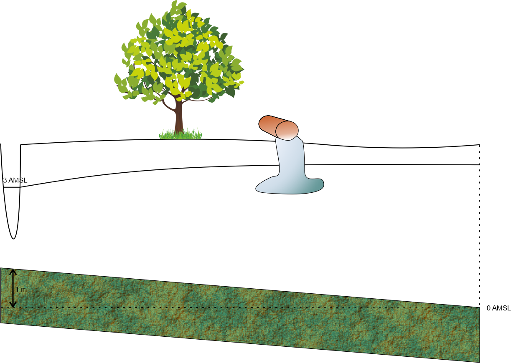
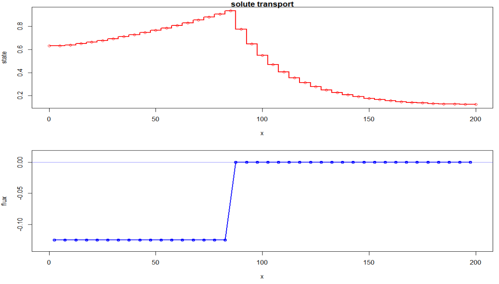

```{r}
rm(list = ls())
library(FVFE1D)
```

# Learning Goals  

* Understand the use of the Convection(or Advection) Diffusion/Dispersion Equation in the context of solute transport modeling.
* Derive physical dimensions and properties related to solute transport modeling.  
* Setup flow and transport models in a 1D or pseudo 2D environment using proper units.  
* Critically evaluate the numerical aspects of the solutions (Courant and Peclet numbers).  
* Setup water and mass balances for both types of models and analyse the result.
* Carry out a local sensitivity analyses of various parameters w.r.t. the outcome of both models

# Introduction  


In this exercise the basic Convection Diffusion Equation (CDE) as discussed during the lectures will be reviewed and an analysis of the appropriate dimensions/units will be discussed. As an example we will consider the leakage of a contaminant from a vessel on the surface into the saturated groundwater towards a local river.  
First the equations (i.e. the internal fluxes) to setup a 1- (pseudo 2-) dimensional flow and 1- (pseudo 2-) dimensional transport model need to be derived and implemented. Specific attention is paid to the translation of the flow, volume, density and mass into the proper units for the flow and transport problem.   
After the stationary flow model is run, the stationary transport model is run based on the local water velocities and saturated thickness of the flow model transporting the contaminants towards the river.  
The following assignment will be to analyse the effect of remediating the spill based on local groundwater flow only and with the aid of a "pump and treat" scenario.  
Finally a local sensitivity analysis is carried out analyzing the effects of various variables and parameters of both models on their results.  

The convection diffusion equation as discussed during the lectures is:
$$
\frac{\partial s}{\partial t}=-v \frac{\partial s}{\partial x}+D \frac{\partial^2 s}{\partial x^2}
$$

which is a mass balance for the particular state (s);  
With:

* $\frac{\partial s}{\partial t}$: mass storage change during time  
* $v \frac{\partial s}{\partial x}$: convective(advective) mass flux  
* $D \frac{\partial^2 s}{\partial x^2}$: diffusive/dispersive mass flux  

All the above terms (obviously) have dimensions: $\frac{\text{mass}}{\text{volume time}}$ and when multiplied with the appropriate control volume based on the finite volume or finite element techniques it results in a mass flux of $\frac{\text{mass}}{time}$ per time step.  

Retardation (ad- and desorption properties of a solute which effectively slows down the convection and diffusion processes) and decay are omitted from this equation for simplicity and will not be considered in the simulations.

The convective part of this equation is based on the mass influx into (or out of) an elementary volume (e.g. a cube): 
$$
qC\,\,\text{or}\,\, v \text{por}C
$$  
Where:  

* $q$: Flux rate into (or out of) a face of the elementary volume (length/time)  
* $\text{por}$ : porosity of the soil ($\frac{m^3}{m^3}$)
* $C$: Concentration of the solute (mass/volume)  

The convective part couples groundwater to solute transport since this $q$ is determined by the groundwater model.  

The diffusive part it is based on the equation of Fick (first law) which resembles Darcy's equation:
$$
J=-D\frac{\partial C}{\partial x}
$$

Where:  

* $J$: Diffusion flux (rate)  (mass/time)  
* $D$: Diffusivity of Diffusion coefficient length$^2$/time


<div class="question">
Why is there a negative sign in the above equation?
</div>

<div class="answer">
The diffusion flux goes towards the lower concentration. So if that is into the $x$ direction $C_{x+\Delta x}$ is lower than $C_{x}$. Therefor, and similar like the Darcy equation the negative sign makes the flux to go in the proper direction.  
</div>


<div class="question">
When using the following units:

* length $\mathsf{m}$  
* mass $\mathsf{kg}$  
* concentration $\mathsf{kg/m^3}$  
* time $d$  

What is the unit for the following variables when one assumes 3 dimensional (x,y,z) flow and transport?  

* $D$  
* $q$  
* $C$  
* $J$
</div>

<div class="answer">

* $D$ : $\mathsf{m^2/d}$ 
* $q$ : $\mathsf{m/d}$
* $C$ : $\mathsf{kg/m^3}$
* $J$ : $\mathsf{kg/d}$
</div>

In this assignment we consider the concentration of a solute to be the __only__ amount of mass in a __unit volume__ of groundwater. However in reality a concentration of e.g. 35 $kg/m^3$ of salt in a volume of 1000 liters groundwater will have a __density__ of about 1025 $kg/m^3$ (also depending on pressure, viscosity and temperature). So although $C$ and $\rho$ do have the same unit, they are different in the way we calculate them. By the way, flow due to density differences are also not considered here!  

# Groundwater flow model  

The model for stationary groundwater flow consists of one phreatic aquifer (k = 3[$\mathsf{m/d}$]) for which the bottom tilts from left to right. The total length of the model is 200 m, use a nodal distance of 5 m. At the left boundary a river with an open water level of 3 m Above Mean Sea Level (AMSL) is situated, the right boundary is based on a water divide. On top a uniform recharge om 1 mm/d is applied.  
The bottom of the aquifer has an altitude of 1 m AMSL on the left and slopes downwards towards the right with 5 m/km.  
At a later stage an extraction well will be added to the model.  
To determine specific volume fluxes the porosity of the soil is required and is here estimated on 30%.  
Figure 2 illustrates the situation;



## Internal groundwater flux  

The model which calculates the water(volume)flux is based on a flux rate integrated over the saturated thickness;
$$
q_D = -kD_{sat}(x)\frac{\partial H}{\partial x}
$$
Which makes this flux rate quasi 2D; the $_D$ in $q_D$ is to indicate that its a flux over the total saturated thickness.   

$D_{sat}$: The saturated thickness over which flow takes place ($m$).

<div class="question">
* What is the unit of this flux rate $q_D$ for this model?
</div>
<div class="answer">
 * $q_D(x)$: the flux integrated over the saturated thickness $D_{sat}(x)$ per $\Delta y$ so $\mathsf{m^3/(d m)}$ which is simply $\mathsf{m^2/d}$
</div>

The following illustration clarifies some dimensions of the flow in the 1D(or quasi 2D) model;  


The volume groundwater in a slice of soil is now : $\text{por}\Delta x \Delta y \,D_{sat}$  (check the units!). But since we consider a quasi 2-D model the $\Delta y$ is not considered in the equations. In other words, the volume of groundwater in a slice ($\Delta x$) of soil is $m^3/m$, the $/m$ indicating the "per meter $\Delta y$".

<div class="question">


* How would you derive the water velocity from this groundwater flow model?

</div>
<div class="answer">

 * To come from Darcy's flux "density" or rate to velocity: $v = \frac{q_D}{\text{porosity}\,D_{sat}}$. The water flow takes place in the pores.

 
</div>

## Boundary conditions  

Possible boundary conditions for the groundwater flow model are based on:

1. Dirichlet type 
2. Neumann type
3. Cauchy type 

<div class="question">
implement the appropriate boundary conditions; 
the prescribed river level left and  
the water divide on the right
</div>

<div class="answer">

* left is a Dirichlet boundary condition with a prescribed level of 3 m AMSL
* right is a Neumann boundary condition for no action is required
</div>

## Setup groundwater flow model  

<div class="question">
1. Setup this flow model and give it a distinctive name e.g. Fmodel or Flowmodel or so. 
   a. Use the `do.initialize()` function to avoid numerical problems due to the non-linear character of the internal flux function.
2. Run the model and look at the results; head distribution, internal flux and water balance terms.  
3. Create a plot showing both the calculated head and the bottom of the aquifer.  
</div>

<div class="answer">
1. Model setup of the groundwater flow model  

```{r}
#model domain
bnd.left = 0 #m boundary at left
bnd.right = 200 #m boundary at right
domain = c(bnd.left,bnd.right)
#sloping aquifer
bot.slope = 5/1000
bot.left =1
bot.right = bot.left - bot.slope*bnd.right
bottom = approxfun(x = domain,y = c(bot.left,bot.right))

#properties
k = 3.0 #m/d
precip = 0.001 #m/d
fix.H = 3.0
por = 0.3
#math model& boundary conditions

Darcy <- function(x,head,gradH) 
{
  return(-k*(head-bottom(x))*gradH)
}

Fmodel = newFLOW1D(domain = domain,systemfluxfunction = Darcy,name = "Stationary flow model ")
set.BC.fixedstate(Fmodel,'left','fix.H')
add.spatialflux(model = Fmodel,rate = 'precip',name = 'precipitation')
# numerical model
delta.x = 5 #m
nodes = seq(from=domain[1],to = domain[2],by=delta.x)
set.discretisation(model = Fmodel,nodes=nodes,method='FV')
do.initialize(model = Fmodel,init = 1.0) # otherwise problems with non-linearity of the Darcy function
summary(Fmodel)


```

2. Solving this model and plotting the results
```{r}
#solve
solve.steps(Fmodel)

#results
plot(Fmodel,fluxplot = T,FVstyle = T)
dataframe.balance(Fmodel)
```

3. A plot of the head distribution and the aquifer bottom elevation
```{r}
#plot with heads and aquifer bottom elevation
level.range =range(Fmodel$states,bottom(nodes))
plot(nodes,Fmodel$states,type="o",col="red",lwd=3,main = "head and bottom of the model",
     ylab="level (m)",xlab="distance (m)",ylim=level.range)
lines(nodes,bottom(nodes),col='brown',lwd=3)
grid()
```


</div>

To determine the mass in the solute transport model the saturated thickness is required.  

<div class="question">  

* Make a function and a plot of the saturated thickness. Call the function e.g. D.sat .
</div>
<div class="answer">
See below

```{r}
D.sat = approxfun(nodes,Fmodel$states-bottom(nodes))
plot(nodes,D.sat(nodes),type="o", main='saturated thicknes (m)',
     ylab="saturated thickness (m)",lwd=3)
grid()
```
</div>

## Flux and Volume functions for the solute transport equation

1. The convection diffusion equation contains a convective aspect for which the flow(water) 'velocity' and in our case a flux rate in the x-direction in [$\mathsf{m^2/d}$] is required. It is based on the internal flux of the groundwater flow equation.  
2. For the dispersive part of the convection diffusion equation it is also required to create a function for the volume per $\Delta x \Delta y$ to determine the amount of mass in the solute transport model.  Here this 'volume' is simply the saturated thickness multiplied with the porosity. 

<div class="question">  

1. Create the (water) flux function(x) for the internal flux. Call it __Qflow__ and make use of __approxfun__  and set __rule=2__.  
2. Create the "volume water" function(x). It is based on the volume of water contained in a slice of soil in the x-direction (and "y") and call it **Vflow**. Recall that the FVFE1D package will determine the $\Delta x$ of the slice based on the size of the volumes or elements.  

</div>

<div class="answer">

1. The internal flux can be derived with __dataframe.internalfluxes(Fmodel)__ with this dataframe you can create a function(x) which has unit $\mathsf{m^2/d}$. In this code it is called __Qflow__, with "flow" indicating the source (from the groundwater model).
2. The total volume at a certain x called here _Volume distribution_ is $\text{por}\,*\,D_{sat}(x)$ which has unit $\mathsf{m}$ or $\mathsf{m^3}/(\Delta x \Delta y)$. In this code it is called __Vflow__, also here, "flow" indicating the source (from the groundwater model).

```{r}
df.intq = dataframe.internalfluxes(Fmodel)
Qflow = approxfun(df.intq$x,df.intq$intflux,rule = 2)
plot(nodes,Qflow(nodes),type='l',lwd=2,col='red',main="Internal flux flow model",ylab='flux (m2/d)',xlab = "distance (m)")
Vflow = approxfun(nodes,por*D.sat(nodes),rule=2)
plot(nodes,Vflow(nodes),type='l',lwd=2,col='blue',main="Volume distribution",ylab='Volume (m3/m2)',xlab="distance (m)" )
```
</div>  

# Solute transport model  
The solute transport model will simulate the movement of a certain solute in the groundwater which comes from a continuous source. The source is simulated with a prescribed amount of mass "loaded" into the groundwater which is called "mass loading".  
The movement and displacement of the solute is based on the convection diffusion equation as described in the introduction and is now extended with the source term (the contaminant from the vessel) $S$:  

$$
\frac{\partial s}{\partial t}=-v \frac{\partial s}{\partial x}+D \frac{\partial^2 s}{\partial x^2} + S
$$

The aforementioned (CDE) equation can be considered to be a **mass balance**, simply multiply all terms with a volume and it results in mass per time  $\frac{kg}{d}$.  

## Internal mass flux for the transportmodel  

The internal *mass flux* for the solute transport model describes the movement of mass per time unit.


$$
M_{flux} =A \,\, por \left\{ vC-D\frac{\partial C}{\partial x}\right\}
$$

With:  

* $A$: the area perpendicular to the mass flux, $D_{sat}\, \Delta y$, in $\mathsf{m^2}$  
* $por$: porosity (-)  
* $v$: local velocity in $\mathsf{m/d}$  
* $C$: concentration of the solute in $\mathsf{kg/m^3}$  
* $D$: Diffusion/Dispersion coefficient in $\mathsf{m^2/d}$  


Looking at both the Darcy flux and this "mass flux", there are similarities and differences:

* both have a diffusion term with a minus sign up front
* the mass flux has an additional term, the convective term

### Advection/Convection

Solutes are displaced due to the groundwater velocity; $vC$, hence the $v$ which come from the Darcy flux and is calculated as: $v=\frac{q}{\text{por}}$

### Dispersion/Diffusion

Solutes are displaced by concentration gradients, similar like groundwater is displaced by the head gradient.  
This term $-D \frac{\partial C}{\partial x}$ is called the (first) Fick's law (similar like Darcy's law for groundwater flow).  
During the transport simulations we will assume a constant dispersion coefficient $D$ and start with 2.5 $m^2/d$


### Derivation of the internal flux function for transport

To distinguish the 'flow' and 'mass' flux rates between groundwater flow and solute transport, groundwater flow is indicated with 'flow', as in __Qflow(x)__, for the internal flux with unit $m^2/d$. Solute transport focuses on the amount of mass of a certain solute/pollutant in the groundwater and is here indicated with __Mflux(x)__ with unit $kg/(dm)$.  Again, the $/m$ comes from the "per meter $\Delta y$".


The (hydrodynamic) diffusion/dispersion here is a combination of the molecular diffusion(Brownian movement) and the mechanical dispersion(accounting for the local pore flow and its pore structure) and is assumed to be constant here.  

<div class="question">

* 'Derive' internal flux function for the transport model which is based on the mass flux equation above and determine its unit.
* What is the unit for the concentration for this model?
* What is the unit for the mass in the model?

</div>

<div class="answer">  

* Derivation of the mass flux/internal flux function:
$$
\begin{align}
M_{flux} &= A\,\text{por} \left ( vC -D\frac{\partial C}{\partial x}\right )\\
&= D_{sat}\,\text{por}\,v\,C - D_{sat}\,\text{por}\,D\frac{\partial C}{\partial x}\\
&= q_D\,C - D_{sat}\,\text{por}\,D\frac{\partial C}{\partial x}\\
&= \text{Qflow}\,C - \text{Vflow}\,D\frac{\partial C}{\partial x}\\
q_D \, C&:[\mathsf{m^2d^{-1}kgm^{-3}}]\rightarrow [\mathsf{kg/(md)}]\\
D_{sat}\,\text{por}\,D\frac{\partial C}{\partial x} &:[\mathsf{m\,-\, m^2d^{-1}kgm^{-3}m^{-1}}] \rightarrow [\mathsf{kg/(md)}]
\end{align}\\
$$
* $C$ is in $\mathsf{kg/m^3}$, and also for this model if we consider the volume being $D(x)*\text{por}\,\Delta x \, \Delta y$.
* Mass has the unit $\mathsf{kg}$ but to derive mass from the concentration in this model it is $C\,D_{sat}\,por\,\Delta x \rightarrow [\mathsf{kgm^{-3}\,m\,-\,m}] \rightarrow [\mathsf{kg/m}]$ which is stored in the soil for a certain moment in time. The amount of mass entering or leaving the model can be calculated with $\text{mass flux}\,\text{time step}\rightarrow qC\Delta t\rightarrow [\mathsf{m^2d^{-1}kgm^{-3}d}]\rightarrow [\mathsf{kg/m}]$.

</div>

## Model setup  stationary

The domain of the solute transport model is identical to the groundwater flow model.  On the right hand side no solute is entering or leaving the model so the boundary is closed, simply because there is no flow there. On the left hand side solute leaves the model due to convection; i.o.w. groundwater flow carries the solute out of the model, into the river.

### Boundary conditions tranport model

Also here we chose between the three different types of boundary conditions

*  Dirichlet, a prescribed concentration: $C(x,t)$
*  Neumann, a prescribed concentration **gradient**: $\frac{\partial C}{\partial x}$
*  Cauchy, combination of both: $vC - D \frac{\partial C}{\partial x}$  

A relevant difference between applying boundary conditions for transport models compared to flow models, is that there is a large difference in applications when water with a certain concentration is flowing **in** or **out** of the model.

The Dirichlet condition is used mostly when the concentration is known at a certain point in time and that one is ensured the flow will always be oriented inwards. When outflow is expected, the model runs into problems. Simply consider what would happen with a model when you force it to come up with a prescribed concentration flowing out of the model...

Applying the Neumann boundary condition and assuming that no mass/solute is entering the model, is similar to applying this in a flow model.  

The Cauchy boundary condition is a special and important case for transport modeling. It serves as a tool to let water with a solute move out of the model. Most of the time the concentration gradient at the boundary (outflow) is assumed to be 0 resulting in $vC$ indicating that the local groundwater velocity at this boundary multiplied with the concentration at that point results in mass flux outside of the model.  


The dispersion coefficient is set to 2.5 $\mathsf{m^2/d}$ being 1/2 of the volume size, nodal distance.

<div class="question">

* Determine the proper boundary conditions for the transport model.
</div>
<div class="answer">

* $qC \rightarrow [\mathsf{m^2d^{-1}kgm^{-3}}]\rightarrow [\mathsf{kgd^{-1}m^{-1}}]\rightarrow [\mathsf{kg/(md)}]$
* Boundary right: nothing to do, natural boundary condition
* Boundary left : $A\,\text{por}\,\left ( vC -D\frac{\partial C}{\partial x}\right )$ and assume $\frac{\partial C}{\partial x}=0\rightarrow =q_D\,C \rightarrow \text{Qflow}(x=0)C$
</div>

### Point source  

Somewhere in the middle of the solute transport model a solute source (pollutant) is assigned to the model. It will be implemented as a _mass loading_ condition/forcing. One could imagine it being a substance dissolving into the groundwater. This way an amount of 'mass' is loaded into the model/groundwater during a certain amount of time.  In this case the substance is leaking into the groundwater continuously with a mass loading of 0.125 $\mathsf{kg/(md)}$

### Implementation of the model
<div class="question">
Setup the solute transport model.  
* Add the point source  
* What is the unit for the continuous solute source?  
* Run the model  
* Plot the Concentration and internal mass flux  
* Analysze the mass balance `dataframe.balance()`  
</div>


When looking at the results of this  model;  

<div class="answer">
First the setup of the model
```{r}
Disp = 2.5  # 5 m2/d constant dispersion not depending on local velocities
# math model
CDE = function(x,C,gradC)
{
  Mass.flux = Qflow(x)*C - Vflow(x)*Disp*gradC
  return(Mass.flux)
}
Cmodel = newFLOW1D(domain = domain,systemfluxfunction = CDE,name = "solute transport")

#BC left
Cauchy = function(C)
{
  return(Qflow(domain[1])*C)
}
set.BC.fluxstate(model = Cmodel,where = 'left',Cauchy)
M.load = 0.125 #kg/(m d)
#add.pointflux(model = Cmodel,at = 100,value = "M.load",name = "Solute source")
add.pointflux(model = Cmodel,at = 85,value = "M.load",name = "Solute_source")
#numerical model
set.discretisation(model = Cmodel,nodes = nodes, method = "FV")

#solve
solve.steps(Cmodel)

```
### Results

Important result to have a closer look at are:

1.  the concentration distribution and  
2.  the mass flux distribution.
3.  the mass flux leaving the model at the river


1.  `plot(your_transport_model, fluxplot = TRUE, FVstyle = T)`
2.  `mass_balance = dataframe.balance(your_transport_model)`
3.  `boundary_flux = dataframe.boundaries(your_transport_model)`


```{r}
plot(Cmodel,fluxplot = T,FVstyle = T)
dataframe.balance(Cmodel)
dataframe.boundaries(Cmodel)
```
</div>  

<div class="question">

1. What are these calculated states?
2. What is the unit of this balance?
3. Check for the left boundary (with some "hand" calculations) the mass flux leaving the left boundary and what unit does it have?

</div>
<div class="answer">

1. These are the concentrations ($\mathsf{kg/m^3}$)
2. The unit of the mass flux which is $\mathsf{kg/(md)}$
3. Mass flux leaving the boundary, which is based on the Cauchy function (boundary)

```{r}
# mass flux leaving the boundary, based on the Cauchy function (boundary)
Qflow(0)*Cmodel$states[1]
```
The unit of this mass flux is identical to the unit of the Mass flux equation and here:  $\text{qC}\rightarrow \mathsf{m^2/d\,kg/m^3} \rightarrow \mathsf{kg/(m d)}$
</div>

### Results a closer look 

Most probably your results looks similar like the following plots:

In the upper panel the concentration distribution is visible, the lower panel shows the mass flux distribution in the model.
The leaking vessel is located at x=85 where concentrations are highest and mass flux switches from 0.0 $kg/(md)$ to 0.125 $kg/(md)$.  

<div class="question">  
  
*  Isn't it strange? On the right hand side of the vessel there seems to be some concentration although the water flow is from right to left. Can you explain why?  
*  Moreover, there is some concentration on the right side of the vessel but no mass flux. 
Can you explain this?  

</div>

The following analysis could help answering the question above.  
Looking at the mass (internal) flux equation of the transport model, see below, one can see that it contains two components, a convective part (first one) and a dispersive part (second one):

$$
\begin{align}
M_{flux} &= A\,\text{por} \left ( vC -D\frac{\partial C}{\partial x}\right )\\
&= \text{Qflow}\,C - \text{Vflow}\,D\frac{\partial C}{\partial x}\\
\end{align}
$$
Calculate for both parts(convective and dispersive) for two distinctive volumes in the model, one upstream of the vessel and one downstream. For example for volume (at node) 10 and 30 and sum these to have the mass flux at that border of the volume. Calculate the mass balance for both volumes and look at the results (mass flux in-region and out-region).
Some tips:

*  Put the concentrations in a dataframe, e.g. `conc = dataframe.states(your_C_model)`
*  Calculate concentrations at the borders of the volumes/elements
*  Calculate the concentration gradients at the borders of the volumes/elements
*  Determine both terms and sum them
*  Compare your results with the mass balance of the volumes/elements. They should match.

```{r}
# mass flux for volume 30 right hand side
concentration = dataframe.states(Cmodel)
convection_part_30_31 = Qflow((nodes[31]+nodes[30])/2) * (concentration[31,2] + concentration[30,2])/2

grad_C_30_31 = (concentration[31,2] - concentration[30,2])/(nodes[31] - nodes[30])
dispersion_part_30_31 = -Vflow((nodes[31]+nodes[30])/2) * Disp * grad_C_30_31

mass_flux_30_31 = convection_part_30_31 + dispersion_part_30_31

mass.balance_30 = dataframe.balance(Cmodel,c(30))

print(paste("convection part mass flux 30-31: ",convection_part_30_31))
print(paste("dispersion part mass flux 30-31: ",dispersion_part_30_31))
print(paste("both 30-31: ",convection_part_30_31 + dispersion_part_30_31))
print(paste("mass balance 30 calculate by the model: "))
mass.balance_30

# mass flux for volume 10
convection_part_10_11 = Qflow((nodes[11]+nodes[10])/2) * (concentration[11,2] + concentration[10,2])/2

grad_C_10_11 = (concentration[11,2] - concentration[10,2])/(nodes[11] - nodes[10])
dispersion_part_10_11 = -Vflow((nodes[11]+nodes[10])/2) * Disp * grad_C_10_11

mass_flux_10_11 = convection_part_10_11 + dispersion_part_10_11
mass_balance_10 = dataframe.balance(Cmodel,c(10))

print(paste("convection part mass flux 10-11: ",convection_part_10_11))
print(paste("dispersion part mass flux 10-11: ",dispersion_part_10_11))
print(paste("both 10-11: ",convection_part_10_11 + dispersion_part_10_11))
print(paste("mass balance 10 calculate by the model: "))
mass_balance_10
```


<div class="answer">
Due to dispersion, which is determined by the concentration gradient, the solute will flow from a higher concentration to a lower one anth therefor will migrate opposite the groundwater flow.  
Convection carries the solute with the flow.
The convective/advective term and the dispersive term of the mass flux cancel each other on the right hand side of the vessel.
</div>

## Model setup transient  
Similar like all models up till now, the main difference between a stationary and transient model is the addition of the storage flux and the simulation through time.  

<div class="question">
* Define the storage flux for the transient transport model. The (groundwater)flow model remains constant.  
In determining this flux(rate) and its units; Be aware that the storage flux is a spatial flux, so the 'area' over which the flux rate is integrated is carried out by the FVFE1D package.
</div>  

<div class="answer">
The storage flux is: $-D_{sat}\,por \,\frac{\partial C}{\partial t}$. Solute stored means that this is removed from the system, hence the minus sign.
The numerical equivalent is: $-\text{Vflow(x)}\frac{C_i^{t+\Delta t}-C_i^{t}}{\Delta t}$.  
```{r}
C.sto = function(x,Conc)
{
  return(Vflow(x)*(prev.C(x) - Conc)/delta.t)
}
```
</div>

The source of solute is removed from the transient solute transport model, implying that the pollutant has been cleaned up at the surface.  

To see whether numerical problems occur one need to determine the Peclet and Courant numbers for the given properties of the model. 

* Peclet$_{grid}$ number: $\frac{v\Delta x}{D} < 2$ 
* Courant number: $\frac{v\Delta t}{\Delta x} < 1$
* Based on previous $\Delta t < \frac{\Delta x}{v}$


<div class="question">
Set up a transient solute transport model based on the stationary model. 
At the start of the transient simulation the initial concentration of the solute is the final concentration distribution of the stationary solute transport model.
Consider the following aspects of this model:  

* make a copy of the stationary transport model to develop the transient one  
* remove the source from this model
* calculate the Peclet and Courant numbers for each node for inspection and to determine a proper time step $\Delta t$
* create a time stepping loop running for at least one year
* plot the transient steps in one graph in the time stepping loop
* Store the mass balance terms into different arrays to plot these afterwards. See assignment 2 for details.
</div>

<div class="answer">

```{r}
# make a model copy of the stationary solute transport model
Ctransmodel = copy.model(Cmodel)

# save the current concentration distribution in prev.C
prev.C = state.fun(Cmodel)

# remove the source from the transient solute transport model
rem.pointflux(Ctransmodel,"Solute_source")

# add storage to the model
add.spatialflux(Ctransmodel,C.sto,name = "mass_storage")

# some containers for the mass balance terms
bnd.out = c()
storage.in = c()
storage.out = c()
time.step = c()

# transient aspects
beg.time = 0
end.time = 5*365

current.time= beg.time

#check numerical aspects
v = Qflow(nodes)/(D.sat(nodes)*por) #Qflow = m2/d so v=Qflow/(D.sat*por)
#calculation of reasonable time step
#V*delta.t/delta.x < 1 so delta.t < delta.x/v
bound.delta = delta.x/abs(v)
plot(nodes,bound.delta,type =  "o",col="green", main = "bound.delta at nodes")

#largest time step should be smallest of bound.delta. Since delta.x is constant it is at the location where velocity is highest
delta.t = floor(min(bound.delta))

Peclet = abs(v) * delta.x/Disp
Courant = abs(v) * delta.t/delta.x 
plot(nodes,Peclet,type="o",col="blue",main="Peclet at nodes")
plot(nodes,Courant,type="o",col="red", main = c("Courant at nodes; with delta t :",delta.t))


#plot the starting solute concentration distribution
plot(nodes,prev.C(nodes),type = 'o',col='red',ylab = "concentration kg/m3",
     xlab= "distance (m)", main = "Transient solute concentration distribution",
     ylim = c(0,max(prev.C(nodes))))
c_color = heat.colors(n = ceiling(end.time/delta.t))
col_number = 1
#a loop for calcutating the concentration time series
while (current.time < end.time)
{
  prev.C = state.fun(Ctransmodel)
  solve.steps(Ctransmodel)
  #write data 
  df.states = dataframe.states(Ctransmodel)
  lines(df.states$x,df.states$state,col = c_color[col_number])
  df.mass = dataframe.balance(Ctransmodel)
  bnd.out = c(bnd.out,df.mass[3,3])
  storage.in = c(storage.in,df.mass[2,2])
  storage.out = c(storage.out,df.mass[2,3])
  current.time = current.time + delta.t
  time.step = c(time.step,current.time)
  col_number = col_number + 1
}
# mass balance plot.
mass.balance = data.frame(time.step,bnd.out,storage.in,storage.out)
plot(mass.balance$time.step,mass.balance$bnd.out,main="mass balance, green:boundary out, blue:storage change",type="l",
     col="green",lwd=3,ylab="mass kg/(dm)",xlab="time step (d)")
lines(mass.balance$time.step,mass.balance$storage.in, col="blue",lwd=3,lty="dashed")
grid()

```

</div>


## Transient solute transport model with pump & treat  
 As can be seen from the results of the transient model, the solute disappears slowly at the left boundary. To speed up this process an extraction well is implemented at the location of the original source and will have an extraction rate equal to 50% of the recharge of the model.   
If the solute was some sort op pollutant this way of removing is called pump & treat, where the solute is removed/processed from the extracted groundwater. Pump & treat systems may also inject this cleaned water upstream but could be discarded here.
 
<div class="question">  

* Adjust the groundwater flow model accordingly.
* Run the adjusted flow model and recalculate D.sat, internal flux and Volume functions.
</div>

<div class="answer">  

```{r}
# add the extraction well to the flow model
p_t.rate = -0.10 #m2/d extraction rate
add.pointflux(Fmodel,at = 100,value = "p_t.rate",name="pump")

#run the flow model and have a look at the results
solve.steps(Fmodel)
plot(Fmodel,fluxplot = T)
dataframe.balance(Fmodel)

#recalculate the Volumflux and massflux functions
D.sat = approxfun(nodes,Fmodel$states-bottom(nodes))
plot(nodes,D.sat(nodes),type="o", main='saturated thicknes (m)')
df.intq = dataframe.internalfluxes(Fmodel)
Qflow = approxfun(df.intq$x,df.intq$intflux,rule = 2)
plot(nodes,Qflow(nodes),type='l',lwd=2,col='red',main="Internal flux flow model",ylab='flux (m2/d)',xlab = "distance (m)")
Vflow = approxfun(nodes,por*D.sat(nodes),rule=2)
plot(nodes,Vflow(nodes),type='l',lwd=2,col='blue',main="Volume m3/m2",ylab='Volume (m)',xlab="distance (m)" )

```


<div class="question">  

* Make a copy of the stationary solute transport model.
* Remove the source.
* Add the pump&treat point flux which now is a function of the solute concentration at this location.

</div>

<div class="answer">

```{r}
# make a model copy of the stationary solute transport model
Ctransmodel = copy.model(Cmodel)

# save the current concentration distribution in prev.C
prev.C = state.fun(Cmodel)


# remove the source from the transient solute transport model
rem.pointflux(Ctransmodel,"Solute_source")

# add the pump&treat extraction well for removing the solute
p_t.sink = function(conc)
{
 return(p_t.rate*conc) 
}
add.pointflux(Ctransmodel,at = 100,p_t.sink,name = "pump_treat")

# add storage to the model
add.spatialflux(Ctransmodel,C.sto,name = "mass_storage")

```
</div>

<div class="question">  

* calculate the Peclet and Courant numbers for each node for inspection and to determine a proper time step $\Delta t$.
</div>

<div class="answer">

```{r}
#check numerical aspects
v = Qflow(nodes)/(D.sat(nodes)*por) #Qflow = m2/d so v=Qflow/(D.sat*por)

#calculation of reasonable time step (using Courant)
#abs(V)*delta.t/delta.x < 1 so delta.t < delta.x/abs(V)
bound.delta = delta.x/abs(v)
plot(nodes,bound.delta,type =  "o",col="green", main = "bound.delta at nodes")
delta.t = floor(min(bound.delta))

Peclet = abs(v) * delta.x/Disp
Courant = abs(v) * delta.t/delta.x 
plot(nodes,Peclet,type="o",col="blue",main="Peclet at nodes")
plot(nodes,Courant,type="o",col="red", main = c("Courant at nodes; with delta t :",delta.t))


```
</div>

<div class="question">  

* create a time stepping loop running for at least one year.
* plot the transient steps in one graph in the time stepping loop.
* Store the mass balance terms into different arrays to plot these afterwards. See assignment 2 for details.
</div>

<div class="answer">

```{r}
# some containers for the mass balance terms
bnd.out = c()
storage.in = c()
storage.out = c()
time.step = c()
pump.treat = c()

# transient aspects
beg.time = 0
end.time = 5*365

current.time= beg.time


#plot the starting solute concentration distribution
plot(nodes,prev.C(nodes),type = 'o',col='red',ylab = "concentration kg/m3",
     xlab= "distance (m)", main = "Transient solute concentration distribution",
     ylim = c(0,max(prev.C(nodes))))
c_color = heat.colors(n= ceiling(end.time/delta.t))
col_number = 1 #color number to be assinged to the individual time series in the plot
while (current.time < end.time)
{
  prev.C = state.fun(Ctransmodel)
  solve.steps(Ctransmodel)
  #write data 
  df.states = dataframe.states(Ctransmodel)
  lines(df.states$x,df.states$state, col = c_color[col_number])
  df.mass = dataframe.balance(Ctransmodel)
  bnd.out = c(bnd.out,df.mass[4,3])
  storage.in = c(storage.in,df.mass[2,2])
  storage.out = c(storage.out,df.mass[2,3])
  pump.treat = c(pump.treat,df.mass[3,3])
  current.time = current.time + delta.t
  time.step = c(time.step,current.time)
  col_number = col_number + 1
  # print(current.time)
}
# mass balance plot.
mass.balance = data.frame(time.step,bnd.out,storage.in,storage.out,pump.treat)
y.range = range(mass.balance$bnd.out,mass.balance$pump.treat,mass.balance$storage.in)
plot(mass.balance$time.step,mass.balance$bnd.out,main="mass bal., green:bndout, blue:stor.change,red:p_t",type="l",
     col="green",lwd=3,ylab="mass kg/(dm)",xlab="time step (d)",ylim=y.range)
lines(mass.balance$time.step,mass.balance$storage.in, col="blue",lwd=3,lty="dashed")
lines(mass.balance$time.step,mass.balance$pump.treat,col="red",lwd=3)
grid()
error = mass.balance$bnd.out+mass.balance$pump.treat-mass.balance$storage.in
dataframe.balance(Ctransmodel)
```

</div>

<div class="question">
Calculate the following total amounts of solute mass ($kg$):  

* How much mass did the model contain at the start of the remediation?  
* what is left out of the boundary?  
* what is extracted with the pump & treat?  
* what is still stored?  
* Do they balance?
</div>  

<div class="answer">
The required data is already stored in the **mass.balance** dataframe and simply need to be multiplied with $\Delta t$.

What still is stored/left in the model requires nodal cell "area's" which are lengths in this 1D model. Then the amount of mass still left is calculated by: $C_{left}\,L_{nodes}\,D_{sat}\,por$.  

```{r}

##to calculate much mass is stored in the model, cell lengths are required
dx.node = diff(nodes)
dx.node[1]=2.5
dx.node = c(dx.node,2.5)

#mass at the beginning of the remediation
mass.begin = Cmodel$states*dx.node*D.sat(nodes)*por
plot(mass.begin,type="o")
tot.begin = sum(mass.begin)

#mass which is removed by the boundary and pump & treat
tot.bnd.out = sum(mass.balance$bnd.out*delta.t)
tot.pump.treat = sum(mass.balance$pump.treat*delta.t)

#mass what is left in the model
mass.left = Ctransmodel$states*dx.node*D.sat(nodes)*por
plot(mass.left,type="o")
tot.left = sum(mass.left)
#to check if it all balances;
error = tot.bnd.out + tot.pump.treat + tot.left -tot.begin
```

To finally check if all is in balance in $kg/m$ which is the mass per unit length $\Delta y$:

mass begin    | mass boundary out | mass pump&treat    | mass left behind | difference  
------------- | ----------------- | -----------------  | ---------------- | ----------  
`r tot.begin` | `r tot.bnd.out`   | `r tot.pump.treat` | `r tot.left`     | `r error` 

</div>

# Sensitivity Analysis

Finally you are conducting a sensitivity analysis to investigate the most import aspects of the numerical simulations.  
Here we will consider two interesting outputs;  

1.  Efficiency pump and treat  
2.  Highest concentration in the subsoil  

The most important parameters impacting the aforementioned outputs are:  

*  Flow model  
    + fix.H     : prescribed head of the river  
    + k         : hydraulic conductivity of the subsoil (aquifer)
    + Qwell     : extraction rate of the well  
    + precip    : precipitation rate  
    + bot.slope : bottom slope of the subsoil (aquifer)  
  
*  Transport model   
    + M.load    : Mass load at the spill out of the vessel  
    + Disp      : Dispersion coefficient  
    + por       : porosity of the subsoil (aquifer)  
    
    
## Outputs to be analyzed  

### Efficiency pump and treat  

The efficiency of the pump and treat scenario is determined by the amount mass extracted by the extraction well.  
This can be calculated by setting up the mass balance for the model for each time step and analyze the total amount of mass extracted by the well. This amount is tracked by the data frame `tot.pump.treat`

  

### Highest concentration in the subsoil

One can imagine that de highest concentration could be important when the solute is (very) toxic.  
The concentration is the actual calculated state and can easily be derived through the `dataframe.state()` function.

#     AANPAK VANAF HIER 31-1-24

het nodige moet nog worden geimplementeer:

*  voordat de lsa begint moeten de basis data (modelen, resultaten) worden gesaved om de afgeleiden te berekenen
*  veranderingen van de mass balansen vanhet stoffen model zitten nog niet in sensitivity geimplementeerd
*  studenten moeten denk ik meer code gegeven krijgen denk ik omdat het anders veel te veel wordt. Immers zonder lsa zijn ze al vol bezig
*  de plotten() functie moet netter zodat de assen een correcte naam krijgen.

## Modeling function

Since the transport model requires the `Qflow` and `Vflow` functions from the flow model, both models need to run in one sequence.  

The following chunk creates such a function including a function for saving different types of data from the previous run `bewaar()` and a function for plotting different types of results and differences `plotten()`.


```{r}

#save(list = c(grep(pattern = "Ctrans",x=ls(),value = TRUE),"mass.balance.old","max.C.old","C_trans.old"),file = "testCtransdata.Rdata")
bewaar = function()
{
  D.sat.old <<- D.sat
  Vflow.old <<- Vflow
  Qflow.old <<- Qflow
  mb.Ctrans.old <<- dataframe.balance(Ctransmodel)
  wb.Fmodel.old <<- dataframe.balance(Fmodel)
  max.C.old <<- max.C
  mass.balance.old <<- mass.balance
  ext.q.Ctrans.old = dataframe.externalfluxes(Ctransmodel)
  int.q.Ctrans.old = dataframe.internalfluxes(Ctransmodel)
  bnd.q.Ctrans.old = dataframe.boundaries(Ctransmodel)
  C_trans.old <<- C_trans
}

plotten = function()
{
  
old.par = par(no.readonly=TRUE)#storing current canvas parameters

#par(mar=c(5,1,4,1))
#layout_plots = layout(matrix(c(1,2,3,4,5,6,7,0), ncol = 2,nrow = 4, byrow=TRUE), 
#                      widths = rep.int(1,2),heights = rep.int(1,4))
# layout_plots = c(matrix(c(1,2,3,4,5,6,7,0), ncol = 2,nrow = 4, byrow=TRUE), 
#                       widths = rep.int(1,2),heights = rep.int(1,4))
# tst = layout(matrix(c(1,2,3,4,5,6,7,0), ncol = 2,nrow = 4, byrow=TRUE), 
#                       widths = rep.int(1,2),heights = rep.int(1,4))
# layout.show(tst)
#layout(matrix(c(1,2,3,4,5,6,7,0), ncol = 2, byrow=TRUE), widths = rep.int(1,2),heights = rep.int(1,4))
# layout(matrix(c(1,2,3,4,5,6,7,0), ncol = 2, byrow=TRUE), widths = c(lcm(9),lcm(9)),heights = c(lcm(5),lcm(5),lcm(5),lcm(8)),respect = TRUE)
par(mfrow=c(1,2))
  plot(mass.balance.old$time.step,mass.balance.old$bnd.out,main = "bnd.out",type = "o")
  lines(mass.balance$time.step,mass.balance$bnd.out, col="red",type ="o",pch = 20)
  grid()
  plot(mass.balance.old$time.step,mass.balance.old$storage.in,main = "storage.in",type = "o")
  lines(mass.balance$time.step,mass.balance$storage.in, col="blue",type ="o",pch = 20)
  grid()
par(mfrow=c(1,2))  
  plot(mass.balance.old$time.step,mass.balance.old$storage.out,main = "storage.out",type = "o")
  lines(mass.balance$time.step,mass.balance$storage.out, col="green",type ="o",pch = 20)
  grid()
  plot(mass.balance.old$time.step,mass.balance.old$pump.treat,main = "pump.treat",type = "o")
  lines(mass.balance$time.step,mass.balance$pump.treat, col="cyan",type ="o",pch = 20)
  grid()
par(mfrow=c(1,2))
  plot(max.C.old$time,max.C.old$max.conc,main = "max C in time",type = "o")
  lines(max.C$time,max.C$max.conc, col = "orange",type ="o",pch = 20)
  grid()
  plot(max.C.old$"position.x",max.C.old$max.conc,main = "max C in time",type = "o")
  lines(max.C$"position.x",max.C$max.conc, col = "magenta",type ="o",pch = 20)
  grid()
par(mfrow=c(1,1))  
  #plotting some concentration distributions
  grijs = grey(level = 0:length(C_trans.old[,1])/length(C_trans.old[,1]))
  kleur = heat.colors(n =length(C_trans[,1])+5, alpha = 1 )
  c_range = c(min(C_trans.old[,2:length(C_trans.old[1,])],C_trans[,2:length(C_trans[1,])]),
              max(C_trans.old[,2:length(C_trans.old[1,])],C_trans[,2:length(C_trans[1,])]))
  plot(nodes,C_trans.old[1,2:(length(nodes)+1)],type = "l",lwd = 2, 
       col = grijs[1], main = "C(x,t) ",ylim = c_range, xlab = 'Time',ylab = "Concentration")
  for (i in 2:length(C_trans.old[,1]))
  {
    lines(nodes,C_trans.old[i,2:(length(nodes)+1)],col = grijs[i], lwd = 2)
    
  }
  for (i in 1:length(C_trans[,1]))
  {
    lines(nodes,C_trans[i,2:(length(nodes)+1)],col = kleur[i], lwd = 2)
  }
    
  grid()
  legend(x = "topright", legend = c(paste0("time:",C_trans.old[,1]),paste0("time:",C_trans[,1]))
         ,lty = 1,lwd = 2,col = c(grijs[1:length(C_trans.old[,1])],kleur[1:length(C_trans[,1])]),cex=0.5)
  
  par(old.par)# setting previous canvas parameters back
}

#since the transient Ctransmodel is transient, it needs to be reset with the initial concentration of the 
#stationary Cmodel.
initial.C = state.fun(Cmodel)

Cevery.delta.t = 5 #modulo for delta t 's days to write C(x,t)

sensitivity = function()
{
####run current stationary flow model

#calculate new Qflow and new Vflow functions

bot.right = bot.left - bot.slope*bnd.right #since the bot.slope can change
bottom = approxfun(x = domain,y = c(bot.left,bot.right)) #bottom changes because of bot.slope

solve.steps(Fmodel)
#first the folume per m delta_y
D.sat = approxfun(nodes,Fmodel$states - bottom(nodes),rule = 2)
Vflow = approxfun(nodes,D.sat(nodes)*por,rule = 2)
#now the flux function to determine the local groundwater velocities
Qflow = approxfun(dataframe.internalfluxes(Fmodel),rule = 2)
#calculate a new delta.t in case delta.x, v is adjusted
v = Qflow(nodes)/(D.sat(nodes)*por) #Qflow = m2/d so v=Qflow/(D.sat*por)
#calculation of reasonable time step (using Courant)
#abs(V)*delta.t/delta.x < 1 so delta.t < delta.x/abs(V)
max.delta.t = delta.x/abs(v)
delta.t <<- floor(min(max.delta.t))

####run the transient transport model

#create some data containers for the results
bnd.out = c()
storage.in = c()
storage.out = c()
time.step = c()
max.C = c()
pump.treat = c()
current.time = 0.0
C_trans = c()

#reset the current transient transport model
do.initialize(Ctransmodel,init = initial.C)
while (current.time < end.time)
{
  prev.C <<- state.fun(Ctransmodel)
  solve.steps(Ctransmodel)
  #write mass balance data 
  df.mass = dataframe.balance(Ctransmodel)
  bnd.out = c(bnd.out,df.mass[3,3])
  storage.in = c(storage.in,df.mass[2,2])
  storage.out = c(storage.out,df.mass[2,3])
  pump.treat = c(pump.treat,df.mass[3,3])
  current.time = current.time + delta.t
  time.step = c(time.step,current.time)
  #write max concentration(x,t) to max.C
  df.conc = dataframe.states(Ctransmodel)
  cur.maxC = which(df.conc$state == max(df.conc$state)) #which node contains the highest C now
  cur.result = c(current.time,nodes[cur.maxC],df.conc$state[cur.maxC])
 # max.C = cbind(max.C, cur.time,nodes[cur.maxC],df.conc$state[cur.maxC])
  max.C = rbind(max.C,cur.result)
  if (current.time %% (Cevery.delta.t * delta.t) == 0 )
  {
    C_trans = rbind(C_trans,c(current.time,df.conc$state))
  }
  # print(current.time)
}
#write results to different data frames
max.C <<- data.frame(max.C)
rownames(max.C) <<- c()
colnames(max.C) <<-c("time","position.x","max.conc")
C_trans <<- data.frame(C_trans)
colnames(C_trans) <<- c("time",as.character(nodes))
mass.balance <<- data.frame(time.step,bnd.out,storage.in,storage.out,pump.treat)

}
```

## Local Sensitivity Analysis setup

Like with the LSA of previous week, to set up the LSA procedure:

1.    Create the **base** data to compare with  
2.    Determine the prediction (the model output) which need to be investigated 
3.    Determine/estimate/google for reasonable scale of variations of the parameters
3.    Chose for an epsilon to determine the $\frac {\partial \mathsf{output}}{\partial \mathsf{P}}$  
4.    Calculate all derivatives of the output (model prediction) w.r.t. parameters
5.    Calculate the variances (standard deviations) of all parameters w.r.t. predictions (output)


### Base values of the model

Since we determine the local sensitivities with a numerical approximation we require the base values to compare with. Moreover, it's convenient to have base parameter values to reset them each time another parameter is analysed.  
Similar to week 3 of this course, we're going to set up a `list` for the base data.

```{r}
base = list(fix.H = fix.H,
            k = k,
            p_t.rate = p_t.rate,
            precip = precip,
            bot.slope = bot.slope,
            M.load = M.load,
            Disp = Disp,
            por = por)
str(base)
```
Another important aspect is the scale of variance of the parameters. When a specific site is involved, field data (drillings, lab analysis) could be of great help to quantify the scale of parameters. If field or calibration data is not available, educated guesses, references (books), Google search, trying could help out here.

Below just some "silly" values to start with;
Please adjust to your own guesses/info/refs.

```{r}
scale = list(fix.H = 0.05,
             k = 2.5,
             p_t.rate = 0.01,
             precip = 0.00025,
             bot.slope = 1E-5,
             M.load = 0.05,
             Disp = 2,
             por = 0.1)

str(scale)
```

We want to analyse the effect/sensitivity of the parameter on the output of the transport model, being:

1.   the total amount of mass of the contaminant extracted by the pump & treat.
2.   the highest concentration of contaminant in the aquifer after the pump & treat.

For 1. This result is already contained in the variable `tot.pump.treat`  

For 2. the concentration distribution in time and space in tracked in `C_trans`.  
So the max. concentration at `end.time` can be found by using `max` and `tail` R functions

```{r}
M.extracted = tot.pump.treat
last_C_row = tail(C_trans,n=1)
max.C = max(last_C_row[2:length(last_C_row)])
base.prediction = list(M.extracted = M.extracted,
                       max.C = max.C)
```


<div class="comment">
**[GB]** Ik denk dat onderstaande vraag er wel uit kan
<div class="question">
Do you still know what the "statistical" term for this "scales of variation" mean?
</div>

<div class="answer">
It's the standard deviation $\sigma$ when calculating the impact of this parameter on the uncertainty of the prediction it is squared resulting in the variance $\mathsf{VAR}$.  
</div>

</div>


### Epsilon

Since we use a numerical derivative, we need to calculate the difference of the prediction (output), based on the difference in $\epsilon$ difference in the parameter value: $\frac{\partial \left(\mathsf{output}(P_i+\epsilon)-\mathsf{output}(P_i) \right )} {\epsilon}$  
One can simply use a small value like $\epsilon = 0.001$ but it could get sensitive for numerical rounding/converging errors. Also this value is even larger than e.g. the precipitation and bottom slope.  
One could also opt for a relative, say a small fraction (1%?) of the parameter value.  
So $\frac{\partial \left(\mathsf{output}(1+\epsilon) P_i)-\mathsf{output}(P_i) \right )} {(1+\epsilon)P_i}$  with an epsilon of say 1%.


### Local Sensitivity Calculations

Now we are at the start of calculating the local sensitivities using the function `sensitivity()`. This function is purely for convenience handling all the details of running both the flow and transport models and saving relevant information.

<div class="question">
Continue setting up the LSA procedure in the code chunk below.

```{r}
#set base$P_i to base$P_i+eps
#run the model with P_i+eps or (1+eps)*eps
#calc.derivative: (output(P_i+eps) - output(P_i))/eps using "sensitivity()
#save this derivative
#set P_i back to base$P_i
```


</div>

<div class="answer">

```{r}
rel.eps = 0.01
fix.H = (1+rel.eps)*base$fix.H
sensitivity()

#tot.pump.treat heb ik nog niet in de sensitivity() routine staan..
dp_tdfix.H = (sum(mass.balance$pump.treat) - base.prediction$M.extracted)/(rel.eps*base$fix.H)
fix.H = base$fix.H


```


</div>


```{r}
load(file = "testCtransdata.Rdata")# loading save base data

#reducing the pumping rate show at the start(t=0) less mass ouflow, a bit less coming for storage, less mass removed by p-treat, and the end of time a bit higher concentration in time, the C(x,t) time serie indicate a higher concentration mainly left of the p-t
#increasing teh pumping rate show linear response except for the C(x,t)time series where you can clearly see a large reduction at the p-t location.

p_t.rate = 2*p_t.rate
sensitivity()
p_t.rate = p_t.rate/2
plotten()

#increasing the Dispersion (more spreading) shows hardly any differences w.r.t. mass fluxes. Only with the C(x,t) time series one can clearly see lower C(x,t) distributions with larger Disp en higer C(x,t) distributions with lower Disp

Disp = 2*Disp
sensitivity()
Disp = Disp/2
plotten()

Disp = Disp/2
sensitivity()
Disp = 2* Disp
plotten()

#increasing the precipitation hardly results in difference in massfluxes, also niet in decreasing. The C(x,t) distributions show a strong increase in C(x,t) in de beginning, as if the "wave" is higher.
#With decreasing the precipitations the C(x,t) distributions shows a much lower C(x,t)series in the beginning

precip = 2*precip
sensitivity()
precip = precip/2
plotten()

precip = precip/2
sensitivity()
precip = 2*precip
plotten()

bot.slope = 2*bot.slope
D.sat(nodes)
sensitivity()
D.sat(nodes)
bot.slope = bot.slope/2
plotten()

bot.slope = bot.slope/2
sensitivity()
bot.slope = 2*bot.slope
plotten()

fix.H = fix.H + 1.0
sensitivity()
fix.H = fix.H - 1.0
plotten()

fix.H = fix.H - 1.0
sensitivity()
fix.H = fix.H + 1.0
plotten()


```

