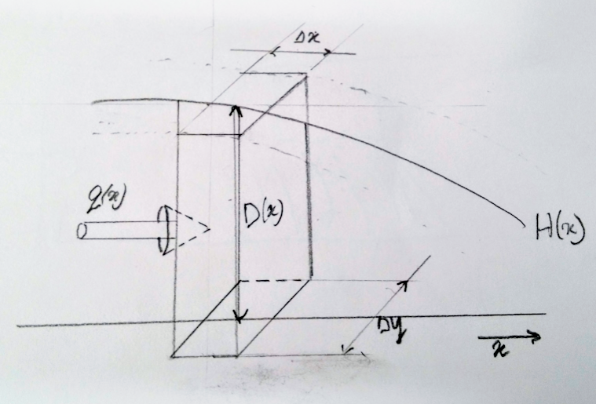
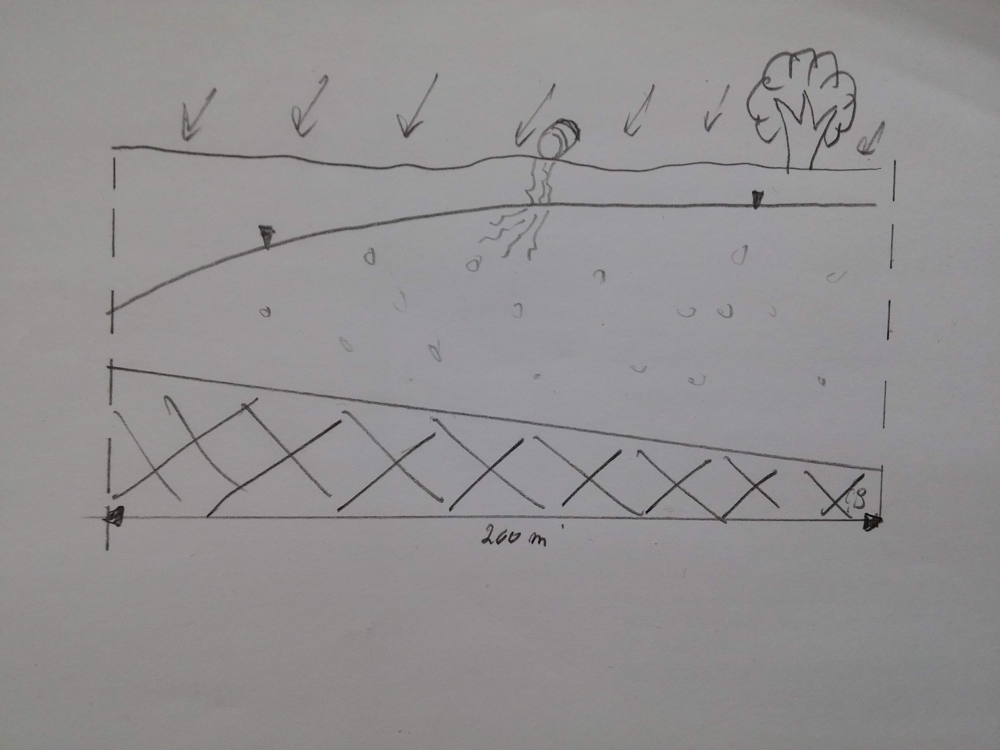

```{r}
rm(list = ls())
library(FVFE1D)
```

#Learning Goals  

* Understand the use of the Convection Diffusion/Dispersion Equation in the context of solute transport modeling.
* Derive physical dimensions and properties related to solute transport modeling.  
* Setup flow and transport models in a 1D or pseudo 2D environment using proper units.  
* Critically evaluate the numerical aspects of the solutions (Courant and Peclet numbers).  
* Setup water and mass balances for both types of models and analyse the result.  

#Introduction  

In this exercise the basic Convection Diffusion Equation (CDE) as discussed during the lectures will be reviewed and an analysis of the appropriate dimensions/units will be discussed. Next, the first equations to setup a 1 dimensional flow and 1 dimensional transport model need to be derived and implemented. Specific attention is paid to the translation of the flow, volume, density and mass into the proper units for the flow and transport problem. After the stationary flow model is run the stationary transport model is run based on the local velocities of the flow model. This situation represents for example a leaking drum with a certain pollutant into the groundwater system. The following modeling models will analyse the effect of remediating the spill based on local groundwater flow only and with the aid of a pump and treat scenario.  

The convection diffusion equation as discussed during the lectures is:
$$
\frac{\partial s}{\partial t}=-v \frac{\partial s}{\partial x}+D \frac{\partial^2 s}{\partial x^2}
$$

which is a mass balance for the particular state (s);  
With:

* $\frac{\partial s}{\partial t}$: mass storage change during time  
* $v \frac{\partial s}{\partial x}$: convective(advective) mass flux  
* $D \frac{\partial^2 s}{\partial x^2}$: diffusive/dispersive mass flux  

All the above terms (obviously) have dimensions: $\frac{\text{mass}}{\text{volume time}}$ and when multiplied with the appropriate control volume based on the finite volume or finite element techniques it results in a mass flux of $\frac{\text{mass}}{time}$ per time step.  

The above equation is a general expression for the CDE and can be used for simulating/addressing many environmental "flow" problems with such a signature.  
Here we are going to use it for a groundwater flow and solute transport problem in the saturated part of the soil.  

Retardation (add/desoprtion properties of a solute which effectively slows down the convection and diffusion processes) and decay are omitted from this equation for simplicity.

The convective part of this equation is based on the mass influx into (or out of) an elementary volume (e.g. a cube): 
$$
qC
$$  
Where:  

* $q$: Flux rate into (or out of) a face of the elementary volume (length/time)  
* $C$: Concentration of the solute (mass/volume)  

The convective part couples groundwater to solute transport.  

The diffusive part it is based on the equation of Fick (first law) which resembles Darcy's equation:
$$
J=-D\frac{\partial C}{\partial x}
$$

Where:  

* $J$: Diffusion flux (rate)  (mass/time)  
* $D$: Diffusivity of Diffusion coefficient length$^2$/time


<div class="question">
Why is there a negative sign in the above equation?
</div>


<div class="question">
When using the following units:

* length $\mathsf{m}$  
* mass $\mathsf{kg}$  
* concentration $\mathsf{kg/m^3}$  
* time $d$  

What is the unit for the following variables when one assumes 3 dimensional flow and transport?  

* $D$  
* $q$  
* $C$  
* $J$
</div>


In this exercise we consider the concentration of a solute to be the __only__ amount of mass in a __unit volume__ of groundwater. However in reality a concentration of e.g. 35 $kg/m^3$ of salt in a volume of 1000 liters groundwater will have a __density__ of about 1025 $kg/m^3$ (also depending on pressure, viscosity and temperature). So although $C$ and $\rho$ do have the same unit they are different in the way we calculate them. By the way flow due to density differences are also not considered here!  

#Groundwater flow model
The model which calculates the water(volume)flux is based on a flux rate integrated over the saturated thickness;
$$
q_D = -kD_{sat}(x)\frac{\partial H}{\partial x}
$$
Which makes this flux rate quasi 2D; the $_D$ in $q_D$ is to indicate that its a flux over the total saturated thickness.   

$D_{sat}$: The saturated thickness over which flow takes place ($m$).

<div class="question">
* What is the unit of this flux rate $q_D$ for this model?
</div>


The following illustration clarifies some dimensions of the flow in the 1D(or quasi 2D) model;  




  
  Consider the 'cube' being a volume containing and receiving a certain amount of solute from groundwater flow.
  
<div class="question">

* How is $q(x)$ in this model derived?
* How would you derive the flow velocity in this model?

</div>


##Model setup  
The model for stationary groundwater flow consists of one phreatic aquifer for which the bottom tilts from left to right. The total length of the model is 200 m, use a nodal distance of 5 m. The left boundary contains a Dirichlet boundary of 3 m Above Mean Sea Level (AMSL), the right boundary is situated on a water divide. On top a uniform recharge om 1 mm/d is applied.  
The bottom of the aquifer has an altitude of 1 m AMSL on the left and slopes downwards towards the right with 5 m/km.  
At a later stage an extraction well will be added to the model.  
To determine specific volume fluxes the porosity of the soil is required and is here estimated on 30%.  
Figure 2 illustrates the situation;



<div class="question">
1. Setup this flow model and give it a distinctive name e.g. Fmodel or Flowmodel or so.  
2. Run the model and look at the results; head distribution, internal flux and water balance terms.  
3. Create a plot showing both the calculated heads and the bottom of the aquifer.  
</div>


To determine the mass in the solute transport model the saturated thickness is required.  

<div class="question">  

* Make a function and a plot of the saturated thickness. Call the function e.g. D.sat .
</div>


##Flux and Volume functions for solute transport  

1. The convection diffusion equation contains a convective aspect for which the flow 'velocity' or in our case volume flux in $m^2/d$ is required. It is based on the internal flux of the groundwater flow equation.  
2. For the dispersive part it is also required to create a function for the volume per $\Delta x \Delta y$ to determine the amount of mass in the solute transport model.  Here this 'volume' is simply the saturated thickness multiplied with the porosity. 

<div class="question">  

1. Create the "volume flux" function(x) for the internal flux. Make use of __approxfun__  and set __rule=2__.  
2. Create the "volume water" function(x) based on the total "volume" of water contained in the saturated thickness per $\Delta x\Delta y$.
</div>

  

#Solute transport model  
The solute transport model will simulate the movement of a certain solute in the groundwater which comes from a continuous source. The source is simulated with a prescribed amount of mass "loaded" into the groundwater which is called "mass loading".  
The movement and displacement of the solute is based on the convection diffusion equation as described in the introduction:
$$
\frac{\partial s}{\partial t}=-v \frac{\partial s}{\partial x}+D \frac{\partial^2 s}{\partial x^2}
$$

But since we are using the FVFE1D package we simply implement Fick's first law for the diffusion/dispersion part combined with the convection part.  This will be the internal *mass flux* function for the solute transport model.  To distinguish the 'flow' process between groundwater flow and solute transport, groundwater flow is indicated with 'flow', as in __Qflow(x)__, for the internal flux with unit $m^2/d$. Solute transport focuses on the amount of mass of a certain solute/pollutant in the groundwater and is here indicated with __Mflux(x)__ with unit $kg/(dm)$.  

The mass flux is oriented perpendicular to local groundwater flow:

$$
M_{flux} =A \,\, por \left\{ vC-D\frac{\partial C}{\partial x}\right\}
$$

With:  

* $A$: the area perpendicular to the mass flux ($\mathsf{m^2}$)  
* $por$: porosity (-)  
* $v$: local velocity ($\mathsf{m/d}$)  
* $C$: concentration of the solute ($\mathsf{kg/m^3}$)  
* $D$: Diffusion/Dispersion coefficient ($\mathsf{m^2/d}$)  

The diffusion/dispersion is a combination of the molecular diffusion (Brownian movement) and the mechanical dispersion (accounting for the local pore flow and its pore structure) and is assumed to be constant here.

<div class="question">

* 'Derive' the mass flux equation from the above equation, which is the internal flux for the solute transport model and determine its unit.
* What is the unit for the concentration for this model?
* What is the unit for the mass in the model?

</div>


##Model setup  stationary

The domain of the solute transport model is identical to the groundwater flow model.  On the right hand side no solute is entering or leaving the model so the boundary is closed, simply because there is no flow there. On the left hand side solute leaves the model due to convection; i.o.w. groundwater flow carries the solute out of the model.  
The dispersion is set to 5 $\mathsf{m^2/d}$

<div class="question">

* Determine the proper boundary conditions.
</div>


###Point source  

Somewhere in the middle of the solute transport model a solute source (pollutant) is assigned to the model. It will be implemented as a _mass loading_ condition/forcing. One could imagine it being a substance dissolving into the groundwater. This way an amount of 'mass' is loaded into the model/groundwater during a certain amount of time.  In this case the substance is leaking into the groundwater continuously with a mass loading of 0.2 $\mathsf{kg/(md)}$


<div class="question">
Setup the solute transport model.

* Add the point source  
* What is the unit for the continuous solute source?
* Run the model and analyse the results; Concentration, internal flux, mass balance.
</div>

When looking at the results of this  model;  

  

<div class="question">

1. What are these calculated states?
2. What is the unit of this balance?
3. Check for the left boundary (your own calculation) the mass flux leaving the system; what unit does it have?

</div>


##Model setup transient  
Similar like all models up till now, the main difference between a stationary and transient model is the addition of the storage flux and the simulation through time.  

<div class="question">
* Define the storage flux for the transient model.  
In determining this flux(rate) and its units; be aware that the storage flux is a spatial flux, so the 'area' over which the flux rate is integrated is carried out by the FVFE1D package.
</div>  


The source of solute is removed from the transient solute transport model, implying that the pollutant has been cleaned up at the surface.  

To see whether numerical problems occur one need to determine the Peclet and Courant numbers for the given properties of the model. 

* Peclet$_{grid}$ number: $\frac{v\Delta x}{D} < 2$ 
* Courant number: $\frac{v\Delta t}{\Delta x} < 1$
* Based on previous $\Delta t < \frac{\Delta x}{v}$


<div class="question">
Set up a transient solute transport model based on the stationary model. 
At the start of the transient simulation the initial concentration of the solute is the final concentration distribution of the stationary solute transport model.
Consider the following aspects of this model:  

* Make a copy of the stationary transport model to develop the transient one  
* Remove the source from this model
* Calculate the Peclet and Courant numbers for each node for inspection and to determine a proper time step $\Delta t$
* Create a time stepping loop running for at least one year
* Plot the transient steps in one graph in the time stepping loop
* Store the mass balance terms into different arrays to plot these afterwards. See assignment 2 for details.
</div>


##Transient solute transport model with pump & treat  
 As can be seen from the results of the transient model, the solute disappears slowly at the left boundary. To speed up this process an extraction well is implemented at the location of the original source and will have an extraction rate equal to 50% of the recharge of the model.   
If the solute was some sort op pollutant this way of removing is called pump & treat, where the solute is removed/processed from the extracted groundwater. Pump & treat systems may also inject this cleaned water upstream, but this will not be implemented here.
 
<div class="question">  

* Adjust the groundwater flow model accordingly.
* Run the adjusted flow model and recalculate D.sat, internal flux and Volume functions.
</div>


<div class="question">  

* Calculate the Peclet and Courant numbers for each node for inspection and to determine a proper time step $\Delta t$.
</div>


<div class="question">  

* Create a time stepping loop running for at least one year.
* Plot the transient steps in one graph in the time stepping loop.
* Store the mass balance terms into different arrays to plot these afterwards. See assignment 2 for details.
</div>


<div class="question">
Calculate the following total amounts of solute mass ($kg$):  

* How much mass did the model contain at the start of the remediation?  
* what is left out of the boundary?  
* what is extracted with the pump & treat?  
* what is still stored?  
* Do they balance?
</div>  


