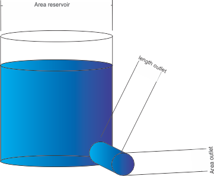
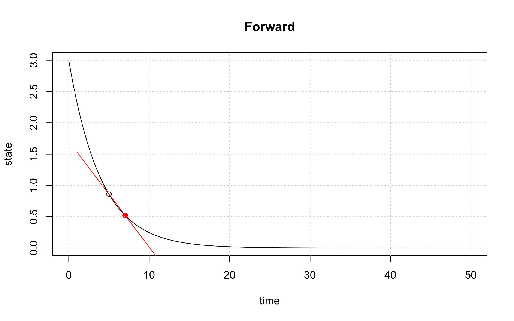
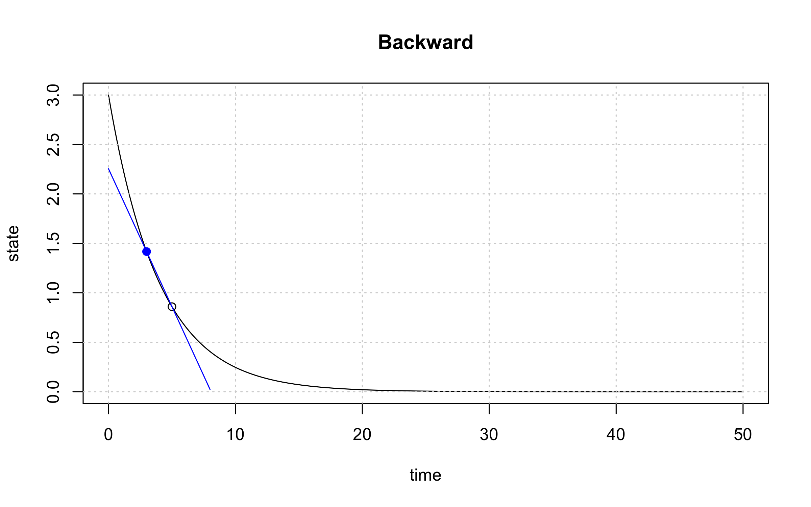
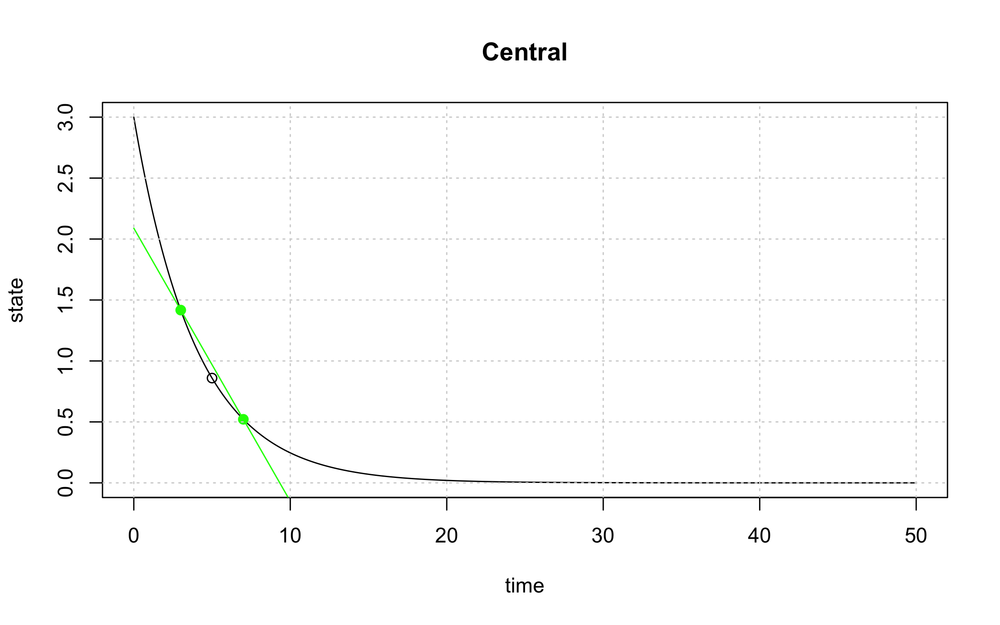

# Learning goals
* Understand the use of Taylor series
* Understand the mathematics of Taylor series
* Be able to calculate Taylor series for arbitrary functions
* Derive approximations for first derivatives from Taylor series

# Introduction
With this markdown you are going to to analyse the effect of properties and numerical schemes on the behavior of the solutions for simple 0D models, known as bucket or reservoir models (leaving out the spatial dimensions). The differential equations that need to be solved are simple ordinary differential equations. 

# Part 1
## Exercise 1.1
As the first example of a simple ordenary differential equation (ODE) an emptying reservoir is considered. It is an illustrative example because the exact solution is known so different methods can be compared to the real answer.

physical example of the emptying reservoir (or emptying bucket) model

 


This system can be represented by the following ODE:
$$ \dfrac{ds}{dt} = -\alpha s \tag{1}$$

The mathematical definition of the time derivate of the function $s(t)$ is as follows

$$ \dfrac{ds}{dt} = \lim_{\Delta t\to\ 0}\frac{s(t+\Delta t)-s(t)}{\Delta t} \tag{2}$$

This function can be approximated to be able to implement it in a computer. The simplest way of doing this is by taking a small $\Delta t$ instead of having a limit to 0:

$$ \dfrac{ds}{dt} \approx \frac{s(t+\Delta t)-s(t)}{\Delta t} \tag{3}$$

<span class="question">
1.1.1 Combine these function to make a discretisation for the next timestep ($s(t+\Delta t)$)
</span>

<span class="student_answer">
$$ s(t+\Delta t) = s(t) - \alpha  s(t) \Delta t \tag{4}$$
$$ s(t+\Delta t) = s(t)(1-\alpha \Delta t) \tag{5}$$
</span>

<span class="comment">Maybe the hard track can derive the true solution here</span>

## Exercise 1.2
Implement the formula derived in question 1.1 in the following script to set up to simulation

<span class="student_answer">
```{r chunk1_question}
sys.fun = function(state)
{
  newstate = ...
  return(newstate)
}
```
</span>

<span class="answer">
```{r chunk1_answer}
sys.fun = function(state)
{
  newstate = state*(1-alpha*dt)
  return(newstate)
}
```
</span>


Run the following chunk to perform the actual simulation and visualise it.
```{r chunk3}
# Initial parameter values
begin.time = 0     # usually this variable is set to 0
end.time   = 50    # end time of the simulation (50)
dt         = 0.1   # delta t; time discretisation (0.1)
init.state = 3     # state of the system at the beginning of the simulation (3)
alpha      = 0.25  # decay constant (0.25)

# Simulation initialisation
time = begin.time
result.state= c(init.state)
result.time = c(time)
current.state = init.state

# Simulation
while(time < end.time)
{
  current.state = sys.fun(current.state)
  result.state = c(result.state,current.state)
  time = time + dt
  result.time = c(result.time,time)
}

# Plotting
plot(result.time,result.state,type='o',xlab="time",ylab="state")
title(main='Emptying reservoir')
grid()
```

<span class="question">
1.2.1 Vary the 'dt' parameter between 0.001 and 25. Are there any numerical problems arising beyond a certain value for dt? What are the problems occuring when choosing a value for 'dt' close the high or low end of this range?
</span>

<span class="answer">
In the low end of the spectrum run-time will be significantly higher and can become unpractically slow (although the result is very accurate). On the high side; first you will notice that already in the first step the state of the reservoir will be lower than 0, which is physically incorrect. Secondly, when choosing a 'dt' that is even higher, the numerical approximation does not converge and can even go to positive/negative infinity.
</span>

<span class="question">
1.2.2 Reset dt to 0.1 and vary alpha between 0.25 and 25. Describe for alpha 0.25, 5, 10, 15, 20, 25 if the simulation is physically correct, converging and stable and explain why with the help of the equation that calculates the next state.

$\alpha$ | physically correct | convergent | stability | explanation 
---------| ------------------ | ---------- | --------- | ----------- 
0.25 | | | |  
5 | |  | | 
10 | | | |  
15 | | | |  
20 | | | |  
25 | | | |  

</span>

<span class="answer">

$\alpha$ | physically correct | convergent | stability | explanation 
---------| ------------------ | ---------- | --------- | ----------- 
0.25 | correct | converging | stable |  
5 | correct |  converging | stable | 
10 | correct |  converging | stable |  
15 | incorrect |  converging | stable | solution becomes negative because alpha*dt goes under 1 
20 | incorrect | not converging | (un)stable | solution does not go to zero as it should be continues jumping between -3 and 3
25 | incorrect | not converging | unstable | solution goes to inifity 

</span>


<span class="question">
1.2.3 Add the following two lines of code into chunk4 just below the plot command. It will plot the analytical solution on top of the numerical approximation.

time.sequence = seq(begin.time,end.time,by=0.1)
analyt.state=init.state * exp(-time.sequence*alpha)
lines(time.sequence,analyt.state,col='blue',lwd=2)
</span>

<span class="comment">
*maybe the hard track can implement this themselves? and calculate the true solution?
</span>

<span class="answer">
```{r chunk4}
# Initial parameter values
begin.time = 0     # usually this variable is set to 0
end.time   = 50    # end time of the simulation (50)
dt         = 5  # delta t; time discretisation (0.25)
init.state = 3     # state of the system at the beginning of the simulation (3)
alpha      = 0.25  # decay constant (0.25)

# Simulation initialisation
time = begin.time
result.state= c(init.state)
result.time = c(time)
current.state = init.state

# Simulation
while(time < end.time)
{
  current.state = sys.fun(current.state)
  result.state = c(result.state,current.state)
  time = time + dt
  result.time = c(result.time,time)
}

# Plotting
plot(result.time,result.state,type='o', xlab="time",ylab="state")
time.sequence = seq(begin.time,end.time,by=0.1)
analyt.state=init.state * exp(-time.sequence*alpha)
lines(time.sequence,analyt.state,col='blue',lwd=2)
title(main='Numerical and analytical solution compared')
grid()
```
</span>

<span class="question">
1.2.4 At which 'dt' do the numerical approximation and analytical solution start to agree fairly reasonably?
</span>

# Part 2
## Taylor series
The former exercise can be done also formally. For that we need Taylor series.

The principle of the taylor series is to construct an infinite series that can replace the original regular function without losing any information. It's use lies in the fact that it can simplify functions like making it easier to calculate derivatives. The finite differences methodology is based on these principles. 
TIP: if you are unfamiliar with this topic you might want to watch this video of 3Blue1Brown; https://www.youtube.com/watch?v=3d6DsjIBzJ4

The formula to expand a function to it's (inifite) taylor series is as follows:
$$f(x) = \sum_{n=0}^{\infty} \frac{f^{n}(a)}{n!}(x-a)^{n} \tag{6}$$

Expanding this function:

$$f(x) = f(a) + \frac{f'(a)}{1!}(x-a) + \frac{f''(a)}{2!}(x-a)^{2} + \frac{f'''(a)}{3!}(x-a)^{3} + \frac{f''''(a)}{4!}(x-a)^{4} + \ ... \tag{7}$$

Translating this formula in the terminology and context of exercise 1:

<span class="comment">maybe the hard track can this themselves</span>

$$s(t + \Delta t) = s(t) + \Delta t \frac{ds}{dt} \bigg\rvert_{t} + \frac{\Delta t^{2}}{2!} \frac{d^{2}s}{dt^{2}} \bigg\rvert_{t} + \frac{\Delta t^{3}}{3!} \frac{d^{3}s}{dt^{3}} \bigg\rvert_{t} + \frac{\Delta t^{4}}{4!} \frac{d^{4}s}{dt^{4}} \bigg\rvert_{t} + \ ...     \tag{8}$$
In simple words explained, this formula represents the exponential decay from a specified time 't'. If enough derivatives are used in this way, one formula would suffice to evaluate the emptying reservoir. The example of the emptying reservoir has a mathematical solution, so these derivatives can actually be calculated. In most real world cases however, the mathematical solution does not exist or to complex to work with and approximations have to be used. 

By settings up a finite difference approximation of a system ordinary differential equations are set up. This is done by defining the balances in the system and determining the physical formulae needed to solve it. A simple example is the bucket model showed above. The first derivate, the rate of change, is simply the amount (water might be a good way to visualise this) going into the system minus the amount leaving it:
$$\frac{ds}{dt} = Q_{in} - Q_{out} \tag{9}$$
In the example above the term $Q_{in}$ is zero. $Q_{out}$ is replaced by it's physical interpretation $\alpha t$, which is simply an exponential decay constant multiplied by the time that the system has an flux going out. The next step in defining the finite difference scheme is an approximation of the derivative. Since the derivative is the rate of change of the system it is the tangent line of a graph. This tangent line can be approximated by taking two points, close together, and devide their values by their distance on the x-axis. In the exmaple above this has been done with the formula: 
$$ \dfrac{ds}{dt} \approx \frac{s(t+\Delta t)-s(t)}{\Delta t} \tag{10}$$
This is not the only option, others include:
$$ \dfrac{ds}{dt} \approx \frac{s(t)-s(t-\Delta t)}{\Delta t} \tag{11}$$
and:
$$ \dfrac{ds}{dt} \approx \frac{s(t+\Delta t)-s(t-\Delta t)}{2\Delta t} \tag{12}$$

These together are the differencing methods and are respectively called "forward", "backward" and "central" method. For time integration the "forward" method is the most intuitive since it calculates the future based on current information. Later in this course, when we are looking not only at time but also  at space-integration, the others are going to be used. 

Equations 10 to 12 can be quite intuitively understood with the following graphs:

{width=800px, height=500}
{width=800px, height=500}
{width=800px, height=500}
These graphs show the tangent line for the black point calculated by taking two points on the graph.

Turning back to the taylor series, and it can be quickly seen that these methods are indeed an approximation and that the error for the approximation is rather easily calculatable with the taylor series. Taking the "forward" method as a first example:

$$s(t + \Delta t) = s(t) + \frac{\Delta t}{1!} \frac{ds}{dt} \bigg\rvert_{t} + \frac{\Delta t^{2}}{2!} \frac{d^{2}s}{dt^{2}} \bigg\rvert_{t} + \frac{\Delta t^{3}}{3!} \frac{d^{3}s}{dt^{3}} \bigg\rvert_{t} + \frac{\Delta t^{4}}{4!} \frac{d^{4}s}{dt^{4}} \bigg\rvert_{t} + \ ...     \tag{13}$$
Reworking this equation:

<span class="comment">might also be done by the advanced group</span>

$$\frac{s(t + \Delta t) - s(t)}{\Delta t} =  \frac{ds}{dt} \bigg\rvert_{t} + \frac{\Delta t}{2!} \frac{d^{2}s}{dt^{2}} \bigg\rvert_{t} + \frac{\Delta t^{2}}{3!} \frac{d^{3}s}{dt^{3}} \bigg\rvert_{t} + \frac{\Delta t^{3}}{4!} \frac{d^{4}s}{dt^{4}} \bigg\rvert_{t} + \ ... \tag{14}$$
Comparing this with the implementation in exercise 1 leads to the quantification of the error:

$$\frac{s(t + \Delta t) - s(t)}{\Delta t} =  \frac{ds}{dt} \bigg\rvert_{t} + error    \tag{15}$$
$$ error = \frac{\Delta t}{2!} \frac{d^{2}s}{dt^{2}} \bigg\rvert_{t} + \frac{\Delta t^{2}}{3!} \frac{d^{3}s}{dt^{3}} \bigg\rvert_{t} + \frac{\Delta t^{3}}{4!} \frac{d^{4}s}{dt^{4}} \bigg\rvert_{t} + \ ... \tag{16}$$

##Exercise 2.1
<span class="question">
<span class="comment">advanced question:</span>

use the R-functions *expression()*, *D()* (derivative) and *eval()* to implement the first four terms of equation 13 incremently in chunk5 and plot this result on top of the existing plot. Note down the error every time a term is added.

terms | error 
----- | ----- 
1 |  
2 |
3 |
4 | 
5 | 

```{r chunk5_question, eval=FALSE}
# Initial parameter values
begin.time = 0     # usually this variable is set to 0
end.time   = 50    # end time of the simulation (50)
dt         = 5  # delta t; time discretisation (0.25)
init.state = 3     # state of the system at the beginning of the simulation (3)
alpha      = 0.25  # decay constant (0.25)

# Simulation initialisation
time = begin.time
result.state= c(init.state)
result.time = c(time)
current.state = init.state

# Simulation
while(time < end.time)
{
  current.state = sys.fun(current.state)
  result.state = c(result.state,current.state)
  time = time + dt
  result.time = c(result.time,time)
}

# Taylor series approximation
f = ...                 # implement equation 13

DT = c(0,time.sequence) # list of evaluation times
p  = eval(f)            # list of results of the implemented funtion

# Plotting
plot(result.time,result.state,type='o', xlab="time",ylab="state")
time.sequence = seq(begin.time,end.time,by=0.1)
analyt.state=init.state * exp(-time.sequence*alpha)
lines(time.sequence,analyt.state,col='blue',lwd=2)
lines(DT,p, lwd=2, col="green")

DT = dt
correct.state = ...     # state at 1 step (dt)
error = ...             # determine the distance between the correct.state and the value calculated with the taylor series 
points(dt,eval(g),col="green",pch=19)
points(dt,correct.state,pch=19)
segments(dt,correct.state,dt,eval(g),col="red",lwd=2)
title(main=paste('Numerical and analytical solution compared. Error: ',error))
      
grid()
```

</span>

<span class="answer">
answer hard question

```{r chunk5_answer}
# Initial parameter values
begin.time = 0     # usually this variable is set to 0
end.time   = 50    # end time of the simulation (50)
dt         = 5  # delta t; time discretisation (0.25)
init.state = 3     # state of the system at the beginning of the simulation (3)
alpha      = 0.25  # decay constant (0.25)

# Simulation initialisation
time = begin.time
result.state= c(init.state)
result.time = c(time)
current.state = init.state

# Simulation
while(time < end.time)
{
  current.state = sys.fun(current.state)
  result.state = c(result.state,current.state)
  time = time + dt
  result.time = c(result.time,time)
}

# Taylor series approximation
f = expression((-0.75 + 0.1875 * DT^(1)/2 - 0.046875 * DT^(2)/6) * DT + 3)   # constants obtained by integration and evaluation (function D() and eval())

DT = c(0,time.sequence) # list of evaluation times
p  = eval(f)            # list of results of the implemented funtion

# Plotting
plot(result.time,result.state,type='o', xlab="time",ylab="state")
time.sequence = seq(begin.time,end.time,by=0.1)
analyt.state=init.state * exp(-time.sequence*alpha)
lines(time.sequence,analyt.state,col='blue',lwd=2)
lines(DT,p, lwd=2, col="green")

DT = dt
correct.state = init.state*exp(-dt*alpha)
error = round(abs(correct.state-eval(f)),3)
points(dt,eval(f),col="green",pch=19)
points(dt,correct.state,pch=19)
segments(dt,correct.state,dt,eval(f),col="red",lwd=2)
title(main=paste('Numerical and analytical solution compared. Error: ',error))
      
grid()
```

terms | error 
----- | ----- 
1 | 1.609 
2 | 0.242 
3 | 0.063 
4 | 0.013 
5 | 0.002 

The error rapidly decreases every time the next term of the taylor series is added.

</span>

<span class="question">
<span class="comment">
simpler version of the question:
</span>
The variable called "taylor" in chunk5 determines how many terms of equation 13 are taken into account. Write down the error between the taylor series implementation and the true emptying bucket.

terms | error 
----- | ----- 
1 |  
2 |
3 |
4 | 
5 | 


```{r chunk7}
# Taylor series parameter
taylor     = 1

# System function
sys.fun = function(state)
{
  newstate = state*(1-alpha*dt)
  return(newstate)
}

# Initial parameter values
begin.time = 0     # usually this variable is set to 0
end.time   = 50    # end time of the simulation (50)
dt         = 5     # delta t; time discretisation (0.25)
init.state = 3     # state of the system at the beginning of the simulation (3)
alpha      = 0.25  # decay constant (0.25)

# Simulation initialisation
time = begin.time
result.state= c(init.state)
result.time = c(time)
current.state = init.state

# Simulation
while(time < end.time)
{
  current.state = sys.fun(current.state)
  result.state = c(result.state,current.state)
  time = time + dt
  result.time = c(result.time,time)
}

# Taylor series approximation
taylor = taylor + 1
base.f = expression(init.state*exp(-alpha*x))
f = expression(init.state*exp(-alpha*x))
derivative.list = c()
final.product = 0
x = 0 # evaluate all functions at t=o

#first cycle


if(taylor>1){
f = D(f,"x")
final.product = substitute(expression(eval.f), 
                           list(eval.f = eval(f)))
  if(taylor>2){
    for(i in 2:taylor){
      f = D(f,"x")
      final.product = substitute(expression(bef + eval.f*DT^(pow)/fac), 
                                 list(eval.f = eval(f), 
                                      bef = final.product[[2]],
                                      pow=(i-1),
                                      fac=factorial(i)))
    }
  }
g = parse(text = substitute(expression((f)*DT + base), list(f = final.product[[2]],base = eval(base.f))))
} else {
  g = parse(text = substitute(expression(base), list(base = eval(base.f))))
}

DT = c(0,time.sequence)
p  = eval(g)

# Plotting
plot(result.time,result.state,type='o', xlab="time",ylab="state")
time.sequence = seq(begin.time,end.time,by=0.1)
analyt.state=init.state * exp(-time.sequence*alpha)
lines(time.sequence,analyt.state,col='blue',lwd=2)
lines(DT,p, lwd=2, col="green")

DT = dt
correct.state = init.state*exp(-dt*alpha)
error = round(abs(correct.state-eval(g)),3)
points(dt,eval(g),col="green",pch=19)
points(dt,correct.state,pch=19)
segments(dt,correct.state,dt,eval(g),col="red",lwd=2)
title(main=paste('Numerical and analytical solution compared. Error: ',error))
      
grid()
```

</span

<span class="answer">

terms | error 
----- | ----- 
1 | 1.609 
2 | 0.242 
3 | 0.063 
4 | 0.013 
5 | 0.002 

</span>

##Exercise 2.2
The approach so far has be to combine two different equations for the same derivative. By combining them, the next time step can be approximated. The first equation is an approximation of the derivative by taking the first term of the taylor series belonging to the function that describes the system (this can be done even without precisely knowing the exact function). An example is given in equation 10. By removing the error term, which is proportional to the time step itself, this equation gives an approximation of the derivative. The second equation needed, is the equation that describes the balance within a system. This equation is an objective function, but it's value in reality is determined by the quality of the input data rather than the function in and on itself. We will come back to this later on. An example of this function is equation 9. Combining these functions you end up with one equation that can be used in a computer model:

$$
\begin{matrix}
\dfrac{s(t+\Delta t) - s(t)}{\Delta t} &=& \dfrac{ds(t)}{dt}\\
\dfrac{ds(t)}{dt} &=& Q_{in} - Q_{out}\\
\dfrac{s(t+\Delta t) - s(t)}{\Delta t} &=& Q_{in} - Q_{out}\\
s(t+\Delta t) &=& s(t) + \Delta t(Q_{in} - Q_{out})\\
\tag{17}
\end{matrix}
$$
This method is called a forward differencing scheme.

Previously it was stated that beside a forward scheme, more options exist. These options are represented by figures after equation 12. Another way to understand what happens here is by turning back to the taylor series of equation 13 and 14. The backward differencing scheme is optained by replace $\Delta t$ by $-\Delta t$.

<span class="question">
<span class="comment">hard question</span>
Replace $\Delta t$ with $-\Delta t$ in equation 13. Describe why for time integration this solution is not really workable.
</span>

<span class="answer">
$$s(t - \Delta t) = s(t) - \frac{\Delta t}{1!} \frac{ds}{dt} \bigg\rvert_{t} + \frac{\Delta t^{2}}{2!} \frac{d^{2}s}{dt^{2}} \bigg\rvert_{t} - \frac{\Delta t^{3}}{3!} \frac{d^{3}s}{dt^{3}} \bigg\rvert_{t} + \frac{\Delta t^{4}}{4!} \frac{d^{4}s}{dt^{4}} \bigg\rvert_{t} - \ ...     \tag{18}$$
leading to:
$$\dfrac{s(t - \Delta t) - s(t)}{\Delta t} = - \frac{ds}{dt} \bigg\rvert_{t} + \frac{\Delta t}{2!} \frac{d^{2}s}{dt^{2}} \bigg\rvert_{t} - \frac{\Delta t^{2}}{3!} \frac{d^{3}s}{dt^{3}} \bigg\rvert_{t} + \frac{\Delta t^{3}}{4!} \frac{d^{4}s}{dt^{4}} \bigg\rvert_{t} - \ ...     \tag{19}$$
multiplying both sides by -1:
$$\dfrac{s(t) - s(t - \Delta t)}{\Delta t} = \frac{ds}{dt} \bigg\rvert_{t} - \frac{\Delta t}{2!} \frac{d^{2}s}{dt^{2}} \bigg\rvert_{t} + \frac{\Delta t^{2}}{3!} \frac{d^{3}s}{dt^{3}} \bigg\rvert_{t} - \frac{\Delta t^{3}}{4!} \frac{d^{4}s}{dt^{4}} \bigg\rvert_{t} + \ ...     \tag{20}$$
which leads back to equation 11:
$$\dfrac{s(t) - s(t - \Delta t)}{\Delta t} \approx \frac{ds}{dt} \bigg\rvert_{t} + error    \tag{21}$$
</span>

The last integration scheme discussed here is the central scheme. This is optained by substracting equation 18 from equation 13:

$$
\begin{matrix}

s(t + \Delta t) &=& s(t) + \dfrac{\Delta t}{1!} \dfrac{ds}{dt} \bigg\rvert_{t} + \dfrac{\Delta t^{2}}{2!} \dfrac{d^{2}s}{dt^{2}} \bigg\rvert_{t} + \dfrac{\Delta t^{3}}{3!} \dfrac{d^{3}s}{dt^{3}} \bigg\rvert_{t} +\dfrac{\Delta t^{4}}{4!} \dfrac{d^{4}s}{dt^{4}} \bigg\rvert_{t} + \ ... \\    


s(t - \Delta t) &=& s(t) - \dfrac{\Delta t}{1!} \dfrac{ds}{dt} \bigg\rvert_{t} + \dfrac{\Delta t^{2}}{2!} \dfrac{d^{2}s}{dt^{2}} \bigg\rvert_{t} - \dfrac{\Delta t^{3}}{3!} \dfrac{d^{3}s}{dt^{3}} \bigg\rvert_{t} + \dfrac{\Delta t^{4}}{4!} \dfrac{d^{4}s}{dt^{4}} \bigg\rvert_{t} - \ ...  \\

\hline \\

s(t + \Delta t) - s(t - \Delta t) &=& 2\dfrac{\Delta t}{1!}\dfrac{ds}{dt} + 2\dfrac{\Delta t^{3}}{3!} \dfrac{d^{3}s}{dt^{3}}

\tag{22}
\end{matrix}
$$
Reworking this equation to approximation of the first order derivative:

$$ \dfrac{s(t + \Delta t) - s(t - \Delta t)}{2\Delta t} = \dfrac{ds}{dt} + \dfrac{\Delta t^{2}}{3!} \dfrac{d^{3}s}{dt^{3}} + \ ... \tag{23}$$
I striking difference between this formula and the two previous ones is that the term with the second derivative is cancelled out. This means that the error of the approximation is potentially a lot smaller. However, for time integration you have to use not the current time step but the previous, which is less informative. For space integration, that we will discuss in the following days, these schemes will prove to be rather useful.

#Part 3
##Integration methods


