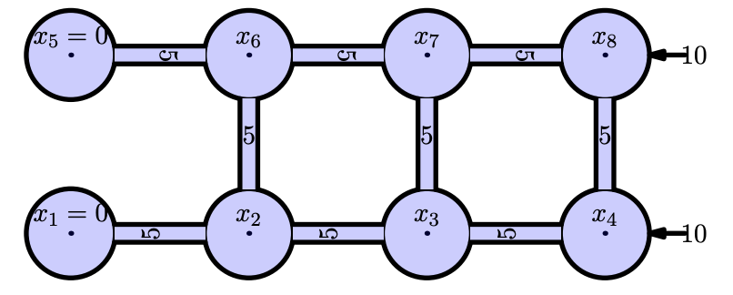
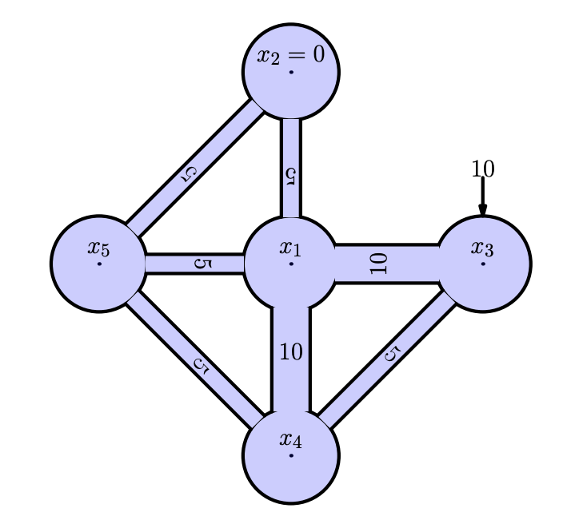

<!-- include the hint.js -->
<script src="../../hints.js"></script>

# Learning goals

# Part 1 - Introduction
## Section 1.1 - Advection Diffusion Equation 
The final result of this part of the course, the finite difference approach, is to be able models in a time and space continuum. A very common example is the advection diffusion equation that was presented during the lecture. The formula for this equation is as follows:

$$\frac{\partial s}{\partial t} = -u \frac{\partial s}{\partial x} + D\frac{\partial^{2}s}{\partial x^{2}}$$

It describes how a phenomena, such as a wave, moves. This equation looks both at space and time. For this practical we will be looking at a simplification of this equation: the stationary situation ($\frac{\partial s}{\partial t} = 0$):

$$0 = -u \frac{\partial s}{\partial x} + D\frac{\partial^{2}s}{\partial x^{2}}$$


## Section 1.2 - Backward and Central Differencing method
In the previous practical, we have been working with the following formula:
$$\dfrac{s(t+\Delta t) - s(t)}{\Delta t} = \dfrac{ds(t)}{dt}$$
This is called the *forward differencing method*. It calculates the state after a given time-step by using the information of the current state $s(t)$. The methodology to solve equations in space is exactly the same, only the mathematical formulation changes slightly:

$$\dfrac{s(x+\Delta x) - s(x)}{\Delta x} = \dfrac{ds(x)}{dx}$$
The only change in this equation is that time has been replaced by space. By using this formulation you change the dimension, meaning that in time integration you end up with a graph that displays a time - state plot. Here you end up with a space - state plot. The x-axis will be a system, displayed from left to right, with the states on the y-axis. This is a stationary plot, time has no influence. 

There is a however a difference between space and time; time only goes forward but space does not have a direction. Therefore space integration can be approached in different ways than time. Time integration only has a forward differencing scheme, space also has a backward and central scheme that we will discuss here (forward is a slightly confusing convention here, it basically signifies from left to right).

First the mathematical derivation. The forward differencing method was formally derived by using the following taylor series:

$$s(t + \Delta t) = s(t) + \Delta t \frac{ds}{dt} \bigg\rvert_{t} + \frac{\Delta t^{2}}{2!} \frac{d^{2}s}{dt^{2}} \bigg\rvert_{t} + \frac{\Delta t^{3}}{3!} \frac{d^{3}s}{dt^{3}} \bigg\rvert_{t} + \frac{\Delta t^{4}}{4!} \frac{d^{4}s}{dt^{4}} \bigg\rvert_{t} + \ ...     \tag{}$$

In the space dimension this becomes:

$$s(x + \Delta x) = s(x) + \Delta x \frac{ds}{dx} \bigg\rvert_{x} + \frac{\Delta x^{2}}{2!} \frac{d^{2}s}{dx^{2}} \bigg\rvert_{x} + \frac{\Delta x^{3}}{3!} \frac{d^{3}s}{dx^{3}} \bigg\rvert_{x} + \frac{\Delta x^{4}}{4!} \frac{d^{4}s}{dx^{4}} \bigg\rvert_{x} + \ ...     \tag{}$$

The backward scheme (from right to left) is defined as follows: replace $\Delta x$ with $-\Delta x$.

$$s(x - \Delta x) = s(x) - \Delta x \frac{ds}{dx} \bigg\rvert_{x} + \frac{\Delta x^{2}}{2!} \frac{d^{2}s}{dx^{2}} \bigg\rvert_{x} - \frac{\Delta x^{3}}{3!} \frac{d^{3}s}{dx^{3}} \bigg\rvert_{x} + \frac{\Delta x^{4}}{4!} \frac{d^{4}s}{dx^{4}} \bigg\rvert_{x} + \ ...     \tag{}$$

Reworking this equation leads to the backward differencing method:

$$\frac{s(x) - s(x  - \Delta x)}{dx} = \frac{ds}{dx}$$

The *central differencing scheme* is created by substracting the taylor series used for the forward and bacward schemes:

\begin{alignat*}{3}
s(x + \Delta x) &= s(x) + && \dfrac{\Delta x}{1!} \dfrac{ds}{dx} \bigg\rvert_{x} + \dfrac{\Delta x^{2}}{2!} \dfrac{d^{2}s}{dx^{2}} \bigg\rvert_{x} + &&& \dfrac{\Delta x^{3}}{3!} \dfrac{d^{3}s}{dx^{3}} \bigg\rvert_{x} + \dfrac{\Delta x^{4}}{4!} \dfrac{d^{4}s}{dx^{4}} \bigg\rvert_{x} + \ ... \\    


s(x - \Delta x) &= s(x) - && \dfrac{\Delta x}{1!} \dfrac{ds}{dx} \bigg\rvert_{x} + \dfrac{\Delta x^{2}}{2!} \dfrac{d^{2}s}{dx^{2}} \bigg\rvert_{x} - &&&\dfrac{\Delta x^{3}}{3!} \dfrac{d^{3}s}{dx^{3}} \bigg\rvert_{x} + \dfrac{\Delta x^{4}}{4!} \dfrac{d^{4}s}{dx^{4}} \bigg\rvert_{x} - \ ...  \\

\hline \\

s(x + \Delta x) - s(x - \Delta x) &=  &&\dfrac{2\Delta x}{1!}\dfrac{ds}{dx} +  &&&\dfrac{2\Delta x^{3}}{3!} \dfrac{d^{3}s}{dx^{3}}
\end{alignat*}

It can be seen quite easily that this is an efficient scheme. The second and fourth derivative are canceled out by substraction, leaving an error term in the final equation that has the third derivative as largest contributor instead of the second. This reduces the error significantly. The final equation to express the first derivative is as follows:

$$\frac{s(x + \Delta x) - s(x - \Delta x)}{2\Delta x} = \frac{ds}{dx}$$

<span class="comment"> maybe equations can be written by the hard track themselves </span>

# Part 2 - Matrix calculation intermezzo
### Exercise 1

For the calculations in this pracical we will lean heavily on matrix algebra. This part is a quick summary of how to implement and work with matrices in the R environment.

A matrix is a collection of numbers organized in rows and columns. The following lines of codes construct a matrix:

```{R}
M = matrix (c(1, 2, 3, 4, 5, 6) , nrow=2)
print(M)
```

The code lines above made a matrix by giving all the values in the construction itself. Once constructed, values of a matrix can be changed in different ways.

<span class="question">
1.1 How many rows and how many columns has this matrix?
</span>

<span class="answer">
2 rows, 3 columns
</answer>

<span class="question">
1.2 Describe for each of the following lines the changes made to the matrix M
```{R}
M[1,2]= 100
M[1, ]= c(10, 11, 12)
M[ ,2]= c(-1 ,-2)
```
</span>

<span class="question">
1.3 What is the difference between the matrix constructed in the first subquestion and the matrix construced by:
```{R}
M = matrix(c(1, 2, 3, 4, 5, 6), nrow=2 , ncol=3)
```
</span>

<span class="question">
1.4 What is the difference between the matrix constructed in the first subquestion and the matrix constructed by:
```{R}
M = matrix(c(1, 2, 3, 4, 5, 6) , nrow=2 , ncol=2)
```
</span>

<span class="question">
1.5 What is the difference between the matrix constructed in the first subquestion and the matrix constructed by:
```{R}
M = matrix(c(1, 2, 3, 4, 5, 6) , nrow=2 , ncol=4)
```
</span>

<span class="question">
1.7 What is the difference between the matrix constructed in the first subquestion and the matrix construced by:
```{R}
M = matrix(c(1, 2, 3, 4, 5, 6) , nrow=2 , ncol=3 , byrow=TRUE)
```
</span>

### Exercise 2
Exercise 2
The matrix constructions in the previous question where very explicit. Many
matrices (certainly large ones) can more efficiently be constructed by loops. The following lines of code give an example (and prints the result):

```{R}
M = matrix(0,nrow=5,ncol=7)
for(i in 1:nrow(M)) {
  for(j in 1:ncol(M)){
    M[i,j]=i+j
  }
}
print(M)
```

<span class="question">
2.1 Make code with a double loop as above that constructs the following matrix:

```{}
> print(M)
     [,1] [,2] [,3] [,4] [,5]
[1,]   11   12   13   14   15
[2,]   21   22   23   24   25
[3,]   31   32   33   34   35
```
</span>

<span class="answer">
```{R}
M = matrix(0,nrow=3,ncol=5)
for(i in 1:nrow(M)) {
  for(j in 1:ncol(M)){
    M[i,j]=10*i+j
  }
}
print(M)
```
</span>

<span class="question">
2.2 Make code with a double loop as above that constructs the following matrix:

```{}
> print(M)
     [,1][,2][,3][,4][,5]
[1,]    0   1   2   3   4
[2,]    1   0   1   2   3
[3,]    2   1   0   1   2
[4,]    3   2   1   0   1
[5,]    4   3   2   1   0
```
</span>

<span class="answer">
```{R}
M = matrix(0,nrow=5,ncol=5)
for(i in 1:nrow(M)) {
  for(j in 1:ncol(M)){
    M[i,j]=abs(i-j)
  }
}
print(M)
```
</span>

### Exercise 3
These exercise are an introduction to the solution of linear equations. The following linear equations:

$$
\begin{align}
&x_1 + &&2x_2 &&& &&&&= &&&&&5\\
& &&3x_2 + &&&4x_3 &&&&= &&&&&18\\
&6x_1 + && &&&x_3 &&&&= &&&&&9
\end{align}
$$
are rewritten in matrix form:

$$
\begin{matrix}
A\ x &=& b\\
\begin{bmatrix}
1&2&0\\0&3&4\\6&0&1
\end{bmatrix}
\begin{bmatrix}
x_1\\x_2\\x_2
\end{bmatrix}
&=&
\begin{bmatrix}
5\\18\\9
\end{bmatrix}
\end{matrix}
$$

and solved in R by:

```{}
x = solve(A,b)
```

<span class="question">
3.1 Calculate the solutions of the equations above in R
</span>

<span class="question">
3.2 Find the solution (as done above) of the following equations:

$$
\begin{align}
x_1 = 4\\
-x_1 + 2x_2 - x_3 = 1\\
-x_2 + 2x_3 - x_4 = 1\\
-x_3 + 2x_4 - x_5 = 1\\
x_5 = 2
\end{align}
$$
</span>

<span class="answer">
```{R}
A = matrix(c(1,0,0,0,0,-1,2,-1,0,0,0,-1,2,-1,0,0,0,-1,2,-1,0,0,0,0,1),nrow=5,ncol=5,byrow=TRUE)
b = matrix(c(4,1,1,1,2),nrow=5)
print(solve(A,b))
```
</span>

<span class="question">
3.3 The equations above can be generalized for any integer N into:

x1 = 4
for i in 2:(N-1) -xi-1 + 2 xi - xi+1 = 1
xN = 2

$$ 
\begin{matrix}
& &&x_1 &=& 4\\
&for\ i\ in\ 2:(N-1) && -x_i + 2x_i-x_i &=& 1\\
& &&x_N &=& 2
\end{matrix}
$$

Write code that generates the matrices for the equations above and
solve them. Use the following lines as a starter:

```{R}
N      = 20
A      = matrix(0,nrow=N,ncol=N)
b      = rep(1,length=N)
A[1,1] = 1
b[1]   = 4
```

* finish this code
* check that for N=5 the result of the previous question is recalculated
* make for N=100 a plot of the result

</span>

<span class="question">
```{R}
N      = 25
A      = matrix(0,nrow=N,ncol=N)
b      = rep(1,length=N)
A[1,1] = 1
b[1]   = 4
b[N]   = 2
A[N,N] = 1
for(i in 2:(N-1)){
  A[i,i  ] = 2
  A[i,i-1] = -1
  A[i,i+1] = -1
}
#print(solve(A,b))
plot(solve(A,b))
```
</span>

### Exercise 4
In this question the translation of (stationary, discrete) flow problems into a set of linear equations is reviewed.

In what follows, flow problems will be defined by graphs such as:
</br>
{width=30%}

* the circles stand for cylinders with unknown fluid level for which a name is suggested inside this circle
* some of the levels inside the cylinders are prescribed (as is the case in the top cylinder of the example above); these prescribed values will be called boundary conditions.
* these cylinders are connected with pipes, whose cross sectional area are indicated inside the pipes by numbers. The flux between these cylinders is given by this area times the level differences between the cylinders connected
* there are external amounts of fluids added to the cylinders, as e.g. the flux 3 to the top.

the fluxes between the cylinders is calculated by multiplying the gradient between the two cylinders and the cross sectional area. For example between $x_1$ and $x_2$ there is the following flow:

$$q_{1\to2} = 7(x_1-x_2)$$
which is equal to the flux going in the other direction:
$$q_{2\to1} = 7(x_2-x_1)$$
<span class="question">
4.1 Write down the other fluxes in the system (both forward and backward through the pipe)
</span>

<span class="answer">
$$
\begin{align}
q_{2\to3} &= 8(x_2-x_3)\\
q_{3\to2} &= 8(x_3-x_2)\\
\\
q_{3\to1} &= 5(x_3-x_1)\\
q_{1\to3} &= 5(x_1-x_3)
\end{align}
$$
</span>

From these equations mass balances can be set up. For example for cylinder $x_1$:

$$
\begin{align}
q_{2\to1} + q_{3\to1} + 3 = 0 \\
7(x_2-x_1) + 5(x_3-x_1) + 3 = 0
\end{align}
$$
<span class="question">
4.2 Set up the mass balances for $x_2$ and $x_3$
</span>

<span class="answer">
$$
\begin{align}
q_{3\to2} + q_{1\to2} + 1 = 0 \\
8(x_3-x_2) + 7(x_1-x_2) + 1 = 0\\
\\
q_{1\to3} + q_{2\to3} + 2 = 0 \\
5(x_1-x_3) + 8(x_2-x_3) + 2 = 0\\
\end{align}
$$
</span>

<span class="question">
4.3 Write the previous three mass balance equations in the form:
$$ax_1 + bx_2 + cx_3 = d$$
</span>

<span class="answer">
$$
\begin{align}
-12x_1 + 7x_2 + 5x_3 = -3\\
7x_1 - 15x_2 + 8x_3 = -1\\
5x_1 + 8x_2 -13x_3 = -2
\end{align}
$$
</span>

<span class="question">
4.4 Plug the previous equations in a matrix in the following way:

$$
\begin{align}
A * x &= b\\
\begin{bmatrix}
a&a&a\\b&b&b\\c&c&c
\end{bmatrix} *
\begin{bmatrix}
x_1\\x_2\\x_3
\end{bmatrix} &=
\begin{bmatrix}
d\\d\\d
\end{bmatrix}
\end{align}
$$

</span>

<span class="answer">
$$
\begin{align}
\begin{bmatrix}
-12&7&5\\7&-15&8\\5&8&-13
\end{bmatrix} *
\begin{bmatrix}
x_1\\x_2\\x_3
\end{bmatrix} &=
\begin{bmatrix}
-3\\-1\\-2
\end{bmatrix}
\end{align}
$$
</span>

<span class="question">
4.5 Put the boundary condition $x_1 = 2$ into the matrix
</span>

<span class="answer">
$$
\begin{align}
\begin{bmatrix}
1&0&0\\7&-15&8\\5&8&-13
\end{bmatrix} *
\begin{bmatrix}
x_1\\x_2\\x_3
\end{bmatrix} &=
\begin{bmatrix}
2\\-1\\-2
\end{bmatrix}
\end{align}
$$
</span>

<span class="question">
4.6 Implement this equation in R and write down the x vector
</span>

<span class="answer">
```{R}
M=matrix(0,nrow=3,ncol=3)
# bring flux between 1and 2 in matrix
M[1,1] = M[1,1]-7
M[1,2] = M[1,2]+7
M[2,2] = M[2,2]-7
M[2,1] = M[2,1]+7
# bring flux between 1 and 3 in matrix
M[1,1] = M[1,1]-5
M[1,3] = M[1,3]+5
M[3,3] = M[3,3]-5
M[3,1] = M[3,1]+5
# bring flux between 2 and 3 in matrix
M[2,2] = M[2,2]-8
M[2,3] = M[2,3]+8
M[3,3] = M[3,3]-8
M[3,2] = M[3,2]+8
# bring in the boundary condition
M[1,]  = 0
M[1,1] = 1
# right hand side
b = c(2,-1,-2)
print(solve(M,b))
```
</span>

<span class="question">
4.7 Solve the system depicted in the following scheme and explain the result: 
</br>
{width=30%}
</span>

</span class="answer">
```{R}
M=matrix(0,nrow=3,ncol=3)
# bring flux between 1and 2 in matrix
M[1,1] = M[1,1]-7
M[1,2] = M[1,2]+7
M[2,2] = M[2,2]-7
M[2,1] = M[2,1]+7
# bring flux between 1 and 3 in matrix
M[1,1] = M[1,1]-5
M[1,3] = M[1,3]+5
M[3,3] = M[3,3]-5
M[3,1] = M[3,1]+5
# bring flux between 2 and 3 in matrix
M[2,2] = M[2,2]-8
M[2,3] = M[2,3]+8
M[3,3] = M[3,3]-8
M[3,2] = M[3,2]+8
# bring in the boundary condition
M[1,]  = 0
M[1,1] = 1
# right hand side
b = c(2,0,0)
print(solve(M,b))
```
Nothing the disturb the system so it will become a static state with equal states everywhere
</span>

<span class="question">
<span class="comment">maybe for hard track</span></br>
4.8 The following code reaches the same result as the answer on 4.6. Explain briefly how this code works.

```{R}
M=matrix(0,nrow=3,ncol=3)
# bring flux between 1and 2 in matrix
M[1,1] = M[1,1]-7
M[1,2] = M[1,2]+7
M[2,2] = M[2,2]-7
M[2,1] = M[2,1]+7
# bring flux between 1 and 3 in matrix
M[1,1] = M[1,1]-5
M[1,3] = M[1,3]+5
M[3,3] = M[3,3]-5
M[3,1] = M[3,1]+5
# bring flux between 2 and 3 in matrix
M[2,2] = M[2,2]-8
M[2,3] = M[2,3]+8
M[3,3] = M[3,3]-8
M[3,2] = M[3,2]+8
# bring in the boundary condition
M[1,]  = 0
M[1,1] = 1
# right hand side
b = c(2,-1,-2)
print(solve(M,b))
```
</span>

<span class="answer">
It solves the system by adding the fluxes one after the other instead of implementing the matrix by hand.
</span>

<span class="question">
<span class="comment">maybe for hard track</span></br>
4.9 The following code is a more elegant way to construct the matrix in the previous exercise. Give proper names to the vectors *f,t* and *a* and explain what happens.

```{R}
M = matrix(0,nrow=3,ncol=3)
# the following gives an ???elegant??? programming solution
f = c(1,2,3)
t = c(2,3,1)
a = c(7,8,5)
for(i in 1:length(f)){
  M[f[i],f[i]] = M[f[i],f[i]] - a[i]
  M[f[i],t[i]] = M[f[i],t[i]] + a[i]
  M[t[i],t[i]] = M[t[i],t[i]] - a[i]
  M[t[i],f[i]] = M[t[i],f[i]] + a[i]
}
```
</span>

<span class="question">

4.10 Solve the following system:</br>
{width=40%}

</span>

<span class="question">
<span class="comment">Maybe for the hard question</span></br>
4.11 Solve the following system </br>
{width=40%}
</span>

<span class="comment">
Exercise 6 in the pdf could be useful
</span>

# Part 3 - Standing wave
For the first example with the three differencing schemes we will examine the simplest wave equation possible, a sinus-function with it's derivative that is the opposite cosine wave ($\frac{ds}{dx}=cos(x)$). The first chunk is fully preprogrammed, it is exactly the same as the approach used for time integration. Easiest way to understand it is to work from left to right (instead of from the beginning to the end as we did with the time dimension). An exlicit integration scheme is used, meaning that information of one point is used to calculate the point directly to the right of it. Still the same stuff as in the previous practical but it's maybe a bit less intuitive. The following information about the system is available:

$$
\begin{matrix}
s(x) &=& sin(x)\\
\dfrac{ds}{dx} &=& cos(x)\\
\dfrac{s(x+\Delta x) - s(x)}{\Delta x} &=& \dfrac{ds}{dx}
\end{matrix}
$$
Leading to:
$$
\begin{matrix}
\dfrac{s(x+\Delta x) - s(x)}{\Delta x} &=& cos(x)\\
s(x+\Delta x) &=& s(x) + \Delta x cos(x)
\end{matrix}
$$

To implement this equation a boundary state should be set. In this case 0 is a logical choice. This is equivalent to setting an initial state for time integration. For ease if visualisation the right side coordinates (end.time in previous) is set to $2\pi$ and dx to $\frac{\pi}{6}$.  

```{r simple_forward}
# Initial parameter values
left          = 0     # usually this variable is set to 0
right         = 2*pi  # end time of the simulation (50)
dx            = pi/6  # delta t; time discretisation (0.25)
left.state    = 0     # state of the system at the beginning of the simulation

# Simulation initialisation
space         = left
result.state  = c(left.state)
result.space  = c(left)
current.state = left.state

sys.fun = function(space,state){
  return(state + dx*cos(space))
}

# Simulation
while(space < right)
{
  current.state = sys.fun(space,current.state)
  result.state  = c(result.state,current.state)
  space         = space + dx
  result.space  = c(result.space,space)
}

# Plotting
plot(result.space,result.state,type='o', xlab="x (m)",ylab="state (m)", ylim = c(-1.5,1.5), col="blue")
space.sequence = seq(left,right,by=0.05)
analyt.state=sin(space.sequence)
lines(space.sequence,analyt.state,col='grey',lwd=2)
title(main='Numerical and analytical solution compared')
grid()
```

As introduced in the Part 2 of this practical, this calculation can be done in a quicker way with exactly the same result by setting up a matrix equation. The following script is the same system as the one described above, but implemented by using matrix calculus. The first part sets up the initial parameters. V is the right hand side of the equation, M is the system matrix. Then the matrix and right hand side vector are populated. The equation is solved by running the solve(M,V) command and afterwards the result is plotted. Populating the matrix works as follows:

* First set up the nodes of the matrix:
  * $\dfrac{2\pi}{\frac{\pi}{6}} = 12$ plus the initial one means a 13x13 cell matrix
* Defining the equations (square brackets don't signify the location of the coordinate but the index in the matrix):

$$
\begin{matrix}
s[0]  &=& b_l = 0\\
s[1]  &=& s[0]  &+& \Delta xcos(x)\\
s[2]  &=& s[1]  &+& \Delta xcos(x)\\
s[3]  &=& s[2]  &+& \Delta xcos(x)\\
...\\
s[13] &=& s[12] &+& \Delta xcos(x)\\
\end{matrix}
$$
* Translating them to matrix, vector logic (with the vector entries on the right-hand side:

$$
\begin{matrix}
s[0]  && &=& b_l\\
s[1]  &-& s[0]  &=& \Delta xcos(x)\\
s[2]  &-& s[1]  &=& \Delta xcos(x)\\
s[3]  &-& s[2]  &=& \Delta xcos(x)\\
...\\
s[13] &-& s[12] &=& \Delta xcos(x)\\
\end{matrix}
$$

* Inserted in a matrix:
$$ 
M * s = V:
$$


$$
\begin{bmatrix}
 &1&.&.&.&.&.&.&.&.&.&.&.&.\\
&-1&1&.&.&.&.&.&.&.&.&.&.&.\\
&.&-1&1&.&.&.&.&.&.&.&.&.&.\\
&.&.&-1&1&.&.&.&.&.&.&.&.&.\\
&.&.&.&-1&1&.&.&.&.&.&.&.&.\\
&.&.&.&.&-1&1&.&.&.&.&.&.&.\\
&.&.&.&.&.&-1&1&.&.&.&.&.&.\\
&.&.&.&.&.&.&-1&1&.&.&.&.&.\\
&.&.&.&.&.&.&.&-1&1&.&.&.&.\\
&.&.&.&.&.&.&.&.&-1&1&.&.&.\\
&.&.&.&.&.&.&.&.&.&-1&1&.&.\\
&.&.&.&.&.&.&.&.&.&.&-1&1&.\\
&.&.&.&.&.&.&.&.&.&.&.&-1&1
\end{bmatrix}
* 
\begin{bmatrix}
s[0]\\ 
s[1]\\ 
s[2]\\ 
s[3]\\ 
s[4]\\ 
s[5]\\ 
s[6]\\ 
s[7]\\ 
s[8]\\ 
s[9]\\ 
s[10]\\ 
s[11]\\ 
s[12]
\end{bmatrix}
= 
\begin{bmatrix}
b_l\\ 
\Delta x*cos(x)\\ 
\Delta x*cos(x)\\ 
\Delta x*cos(x)\\ 
\Delta x*cos(x)\\ 
\Delta x*cos(x)\\ 
\Delta x*cos(x)\\ 
\Delta x*cos(x)\\ 
\Delta x*cos(x)\\ 
\Delta x*cos(x)\\ 
\Delta x*cos(x)\\ 
\Delta x*cos(x)\\ 
\Delta x*cos(x) 
\end{bmatrix}
$$

To solve the states, matrix algebra is used:

$$
\begin{matrix}
M * s &=& V\\
M^{-1}M * s &=& M^{-1}V\\
I * s &=& M^{-1}V\\
s &=& M^{-1}V
\end{matrix}
$$
<span class="question">
3.1 A boundary value is needed to solve the equations. Explain the reason using matrix algebra
</span>

<span class="answer">
determinant is 0
</span>

<span class="question">
3.2 complete the following chunk by constructing the matrix and inserting boundary values as shown above in mathematical notation.

```{r matrix_forward}
rm(list=ls()) 

# setting up initial parameters
dx    = pi/6
left  = 0
right = 2*pi
xcoor = seq(left,right, by=dx) # builds a list of all coordinates

bl    = 0                      # left boundary condition
V     = c()                    # build an empty vector for the solutions
M     = matrix(0,nrow=length(xcoor),ncol=length(xcoor)) # an empty matrix for the differencing scheme

### FILL IN THE MATRIX AND VECTOR HERE

# solve matrix equation
s = solve(M,V)

# plotting
plot(xcoor,s,ylab="state (m)",xlab="x (m) ",type='o',col='blue', ylim=c(-1.5,1.5)) # numerical approximation
x_sol = seq(left,right,by=0.05)
lines(x_sol,sin(x_sol),type='l', col="grey",lwd=2)
title(main='Forward differencing scheme with matrices')
grid()
```
</span>

<span class="answer">
```{r matrix_forward}
rm(list=ls()) 

# setting up initial parameters
dx    = pi/6
left  = 0
right = 2*pi
xcoor = seq(left,right, by=dx) # builds a list of all coordinates

bl    = 0                      # left boundary condition
V     = c()                    # build an empty vector for the solutions
M     = matrix(0,nrow=length(xcoor),ncol=length(xcoor)) # an empty matrix for the differencing scheme

# populating vector and matrix
for(j in 2:(length(xcoor)))
{
  M[j,j]   = 1
  M[j,j-1] = -1
  V[j]     = dx*cos(xcoor[j-1])  # -1 because it's an explicit scheme
}

# left boundary condtion
M[1,1]     = 1
M[1,2]     = 0
V[1]       = bl

# solve matrix equation
s = solve(M,V)

# plotting
plot(xcoor,s,ylab="state (m)",xlab="x (m) ",type='o',col='blue', ylim=c(-1.5,1.5)) # numerical approximation
x_sol = seq(left,right,by=0.05)
lines(x_sol,sin(x_sol),type='l', col="grey",lwd=2)
title(main='Forward differencing scheme with matrices')
grid()
```
</span>

<span class="question">
3.3 Copy the previous chunk and adapt it to the backward differencing scheme (still explicit integration method)
</span>

<span class="answer">
```{r backward}
rm(list=ls()) 

# setting up initial parameters
dx    = pi/6
left  = 0
right = 2*pi
xcoor = seq(left,right, by=dx) # builds a list of all coordinates

bl    = 0                      # left boundary condition
V     = c()                    # build an empty vector for the solutions
M     = matrix(0,nrow=length(xcoor),ncol=length(xcoor)) # an empty matrix for the differencing scheme

# populating vector and matrix
for(j in 2:(length(xcoor)))
{
  M[j,j]   = 1
  M[j,j-1] = -1
  V[j]     = dx*cos(xcoor[j])
}

# left boundary condtion
M[1,1]     = 1
M[1,2]     = 0
V[1]       = bl

# solve matrix equation
s = solve(M,V)

# plotting
plot(xcoor,s,ylab="state (m)",xlab="x (m) ",type='o',col='blue', ylim=c(-1.5,1.5)) # numerical approximation
x_sol = seq(left,right,by=0.05)
lines(x_sol,sin(x_sol),type='l', col="grey",lwd=2)
title(main='Backward differencing scheme with matrices')
grid()
```
</class>

<span class="comment">
How to go about this chunk for the central scheme. It's a bit more complex to implement because of singularity problem.

```{r central}
rm(list=ls()) 

# setting up initial parameters
dx    = pi/6
left  = 0
right = 2*pi
xcoor = seq(left,right, by=dx) # builds a list of all coordinates

bl    = sin(left)              # left boundary condition
br    = sin(right)             # right boundary condition
V     = c()                    # build an empty vector for the solutions
M     = matrix(0,nrow=length(xcoor),ncol=length(xcoor)) # an empty matrix for the differencing scheme

# populating vector and matrix
for(j in 2:(length(xcoor)-1))
{
  M[j,j-1] = -1
  if(length(xcoor)!=j){M[j,j+1] = 1}
  M[j,j] = 10E-15 # analytically this should be 0, but this results in a singular matrix that,by defenition is ininvertable. This means that an analytical solution does not exist anymore
  V[j]     = 2*dx*cos(xcoor[j])
}

# left boundary condtion
M[1,1]       = 1
M[1,2]       = 0
V[1]         = bl

# right boundary condition
end = length(xcoor)
M[end,end]   = 1
M[end,end-1] = 0
V[end]       = br

# solve matrix equation
s = solve(M,V)

# plotting
plot(xcoor,s,ylab="state (m)",xlab="x (m) ",type='o',col='blue', ylim=c(-1.5,1.5)) # numerical approximation
x_sol = seq(left,right,by=0.05)
lines(x_sol,sin(x_sol),type='l', col="grey",lwd=2)
title(main='Central differencing scheme with matrices')
grid()
```
</span>

# Part 4 - Advection diffusion continued 
## Section 4.1 - Boundary conditions
Part 3 handled only the simplest of differential equations but some useful insights might be obtained. The first and most important one is that there are two different ways of solving the equations; one after the other (method used in the previous practical) and one levaraging the power and simplicity of matrix algebra. The more comlex the equations become, the harder it becomes to implement the first methodology while the solution based on matrix algebra does not get much more difficult. Especially in the next practical, when we will be looking at both time and space integration at the same time, the matrix solution become much more straightforward. The other important message is that boundary conditions are important to solve ODEs. In the "time" practical this was present in an initial state and in the chunks above left and right boundary conditions had to be implemented. So far we have only implemented one type of boundary condition; the dirichlet boundary condition. This method assumes a fixed state on one or all boundaries. If the state directly next to this border has (more or less) the same state, it means that no flux goes over the boundary while a large difference leads to a high flux. Another option is to implement a fixed flux boundary condition (Neumann boundary condition) that does not specify the state but only the flux. This can be very usefull as will be shown in the next sections but at the same time it can be problematic. If all boundaries are fixed flux boundaries, the system is not solvable. If only fluxes are defined the solution will be relative and no absolute solution *can* exist. To account for this a Dirichlet boundary is needed to anchor the solution. It works as a reference for all other values. The last type of boundary condition is the Cauchy/Robin boundary condition. It specifies both the state and the flux. Summarising;

* Dirichlet (fixed state)
* Neumann (fixed flux)
* Cauchy/Robin (fixed state and fixed flux)

## Section 4.2 - Second order derivative
In order to be able to solve the *static* advection diffusion equation one other thing remains to be explained; how to solve the second order derivative in the equation:

$$0 = -u \frac{\partial s}{\partial x} + D\frac{\partial^{2}s}{\partial x^{2}}$$

This can be done by going back to the taylor series of the forward and backward method. What needs to be done is come to a solution that does not include the first order derivative anymore. The simplest way to do this is by adding the equations up in the following way:

<span class="comment">
might be done by the hard track
</span>

$$\begin{alignat*}{3}
s(x + \Delta x) &= &&s(x) + \dfrac{\Delta x}{1!} \dfrac{ds}{dx} \bigg\rvert_{x} + &&&\dfrac{\Delta x^{2}}{2!} \dfrac{d^{2}s}{dx^{2}} \bigg\rvert_{x} + \dfrac{\Delta x^{3}}{3!} \dfrac{d^{3}s}{dx^{3}} \bigg\rvert_{x} + &&&&\dfrac{\Delta x^{4}}{4!} \dfrac{d^{4}s}{dx^{4}} \bigg\rvert_{x} + \ ... \\    


s(x - \Delta x) &= &&s(x) - \dfrac{\Delta x}{1!} \dfrac{ds}{dx} \bigg\rvert_{x} + &&&\dfrac{\Delta x^{2}}{2!} \dfrac{d^{2}s}{dx^{2}} \bigg\rvert_{x} - \dfrac{\Delta x^{3}}{3!} \dfrac{d^{3}s}{dx^{3}} \bigg\rvert_{x} + &&&&\dfrac{\Delta x^{4}}{4!} \dfrac{d^{4}s}{dx^{4}} \bigg\rvert_{x} - \ ...  \\

\hline +\\

s(x + \Delta x) + s(x - \Delta x) &=  &&2s(x) + &&&\dfrac{2\Delta x^{2}}{2!} \dfrac{d^{2}s}{dx^{2}} \bigg\rvert_{x} + &&&&\dfrac{2\Delta x^{4}}{4!} \dfrac{d^{4}s}{dx^{4}} \bigg\rvert_{x}


\end{alignat*}$$

This leads to the following approximation for the second derivate (also called a Central scheme):

$$\dfrac{ s(x + \Delta x) - 2s(x) + s(x - \Delta x)}{\Delta x^2} = \dfrac{d^{2}s}{dx^{2}}$$

<span class="question">
Implement the central scheme for both the first and second order derivative in the stationary advection diffusion equation (first equation section 4.2)
</span>

<span class="answer">
$$0 = -u \frac{s(x+\Delta x) - s(x - \Delta x)}{2\Delta x} + D\frac{s(x + \Delta x) - 2s(x) + s(x-\Delta x)}{\Delta x^{2}} \tag{4.1}$$
</span>

## Section 4.3 - Implementation

<span class="question">
4.3.1 Implement equation 4.1 with with 5 nodes (n=5) and two Dirichlet boundaries (left=0 and right=1) in the following notation:

$$
\begin{bmatrix}
M_{1,1}&&\dots&&M_{1,n}\\
&&&&\\
\vdots&&\ddots&&\vdots\\
&&&&\\
M_{n,1}&&\dots&&M_{n,n}\\
\end{bmatrix} * 
\begin{bmatrix}
s[0]\\
s[1]\\
s[2]\\
s[3]\\
s[4]\\
\end{bmatrix} = 
\begin{bmatrix}
V_0\\
V_1\\
V_2\\
V_3\\
V_4\\
\end{bmatrix}
$$
</span>

<span class="question">
If you want to go deeper into the subject go to exercise 1 of the Finite_differences_2_extra.Rmd and skip the two following exercises here.
</span>

<span class="question">
4.3.2 Calculate the values in the matrix with $\Delta x = 5$, $D=5$ and $u=5$ and check if the following chunk yields the same matrix.

```{R}
dx    = 5    # step size
D     = 5    # diffusion coefficient
u     = 5    # advectio coefficient
bl    = 0    # left boundary
br    = 1    # right boundary
n     = 5    # amount of nodes

left  = 0    # left coordinate
xcoor = seq(left,dx*(n-1), by=dx)

V     = c()  # build an empty vector for the solutions
M     = matrix(0,nrow=length(xcoor),ncol=length(xcoor)) 

for(j in 2:(length(xcoor)-1))
{
  M[j,j-1] = -u/(2*dx) - D/(dx^2)
  M[j,j  ] = 2*D/(dx^2)
  M[j,j+1] = u/(2*dx) - D/(dx^2)
  V[j]     = 0
}

# Left boundary
M[1,1] = 1
V[1]   = bl

# Right boundary
M[n,n] = 1
V[n]   = br

# Solve the system
s = solve(M,V)

print(M)
```
</span>

<span class="question">
Run the following chunck to see the quality of the solution:
```{R}
dx    = 5    # step size
D     = 5    # diffusion coefficient
u     = 5    # advectio coefficient
bl    = 0    # left boundary
br    = 1    # right boundary
n     = 5    # amount of nodes

left  = 0    # left coordinate
xcoor = seq(left,dx*(n-1), by=dx)

V     = c()  # build an empty vector for the solutions
M     = matrix(0,nrow=length(xcoor),ncol=length(xcoor)) 

for(j in 2:(length(xcoor)-1))
{
  M[j,j-1] = -u/(2*dx) - D/(dx^2)
  M[j,j  ] = 2*D/(dx^2)
  M[j,j+1] = u/(2*dx) - D/(dx^2)
  V[j]     = 0
}

# Left boundary
M[1,1] = 1
V[1]   = bl

# Right boundary
M[n,n] = 1
V[n]   = br

# Solve the system
s = solve(M,V)

# Plotting
plot(xcoor,s,ylab="state (m)",xlab="x (m) ",type='o',col='blue')
title(main='Advection Diffusion Equation')
grid()

# Calculate and plot the analytical solution
L = dx*(n-1)
xcooranalyt = seq(0,L, by=0.01)
sanalyt = c()
Danalyt = D
uanalyt = u
Peanalyt = uanalyt*L/Danalyt

for(j in 1:(length(xcooranalyt)))
{
  sanalyt[j] = bl+(exp(xcooranalyt[j]*Peanalyt/L)-1.)/(exp(Peanalyt)-1.)*(br-bl)
}

lines(xcooranalyt,sanalyt,col="grey",lwd=2) # analytical solution
legend(10, 0.8, c("numerical", "analytical"), col = c("blue","grey"), lty = c(1,1), pch = c(-1,-1))
```
</span>

<span class="question"> 
The following chunk is the same system as analysed in the previous question. The only difference is that the domain is fixed from x=0 to x=50. Change `dx` from 10 to 1 in steps of 1 and compare the results. What is the highest value of `dx` for which the solution is stable?

```{R}
dx    = 3   # step size
D     = 5    # diffusion coefficient
u     = 5    # advectio coefficient
bl    = 0    # left boundary
br    = 1    # right boundary

left  = 0    # left coordinate
right = 50
xcoor = seq(left,right, by=dx)

V     = c()  # build an empty vector for the solutions
M     = matrix(0,nrow=length(xcoor),ncol=length(xcoor)) 

for(j in 2:(length(xcoor)-1))
{
  M[j,j-1] = -u/(2*dx) - D/(dx^2)
  M[j,j  ] = 2*D/(dx^2)
  M[j,j+1] = u/(2*dx) - D/(dx^2)
  V[j]     = 0
}

# Left boundary
M[1,1] = 1
V[1]   = bl

# Right boundary
n = length(xcoor)
M[n,n] = 1
V[n]   = br

# Solve the system
s = solve(M,V)

# Plotting
plot(xcoor,s,ylab="state (m)",xlab="x (m) ",type='o',col='blue')
title(main='Advection Diffusion Equation')
grid()

# Calculate and plot the analytical solution
L = dx*(n-1)
xcooranalyt = seq(0,L, by=0.01)
sanalyt = c()
Danalyt = D
uanalyt = u
Peanalyt = uanalyt*L/Danalyt

for(j in 1:(length(xcooranalyt)))
{
  sanalyt[j] = bl+(exp(xcooranalyt[j]*Peanalyt/L)-1.)/(exp(Peanalyt)-1.)*(br-bl)
}

lines(xcooranalyt,sanalyt,col="grey",lwd=2) # analytical solution
legend(10, 0.8, c("numerical", "analytical"), col = c("blue","grey"), lty = c(1,1), pch = c(-1,-1))
```

<span class="answer">
The solution becomes stable starting from dx=2
</span>

<span class="comment">
implementing the other boundary conditions as well
</span>

<span class="comment">
Do we want to implement the FDS/BDS and the UBS here as well? What about the peclet number/analytical solution? I think that what we have here now could be the size of an afternoon practical.
</span>
