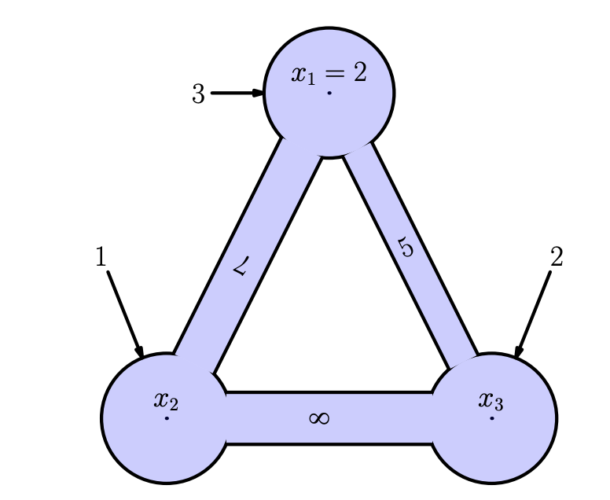
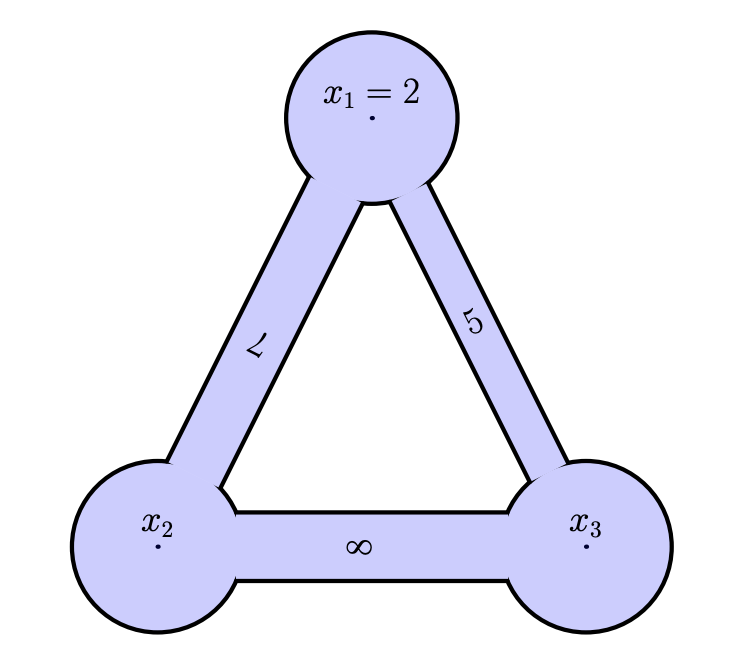

<!-- include the hint.js -->
<script src="../../hints.js"></script>

# Learning goals
* Understand the forward, backward and central spatial differencing scheme.
* Understand how to construct a matrix to solve a system of equations.
* Understand how to solve a steady-state system with spatial derivatives using matrix algebra.
* Understand the advection-diffusion equation and how to solve a stationary form.

# Part 1 - Introduction
## Section 1.1 - Advection Diffusion Equation 
The aim of the finite difference approach is to learn a basic method to discretize differential equations in space and time. A prominent example in our field, is the advection-diffusion equation. The formula for this equation is as follows:

$$\frac{\partial s}{\partial t} = -u \frac{\partial s}{\partial x} + D\frac{\partial^{2}s}{\partial x^{2}}$$
where $s$ can be any species that can be transported, $u$ is the fluid (water or air) velocity, $D$ is the diffusivity, $x$ is the position, and $t$ is time. This equation contains space and time derivatives and is therefore a *partial differential equation*. For this tutorial, you will study first this equation under stationary conditions ($\frac{\partial s}{\partial t} = 0$):

$$0 = -u \frac{\partial s}{\partial x} + D\frac{\partial^{2}s}{\partial x^{2}}$$


## Section 1.2 - Backward and Central Differencing method
In the previous practical, we have been working with the following formula:
$$\dfrac{ds}{dt} \approx \dfrac{s(t+\Delta t) - s(t)}{\Delta t}$$
This is called the *forward differencing method*. It calculates derivatives based on the actual time value ($t$) and that one step ahead ($t + \Delta t$) The methodology of solving equations in space is exactly the same, only the mathematical formulation changes slightly:

$$\dfrac{ds}{dx} \approx \dfrac{s(x+\Delta x) - s(x)}{\Delta x}$$
The only change in this equation is that time has been substituted by space. By using this formulation you change the dimension, meaning that you will find out the how fast variable $s$ changes in space rather than in time.

There is generally a difference in perspective in how space and time are used. In the case of time, you use the derivative to advance a system in time: you want to know the state of the system $s$ at a next time step. In space, however, in most usecases, you are presented with the spatial field of $s$, where the gradients are unknown. In space, next to the forward differencing methods, we also often make use of the *backward differencing method* and the *centered differencing* method.

First, we will go through the mathematical derivation. The forward differencing method in space, uses the location at which the derivatives are calculated and the point right (forward in space) of it:

$$s(x + \Delta x) = s(x) + \Delta x \frac{ds}{dx} \bigg\rvert_{x} + \frac{\Delta x^{2}}{2!} \frac{d^{2}s}{dx^{2}} \bigg\rvert_{x} + \frac{\Delta x^{3}}{3!} \frac{d^{3}s}{dx^{3}} \bigg\rvert_{x} + \frac{\Delta x^{4}}{4!} \frac{d^{4}s}{dx^{4}} \bigg\rvert_{x} + \ \cdots     $$

The backward scheme looks back along the space axis (in negative direction) and is defined as follows:

$$s(x - \Delta x) = s(x) - \Delta x \frac{ds}{dx} \bigg\rvert_{x} + \frac{\Delta x^{2}}{2!} \frac{d^{2}s}{dx^{2}} \bigg\rvert_{x} - \frac{\Delta x^{3}}{3!} \frac{d^{3}s}{dx^{3}} \bigg\rvert_{x} + \frac{\Delta x^{4}}{4!} \frac{d^{4}s}{dx^{4}} \bigg\rvert_{x} + \ \cdots     $$

Reworking this equation leads to the backward differencing scheme:

$$\frac{s(x) - s(x  - \Delta x)}{dx} = \frac{ds}{dx} + \cdots$$

The *central differencing scheme* is created by substracting the Taylor series used for the forward and backward schemes. It is called centered because it is symmetric. It uses one point forward (right) of where the derivative is calculated, and one point (left) backward.

\begin{alignat*}{3}
s(x + \Delta x) &= s(x) + && \dfrac{\Delta x}{1!} \dfrac{ds}{dx} \bigg\rvert_{x} + \dfrac{\Delta x^{2}}{2!} \dfrac{d^{2}s}{dx^{2}} \bigg\rvert_{x} + &&& \dfrac{\Delta x^{3}}{3!} \dfrac{d^{3}s}{dx^{3}} \bigg\rvert_{x} + \dfrac{\Delta x^{4}}{4!} \dfrac{d^{4}s}{dx^{4}} \bigg\rvert_{x} + \ ... \\    


s(x - \Delta x) &= s(x) - && \dfrac{\Delta x}{1!} \dfrac{ds}{dx} \bigg\rvert_{x} + \dfrac{\Delta x^{2}}{2!} \dfrac{d^{2}s}{dx^{2}} \bigg\rvert_{x} - &&&\dfrac{\Delta x^{3}}{3!} \dfrac{d^{3}s}{dx^{3}} \bigg\rvert_{x} + \dfrac{\Delta x^{4}}{4!} \dfrac{d^{4}s}{dx^{4}} \bigg\rvert_{x} - \ ...  \\

\hline \\

s(x + \Delta x) - s(x - \Delta x) &=  &&\dfrac{2\Delta x}{1!}\dfrac{ds}{dx} +  &&&\dfrac{2\Delta x^{3}}{3!} \dfrac{d^{3}s}{dx^{3}}
\end{alignat*}

It can be seen quite easily that this is an efficient scheme. The second and fourth derivative are canceled out by substraction, leaving an error term in the final equation that has the third derivative as largest contributor instead of the second. This reduces the error significantly. The final equation to express the first derivative is as follows:

$$\frac{s(x + \Delta x) - s(x - \Delta x)}{2\Delta x} = \frac{ds}{dx} + \cdots$$
<span class="exercise">
X.1 Calculate for each of the approximations the first error term (the next term that should come at the $\ldots$).
<br><br>
X.2 Can you explain from the error why the forward and backward differencing method have first-order error convergence, and the centered scheme has second-order error convergence?
</span>

In order to visualize the effects of the three different approximations, you will now implement each of them. You will compute the derivatives of $s(x) = \sin(x)$. This you will do for each of the three methods: forward, backward, and centered.

<span class="question">
X.1 Implement the calculations for the three different methods below.
<br><br>
X.2 Which of the three methods performs the best?
<br><br>
X.3 Decrease `dx`. Do all three methods converge to the correct result? Which one convergest fastest, and why?

```{r}
# Initial parameter values
left  = 0     # left x-coordinate
right = 2*pi  # right x-coordinate
dx    = pi/6  # delta x; time discretisation (0.25)

# Simulation initialisation
space.sequence = seq(left, right, by=dx)
dsdx.forward  = rep(0, length(space.sequence))
dsdx.backward = rep(0, length(space.sequence))
dsdx.centered = rep(0, length(space.sequence))
s = sin(space.sequence)

# Add the calculations of forward, backward, centered derivative below.

# Plotting
plot(space.sequence, dsdx.forward, type='o', xlab="x (m)", ylab="dsdx", ylim = c(-1.5, 1.5), col="blue")
lines(space.sequence, dsdx.backward, type='o', col="red")
lines(space.sequence, dsdx.centered, type='o', col="green")
space.sequence = seq(left, right, by=0.01)
analyt.state = cos(space.sequence)
lines(space.sequence, analyt.state, col='black', lty=3)
legend("top", legend=c("forward", "backward", "centered", "analytical"), col=c("blue", "red", "green", "black"), lty=c(1,1,1,3), bty="n")
title(main='Numerical and analytical solution compared')
grid()
```
</span>

<span class="answer">
```{r}
# Initial parameter values
left  = 0     # left x-coordinate
right = 2*pi  # right x-coordinate
dx    = pi/6  # delta x; time discretisation (0.25)

# Simulation initialisation
space.sequence = seq(left, right, by=dx)
dsdx.forward = rep(0, length(space.sequence))
dsdx.backward = rep(0, length(space.sequence))
dsdx.centered = rep(0, length(space.sequence))
s = sin(space.sequence)

# Add the calculations of forward, backward, centered derivative below.
dsdx.forward [1:(length(s)-1)] = (s[2:length(s)] - s[1:(length(s)-1)]) / dx
dsdx.backward[2:length(s)]     = (s[2:length(s)] - s[1:(length(s)-1)]) / dx
dsdx.centered[2:(length(s)-1)] = (s[3:length(s)] - s[1:(length(s)-2)]) / (2*dx)

# Add the boundaries on the left
dsdx.backward[1] = (s[2]-s[1]) / dx
dsdx.centered[1] = (s[2]-s[1]) / dx

# Add the boundaries on the right
dsdx.forward [length(s)] = (s[length(s)]-s[length(s)-1]) / dx
dsdx.centered[length(s)] = (s[length(s)]-s[length(s)-1]) / dx

# Plotting
plot(space.sequence, dsdx.forward, type='o', xlab="x (m)", ylab="dsdx", ylim = c(-1.5, 1.5), col="blue")
lines(space.sequence, dsdx.backward, type='o', col="red")
lines(space.sequence, dsdx.centered, type='o', col="green")
space.sequence = seq(left, right, by=0.01)
analyt.state = cos(space.sequence)
lines(space.sequence, analyt.state, col='black', lty=3)
legend("top", legend=c("forward", "backward", "centered", "analytical"), col=c("blue", "red", "green", "black"), lty=c(1,1,1,3), bty="n")
title(main='Numerical and analytical solution compared')
grid()
```
</span>

# Part 2 - Matrix calculation intermezzo
### Exercise 1
Further in this tutorial, and the next one, we will use matrix algebra intensively. This part is a short tutorial in working with with matrices in the R environment.

A formal definition of a matrix is a collection of numbers organized in rows and columns. The following lines of codes construct a matrix:

```{R}
M = matrix (c(1, 2, 3, 4, 5, 6) , nrow=2)
print(M)
```

The code lines above made a matrix by giving all the values in the construction itself. Once constructed, values of a matrix can be changed in different ways.

<span class="question">
1.1 How many rows and how many columns has this matrix?
</span>

<span class="answer">
2 rows, 3 columns
</answer>

<span class="question">
1.2 Describe for each of the following lines the changes made to the matrix M
```{R}
M[1,2]= 100
M[1, ]= c(10, 11, 12)
M[ ,2]= c(-1 ,-2)
```
</span>

<span class="question">
1.3 What is the difference between the matrix constructed in the first subquestion and the matrix construced by:
```{R}
M = matrix(c(1, 2, 3, 4, 5, 6), nrow=2 , ncol=3)
```
</span>

<span class="question">
1.4 What is the difference between the matrix constructed in the first subquestion and the matrix constructed by:
```{R}
M = matrix(c(1, 2, 3, 4, 5, 6) , nrow=2 , ncol=2)
```
</span>

<span class="question">
1.5 What is the difference between the matrix constructed in the first subquestion and the matrix constructed by:
```{R}
M = matrix(c(1, 2, 3, 4, 5, 6) , nrow=2 , ncol=4)
```
</span>

<span class="question">
1.7 What is the difference between the matrix constructed in the first subquestion and the matrix construced by:
```{R}
M = matrix(c(1, 2, 3, 4, 5, 6) , nrow=2 , ncol=3 , byrow=TRUE)
```
</span>

### Exercise 2
The matrix constructions in the previous question where very explicit. Many
matrices (certainly large ones) can more efficiently be constructed by loops. The following lines of code give an example (and prints the result):

```{R}
M = matrix(0, nrow=5, ncol=7)
for(i in 1:nrow(M)) {
  for(j in 1:ncol(M)) {
    M[i,j]=i+j
  }
}
print(M)
```

<span class="question">
2.1 Make code with a double loop as above that constructs the following matrix:

```{}
> print(M)
     [,1] [,2] [,3] [,4] [,5]
[1,]   11   12   13   14   15
[2,]   21   22   23   24   25
[3,]   31   32   33   34   35
```
</span>

<span class="answer">
```{R}
M = matrix(0,nrow=3,ncol=5)
for(i in 1:nrow(M)) {
  for(j in 1:ncol(M)){
    M[i,j]=10*i+j
  }
}
print(M)
```
</span>

<span class="question">
2.2 Make code with a double loop as above that constructs the following matrix:

```{}
> print(M)
     [,1][,2][,3][,4][,5]
[1,]    0   1   2   3   4
[2,]    1   0   1   2   3
[3,]    2   1   0   1   2
[4,]    3   2   1   0   1
[5,]    4   3   2   1   0
```
</span>

<span class="answer">
```{R}
M = matrix(0,nrow=5,ncol=5)
for(i in 1:nrow(M)) {
  for(j in 1:ncol(M)){
    M[i,j]=abs(i-j)
  }
}
print(M)
```
</span>

### Exercise 3
These exercise are an introduction to the solution of linear equations. The following linear equations:

$$
\begin{align}
 2x_1 + x_2 -  x_3 = 8\\
-3x_1 - x_2 + 2x_3 = -11\\
-2x_1 + x_2 + 2x_3 = -3
\end{align}
$$
are rewritten in matrix form:

$$
\begin{matrix}
A\ x &=& b\\
\begin{bmatrix}
2&1&-1\\-3&-1&2\\-2&1&2
\end{bmatrix}
\begin{bmatrix}
x_1\\x_2\\x_2
\end{bmatrix}
&=&
\begin{bmatrix}
8\\-11\\-3
\end{bmatrix}
\end{matrix}
$$
This system of equations can be solved in the following way, where $I$ is the [identity matrix](https://en.wikipedia.org/wiki/Identity_matrix).
$$
Ax = b\\
A^{-1}Ax = A^{-1}b\\
Ix = A^{-1}b\\
x = A^{-1}b
$$
By hand this can be done with [Gaussian elimination](https://en.wikipedia.org/wiki/Gaussian_elimination). If unfamiliar with this method or if in need of a quick refresher, the following video might be instructive; https://www.youtube.com/watch?v=xCIXkm3-ocQ 

After implementing the matrices the system can be solved for $x$ in the following in R:

```{}
x = solve(A,b)
```

<span class="question">
3.1 Calculate this equation first by hand and check your solution by solving it in R.
</span>

<span class="answer">
$$
\begin{bmatrix}
x_1\\x_2\\x_2
\end{bmatrix} = 
\begin{bmatrix}
2\\3\\-1
\end{bmatrix}
$$
</span>

<span class="question">
3.2 Find the solution (as done above) of the following equations:
$$
\begin{align}
x_1 = 4\\
-x_1 + 2x_2 - x_3 = 1\\
-x_2 + 2x_3 - x_4 = 1\\
-x_3 + 2x_4 - x_5 = 1\\
x_5 = 2
\end{align}
$$
</span>

<span class="answer">
```{R}
A = matrix(c(1,0,0,0,0,-1,2,-1,0,0,0,-1,2,-1,0,0,0,-1,2,-1,0,0,0,0,1),nrow=5,ncol=5,byrow=TRUE)
b = matrix(c(4,1,1,1,2),nrow=5)
print(solve(A,b))
```
</span>

The equations above can be generalized for any integer N into:
$$ 
\begin{matrix}
& &&x_1 &=& 4\\
&\ i\ \in\ \left[2, N-1 \right] && -x_{i-1} + 2x_i-x_{i+1} &=& 1\\
& &&x_N &=& 2
\end{matrix}
$$

Write code that generates the matrices for the equations above and
solves them. Use the following lines as a starter:

```{R}
N = 5
A = matrix(0,nrow=N,ncol=N)
b = rep(1,length=N)
```

<span class="question">
3.3 Finish this code.
<br><br>
3.4 Check that for N=5 the result of the previous question is recalculated.
<br><br>
3.5 Make a plot of the result for N=25.
</span>

<span class="answer">
```{R}
N      = 25
A      = matrix(0,nrow=N,ncol=N)
b      = rep(1,length=N)
A[1,1] = 1
b[1]   = 4
b[N]   = 2
A[N,N] = 1
for(i in 2:(N-1)){
  A[i,i  ] = 2
  A[i,i-1] = -1
  A[i,i+1] = -1
}
print(solve(A,b))
plot(solve(A,b))
```
</span>

### Exercise 4
In this question the translation of (stationary, discrete) flow problems into a set of linear equations is reviewed.

In what follows, flow problems will be defined by graphs such as:
</br>
{width=30%}

* The circles stand for cylinders with unknown fluid level for which a name is suggested inside this circle ($x_i$).
* Some of the levels inside the cylinders are prescribed (as is the case in the top cylinder of the example above); these prescribed values are boundary conditions.
* These cylinders are connected with pipes, whose cross sectional area are indicated inside the pipes by numbers. The flux between these cylinders is given by this area times the level differences between the cylinders connected.
* There can be external amounts of fluids added to the cylinders, as, for instance, the flux with number 3 to the top.

the fluxes between the cylinders is calculated by multiplying the gradient between the two cylinders and the cross sectional area. For example between $x_1$ and $x_2$ there is the following flow:

$$q_{1\to2} = 7(x_1-x_2)$$
which is equal to the flux going in the other direction:
$$q_{2\to1} = 7(x_2-x_1)$$
<span class="question">
4.1 Write down the other fluxes in the system (both forward and backward through the pipe)
</span>

<span class="answer">
$$
\begin{align}
q_{2\to3} &= 8(x_2-x_3)\\
q_{3\to2} &= 8(x_3-x_2)\\
\\
q_{3\to1} &= 5(x_3-x_1)\\
q_{1\to3} &= 5(x_1-x_3)
\end{align}
$$
</span>

From these equations mass balances can be set up. For example for cylinder $x_1$:

$$
\begin{align}
q_{2\to1} + q_{3\to1} + 3 = 0 \\
7(x_2-x_1) + 5(x_3-x_1) + 3 = 0
\end{align}
$$
<span class="question">
4.2 Set up the mass balances for $x_2$ and $x_3$
</span>

<span class="answer">
$$
\begin{align}
q_{3\to2} + q_{1\to2} + 1 = 0 \\
8(x_3-x_2) + 7(x_1-x_2) + 1 = 0\\
\\
q_{1\to3} + q_{2\to3} + 2 = 0 \\
5(x_1-x_3) + 8(x_2-x_3) + 2 = 0\\
\end{align}
$$
</span>

<span class="question">
4.3 Write the previous three mass balance equations in the form:
$$ax_1 + bx_2 + cx_3 = d$$
</span>

<span class="answer">
$$
\begin{align}
-12x_1 + 7x_2 + 5x_3 = -3\\
7x_1 - 15x_2 + 8x_3 = -1\\
5x_1 + 8x_2 -13x_3 = -2
\end{align}
$$
</span>

<span class="question">
4.4 Plug the previous equations in a matrix in the following way:

$$
\begin{align}
Ax &= b\\
\begin{bmatrix}
a_{1} & b_{1} & c_{1}\\a_{2} & b_{2} & c_{2}\\a_{3} & b_{3} & c_{3}
\end{bmatrix} \cdot
\begin{bmatrix}
x_1\\x_2\\x_3
\end{bmatrix} &=
\begin{bmatrix}
d_1\\d_2\\d_3
\end{bmatrix}
\end{align}
$$
</span>

<span class="answer">
$$
\begin{align}
\begin{bmatrix}
-12&7&5\\7&-15&8\\5&8&-13
\end{bmatrix} *
\begin{bmatrix}
x_1\\x_2\\x_3
\end{bmatrix} &=
\begin{bmatrix}
-3\\-1\\-2
\end{bmatrix}
\end{align}
$$
</span>

<span class="question">
4.5 Put the boundary condition $x_1 = 2$ into the matrix
</span>

<span class="answer">
$$
\begin{align}
\begin{bmatrix}
1&0&0\\7&-15&8\\5&8&-13
\end{bmatrix} *
\begin{bmatrix}
x_1\\x_2\\x_3
\end{bmatrix} &=
\begin{bmatrix}
2\\-1\\-2
\end{bmatrix}
\end{align}
$$
</span>

<span class="question">
4.6 Implement this equation in R and write down the x vector
</span>

<span class="answer">
```{R}
M=matrix(0,nrow=3,ncol=3)
# bring flux between 1and 2 in matrix
M[1,1] = M[1,1]-7
M[1,2] = M[1,2]+7
M[2,2] = M[2,2]-7
M[2,1] = M[2,1]+7
# bring flux between 1 and 3 in matrix
M[1,1] = M[1,1]-5
M[1,3] = M[1,3]+5
M[3,3] = M[3,3]-5
M[3,1] = M[3,1]+5
# bring flux between 2 and 3 in matrix
M[2,2] = M[2,2]-8
M[2,3] = M[2,3]+8
M[3,3] = M[3,3]-8
M[3,2] = M[3,2]+8
# bring in the boundary condition
M[1,]  = 0
M[1,1] = 1
# right hand side
b = c(2,-1,-2)
print(solve(M,b))
```
</span>

<span class="question">
4.7 Solve the system depicted in the following scheme and explain the result: 
</br>

{width=30%}

</span>

</span class="answer">
```{R}
M=matrix(0,nrow=3,ncol=3)
# bring flux between 1and 2 in matrix
M[1,1] = M[1,1]-7
M[1,2] = M[1,2]+7
M[2,2] = M[2,2]-7
M[2,1] = M[2,1]+7
# bring flux between 1 and 3 in matrix
M[1,1] = M[1,1]-5
M[1,3] = M[1,3]+5
M[3,3] = M[3,3]-5
M[3,1] = M[3,1]+5
# bring flux between 2 and 3 in matrix
M[2,2] = M[2,2]-8
M[2,3] = M[2,3]+8
M[3,3] = M[3,3]-8
M[3,2] = M[3,2]+8
# bring in the boundary condition
M[1,]  = 0
M[1,1] = 1
# right hand side
b = c(2,0,0)
print(solve(M,b))
```
There is nothing to disturb the system, so it will become a static state with a uniform final state.
</span>

This is the easiest way of implementing and solving systems with matrices. There are, however, smarter and faster ways of doing this. If you want to do a challenging exercise, open Exercise 0 in the `Finite_difference_2_extra.Rmd` file.

<span class="comment">
Exercise 6 in the pdf could be useful
</span>

# Part 3 - Standing wave
For the first example with the three differencing schemes we will examine the simplest wave equation possible, a sinus-function ($s(x) = \sin(x)$) with it's derivative that is the opposite cosine wave ($\frac{ds}{dx}=\cos(x)$). The first chunk is fully preprogrammed, it is exactly the same as the approach used for time integration. Easiest way to understand it is to work from left to right (instead of from the beginning to the end as we did with the time dimension). An forward integration scheme is used, meaning that information of one point is used to calculate the point directly to the right of it. Still the same stuff as in the previous practical but it's maybe a bit less intuitive. The following information about the system is available:

$$
\begin{matrix}
s(x) &=& sin(x)\\
\dfrac{ds}{dx} &=& cos(x)\\
\dfrac{s(x+\Delta x) - s(x)}{\Delta x} &=& \dfrac{ds}{dx}
\end{matrix}
$$
Leading to:
$$
\begin{matrix}
\dfrac{s(x+\Delta x) - s(x)}{\Delta x} &=& cos(x)\\
s(x+\Delta x) &=& s(x) + \Delta x cos(x)
\end{matrix}
$$

To implement this equation a boundary state should be set. In this case 0 is a logical choice. This is equivalent to setting an initial state for time integration. For ease if visualisation the right side coordinates (end.time in previous) is set to $2\pi$ and dx to $\frac{\pi}{6}$.  

<span class="comment"> This would be enough information to actually implement this chunk. Do we want to let them do that or does it cost too much time? </span>

```{r simple_forward}
# Initial parameter values
left          = 0     # usually this variable is set to 0
right         = 2*pi  # end time of the simulation (50)
dx            = pi/6  # delta t; time discretisation (0.25)
left.state    = 0     # state of the system at the beginning of the simulation

# Simulation initialisation
space         = left
result.state  = c(left.state)
result.space  = c(left)
current.state = left.state

sys.fun = function(space,state){
  return(state + dx*cos(space))
}

# Simulation
while(space < right)
{
  current.state = sys.fun(space,current.state)
  result.state  = c(result.state,current.state)
  space         = space + dx
  result.space  = c(result.space,space)
}

# Plotting
plot(result.space,result.state,type='o', xlab="x (m)",ylab="state (m)", ylim = c(-1.5,1.5), col="blue")
space.sequence = seq(left,right,by=0.05)
analyt.state=sin(space.sequence)
lines(space.sequence,analyt.state,col='grey',lwd=2)
title(main='Numerical and analytical solution compared')
grid()
```

As introduced in the Part 2 of this practical, this calculation can be done in a quicker way with exactly the same result by setting up a matrix equation. The following script is the same system as the one described above, but implemented by using matrix calculus. The first part sets up the initial parameters. V is the right hand side of the equation, M is the system matrix. Then the matrix and right hand side vector are populated. The equation is solved by running the solve(M,V) command and afterwards the result is plotted. Populating the matrix works as follows (as an example):

* First set up the nodes of the matrix: 5 (in the chunk more nodes are used)
* Defining the equations (square brackets don't signify the location of the coordinate but the index in the matrix):

$$
\begin{matrix}
\dfrac{s[2]}{\Delta x}  &=& \dfrac{s[1]}{\Delta x}  &+& cos(x)\\
\dfrac{s[3]}{\Delta x}  &=& \dfrac{s[2]}{\Delta x}  &+& cos(x)\\
\dfrac{s[4]}{\Delta x}  &=& \dfrac{s[3]}{\Delta x}  &+& cos(x)\\
\dfrac{s[5]}{\Delta x}  &=& \dfrac{s[4]}{\Delta x}  &+& cos(x)
\end{matrix}
$$

* Translating them to matrix, vector logic (with the vector entries on the right-hand side:

$$
\begin{matrix}
\dfrac{s[2]}{\Delta x}  &-& \dfrac{s[1]}{\Delta x}  &=& cos(x)\\
\dfrac{s[3]}{\Delta x}  &-& \dfrac{s[2]}{\Delta x}  &=& cos(x)\\
\dfrac{s[4]}{\Delta x}  &-& \dfrac{s[3]}{\Delta x}  &=& cos(x)\\
\dfrac{s[5]}{\Delta x}  &-& \dfrac{s[4]}{\Delta x}  &=& cos(x)\\
\end{matrix}
$$
This system is underfined if left like this (4 equations with 5 variables). A boundary condition is needed to solve this problem. The easiest boundary condition is the Dirichlet boundary condition where you prescribe one of the states as was done in the chunk above and also in the previous practical (a initial state). This is done with the following equation:

$$ s[1] = 0$$

<span class="question"> 
3.1 Insert the formulas stated above in the following matrix equation
$$ 
M * s = V:
$$
</span>

<span class="answer">
$$
\begin{bmatrix}
&1&.&.&.&.\\
&\frac{-1}{\Delta x}&\frac{1}{\Delta x}&.&.&.\\
&.&\frac{-1}{\Delta x}&\frac{1}{\Delta x}&.&.\\
&.&.&\frac{-1}{\Delta x}&\frac{1}{\Delta x}&.\\
&.&.&.&\frac{-1}{\Delta x}&\frac{1}{\Delta x}
\end{bmatrix}
* 
\begin{bmatrix}
s[1]\\ 
s[2]\\ 
s[3]\\ 
s[4]\\ 
s[5]
\end{bmatrix}
= 
\begin{bmatrix}
0\\
cos(x)\\ 
cos(x)\\ 
cos(x)\\ 
cos(x)
\end{bmatrix}
$$
</span>

To solve the states, matrix algebra is used:
$$
\begin{matrix}
M * s &=& V\\
M^{-1}M * s &=& M^{-1}V\\
I * s &=& M^{-1}V\\
s &=& M^{-1}V
\end{matrix}
$$
*where I is the identity matrix*

<span class="question">
3.2 A boundary value is needed to solve the equations. Explain the reason using matrix algebra
</span>

<span class="answer">
Determinant is 0, which means the matrix is ininvertable. This leads to an infinite amount of solutions for this equation.
</span>

<span class="question">

<span class="comment"> maybe the hard track can do this entirely by themselves </span>

3.3 complete the following chunk by constructing the matrix and inserting boundary values as shown above in mathematical notation. If everything went well you will end up with exactly the same plot as the one generated by chunk *simple forward*.
</span>

<span class="student_answer">
```{r matrix_forward, eval=FALSE}
rm(list=ls()) 

# setting up initial parameters
dx    = pi/6
left  = 0                      # left domain
right = 2*pi                   # right domain
xcoor = seq(left,right, by=dx) # builds a list of all coordinates

bl    = 0                      # left boundary condition
V     = c()                    # build an empty vector for the solutions
M     = matrix(0,nrow=length(xcoor),ncol=length(xcoor)) # an empty matrix for the differencing scheme

### FILL IN THE MATRIX AND VECTOR HERE

# solve matrix equation
s = solve(M,V)

# plotting
plot(xcoor,s,ylab="state (m)",xlab="x (m) ",type='o',col='blue', ylim=c(-1.5,1.5)) # numerical approximation
x_sol = seq(left,right,by=0.05)
lines(x_sol,sin(x_sol),type='l', col="grey",lwd=2)
title(main='Forward differencing scheme with matrices')
grid()
```
</span>

<span class="answer">
```{r matrix_forward_answer_left_boundary}
rm(list=ls()) 

# setting up initial parameters
dx    = pi/6
left  = 0
right = 2*pi
xcoor = seq(left,right, by=dx) # builds a list of all coordinates
N     = length(xcoor)

bl    = 0                      # left boundary condition
V     = c()                    # build an empty vector for the solutions
M     = matrix(0,nrow=length(xcoor),ncol=length(xcoor)) # an empty matrix for the differencing scheme

# populating vector and matrix
for(j in 2:(length(xcoor)))
{
  M[j,j]   = 1/dx
  M[j,j-1] = -1/dx
  V[j]     = cos(xcoor[j-1]) # it belongs to the j-1 step
}

# left boundary condtion
M[1,1]     = 1
V[1]       = bl

# solve matrix equation
s = solve(M,V)

# plotting
plot(xcoor,s,ylab="state (m)",xlab="x (m) ",type='o',col='blue', ylim=c(-1.5,1.5)) # numerical approximation
x_sol = seq(left,right,by=0.05)
lines(x_sol,sin(x_sol),type='l', col="grey",lwd=2)
title(main='Forward differencing scheme with matrices')
grid()
```

<span class="question">
3.4 Use the same system above but instead of using a left boundary condition of $s[1] = 0$, use $s[5] = 0$. Implement it using the previous chunk and show that this will result in exactly the same plot (because $\sin(0) = \sin(2\pi) = 0$). TIP! If needed write down the matrix by hand as done in the previous exercise.
</span>

<span class="answer">
```{r matrix_forward_answer}
rm(list=ls()) 

# setting up initial parameters
dx    = pi/6
left  = 0
right = 2*pi
xcoor = seq(left,right, by=dx) # builds a list of all coordinates
N     = length(xcoor)

br    = 0                      # left boundary condition
V     = c()                    # build an empty vector for the solutions
M     = matrix(0,nrow=length(xcoor),ncol=length(xcoor)) # an empty matrix for the differencing scheme

# populating vector and matrix
for(j in 1:(length(xcoor)-1))
{
  M[j,j]   = -1/dx
  M[j,j+1] = 1/dx
  V[j]     = cos(xcoor[j]) # it belongs to the j'th step
}

# left boundary condtion
M[N,N]     = 1
V[N]       = br

# solve matrix equation
s = solve(M,V)

# plotting
plot(xcoor,s,ylab="state (m)",xlab="x (m) ",type='o',col='blue', ylim=c(-1.5,1.5)) # numerical approximation
x_sol = seq(left,right,by=0.05)
lines(x_sol,sin(x_sol),type='l', col="grey",lwd=2)
title(main='Forward differencing scheme with matrices')
grid()
```
</span>

<span class="question">
3.5 Copy the previous chunk and adapt it to the backward differencing scheme (still explicit integration method)
</span>

<span class="answer">
```{r backward}
rm(list=ls()) 

# setting up initial parameters
dx    = pi/6
left  = 0
right = 2*pi
xcoor = seq(left,right, by=dx) # builds a list of all coordinates

bl    = 0                      # left boundary condition
V     = c()                    # build an empty vector for the solutions
M     = matrix(0,nrow=length(xcoor),ncol=length(xcoor)) # an empty matrix for the differencing scheme

# populating vector and matrix
for(j in 2:(length(xcoor)))
{
  M[j,j]   = 1
  M[j,j-1] = -1
  V[j]     = dx*cos(xcoor[j])
}

# left boundary condtion
M[1,1]     = 1
M[1,2]     = 0
V[1]       = bl

# solve matrix equation
s = solve(M,V)

# plotting
plot(xcoor,s,ylab="state (m)",xlab="x (m) ",type='o',col='blue', ylim=c(-1.5,1.5)) # numerical approximation
x_sol = seq(left,right,by=0.05)
lines(x_sol,sin(x_sol),type='l', col="grey",lwd=2)
title(main='Backward differencing scheme with matrices')
grid()
```
</class>

<span class="comment"> I remove central scheme here because it's slightly tricky but I come back to this in Part 4 </span>

# Part 4 - Differential field standing wave
## Section 4.1 - First order derivative
Part 3 showed how to solve a stationary system when to derivative is known (and at least one boundary condition). In most real world applications however this is not the case. In the final application you will have a system with observations at a certain time and the future values need be calculated based on thos observations. The observations themselves are not necessarily well behaved in a function, so also the derivative is not defined. Looking for example at the advection diffusion equation that was introduced in section 1.1, the derivatives in space need to be calculated to predict the values at the next time-step. 

Let's first look at the case of part 3; a sinus wave. Let's assume that we don't know any functions but only have observations of that sinus-wave and we want to define the derivative field of those observations. (The observations are in fact calculated with the function $f = \sin(x)$ and therefore the exact solution is known; a cosine wave).

To solve this problem the matrices defined in part 3 are still valid, with the difference that the states don't need to be calculated because they are already known but the right-hand side is unknown. 

$$
M*s = V
$$
$$
\begin{bmatrix}
&\frac{-1}{\Delta x}&\frac{1}{\Delta x}&.&.&.\\
&.&\frac{-1}{\Delta x}&\frac{1}{\Delta x}&.&.\\
&.&.&\frac{-1}{\Delta x}&\frac{1}{\Delta x}&.\\
&.&.&.&\frac{-1}{\Delta x}&\frac{1}{\Delta x}\\
&.&.&.&.&.
\end{bmatrix}
* 
\begin{bmatrix}
s[1]\\ 
s[2]\\ 
s[3]\\ 
s[4]\\ 
s[5]
\end{bmatrix}
= 
\begin{bmatrix}
cos(x)\\ 
cos(x)\\ 
cos(x)\\ 
cos(x)\\ 
.
\end{bmatrix}
$$
<span class="question">
4.1.1 Why does this matrix equation not need a boundary condition?
</span>

<span class="answer">
The calculation is direct so no inversion needs to take place. This means that there is no problem when there is a row of zeros.
</span>

<span class="question">
4.1.2 Calculate the the righthand-side of the equation above (by hand) and fill in the following table:
</span>

<span class="student_answer">

| Location  | Cosine value |
| ------------- | ------------- |
| $s[1] = s(0)$  |  |
| $s[2] = s(\frac{1}{2\pi})$  |  |
| $s[3] = s(\frac{2}{2\pi})$ |  |
| $s[4] = s(\frac{3}{2\pi})$ |  |
| $s[5] = s(2\pi)$  |  |

</span>

<span class="answer">

| Location  | Cosine value |
| ------------- | ------------- |
| $s[1] = s(0)$  | $\frac{2}{\pi}$ |
| $s[2] = s(\frac{1}{2\pi})$  | $-\frac{2}{\pi}$ |
| $s[3] = s(\frac{2}{2\pi})$ | $-\frac{2}{\pi}$ |
| $s[4] = s(\frac{3}{2\pi})$ | $\frac{2}{\pi}$ |
| $s[5] = s(2\pi)$  | `NA` |
</span>

<span class="question">
4.1.2 Run the following chunk to plot the results of the previous question and check your results.
</span>

<span class="comment"> The hard track might do this themselves, the other track might implement the matrix </span>

```{r forward_derivative}
rm(list=ls()) 

# setting up initial parameters
dx    = pi/2
left  = 0
right = 2*pi
xcoor = seq(left,right, by=dx) # builds a list of all coordinates

M     = matrix(0,nrow=length(xcoor),ncol=length(xcoor)) # an empty matrix for the differencing scheme

# populating vector and matrix
for(j in 1:(length(xcoor)-1))
{
  M[j,j]   = -1/dx
  M[j,j+1] = 1/dx
}

s = sin(xcoor)

# solve matrix equation
V = M %*% s

# plotting
N = length(xcoor)
plot(xcoor[1:(N-1)],V[1:(N-1)],ylab="state (m)",xlab="x (m) ",type='o',col='blue', ylim=c(-1.5,1.5), xlim = c(0,2*pi)) # numerical approximation
x_sol = seq(left,right,by=0.05)
lines(x_sol,cos(x_sol),type='l', col="grey",lwd=2)
title(main='Forward differencing scheme with matrices')
grid()
```
</span>

<span class="question">
4.1.3 What does the code `V = M %*% s` of the previous chunk do?
</span>

<span class="answer">
matrix multiplication
</span>

<span class="question">
4.1.4 Implement the backward and central scheme in the same way in the previous question and discuss their effectiveness.
</span>

<span class="answer">
```{r backward_derivative}
rm(list=ls()) 

# setting up initial parameters
dx    = pi/2
left  = 0
right = 2*pi
xcoor = seq(left,right, by=dx) # builds a list of all coordinates

M     = matrix(0,nrow=length(xcoor),ncol=length(xcoor)) # an empty matrix for the differencing scheme

# populating vector and matrix
for(j in 2:(length(xcoor)))
{
  M[j,j]   = +1/dx
  M[j,j-1] = -1/dx
}

s = sin(xcoor)

# solve matrix equation
V = M %*% s

# plotting
N = length(xcoor)
plot(xcoor[2:N],V[2:N],ylab="state (m)",xlab="x (m) ",type='o',col='blue', ylim=c(-1.5,1.5), xlim = c(0,2*pi)) # numerical approximation
x_sol = seq(left,right,by=0.05)
lines(x_sol,cos(x_sol),type='l', col="grey",lwd=2)
title(main='Backward differencing scheme with matrices')
grid()
```

```{r central_derivative}
rm(list=ls()) 

# setting up initial parameters
dx    = pi/2
left  = 0
right = 2*pi
xcoor = seq(left,right, by=dx) # builds a list of all coordinates
N     = length(xcoor)

M     = matrix(0,nrow=length(xcoor),ncol=length(xcoor)) # an empty matrix for the differencing scheme

# populating vector and matrix
for(j in 2:(length(xcoor)-1))
{
  M[j,j+1] = 1/(2*dx)
  M[j,j-1] = -1/(2*dx)
}

s = sin(xcoor)

# solve matrix equation
V = M %*% s

# plotting
N = length(xcoor)
plot(xcoor[2:(N-1)],V[2:(N-1)],ylab="state (m)",xlab="x (m) ",type='o',col='blue', ylim=c(-1.5,1.5), xlim = c(0,2*pi)) # numerical approximation
x_sol = seq(left,right,by=0.05)
lines(x_sol,cos(x_sol),type='l', col="grey",lwd=2)
title(main='Central differencing scheme with matrices')
grid()
```

The central scheme is clearly better but two points instead of one is valueluess so more boundary conditions are needed.
</span>

The problem with the previous three approaches is that they all have at least one point that has no value because it's out of the calculations reach. To solve this problem the methods might be combined to cover the whole range. This is done in the following way; starting from the matrix equation for the forward differencing method:

$$
\begin{bmatrix}
&\frac{-1}{\Delta x}&\frac{1}{\Delta x}&.&.&.\\
&.&\frac{-1}{\Delta x}&\frac{1}{\Delta x}&.&.\\
&.&.&\frac{-1}{\Delta x}&\frac{1}{\Delta x}&.\\
&.&.&.&\frac{-1}{\Delta x}&\frac{1}{\Delta x}\\
&.&.&.&.&.
\end{bmatrix}
* 
\begin{bmatrix}
s[1]\\ 
s[2]\\ 
s[3]\\ 
s[4]\\ 
s[5]
\end{bmatrix}
= 
\begin{bmatrix}
cos(x)\\ 
cos(x)\\ 
cos(x)\\ 
cos(x)\\ 
.
\end{bmatrix}
$$

On the last row there is no equation present. The easiest way to fill that up is to insert the approximation from the backward method into the matrix: 
$$ \dfrac{s[5]}{\Delta x} - \dfrac{s[4]}{\Delta x} = \dfrac{ds(x)}{dx}$$

<span class="question">
4.1.5 Insert this equation in the matrix equation above and implement this in the chunk `forward_derivative`.
</span>

<span class="answer">
```{r forward_derivative_extended}
rm(list=ls()) 

# setting up initial parameters
dx    = pi/2
left  = 0
right = 2*pi
xcoor = seq(left,right, by=dx) # builds a list of all coordinates
N     = length(xcoor)

M     = matrix(0,nrow=length(xcoor),ncol=length(xcoor)) # an empty matrix for the differencing scheme

# populating vector and matrix
for(j in 1:(length(xcoor)-1))
{
  M[j,j]   = -1/dx
  M[j,j+1] = 1/dx
}
M[N,N  ] = 1/dx
M[N,N-1] = -1/dx

s = sin(xcoor)

# solve matrix equation
V = M %*% s

# plotting
N = length(xcoor)
plot(xcoor[1:(N)],V[1:(N)],ylab="state (m)",xlab="x (m) ",type='o',col='blue', ylim=c(-1.5,1.5), xlim = c(0,2*pi)) # numerical approximation
x_sol = seq(left,right,by=0.05)
lines(x_sol,cos(x_sol),type='l', col="grey",lwd=2)
title(main='Forward differencing scheme with matrices')
grid()
```
</span>

<span class="question">
4.1.6 Complete the central differencing scheme with equations for the first and last node.
</span>

<span class="answer">
```{r central_derivative_extended}
rm(list=ls()) 

# setting up initial parameters
dx    = pi/2
left  = 0
right = 2*pi
xcoor = seq(left,right, by=dx) # builds a list of all coordinates
N     = length(xcoor)

M     = matrix(0,nrow=length(xcoor),ncol=length(xcoor)) # an empty matrix for the differencing scheme

# populating vector and matrix
for(j in 2:(length(xcoor)-1))
{
  M[j,j+1] = 1/(2*dx)
  M[j,j-1] = -1/(2*dx)
}
M[1,1  ] = -1/dx
M[1,2  ] = 1/dx
M[N,N  ] = 1/dx
M[N,N-1] = -1/dx


s = sin(xcoor)

# solve matrix equation
V = M %*% s

# plotting
N = length(xcoor)
plot(xcoor[1:(N)],V[1:(N)],ylab="state (m)",xlab="x (m) ",type='o',col='blue', ylim=c(-1.5,1.5), xlim = c(0,2*pi)) # numerical approximation
x_sol = seq(left,right,by=0.05)
lines(x_sol,cos(x_sol),type='l', col="grey",lwd=2)
title(main='Forward differencing scheme with matrices')
grid()
```
</span>

To evaluate the quality of these different approaches the absolute error between the approximated and real values can be added up. The hard track might implement this themselves in exercise 2 of the extended Rmd. The rest can go to the next question.

<span class="question">
4.1.7 Fill the following table of errors (average of the individial errors for the different schemes by running the following chunk
</span>

<span class="student_answer">

| dx | Forward differencing scheme | Central differencing scheme |
| ------------- | ------------- | ------------- |
| $\pi$ |  |  |
| $\frac{1}{2}\pi$ |  |  |
| $\frac{1}{3}\pi$ |  |  |
| $\frac{1}{4}\pi$ |  |  |
| $\frac{1}{5}\pi$ |  |  |
| $\frac{1}{10}\pi$ |  |  |
| $\frac{1}{20}\pi$ |  |  |

<button type="button" onclick="toggle('Q2')">Show chunk</button>

<div id="Q2" style="display: none">
```{r calculate_error_differencing_schemes, eval=F}
rm(list=ls()) 
library(shiny)

f = function(scheme = "C", dx=(pi/2)){
  
  # scheme C = central
  # scheme F = forward
  
  #### setting up initial parameters
  dx    = dx
  left  = 0
  right = 2*pi
  xcoor = seq(left,right, by=dx) # builds a list of all coordinates
  N     = length(xcoor)
  s     = sin(xcoor)
  c     = cos(xcoor)
  
  ##### CENTRAL SCHEME WITH FORWARD AND BACKWARD VALUES ON THE OUTER NODES
  
  M     = matrix(0,nrow=length(xcoor),ncol=length(xcoor)) # an empty matrix for the differencing scheme
  
  # populating vector and matrix
  for(j in 2:(length(xcoor)-1))
  {
    M[j,j+1] = 1/(2*dx)
    M[j,j-1] = -1/(2*dx)
  }
  M[1,1  ] = -1/dx
  M[1,2  ] = 1/dx
  M[N,N  ] = 1/dx
  M[N,N-1] = -1/dx
  
  # solve matrix equation
  V_c = M %*% s
  
  ##### FORWARD SCHEME WITH BACKWARD RIGHT NODE
  
  M     = matrix(0,nrow=length(xcoor),ncol=length(xcoor)) # an empty matrix for the differencing scheme
  
  # populating vector and matrix
  for(j in 1:(length(xcoor)-1))
  {
    M[j,j]   = -1/dx
    M[j,j+1] = 1/dx
  }
  M[N,N  ] = 1/dx
  M[N,N-1] = -1/dx
  
  # solve matrix equation
  V_f = M %*% s
  
  
  ##### PLOTTING
  if(scheme == "C"){
    ## plotting C
    plot(xcoor[1:(N)],V_c[1:(N)],ylab="state (m)",xlab="x (m) ",type='o',col='blue', ylim=c(-1.5,1.5), xlim = c(0,2*pi)) # numerical approximation
    x_sol = seq(left,right,by=0.05)
    lines(x_sol,cos(x_sol),type='l', col="grey",lwd=2)
    
    # including error and 
    error = mean(abs(c-V_c))
    for(i in 1:N){
      points(xcoor[i],V_c[i],col="green",pch=19)
      points(xcoor[i],c[i],pch=19)
      segments(xcoor[i],V_c[i],xcoor[i],c[i],col="red",lwd=2)
    }
    
    title(main=paste('Central scheme, error = ',as.character(round(error,3))))
    grid()
  }
  
  ## plotting F
  if(scheme == "F"){
    plot(xcoor[1:(N)],V_f[1:(N)],ylab="state (m)",xlab="x (m) ",type='o',col='blue', ylim=c(-1.5,1.5), xlim = c(0,2*pi)) # numerical approximation
    x_sol = seq(left,right,by=0.05)
    lines(x_sol,cos(x_sol),type='l', col="grey",lwd=2)
    grid()
    
    # including error and 
    error = mean(abs(c-V_f))
    for(i in 1:N){
      points(xcoor[i],V_f[i],col="green",pch=19)
      points(xcoor[i],c[i],pch=19)
      segments(xcoor[i],V_f[i],xcoor[i],c[i],col="red",lwd=2)
    }
    
    title(main=paste('Forward scheme, error = ',as.character(round(error,3))))
    grid()
  }
}

#########################################
ui <- fluidPage(
  
  # App title ----
  titlePanel("Calculate the error"),
  
  # Sidebar layout with input and output definitions ----
  sidebarLayout(
    
    # Sidebar panel for inputs ----
    sidebarPanel(
      
      selectInput("scheme", label="scheme", choices = list("Central differencing scheme"="C","Forward differencing scheme"="F")),
      sliderInput("dx", label  = HTML("dx (<sup>&Pi;</sup>&frasl;<sub>x</sub>):") , value=2, min = 1, max = 20, step = 1)
      
    ),
    
    # Main panel for displaying outputs ----
    mainPanel(
      
      # Output: Plot of the requested variable against mpg ----
      plotOutput("p")
      
      
      
    )
  )
)
server <- function(input, output) {
  output$p = renderPlot({f(scheme = input$scheme, dx = pi/(input$dx))})
}

shinyApp(ui, server)
```
</div>

</span>

<span class="answer">

| dx | Forward differencing scheme | Central differencing scheme |
| ------------- | ------------- | ------------- |
| $\pi$ |  |  |
| $\frac{1}{2}\pi$ |  |  |
| $\frac{1}{3}\pi$ |  |  |
| $\frac{1}{4}\pi$ |  |  |
| $\frac{1}{5}\pi$ |  |  |
| $\frac{1}{10}\pi$ |  |  |
| $\frac{1}{20}\pi$ |  |  |

</span>

## Section 4.2 - Second order derivative
In order to be able to solve the *stationary* advection diffusion equation one other thing remains to be explained; how to solve the second order derivative in the equation:

$$0 = -u \frac{\partial s}{\partial x} + D\frac{\partial^{2}s}{\partial x^{2}}$$

This can be done by going back to the Taylor series of the forward and backward method. What needs to be done is come to a solution that does not include the first order derivative anymore. The simplest way to do this is by adding the equations up in the following way:

<span class="comment">
might be done by the hard track
</span>

\begin{alignat*}{3}
s(x + \Delta x) &= &&s(x) + \dfrac{\Delta x}{1!} \dfrac{ds}{dx} \bigg\rvert_{x} + &&&\dfrac{\Delta x^{2}}{2!} \dfrac{d^{2}s}{dx^{2}} \bigg\rvert_{x} + \dfrac{\Delta x^{3}}{3!} \dfrac{d^{3}s}{dx^{3}} \bigg\rvert_{x} + &&&&\dfrac{\Delta x^{4}}{4!} \dfrac{d^{4}s}{dx^{4}} \bigg\rvert_{x} + \ \cdots \\    


s(x - \Delta x) &= &&s(x) - \dfrac{\Delta x}{1!} \dfrac{ds}{dx} \bigg\rvert_{x} + &&&\dfrac{\Delta x^{2}}{2!} \dfrac{d^{2}s}{dx^{2}} \bigg\rvert_{x} - \dfrac{\Delta x^{3}}{3!} \dfrac{d^{3}s}{dx^{3}} \bigg\rvert_{x} + &&&&\dfrac{\Delta x^{4}}{4!} \dfrac{d^{4}s}{dx^{4}} \bigg\rvert_{x} - \ \cdots  \\

\hline +\\

s(x + \Delta x) + s(x - \Delta x) &=  &&2s(x) + &&&\dfrac{2\Delta x^{2}}{2!} \dfrac{d^{2}s}{dx^{2}} \bigg\rvert_{x} + &&&&\dfrac{2\Delta x^{4}}{4!} \dfrac{d^{4}s}{dx^{4}} \bigg\rvert_{x}
\end{alignat*}

This leads to the following approximation for the second derivate (also called a Central scheme):

$$
\dfrac{ s(x + \Delta x) - 2s(x) + s(x - \Delta x)}{\Delta x^2} = \dfrac{d^{2}s}{dx^{2}}
$$

<span class="question">
4.2.1 Use this equation to estimate the second order derivative of the sinus wave, the same way as was done in section 4.1. TIP! The second derivative of $\sin(x)$ is $-\sin(x)$ which you can plot behind the approximation to check if everything went fine.
</span>

<span class="answer">
```{r central_second_derivative}
rm(list=ls()) 

# setting up initial parameters
dx    = pi/2
left  = 0
right = 2*pi
xcoor = seq(left,right, by=dx) # builds a list of all coordinates
N     = length(xcoor)

M     = matrix(0,nrow=length(xcoor),ncol=length(xcoor)) # an empty matrix for the differencing scheme

# populating vector and matrix
for(j in 2:(length(xcoor)-1))
{
  M[j,j+1] = 1/(dx^2)
  M[j,j  ] = -2/(dx^2)
  M[j,j-1] = 1/(dx^2)
}

s = sin(xcoor)

# solve matrix equation
V = M %*% s

# plotting
N = length(xcoor)
plot(xcoor[2:(N-1)],V[2:(N-1)],ylab="state (m)",xlab="x (m) ",type='o',col='blue', ylim=c(-1.5,1.5), xlim = c(0,2*pi)) # numerical approximation
x_sol = seq(left,right,by=0.05)
lines(x_sol,-sin(x_sol),type='l', col="grey",lwd=2)
title(main='Forward differencing scheme with matrices')
grid()
```
</span>

# Part 5 - Advection diffusion continued 
## Section 5.1 - Boundary conditions
Part 3 and 4 handled only the simplest of differential equations but some useful insights might be obtained. The first and most important one is that there are two different ways of solving the equations; one after the other (as the method used in the *time* practical) and one levaraging the power and simplicity of matrix algebra. The more comlex the equations become, the harder it becomes to implement the first methodology while the solution based on matrix algebra does not get much more difficult. Especially in the next practical, when we will be looking at both time and space integration at the same time, the matrix solution is much more straightforward. The other important message is that boundary conditions are important to solve ODEs. In the "time" practical this was present in an initial state and in the chunks above left and right boundary conditions had to be implemented. So far we have only implemented one type of boundary condition; the dirichlet boundary condition. This method assumes a fixed state on one or all boundaries. If the state directly next to this border has (more or less) the same state, it means that no flux goes over the boundary while a large difference leads to a high flux. Another option is to implement a fixed gradient boundary condition (Neumann boundary condition) that does not specify the state but only the gradient between the boundary cell and the cell right next to it. This can be very usefull as will be shown in the next sections but at the same time it can be problematic. If all boundaries are fixed gradient boundaries, the system is not solvable. If only gradients are defined the solution will be relative and no absolute solution *can* exist. To account for this at least one Dirichlet boundary is needed to anchor the solution. It works as a reference for all other values. The last type of boundary condition is the Cauchy/Robin boundary condition. It specifies both the state and the gradient. Summarising;

* Dirichlet (fixed state)
* Neumann (fixed gradient)
* Cauchy/Robin (fixed state and fixed gradient)

<span class="comment">
This is a quick summary of boundary conditions, but do we want to give it like this or should the students find this out for themselves?
</span>

## Section 5.2 - Implementation with Dirichlet boundary conditions
<span class="question">
5.2.1 Implement the stationary advection diffusion equation (second equation section 1.1) with 5 nodes (n=5) and two Dirichlet boundaries (left=0 and right=1) in the following notation:

<span class="comment">
Is this too hard for the regular track?
</span>

$$
\begin{bmatrix}
M_{1,1}&&\dots&&M_{1,n}\\
&&&&\\
\vdots&&\ddots&&\vdots\\
&&&&\\
M_{n,1}&&\dots&&M_{n,n}\\
\end{bmatrix} * 
\begin{bmatrix}
s[1]\\
s[2]\\
s[3]\\
s[4]\\
s[5]\\
\end{bmatrix} = 
\begin{bmatrix}
V_1\\
V_2\\
V_3\\
V_4\\
V_5\\
\end{bmatrix}
$$
</span>

<span class="answer">
$$
\begin{bmatrix}
1&.&.&.&.\\
-\frac{u}{2dx} - \frac{D}{dx^2}&\frac{2D}{dx^2}&\frac{u}{2dx} - \frac{D}{dx^2}&.&.\\
.&-\frac{u}{2dx} - \frac{D}{dx^2}&\frac{2D}{dx^2}&\frac{u}{2dx} - \frac{D}{dx^2}&.\\
.&.&-\frac{u}{2dx} - \frac{D}{dx^2}&\frac{2D}{dx^2}&\frac{u}{2dx} - \frac{D}{dx^2}\\
.&.&.&.&1
\end{bmatrix} * 
\begin{bmatrix}
s[1]\\
s[2]\\
s[3]\\
s[4]\\
s[5]\\
\end{bmatrix} = 
\begin{bmatrix}
b_l\\
V_2\\
V_3\\
V_4\\
b_r\\
\end{bmatrix}
$$
</span>

If you want to go deeper into the subject and implement this yourself, go to exercise 1 of the Finite_differences_2_extra.Rmd and skip the two following exercises here.

<span class="question">
5.2.2 Calculate the values in the matrix with $\Delta x = 5$, $D=5$ and $u=5$ and check if the following chunk yields the same matrix.
```{R}
dx    = 5    # step size
D     = 5    # diffusion coefficient
u     = 5    # advectio coefficient
bl    = 0    # left boundary
br    = 1    # right boundary
n     = 5    # amount of nodes

left  = 0    # left coordinate
xcoor = seq(left,dx*(n-1), by=dx)

V     = c()  # build an empty vector for the solutions
M     = matrix(0,nrow=length(xcoor),ncol=length(xcoor)) 

for(j in 2:(length(xcoor)-1))
{
  M[j,j-1] = -u/(2*dx) - D/(dx^2)
  M[j,j  ] = 2*D/(dx^2)
  M[j,j+1] = u/(2*dx) - D/(dx^2)
  V[j]     = 0
}

# Left boundary
M[1,1] = 1
V[1]   = bl

# Right boundary
M[n,n] = 1
V[n]   = br

# Solve the system
s = solve(M,V)

print(M)
```
</span>

<span class="question">
5.2.3 Run the following chunck to see the quality of the solution:
```{R}
dx    = 5    # step size
D     = 5    # diffusion coefficient
u     = 5    # advectio coefficient
bl    = 0    # left boundary
br    = 1    # right boundary
n     = 5    # amount of nodes

left  = 0    # left coordinate
xcoor = seq(left,dx*(n-1), by=dx)

V     = c()  # build an empty vector for the solutions
M     = matrix(0,nrow=length(xcoor),ncol=length(xcoor)) 

for(j in 2:(length(xcoor)-1))
{
  M[j,j-1] = -u/(2*dx) - D/(dx^2)
  M[j,j  ] = 2*D/(dx^2)
  M[j,j+1] = u/(2*dx) - D/(dx^2)
  V[j]     = 0
}

# Left boundary
M[1,1] = 1
V[1]   = bl

# Right boundary
M[n,n] = 1
V[n]   = br

# Solve the system
s = solve(M,V)

# Plotting
plot(xcoor,s,ylab="state (m)",xlab="x (m) ",type='o',col='blue')
title(main='Advection Diffusion Equation')
grid()

# Calculate and plot the analytical solution
L = dx*(n-1)
xcooranalyt = seq(0,L, by=0.01)
sanalyt = c()
Danalyt = D
uanalyt = u
Peanalyt = uanalyt*L/Danalyt

for(j in 1:(length(xcooranalyt)))
{
  sanalyt[j] = bl+(exp(xcooranalyt[j]*Peanalyt/L)-1.)/(exp(Peanalyt)-1.)*(br-bl)
}

lines(xcooranalyt,sanalyt,col="grey",lwd=2) # analytical solution
legend(10, 0.8, c("numerical", "analytical"), col = c("blue","grey"), lty = c(1,1), pch = c(-1,-1))
```
</span>

<span class="question"> 
5.2.4 The following chunk is the same system as analysed in the previous question. The only difference is that the domain is fixed from x=0 to x=50. Change `dx` from 10 to 1 in steps of 1 and compare the results. What is the highest value of `dx` for which the solution is stable?
```{R}
dx    = 10   # step size
D     = 5    # diffusion coefficient
u     = 5    # advectio coefficient
bl    = 0    # left boundary
br    = 1    # right boundary

left  = 0    # left coordinate
right = 50
xcoor = seq(left,right, by=dx)

V     = c()  # build an empty vector for the solutions
M     = matrix(0,nrow=length(xcoor),ncol=length(xcoor)) 

for(j in 2:(length(xcoor)-1))
{
  M[j,j-1] = -u/(2*dx) - D/(dx^2)
  M[j,j  ] = 2*D/(dx^2)
  M[j,j+1] = u/(2*dx) - D/(dx^2)
  V[j]     = 0
}

# Left boundary
M[1,1] = 1
V[1]   = bl

# Right boundary
n = length(xcoor)
M[n,n] = 1
V[n]   = br

# Solve the system
s = solve(M,V)

# Plotting
plot(xcoor,s,ylab="state (m)",xlab="x (m) ",type='o',col='blue')
title(main='Advection Diffusion Equation')
grid()

# Calculate and plot the analytical solution
L = dx*(n-1)
xcooranalyt = seq(0,L, by=0.01)
sanalyt = c()
Danalyt = D
uanalyt = u
Peanalyt = uanalyt*L/Danalyt

for(j in 1:(length(xcooranalyt)))
{
  sanalyt[j] = bl+(exp(xcooranalyt[j]*Peanalyt/L)-1.)/(exp(Peanalyt)-1.)*(br-bl)
}

lines(xcooranalyt,sanalyt,col="grey",lwd=2) # analytical solution
legend(10, 0.8, c("numerical", "analytical"), col = c("blue","grey"), lty = c(1,1), pch = c(-1,-1))
```

<span class="answer">
The solution becomes stable starting from dx=2 and below
</span>

## Section 5.2 - Implementation with a Neumann boundary condition
Hard track can go to exercise 3 in the extended Rmd to implement a Neumann boundary condition themselves, the rest can continue with this section here.

As an example we will look at a Neumann boundary with a gradient of $0.5$. In mathematical terms this means:

$$
\dfrac{ds}{dx} = 0.5
$$
To implement this on the right side of the system a backward scheme is used.

$$
\dfrac{ds}{dx} = \dfrac{s[5]-s[4]}{\Delta x}\\
s[5] - s[4] = 0.5 * \Delta x = \frac{\Delta x}{2}
$$

and inserted in the matrix:

$$
\begin{bmatrix}
1&.&.&.&.\\
-\frac{u}{2dx} - \frac{D}{dx^2}&\frac{2D}{dx^2}&\frac{u}{2dx} - \frac{D}{dx^2}&.&.\\
.&-\frac{u}{2dx} - \frac{D}{dx^2}&\frac{2D}{dx^2}&\frac{u}{2dx} - \frac{D}{dx^2}&.\\
.&.&-\frac{u}{2dx} - \frac{D}{dx^2}&\frac{2D}{dx^2}&\frac{u}{2dx} - \frac{D}{dx^2}\\
.&.&.&-1&1
\end{bmatrix} * 
\begin{bmatrix}
s[1]\\
s[2]\\
s[3]\\
s[4]\\
s[5]\\
\end{bmatrix} = 
\begin{bmatrix}
b_l\\
V_2\\
V_3\\
V_4\\
b_r = \frac{\Delta x}{2}\\
\end{bmatrix}
$$

<span class="question">
5.2.1 What would the graph look like? Complete the following chunk to incorporate the Neumann boundary condition (change the XXX's in the code).
<span>

<span class="student_answer">
```{R, eval=F}
dx    = 5    # step size
D     = 5    # diffusion coefficient
u     = 5    # advectio coefficient
bl    = 0    # left boundary
br    = XXX  # right boundary

left  = 0    # left coordinate
right = 50
xcoor = seq(left,right, by=dx)
N     = length(xcoor)

V     = c()  # build an empty vector for the solutions
M     = matrix(0,nrow=length(xcoor),ncol=length(xcoor)) 

for(j in 2:(length(xcoor)-1))
{
  M[j,j-1] = -u/(2*dx) - D/(dx^2)
  M[j,j  ] = 2*D/(dx^2)
  M[j,j+1] = u/(2*dx) - D/(dx^2)
  V[j]     = 0
}

# Boundary conditions
XXX

# Solve the system
s = solve(M,V)

# Plotting
plot(xcoor,s,ylab="state (m)",xlab="x (m) ",type='o',col='blue')
title(main='Advection Diffusion Equation, Neumann boundary')
grid()
```
</span>

<span class="answer">
```{R}
dx    = 5    # step size
D     = 5    # diffusion coefficient
u     = 5    # advectio coefficient
bl    = 0    # left boundary
br    = dx/2 # right boundary

left  = 0    # left coordinate
right = 50
xcoor = seq(left,right, by=dx)
N     = length(xcoor)

V     = c()  # build an empty vector for the solutions
M     = matrix(0,nrow=length(xcoor),ncol=length(xcoor)) 

for(j in 2:(length(xcoor)-1))
{
  M[j,j-1] = -u/(2*dx) - D/(dx^2)
  M[j,j  ] = 2*D/(dx^2)
  M[j,j+1] = u/(2*dx) - D/(dx^2)
  V[j]     = 0
}

# Left boundary
M[1,1] = 1
V[1]   = bl

# Right boundary

M[N,N]   = 1
M[N,N-1] = -1
V[N]     = br

# Solve the system
s = solve(M,V)

# Plotting
plot(xcoor,s,ylab="state (m)",xlab="x (m) ",type='o',col='blue')
title(main='Advection Diffusion Equation, Neumann boundary')
grid()
```
</span>

<span class="comment">
Do we want to implement the FDS/BDS and the UBS here as well?
</span>
