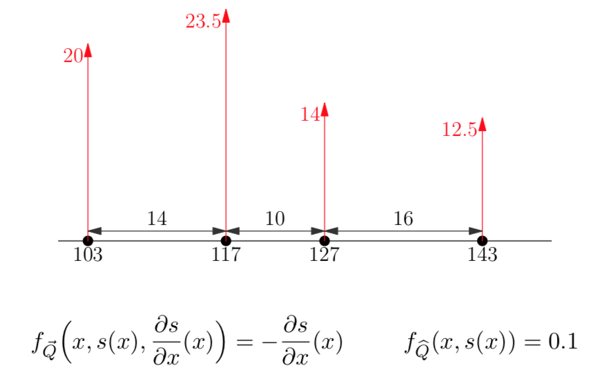

# Learning goal
* Understand the underlying principle of the FV/FD packages

# Introduction
For the assignments of this week, we have the FV/FD packages available that will take care of the numerics that are involved with solving differential equations using Finite Volumes and Finite Elements. The main principle used in the packages to solve the numerics is that non-linear systems (generally the ones that we are interested in) can be approximated with linear systems, iteratively evaluating the difference between the linear and non-linear system. This approach is called ???Newton-Raphson??? and frequently used in numerical mathematics. In this short assignment, you will build a Newton-Raphson solver from scratch and implement a simple Finite Volume example.

# Question 1
In the Finite Volume technique, given a certain state or in/outflux of a control volume, neighbouring volumes have to update their state to conserve the balance of the overall system. So basically, we search for the zero-point of the system (no change in overall balance).

<div class="question">
We have a linear system described by $f(x)=ax+b$, for which $x$ does the system $f$ equal zero? 
</div>

<span class="student_answer">
Fill in your answer...
</span>

<span class="answer">
For linear systems, we can answer this question directly. The system is described by $f(x) = ax+b$, we search for the point $f(\hat{x}) = 0$, so $\hat{x}=\frac{-b}{a}$. For linear systems, we only need one step to find the zero-point. 
</span>


# Question 2
Generally, the systems that we encounter in Earth sciences behave non-linear, and therefore we can not directly find the solution where the system equals zero. This requires iteration; the states of the control volumes have to be identified iteratively. What Newton-Raphson does, is linearize the non-linear function, obtain the zero-point, and compare this zero-point with the non-linear equation. It does this by using a method that we have seen in the Finite Difference practicals, by using the local derivative (or approximated derivative) of a function. In mathematical formulation the linearization looks like this:

$$
g(x) = \dfrac{df}{dx} = \dfrac{f(x+\Delta x) - f(x)}{\Delta x}
$$
This is the local derivative of $f$, based on which we can define a linear function $lin(x)=ax+b$. For this first example, we define following function $f(x)$:
$$
f(x) = x^2-10
$$

<span class="question"> 
1. Implement this function in R in the following chunk </br>
</span>

<span class="student_answer">
```{R eval=F}
f = function(x){
  return()
}
```
</span>

<span class="answer">
```{R eval=F}
f = function(x){
  return(x^2-10)
}
```
</span>

<span class="question"> 
2. Define the local derivative, $g$, and implement it in the following chunk.
</span>

<span class="student_answer">
```{R eval=F}
g = function(x, dx){
  return()
}
```
</span>

<span class="answer">
```{R}
g = function(x, dx){
  return((f(x+dx)-f(x))/dx)
}
```
</span>

<span class="question">
3.Now, use the function $f(x)$ and the local derivative $g(x,dx)$ to define a linear equation of the form $y=ax+b$ (because we know from the previous question how to find the zero-point for this equation). `root` is the $x$ where we take the local derivative (input for function $g(x)$): `root` is thus the point where we will linearize our non-linear function, and search for the zero-point of this linearized function.
</span>

<span class="student_answer">
```{R, eval=F}
lin = function(root, x, dx){
  return()
}
```
</span>

<span class="answer">
```{R}
lin = function(root,x,dx){
  a = g(root,dx)
  b = f(root)-a*root
  return(a*x+b)
}
```
</span>


<span class="question">
4. Now, set-up the equation to obtain the zero-point of the linearized function in the following chunk (see Question 1).
</span>
<span class="student_answer">
```{R eval=F}
x0 = 
```
</span>

<span class="answer">
```{R eval=F}
x0 = -f(root)-g(root,dx)*root / g(root,dx)
```
</span>

<span class="question">
5. Check that the function $lin$ yields zero when `x0` is plugged in; `lin(root,x0,dx)`, of course you will have to define a starting value (root) and a step size (dx)  yourself. Is the result of `f(x0)` also zero?
</span>

<span class="answer">
`f(x0)` does not equal or even approach zero with an initial guess (`root`) of 7. So, the zero-point of the linearized equation around x=7 is not close to the zero-point of the non-linear equation. Other initial guesses might lead to results closer to zero.
</span>


# Question 3
In the previous question, we only took one step; we linearized the non-linear function and searched for the zero-point in the linearized function. Subsequently, we compared if the zero-point of the linearized function was close to the zero-point of the non-linear function, by filling out the linearized zero-point in the non-linearized function. The Newton-Raphson algorithm will do this in the same way, but will repeat the procedure when the result for the non-linear function is too far off zero, based on a stopping-criterion. The algorithm will use the obtained zero-point for the linearized function as new estimate (`root`) for the next linearization of the non-linear function.

<span class="question"> 
Implement a Newton-Raphson algorithm for the equation given in the previous question, using a while-loop. The stopping criterion is 0.05, that means that the iteration may stop as soon as the non-linear function reaches a result of 0.05 (or lower). Plot the steps in the while-loop to see the process. Later, you can of course adapt the non-linear equation and the stopping-criterion.
</span>

```{R eval=F}
rm(list=ls())

f   = function(){}
g   = function(){}
lin = function(){}

root     =
dx       =
x        = #plot region
stopcrit = 0.05

while(f(root)>stopcrit){}
```

<span class="answer">
```{r}
rm(list=ls())
f = function(x){
  return(x^2-10)
}

g = function(x, dx){
  return((f(x+dx)-f(x))/dx)
}

lin = function(root, x, dx){
  a = g(root,dx)
  b = f(root)-a*root
  return(a*x+b)
}

root     = 7
dx       = 0.1
xs       = seq(0,10,by=0.1)
stopcrit = 0.05

while(f(root)>stopcrit){
  # plot
  plot(xs,f(xs),col="blue",type="l",lwd=2)
  lines(xs, lin(root,xs,dx),col="red",type="l",lty="dashed")
  abline(xs,0,lty="dotted")
  points(root,f(root))
  # obtain zero-point linear function
  x0 = -(f(root)-g(root,dx)*root)/g(root,dx)
  root = x0
}

# print answer
print(root)
# check answer
print(f(root))
```
</span>

Formally this method can be summarised as a series:
$$x_{n+1} = x_{n} - \dfrac{f(x_{n})}{f'(x_{n})}$$
For every step, a new $x_{n+1}$ can be calculated. Only $x_0$, the first guess, needs to be specified. The iteration is stopped when the estimated zero-point approaches the zero-point of the non-linear function (the stopping-criterion in the last assignment), or when the difference between iterations becomes too small while the stopping-criterion is not yet achieved (non-convergence; no solution).


# Question 4
The figure shows a simple Finite Volumes example. Four locations with different states, internal fluxes and an external flux are defined. In this question we will solve such a system with a Netwon-Raphson approach. It will lean on matrix calculations.

{width=400px}

First, the formulas need to be defined. The nodes will be called $n_1$ to $n_4$, from left to right. The first and last node have a fixed state $s$ with their value as displayed in the figure (the boundary conditions). The $Q_{external}$ for $n_2$ is the length of the volume times the flux coming from above: $(\frac{14}{2}+\frac{10}{2})*0.1 = 1.2$. The same goes for node $n_3$ with a total external flux of $1.3$.

The internal fluxes, $Q_{internal}$ will be defined as follows:
$$
Q_{L} = -\dfrac{s_{i}-s_{i-1}}{x_{i}-x_{i-1}}\\
Q_{R} = -\dfrac{s_{i+1}-s_{i}}{x_{i+1}-x_{i}}\\
$$
With the states, $s$, and $x$ the location of the nodes. Together, this leads to the following formulas for node $n_2$ and $n_3$:

$$
n_2 = Q_{L,2} - Q_{R,2} + Q_{external,2}\\
n_2 = -\dfrac{s_{2}-s_{1}}{x_{2}-x_{1}} + \dfrac{s_{3}-s_{2}}{x_{3}-x_{2}} + 1.2
$$

$$
n_3 = Q_{L,3} - Q_{R,3} + Q_{external,3}\\
n_3 = -\dfrac{s_{3}-s_{2}}{x_{3}-x_{2}} + \dfrac{s_{4}-s_{3}}{x_{4}-x_{3}} + 1.3
$$
This system of equations should equal 0 if the system is stationary, which can be solved with Newton-Raphson:

$$
f_2(s_2,s_3) = -\dfrac{s_{2}-s_{1}}{x_{2}-x_{1}} + \dfrac{s_{3}-s_{2}}{x_{3}-x_{2}} + 1.2\\
f_3(s_2,s_3) = -\dfrac{s_{3}-s_{2}}{x_{3}-x_{2}} + \dfrac{s_{4}-s_{3}}{x_{4}-x_{3}} + 1.3
$$
So we end up with two formulas, dependent on two variables ($s_2$ and $s_3$, remember that $s_1$ and $s_4$ are fixed as boundary conditions). The derivative of such a system is called the Jacobian and looks as follows:

$$
J =
\begin{bmatrix}
\dfrac{df_2}{ds_2}&\dfrac{df_2}{ds_3}\\
\dfrac{df_3}{ds_2}&\dfrac{df_3}{ds_3}
\end{bmatrix} 
$$

<span class="question">
Fill out the following chunk by replacing the XXX's to create the functions $f_2$ and $f_3$ and the Jacobian.
</span>
<span class="student_answer">
```{R eval=F}
x = c(103,117,127,143) # define locations
s = c(20,0,0,12.5)     # define fixed states plus initial guesses for s_2 and s_3
f_2 = function(s2,s3){
  misfit = XXX
  return(misfit)
}
f_3 = function(s2,s3){
  misfit = XXX
  return(misfit)
}
jacobian = function(s2,s3){
  ds = 0.01 # the delta state variable needed for the local derivative
  M  = matrix(0,nrow=2,ncol=2)
  M[1,1] = XXX
  M[1,2] = XXX
  M[2,1] = XXX
  M[2,2] = XXX
  return(M)
}
```
</span>

<span class="answer">
```{R}
rm(list=ls())
x = c(103,117,127,143) # define locations
s = c(20,1,1,12.5)     # define fixed states plus initial guesses for s_2 and s_3

f_2 = function(s2,s3){
  misfit = - (s2-s[1])/(x[2]-x[1]) + (s3-s2)/(x[3]-x[2]) + 1.2
  return(misfit)
}
f_3 = function(s2,s3){
  misfit = - (s3-s2)/(x[3]-x[2]) + (s[4]-s3)/(x[4]-x[3]) + 1.3
  return(misfit)
}

jacobian = function(s2,s3){
  ds = 0.01
  M  = matrix(0,nrow=2,ncol=2)
  M[1,1] = (f_2(s2+ds,s3) - f_2(s2,s3))/ds
  M[1,2] = (f_2(s2,s3+ds) - f_2(s2,s3))/ds
  M[2,1] = (f_3(s2+ds,s3) - f_3(s2,s3))/ds
  M[2,2] = (f_3(s2,s3+ds) - f_3(s2,s3))/ds
  return(M)
}
```
</span>

Coming back to the serial formulation of the Newton-Raphson method specified above:
$$x_{n+1} = x_{n} - \dfrac{f(x_{n})}{f'(x_{n})}$$
This can be translated directly into a matrix version:
$$x_{n+1} = x_{n} - J_n^{-1}\ f(x_{n})$$
in which $J_n^{-1}$ is the inverse of the Jacabian evaluated at $x_n$; $x_n$ is a vector.

<span class="question">
Now add a while-loop (like in the previous question) to the previous chunk, starting with the following line to define the stopping-criteria:</br>
`while(f_2(s2,s3)>0.01 | f_3(s2,s3)>0.01){`
</span>

<span class="answer">
```{R}
rm(list=ls())
x = c(103,117,127,143) # define locations
s = c(20,1,1,12.5)     # define fixed states plus initial guesses for s_2 and s_3

f_2 = function(s2,s3){
  misfit = - (s2-s[1])/(x[2]-x[1]) + (s3-s2)/(x[3]-x[2]) + 1.2
  return(misfit)
}
f_3 = function(s2,s3){
  misfit = - (s3-s2)/(x[3]-x[2]) + (s[4]-s3)/(x[4]-x[3]) + 1.3
  return(misfit)
}

jacobian = function(s2,s3){
  ds = 0.01
  M  = matrix(0,nrow=2,ncol=2)
  M[1,1] = (f_2(s2+ds,s3) - f_2(s2,s3))/ds
  M[1,2] = (f_2(s2,s3+ds) - f_2(s2,s3))/ds
  M[2,1] = (f_3(s2+ds,s3) - f_3(s2,s3))/ds
  M[2,2] = (f_3(s2,s3+ds) - f_3(s2,s3))/ds
  return(M)
}

s2 = s[2]
s3 = s[3]

while(f_2(s2,s3)>0.01 | f_3(s2,s3)>0.01){
  M    = jacobian(s2,s3)
  Minv = solve(M)
  s_new = c(s2,s3) - Minv %*% c(f_2(s2,s3),f_3(s2,s3))
  s2   = s_new[1]
  s3   = s_new[2]
  print(c(s2,s3))
}
```
</span>

<span class="question">
Why does this while-loop have only 1 iteration?
</span>

<span class="answer">
Because both equations only depend linearly on their input variables. Therefore, the linearization created with the local derivatives equals the actual function, leading directly to the root.
</span>

This method works quite well in relatively simple systems, but when the amount of nodes increases, the calculations become long and tedious really fast. Another problem is that the method depends on the inversion of the Jacobian, which is risky because it is not always invertable (leading to no solution). There are work-arounds for these problems, but they are outside the scope of this course. If interested, look at the documentation of the `nleqslv` package or follow the derivation via the following link: http://fourier.eng.hmc.edu/e176/lectures/NM/node21.html. During this course, we will make use of the `FVFE1D` and `FVFE2D` packages.
